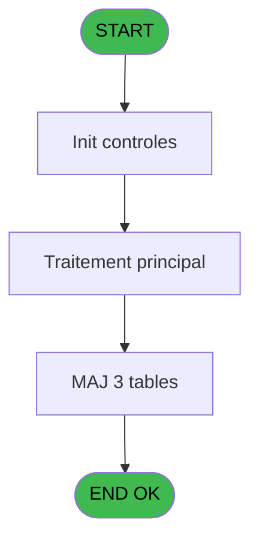

# REF IDE 697 - Regroupement Dossier

> **Analyse**: Phases 1-4 2026-02-03 13:45 -> 13:45 (20s) | Assemblage 13:45
> **Pipeline**: V7.2 Enrichi
> **Structure**: 4 onglets (Resume | Ecrans | Donnees | Connexions)

<!-- TAB:Resume -->

## 1. FICHE D'IDENTITE

| Attribut | Valeur |
|----------|--------|
| Projet | REF |
| IDE Position | 697 |
| Nom Programme | Regroupement Dossier |
| Fichier source | `Prg_697.xml` |
| Dossier IDE | General |
| Taches | 3 (1 ecrans visibles) |
| Tables modifiees | 3 |
| Programmes appeles | 0 |

## 2. DESCRIPTION FONCTIONNELLE

**Regroupement Dossier** assure la gestion complete de ce processus, accessible depuis [Groupage Mecano (IDE 693)](REF-IDE-693.md).

Le flux de traitement s'organise en **2 blocs fonctionnels** :

- **Traitement** (2 taches) : traitements metier divers
- **Creation** (1 tache) : insertion d'enregistrements en base (mouvements, prestations)

**Donnees modifiees** : 3 tables en ecriture (tempo_mecano_3_mec3, tempo_mecano_dossier, tempo_mecano_dossier_grou).

Detail : phases du traitement

#### Phase 1 : Traitement (2 taches)

- **697** - Veuillez patienter ... **[[ECRAN]](#ecran-t1)**
- **697.1** - Lecture par dossier **[[ECRAN]](#ecran-t2)**

#### Phase 2 : Creation (1 tache)

- **697.1.1** - Creation Sous-Groupage **[[ECRAN]](#ecran-t3)**

#### Tables impactees

| Table | Operations | Role metier |
|-------|-----------|-------------|
| tempo_mecano_dossier_grou | **W**/L (2 usages) | Table temporaire ecran |
| tempo_mecano_3_mec3 | **W** (1 usages) | Table temporaire ecran |
| tempo_mecano_dossier | **W** (1 usages) | Table temporaire ecran |

## 3. BLOCS FONCTIONNELS

### 3.1 Traitement (2 taches)

Traitements internes.

---

#### 697 - Veuillez patienter ... [[ECRAN]](#ecran-t1)

**Role** : Traitement : Veuillez patienter ....
**Ecran** : 425 x 58 DLU (MDI) | [Voir mockup](#ecran-t1)

---

#### 697.1 - Lecture par dossier [[ECRAN]](#ecran-t2)

**Role** : Traitement : Lecture par dossier.
**Ecran** : 248 x 206 DLU (MDI) | [Voir mockup](#ecran-t2)

### 3.2 Creation (1 tache)

Insertion de nouveaux enregistrements en base.

---

#### 697.1.1 - Creation Sous-Groupage [[ECRAN]](#ecran-t3)

**Role** : Creation d'enregistrement : Creation Sous-Groupage.
**Ecran** : 248 x 206 DLU (MDI) | [Voir mockup](#ecran-t3)

## 5. REGLES METIER

*(Aucune regle metier identifiee)*

## 6. CONTEXTE

- **Appele par**: [Groupage Mecano (IDE 693)](REF-IDE-693.md)
- **Appelle**: 0 programmes | **Tables**: 3 (W:3 R:0 L:1) | **Taches**: 3 | **Expressions**: 3

<!-- TAB:Ecrans -->

## 8. ECRANS

### 8.1 Forms visibles (1 / 3)

| # | Position | Tache | Nom | Type | Largeur | Hauteur | Bloc |
|---|----------|-------|-----|------|---------|---------|------|
| 1 | 697 | 697 | Veuillez patienter ... | MDI | 425 | 58 | Traitement |

### 8.2 Mockups Ecrans

---

#### 697 - Veuillez patienter ...
**Tache** : [697](#t1) | **Type** : MDI | **Dimensions** : 425 x 58 DLU
**Bloc** : Traitement | **Titre IDE** : Veuillez patienter ...

<!-- FORM-DATA:
{
    "width":  425,
    "vFactor":  8,
    "type":  "MDI",
    "hFactor":  8,
    "controls":  [
                     {
                         "x":  0,
                         "type":  "label",
                         "var":  "",
                         "y":  0,
                         "w":  423,
                         "fmt":  "",
                         "name":  "",
                         "h":  29,
                         "color":  "",
                         "text":  "",
                         "parent":  null
                     },
                     {
                         "x":  120,
                         "type":  "label",
                         "var":  "",
                         "y":  10,
                         "w":  221,
                         "fmt":  "",
                         "name":  "",
                         "h":  8,
                         "color":  "7",
                         "text":  "Traitement en cours ...",
                         "parent":  null
                     },
                     {
                         "x":  0,
                         "type":  "label",
                         "var":  "",
                         "y":  29,
                         "w":  423,
                         "fmt":  "",
                         "name":  "",
                         "h":  27,
                         "color":  "",
                         "text":  "",
                         "parent":  null
                     },
                     {
                         "x":  69,
                         "type":  "label",
                         "var":  "",
                         "y":  38,
                         "w":  286,
                         "fmt":  "",
                         "name":  "",
                         "h":  8,
                         "color":  "",
                         "text":  "Groupement dossiers",
                         "parent":  null
                     },
                     {
                         "x":  4,
                         "type":  "image",
                         "var":  "",
                         "y":  2,
                         "w":  72,
                         "fmt":  "",
                         "name":  "",
                         "h":  25,
                         "color":  "",
                         "text":  "",
                         "parent":  null
                     }
                 ],
    "taskId":  "697",
    "height":  58
}
-->

## 9. NAVIGATION

Ecran unique: **Veuillez patienter ...**

### 9.3 Structure hierarchique (3 taches)

| Position | Tache | Type | Dimensions | Bloc |
|----------|-------|------|------------|------|
| **697.1** | [**Veuillez patienter ...** (697)](#t1) [mockup](#ecran-t1) | MDI | 425x58 | Traitement |
| 697.1.1 | [Lecture par dossier (697.1)](#t2) [mockup](#ecran-t2) | MDI | 248x206 | |
| **697.2** | [**Creation Sous-Groupage** (697.1.1)](#t3) [mockup](#ecran-t3) | MDI | 248x206 | Creation |

### 9.4 Algorigramme

> **Legende**: Vert = START/END OK | Rouge = END KO | Bleu = Decisions
> *Algorigramme auto-genere. Utiliser `/algorigramme` pour une synthese metier detaillee.*

<!-- TAB:Donnees -->

## 10. TABLES

### Tables utilisees (3)

| ID | Nom | Description | Type | R | W | L | Usages |
|----|-----|-------------|------|---|---|---|--------|
| 606 | tempo_mecano_3_mec3 | Table temporaire ecran | TMP |   | **W** |   | 1 |
| 608 | tempo_mecano_dossier | Table temporaire ecran | TMP |   | **W** |   | 1 |
| 609 | tempo_mecano_dossier_grou | Table temporaire ecran | TMP |   | **W** | L | 2 |

### Colonnes par table (0 / 3 tables avec colonnes identifiees)

Table 606 - tempo_mecano_3_mec3 (**W**) - 1 usages

*Table utilisee uniquement en Link ou aucune colonne Real identifiee dans le DataView.*

Table 608 - tempo_mecano_dossier (**W**) - 1 usages

*Table utilisee uniquement en Link ou aucune colonne Real identifiee dans le DataView.*

Table 609 - tempo_mecano_dossier_grou (**W**/L) - 2 usages

*Table utilisee uniquement en Link ou aucune colonne Real identifiee dans le DataView.*

## 11. VARIABLES

*(Programme sans variables locales mappees)*

## 12. EXPRESSIONS

**3 / 3 expressions decodees (100%)**

### 12.1 Repartition par type

| Type | Expressions | Regles |
|------|-------------|--------|
| CONSTANTE | 1 | 0 |
| REFERENCE_VG | 1 | 0 |
| OTHER | 1 | 0 |

### 12.2 Expressions cles par type

#### CONSTANTE (1 expressions)

| Type | IDE | Expression | Regle |
|------|-----|------------|-------|
| CONSTANTE | 3 | `1` | - |

#### REFERENCE_VG (1 expressions)

| Type | IDE | Expression | Regle |
|------|-----|------------|-------|
| REFERENCE_VG | 1 | `VG1` | - |

#### OTHER (1 expressions)

| Type | IDE | Expression | Regle |
|------|-----|------------|-------|
| OTHER | 2 | `[B]` | - |

<!-- TAB:Connexions -->

## 13. GRAPHE D'APPELS

### 13.1 Chaine depuis Main (Callers)

Main -> ... -> [Groupage Mecano (IDE 693)](REF-IDE-693.md) -> **Regroupement Dossier (IDE 697)**

### 13.2 Callers

| IDE | Nom Programme | Nb Appels |
|-----|---------------|-----------|
| [693](REF-IDE-693.md) | Groupage Mecano | 1 |

### 13.3 Callees (programmes appeles)

### 13.4 Detail Callees avec contexte

| IDE | Nom Programme | Appels | Contexte |
|-----|---------------|--------|----------|
| - | (aucun) | - | - |

## 14. RECOMMANDATIONS MIGRATION

### 14.1 Profil du programme

| Metrique | Valeur | Impact migration |
|----------|--------|-----------------|
| Lignes de logique | 30 | Programme compact |
| Expressions | 3 | Peu de logique |
| Tables WRITE | 3 | Impact modere |
| Sous-programmes | 0 | Peu de dependances |
| Ecrans visibles | 1 | Ecran unique ou traitement batch |
| Code desactive | 0% (0 / 30) | Code sain |
| Regles metier | 0 | Pas de regle identifiee |

### 14.2 Plan de migration par bloc

#### Traitement (2 taches: 2 ecrans, 0 traitement)

- **Strategie** : 2 composant(s) UI (Razor/React) avec formulaires et validation.
- Decomposer les taches en services unitaires testables.

#### Creation (1 tache: 1 ecran, 0 traitement)

- **Strategie** : Repository pattern avec Entity Framework Core.
- Insertion via `IRepository<T>.CreateAsync()`

### 14.3 Dependances critiques

| Dependance | Type | Appels | Impact |
|------------|------|--------|--------|
| tempo_mecano_3_mec3 | Table WRITE (Temp) | 1x | Schema + repository |
| tempo_mecano_dossier | Table WRITE (Temp) | 1x | Schema + repository |
| tempo_mecano_dossier_grou | Table WRITE (Temp) | 1x | Schema + repository |

---
*Spec DETAILED generee par Pipeline V7.2 - 2026-02-03 13:45*
