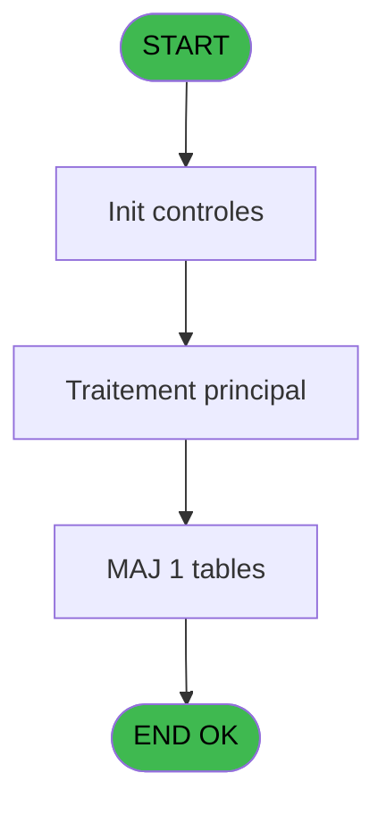
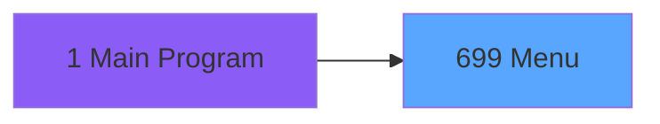
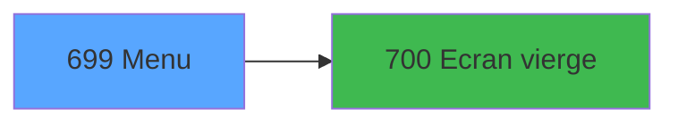

# REF IDE 699 - Menu

> **Analyse**: Phases 1-4 2026-02-03 13:46 -> 13:46 (20s) | Assemblage 13:46
> **Pipeline**: V7.2 Enrichi
> **Structure**: 4 onglets (Resume | Ecrans | Donnees | Connexions)

<!-- TAB:Resume -->

## 1. FICHE D'IDENTITE

| Attribut | Valeur |
|----------|--------|
| Projet | REF |
| IDE Position | 699 |
| Nom Programme | Menu |
| Fichier source | `Prg_699.xml` |
| Dossier IDE | Navigation |
| Taches | 1 (1 ecrans visibles) |
| Tables modifiees | 1 |
| Programmes appeles | 1 |

## 2. DESCRIPTION FONCTIONNELLE

**Menu** assure la gestion complete de ce processus, accessible depuis [Main Program (IDE 1)](REF-IDE-1.md).

Le flux de traitement s'organise en **1 blocs fonctionnels** :

- **Traitement** (1 tache) : traitements metier divers

**Donnees modifiees** : 1 tables en ecriture (Table_741).

**Logique metier** : 1 regles identifiees couvrant conditions metier.

## 3. BLOCS FONCTIONNELS

### 3.1 Traitement (1 tache)

Traitements internes.

---

#### 699 - Menu [[ECRAN]](#ecran-t1)

**Role** : Traitement : Menu.
**Ecran** : 1108 x 470 DLU (MDI) | [Voir mockup](#ecran-t1)
**Delegue a** : [Ecran vierge (IDE 700)](REF-IDE-700.md)

## 5. REGLES METIER

1 regles identifiees:

### Autres (1 regles)

#### [RM-001] Si Left([E] alors 1)='*' sinon 48,2)

| Element | Detail |
|---------|--------|
| **Condition** | `Left([E]` |
| **Si vrai** | 1)='*' |
| **Si faux** | 48,2) |
| **Expression source** | Expression 7 : `IF(Left([E],1)='*',48,2)` |
| **Exemple** | Si Left([E] → 1)='*'. Sinon → 48,2) |

## 6. CONTEXTE

- **Appele par**: [Main Program (IDE 1)](REF-IDE-1.md)
- **Appelle**: 1 programmes | **Tables**: 1 (W:1 R:0 L:0) | **Taches**: 1 | **Expressions**: 7

<!-- TAB:Ecrans -->

## 8. ECRANS

### 8.1 Forms visibles (1 / 1)

| # | Position | Tache | Nom | Type | Largeur | Hauteur | Bloc |
|---|----------|-------|-----|------|---------|---------|------|
| 1 | 699 | 699 | Menu | MDI | 1108 | 470 | Traitement |

### 8.2 Mockups Ecrans

---

#### 699 - Menu
**Tache** : [699](#t1) | **Type** : MDI | **Dimensions** : 1108 x 470 DLU
**Bloc** : Traitement | **Titre IDE** : Menu

<!-- FORM-DATA:
{
    "width":  1108,
    "vFactor":  8,
    "type":  "MDI",
    "hFactor":  4,
    "controls":  [
                     {
                         "x":  1019,
                         "type":  "label",
                         "var":  "",
                         "y":  76,
                         "w":  82,
                         "fmt":  "",
                         "name":  "",
                         "h":  24,
                         "color":  "142",
                         "text":  "Version 1.00 du 23/10/2013",
                         "parent":  null
                     },
                     {
                         "x":  1016,
                         "type":  "label",
                         "var":  "",
                         "y":  109,
                         "w":  82,
                         "fmt":  "",
                         "name":  "",
                         "h":  56,
                         "color":  "142",
                         "text":  "L\u0027application \u0027MASTER\u0027 permet d\u0027intervenir SANS AUCUN CONTROLE sur l\u0027ensemble des éléments de votre base de données...",
                         "parent":  null
                     },
                     {
                         "x":  1023,
                         "type":  "label",
                         "var":  "",
                         "y":  174,
                         "w":  74,
                         "fmt":  "",
                         "name":  "",
                         "h":  20,
                         "color":  "143",
                         "text":  "SOYEZ VIGILANTS !...",
                         "parent":  null
                     },
                     {
                         "x":  203,
                         "type":  "label",
                         "var":  "",
                         "y":  5,
                         "w":  804,
                         "fmt":  "",
                         "name":  "",
                         "h":  461,
                         "color":  "195",
                         "text":  "Group",
                         "parent":  null
                     },
                     {
                         "x":  217,
                         "type":  "label",
                         "var":  "",
                         "y":  440,
                         "w":  50,
                         "fmt":  "",
                         "name":  "",
                         "h":  9,
                         "color":  "142",
                         "text":  "Commentaire",
                         "parent":  5
                     },
                     {
                         "x":  4,
                         "type":  "edit",
                         "var":  "",
                         "y":  8,
                         "w":  194,
                         "fmt":  "",
                         "name":  "Treeview",
                         "h":  458,
                         "color":  "146",
                         "text":  "",
                         "parent":  null
                     },
                     {
                         "x":  207,
                         "type":  "subform",
                         "var":  "",
                         "y":  20,
                         "w":  796,
                         "fmt":  "",
                         "name":  "SF",
                         "h":  415,
                         "color":  "",
                         "text":  "",
                         "parent":  5
                     },
                     {
                         "x":  1034,
                         "type":  "image",
                         "var":  "",
                         "y":  23,
                         "w":  48,
                         "fmt":  "",
                         "name":  "",
                         "h":  37,
                         "color":  "",
                         "text":  "",
                         "parent":  null
                     },
                     {
                         "x":  1018,
                         "type":  "button",
                         "var":  "",
                         "y":  433,
                         "w":  77,
                         "fmt":  "\u0026Quitter",
                         "name":  "Quitter",
                         "h":  18,
                         "color":  "",
                         "text":  "",
                         "parent":  null
                     },
                     {
                         "x":  273,
                         "type":  "edit",
                         "var":  "",
                         "y":  440,
                         "w":  727,
                         "fmt":  "",
                         "name":  "TVM_Commentaire",
                         "h":  22,
                         "color":  "48",
                         "text":  "",
                         "parent":  5
                     }
                 ],
    "taskId":  "699",
    "height":  470
}
-->

<strong>Champs : 2 champs</strong>

| Pos (x,y) | Nom | Variable | Type |
|-----------|-----|----------|------|
| 4,8 | Treeview | - | edit |
| 273,440 | TVM_Commentaire | - | edit |

<strong>Boutons : 1 boutons</strong>

| Bouton | Pos (x,y) | Action |
|--------|-----------|--------|
| Quitter | 1018,433 | Quitte le programme |

## 9. NAVIGATION

Ecran unique: **Menu**

### 9.3 Structure hierarchique (1 tache)

| Position | Tache | Type | Dimensions | Bloc |
|----------|-------|------|------------|------|
| **699.1** | [**Menu** (699)](#t1) [mockup](#ecran-t1) | MDI | 1108x470 | Traitement |

### 9.4 Algorigramme

> **Legende**: Vert = START/END OK | Rouge = END KO | Bleu = Decisions
> *Algorigramme auto-genere. Utiliser `/algorigramme` pour une synthese metier detaillee.*

<!-- TAB:Donnees -->

## 10. TABLES

### Tables utilisees (1)

| ID | Nom | Description | Type | R | W | L | Usages |
|----|-----|-------------|------|---|---|---|--------|
| 741 | Table_741 |  | MEM |   | **W** |   | 1 |

### Colonnes par table (0 / 1 tables avec colonnes identifiees)

Table 741 - Table_741 (**W**) - 1 usages

*Table utilisee uniquement en Link ou aucune colonne Real identifiee dans le DataView.*

## 11. VARIABLES

*(Programme sans variables locales mappees)*

## 12. EXPRESSIONS

**7 / 7 expressions decodees (100%)**

### 12.1 Repartition par type

| Type | Expressions | Regles |
|------|-------------|--------|
| CONDITION | 4 | 5 |
| CONSTANTE | 1 | 0 |
| OTHER | 1 | 0 |
| STRING | 1 | 0 |

### 12.2 Expressions cles par type

#### CONDITION (4 expressions)

| Type | IDE | Expression | Regle |
|------|-----|------------|-------|
| CONDITION | 7 | `IF(Left([E],1)='*',48,2)` | [RM-001](#rm-RM-001) |
| CONDITION | 6 | `[E]<>''` | - |
| CONDITION | 5 | `[D]=''` | - |
| CONDITION | 2 | `[D]<>''` | - |

#### CONSTANTE (1 expressions)

| Type | IDE | Expression | Regle |
|------|-----|------------|-------|
| CONSTANTE | 1 | `1` | - |

#### OTHER (1 expressions)

| Type | IDE | Expression | Regle |
|------|-----|------------|-------|
| OTHER | 4 | `[D]` | - |

#### STRING (1 expressions)

| Type | IDE | Expression | Regle |
|------|-----|------------|-------|
| STRING | 3 | `Trim([C])` | - |

<!-- TAB:Connexions -->

## 13. GRAPHE D'APPELS

### 13.1 Chaine depuis Main (Callers)

Main -> ... -> [Main Program (IDE 1)](REF-IDE-1.md) -> **Menu (IDE 699)**

### 13.2 Callers

| IDE | Nom Programme | Nb Appels |
|-----|---------------|-----------|
| [1](REF-IDE-1.md) | Main Program | 1 |

### 13.3 Callees (programmes appeles)

### 13.4 Detail Callees avec contexte

| IDE | Nom Programme | Appels | Contexte |
|-----|---------------|--------|----------|
| [700](REF-IDE-700.md) | Ecran vierge | 1 | Sous-programme |

## 14. RECOMMANDATIONS MIGRATION

### 14.1 Profil du programme

| Metrique | Valeur | Impact migration |
|----------|--------|-----------------|
| Lignes de logique | 9 | Programme compact |
| Expressions | 7 | Peu de logique |
| Tables WRITE | 1 | Impact faible |
| Sous-programmes | 1 | Peu de dependances |
| Ecrans visibles | 1 | Ecran unique ou traitement batch |
| Code desactive | 0% (0 / 9) | Code sain |
| Regles metier | 1 | Quelques regles a preserver |

### 14.2 Plan de migration par bloc

#### Traitement (1 tache: 1 ecran, 0 traitement)

- **Strategie** : 1 composant(s) UI (Razor/React) avec formulaires et validation.
- 1 sous-programme(s) a migrer ou a reutiliser depuis les services existants.
- Decomposer les taches en services unitaires testables.

### 14.3 Dependances critiques

| Dependance | Type | Appels | Impact |
|------------|------|--------|--------|
| Table_741 | Table WRITE (Memory) | 1x | Schema + repository |
| [Ecran vierge (IDE 700)](REF-IDE-700.md) | Sous-programme | 1x | Normale - Sous-programme |

---
*Spec DETAILED generee par Pipeline V7.2 - 2026-02-03 13:46*
