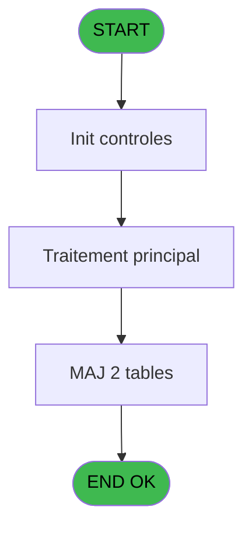

# REF IDE 701 - Import menu

> **Analyse**: Phases 1-4 2026-02-03 13:47 -> 13:47 (23s) | Assemblage 13:47
> **Pipeline**: V7.2 Enrichi
> **Structure**: 4 onglets (Resume | Ecrans | Donnees | Connexions)

<!-- TAB:Resume -->

## 1. FICHE D'IDENTITE

| Attribut | Valeur |
|----------|--------|
| Projet | REF |
| IDE Position | 701 |
| Nom Programme | Import menu |
| Fichier source | `Prg_701.xml` |
| Dossier IDE | Navigation |
| Taches | 5 (0 ecrans visibles) |
| Tables modifiees | 2 |
| Programmes appeles | 0 |
| :warning: Statut | **ORPHELIN_POTENTIEL** |

## 2. DESCRIPTION FONCTIONNELLE

**Import menu** assure la gestion complete de ce processus.

Le flux de traitement s'organise en **3 blocs fonctionnels** :

- **Creation** (2 taches) : insertion d'enregistrements en base (mouvements, prestations)
- **Traitement** (2 taches) : traitements metier divers
- **Consultation** (1 tache) : ecrans de recherche, selection et consultation

**Donnees modifiees** : 2 tables en ecriture (Table_741, Table_751).

Detail : phases du traitement

#### Phase 1 : Traitement (2 taches)

- **701** - Import menu
- **701.1** - Import menu new

#### Phase 2 : Creation (2 taches)

- **701.2** - Creation niveau
- **701.3** - creation master

#### Phase 3 : Consultation (1 tache)

- **701.2.1** - Recherche id parent

#### Tables impactees

| Table | Operations | Role metier |
|-------|-----------|-------------|
| Table_751 | R/**W**/L (3 usages) |  |
| Table_741 | **W** (2 usages) |  |

## 3. BLOCS FONCTIONNELS

### 3.1 Traitement (2 taches)

Traitements internes.

---

#### 701 - Import menu

**Role** : Traitement : Import menu.

---

#### 701.1 - Import menu new

**Role** : Traitement : Import menu new.

### 3.2 Creation (2 taches)

Insertion de nouveaux enregistrements en base.

---

#### 701.2 - Creation niveau

**Role** : Creation d'enregistrement : Creation niveau.

---

#### 701.3 - creation master

**Role** : Creation d'enregistrement : creation master.

### 3.3 Consultation (1 tache)

Ecrans de recherche et consultation.

---

#### 701.2.1 - Recherche id parent

**Role** : Traitement : Recherche id parent.
**Variables liees** : A (V.id parent)

## 5. REGLES METIER

*(Aucune regle metier identifiee)*

## 6. CONTEXTE

- **Appele par**: (aucun)
- **Appelle**: 0 programmes | **Tables**: 2 (W:2 R:1 L:1) | **Taches**: 5 | **Expressions**: 2

<!-- TAB:Ecrans -->

## 8. ECRANS

*(Programme sans ecran visible)*

## 9. NAVIGATION

### 9.3 Structure hierarchique (5 taches)

| Position | Tache | Type | Dimensions | Bloc |
|----------|-------|------|------------|------|
| **701.1** | [**Import menu** (701)](#t1) | - | - | Traitement |
| 701.1.1 | [Import menu new (701.1)](#t2) | - | - | |
| **701.2** | [**Creation niveau** (701.2)](#t3) | - | - | Creation |
| 701.2.1 | [creation master (701.3)](#t5) | - | - | |
| **701.3** | [**Recherche id parent** (701.2.1)](#t4) | - | - | Consultation |

### 9.4 Algorigramme

> **Legende**: Vert = START/END OK | Rouge = END KO | Bleu = Decisions
> *Algorigramme auto-genere. Utiliser `/algorigramme` pour une synthese metier detaillee.*

<!-- TAB:Donnees -->

## 10. TABLES

### Tables utilisees (2)

| ID | Nom | Description | Type | R | W | L | Usages |
|----|-----|-------------|------|---|---|---|--------|
| 741 | Table_741 |  | MEM |   | **W** |   | 2 |
| 751 | Table_751 |  | MEM | R | **W** | L | 3 |

### Colonnes par table (1 / 2 tables avec colonnes identifiees)

Table 741 - Table_741 (**W**) - 2 usages

| Lettre | Variable | Acces | Type |
|--------|----------|-------|------|
| A | V.id parent | W | Numeric |
| B | V.Rupture profondeur | W | Numeric |

Table 751 - Table_751 (R/**W**/L) - 3 usages

*Table utilisee uniquement en Link ou aucune colonne Real identifiee dans le DataView.*

## 11. VARIABLES

### 11.1 Variables de session (2)

Variables persistantes pendant toute la session.

| Lettre | Nom | Type | Usage dans |
|--------|-----|------|-----------|
| A | V.id parent | Numeric | - |
| B | V.Rupture profondeur | Numeric | - |

## 12. EXPRESSIONS

**2 / 2 expressions decodees (100%)**

### 12.1 Repartition par type

| Type | Expressions | Regles |
|------|-------------|--------|
| CALCULATION | 2 | 0 |

### 12.2 Expressions cles par type

#### CALCULATION (2 expressions)

| Type | IDE | Expression | Regle |
|------|-----|------------|-------|
| CALCULATION | 2 | `CallProg('{680,-1}'PROG,DbName('{741,-1}'DSOURCE))` | - |
| CALCULATION | 1 | `DbDel('{751,-1}'DSOURCE,'')` | - |

<!-- TAB:Connexions -->

## 13. GRAPHE D'APPELS

### 13.1 Chaine depuis Main (Callers)

**Chemin**: (pas de callers directs)

### 13.2 Callers

| IDE | Nom Programme | Nb Appels |
|-----|---------------|-----------|
| - | (aucun) | - |

### 13.3 Callees (programmes appeles)

### 13.4 Detail Callees avec contexte

| IDE | Nom Programme | Appels | Contexte |
|-----|---------------|--------|----------|
| - | (aucun) | - | - |

## 14. RECOMMANDATIONS MIGRATION

### 14.1 Profil du programme

| Metrique | Valeur | Impact migration |
|----------|--------|-----------------|
| Lignes de logique | 93 | Programme compact |
| Expressions | 2 | Peu de logique |
| Tables WRITE | 2 | Impact faible |
| Sous-programmes | 0 | Peu de dependances |
| Ecrans visibles | 0 | Ecran unique ou traitement batch |
| Code desactive | 0% (0 / 93) | Code sain |
| Regles metier | 0 | Pas de regle identifiee |

### 14.2 Plan de migration par bloc

#### Traitement (2 taches: 0 ecran, 2 traitements)

- **Strategie** : 2 service(s) backend injectable(s) (Domain Services).
- Decomposer les taches en services unitaires testables.

#### Creation (2 taches: 0 ecran, 2 traitements)

- **Strategie** : Repository pattern avec Entity Framework Core.
- Insertion via `IRepository<T>.CreateAsync()`

#### Consultation (1 tache: 0 ecran, 1 traitement)

- **Strategie** : Composants de recherche/selection en modales.

### 14.3 Dependances critiques

| Dependance | Type | Appels | Impact |
|------------|------|--------|--------|
| Table_741 | Table WRITE (Memory) | 2x | Schema + repository |
| Table_751 | Table WRITE (Memory) | 1x | Schema + repository |

---
*Spec DETAILED generee par Pipeline V7.2 - 2026-02-03 13:47*
