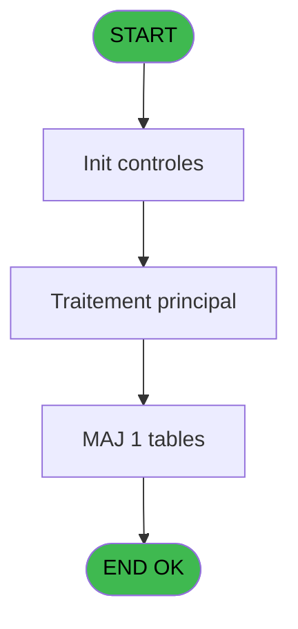

# REF IDE 705 - Saisie email

> **Analyse**: Phases 1-4 2026-02-03 13:49 -> 13:49 (18s) | Assemblage 13:49
> **Pipeline**: V7.2 Enrichi
> **Structure**: 4 onglets (Resume | Ecrans | Donnees | Connexions)

<!-- TAB:Resume -->

## 1. FICHE D'IDENTITE

| Attribut | Valeur |
|----------|--------|
| Projet | REF |
| IDE Position | 705 |
| Nom Programme | Saisie email |
| Fichier source | `Prg_705.xml` |
| Dossier IDE | General |
| Taches | 4 (1 ecrans visibles) |
| Tables modifiees | 1 |
| Programmes appeles | 1 |
| :warning: Statut | **ORPHELIN_POTENTIEL** |

## 2. DESCRIPTION FONCTIONNELLE

**Saisie email** assure la gestion complete de ce processus.

Le flux de traitement s'organise en **3 blocs fonctionnels** :

- **Traitement** (2 taches) : traitements metier divers
- **Creation** (1 tache) : insertion d'enregistrements en base (mouvements, prestations)
- **Saisie** (1 tache) : ecrans de saisie utilisateur (formulaires, champs, donnees)

**Donnees modifiees** : 1 tables en ecriture (email).

**Logique metier** : 2 regles identifiees couvrant conditions metier, valeurs par defaut.

Detail : phases du traitement

#### Phase 1 : Saisie (1 tache)

- **705** - Saisie email **[[ECRAN]](#ecran-t1)**

#### Phase 2 : Traitement (2 taches)

- **705.1** - Update
- **705.2** - Lecture email

#### Phase 3 : Creation (1 tache)

- **705.3** - Creation email

#### Tables impactees

| Table | Operations | Role metier |
|-------|-----------|-------------|
| email | R/**W** (3 usages) |  |

## 3. BLOCS FONCTIONNELS

### 3.1 Saisie (1 tache)

L'operateur saisit les donnees de la transaction via 1 ecran (Saisie email).

---

#### 705 - Saisie email [[ECRAN]](#ecran-t1)

**Role** : Saisie des donnees : Saisie email.
**Ecran** : 626 x 131 DLU (MDI) | [Voir mockup](#ecran-t1)
**Variables liees** : I (p.i.Warning email vide), K (V email texte), L (V email cnil), M (V email report filiation), N (V email etat libelle)

### 3.2 Traitement (2 taches)

Traitements internes.

---

#### 705.1 - Update

**Role** : Traitement : Update.

---

#### 705.2 - Lecture email

**Role** : Traitement : Lecture email.
**Variables liees** : I (p.i.Warning email vide), K (V email texte), L (V email cnil), M (V email report filiation), N (V email etat libelle)

### 3.3 Creation (1 tache)

Insertion de nouveaux enregistrements en base.

---

#### 705.3 - Creation email

**Role** : Creation d'enregistrement : Creation email.
**Variables liees** : I (p.i.Warning email vide), K (V email texte), L (V email cnil), M (V email report filiation), N (V email etat libelle)

## 5. REGLES METIER

2 regles identifiees:

### Autres (2 regles)

#### [RM-001] Si GetParam ('CODELANGUE')='FRA' alors 'Accepté sinon Refusé','Accepted,Refused')

| Element | Detail |
|---------|--------|
| **Condition** | `GetParam ('CODELANGUE')='FRA'` |
| **Si vrai** | 'Accepté |
| **Si faux** | Refusé','Accepted,Refused') |
| **Expression source** | Expression 15 : `IF (GetParam ('CODELANGUE')='FRA','Accepté,Refusé','Accepted` |
| **Exemple** | Si GetParam ('CODELANGUE')='FRA' → 'Accepté. Sinon → Refusé','Accepted,Refused') |

#### [RM-002] Valeur par defaut si V email cnil [L] est vide

| Element | Detail |
|---------|--------|
| **Condition** | `V email cnil [L]=''` |
| **Si vrai** | 'A' |
| **Si faux** | V email cnil [L]) |
| **Variables** | L (V email cnil) |
| **Expression source** | Expression 16 : `IF (V email cnil [L]='','A',V email cnil [L])` |
| **Exemple** | Si V email cnil [L]='' → 'A'. Sinon → V email cnil [L]) |

## 6. CONTEXTE

- **Appele par**: (aucun)
- **Appelle**: 1 programmes | **Tables**: 2 (W:1 R:1 L:1) | **Taches**: 4 | **Expressions**: 34

<!-- TAB:Ecrans -->

## 8. ECRANS

### 8.1 Forms visibles (1 / 4)

| # | Position | Tache | Nom | Type | Largeur | Hauteur | Bloc |
|---|----------|-------|-----|------|---------|---------|------|
| 1 | 705 | 705 | Saisie email | MDI | 626 | 131 | Saisie |

### 8.2 Mockups Ecrans

---

#### 705 - Saisie email
**Tache** : [705](#t1) | **Type** : MDI | **Dimensions** : 626 x 131 DLU
**Bloc** : Saisie | **Titre IDE** : Saisie email

<!-- FORM-DATA:
{
    "width":  626,
    "vFactor":  8,
    "type":  "MDI",
    "hFactor":  8,
    "controls":  [
                     {
                         "x":  3,
                         "type":  "label",
                         "var":  "",
                         "y":  2,
                         "w":  72,
                         "fmt":  "",
                         "name":  "",
                         "h":  9,
                         "color":  "183",
                         "text":  "Email",
                         "parent":  null
                     },
                     {
                         "x":  3,
                         "type":  "label",
                         "var":  "",
                         "y":  27,
                         "w":  168,
                         "fmt":  "",
                         "name":  "",
                         "h":  12,
                         "color":  "183",
                         "text":  "N° Téléphone mobile :",
                         "parent":  null
                     },
                     {
                         "x":  87,
                         "type":  "edit",
                         "var":  "",
                         "y":  2,
                         "w":  536,
                         "fmt":  "L129",
                         "name":  "V email texte",
                         "h":  9,
                         "color":  "148",
                         "text":  "",
                         "parent":  null
                     },
                     {
                         "x":  5,
                         "type":  "combobox",
                         "var":  "",
                         "y":  13,
                         "w":  165,
                         "fmt":  "",
                         "name":  "V email cnil",
                         "h":  12,
                         "color":  "110",
                         "text":  "Accepté,Refusé",
                         "parent":  null
                     },
                     {
                         "x":  170,
                         "type":  "edit",
                         "var":  "",
                         "y":  13,
                         "w":  453,
                         "fmt":  "",
                         "name":  "",
                         "h":  12,
                         "color":  "148",
                         "text":  "",
                         "parent":  null
                     },
                     {
                         "x":  519,
                         "type":  "button",
                         "var":  "",
                         "y":  26,
                         "w":  104,
                         "fmt":  "Validation",
                         "name":  "",
                         "h":  12,
                         "color":  "",
                         "text":  "",
                         "parent":  null
                     },
                     {
                         "x":  8,
                         "type":  "edit",
                         "var":  "",
                         "y":  41,
                         "w":  536,
                         "fmt":  "256",
                         "name":  "",
                         "h":  32,
                         "color":  "183",
                         "text":  "",
                         "parent":  null
                     },
                     {
                         "x":  8,
                         "type":  "edit",
                         "var":  "",
                         "y":  87,
                         "w":  536,
                         "fmt":  "256",
                         "name":  "",
                         "h":  32,
                         "color":  "183",
                         "text":  "",
                         "parent":  null
                     },
                     {
                         "x":  170,
                         "type":  "edit",
                         "var":  "",
                         "y":  27,
                         "w":  342,
                         "fmt":  "",
                         "name":  "V.Telephone mobile",
                         "h":  12,
                         "color":  "148",
                         "text":  "",
                         "parent":  null
                     }
                 ],
    "taskId":  "705",
    "height":  131
}
-->

<strong>Champs : 6 champs</strong>

| Pos (x,y) | Nom | Variable | Type |
|-----------|-----|----------|------|
| 87,2 | V email texte | - | edit |
| 5,13 | V email cnil | - | combobox |
| 170,13 | (sans nom) | - | edit |
| 8,41 | 256 | - | edit |
| 8,87 | 256 | - | edit |
| 170,27 | V.Telephone mobile | - | edit |

<strong>Boutons : 1 boutons</strong>

| Bouton | Pos (x,y) | Action |
|--------|-----------|--------|
| Validation | 519,26 | Valide la saisie et enregistre |

## 9. NAVIGATION

Ecran unique: **Saisie email**

### 9.3 Structure hierarchique (4 taches)

| Position | Tache | Type | Dimensions | Bloc |
|----------|-------|------|------------|------|
| **705.1** | [**Saisie email** (705)](#t1) [mockup](#ecran-t1) | MDI | 626x131 | Saisie |
| **705.2** | [**Update** (705.1)](#t2) | MDI | - | Traitement |
| 705.2.1 | [Lecture email (705.2)](#t3) | MDI | - | |
| **705.3** | [**Creation email** (705.3)](#t4) | MDI | - | Creation |

### 9.4 Algorigramme

> **Legende**: Vert = START/END OK | Rouge = END KO | Bleu = Decisions
> *Algorigramme auto-genere. Utiliser `/algorigramme` pour une synthese metier detaillee.*

<!-- TAB:Donnees -->

## 10. TABLES

### Tables utilisees (2)

| ID | Nom | Description | Type | R | W | L | Usages |
|----|-----|-------------|------|---|---|---|--------|
| 285 | email |  | DB | R | **W** |   | 3 |
| 700 | email_parametres |  | DB |   |   | L | 2 |

### Colonnes par table (2 / 1 tables avec colonnes identifiees)

Table 285 - email (R/**W**) - 3 usages

| Lettre | Variable | Acces | Type |
|--------|----------|-------|------|
| A | V ADHERENT | W | Numeric |
| B | V FILIATION adh | W | Numeric |
| C | V DOSSIER | W | Numeric |

## 11. VARIABLES

### 11.1 Parametres entrants (1)

Variables recues en parametre.

| Lettre | Nom | Type | Usage dans |
|--------|-----|------|-----------|
| I | p.i.Warning email vide | Alpha | [705](#t1), [705.2](#t3), [705.3](#t4) |

### 11.2 Variables de session (11)

Variables persistantes pendant toute la session.

| Lettre | Nom | Type | Usage dans |
|--------|-----|------|-----------|
| K | V email texte | Alpha | [705](#t1), [705.2](#t3), [705.3](#t4) |
| L | V email cnil | Alpha | [705](#t1), [705.2](#t3), [705.3](#t4) |
| M | V email report filiation | Logical | [705](#t1), [705.2](#t3), [705.3](#t4) |
| N | V email etat libelle | Alpha | - |
| O | V.Telephone mobile | Alpha | 3x session |
| P | V email etat code | Alpha | - |
| Q | V Couleur | Numeric | - |
| V | V.Sortie loop | Logical | 1x session |
| W | V.IsValidMail | Logical | 1x session |
| X | V.ErreurText | Unicode | 7x session |
| Y | v.Retour verify | Numeric | 1x session |

### 11.3 Autres (13)

Variables diverses.

| Lettre | Nom | Type | Usage dans |
|--------|-----|------|-----------|
| A | param societe | Alpha | - |
| B | param compte | Numeric | - |
| C | param filiation | Numeric | - |
| D | param email texte | Alpha | - |
| E | param email cnil | Alpha | - |
| F | param email report filiation | Logical | - |
| G | param etat libelle | Alpha | - |
| H | param couleur | Numeric | - |
| J | Existe Email | Logical | - |
| R | LAST email | Alpha | [705](#t1), [705.2](#t3), [705.3](#t4) |
| S | LAST cnil | Alpha | 1x refs |
| T | LAST report filiation | Logical | 1x refs |
| U | LAST Telephone portable | Alpha | 1x refs |

Toutes les 25 variables (liste complete)

| Cat | Lettre | Nom Variable | Type |
|-----|--------|--------------|------|
| P0 | **I** | p.i.Warning email vide | Alpha |
| V. | **K** | V email texte | Alpha |
| V. | **L** | V email cnil | Alpha |
| V. | **M** | V email report filiation | Logical |
| V. | **N** | V email etat libelle | Alpha |
| V. | **O** | V.Telephone mobile | Alpha |
| V. | **P** | V email etat code | Alpha |
| V. | **Q** | V Couleur | Numeric |
| V. | **V** | V.Sortie loop | Logical |
| V. | **W** | V.IsValidMail | Logical |
| V. | **X** | V.ErreurText | Unicode |
| V. | **Y** | v.Retour verify | Numeric |
| Autre | **A** | param societe | Alpha |
| Autre | **B** | param compte | Numeric |
| Autre | **C** | param filiation | Numeric |
| Autre | **D** | param email texte | Alpha |
| Autre | **E** | param email cnil | Alpha |
| Autre | **F** | param email report filiation | Logical |
| Autre | **G** | param etat libelle | Alpha |
| Autre | **H** | param couleur | Numeric |
| Autre | **J** | Existe Email | Logical |
| Autre | **R** | LAST email | Alpha |
| Autre | **S** | LAST cnil | Alpha |
| Autre | **T** | LAST report filiation | Logical |
| Autre | **U** | LAST Telephone portable | Alpha |

## 12. EXPRESSIONS

**34 / 34 expressions decodees (100%)**

### 12.1 Repartition par type

| Type | Expressions | Regles |
|------|-------------|--------|
| CONDITION | 19 | 2 |
| CONSTANTE | 2 | 0 |
| CAST_LOGIQUE | 1 | 0 |
| REFERENCE_VG | 1 | 0 |
| OTHER | 2 | 0 |
| STRING | 3 | 0 |
| CONCATENATION | 5 | 0 |
| FORMAT | 1 | 0 |

### 12.2 Expressions cles par type

#### CONDITION (19 expressions)

| Type | IDE | Expression | Regle |
|------|-----|------------|-------|
| CONDITION | 15 | `IF (GetParam ('CODELANGUE')='FRA','Accepté,Refusé','Accepted,Refused')` | [RM-001](#rm-RM-001) |
| CONDITION | 16 | `IF (V email cnil [L]='','A',V email cnil [L])` | [RM-002](#rm-RM-002) |
| CONDITION | 33 | `v.Retour verify [Y]=7` | - |
| CONDITION | 12 | `p.i.Warning email vide [I]<>'' AND V email texte [K]=''` | - |
| CONDITION | 11 | `V email cnil [L]='A' AND V email texte [K]=''` | - |
| ... | | *+14 autres* | |

#### CONSTANTE (2 expressions)

| Type | IDE | Expression | Regle |
|------|-----|------------|-------|
| CONSTANTE | 31 | `''` | - |
| CONSTANTE | 23 | `'Email invalide sans @'` | - |

#### CAST_LOGIQUE (1 expressions)

| Type | IDE | Expression | Regle |
|------|-----|------------|-------|
| CAST_LOGIQUE | 19 | `'TRUE'LOG` | - |

#### REFERENCE_VG (1 expressions)

| Type | IDE | Expression | Regle |
|------|-----|------------|-------|
| REFERENCE_VG | 20 | `VG5` | - |

#### OTHER (2 expressions)

| Type | IDE | Expression | Regle |
|------|-----|------------|-------|
| OTHER | 34 | `V email texte [K]` | - |
| OTHER | 22 | `NOT(V.IsValidMail [W])` | - |

#### STRING (3 expressions)

| Type | IDE | Expression | Regle |
|------|-----|------------|-------|
| STRING | 32 | `Trim(p.i.Warning email vide [I])` | - |
| STRING | 30 | `Trim(V.ErreurText [X])` | - |
| STRING | 21 | `Trim(V email texte [K])` | - |

#### CONCATENATION (5 expressions)

| Type | IDE | Expression | Regle |
|------|-----|------------|-------|
| CONCATENATION | 27 | `Trim(V.ErreurText [X]) & ASCIIChr(13) & 'Un point est requis dans le nom de domaine !'` | - |
| CONCATENATION | 28 | `Trim(V.ErreurText [X]) & ASCIIChr(13) & 'Il faut deux caractères minimum après le dernier point du nom de domaine !'` | - |
| CONCATENATION | 26 | `Trim(V.ErreurText [X]) & ASCIIChr(13) & 'Saisir au moins 2 caractères avant @'` | - |
| CONCATENATION | 24 | `Trim(V.ErreurText [X]) & ASCIIChr(13) & 'Le caractère @ doit être unique !'` | - |
| CONCATENATION | 25 | `Trim(V.ErreurText [X]) & ASCIIChr(13) & 'Les caractères , ; ou espace sont interdits !'` | - |

#### FORMAT (1 expressions)

| Type | IDE | Expression | Regle |
|------|-----|------------|-------|
| FORMAT | 29 | `MlsTrans('Format d''adresse email incorrect :') & ASCIIChr(13) & Trim(V.ErreurText [X])` | - |

### 12.3 Toutes les expressions (34)

Voir les 34 expressions

#### CONDITION (19)

| IDE | Expression Decodee |
|-----|-------------------|
| 4 | `InStr (MID (V email texte [K],InStr (V email texte [K],ASCIIChr (64))+1,129),ASCIIChr (64))>0` |
| 6 | `Len (Trim (Left (V email texte [K],InStr (V email texte [K],ASCIIChr (64))-1)))<2` |
| 7 | `InStr (Trim (MID (V email texte [K],InStr (V email texte [K],ASCIIChr (64))+1,125)),'.')<2` |
| 13 | `MlsTrans ('Accepte = OUI, j''accepte de recevoir des offres commerciales par e-mail concernant des produits ou services proposes par le Club Mediterranee')` |
| 14 | `MlsTrans ('Refuse = NON, je n''accepte pas de recevoir des offres commerciales par e-mail concernant des produits ou services proposes par le Club Mediterranee')` |
| 18 | `(ASCIIVal(MID(V.Telephone mobile [O],LoopCounter(),1))<48 OR ASCIIVal(MID(V.Telephone mobile [O],LoopCounter(),1))>57) AND MID(V.Telephone mobile [O],LoopCounter(),1)<>'+' AND MID(V.Telephone mobile [O],LoopCounter(),1)<>'(' AND MID(V.Telephone mobile [O],LoopCounter(),1)<>')'` |
| 15 | `IF (GetParam ('CODELANGUE')='FRA','Accepté,Refusé','Accepted,Refused')` |
| 16 | `IF (V email cnil [L]='','A',V email cnil [L])` |
| 1 | `V email texte [K]<>LAST email [R] OR V email cnil [L]<>LAST cnil [S] OR V email report filiation [M]<>LAST report filiation [T] OR V.Telephone mobile [O]<>LAST Telephone portable [U]` |
| 2 | `V email texte [K]<>''` |
| 10 | `V email cnil [L]='' AND V email texte [K]<>''` |
| 11 | `V email cnil [L]='A' AND V email texte [K]=''` |
| 12 | `p.i.Warning email vide [I]<>'' AND V email texte [K]=''` |
| 33 | `v.Retour verify [Y]=7` |
| 3 | `InStr (V email texte [K],ASCIIChr (64))=0` |
| 5 | `InStr (V email texte [K],',')>0 OR InStr (V email texte [K],';')>0 OR InStr (Trim (V email texte [K]),' ')>0` |
| 8 | `InStr (Right (Trim (V email texte [K]),4),'.')=0` |
| 9 | `InStr (Right (Trim (V email texte [K]),2),'.')>0` |
| 17 | `LoopCounter()<=Len(Trim(V.Telephone mobile [O])) AND NOT V.Sortie loop [V]` |

#### CONSTANTE (2)

| IDE | Expression Decodee |
|-----|-------------------|
| 23 | `'Email invalide sans @'` |
| 31 | `''` |

#### CAST_LOGIQUE (1)

| IDE | Expression Decodee |
|-----|-------------------|
| 19 | `'TRUE'LOG` |

#### REFERENCE_VG (1)

| IDE | Expression Decodee |
|-----|-------------------|
| 20 | `VG5` |

#### OTHER (2)

| IDE | Expression Decodee |
|-----|-------------------|
| 22 | `NOT(V.IsValidMail [W])` |
| 34 | `V email texte [K]` |

#### STRING (3)

| IDE | Expression Decodee |
|-----|-------------------|
| 21 | `Trim(V email texte [K])` |
| 30 | `Trim(V.ErreurText [X])` |
| 32 | `Trim(p.i.Warning email vide [I])` |

#### CONCATENATION (5)

| IDE | Expression Decodee |
|-----|-------------------|
| 24 | `Trim(V.ErreurText [X]) & ASCIIChr(13) & 'Le caractère @ doit être unique !'` |
| 25 | `Trim(V.ErreurText [X]) & ASCIIChr(13) & 'Les caractères , ; ou espace sont interdits !'` |
| 26 | `Trim(V.ErreurText [X]) & ASCIIChr(13) & 'Saisir au moins 2 caractères avant @'` |
| 27 | `Trim(V.ErreurText [X]) & ASCIIChr(13) & 'Un point est requis dans le nom de domaine !'` |
| 28 | `Trim(V.ErreurText [X]) & ASCIIChr(13) & 'Il faut deux caractères minimum après le dernier point du nom de domaine !'` |

#### FORMAT (1)

| IDE | Expression Decodee |
|-----|-------------------|
| 29 | `MlsTrans('Format d''adresse email incorrect :') & ASCIIChr(13) & Trim(V.ErreurText [X])` |

<!-- TAB:Connexions -->

## 13. GRAPHE D'APPELS

### 13.1 Chaine depuis Main (Callers)

**Chemin**: (pas de callers directs)

### 13.2 Callers

| IDE | Nom Programme | Nb Appels |
|-----|---------------|-----------|
| - | (aucun) | - |

### 13.3 Callees (programmes appeles)

### 13.4 Detail Callees avec contexte

| IDE | Nom Programme | Appels | Contexte |
|-----|---------------|--------|----------|
| [811](REF-IDE-811.md) | Verif_Format_Mail | 1 | Controle/validation |

## 14. RECOMMANDATIONS MIGRATION

### 14.1 Profil du programme

| Metrique | Valeur | Impact migration |
|----------|--------|-----------------|
| Lignes de logique | 218 | Taille moyenne |
| Expressions | 34 | Peu de logique |
| Tables WRITE | 1 | Impact faible |
| Sous-programmes | 1 | Peu de dependances |
| Ecrans visibles | 1 | Ecran unique ou traitement batch |
| Code desactive | 5% (11 / 218) | Code sain |
| Regles metier | 2 | Quelques regles a preserver |

### 14.2 Plan de migration par bloc

#### Saisie (1 tache: 1 ecran, 0 traitement)

- **Strategie** : Formulaire React/Blazor avec validation Zod/FluentValidation.
- Reproduire 1 ecran : Saisie email
- Validation temps reel cote client + serveur

#### Traitement (2 taches: 0 ecran, 2 traitements)

- **Strategie** : 2 service(s) backend injectable(s) (Domain Services).
- 1 sous-programme(s) a migrer ou a reutiliser depuis les services existants.
- Decomposer les taches en services unitaires testables.

#### Creation (1 tache: 0 ecran, 1 traitement)

- **Strategie** : Repository pattern avec Entity Framework Core.
- Insertion via `IRepository<T>.CreateAsync()`

### 14.3 Dependances critiques

| Dependance | Type | Appels | Impact |
|------------|------|--------|--------|
| email | Table WRITE (Database) | 2x | Schema + repository |
| [Verif_Format_Mail (IDE 811)](REF-IDE-811.md) | Sous-programme | 1x | Normale - Controle/validation |

---
*Spec DETAILED generee par Pipeline V7.2 - 2026-02-03 13:49*
