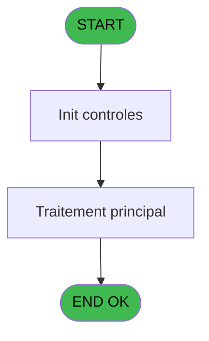

# REF IDE 707 - Verification adresse mail

> **Analyse**: Phases 1-4 2026-02-03 13:50 -> 13:50 (19s) | Assemblage 13:50
> **Pipeline**: V7.2 Enrichi
> **Structure**: 4 onglets (Resume | Ecrans | Donnees | Connexions)

<!-- TAB:Resume -->

## 1. FICHE D'IDENTITE

| Attribut | Valeur |
|----------|--------|
| Projet | REF |
| IDE Position | 707 |
| Nom Programme | Verification adresse mail |
| Fichier source | `Prg_707.xml` |
| Dossier IDE | General |
| Taches | 1 (0 ecrans visibles) |
| Tables modifiees | 0 |
| Programmes appeles | 1 |
| :warning: Statut | **ORPHELIN_POTENTIEL** |

## 2. DESCRIPTION FONCTIONNELLE

**Verification adresse mail** assure la gestion complete de ce processus.

Le flux de traitement s'organise en **1 blocs fonctionnels** :

- **Validation** (1 tache) : controles et verifications de coherence

## 3. BLOCS FONCTIONNELS

### 3.1 Validation (1 tache)

Controles de coherence : 1 tache verifie les donnees et conditions.

---

#### 707 - Verification adresse mail [[ECRAN]](#ecran-t1)

**Role** : Verification : Verification adresse mail.
**Ecran** : 626 x 131 DLU (MDI) | [Voir mockup](#ecran-t1)
**Variables liees** : A (P.i.adresse email), C (V.IsValidMail)
**Delegue a** : [Verif_Format_Mail (IDE 811)](REF-IDE-811.md)

## 5. REGLES METIER

*(Aucune regle metier identifiee)*

## 6. CONTEXTE

- **Appele par**: (aucun)
- **Appelle**: 1 programmes | **Tables**: 0 (W:0 R:0 L:0) | **Taches**: 1 | **Expressions**: 16

<!-- TAB:Ecrans -->

## 8. ECRANS

*(Programme sans ecran visible)*

## 9. NAVIGATION

### 9.3 Structure hierarchique (1 tache)

| Position | Tache | Type | Dimensions | Bloc |
|----------|-------|------|------------|------|
| **707.1** | [**Verification adresse mail** (707)](#t1) [mockup](#ecran-t1) | MDI | 626x131 | Validation |

### 9.4 Algorigramme

> **Legende**: Vert = START/END OK | Rouge = END KO | Bleu = Decisions
> *Algorigramme auto-genere. Utiliser `/algorigramme` pour une synthese metier detaillee.*

<!-- TAB:Donnees -->

## 10. TABLES

### Tables utilisees (0)

| ID | Nom | Description | Type | R | W | L | Usages |
|----|-----|-------------|------|---|---|---|--------|

### Colonnes par table (0 / 0 tables avec colonnes identifiees)

## 11. VARIABLES

### 11.1 Parametres entrants (2)

Variables recues en parametre.

| Lettre | Nom | Type | Usage dans |
|--------|-----|------|-----------|
| A | P.i.adresse email | Unicode | 7x parametre entrant |
| B | P.o.ErreurText | Unicode | 6x parametre entrant |

### 11.2 Variables de session (1)

Variables persistantes pendant toute la session.

| Lettre | Nom | Type | Usage dans |
|--------|-----|------|-----------|
| C | V.IsValidMail | Logical | 1x session |

## 12. EXPRESSIONS

**16 / 16 expressions decodees (100%)**

### 12.1 Repartition par type

| Type | Expressions | Regles |
|------|-------------|--------|
| CONDITION | 6 | 0 |
| CONSTANTE | 2 | 0 |
| NEGATION | 1 | 0 |
| STRING | 1 | 0 |
| CONCATENATION | 5 | 0 |
| FORMAT | 1 | 0 |

### 12.2 Expressions cles par type

#### CONDITION (6 expressions)

| Type | IDE | Expression | Regle |
|------|-----|------------|-------|
| CONDITION | 3 | `InStr (P.i.adresse email [A],',')>0 OR InStr (P.i.adresse email [A],';')>0 OR InStr (Trim (P.i.adresse email [A]),' ')>0` | - |
| CONDITION | 5 | `InStr (Right (Trim (P.i.adresse email [A]),4),'.')=0` | - |
| CONDITION | 6 | `InStr (Right (Trim (P.i.adresse email [A]),2),'.')>0` | - |
| CONDITION | 2 | `InStr (MID (P.i.adresse email [A],InStr (P.i.adresse email [A],ASCIIChr (64))+1,129),ASCIIChr (64))>0` | - |
| CONDITION | 4 | `Len (Trim (Left (P.i.adresse email [A],InStr (P.i.adresse email [A],ASCIIChr (64))-1)))<2` | - |
| ... | | *+1 autres* | |

#### CONSTANTE (2 expressions)

| Type | IDE | Expression | Regle |
|------|-----|------------|-------|
| CONSTANTE | 15 | `''` | - |
| CONSTANTE | 8 | `'Email invalide sans @'` | - |

#### NEGATION (1 expressions)

| Type | IDE | Expression | Regle |
|------|-----|------------|-------|
| NEGATION | 16 | `NOT V.IsValidMail [C]` | - |

#### STRING (1 expressions)

| Type | IDE | Expression | Regle |
|------|-----|------------|-------|
| STRING | 7 | `Trim(P.i.adresse email [A])` | - |

#### CONCATENATION (5 expressions)

| Type | IDE | Expression | Regle |
|------|-----|------------|-------|
| CONCATENATION | 12 | `Trim(P.o.ErreurText [B]) & ASCIIChr(13) & 'Un point est requis dans le nom de domaine !'` | - |
| CONCATENATION | 13 | `Trim(P.o.ErreurText [B]) & ASCIIChr(13) & 'Il faut deux caractères minimum après le dernier point du nom de domaine !'` | - |
| CONCATENATION | 11 | `Trim(P.o.ErreurText [B]) & ASCIIChr(13) & 'Saisir au moins 2 caractères avant @'` | - |
| CONCATENATION | 9 | `Trim(P.o.ErreurText [B]) & ASCIIChr(13) & 'Le caractère @ doit être unique !'` | - |
| CONCATENATION | 10 | `Trim(P.o.ErreurText [B]) & ASCIIChr(13) & 'Les caractères , ; ou espace sont interdits !'` | - |

#### FORMAT (1 expressions)

| Type | IDE | Expression | Regle |
|------|-----|------------|-------|
| FORMAT | 14 | `MlsTrans('Format d''adresse email incorrect')& ASCIIChr(13)&Trim(P.o.ErreurText [B])` | - |

<!-- TAB:Connexions -->

## 13. GRAPHE D'APPELS

### 13.1 Chaine depuis Main (Callers)

**Chemin**: (pas de callers directs)

### 13.2 Callers

| IDE | Nom Programme | Nb Appels |
|-----|---------------|-----------|
| - | (aucun) | - |

### 13.3 Callees (programmes appeles)

### 13.4 Detail Callees avec contexte

| IDE | Nom Programme | Appels | Contexte |
|-----|---------------|--------|----------|
| [811](REF-IDE-811.md) | Verif_Format_Mail | 1 | Controle/validation |

## 14. RECOMMANDATIONS MIGRATION

### 14.1 Profil du programme

| Metrique | Valeur | Impact migration |
|----------|--------|-----------------|
| Lignes de logique | 34 | Programme compact |
| Expressions | 16 | Peu de logique |
| Tables WRITE | 0 | Impact faible |
| Sous-programmes | 1 | Peu de dependances |
| Ecrans visibles | 0 | Ecran unique ou traitement batch |
| Code desactive | 0% (0 / 34) | Code sain |
| Regles metier | 0 | Pas de regle identifiee |

### 14.2 Plan de migration par bloc

#### Validation (1 tache: 1 ecran, 0 traitement)

- **Strategie** : FluentValidation avec validators specifiques.
- Chaque tache de validation -> un validator injectable

### 14.3 Dependances critiques

| Dependance | Type | Appels | Impact |
|------------|------|--------|--------|
| [Verif_Format_Mail (IDE 811)](REF-IDE-811.md) | Sous-programme | 1x | Normale - Controle/validation |

---
*Spec DETAILED generee par Pipeline V7.2 - 2026-02-03 13:50*
