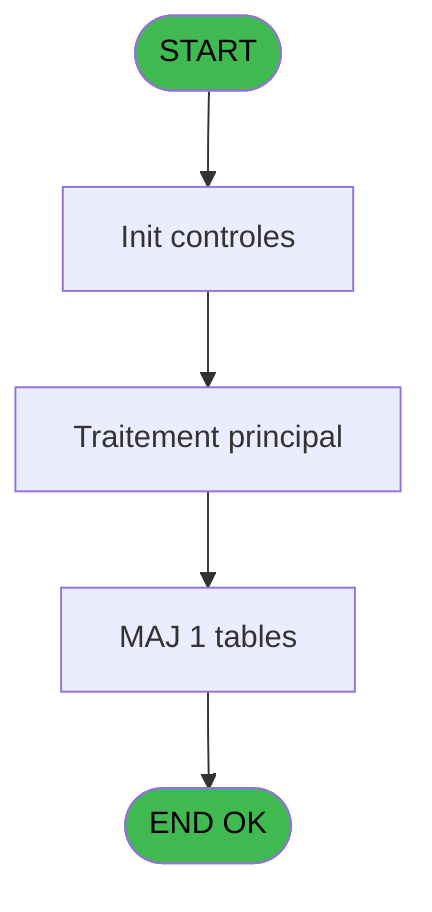

# REF IDE 708 - Envoi mail ass 0 soucis

> **Analyse**: Phases 1-4 2026-02-03 13:50 -> 13:51 (18s) | Assemblage 13:51
> **Pipeline**: V7.2 Enrichi
> **Structure**: 4 onglets (Resume | Ecrans | Donnees | Connexions)

<!-- TAB:Resume -->

## 1. FICHE D'IDENTITE

| Attribut | Valeur |
|----------|--------|
| Projet | REF |
| IDE Position | 708 |
| Nom Programme | Envoi mail ass 0 soucis |
| Fichier source | `Prg_708.xml` |
| Dossier IDE | General |
| Taches | 3 (0 ecrans visibles) |
| Tables modifiees | 1 |
| Programmes appeles | 0 |
| :warning: Statut | **ORPHELIN_POTENTIEL** |

## 2. DESCRIPTION FONCTIONNELLE

**Envoi mail ass 0 soucis** assure la gestion complete de ce processus.

Le flux de traitement s'organise en **2 blocs fonctionnels** :

- **Creation** (2 taches) : insertion d'enregistrements en base (mouvements, prestations)
- **Traitement** (1 tache) : traitements metier divers

**Donnees modifiees** : 1 tables en ecriture (file_traitement_mail).

Detail : phases du traitement

#### Phase 1 : Traitement (1 tache)

- **708** - Envoi mail ass 0 soucis

#### Phase 2 : Creation (2 taches)

- **708.1** - Create carte dématérialisée
- **708.2** - Create mail

#### Tables impactees

| Table | Operations | Role metier |
|-------|-----------|-------------|
| file_traitement_mail | **W** (1 usages) | Services / filieres |

## 3. BLOCS FONCTIONNELS

### 3.1 Traitement (1 tache)

Traitements internes.

---

#### 708 - Envoi mail ass 0 soucis

**Role** : Traitement : Envoi mail ass 0 soucis.
**Variables liees** : B (P.i.Adresse mail)

### 3.2 Creation (2 taches)

Insertion de nouveaux enregistrements en base.

---

#### 708.1 - Create carte dématérialisée

**Role** : Traitement : Create carte dématérialisée.
**Variables liees** : D (v.répertoire cartes démat), E (v.file carte dématérialisé)

---

#### 708.2 - Create mail

**Role** : Traitement : Create mail.
**Variables liees** : B (P.i.Adresse mail)

## 5. REGLES METIER

*(Aucune regle metier identifiee)*

## 6. CONTEXTE

- **Appele par**: (aucun)
- **Appelle**: 0 programmes | **Tables**: 6 (W:1 R:1 L:4) | **Taches**: 3 | **Expressions**: 13

<!-- TAB:Ecrans -->

## 8. ECRANS

*(Programme sans ecran visible)*

## 9. NAVIGATION

### 9.3 Structure hierarchique (3 taches)

| Position | Tache | Type | Dimensions | Bloc |
|----------|-------|------|------------|------|
| **708.1** | [**Envoi mail ass 0 soucis** (708)](#t1) | - | - | Traitement |
| **708.2** | [**Create carte dématérialisée** (708.1)](#t2) | - | - | Creation |
| 708.2.1 | [Create mail (708.2)](#t3) | - | - | |

### 9.4 Algorigramme

> **Legende**: Vert = START/END OK | Rouge = END KO | Bleu = Decisions
> *Algorigramme auto-genere. Utiliser `/algorigramme` pour une synthese metier detaillee.*

<!-- TAB:Donnees -->

## 10. TABLES

### Tables utilisees (6)

| ID | Nom | Description | Type | R | W | L | Usages |
|----|-----|-------------|------|---|---|---|--------|
| 30 | gm-recherche_____gmr | Index de recherche | DB | R |   |   | 1 |
| 34 | hebergement______heb | Hebergement (chambres) | DB |   |   | L | 1 |
| 130 | fichier_langue |  | DB |   |   | L | 1 |
| 368 | pms_village |  | DB |   |   | L | 1 |
| 378 | pv_customer |  | DB |   |   | L | 1 |
| 863 | file_traitement_mail | Services / filieres | DB |   | **W** |   | 1 |

### Colonnes par table (3 / 2 tables avec colonnes identifiees)

Table 30 - gm-recherche_____gmr (R) - 1 usages

| Lettre | Variable | Acces | Type |
|--------|----------|-------|------|
| A | P.i.customer_payer | R | Numeric |
| B | P.i.Adresse mail | R | Unicode |
| C | P.i.Service ou APP | R | Alpha |
| D | v.répertoire cartes démat | R | Alpha |
| E | v.file carte dématérialisé | R | Alpha |
| F | v.répertoire annexes fixes | R | Alpha |

Table 863 - file_traitement_mail (**W**) - 1 usages

| Lettre | Variable | Acces | Type |
|--------|----------|-------|------|
| B | P.i.Adresse mail | W | Unicode |
| E | v.file carte dématérialisé | W | Alpha |

## 11. VARIABLES

### 11.1 Parametres entrants (3)

Variables recues en parametre.

| Lettre | Nom | Type | Usage dans |
|--------|-----|------|-----------|
| A | P.i.customer_payer | Numeric | 1x parametre entrant |
| B | P.i.Adresse mail | Unicode | - |
| C | P.i.Service ou APP | Alpha | - |

### 11.2 Variables de session (3)

Variables persistantes pendant toute la session.

| Lettre | Nom | Type | Usage dans |
|--------|-----|------|-----------|
| D | v.répertoire cartes démat | Alpha | - |
| E | v.file carte dématérialisé | Alpha | - |
| F | v.répertoire annexes fixes | Alpha | - |

## 12. EXPRESSIONS

**13 / 13 expressions decodees (100%)**

### 12.1 Repartition par type

| Type | Expressions | Regles |
|------|-------------|--------|
| CALCULATION | 2 | 0 |
| CONSTANTE | 1 | 0 |
| FORMAT | 1 | 0 |
| OTHER | 7 | 0 |
| STRING | 2 | 0 |

### 12.2 Expressions cles par type

#### CALCULATION (2 expressions)

| Type | IDE | Expression | Regle |
|------|-----|------------|-------|
| CALCULATION | 11 | `'cmd /c mkdir '&Trim([AC])` | - |
| CALCULATION | 9 | `'cmd /c mkdir '&Trim([AA])` | - |

#### CONSTANTE (1 expressions)

| Type | IDE | Expression | Regle |
|------|-----|------------|-------|
| CONSTANTE | 5 | `'H'` | - |

#### FORMAT (1 expressions)

| Type | IDE | Expression | Regle |
|------|-----|------------|-------|
| FORMAT | 8 | `RepStr('Ass-0-'&Trim([H])&'-'&Trim([I])&'-'&DStr(Date(),'DDMMYYYY') & '.pdf',' ','-')` | - |

#### OTHER (7 expressions)

| Type | IDE | Expression | Regle |
|------|-----|------------|-------|
| OTHER | 6 | `[M]` | - |
| OTHER | 7 | `Translate('%club_email_export%')` | - |
| OTHER | 10 | `Translate('%club_email%')&'Annexes_Fixes\'` | - |
| OTHER | 4 | `[G]` | - |
| OTHER | 1 | `P.i.customer_payer [A]` | - |
| ... | | *+2 autres* | |

#### STRING (2 expressions)

| Type | IDE | Expression | Regle |
|------|-----|------------|-------|
| STRING | 13 | `NOT(FileExist(Trim([AC])))` | - |
| STRING | 12 | `NOT(FileExist(Trim([AA])))` | - |

<!-- TAB:Connexions -->

## 13. GRAPHE D'APPELS

### 13.1 Chaine depuis Main (Callers)

**Chemin**: (pas de callers directs)

### 13.2 Callers

| IDE | Nom Programme | Nb Appels |
|-----|---------------|-----------|
| - | (aucun) | - |

### 13.3 Callees (programmes appeles)

### 13.4 Detail Callees avec contexte

| IDE | Nom Programme | Appels | Contexte |
|-----|---------------|--------|----------|
| - | (aucun) | - | - |

## 14. RECOMMANDATIONS MIGRATION

### 14.1 Profil du programme

| Metrique | Valeur | Impact migration |
|----------|--------|-----------------|
| Lignes de logique | 73 | Programme compact |
| Expressions | 13 | Peu de logique |
| Tables WRITE | 1 | Impact faible |
| Sous-programmes | 0 | Peu de dependances |
| Ecrans visibles | 0 | Ecran unique ou traitement batch |
| Code desactive | 0% (0 / 73) | Code sain |
| Regles metier | 0 | Pas de regle identifiee |

### 14.2 Plan de migration par bloc

#### Traitement (1 tache: 0 ecran, 1 traitement)

- **Strategie** : 1 service(s) backend injectable(s) (Domain Services).
- Decomposer les taches en services unitaires testables.

#### Creation (2 taches: 0 ecran, 2 traitements)

- **Strategie** : Repository pattern avec Entity Framework Core.
- Insertion via `IRepository<T>.CreateAsync()`

### 14.3 Dependances critiques

| Dependance | Type | Appels | Impact |
|------------|------|--------|--------|
| file_traitement_mail | Table WRITE (Database) | 1x | Schema + repository |

---
*Spec DETAILED generee par Pipeline V7.2 - 2026-02-03 13:51*
