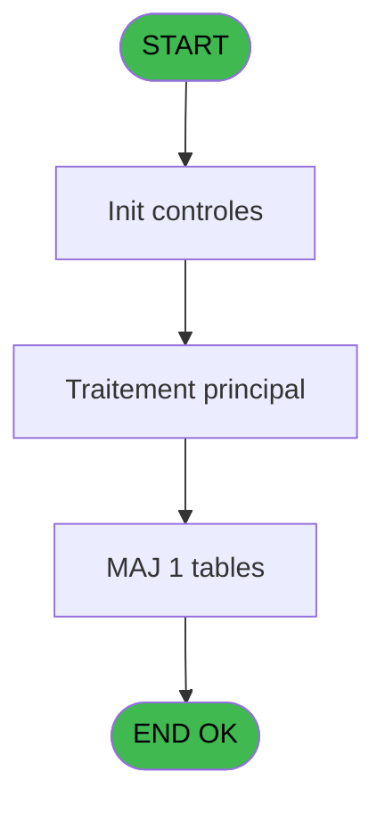

# REF IDE 71 - Browse - articles_________art

> **Analyse**: Phases 1-4 2026-02-03 09:07 -> 09:07 (21s) | Assemblage 09:07
> **Pipeline**: V7.2 Enrichi
> **Structure**: 4 onglets (Resume | Ecrans | Donnees | Connexions)

<!-- TAB:Resume -->

## 1. FICHE D'IDENTITE

| Attribut | Valeur |
|----------|--------|
| Projet | REF |
| IDE Position | 71 |
| Nom Programme | Browse - articles_________art |
| Fichier source | `Prg_71.xml` |
| Domaine metier | Ventes |
| Taches | 1 (1 ecrans visibles) |
| Tables modifiees | 1 |
| Programmes appeles | 0 |
| :warning: Statut | **ORPHELIN_POTENTIEL** |

## 2. DESCRIPTION FONCTIONNELLE

**Browse - articles_________art** assure la gestion complete de ce processus.

Le flux de traitement s'organise en **1 blocs fonctionnels** :

- **Traitement** (1 tache) : traitements metier divers

**Donnees modifiees** : 1 tables en ecriture (articles_________art).

## 3. BLOCS FONCTIONNELS

### 3.1 Traitement (1 tache)

Traitements internes.

---

#### 71 - Browse - articles_________art [[ECRAN]](#ecran-t1)

**Role** : Traitement : Browse - articles_________art.
**Ecran** : 1595 x 195 DLU | [Voir mockup](#ecran-t1)

## 5. REGLES METIER

*(Aucune regle metier identifiee)*

## 6. CONTEXTE

- **Appele par**: (aucun)
- **Appelle**: 0 programmes | **Tables**: 1 (W:1 R:0 L:0) | **Taches**: 1 | **Expressions**: 0

<!-- TAB:Ecrans -->

## 8. ECRANS

### 8.1 Forms visibles (1 / 1)

| # | Position | Tache | Nom | Type | Largeur | Hauteur | Bloc |
|---|----------|-------|-----|------|---------|---------|------|
| 1 | 71 | 71 | Browse - articles_________art | Type0 | 1595 | 195 | Traitement |

### 8.2 Mockups Ecrans

---

#### 71 - Browse - articles_________art
**Tache** : [71](#t1) | **Type** : Type0 | **Dimensions** : 1595 x 195 DLU
**Bloc** : Traitement | **Titre IDE** : Browse - articles_________art

<!-- FORM-DATA:
{
    "width":  1595,
    "vFactor":  8,
    "type":  "Type0",
    "hFactor":  4,
    "controls":  [
                     {
                         "x":  8,
                         "type":  "table",
                         "var":  "",
                         "name":  "",
                         "titleH":  12,
                         "color":  "",
                         "w":  1573,
                         "y":  8,
                         "fmt":  "",
                         "parent":  null,
                         "text":  "",
                         "rowH":  13,
                         "h":  182,
                         "cols":  [
                                      {
                                          "title":  "art_code_article",
                                          "layer":  1,
                                          "w":  64
                                      },
                                      {
                                          "title":  "art_libelle_article",
                                          "layer":  2,
                                          "w":  122
                                      },
                                      {
                                          "title":  "art_libelle_imputat_",
                                          "layer":  3,
                                          "w":  94
                                      },
                                      {
                                          "title":  "art_service_village",
                                          "layer":  4,
                                          "w":  74
                                      },
                                      {
                                          "title":  "art_imputation",
                                          "layer":  5,
                                          "w":  58
                                      },
                                      {
                                          "title":  "art_sous_imputation",
                                          "layer":  6,
                                          "w":  78
                                      },
                                      {
                                          "title":  "art_top_annulation",
                                          "layer":  7,
                                          "w":  74
                                      },
                                      {
                                          "title":  "art_lieux_de_vente",
                                          "layer":  8,
                                          "w":  75
                                      },
                                      {
                                          "title":  "art_prix",
                                          "layer":  9,
                                          "w":  97
                                      },
                                      {
                                          "title":  "art_top_maj",
                                          "layer":  10,
                                          "w":  47
                                      },
                                      {
                                          "title":  "art_date_maj",
                                          "layer":  11,
                                          "w":  68
                                      },
                                      {
                                          "title":  "art_forfait",
                                          "layer":  12,
                                          "w":  38
                                      },
                                      {
                                          "title":  "art_remise_autorisee",
                                          "layer":  13,
                                          "w":  81
                                      },
                                      {
                                          "title":  "art_type_article",
                                          "layer":  14,
                                          "w":  61
                                      },
                                      {
                                          "title":  "art_nb_jh",
                                          "layer":  15,
                                          "w":  38
                                      },
                                      {
                                          "title":  "art_type_repas",
                                          "layer":  16,
                                          "w":  66
                                      },
                                      {
                                          "title":  "art_tva",
                                          "layer":  17,
                                          "w":  34
                                      },
                                      {
                                          "title":  "art_mode_paiement",
                                          "layer":  18,
                                          "w":  78
                                      },
                                      {
                                          "title":  "art_gift_pass",
                                          "layer":  19,
                                          "w":  51
                                      },
                                      {
                                          "title":  "art_activite_comptable",
                                          "layer":  20,
                                          "w":  89
                                      },
                                      {
                                          "title":  "art_stype_article",
                                          "layer":  21,
                                          "w":  65
                                      },
                                      {
                                          "title":  "art_nature",
                                          "layer":  22,
                                          "w":  42
                                      },
                                      {
                                          "title":  "art_force_ticket",
                                          "layer":  23,
                                          "w":  62
                                      }
                                  ],
                         "rows":  23
                     },
                     {
                         "x":  12,
                         "type":  "edit",
                         "var":  "",
                         "y":  23,
                         "w":  32,
                         "fmt":  "",
                         "name":  "art_code_article",
                         "h":  10,
                         "color":  "",
                         "text":  "",
                         "parent":  1
                     },
                     {
                         "x":  76,
                         "type":  "edit",
                         "var":  "",
                         "y":  23,
                         "w":  115,
                         "fmt":  "",
                         "name":  "art_libelle_article",
                         "h":  10,
                         "color":  "",
                         "text":  "",
                         "parent":  1
                     },
                     {
                         "x":  198,
                         "type":  "edit",
                         "var":  "",
                         "y":  23,
                         "w":  87,
                         "fmt":  "",
                         "name":  "art_libelle_imputat_",
                         "h":  10,
                         "color":  "",
                         "text":  "",
                         "parent":  1
                     },
                     {
                         "x":  292,
                         "type":  "edit",
                         "var":  "",
                         "y":  23,
                         "w":  26,
                         "fmt":  "",
                         "name":  "art_service_village",
                         "h":  10,
                         "color":  "",
                         "text":  "",
                         "parent":  1
                     },
                     {
                         "x":  366,
                         "type":  "edit",
                         "var":  "",
                         "y":  23,
                         "w":  51,
                         "fmt":  "",
                         "name":  "art_imputation",
                         "h":  10,
                         "color":  "",
                         "text":  "",
                         "parent":  1
                     },
                     {
                         "x":  424,
                         "type":  "edit",
                         "var":  "",
                         "y":  23,
                         "w":  18,
                         "fmt":  "",
                         "name":  "art_sous_imputation",
                         "h":  10,
                         "color":  "",
                         "text":  "",
                         "parent":  1
                     },
                     {
                         "x":  502,
                         "type":  "edit",
                         "var":  "",
                         "y":  23,
                         "w":  9,
                         "fmt":  "",
                         "name":  "art_top_annulation",
                         "h":  10,
                         "color":  "",
                         "text":  "",
                         "parent":  1
                     },
                     {
                         "x":  576,
                         "type":  "edit",
                         "var":  "",
                         "y":  23,
                         "w":  37,
                         "fmt":  "",
                         "name":  "art_lieux_de_vente",
                         "h":  10,
                         "color":  "",
                         "text":  "",
                         "parent":  1
                     },
                     {
                         "x":  651,
                         "type":  "edit",
                         "var":  "",
                         "y":  23,
                         "w":  90,
                         "fmt":  "",
                         "name":  "art_prix",
                         "h":  10,
                         "color":  "",
                         "text":  "",
                         "parent":  1
                     },
                     {
                         "x":  748,
                         "type":  "edit",
                         "var":  "",
                         "y":  23,
                         "w":  9,
                         "fmt":  "",
                         "name":  "art_top_maj",
                         "h":  10,
                         "color":  "",
                         "text":  "",
                         "parent":  1
                     },
                     {
                         "x":  795,
                         "type":  "edit",
                         "var":  "",
                         "y":  23,
                         "w":  61,
                         "fmt":  "",
                         "name":  "art_date_maj",
                         "h":  10,
                         "color":  "",
                         "text":  "",
                         "parent":  1
                     },
                     {
                         "x":  863,
                         "type":  "edit",
                         "var":  "",
                         "y":  23,
                         "w":  9,
                         "fmt":  "",
                         "name":  "art_forfait",
                         "h":  10,
                         "color":  "",
                         "text":  "",
                         "parent":  1
                     },
                     {
                         "x":  901,
                         "type":  "edit",
                         "var":  "",
                         "y":  23,
                         "w":  31,
                         "fmt":  "",
                         "name":  "art_remise_autorisee",
                         "h":  10,
                         "color":  "",
                         "text":  "",
                         "parent":  1
                     },
                     {
                         "x":  982,
                         "type":  "edit",
                         "var":  "",
                         "y":  23,
                         "w":  20,
                         "fmt":  "",
                         "name":  "art_type_article",
                         "h":  10,
                         "color":  "",
                         "text":  "",
                         "parent":  1
                     },
                     {
                         "x":  1043,
                         "type":  "edit",
                         "var":  "",
                         "y":  23,
                         "w":  18,
                         "fmt":  "",
                         "name":  "art_nb_jh",
                         "h":  10,
                         "color":  "",
                         "text":  "",
                         "parent":  1
                     },
                     {
                         "x":  1081,
                         "type":  "edit",
                         "var":  "",
                         "y":  23,
                         "w":  59,
                         "fmt":  "",
                         "name":  "art_type_repas",
                         "h":  10,
                         "color":  "",
                         "text":  "",
                         "parent":  1
                     },
                     {
                         "x":  1147,
                         "type":  "edit",
                         "var":  "",
                         "y":  23,
                         "w":  27,
                         "fmt":  "",
                         "name":  "art_tva",
                         "h":  10,
                         "color":  "",
                         "text":  "",
                         "parent":  1
                     },
                     {
                         "x":  1181,
                         "type":  "edit",
                         "var":  "",
                         "y":  23,
                         "w":  26,
                         "fmt":  "",
                         "name":  "art_mode_paiement",
                         "h":  10,
                         "color":  "",
                         "text":  "",
                         "parent":  1
                     },
                     {
                         "x":  1259,
                         "type":  "edit",
                         "var":  "",
                         "y":  23,
                         "w":  31,
                         "fmt":  "",
                         "name":  "art_gift_pass",
                         "h":  10,
                         "color":  "",
                         "text":  "",
                         "parent":  1
                     },
                     {
                         "x":  1310,
                         "type":  "edit",
                         "var":  "",
                         "y":  23,
                         "w":  18,
                         "fmt":  "",
                         "name":  "art_activite_comptable",
                         "h":  10,
                         "color":  "",
                         "text":  "",
                         "parent":  1
                     },
                     {
                         "x":  1399,
                         "type":  "edit",
                         "var":  "",
                         "y":  23,
                         "w":  20,
                         "fmt":  "",
                         "name":  "art_stype_article",
                         "h":  10,
                         "color":  "",
                         "text":  "",
                         "parent":  1
                     },
                     {
                         "x":  1464,
                         "type":  "edit",
                         "var":  "",
                         "y":  23,
                         "w":  9,
                         "fmt":  "",
                         "name":  "art_nature",
                         "h":  10,
                         "color":  "",
                         "text":  "",
                         "parent":  1
                     },
                     {
                         "x":  1506,
                         "type":  "edit",
                         "var":  "",
                         "y":  23,
                         "w":  31,
                         "fmt":  "",
                         "name":  "art_force_ticket",
                         "h":  10,
                         "color":  "",
                         "text":  "",
                         "parent":  1
                     }
                 ],
    "taskId":  "71",
    "height":  195
}
-->

<strong>Champs : 23 champs</strong>

| Pos (x,y) | Nom | Variable | Type |
|-----------|-----|----------|------|
| 12,23 | art_code_article | - | edit |
| 76,23 | art_libelle_article | - | edit |
| 198,23 | art_libelle_imputat_ | - | edit |
| 292,23 | art_service_village | - | edit |
| 366,23 | art_imputation | - | edit |
| 424,23 | art_sous_imputation | - | edit |
| 502,23 | art_top_annulation | - | edit |
| 576,23 | art_lieux_de_vente | - | edit |
| 651,23 | art_prix | - | edit |
| 748,23 | art_top_maj | - | edit |
| 795,23 | art_date_maj | - | edit |
| 863,23 | art_forfait | - | edit |
| 901,23 | art_remise_autorisee | - | edit |
| 982,23 | art_type_article | - | edit |
| 1043,23 | art_nb_jh | - | edit |
| 1081,23 | art_type_repas | - | edit |
| 1147,23 | art_tva | - | edit |
| 1181,23 | art_mode_paiement | - | edit |
| 1259,23 | art_gift_pass | - | edit |
| 1310,23 | art_activite_comptable | - | edit |
| 1399,23 | art_stype_article | - | edit |
| 1464,23 | art_nature | - | edit |
| 1506,23 | art_force_ticket | - | edit |

## 9. NAVIGATION

Ecran unique: **Browse - articles_________art**

### 9.3 Structure hierarchique (1 tache)

| Position | Tache | Type | Dimensions | Bloc |
|----------|-------|------|------------|------|
| **71.1** | [**Browse - articles_________art** (71)](#t1) [mockup](#ecran-t1) | - | 1595x195 | Traitement |

### 9.4 Algorigramme

> **Legende**: Vert = START/END OK | Rouge = END KO | Bleu = Decisions
> *Algorigramme auto-genere. Utiliser `/algorigramme` pour une synthese metier detaillee.*

<!-- TAB:Donnees -->

## 10. TABLES

### Tables utilisees (1)

| ID | Nom | Description | Type | R | W | L | Usages |
|----|-----|-------------|------|---|---|---|--------|
| 77 | articles_________art | Articles et stock | DB |   | **W** |   | 1 |

### Colonnes par table (0 / 1 tables avec colonnes identifiees)

Table 77 - articles_________art (**W**) - 1 usages

*Table utilisee uniquement en Link ou aucune colonne Real identifiee dans le DataView.*

## 11. VARIABLES

*(Programme sans variables locales mappees)*

## 12. EXPRESSIONS

**0 / 0 expressions decodees (0%)**

### 12.1 Repartition par type

| Type | Expressions | Regles |
|------|-------------|--------|

### 12.2 Expressions cles par type

<!-- TAB:Connexions -->

## 13. GRAPHE D'APPELS

### 13.1 Chaine depuis Main (Callers)

**Chemin**: (pas de callers directs)

### 13.2 Callers

| IDE | Nom Programme | Nb Appels |
|-----|---------------|-----------|
| - | (aucun) | - |

### 13.3 Callees (programmes appeles)

### 13.4 Detail Callees avec contexte

| IDE | Nom Programme | Appels | Contexte |
|-----|---------------|--------|----------|
| - | (aucun) | - | - |

## 14. RECOMMANDATIONS MIGRATION

### 14.1 Profil du programme

| Metrique | Valeur | Impact migration |
|----------|--------|-----------------|
| Lignes de logique | 24 | Programme compact |
| Expressions | 0 | Peu de logique |
| Tables WRITE | 1 | Impact faible |
| Sous-programmes | 0 | Peu de dependances |
| Ecrans visibles | 1 | Ecran unique ou traitement batch |
| Code desactive | 0% (0 / 24) | Code sain |
| Regles metier | 0 | Pas de regle identifiee |

### 14.2 Plan de migration par bloc

#### Traitement (1 tache: 1 ecran, 0 traitement)

- **Strategie** : 1 composant(s) UI (Razor/React) avec formulaires et validation.
- Decomposer les taches en services unitaires testables.

### 14.3 Dependances critiques

| Dependance | Type | Appels | Impact |
|------------|------|--------|--------|
| articles_________art | Table WRITE (Database) | 1x | Schema + repository |

---
*Spec DETAILED generee par Pipeline V7.2 - 2026-02-03 09:07*
