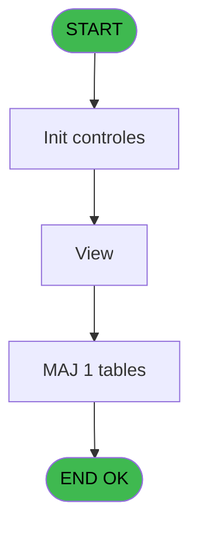
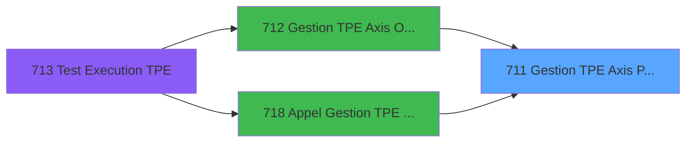
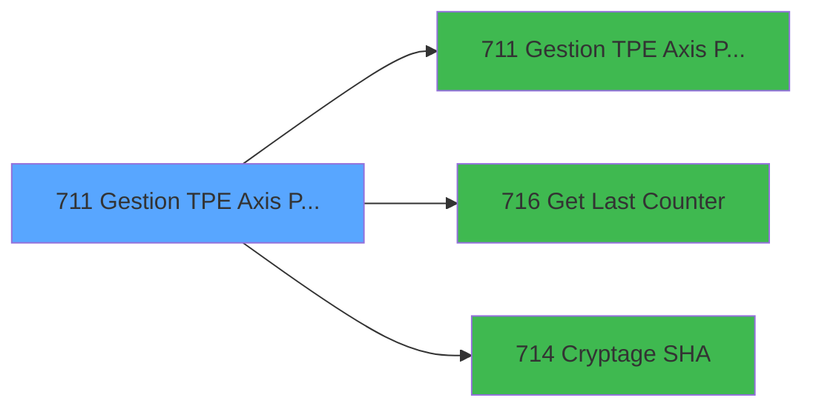

# REF IDE 711 - Gestion TPE Axis PushAlias

> **Analyse**: Phases 1-4 2026-02-03 13:52 -> 13:52 (17s) | Assemblage 13:52
> **Pipeline**: V7.2 Enrichi
> **Structure**: 4 onglets (Resume | Ecrans | Donnees | Connexions)

<!-- TAB:Resume -->

## 1. FICHE D'IDENTITE

| Attribut | Valeur |
|----------|--------|
| Projet | REF |
| IDE Position | 711 |
| Nom Programme | Gestion TPE Axis PushAlias |
| Fichier source | `Prg_711.xml` |
| Dossier IDE | General |
| Taches | 18 (1 ecrans visibles) |
| Tables modifiees | 1 |
| Programmes appeles | 3 |

## 2. DESCRIPTION FONCTIONNELLE

**Gestion TPE Axis PushAlias** assure la gestion complete de ce processus, accessible depuis [Gestion TPE Axis PushAlias (IDE 711)](REF-IDE-711.md), [Gestion TPE Axis Omnicanal (IDE 712)](REF-IDE-712.md), [Appel Gestion TPE Axis (IDE 718)](REF-IDE-718.md).

Le flux de traitement s'organise en **4 blocs fonctionnels** :

- **Traitement** (14 taches) : traitements metier divers
- **Saisie** (2 taches) : ecrans de saisie utilisateur (formulaires, champs, donnees)
- **Validation** (1 tache) : controles et verifications de coherence
- **Calcul** (1 tache) : calculs de montants, stocks ou compteurs

**Donnees modifiees** : 1 tables en ecriture (maj_appli_tpe).

**Logique metier** : 2 regles identifiees couvrant conditions metier.

Detail : phases du traitement

#### Phase 1 : Traitement (14 taches)

- **711** - Gestion TPE Axis PushAlias
- **711.3** - Generation Fichier Commande
- **711.4** - Generation Fichier Commande
- **711.5** - Création XML
- **711.5.1** - Get Info
- **711.6** - Lecture XML VAD
- **711.7** - Check version
- **711.7.1** - Check if update needed
- **711.7.1.1** - Gestion c3config
- **711.7.1.2.1** - Cloture campagne maj
- **711.8** - Check version bck
- **711.8.1** - Check if update needed
- **711.9** - Gestion c3config
- **711.10** - View **[[ECRAN]](#ecran-t18)**

Delegue a : [Gestion TPE Axis PushAlias (IDE 711)](REF-IDE-711.md), [Get Last Counter (IDE 716)](REF-IDE-716.md), [Cryptage SHA (IDE 714)](REF-IDE-714.md)

#### Phase 2 : Saisie (2 taches)

- **711.1** - Num Dossier Vente SQL
- **711.2** - Num Dossier Vente SQL

#### Phase 3 : Calcul (1 tache)

- **711.4.1** - Calcul Message Erreur

#### Phase 4 : Validation (1 tache)

- **711.7.1.2** - Verif fin maj

#### Tables impactees

| Table | Operations | Role metier |
|-------|-----------|-------------|
| maj_appli_tpe | R/**W** (3 usages) |  |

## 3. BLOCS FONCTIONNELS

### 3.1 Traitement (14 taches)

Traitements internes.

---

#### 711 - Gestion TPE Axis PushAlias

**Role** : Tache d'orchestration : point d'entree du programme (14 sous-taches). Coordonne l'enchainement des traitements.

13 sous-taches directes

| Tache | Nom | Bloc |
|-------|-----|------|
| [711.3](#t4) | Generation Fichier Commande | Traitement |
| [711.4](#t5) | Generation Fichier Commande | Traitement |
| [711.5](#t7) | Création XML | Traitement |
| [711.5.1](#t8) | Get Info | Traitement |
| [711.6](#t9) | Lecture XML VAD | Traitement |
| [711.7](#t10) | Check version | Traitement |
| [711.7.1](#t11) | Check if update needed | Traitement |
| [711.7.1.1](#t12) | Gestion c3config | Traitement |
| [711.7.1.2.1](#t14) | Cloture campagne maj | Traitement |
| [711.8](#t15) | Check version bck | Traitement |
| [711.8.1](#t16) | Check if update needed | Traitement |
| [711.9](#t17) | Gestion c3config | Traitement |
| [711.10](#t18) | View **[[ECRAN]](#ecran-t18)** | Traitement |

**Variables liees** : K (p.Num Dossier Axis)

---

#### 711.3 - Generation Fichier Commande

**Role** : Traitement : Generation Fichier Commande.
**Variables liees** : BF (v.Execution Commande), R (Message Commande)

---

#### 711.4 - Generation Fichier Commande

**Role** : Traitement : Generation Fichier Commande.
**Variables liees** : BF (v.Execution Commande), R (Message Commande)

---

#### 711.5 - Création XML

**Role** : Traitement : Création XML.

---

#### 711.5.1 - Get Info

**Role** : Consultation/chargement : Get Info.

---

#### 711.6 - Lecture XML VAD

**Role** : Traitement : Lecture XML VAD.

---

#### 711.7 - Check version

**Role** : Traitement : Check version.
**Variables liees** : Q (p.Easy Check Out)

---

#### 711.7.1 - Check if update needed

**Role** : Traitement : Check if update needed.
**Variables liees** : Q (p.Easy Check Out)

---

#### 711.7.1.1 - Gestion c3config

**Role** : Gestion du moyen de paiement : Gestion c3config.

---

#### 711.7.1.2.1 - Cloture campagne maj

**Role** : Traitement : Cloture campagne maj.

---

#### 711.8 - Check version bck

**Role** : Traitement : Check version bck.
**Variables liees** : Q (p.Easy Check Out)

---

#### 711.8.1 - Check if update needed

**Role** : Traitement : Check if update needed.
**Variables liees** : Q (p.Easy Check Out)

---

#### 711.9 - Gestion c3config

**Role** : Gestion du moyen de paiement : Gestion c3config.

---

#### 711.10 - View [[ECRAN]](#ecran-t18)

**Role** : Traitement : View.
**Ecran** : 536 x 487 DLU | [Voir mockup](#ecran-t18)

### 3.2 Saisie (2 taches)

Ce bloc traite la saisie des donnees de la transaction.

---

#### 711.1 - Num Dossier Vente SQL

**Role** : Saisie des donnees : Num Dossier Vente SQL.
**Variables liees** : J (p.Num Dossier PMS), K (p.Num Dossier Axis)

---

#### 711.2 - Num Dossier Vente SQL

**Role** : Saisie des donnees : Num Dossier Vente SQL.
**Variables liees** : J (p.Num Dossier PMS), K (p.Num Dossier Axis)

### 3.3 Calcul (1 tache)

Calculs metier : montants, stocks, compteurs.

---

#### 711.4.1 - Calcul Message Erreur

**Role** : Calcul : Calcul Message Erreur.
**Variables liees** : P (p.Message Erreur), U (v.Code Erreur), R (Message Commande), S (Message Reponse)

### 3.4 Validation (1 tache)

Controles de coherence : 1 tache verifie les donnees et conditions.

---

#### 711.7.1.2 - Verif fin maj

**Role** : Verification : Verif fin maj.

## 5. REGLES METIER

2 regles identifiees:

### Autres (2 regles)

#### [RM-001] Si GetLang() vaut 'ANG' alors 'en_US', sinon 'fr_FR'

| Element | Detail |
|---------|--------|
| **Condition** | `GetLang()='ANG'` |
| **Si vrai** | 'en_US' |
| **Si faux** | 'fr_FR') |
| **Expression source** | Expression 35 : `IF(GetLang()='ANG','en_US','fr_FR')` |
| **Exemple** | Si GetLang()='ANG' → 'en_US'. Sinon → 'fr_FR') |

#### [RM-002] Si Translate('%club_test%') vaut 'T' alors 'T', sinon 'P'

| Element | Detail |
|---------|--------|
| **Condition** | `Translate('%club_test%')='T'` |
| **Si vrai** | 'T' |
| **Si faux** | 'P') |
| **Expression source** | Expression 37 : `IF(Translate('%club_test%')='T','T','P')` |
| **Exemple** | Si Translate('%club_test%')='T' → 'T'. Sinon → 'P') |

## 6. CONTEXTE

- **Appele par**: [Gestion TPE Axis PushAlias (IDE 711)](REF-IDE-711.md), [Gestion TPE Axis Omnicanal (IDE 712)](REF-IDE-712.md), [Appel Gestion TPE Axis (IDE 718)](REF-IDE-718.md)
- **Appelle**: 3 programmes | **Tables**: 8 (W:1 R:4 L:5) | **Taches**: 18 | **Expressions**: 64

<!-- TAB:Ecrans -->

## 8. ECRANS

### 8.1 Forms visibles (1 / 18)

| # | Position | Tache | Nom | Type | Largeur | Hauteur | Bloc |
|---|----------|-------|-----|------|---------|---------|------|
| 1 | 711.10 | 711.10 | View | Type0 | 536 | 487 | Traitement |

### 8.2 Mockups Ecrans

---

#### 711.10 - View
**Tache** : [711.10](#t18) | **Type** : Type0 | **Dimensions** : 536 x 487 DLU
**Bloc** : Traitement | **Titre IDE** : View

<!-- FORM-DATA:
{
    "width":  536,
    "vFactor":  8,
    "type":  "Type0",
    "hFactor":  4,
    "controls":  [
                     {
                         "x":  0,
                         "type":  "label",
                         "var":  "",
                         "y":  200,
                         "w":  43,
                         "fmt":  "",
                         "name":  "",
                         "h":  9,
                         "color":  "",
                         "text":  "v.URL WS",
                         "parent":  null
                     },
                     {
                         "x":  0,
                         "type":  "label",
                         "var":  "",
                         "y":  224,
                         "w":  26,
                         "fmt":  "",
                         "name":  "",
                         "h":  9,
                         "color":  "",
                         "text":  "v.XML",
                         "parent":  null
                     },
                     {
                         "x":  4,
                         "type":  "edit",
                         "var":  "",
                         "y":  8,
                         "w":  9,
                         "fmt":  "",
                         "name":  "Texte",
                         "h":  10,
                         "color":  "",
                         "text":  "",
                         "parent":  null
                     },
                     {
                         "x":  4,
                         "type":  "edit",
                         "var":  "",
                         "y":  24,
                         "w":  308,
                         "fmt":  "",
                         "name":  "",
                         "h":  168,
                         "color":  "",
                         "text":  "",
                         "parent":  null
                     },
                     {
                         "x":  44,
                         "type":  "edit",
                         "var":  "",
                         "y":  200,
                         "w":  480,
                         "fmt":  "",
                         "name":  "v.URL WS",
                         "h":  10,
                         "color":  "",
                         "text":  "",
                         "parent":  null
                     },
                     {
                         "x":  36,
                         "type":  "edit",
                         "var":  "",
                         "y":  224,
                         "w":  500,
                         "fmt":  "",
                         "name":  "v.XML",
                         "h":  224,
                         "color":  "",
                         "text":  "",
                         "parent":  null
                     }
                 ],
    "taskId":  "711.10",
    "height":  487
}
-->

<strong>Champs : 4 champs</strong>

| Pos (x,y) | Nom | Variable | Type |
|-----------|-----|----------|------|
| 4,8 | Texte | - | edit |
| 4,24 | (sans nom) | - | edit |
| 44,200 | v.URL WS | - | edit |
| 36,224 | v.XML | - | edit |

## 9. NAVIGATION

Ecran unique: **View**

### 9.3 Structure hierarchique (18 taches)

| Position | Tache | Type | Dimensions | Bloc |
|----------|-------|------|------------|------|
| **711.1** | [**Gestion TPE Axis PushAlias** (711)](#t1) | - | - | Traitement |
| 711.1.1 | [Generation Fichier Commande (711.3)](#t4) | - | - | |
| 711.1.2 | [Generation Fichier Commande (711.4)](#t5) | - | - | |
| 711.1.3 | [Création XML (711.5)](#t7) | - | - | |
| 711.1.4 | [Get Info (711.5.1)](#t8) | - | - | |
| 711.1.5 | [Lecture XML VAD (711.6)](#t9) | - | - | |
| 711.1.6 | [Check version (711.7)](#t10) | - | - | |
| 711.1.7 | [Check if update needed (711.7.1)](#t11) | - | - | |
| 711.1.8 | [Gestion c3config (711.7.1.1)](#t12) | - | - | |
| 711.1.9 | [Cloture campagne maj (711.7.1.2.1)](#t14) | - | - | |
| 711.1.10 | [Check version bck (711.8)](#t15) | - | - | |
| 711.1.11 | [Check if update needed (711.8.1)](#t16) | - | - | |
| 711.1.12 | [Gestion c3config (711.9)](#t17) | - | - | |
| 711.1.13 | [View (711.10)](#t18) [mockup](#ecran-t18) | - | 536x487 | |
| **711.2** | [**Num Dossier Vente SQL** (711.1)](#t2) | - | - | Saisie |
| 711.2.1 | [Num Dossier Vente SQL (711.2)](#t3) | - | - | |
| **711.3** | [**Calcul Message Erreur** (711.4.1)](#t6) | - | - | Calcul |
| **711.4** | [**Verif fin maj** (711.7.1.2)](#t13) | - | - | Validation |

### 9.4 Algorigramme

> **Legende**: Vert = START/END OK | Rouge = END KO | Bleu = Decisions
> *Algorigramme auto-genere. Utiliser `/algorigramme` pour une synthese metier detaillee.*

<!-- TAB:Donnees -->

## 10. TABLES

### Tables utilisees (8)

| ID | Nom | Description | Type | R | W | L | Usages |
|----|-----|-------------|------|---|---|---|--------|
| 31 | gm-complet_______gmc |  | DB | R |   |   | 1 |
| 68 | compteurs________cpt | Comptes GM (generaux) | DB |   |   | L | 1 |
| 89 | moyen_paiement___mop |  | DB | R |   |   | 1 |
| 285 | email |  | DB |   |   | L | 1 |
| 368 | pms_village |  | DB |   |   | L | 1 |
| 834 | tpe_par_terminal |  | DB | R |   | L | 2 |
| 866 | maj_appli_tpe |  | DB | R | **W** |   | 3 |
| 867 | log_maj_tpe |  | DB |   |   | L | 2 |

### Colonnes par table (5 / 4 tables avec colonnes identifiees)

Table 31 - gm-complet_______gmc (R) - 1 usages

*Table utilisee uniquement en Link ou aucune colonne Real identifiee dans le DataView.*

Table 89 - moyen_paiement___mop (R) - 1 usages

| Lettre | Variable | Acces | Type |
|--------|----------|-------|------|
| X | v.ticket | R | Blob |
| BB | v. Reponse WS | R | Blob |

Table 834 - tpe_par_terminal (R/L) - 2 usages

| Lettre | Variable | Acces | Type |
|--------|----------|-------|------|
| A | v.retour log maj | R | Logical |
| B | v.fin tache | R | Logical |

Table 866 - maj_appli_tpe (R/**W**) - 3 usages

| Lettre | Variable | Acces | Type |
|--------|----------|-------|------|
| A | v.retour maj appli | W | Logical |
| B | v.retour maj tpe | W | Logical |
| C | v.lancement check version | W | Logical |
| D | v.test fin campagne | W | Logical |

## 11. VARIABLES

### 11.1 Parametres entrants (17)

Variables recues du programme appelant ([Gestion TPE Axis PushAlias (IDE 711)](REF-IDE-711.md)).

| Lettre | Nom | Type | Usage dans |
|--------|-----|------|-----------|
| A | p.Code Societe | Alpha | 1x parametre entrant |
| B | p.Code Village | Alpha | 2x parametre entrant |
| C | p.Num Caisse | Alpha | 4x parametre entrant |
| D | p.Num TPE | Alpha | 9x parametre entrant |
| E | p. Montant | Numeric | 3x parametre entrant |
| F | p.i.Operation | Alpha | 17x parametre entrant |
| G | p.Code Devise | Alpha | 3x parametre entrant |
| H | p.Code Adherent | Numeric | 2x parametre entrant |
| I | p.Filiation | Numeric | 1x parametre entrant |
| J | p.Num Dossier PMS | Alpha | [711.1](#t2), [711.2](#t3) |
| K | p.Num Dossier Axis | Alpha | [711](#t1), [711.1](#t2), [711.2](#t3) |
| L | p.Num Autorisation | Alpha | - |
| M | p. C3 Signature | Alpha | - |
| N | p.MOP | Alpha | 2x parametre entrant |
| O | p.Transaction Validée | Logical | 1x parametre entrant |
| P | p.Message Erreur | Alpha | - |
| Q | p.Easy Check Out | Logical | - |

### 11.2 Variables de session (13)

Variables persistantes pendant toute la session.

| Lettre | Nom | Type | Usage dans |
|--------|-----|------|-----------|
| T | v.Code Reponse | Alpha | - |
| U | v.Code Erreur | Alpha | - |
| V | v. C3 Type Carte | Alpha | - |
| W | v. C3 Sous Type | Alpha | - |
| X | v.ticket | Blob | - |
| Y | v.URL | Alpha | 1x session |
| Z | v.Reponse Numerique | Numeric | - |
| BA | v.XML | Alpha | - |
| BB | v. Reponse WS | Blob | - |
| BC | v. Acceptance | Alpha | - |
| BD | v.Status | Alpha | - |
| BE | v.URL WS | Alpha | - |
| BF | v.Execution Commande | Logical | - |

### 11.3 Autres (2)

Variables diverses.

| Lettre | Nom | Type | Usage dans |
|--------|-----|------|-----------|
| R | Message Commande | Alpha | - |
| S | Message Reponse | Alpha | - |

Toutes les 32 variables (liste complete)

| Cat | Lettre | Nom Variable | Type |
|-----|--------|--------------|------|
| P0 | **A** | p.Code Societe | Alpha |
| P0 | **B** | p.Code Village | Alpha |
| P0 | **C** | p.Num Caisse | Alpha |
| P0 | **D** | p.Num TPE | Alpha |
| P0 | **E** | p. Montant | Numeric |
| P0 | **F** | p.i.Operation | Alpha |
| P0 | **G** | p.Code Devise | Alpha |
| P0 | **H** | p.Code Adherent | Numeric |
| P0 | **I** | p.Filiation | Numeric |
| P0 | **J** | p.Num Dossier PMS | Alpha |
| P0 | **K** | p.Num Dossier Axis | Alpha |
| P0 | **L** | p.Num Autorisation | Alpha |
| P0 | **M** | p. C3 Signature | Alpha |
| P0 | **N** | p.MOP | Alpha |
| P0 | **O** | p.Transaction Validée | Logical |
| P0 | **P** | p.Message Erreur | Alpha |
| P0 | **Q** | p.Easy Check Out | Logical |
| V. | **T** | v.Code Reponse | Alpha |
| V. | **U** | v.Code Erreur | Alpha |
| V. | **V** | v. C3 Type Carte | Alpha |
| V. | **W** | v. C3 Sous Type | Alpha |
| V. | **X** | v.ticket | Blob |
| V. | **Y** | v.URL | Alpha |
| V. | **Z** | v.Reponse Numerique | Numeric |
| V. | **BA** | v.XML | Alpha |
| V. | **BB** | v. Reponse WS | Blob |
| V. | **BC** | v. Acceptance | Alpha |
| V. | **BD** | v.Status | Alpha |
| V. | **BE** | v.URL WS | Alpha |
| V. | **BF** | v.Execution Commande | Logical |
| Autre | **R** | Message Commande | Alpha |
| Autre | **S** | Message Reponse | Alpha |

## 12. EXPRESSIONS

**64 / 64 expressions decodees (100%)**

### 12.1 Repartition par type

| Type | Expressions | Regles |
|------|-------------|--------|
| FORMAT | 7 | 0 |
| CONDITION | 20 | 2 |
| CONCATENATION | 8 | 0 |
| CONSTANTE | 6 | 0 |
| OTHER | 17 | 0 |
| CAST_LOGIQUE | 2 | 0 |
| REFERENCE_VG | 2 | 0 |
| NEGATION | 1 | 0 |
| STRING | 1 | 0 |

### 12.2 Expressions cles par type

#### FORMAT (7 expressions)

| Type | IDE | Expression | Regle |
|------|-----|------------|-------|
| FORMAT | 53 | `FileCopy('c:\temp\pr.xml',Translate('%club_exportdata%')&'Ogone\PR_'&Str(p.Code Adherent [H],'9P0')&'_'&DStr(Date(),'YYYYMMDD')&'_'&TStr(Time(),'HHMMSS')&'.XML')` | - |
| FORMAT | 3 | `InStr('DCA',p.i.Operation [F])>0` | - |
| FORMAT | 10 | `InStr('NG',p.i.Operation [F])>0` | - |
| FORMAT | 29 | `'A'&p.Code Village [B]&Str(p.Code Adherent [H],'9P0')&Str(p.Filiation [I],'3P0')&DStr(Date(),'YYYYMMDD')&TStr(Time(),'HHMMSS')` | - |
| FORMAT | 30 | `Str(p. Montant [E]*100,'12P0')&p.Code Devise [G]&Fill(' ',15)&'M'&IF(p.i.Operation [F]='G','0','G')&' 0 '&IF(p.i.Operation [F]='G','1','0')&p.Num TPE [D]&p.Num Caisse [C]&Fill(' ',129)&p.Num Dossier PMS [J]&Fill(' ',49)&IF(p.i.Operation [F]='G',Fill(' ',12)&'1',p.Num Dossier Axis [K]&'3')` | - |
| ... | | *+2 autres* | |

#### CONDITION (20 expressions)

| Type | IDE | Expression | Regle |
|------|-----|------------|-------|
| CONDITION | 35 | `IF(GetLang()='ANG','en_US','fr_FR')` | [RM-001](#rm-RM-001) |
| CONDITION | 37 | `IF(Translate('%club_test%')='T','T','P')` | [RM-002](#rm-RM-002) |
| CONDITION | 34 | `p.i.Operation [F]='V'` | - |
| CONDITION | 39 | `[AG]=6` | - |
| CONDITION | 32 | `p.i.Operation [F]='G'` | - |
| ... | | *+15 autres* | |

#### CONCATENATION (8 expressions)

| Type | IDE | Expression | Regle |
|------|-----|------------|-------|
| CONCATENATION | 21 | `Fill(' ',30)&'L'&Fill(' ',5)&p.Num TPE [D]` | - |
| CONCATENATION | 19 | `Fill(' ',30)&'BC'&Fill(' ',4)&p.Num TPE [D]&p.Num Caisse [C]` | - |
| CONCATENATION | 26 | `Fill(' ',30)&'V01'&Fill(' ',3)&p.Num TPE [D]` | - |
| CONCATENATION | 24 | `Fill(' ',30)&'V03'&Fill(' ',3)&p.Num TPE [D]` | - |
| CONCATENATION | 11 | `Translate('%club_command%ingenico.bat')&' '&Left(Translate('%club_tpe%'),1)&' '&Translate('%club_tpe%')` | - |
| ... | | *+3 autres* | |

#### CONSTANTE (6 expressions)

| Type | IDE | Expression | Regle |
|------|-----|------------|-------|
| CONSTANTE | 36 | `'SAL'` | - |
| CONSTANTE | 41 | `'http://athenabusr:21437/services/OgonePayment_v1_0'` | - |
| CONSTANTE | 43 | `'http://athenabus:21037/services/OgonePayment_v1_0'` | - |
| CONSTANTE | 6 | `'PMS'` | - |
| CONSTANTE | 8 | `''` | - |
| ... | | *+1 autres* | |

#### OTHER (17 expressions)

| Type | IDE | Expression | Regle |
|------|-----|------------|-------|
| OTHER | 54 | `p.Num TPE [D]` | - |
| OTHER | 56 | `[AM]` | - |
| OTHER | 50 | `NOT(ExpCalc('49'EXP))` | - |
| OTHER | 52 | `NOT(FileExist(Translate('%club_exportdata%')&'Ogone'))` | - |
| OTHER | 60 | `NOT(VG33)` | - |
| ... | | *+12 autres* | |

#### CAST_LOGIQUE (2 expressions)

| Type | IDE | Expression | Regle |
|------|-----|------------|-------|
| CAST_LOGIQUE | 55 | `'FALSE'LOG` | - |
| CAST_LOGIQUE | 7 | `'TRUE'LOG` | - |

#### REFERENCE_VG (2 expressions)

| Type | IDE | Expression | Regle |
|------|-----|------------|-------|
| REFERENCE_VG | 64 | `VG29` | - |
| REFERENCE_VG | 61 | `VG33` | - |

#### NEGATION (1 expressions)

| Type | IDE | Expression | Regle |
|------|-----|------------|-------|
| NEGATION | 63 | `NOT VG29` | - |

#### STRING (1 expressions)

| Type | IDE | Expression | Regle |
|------|-----|------------|-------|
| STRING | 38 | `Trim([AF])` | - |

### 12.3 Toutes les expressions (64)

Voir les 64 expressions

#### FORMAT (7)

| IDE | Expression Decodee |
|-----|-------------------|
| 30 | `Str(p. Montant [E]*100,'12P0')&p.Code Devise [G]&Fill(' ',15)&'M'&IF(p.i.Operation [F]='G','0','G')&' 0 '&IF(p.i.Operation [F]='G','1','0')&p.Num TPE [D]&p.Num Caisse [C]&Fill(' ',129)&p.Num Dossier PMS [J]&Fill(' ',49)&IF(p.i.Operation [F]='G',Fill(' ',12)&'1',p.Num Dossier Axis [K]&'3')` |
| 31 | `Str(p. Montant [E]*100,'12P0')&p.Code Devise [G]&Fill(' ',15)&'M'&IF(p.i.Operation [F]='G','0','G')&' 0 '&IF(p.i.Operation [F]='G','1','0')&p.Num TPE [D]&p.Num Caisse [C]&Fill(' ',129)&p.Num Dossier PMS [J]&Fill(' ',34)&'1'` |
| 9 | `Str(p. Montant [E]*100,'12P0')&p.Code Devise [G]&Fill(' ',15)&CASE(p.i.Operation [F],'D','C','C','D','A','U','C')&'0 0 1'&p.Num TPE [D]&p.Num Caisse [C]&Fill(' ',74)&'0'&Fill(' ',54)&p.Num Dossier PMS [J]&Fill(' ',62)&'1'` |
| 29 | `'A'&p.Code Village [B]&Str(p.Code Adherent [H],'9P0')&Str(p.Filiation [I],'3P0')&DStr(Date(),'YYYYMMDD')&TStr(Time(),'HHMMSS')` |
| 53 | `FileCopy('c:\temp\pr.xml',Translate('%club_exportdata%')&'Ogone\PR_'&Str(p.Code Adherent [H],'9P0')&'_'&DStr(Date(),'YYYYMMDD')&'_'&TStr(Time(),'HHMMSS')&'.XML')` |
| 3 | `InStr('DCA',p.i.Operation [F])>0` |
| 10 | `InStr('NG',p.i.Operation [F])>0` |

#### CONDITION (20)

| IDE | Expression Decodee |
|-----|-------------------|
| 45 | `HTTPCall('POST',  Trim([AL]),Trim([AH]),'Accept-Encoding: gzip,deflate','SOAPAction: "PaymentPerAlias"','Content-Type: text/xml;charset=UTF-8')` |
| 35 | `IF(GetLang()='ANG','en_US','fr_FR')` |
| 37 | `IF(Translate('%club_test%')='T','T','P')` |
| 4 | `p.i.Operation [F]<>'V' AND p.i.Operation [F]<>'S'` |
| 14 | `p.i.Operation [F]='I'` |
| 20 | `p.i.Operation [F]='J'` |
| 22 | `p.i.Operation [F]='E'` |
| 23 | `p.i.Operation [F]='E' AND p.Transaction Validée [O]` |
| 25 | `p.i.Operation [F]='M'` |
| 27 | `p.i.Operation [F]='T'` |
| 28 | `p.i.Operation [F]<>'I' AND p.i.Operation [F]<>'J' AND [AM]` |
| 32 | `p.i.Operation [F]='G'` |
| 33 | `p.i.Operation [F]='V' OR p.i.Operation [F]='S'` |
| 34 | `p.i.Operation [F]='V'` |
| 39 | `[AG]=6` |
| 40 | `p.i.Operation [F]='S'` |
| 42 | `ExpCalc('37'EXP)='T'` |
| 44 | `ExpCalc('37'EXP)='P'` |
| 16 | `Trim([AE])<>''` |
| 59 | `Trim(p.Code Village [B])=''` |

#### CONCATENATION (8)

| IDE | Expression Decodee |
|-----|-------------------|
| 51 | `'cmd /c mkdir '&Translate('%club_exportdata%')&'Ogone'` |
| 11 | `Translate('%club_command%ingenico.bat')&' '&Left(Translate('%club_tpe%'),1)&' '&Translate('%club_tpe%')` |
| 17 | `FileRename(Translate('%club_tpe%')&'c3config',Translate('%club_tpe%')&'c3config.bck')` |
| 18 | `Fill(' ',30)&'A'&Fill(' ',5)&p.Num TPE [D]` |
| 19 | `Fill(' ',30)&'BC'&Fill(' ',4)&p.Num TPE [D]&p.Num Caisse [C]` |
| 21 | `Fill(' ',30)&'L'&Fill(' ',5)&p.Num TPE [D]` |
| 24 | `Fill(' ',30)&'V03'&Fill(' ',3)&p.Num TPE [D]` |
| 26 | `Fill(' ',30)&'V01'&Fill(' ',3)&p.Num TPE [D]` |

#### CONSTANTE (6)

| IDE | Expression Decodee |
|-----|-------------------|
| 6 | `'PMS'` |
| 8 | `''` |
| 12 | `'cmd'` |
| 36 | `'SAL'` |
| 41 | `'http://athenabusr:21437/services/OgonePayment_v1_0'` |
| 43 | `'http://athenabus:21037/services/OgonePayment_v1_0'` |

#### OTHER (17)

| IDE | Expression Decodee |
|-----|-------------------|
| 1 | `p.Code Societe [A]` |
| 2 | `p.MOP [N]` |
| 5 | `[AC]` |
| 13 | `Delay(20)` |
| 15 | `FileDelete(Translate('%club_tpe%')&'c3config.bck')` |
| 46 | `Blb2File([AI],'c:\temp\PR.XML')` |
| 47 | `SetCrsr(2)` |
| 48 | `SetCrsr(1)` |
| 49 | `NOT(FileExist(Translate('%env%stopvad.txt')))` |
| 50 | `NOT(ExpCalc('49'EXP))` |
| 52 | `NOT(FileExist(Translate('%club_exportdata%')&'Ogone'))` |
| 54 | `p.Num TPE [D]` |
| 56 | `[AM]` |
| 57 | `p.MOP [N]` |
| 58 | `v.URL [Y]` |
| 60 | `NOT(VG33)` |
| 62 | `File2Blb(Translate('%club_tpe%')&'ticket')` |

#### CAST_LOGIQUE (2)

| IDE | Expression Decodee |
|-----|-------------------|
| 7 | `'TRUE'LOG` |
| 55 | `'FALSE'LOG` |

#### REFERENCE_VG (2)

| IDE | Expression Decodee |
|-----|-------------------|
| 61 | `VG33` |
| 64 | `VG29` |

#### NEGATION (1)

| IDE | Expression Decodee |
|-----|-------------------|
| 63 | `NOT VG29` |

#### STRING (1)

| IDE | Expression Decodee |
|-----|-------------------|
| 38 | `Trim([AF])` |

<!-- TAB:Connexions -->

## 13. GRAPHE D'APPELS

### 13.1 Chaine depuis Main (Callers)

Main -> ... -> [Gestion TPE Axis PushAlias (IDE 711)](REF-IDE-711.md) -> **Gestion TPE Axis PushAlias (IDE 711)**

Main -> ... -> [Gestion TPE Axis Omnicanal (IDE 712)](REF-IDE-712.md) -> **Gestion TPE Axis PushAlias (IDE 711)**

Main -> ... -> [Appel Gestion TPE Axis (IDE 718)](REF-IDE-718.md) -> **Gestion TPE Axis PushAlias (IDE 711)**

### 13.2 Callers

| IDE | Nom Programme | Nb Appels |
|-----|---------------|-----------|
| [711](REF-IDE-711.md) | Gestion TPE Axis PushAlias | 5 |
| [712](REF-IDE-712.md) | Gestion TPE Axis Omnicanal | 5 |
| [718](REF-IDE-718.md) | Appel Gestion TPE Axis | 1 |

### 13.3 Callees (programmes appeles)

### 13.4 Detail Callees avec contexte

| IDE | Nom Programme | Appels | Contexte |
|-----|---------------|--------|----------|
| [711](REF-IDE-711.md) | Gestion TPE Axis PushAlias | 5 | Gestion moyens paiement |
| [716](REF-IDE-716.md) | Get Last Counter | 2 | Recuperation donnees |
| [714](REF-IDE-714.md) | Cryptage SHA | 1 | Sous-programme |

## 14. RECOMMANDATIONS MIGRATION

### 14.1 Profil du programme

| Metrique | Valeur | Impact migration |
|----------|--------|-----------------|
| Lignes de logique | 492 | Taille moyenne |
| Expressions | 64 | Logique moderee |
| Tables WRITE | 1 | Impact faible |
| Sous-programmes | 3 | Peu de dependances |
| Ecrans visibles | 1 | Ecran unique ou traitement batch |
| Code desactive | 3.7% (18 / 492) | Code sain |
| Regles metier | 2 | Quelques regles a preserver |

### 14.2 Plan de migration par bloc

#### Traitement (14 taches: 1 ecran, 13 traitements)

- **Strategie** : Orchestrateur avec 1 ecrans (Razor/React) et 13 traitements backend (services).
- Les ecrans deviennent des composants UI, les traitements invisibles deviennent des services injectables.
- 3 sous-programme(s) a migrer ou a reutiliser depuis les services existants.
- Decomposer les taches en services unitaires testables.

#### Saisie (2 taches: 0 ecran, 2 traitements)

- **Strategie** : Formulaire React/Blazor avec validation Zod/FluentValidation.
- Validation temps reel cote client + serveur

#### Calcul (1 tache: 0 ecran, 1 traitement)

- **Strategie** : Services de calcul purs (Domain Services).
- Migrer la logique de calcul (stock, compteurs, montants)

#### Validation (1 tache: 0 ecran, 1 traitement)

- **Strategie** : FluentValidation avec validators specifiques.
- Chaque tache de validation -> un validator injectable

### 14.3 Dependances critiques

| Dependance | Type | Appels | Impact |
|------------|------|--------|--------|
| maj_appli_tpe | Table WRITE (Database) | 1x | Schema + repository |
| [Gestion TPE Axis PushAlias (IDE 711)](REF-IDE-711.md) | Sous-programme | 5x | **CRITIQUE** - Gestion moyens paiement |
| [Get Last Counter (IDE 716)](REF-IDE-716.md) | Sous-programme | 2x | Haute - Recuperation donnees |
| [Cryptage SHA (IDE 714)](REF-IDE-714.md) | Sous-programme | 1x | Normale - Sous-programme |

---
*Spec DETAILED generee par Pipeline V7.2 - 2026-02-03 13:52*
