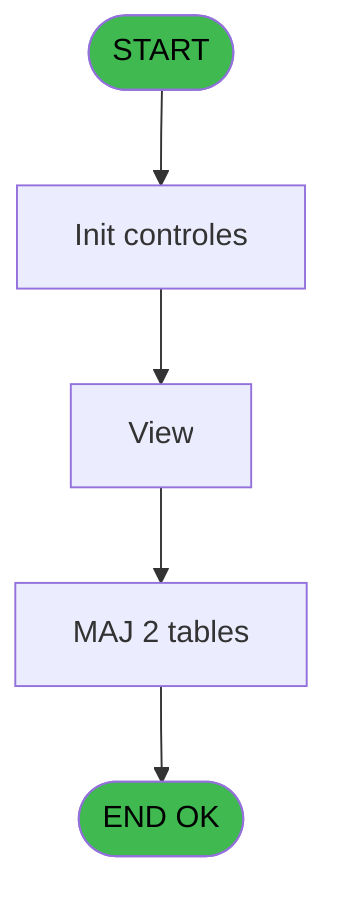
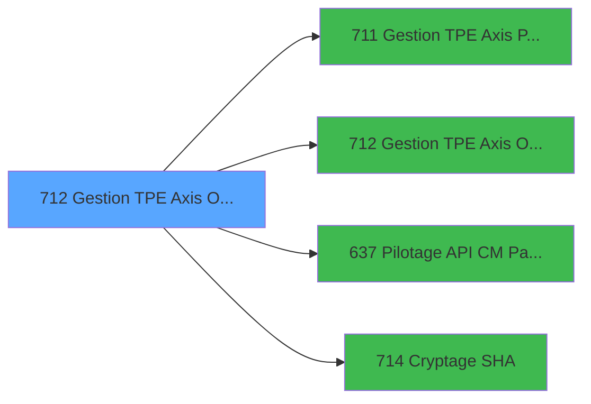

# REF IDE 712 - Gestion TPE Axis Omnicanal

> **Analyse**: Phases 1-4 2026-02-03 13:52 -> 13:52 (17s) | Assemblage 13:52
> **Pipeline**: V7.2 Enrichi
> **Structure**: 4 onglets (Resume | Ecrans | Donnees | Connexions)

<!-- TAB:Resume -->

## 1. FICHE D'IDENTITE

| Attribut | Valeur |
|----------|--------|
| Projet | REF |
| IDE Position | 712 |
| Nom Programme | Gestion TPE Axis Omnicanal |
| Fichier source | `Prg_712.xml` |
| Dossier IDE | General |
| Taches | 18 (1 ecrans visibles) |
| Tables modifiees | 2 |
| Programmes appeles | 4 |

## 2. DESCRIPTION FONCTIONNELLE

**Gestion TPE Axis Omnicanal** assure la gestion complete de ce processus, accessible depuis [Gestion TPE Axis Omnicanal (IDE 712)](REF-IDE-712.md), [Appel Gestion TPE Axis (IDE 718)](REF-IDE-718.md).

Le flux de traitement s'organise en **3 blocs fonctionnels** :

- **Traitement** (16 taches) : traitements metier divers
- **Validation** (1 tache) : controles et verifications de coherence
- **Calcul** (1 tache) : calculs de montants, stocks ou compteurs

**Donnees modifiees** : 2 tables en ecriture (maj_appli_tpe, Table_920).

**Logique metier** : 3 regles identifiees couvrant conditions metier.

Detail : phases du traitement

#### Phase 1 : Traitement (16 taches)

- **712** - Gestion TPE Axis Omnicanal
- **712.1** - Generation Fichier Commande
- **712.2** - Generation Fichier Commande
- **712.3** - Création XML
- **712.3.1** - Get Info
- **712.4** - Lecture XML VAD
- **712.5** - Check version
- **712.5.1** - Check if update needed
- **712.5.1.1** - Gestion c3config
- **712.5.1.2.1** - Cloture campagne maj
- **712.6** - Check version bck
- **712.6.1** - Check if update needed
- **712.7** - Gestion c3config
- **712.8** - View **[[ECRAN]](#ecran-t17)**
- **712.9** - Ecriture Log
- **712.10** - Envoi Mail VAD

Delegue a : [Gestion TPE Axis PushAlias (IDE 711)](REF-IDE-711.md), [Gestion TPE Axis Omnicanal (IDE 712)](REF-IDE-712.md), [Cryptage SHA (IDE 714)](REF-IDE-714.md)

#### Phase 2 : Calcul (1 tache)

- **712.2.1** - Calcul Message Erreur

#### Phase 3 : Validation (1 tache)

- **712.5.1.2** - Verif fin maj

#### Tables impactees

| Table | Operations | Role metier |
|-------|-----------|-------------|
| maj_appli_tpe | R/**W** (3 usages) |  |
| Table_920 | **W** (1 usages) |  |

## 3. BLOCS FONCTIONNELS

### 3.1 Traitement (16 taches)

Traitements internes.

---

#### 712 - Gestion TPE Axis Omnicanal

**Role** : Tache d'orchestration : point d'entree du programme (16 sous-taches). Coordonne l'enchainement des traitements.

15 sous-taches directes

| Tache | Nom | Bloc |
|-------|-----|------|
| [712.1](#t2) | Generation Fichier Commande | Traitement |
| [712.2](#t3) | Generation Fichier Commande | Traitement |
| [712.3](#t6) | Création XML | Traitement |
| [712.3.1](#t7) | Get Info | Traitement |
| [712.4](#t8) | Lecture XML VAD | Traitement |
| [712.5](#t9) | Check version | Traitement |
| [712.5.1](#t10) | Check if update needed | Traitement |
| [712.5.1.1](#t11) | Gestion c3config | Traitement |
| [712.5.1.2.1](#t13) | Cloture campagne maj | Traitement |
| [712.6](#t14) | Check version bck | Traitement |
| [712.6.1](#t15) | Check if update needed | Traitement |
| [712.7](#t16) | Gestion c3config | Traitement |
| [712.8](#t17) | View **[[ECRAN]](#ecran-t17)** | Traitement |
| [712.9](#t18) | Ecriture Log | Traitement |
| [712.10](#t19) | Envoi Mail VAD | Traitement |

**Variables liees** : K (P.i.o.Num Dossier Axis)

---

#### 712.1 - Generation Fichier Commande

**Role** : Traitement : Generation Fichier Commande.
**Variables liees** : BI (v.Execution Commande), U (Message Commande)

---

#### 712.2 - Generation Fichier Commande

**Role** : Traitement : Generation Fichier Commande.
**Variables liees** : BI (v.Execution Commande), U (Message Commande)

---

#### 712.3 - Création XML

**Role** : Traitement : Création XML.

---

#### 712.3.1 - Get Info

**Role** : Consultation/chargement : Get Info.

---

#### 712.4 - Lecture XML VAD

**Role** : Traitement : Lecture XML VAD.

---

#### 712.5 - Check version

**Role** : Traitement : Check version.
**Variables liees** : Q (P.i.Easy Check Out)

---

#### 712.5.1 - Check if update needed

**Role** : Traitement : Check if update needed.
**Variables liees** : Q (P.i.Easy Check Out)

---

#### 712.5.1.1 - Gestion c3config

**Role** : Gestion du moyen de paiement : Gestion c3config.

---

#### 712.5.1.2.1 - Cloture campagne maj

**Role** : Traitement : Cloture campagne maj.

---

#### 712.6 - Check version bck

**Role** : Traitement : Check version bck.
**Variables liees** : Q (P.i.Easy Check Out)

---

#### 712.6.1 - Check if update needed

**Role** : Traitement : Check if update needed.
**Variables liees** : Q (P.i.Easy Check Out)

---

#### 712.7 - Gestion c3config

**Role** : Gestion du moyen de paiement : Gestion c3config.

---

#### 712.8 - View [[ECRAN]](#ecran-t17)

**Role** : Traitement : View.
**Ecran** : 536 x 487 DLU | [Voir mockup](#ecran-t17)

---

#### 712.9 - Ecriture Log

**Role** : Traitement : Ecriture Log.

---

#### 712.10 - Envoi Mail VAD

**Role** : Traitement : Envoi Mail VAD.
**Variables liees** : S (P.i.o. Mail adress to)

### 3.2 Calcul (1 tache)

Calculs metier : montants, stocks, compteurs.

---

#### 712.2.1 - Calcul Message Erreur

**Role** : Calcul : Calcul Message Erreur.
**Variables liees** : P (P.o.Message Erreur), X (v.Code Erreur), U (Message Commande), V (Message Reponse)

### 3.3 Validation (1 tache)

Controles de coherence : 1 tache verifie les donnees et conditions.

---

#### 712.5.1.2 - Verif fin maj

**Role** : Verification : Verif fin maj.

## 5. REGLES METIER

3 regles identifiees:

### Autres (3 regles)

#### [RM-001] Si GetLang() vaut 'ANG' alors 'en_US', sinon 'fr_FR'

| Element | Detail |
|---------|--------|
| **Condition** | `GetLang()='ANG'` |
| **Si vrai** | 'en_US' |
| **Si faux** | 'fr_FR') |
| **Expression source** | Expression 38 : `IF(GetLang()='ANG','en_US','fr_FR')` |
| **Exemple** | Si GetLang()='ANG' → 'en_US'. Sinon → 'fr_FR') |

#### [RM-002] Si Translate('%club_test%') vaut 'T' alors 'T', sinon 'P'

| Element | Detail |
|---------|--------|
| **Condition** | `Translate('%club_test%')='T'` |
| **Si vrai** | 'T' |
| **Si faux** | 'P') |
| **Expression source** | Expression 40 : `IF(Translate('%club_test%')='T','T','P')` |
| **Exemple** | Si Translate('%club_test%')='T' → 'T'. Sinon → 'P') |

#### [RM-003] Si P.i.Operation [F] vaut 'S' alors 'PAY', sinon 'BLO'

| Element | Detail |
|---------|--------|
| **Condition** | `P.i.Operation [F]='S'` |
| **Si vrai** | 'PAY' |
| **Si faux** | 'BLO') |
| **Variables** | F (P.i.Operation) |
| **Expression source** | Expression 66 : `IF(P.i.Operation [F]='S','PAY','BLO')` |
| **Exemple** | Si P.i.Operation [F]='S' → 'PAY'. Sinon → 'BLO') |

## 6. CONTEXTE

- **Appele par**: [Gestion TPE Axis Omnicanal (IDE 712)](REF-IDE-712.md), [Appel Gestion TPE Axis (IDE 718)](REF-IDE-718.md)
- **Appelle**: 4 programmes | **Tables**: 11 (W:2 R:4 L:7) | **Taches**: 18 | **Expressions**: 73

<!-- TAB:Ecrans -->

## 8. ECRANS

### 8.1 Forms visibles (1 / 18)

| # | Position | Tache | Nom | Type | Largeur | Hauteur | Bloc |
|---|----------|-------|-----|------|---------|---------|------|
| 1 | 712.8 | 712.8 | View | Type0 | 536 | 487 | Traitement |

### 8.2 Mockups Ecrans

---

#### 712.8 - View
**Tache** : [712.8](#t17) | **Type** : Type0 | **Dimensions** : 536 x 487 DLU
**Bloc** : Traitement | **Titre IDE** : View

<!-- FORM-DATA:
{
    "width":  536,
    "vFactor":  8,
    "type":  "Type0",
    "hFactor":  4,
    "controls":  [
                     {
                         "x":  0,
                         "type":  "label",
                         "var":  "",
                         "y":  200,
                         "w":  43,
                         "fmt":  "",
                         "name":  "",
                         "h":  9,
                         "color":  "",
                         "text":  "v.URL WS",
                         "parent":  null
                     },
                     {
                         "x":  0,
                         "type":  "label",
                         "var":  "",
                         "y":  224,
                         "w":  26,
                         "fmt":  "",
                         "name":  "",
                         "h":  9,
                         "color":  "",
                         "text":  "v.XML",
                         "parent":  null
                     },
                     {
                         "x":  4,
                         "type":  "edit",
                         "var":  "",
                         "y":  8,
                         "w":  9,
                         "fmt":  "",
                         "name":  "Texte",
                         "h":  10,
                         "color":  "",
                         "text":  "",
                         "parent":  null
                     },
                     {
                         "x":  4,
                         "type":  "edit",
                         "var":  "",
                         "y":  24,
                         "w":  308,
                         "fmt":  "",
                         "name":  "",
                         "h":  168,
                         "color":  "",
                         "text":  "",
                         "parent":  null
                     },
                     {
                         "x":  44,
                         "type":  "edit",
                         "var":  "",
                         "y":  200,
                         "w":  480,
                         "fmt":  "",
                         "name":  "v.URL WS",
                         "h":  10,
                         "color":  "",
                         "text":  "",
                         "parent":  null
                     },
                     {
                         "x":  36,
                         "type":  "edit",
                         "var":  "",
                         "y":  224,
                         "w":  500,
                         "fmt":  "",
                         "name":  "v.XML",
                         "h":  224,
                         "color":  "",
                         "text":  "",
                         "parent":  null
                     }
                 ],
    "taskId":  "712.8",
    "height":  487
}
-->

<strong>Champs : 4 champs</strong>

| Pos (x,y) | Nom | Variable | Type |
|-----------|-----|----------|------|
| 4,8 | Texte | - | edit |
| 4,24 | (sans nom) | - | edit |
| 44,200 | v.URL WS | - | edit |
| 36,224 | v.XML | - | edit |

## 9. NAVIGATION

Ecran unique: **View**

### 9.3 Structure hierarchique (18 taches)

| Position | Tache | Type | Dimensions | Bloc |
|----------|-------|------|------------|------|
| **712.1** | [**Gestion TPE Axis Omnicanal** (712)](#t1) | - | - | Traitement |
| 712.1.1 | [Generation Fichier Commande (712.1)](#t2) | - | - | |
| 712.1.2 | [Generation Fichier Commande (712.2)](#t3) | - | - | |
| 712.1.3 | [Création XML (712.3)](#t6) | - | - | |
| 712.1.4 | [Get Info (712.3.1)](#t7) | - | - | |
| 712.1.5 | [Lecture XML VAD (712.4)](#t8) | - | - | |
| 712.1.6 | [Check version (712.5)](#t9) | - | - | |
| 712.1.7 | [Check if update needed (712.5.1)](#t10) | - | - | |
| 712.1.8 | [Gestion c3config (712.5.1.1)](#t11) | - | - | |
| 712.1.9 | [Cloture campagne maj (712.5.1.2.1)](#t13) | - | - | |
| 712.1.10 | [Check version bck (712.6)](#t14) | - | - | |
| 712.1.11 | [Check if update needed (712.6.1)](#t15) | - | - | |
| 712.1.12 | [Gestion c3config (712.7)](#t16) | - | - | |
| 712.1.13 | [View (712.8)](#t17) [mockup](#ecran-t17) | - | 536x487 | |
| 712.1.14 | [Ecriture Log (712.9)](#t18) | - | - | |
| 712.1.15 | [Envoi Mail VAD (712.10)](#t19) | - | - | |
| **712.2** | [**Calcul Message Erreur** (712.2.1)](#t4) | - | - | Calcul |
| **712.3** | [**Verif fin maj** (712.5.1.2)](#t12) | - | - | Validation |

### 9.4 Algorigramme

> **Legende**: Vert = START/END OK | Rouge = END KO | Bleu = Decisions
> *Algorigramme auto-genere. Utiliser `/algorigramme` pour une synthese metier detaillee.*

<!-- TAB:Donnees -->

## 10. TABLES

### Tables utilisees (11)

| ID | Nom | Description | Type | R | W | L | Usages |
|----|-----|-------------|------|---|---|---|--------|
| 31 | gm-complet_______gmc |  | DB | R |   |   | 2 |
| 68 | compteurs________cpt | Comptes GM (generaux) | DB |   |   | L | 1 |
| 89 | moyen_paiement___mop |  | DB |   |   | L | 1 |
| 285 | email |  | DB |   |   | L | 1 |
| 368 | pms_village |  | DB |   |   | L | 1 |
| 834 | tpe_par_terminal |  | DB | R |   | L | 2 |
| 862 | param_traitement_mail |  | DB | R |   |   | 1 |
| 863 | file_traitement_mail | Services / filieres | DB |   |   | L | 1 |
| 866 | maj_appli_tpe |  | DB | R | **W** |   | 3 |
| 867 | log_maj_tpe |  | DB |   |   | L | 2 |
| 920 | Table_920 |  | MEM |   | **W** |   | 1 |

### Colonnes par table (7 / 5 tables avec colonnes identifiees)

Table 31 - gm-complet_______gmc (R) - 2 usages

| Lettre | Variable | Acces | Type |
|--------|----------|-------|------|
| BA | v.ticket | R | Blob |
| BE | v. Reponse WS | R | Blob |

Table 834 - tpe_par_terminal (R/L) - 2 usages

| Lettre | Variable | Acces | Type |
|--------|----------|-------|------|
| A | v.retour log maj | R | Logical |
| B | v.fin tache | R | Logical |

Table 862 - param_traitement_mail (R) - 1 usages

| Lettre | Variable | Acces | Type |
|--------|----------|-------|------|
| B | Email | R | Alpha |
| S | P.i.o. Mail adress to | R | Alpha |

Table 866 - maj_appli_tpe (R/**W**) - 3 usages

| Lettre | Variable | Acces | Type |
|--------|----------|-------|------|
| A | v.retour maj appli | W | Logical |
| B | v.retour maj tpe | W | Logical |
| C | v.lancement check version | W | Logical |
| D | v.test fin campagne | W | Logical |

Table 920 - Table_920 (**W**) - 1 usages

*Table utilisee uniquement en Link ou aucune colonne Real identifiee dans le DataView.*

## 11. VARIABLES

### 11.1 Parametres entrants (20)

Variables recues du programme appelant ([Gestion TPE Axis Omnicanal (IDE 712)](REF-IDE-712.md)).

| Lettre | Nom | Type | Usage dans |
|--------|-----|------|-----------|
| A | P.i.Code Societe | Alpha | 1x parametre entrant |
| B | P.i.Code Village | Alpha | 2x parametre entrant |
| C | P.i.Num Caisse | Alpha | 5x parametre entrant |
| D | P.i.num TPE | Alpha | 10x parametre entrant |
| E | P.i. Montant | Numeric | 4x parametre entrant |
| F | P.i.Operation | Alpha | 21x parametre entrant |
| G | P.i.Code Devise | Alpha | 4x parametre entrant |
| H | P.i.Code Adherent | Numeric | 2x parametre entrant |
| I | P.i.Filiation | Numeric | 1x parametre entrant |
| J | P.i.o.Num Dossier PMS | Alpha | 3x parametre entrant |
| K | P.i.o.Num Dossier Axis | Alpha | [712](#t1) |
| L | P.o.Num Autorisation | Alpha | - |
| M | P.o. C3 Signature | Alpha | - |
| N | P.i.o.MOP | Alpha | 1x parametre entrant |
| O | P.o.Transaction Validée | Logical | 1x parametre entrant |
| P | P.o.Message Erreur | Alpha | - |
| Q | P.i.Easy Check Out | Logical | - |
| R | P.i.o.Token Id | Alpha | - |
| S | P.i.o. Mail adress to | Alpha | [712.10](#t19) |
| T | P.o Transaction_id | Unicode | - |

### 11.2 Variables de session (13)

Variables persistantes pendant toute la session.

| Lettre | Nom | Type | Usage dans |
|--------|-----|------|-----------|
| W | v.Code Reponse | Alpha | - |
| X | v.Code Erreur | Alpha | - |
| Y | v. C3 Type Carte | Alpha | - |
| Z | v. C3 Sous Type | Alpha | - |
| BA | v.ticket | Blob | 1x session |
| BB | v.URL | Alpha | - |
| BC | v.Reponse Numerique | Numeric | - |
| BD | v.XML | Alpha | - |
| BE | v. Reponse WS | Blob | - |
| BF | v. Acceptance | Alpha | - |
| BG | v.Status | Alpha | - |
| BH | v.URL WS | Alpha | - |
| BI | v.Execution Commande | Logical | - |

### 11.3 Autres (2)

Variables diverses.

| Lettre | Nom | Type | Usage dans |
|--------|-----|------|-----------|
| U | Message Commande | Alpha | - |
| V | Message Reponse | Alpha | - |

Toutes les 35 variables (liste complete)

| Cat | Lettre | Nom Variable | Type |
|-----|--------|--------------|------|
| P0 | **A** | P.i.Code Societe | Alpha |
| P0 | **B** | P.i.Code Village | Alpha |
| P0 | **C** | P.i.Num Caisse | Alpha |
| P0 | **D** | P.i.num TPE | Alpha |
| P0 | **E** | P.i. Montant | Numeric |
| P0 | **F** | P.i.Operation | Alpha |
| P0 | **G** | P.i.Code Devise | Alpha |
| P0 | **H** | P.i.Code Adherent | Numeric |
| P0 | **I** | P.i.Filiation | Numeric |
| P0 | **J** | P.i.o.Num Dossier PMS | Alpha |
| P0 | **K** | P.i.o.Num Dossier Axis | Alpha |
| P0 | **L** | P.o.Num Autorisation | Alpha |
| P0 | **M** | P.o. C3 Signature | Alpha |
| P0 | **N** | P.i.o.MOP | Alpha |
| P0 | **O** | P.o.Transaction Validée | Logical |
| P0 | **P** | P.o.Message Erreur | Alpha |
| P0 | **Q** | P.i.Easy Check Out | Logical |
| P0 | **R** | P.i.o.Token Id | Alpha |
| P0 | **S** | P.i.o. Mail adress to | Alpha |
| P0 | **T** | P.o Transaction_id | Unicode |
| V. | **W** | v.Code Reponse | Alpha |
| V. | **X** | v.Code Erreur | Alpha |
| V. | **Y** | v. C3 Type Carte | Alpha |
| V. | **Z** | v. C3 Sous Type | Alpha |
| V. | **BA** | v.ticket | Blob |
| V. | **BB** | v.URL | Alpha |
| V. | **BC** | v.Reponse Numerique | Numeric |
| V. | **BD** | v.XML | Alpha |
| V. | **BE** | v. Reponse WS | Blob |
| V. | **BF** | v. Acceptance | Alpha |
| V. | **BG** | v.Status | Alpha |
| V. | **BH** | v.URL WS | Alpha |
| V. | **BI** | v.Execution Commande | Logical |
| Autre | **U** | Message Commande | Alpha |
| Autre | **V** | Message Reponse | Alpha |

## 12. EXPRESSIONS

**73 / 73 expressions decodees (100%)**

### 12.1 Repartition par type

| Type | Expressions | Regles |
|------|-------------|--------|
| FORMAT | 7 | 0 |
| CONDITION | 21 | 3 |
| CONCATENATION | 9 | 0 |
| CONSTANTE | 6 | 0 |
| OTHER | 25 | 0 |
| CAST_LOGIQUE | 2 | 0 |
| NEGATION | 1 | 0 |
| STRING | 2 | 0 |

### 12.2 Expressions cles par type

#### FORMAT (7 expressions)

| Type | IDE | Expression | Regle |
|------|-----|------------|-------|
| FORMAT | 62 | `P.i.Code Village [B]&IF(VG29,GetShortHostname (),Str(Term(),'3P0'))&DStr(Date(),'YYYYMMDD')&TStr(Time(),'HHMMSS')` | - |
| FORMAT | 3 | `InStr('DCA',P.i.Operation [F])>0` | - |
| FORMAT | 10 | `InStr('NGR',P.i.Operation [F])>0` | - |
| FORMAT | 55 | `FileCopy('c:\temp\pr.xml',Translate('%club_exportdata%')&'Ogone\PR_'&Str(P.i.Code Adherent [H],'9P0')&'_'&DStr(Date(),'YYYYMMDD')&'_'&TStr(Time(),'HHMMSS')&'.XML')` | - |
| FORMAT | 29 | `Str(P.i. Montant [E]*100,'12P0')&P.i.Code Devise [G]&Fill(' ',15)&'M'&IF(P.i.Operation [F]='G','0','G')&' 0 '&IF(P.i.Operation [F]='G','1','0')&P.i.num TPE [D]&P.i.Num Caisse [C]&Fill(' ',222)&'110640  ^00'` | - |
| ... | | *+2 autres* | |

#### CONDITION (21 expressions)

| Type | IDE | Expression | Regle |
|------|-----|------------|-------|
| CONDITION | 40 | `IF(Translate('%club_test%')='T','T','P')` | [RM-002](#rm-RM-002) |
| CONDITION | 38 | `IF(GetLang()='ANG','en_US','fr_FR')` | [RM-001](#rm-RM-001) |
| CONDITION | 66 | `IF(P.i.Operation [F]='S','PAY','BLO')` | [RM-003](#rm-RM-003) |
| CONDITION | 46 | `ExpCalc('38'EXP)='P'` | - |
| CONDITION | 64 | `P.i.o. Mail adress to [S]<>''` | - |
| ... | | *+16 autres* | |

#### CONCATENATION (9 expressions)

| Type | IDE | Expression | Regle |
|------|-----|------------|-------|
| CONCATENATION | 24 | `Fill(' ',30)&'V03'&Fill(' ',3)&P.i.num TPE [D]` | - |
| CONCATENATION | 21 | `Fill(' ',30)&'L'&Fill(' ',5)&P.i.num TPE [D]` | - |
| CONCATENATION | 33 | `'000000000000'&P.i.Code Devise [G]&Fill(' ',15)&'MG 0 0'&P.i.num TPE [D]&P.i.Num Caisse [C]&Fill(' ',210)&P.i.o.Num Dossier Axis [K]&'310640  ^00'` | - |
| CONCATENATION | 26 | `Fill(' ',30)&'V01'&Fill(' ',3)&P.i.num TPE [D]` | - |
| CONCATENATION | 19 | `Fill(' ',30)&'BC'&Fill(' ',4)&P.i.num TPE [D]&P.i.Num Caisse [C]` | - |
| ... | | *+4 autres* | |

#### CONSTANTE (6 expressions)

| Type | IDE | Expression | Regle |
|------|-----|------------|-------|
| CONSTANTE | 39 | `'SAL'` | - |
| CONSTANTE | 43 | `'http://athenabusr:21439/services/EasyCheckout_v1_0'` | - |
| CONSTANTE | 45 | `'http://athenabus:21039/services/EasyCheckout_v1_0'` | - |
| CONSTANTE | 6 | `'PMS'` | - |
| CONSTANTE | 8 | `''` | - |
| ... | | *+1 autres* | |

#### OTHER (25 expressions)

| Type | IDE | Expression | Regle |
|------|-----|------------|-------|
| OTHER | 59 | `[AA]` | - |
| OTHER | 61 | `File2Blb(Translate('%club_tpe%')&'ticket')` | - |
| OTHER | 65 | `NOT(VG57)` | - |
| OTHER | 54 | `NOT(FileExist(Translate('%club_exportdata%')&'Ogone'))` | - |
| OTHER | 56 | `P.i.num TPE [D]` | - |
| ... | | *+20 autres* | |

#### CAST_LOGIQUE (2 expressions)

| Type | IDE | Expression | Regle |
|------|-----|------------|-------|
| CAST_LOGIQUE | 57 | `'FALSE'LOG` | - |
| CAST_LOGIQUE | 7 | `'TRUE'LOG` | - |

#### NEGATION (1 expressions)

| Type | IDE | Expression | Regle |
|------|-----|------------|-------|
| NEGATION | 63 | `NOT VG45` | - |

#### STRING (2 expressions)

| Type | IDE | Expression | Regle |
|------|-----|------------|-------|
| STRING | 73 | `Trim(P.i.o.Num Dossier PMS [J])` | - |
| STRING | 41 | `Trim([AI])` | - |

### 12.3 Toutes les expressions (73)

Voir les 73 expressions

#### FORMAT (7)

| IDE | Expression Decodee |
|-----|-------------------|
| 29 | `Str(P.i. Montant [E]*100,'12P0')&P.i.Code Devise [G]&Fill(' ',15)&'M'&IF(P.i.Operation [F]='G','0','G')&' 0 '&IF(P.i.Operation [F]='G','1','0')&P.i.num TPE [D]&P.i.Num Caisse [C]&Fill(' ',222)&'110640  ^00'` |
| 31 | `Str(P.i. Montant [E]*100,'12P0')&P.i.Code Devise [G]&Fill(' ',15)&'M'&IF(P.i.Operation [F]='G','0','G')&' 0 '&IF(P.i.Operation [F]='G','1','0')&P.i.num TPE [D]&P.i.Num Caisse [C]&Fill(' ',129)&P.i.o.Num Dossier PMS [J]&Fill(' ',61)&'110640  ^00'` |
| 9 | `Str(P.i. Montant [E]*100,'12P0')&P.i.Code Devise [G]&Fill(' ',15)&CASE(P.i.Operation [F],'D','C','C','D','A','U','C')&'0 0 1'&P.i.num TPE [D]&P.i.Num Caisse [C]&Fill(' ',74)&'0'&Fill(' ',54)&P.i.o.Num Dossier PMS [J]&Fill(' ',62)&'1'` |
| 55 | `FileCopy('c:\temp\pr.xml',Translate('%club_exportdata%')&'Ogone\PR_'&Str(P.i.Code Adherent [H],'9P0')&'_'&DStr(Date(),'YYYYMMDD')&'_'&TStr(Time(),'HHMMSS')&'.XML')` |
| 62 | `P.i.Code Village [B]&IF(VG29,GetShortHostname (),Str(Term(),'3P0'))&DStr(Date(),'YYYYMMDD')&TStr(Time(),'HHMMSS')` |
| 3 | `InStr('DCA',P.i.Operation [F])>0` |
| 10 | `InStr('NGR',P.i.Operation [F])>0` |

#### CONDITION (21)

| IDE | Expression Decodee |
|-----|-------------------|
| 47 | `HTTPCall('POST',  Trim([AO]),Trim([AK]),'SOAPAction: EasyCheckout','Content-Type: text/xml;charset=UTF-8')` |
| 38 | `IF(GetLang()='ANG','en_US','fr_FR')` |
| 40 | `IF(Translate('%club_test%')='T','T','P')` |
| 66 | `IF(P.i.Operation [F]='S','PAY','BLO')` |
| 14 | `P.i.Operation [F]='I'` |
| 20 | `P.i.Operation [F]='J'` |
| 22 | `P.i.Operation [F]='E'` |
| 23 | `P.i.Operation [F]='E' AND P.o.Transaction Validée [O]` |
| 25 | `P.i.Operation [F]='M'` |
| 27 | `P.i.Operation [F]='T'` |
| 28 | `P.i.Operation [F]<>'I' AND P.i.Operation [F]<>'J' AND [AP]` |
| 36 | `P.i.Operation [F]='V'` |
| 42 | `[AJ]=6` |
| 44 | `ExpCalc('38'EXP)='T'` |
| 46 | `ExpCalc('38'EXP)='P'` |
| 64 | `P.i.o. Mail adress to [S]<>''` |
| 16 | `Trim([AH])<>''` |
| 30 | `Trim(P.i.Operation [F])='G'` |
| 32 | `Trim(P.i.Operation [F])='N'` |
| 34 | `Trim(P.i.Operation [F])='R'` |
| 60 | `Trim(P.i.Code Village [B])=''` |

#### CONCATENATION (9)

| IDE | Expression Decodee |
|-----|-------------------|
| 53 | `'cmd /c mkdir '&Translate('%club_exportdata%')&'Ogone'` |
| 11 | `Translate('%club_command%ingenico.bat')&' '&Left(Translate('%club_tpe%'),1)&' '&Translate('%club_tpe%')` |
| 17 | `FileRename(Translate('%club_tpe%')&'c3config',Translate('%club_tpe%')&'c3config.bck')` |
| 18 | `Fill(' ',30)&'A'&Fill(' ',5)&P.i.num TPE [D]` |
| 19 | `Fill(' ',30)&'BC'&Fill(' ',4)&P.i.num TPE [D]&P.i.Num Caisse [C]` |
| 21 | `Fill(' ',30)&'L'&Fill(' ',5)&P.i.num TPE [D]` |
| 24 | `Fill(' ',30)&'V03'&Fill(' ',3)&P.i.num TPE [D]` |
| 26 | `Fill(' ',30)&'V01'&Fill(' ',3)&P.i.num TPE [D]` |
| 33 | `'000000000000'&P.i.Code Devise [G]&Fill(' ',15)&'MG 0 0'&P.i.num TPE [D]&P.i.Num Caisse [C]&Fill(' ',210)&P.i.o.Num Dossier Axis [K]&'310640  ^00'` |

#### CONSTANTE (6)

| IDE | Expression Decodee |
|-----|-------------------|
| 6 | `'PMS'` |
| 8 | `''` |
| 12 | `'cmd'` |
| 39 | `'SAL'` |
| 43 | `'http://athenabusr:21439/services/EasyCheckout_v1_0'` |
| 45 | `'http://athenabus:21039/services/EasyCheckout_v1_0'` |

#### OTHER (25)

| IDE | Expression Decodee |
|-----|-------------------|
| 1 | `P.i.Code Societe [A]` |
| 2 | `P.i.o.MOP [N]` |
| 4 | `NOT(IN(P.i.Operation [F],'P','S','V'))` |
| 5 | `[AF]` |
| 13 | `Delay(20)` |
| 15 | `FileDelete(Translate('%club_tpe%')&'c3config.bck')` |
| 35 | `IN(P.i.Operation [F],'P','S','V')` |
| 37 | `IN(P.i.Operation [F],'P','S')` |
| 48 | `Blb2File([AL],'c:\temp\PR.XML')` |
| 49 | `SetCrsr(2)` |
| 50 | `SetCrsr(1)` |
| 51 | `NOT(FileExist(Translate('%env%stopvad.txt')))` |
| 52 | `NOT(ExpCalc('49'EXP))` |
| 54 | `NOT(FileExist(Translate('%club_exportdata%')&'Ogone'))` |
| 56 | `P.i.num TPE [D]` |
| 58 | `[AP]` |
| 59 | `[AA]` |
| 61 | `File2Blb(Translate('%club_tpe%')&'ticket')` |
| 65 | `NOT(VG57)` |
| 67 | `P.i. Montant [E]` |
| 68 | `P.i.Code Adherent [H]` |
| 69 | `P.i.Filiation [I]` |
| 70 | `VG57 AND IN(P.i.Operation [F],'P','S')` |
| 71 | `[AZ]` |
| 72 | `v.ticket [BA]` |

#### CAST_LOGIQUE (2)

| IDE | Expression Decodee |
|-----|-------------------|
| 7 | `'TRUE'LOG` |
| 57 | `'FALSE'LOG` |

#### NEGATION (1)

| IDE | Expression Decodee |
|-----|-------------------|
| 63 | `NOT VG45` |

#### STRING (2)

| IDE | Expression Decodee |
|-----|-------------------|
| 41 | `Trim([AI])` |
| 73 | `Trim(P.i.o.Num Dossier PMS [J])` |

<!-- TAB:Connexions -->

## 13. GRAPHE D'APPELS

### 13.1 Chaine depuis Main (Callers)

Main -> ... -> [Gestion TPE Axis Omnicanal (IDE 712)](REF-IDE-712.md) -> **Gestion TPE Axis Omnicanal (IDE 712)**

Main -> ... -> [Appel Gestion TPE Axis (IDE 718)](REF-IDE-718.md) -> **Gestion TPE Axis Omnicanal (IDE 712)**

### 13.2 Callers

| IDE | Nom Programme | Nb Appels |
|-----|---------------|-----------|
| [712](REF-IDE-712.md) | Gestion TPE Axis Omnicanal | 2 |
| [718](REF-IDE-718.md) | Appel Gestion TPE Axis | 2 |

### 13.3 Callees (programmes appeles)

### 13.4 Detail Callees avec contexte

| IDE | Nom Programme | Appels | Contexte |
|-----|---------------|--------|----------|
| [711](REF-IDE-711.md) | Gestion TPE Axis PushAlias | 5 | Gestion moyens paiement |
| [712](REF-IDE-712.md) | Gestion TPE Axis Omnicanal | 2 | Gestion moyens paiement |
| [637](REF-IDE-637.md) | Pilotage API CM Paiements | 1 | Sous-programme |
| [714](REF-IDE-714.md) | Cryptage SHA | 1 | Sous-programme |

## 14. RECOMMANDATIONS MIGRATION

### 14.1 Profil du programme

| Metrique | Valeur | Impact migration |
|----------|--------|-----------------|
| Lignes de logique | 615 | Programme volumineux |
| Expressions | 73 | Logique moderee |
| Tables WRITE | 2 | Impact faible |
| Sous-programmes | 4 | Peu de dependances |
| Ecrans visibles | 1 | Ecran unique ou traitement batch |
| Code desactive | 3.7% (23 / 615) | Code sain |
| Regles metier | 3 | Quelques regles a preserver |

### 14.2 Plan de migration par bloc

#### Traitement (16 taches: 1 ecran, 15 traitements)

- **Strategie** : Orchestrateur avec 1 ecrans (Razor/React) et 15 traitements backend (services).
- Les ecrans deviennent des composants UI, les traitements invisibles deviennent des services injectables.
- 4 sous-programme(s) a migrer ou a reutiliser depuis les services existants.
- Decomposer les taches en services unitaires testables.

#### Calcul (1 tache: 0 ecran, 1 traitement)

- **Strategie** : Services de calcul purs (Domain Services).
- Migrer la logique de calcul (stock, compteurs, montants)

#### Validation (1 tache: 0 ecran, 1 traitement)

- **Strategie** : FluentValidation avec validators specifiques.
- Chaque tache de validation -> un validator injectable

### 14.3 Dependances critiques

| Dependance | Type | Appels | Impact |
|------------|------|--------|--------|
| maj_appli_tpe | Table WRITE (Database) | 1x | Schema + repository |
| Table_920 | Table WRITE (Memory) | 1x | Schema + repository |
| [Gestion TPE Axis PushAlias (IDE 711)](REF-IDE-711.md) | Sous-programme | 5x | **CRITIQUE** - Gestion moyens paiement |
| [Gestion TPE Axis Omnicanal (IDE 712)](REF-IDE-712.md) | Sous-programme | 2x | Haute - Gestion moyens paiement |
| [Cryptage SHA (IDE 714)](REF-IDE-714.md) | Sous-programme | 1x | Normale - Sous-programme |
| [Pilotage API CM Paiements (IDE 637)](REF-IDE-637.md) | Sous-programme | 1x | Normale - Sous-programme |

---
*Spec DETAILED generee par Pipeline V7.2 - 2026-02-03 13:52*
