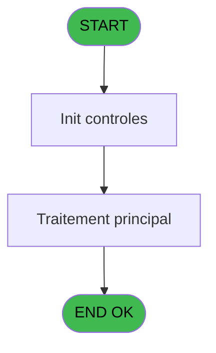
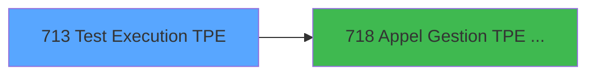

# REF IDE 713 - Test Execution TPE

> **Analyse**: Phases 1-4 2026-02-03 13:53 -> 13:53 (16s) | Assemblage 13:53
> **Pipeline**: V7.2 Enrichi
> **Structure**: 4 onglets (Resume | Ecrans | Donnees | Connexions)

<!-- TAB:Resume -->

## 1. FICHE D'IDENTITE

| Attribut | Valeur |
|----------|--------|
| Projet | REF |
| IDE Position | 713 |
| Nom Programme | Test Execution TPE |
| Fichier source | `Prg_713.xml` |
| Dossier IDE | General |
| Taches | 1 (1 ecrans visibles) |
| Tables modifiees | 0 |
| Programmes appeles | 1 |
| :warning: Statut | **ORPHELIN_POTENTIEL** |

## 2. DESCRIPTION FONCTIONNELLE

**Test Execution TPE** assure la gestion complete de ce processus.

Le flux de traitement s'organise en **1 blocs fonctionnels** :

- **Traitement** (1 tache) : traitements metier divers

## 3. BLOCS FONCTIONNELS

### 3.1 Traitement (1 tache)

Traitements internes.

---

#### 713 - Test Execution TPE [[ECRAN]](#ecran-t1)

**Role** : Verification : Test Execution TPE.
**Ecran** : 480 x 391 DLU | [Voir mockup](#ecran-t1)
**Delegue a** : [Appel Gestion TPE Axis (IDE 718)](REF-IDE-718.md)

## 5. REGLES METIER

*(Aucune regle metier identifiee)*

## 6. CONTEXTE

- **Appele par**: (aucun)
- **Appelle**: 1 programmes | **Tables**: 0 (W:0 R:0 L:0) | **Taches**: 1 | **Expressions**: 8

<!-- TAB:Ecrans -->

## 8. ECRANS

### 8.1 Forms visibles (1 / 1)

| # | Position | Tache | Nom | Type | Largeur | Hauteur | Bloc |
|---|----------|-------|-----|------|---------|---------|------|
| 1 | 713 | 713 | Test Execution TPE | Type0 | 480 | 391 | Traitement |

### 8.2 Mockups Ecrans

---

#### 713 - Test Execution TPE
**Tache** : [713](#t1) | **Type** : Type0 | **Dimensions** : 480 x 391 DLU
**Bloc** : Traitement | **Titre IDE** : Test Execution TPE

<!-- FORM-DATA:
{
    "width":  480,
    "vFactor":  8,
    "type":  "Type0",
    "hFactor":  4,
    "controls":  [
                     {
                         "x":  8,
                         "type":  "label",
                         "var":  "",
                         "y":  8,
                         "w":  78,
                         "fmt":  "",
                         "name":  "",
                         "h":  9,
                         "color":  "",
                         "text":  "p.Code Societe",
                         "parent":  null
                     },
                     {
                         "x":  8,
                         "type":  "label",
                         "var":  "",
                         "y":  24,
                         "w":  78,
                         "fmt":  "",
                         "name":  "",
                         "h":  9,
                         "color":  "",
                         "text":  "p.Code Village",
                         "parent":  null
                     },
                     {
                         "x":  8,
                         "type":  "label",
                         "var":  "",
                         "y":  40,
                         "w":  78,
                         "fmt":  "",
                         "name":  "",
                         "h":  9,
                         "color":  "",
                         "text":  "p.Num Caisse",
                         "parent":  null
                     },
                     {
                         "x":  8,
                         "type":  "label",
                         "var":  "",
                         "y":  56,
                         "w":  78,
                         "fmt":  "",
                         "name":  "",
                         "h":  9,
                         "color":  "",
                         "text":  "p.Num TPE",
                         "parent":  null
                     },
                     {
                         "x":  8,
                         "type":  "label",
                         "var":  "",
                         "y":  72,
                         "w":  78,
                         "fmt":  "",
                         "name":  "",
                         "h":  9,
                         "color":  "",
                         "text":  "p. Montant",
                         "parent":  null
                     },
                     {
                         "x":  8,
                         "type":  "label",
                         "var":  "",
                         "y":  88,
                         "w":  78,
                         "fmt":  "",
                         "name":  "",
                         "h":  9,
                         "color":  "",
                         "text":  "p.Operation",
                         "parent":  null
                     },
                     {
                         "x":  8,
                         "type":  "label",
                         "var":  "",
                         "y":  104,
                         "w":  78,
                         "fmt":  "",
                         "name":  "",
                         "h":  9,
                         "color":  "",
                         "text":  "p.Code Devise",
                         "parent":  null
                     },
                     {
                         "x":  8,
                         "type":  "label",
                         "var":  "",
                         "y":  120,
                         "w":  78,
                         "fmt":  "",
                         "name":  "",
                         "h":  9,
                         "color":  "",
                         "text":  "p.Code Adherent",
                         "parent":  null
                     },
                     {
                         "x":  8,
                         "type":  "label",
                         "var":  "",
                         "y":  136,
                         "w":  78,
                         "fmt":  "",
                         "name":  "",
                         "h":  9,
                         "color":  "",
                         "text":  "p.Filiation",
                         "parent":  null
                     },
                     {
                         "x":  8,
                         "type":  "label",
                         "var":  "",
                         "y":  152,
                         "w":  84,
                         "fmt":  "",
                         "name":  "",
                         "h":  9,
                         "color":  "",
                         "text":  "p.Num Dossier PMS",
                         "parent":  null
                     },
                     {
                         "x":  8,
                         "type":  "label",
                         "var":  "",
                         "y":  168,
                         "w":  84,
                         "fmt":  "",
                         "name":  "",
                         "h":  9,
                         "color":  "",
                         "text":  "p.Num Dossier Axis",
                         "parent":  null
                     },
                     {
                         "x":  8,
                         "type":  "label",
                         "var":  "",
                         "y":  184,
                         "w":  84,
                         "fmt":  "",
                         "name":  "",
                         "h":  9,
                         "color":  "",
                         "text":  "v.Num Autorisation",
                         "parent":  null
                     },
                     {
                         "x":  8,
                         "type":  "label",
                         "var":  "",
                         "y":  200,
                         "w":  84,
                         "fmt":  "",
                         "name":  "",
                         "h":  9,
                         "color":  "",
                         "text":  "v.MOP",
                         "parent":  null
                     },
                     {
                         "x":  8,
                         "type":  "label",
                         "var":  "",
                         "y":  216,
                         "w":  84,
                         "fmt":  "",
                         "name":  "",
                         "h":  9,
                         "color":  "",
                         "text":  "v.Transaction Validée",
                         "parent":  null
                     },
                     {
                         "x":  8,
                         "type":  "label",
                         "var":  "",
                         "y":  232,
                         "w":  84,
                         "fmt":  "",
                         "name":  "",
                         "h":  9,
                         "color":  "",
                         "text":  "v.Message Erreur",
                         "parent":  null
                     },
                     {
                         "x":  7,
                         "type":  "label",
                         "var":  "",
                         "y":  248,
                         "w":  84,
                         "fmt":  "",
                         "name":  "",
                         "h":  9,
                         "color":  "",
                         "text":  "v.Signature",
                         "parent":  null
                     },
                     {
                         "x":  7,
                         "type":  "label",
                         "var":  "",
                         "y":  264,
                         "w":  43,
                         "fmt":  "",
                         "name":  "",
                         "h":  9,
                         "color":  "",
                         "text":  "v.Token Id",
                         "parent":  null
                     },
                     {
                         "x":  7,
                         "type":  "label",
                         "var":  "",
                         "y":  281,
                         "w":  84,
                         "fmt":  "",
                         "name":  "",
                         "h":  9,
                         "color":  "",
                         "text":  "v.Email",
                         "parent":  null
                     },
                     {
                         "x":  7,
                         "type":  "label",
                         "var":  "",
                         "y":  296,
                         "w":  65,
                         "fmt":  "",
                         "name":  "",
                         "h":  9,
                         "color":  "",
                         "text":  "v.Transaction ID",
                         "parent":  null
                     },
                     {
                         "x":  104,
                         "type":  "edit",
                         "var":  "",
                         "y":  8,
                         "w":  368,
                         "fmt":  "",
                         "name":  "p.Code Societe",
                         "h":  10,
                         "color":  "",
                         "text":  "",
                         "parent":  null
                     },
                     {
                         "x":  104,
                         "type":  "edit",
                         "var":  "",
                         "y":  24,
                         "w":  368,
                         "fmt":  "",
                         "name":  "p.Code Village",
                         "h":  10,
                         "color":  "",
                         "text":  "",
                         "parent":  null
                     },
                     {
                         "x":  104,
                         "type":  "edit",
                         "var":  "",
                         "y":  40,
                         "w":  368,
                         "fmt":  "",
                         "name":  "p.Num Caisse",
                         "h":  10,
                         "color":  "",
                         "text":  "",
                         "parent":  null
                     },
                     {
                         "x":  104,
                         "type":  "edit",
                         "var":  "",
                         "y":  56,
                         "w":  368,
                         "fmt":  "",
                         "name":  "p.Num TPE",
                         "h":  10,
                         "color":  "",
                         "text":  "",
                         "parent":  null
                     },
                     {
                         "x":  104,
                         "type":  "edit",
                         "var":  "",
                         "y":  72,
                         "w":  368,
                         "fmt":  "",
                         "name":  "p. Montant",
                         "h":  10,
                         "color":  "",
                         "text":  "",
                         "parent":  null
                     },
                     {
                         "x":  104,
                         "type":  "combobox",
                         "var":  "",
                         "y":  88,
                         "w":  368,
                         "fmt":  "",
                         "name":  "p.Operation",
                         "h":  12,
                         "color":  "",
                         "text":  "I,D,C,A,G,N,J,V,S,E,M,T,P",
                         "parent":  null
                     },
                     {
                         "x":  104,
                         "type":  "edit",
                         "var":  "",
                         "y":  104,
                         "w":  368,
                         "fmt":  "",
                         "name":  "p.Code Devise",
                         "h":  10,
                         "color":  "",
                         "text":  "",
                         "parent":  null
                     },
                     {
                         "x":  104,
                         "type":  "edit",
                         "var":  "",
                         "y":  120,
                         "w":  368,
                         "fmt":  "",
                         "name":  "p.Code Adherent",
                         "h":  10,
                         "color":  "",
                         "text":  "",
                         "parent":  null
                     },
                     {
                         "x":  104,
                         "type":  "edit",
                         "var":  "",
                         "y":  136,
                         "w":  368,
                         "fmt":  "",
                         "name":  "p.Filiation",
                         "h":  10,
                         "color":  "",
                         "text":  "",
                         "parent":  null
                     },
                     {
                         "x":  104,
                         "type":  "edit",
                         "var":  "",
                         "y":  152,
                         "w":  368,
                         "fmt":  "",
                         "name":  "p.Num Dossier PMS",
                         "h":  10,
                         "color":  "",
                         "text":  "",
                         "parent":  null
                     },
                     {
                         "x":  104,
                         "type":  "edit",
                         "var":  "",
                         "y":  168,
                         "w":  368,
                         "fmt":  "",
                         "name":  "p.Num Dossier Axis",
                         "h":  10,
                         "color":  "",
                         "text":  "",
                         "parent":  null
                     },
                     {
                         "x":  104,
                         "type":  "edit",
                         "var":  "",
                         "y":  184,
                         "w":  368,
                         "fmt":  "",
                         "name":  "v.Num Autorisation",
                         "h":  10,
                         "color":  "",
                         "text":  "",
                         "parent":  null
                     },
                     {
                         "x":  104,
                         "type":  "edit",
                         "var":  "",
                         "y":  200,
                         "w":  368,
                         "fmt":  "",
                         "name":  "v.MOP",
                         "h":  10,
                         "color":  "",
                         "text":  "",
                         "parent":  null
                     },
                     {
                         "x":  104,
                         "type":  "edit",
                         "var":  "",
                         "y":  216,
                         "w":  368,
                         "fmt":  "",
                         "name":  "v.Transaction Validée",
                         "h":  10,
                         "color":  "",
                         "text":  "",
                         "parent":  null
                     },
                     {
                         "x":  104,
                         "type":  "edit",
                         "var":  "",
                         "y":  232,
                         "w":  368,
                         "fmt":  "",
                         "name":  "v.Message Erreur",
                         "h":  10,
                         "color":  "",
                         "text":  "",
                         "parent":  null
                     },
                     {
                         "x":  104,
                         "type":  "edit",
                         "var":  "",
                         "y":  248,
                         "w":  368,
                         "fmt":  "",
                         "name":  "v.Signature",
                         "h":  10,
                         "color":  "",
                         "text":  "",
                         "parent":  null
                     },
                     {
                         "x":  104,
                         "type":  "edit",
                         "var":  "",
                         "y":  264,
                         "w":  368,
                         "fmt":  "",
                         "name":  "v.Token Id",
                         "h":  10,
                         "color":  "",
                         "text":  "",
                         "parent":  null
                     },
                     {
                         "x":  103,
                         "type":  "edit",
                         "var":  "",
                         "y":  281,
                         "w":  368,
                         "fmt":  "",
                         "name":  "v.adresse email_0001",
                         "h":  10,
                         "color":  "",
                         "text":  "",
                         "parent":  null
                     },
                     {
                         "x":  103,
                         "type":  "edit",
                         "var":  "",
                         "y":  296,
                         "w":  368,
                         "fmt":  "",
                         "name":  "v.Transaction ID",
                         "h":  10,
                         "color":  "",
                         "text":  "",
                         "parent":  null
                     },
                     {
                         "x":  192,
                         "type":  "button",
                         "var":  "",
                         "y":  368,
                         "w":  96,
                         "fmt":  "Executer",
                         "name":  "Bt.Executer",
                         "h":  14,
                         "color":  "",
                         "text":  "",
                         "parent":  null
                     }
                 ],
    "taskId":  "713",
    "height":  391
}
-->

<strong>Champs : 19 champs</strong>

| Pos (x,y) | Nom | Variable | Type |
|-----------|-----|----------|------|
| 104,8 | p.Code Societe | - | edit |
| 104,24 | p.Code Village | - | edit |
| 104,40 | p.Num Caisse | - | edit |
| 104,56 | p.Num TPE | - | edit |
| 104,72 | p. Montant | - | edit |
| 104,88 | p.Operation | - | combobox |
| 104,104 | p.Code Devise | - | edit |
| 104,120 | p.Code Adherent | - | edit |
| 104,136 | p.Filiation | - | edit |
| 104,152 | p.Num Dossier PMS | - | edit |
| 104,168 | p.Num Dossier Axis | - | edit |
| 104,184 | v.Num Autorisation | - | edit |
| 104,200 | v.MOP | - | edit |
| 104,216 | v.Transaction Validée | - | edit |
| 104,232 | v.Message Erreur | - | edit |
| 104,248 | v.Signature | - | edit |
| 104,264 | v.Token Id | - | edit |
| 103,281 | v.adresse email_0001 | - | edit |
| 103,296 | v.Transaction ID | - | edit |

<strong>Boutons : 1 boutons</strong>

| Bouton | Pos (x,y) | Action |
|--------|-----------|--------|
| Executer | 192,368 | Bouton fonctionnel |

## 9. NAVIGATION

Ecran unique: **Test Execution TPE**

### 9.3 Structure hierarchique (1 tache)

| Position | Tache | Type | Dimensions | Bloc |
|----------|-------|------|------------|------|
| **713.1** | [**Test Execution TPE** (713)](#t1) [mockup](#ecran-t1) | - | 480x391 | Traitement |

### 9.4 Algorigramme

> **Legende**: Vert = START/END OK | Rouge = END KO | Bleu = Decisions
> *Algorigramme auto-genere. Utiliser `/algorigramme` pour une synthese metier detaillee.*

<!-- TAB:Donnees -->

## 10. TABLES

### Tables utilisees (0)

| ID | Nom | Description | Type | R | W | L | Usages |
|----|-----|-------------|------|---|---|---|--------|

### Colonnes par table (0 / 0 tables avec colonnes identifiees)

## 11. VARIABLES

### 11.1 Parametres entrants (11)

Variables recues en parametre.

| Lettre | Nom | Type | Usage dans |
|--------|-----|------|-----------|
| A | p.Code Societe | Alpha | - |
| B | p.Code Village | Alpha | - |
| C | p.Num Caisse | Alpha | - |
| D | p.Num TPE | Alpha | - |
| E | p. Montant | Numeric | - |
| F | p.Operation | Alpha | - |
| G | p.Code Devise | Alpha | - |
| H | p.Code Adherent | Numeric | - |
| I | p.Filiation | Numeric | - |
| J | p.Num Dossier PMS | Alpha | - |
| K | p.Num Dossier Axis | Alpha | - |

### 11.2 Variables de session (8)

Variables persistantes pendant toute la session.

| Lettre | Nom | Type | Usage dans |
|--------|-----|------|-----------|
| L | v.MOP | Alpha | - |
| M | v.Transaction Validée | Logical | - |
| N | v.Message Erreur | Alpha | - |
| O | v.Num Autorisation | Alpha | - |
| P | v.Signature | Alpha | - |
| Q | v.Token Id | Alpha | - |
| R | v.adresse email | Alpha | - |
| S | v.Transaction ID | Alpha | - |

Toutes les 19 variables (liste complete)

| Cat | Lettre | Nom Variable | Type |
|-----|--------|--------------|------|
| P0 | **A** | p.Code Societe | Alpha |
| P0 | **B** | p.Code Village | Alpha |
| P0 | **C** | p.Num Caisse | Alpha |
| P0 | **D** | p.Num TPE | Alpha |
| P0 | **E** | p. Montant | Numeric |
| P0 | **F** | p.Operation | Alpha |
| P0 | **G** | p.Code Devise | Alpha |
| P0 | **H** | p.Code Adherent | Numeric |
| P0 | **I** | p.Filiation | Numeric |
| P0 | **J** | p.Num Dossier PMS | Alpha |
| P0 | **K** | p.Num Dossier Axis | Alpha |
| V. | **L** | v.MOP | Alpha |
| V. | **M** | v.Transaction Validée | Logical |
| V. | **N** | v.Message Erreur | Alpha |
| V. | **O** | v.Num Autorisation | Alpha |
| V. | **P** | v.Signature | Alpha |
| V. | **Q** | v.Token Id | Alpha |
| V. | **R** | v.adresse email | Alpha |
| V. | **S** | v.Transaction ID | Alpha |

## 12. EXPRESSIONS

**8 / 8 expressions decodees (100%)**

### 12.1 Repartition par type

| Type | Expressions | Regles |
|------|-------------|--------|
| CONSTANTE | 8 | 0 |

### 12.2 Expressions cles par type

#### CONSTANTE (8 expressions)

| Type | IDE | Expression | Regle |
|------|-----|------------|-------|
| CONSTANTE | 6 | `'I'` | - |
| CONSTANTE | 5 | `1` | - |
| CONSTANTE | 8 | `''` | - |
| CONSTANTE | 7 | `'978'` | - |
| CONSTANTE | 2 | `'416'` | - |
| ... | | *+3 autres* | |

<!-- TAB:Connexions -->

## 13. GRAPHE D'APPELS

### 13.1 Chaine depuis Main (Callers)

**Chemin**: (pas de callers directs)

### 13.2 Callers

| IDE | Nom Programme | Nb Appels |
|-----|---------------|-----------|
| - | (aucun) | - |

### 13.3 Callees (programmes appeles)

### 13.4 Detail Callees avec contexte

| IDE | Nom Programme | Appels | Contexte |
|-----|---------------|--------|----------|
| [718](REF-IDE-718.md) | Appel Gestion TPE Axis | 1 | Gestion moyens paiement |

## 14. RECOMMANDATIONS MIGRATION

### 14.1 Profil du programme

| Metrique | Valeur | Impact migration |
|----------|--------|-----------------|
| Lignes de logique | 32 | Programme compact |
| Expressions | 8 | Peu de logique |
| Tables WRITE | 0 | Impact faible |
| Sous-programmes | 1 | Peu de dependances |
| Ecrans visibles | 1 | Ecran unique ou traitement batch |
| Code desactive | 0% (0 / 32) | Code sain |
| Regles metier | 0 | Pas de regle identifiee |

### 14.2 Plan de migration par bloc

#### Traitement (1 tache: 1 ecran, 0 traitement)

- **Strategie** : 1 composant(s) UI (Razor/React) avec formulaires et validation.
- 1 sous-programme(s) a migrer ou a reutiliser depuis les services existants.
- Decomposer les taches en services unitaires testables.

### 14.3 Dependances critiques

| Dependance | Type | Appels | Impact |
|------------|------|--------|--------|
| [Appel Gestion TPE Axis (IDE 718)](REF-IDE-718.md) | Sous-programme | 1x | Normale - Gestion moyens paiement |

---
*Spec DETAILED generee par Pipeline V7.2 - 2026-02-03 13:53*
