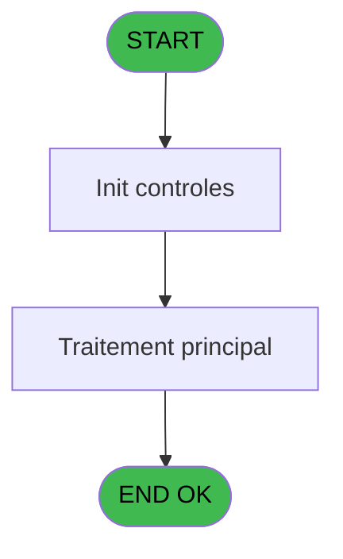
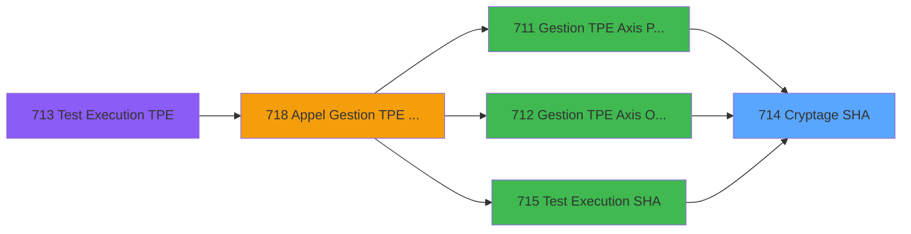

# REF IDE 714 - Cryptage SHA

> **Analyse**: Phases 1-4 2026-02-03 13:53 -> 13:53 (19s) | Assemblage 13:53
> **Pipeline**: V7.2 Enrichi
> **Structure**: 4 onglets (Resume | Ecrans | Donnees | Connexions)

<!-- TAB:Resume -->

## 1. FICHE D'IDENTITE

| Attribut | Valeur |
|----------|--------|
| Projet | REF |
| IDE Position | 714 |
| Nom Programme | Cryptage SHA |
| Fichier source | `Prg_714.xml` |
| Dossier IDE | General |
| Taches | 1 (0 ecrans visibles) |
| Tables modifiees | 0 |
| Programmes appeles | 0 |

## 2. DESCRIPTION FONCTIONNELLE

**Cryptage SHA** assure la gestion complete de ce processus, accessible depuis [Gestion TPE Axis PushAlias (IDE 711)](REF-IDE-711.md), [Gestion TPE Axis Omnicanal (IDE 712)](REF-IDE-712.md), [Test Execution SHA (IDE 715)](REF-IDE-715.md).

Le flux de traitement s'organise en **1 blocs fonctionnels** :

- **Traitement** (1 tache) : traitements metier divers

## 3. BLOCS FONCTIONNELS

### 3.1 Traitement (1 tache)

Traitements internes.

---

#### 714 - Cryptage SHA

**Role** : Traitement : Cryptage SHA.

## 5. REGLES METIER

*(Aucune regle metier identifiee)*

## 6. CONTEXTE

- **Appele par**: [Gestion TPE Axis PushAlias (IDE 711)](REF-IDE-711.md), [Gestion TPE Axis Omnicanal (IDE 712)](REF-IDE-712.md), [Test Execution SHA (IDE 715)](REF-IDE-715.md)
- **Appelle**: 0 programmes | **Tables**: 0 (W:0 R:0 L:0) | **Taches**: 1 | **Expressions**: 10

<!-- TAB:Ecrans -->

## 8. ECRANS

*(Programme sans ecran visible)*

## 9. NAVIGATION

### 9.3 Structure hierarchique (1 tache)

| Position | Tache | Type | Dimensions | Bloc |
|----------|-------|------|------------|------|
| **714.1** | [**Cryptage SHA** (714)](#t1) | - | - | Traitement |

### 9.4 Algorigramme

> **Legende**: Vert = START/END OK | Rouge = END KO | Bleu = Decisions
> *Algorigramme auto-genere. Utiliser `/algorigramme` pour une synthese metier detaillee.*

<!-- TAB:Donnees -->

## 10. TABLES

### Tables utilisees (0)

| ID | Nom | Description | Type | R | W | L | Usages |
|----|-----|-------------|------|---|---|---|--------|

### Colonnes par table (0 / 0 tables avec colonnes identifiees)

## 11. VARIABLES

### 11.1 Parametres entrants (9)

Variables recues du programme appelant ([Gestion TPE Axis PushAlias (IDE 711)](REF-IDE-711.md)).

| Lettre | Nom | Type | Usage dans |
|--------|-----|------|-----------|
| A | p.Amount | Numeric | 2x parametre entrant |
| B | p.Currency | Alpha | 2x parametre entrant |
| C | p.Language | Alpha | 2x parametre entrant |
| D | p.Operation | Alpha | 2x parametre entrant |
| E | p.Order Id | Alpha | 2x parametre entrant |
| F | p.PSPId | Alpha | 2x parametre entrant |
| G | p.SHA Key Type | Alpha | 3x parametre entrant |
| H | p.SHA String | Alpha | 2x parametre entrant |
| I | p.URL | Alpha | - |

### 11.2 Variables de session (3)

Variables persistantes pendant toute la session.

| Lettre | Nom | Type | Usage dans |
|--------|-----|------|-----------|
| J | v.Data String | Alpha | 1x session |
| K | v.SHA Key | Alpha | 1x session |
| L | v.Data URL | Alpha | 1x session |

## 12. EXPRESSIONS

**10 / 10 expressions decodees (100%)**

### 12.1 Repartition par type

| Type | Expressions | Regles |
|------|-------------|--------|
| FORMAT | 2 | 0 |
| CONCATENATION | 1 | 0 |
| CONSTANTE | 3 | 0 |
| CONDITION | 2 | 0 |
| OTHER | 1 | 0 |
| STRING | 1 | 0 |

### 12.2 Expressions cles par type

#### FORMAT (2 expressions)

| Type | IDE | Expression | Regle |
|------|-----|------------|-------|
| FORMAT | 9 | `'AMOUNT='&Trim(Str(p.Amount [A]*100,'12'))&'&CURRENCY='&Trim(p.Currency [B])&'&LANGUAGE='&Trim(p.Language [C])&'&OPERATION='&Trim(p.Operation [D])&'&ORDERID='&Trim(p.Order Id [E])&IF(VG137,'&PMLISTTYPE=2','')&'&PSPID='&Trim(p.PSPId [F])&'&SHASIGN='&Trim(p.SHA String [H])` | - |
| FORMAT | 2 | `'AMOUNT='&Trim(Str(p.Amount [A]*100,'12'))&Trim(v.SHA Key [K])&'CURRENCY='&Trim(p.Currency [B])&Trim(v.SHA Key [K])&'LANGUAGE='&Trim(p.Language [C])&Trim(v.SHA Key [K])&'OPERATION='&Trim(p.Operation [D])&Trim(v.SHA Key [K])&'ORDERID='&Trim(p.Order Id [E])&Trim(v.SHA Key [K])&IF(VG137,'PMLISTTYPE=2'&Trim(v.SHA Key [K]),'')&'PSPID='&Trim(p.PSPId [F])&Trim(v.SHA Key [K])` | - |

#### CONCATENATION (1 expressions)

| Type | IDE | Expression | Regle |
|------|-----|------------|-------|
| CONCATENATION | 10 | `'https://secure.ogone.com/ncol/'&IF(p.SHA Key Type [G]='T','test','prod')&'/orderstandard.asp?'&Trim(v.Data URL [L])` | - |

#### CONSTANTE (3 expressions)

| Type | IDE | Expression | Regle |
|------|-----|------------|-------|
| CONSTANTE | 5 | `'EXP_SHA_KEY_2013'` | - |
| CONSTANTE | 3 | `'ClubMedPushalias1projet'` | - |
| CONSTANTE | 1 | `''` | - |

#### CONDITION (2 expressions)

| Type | IDE | Expression | Regle |
|------|-----|------------|-------|
| CONDITION | 6 | `p.SHA Key Type [G]='P'` | - |
| CONDITION | 4 | `p.SHA Key Type [G]='T'` | - |

#### OTHER (1 expressions)

| Type | IDE | Expression | Regle |
|------|-----|------------|-------|
| OTHER | 8 | `Upper(p.SHA String [H])` | - |

#### STRING (1 expressions)

| Type | IDE | Expression | Regle |
|------|-----|------------|-------|
| STRING | 7 | `Trim(v.Data String [J])` | - |

<!-- TAB:Connexions -->

## 13. GRAPHE D'APPELS

### 13.1 Chaine depuis Main (Callers)

Main -> ... -> [Gestion TPE Axis PushAlias (IDE 711)](REF-IDE-711.md) -> **Cryptage SHA (IDE 714)**

Main -> ... -> [Gestion TPE Axis Omnicanal (IDE 712)](REF-IDE-712.md) -> **Cryptage SHA (IDE 714)**

Main -> ... -> [Test Execution SHA (IDE 715)](REF-IDE-715.md) -> **Cryptage SHA (IDE 714)**

### 13.2 Callers

| IDE | Nom Programme | Nb Appels |
|-----|---------------|-----------|
| [711](REF-IDE-711.md) | Gestion TPE Axis PushAlias | 1 |
| [712](REF-IDE-712.md) | Gestion TPE Axis Omnicanal | 1 |
| [715](REF-IDE-715.md) | Test Execution SHA | 1 |

### 13.3 Callees (programmes appeles)

### 13.4 Detail Callees avec contexte

| IDE | Nom Programme | Appels | Contexte |
|-----|---------------|--------|----------|
| - | (aucun) | - | - |

## 14. RECOMMANDATIONS MIGRATION

### 14.1 Profil du programme

| Metrique | Valeur | Impact migration |
|----------|--------|-----------------|
| Lignes de logique | 31 | Programme compact |
| Expressions | 10 | Peu de logique |
| Tables WRITE | 0 | Impact faible |
| Sous-programmes | 0 | Peu de dependances |
| Ecrans visibles | 0 | Ecran unique ou traitement batch |
| Code desactive | 3.2% (1 / 31) | Code sain |
| Regles metier | 0 | Pas de regle identifiee |

### 14.2 Plan de migration par bloc

#### Traitement (1 tache: 0 ecran, 1 traitement)

- **Strategie** : 1 service(s) backend injectable(s) (Domain Services).
- Decomposer les taches en services unitaires testables.

### 14.3 Dependances critiques

| Dependance | Type | Appels | Impact |
|------------|------|--------|--------|

---
*Spec DETAILED generee par Pipeline V7.2 - 2026-02-03 13:53*
