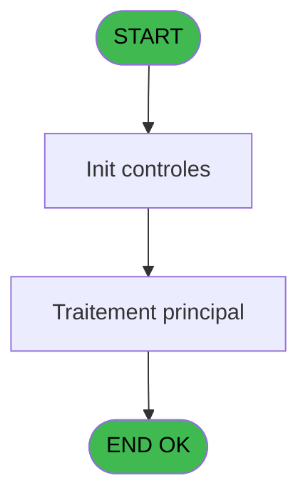
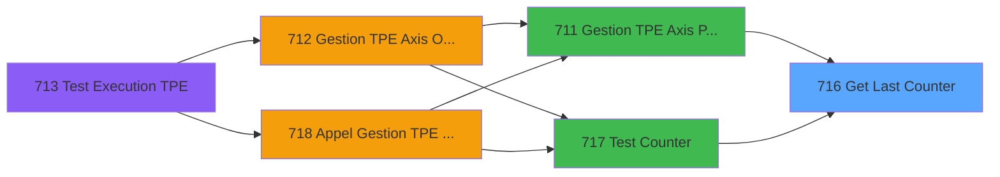

# REF IDE 716 - Get Last Counter

> **Analyse**: Phases 1-4 2026-02-03 13:54 -> 13:54 (16s) | Assemblage 13:54
> **Pipeline**: V7.2 Enrichi
> **Structure**: 4 onglets (Resume | Ecrans | Donnees | Connexions)

<!-- TAB:Resume -->

## 1. FICHE D'IDENTITE

| Attribut | Valeur |
|----------|--------|
| Projet | REF |
| IDE Position | 716 |
| Nom Programme | Get Last Counter |
| Fichier source | `Prg_716.xml` |
| Dossier IDE | General |
| Taches | 4 (0 ecrans visibles) |
| Tables modifiees | 0 |
| Programmes appeles | 0 |

## 2. DESCRIPTION FONCTIONNELLE

**Get Last Counter** assure la gestion complete de ce processus, accessible depuis [Gestion TPE Axis PushAlias (IDE 711)](REF-IDE-711.md), [Test Counter (IDE 717)](REF-IDE-717.md).

Le flux de traitement s'organise en **2 blocs fonctionnels** :

- **Traitement** (3 taches) : traitements metier divers
- **Creation** (1 tache) : insertion d'enregistrements en base (mouvements, prestations)

Detail : phases du traitement

#### Phase 1 : Traitement (3 taches)

- **716** - Get Last Counter
- **716.2** - Read
- **716.3** - Read

#### Phase 2 : Creation (1 tache)

- **716.1** - Insert

## 3. BLOCS FONCTIONNELS

### 3.1 Traitement (3 taches)

Traitements internes.

---

#### 716 - Get Last Counter

**Role** : Consultation/chargement : Get Last Counter.
**Variables liees** : B (p.Counter Id)

---

#### 716.2 - Read

**Role** : Traitement : Read.

---

#### 716.3 - Read

**Role** : Traitement : Read.

### 3.2 Creation (1 tache)

Insertion de nouveaux enregistrements en base.

---

#### 716.1 - Insert

**Role** : Creation d'enregistrement : Insert.

## 5. REGLES METIER

*(Aucune regle metier identifiee)*

## 6. CONTEXTE

- **Appele par**: [Gestion TPE Axis PushAlias (IDE 711)](REF-IDE-711.md), [Test Counter (IDE 717)](REF-IDE-717.md)
- **Appelle**: 0 programmes | **Tables**: 0 (W:0 R:0 L:0) | **Taches**: 4 | **Expressions**: 2

<!-- TAB:Ecrans -->

## 8. ECRANS

*(Programme sans ecran visible)*

## 9. NAVIGATION

### 9.3 Structure hierarchique (4 taches)

| Position | Tache | Type | Dimensions | Bloc |
|----------|-------|------|------------|------|
| **716.1** | [**Get Last Counter** (716)](#t1) | - | - | Traitement |
| 716.1.1 | [Read (716.2)](#t3) | - | - | |
| 716.1.2 | [Read (716.3)](#t4) | - | - | |
| **716.2** | [**Insert** (716.1)](#t2) | - | - | Creation |

### 9.4 Algorigramme

> **Legende**: Vert = START/END OK | Rouge = END KO | Bleu = Decisions
> *Algorigramme auto-genere. Utiliser `/algorigramme` pour une synthese metier detaillee.*

<!-- TAB:Donnees -->

## 10. TABLES

### Tables utilisees (0)

| ID | Nom | Description | Type | R | W | L | Usages |
|----|-----|-------------|------|---|---|---|--------|

### Colonnes par table (0 / 0 tables avec colonnes identifiees)

## 11. VARIABLES

### 11.1 Parametres entrants (3)

Variables recues du programme appelant ([Gestion TPE Axis PushAlias (IDE 711)](REF-IDE-711.md)).

| Lettre | Nom | Type | Usage dans |
|--------|-----|------|-----------|
| A | p.Société | Unicode | - |
| B | p.Counter Id | Unicode | - |
| C | p.Compteur | Numeric | - |

## 12. EXPRESSIONS

**2 / 2 expressions decodees (100%)**

### 12.1 Repartition par type

| Type | Expressions | Regles |
|------|-------------|--------|
| STRING | 2 | 0 |

### 12.2 Expressions cles par type

#### STRING (2 expressions)

| Type | IDE | Expression | Regle |
|------|-----|------------|-------|
| STRING | 2 | `Trim({1,2})` | - |
| STRING | 1 | `Trim({1,1})` | - |

<!-- TAB:Connexions -->

## 13. GRAPHE D'APPELS

### 13.1 Chaine depuis Main (Callers)

Main -> ... -> [Gestion TPE Axis PushAlias (IDE 711)](REF-IDE-711.md) -> **Get Last Counter (IDE 716)**

Main -> ... -> [Test Counter (IDE 717)](REF-IDE-717.md) -> **Get Last Counter (IDE 716)**

### 13.2 Callers

| IDE | Nom Programme | Nb Appels |
|-----|---------------|-----------|
| [711](REF-IDE-711.md) | Gestion TPE Axis PushAlias | 2 |
| [717](REF-IDE-717.md) | Test Counter | 1 |

### 13.3 Callees (programmes appeles)

### 13.4 Detail Callees avec contexte

| IDE | Nom Programme | Appels | Contexte |
|-----|---------------|--------|----------|
| - | (aucun) | - | - |

## 14. RECOMMANDATIONS MIGRATION

### 14.1 Profil du programme

| Metrique | Valeur | Impact migration |
|----------|--------|-----------------|
| Lignes de logique | 13 | Programme compact |
| Expressions | 2 | Peu de logique |
| Tables WRITE | 0 | Impact faible |
| Sous-programmes | 0 | Peu de dependances |
| Ecrans visibles | 0 | Ecran unique ou traitement batch |
| Code desactive | 0% (0 / 13) | Code sain |
| Regles metier | 0 | Pas de regle identifiee |

### 14.2 Plan de migration par bloc

#### Traitement (3 taches: 0 ecran, 3 traitements)

- **Strategie** : 3 service(s) backend injectable(s) (Domain Services).
- Decomposer les taches en services unitaires testables.

#### Creation (1 tache: 0 ecran, 1 traitement)

- **Strategie** : Repository pattern avec Entity Framework Core.
- Insertion via `IRepository<T>.CreateAsync()`

### 14.3 Dependances critiques

| Dependance | Type | Appels | Impact |
|------------|------|--------|--------|

---
*Spec DETAILED generee par Pipeline V7.2 - 2026-02-03 13:54*
