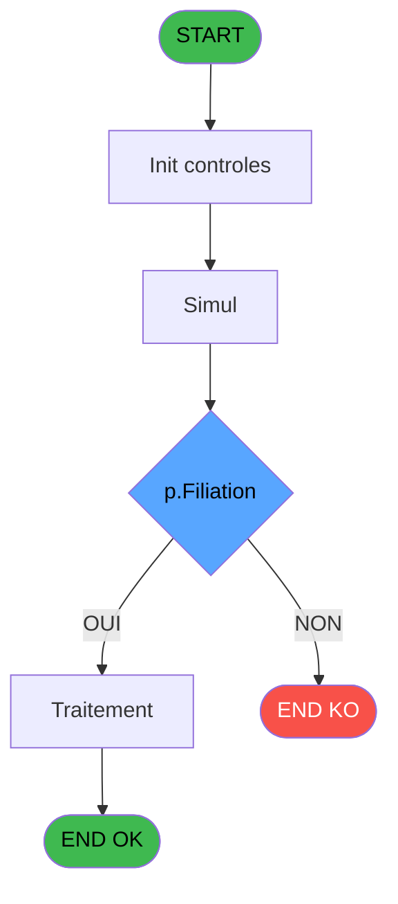
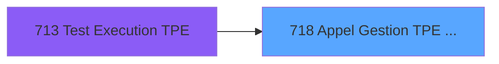
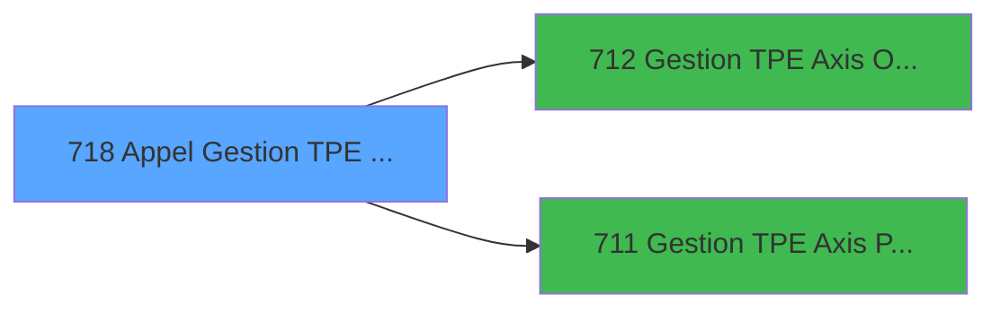

# REF IDE 718 - Appel Gestion TPE Axis

> **Analyse**: Phases 1-4 2026-02-03 13:55 -> 13:55 (18s) | Assemblage 13:55
> **Pipeline**: V7.2 Enrichi
> **Structure**: 4 onglets (Resume | Ecrans | Donnees | Connexions)

<!-- TAB:Resume -->

## 1. FICHE D'IDENTITE

| Attribut | Valeur |
|----------|--------|
| Projet | REF |
| IDE Position | 718 |
| Nom Programme | Appel Gestion TPE Axis |
| Fichier source | `Prg_718.xml` |
| Dossier IDE | General |
| Taches | 2 (1 ecrans visibles) |
| Tables modifiees | 0 |
| Programmes appeles | 2 |

## 2. DESCRIPTION FONCTIONNELLE

**Appel Gestion TPE Axis** assure la gestion complete de ce processus, accessible depuis [Test Execution TPE (IDE 713)](REF-IDE-713.md).

Le flux de traitement s'organise en **1 blocs fonctionnels** :

- **Traitement** (2 taches) : traitements metier divers

**Logique metier** : 2 regles identifiees couvrant conditions metier, valeurs par defaut.

## 3. BLOCS FONCTIONNELS

### 3.1 Traitement (2 taches)

Traitements internes.

---

#### 718 - Appel Gestion TPE Axis

**Role** : Gestion du moyen de paiement : Appel Gestion TPE Axis.
**Variables liees** : K (p.Num Dossier Axis)
**Delegue a** : [Gestion TPE Axis Omnicanal (IDE 712)](REF-IDE-712.md), [Gestion TPE Axis PushAlias (IDE 711)](REF-IDE-711.md)

---

#### 718.1 - Simul [[ECRAN]](#ecran-t2)

**Role** : Traitement : Simul.
**Ecran** : 331 x 380 DLU | [Voir mockup](#ecran-t2)
**Delegue a** : [Gestion TPE Axis Omnicanal (IDE 712)](REF-IDE-712.md), [Gestion TPE Axis PushAlias (IDE 711)](REF-IDE-711.md)

## 5. REGLES METIER

2 regles identifiees:

### Autres (2 regles)

#### [RM-001] Si p.Operation [F]='S' alors Trim(p.Token Id [R])='' sinon NOT(VG42))

| Element | Detail |
|---------|--------|
| **Condition** | `p.Operation [F]='S'` |
| **Si vrai** | Trim(p.Token Id [R])='' |
| **Si faux** | NOT(VG42)) |
| **Variables** | F (p.Operation), R (p.Token Id) |
| **Expression source** | Expression 2 : `IF(p.Operation [F]='S',Trim(p.Token Id [R])='',NOT(VG42))` |
| **Exemple** | Si p.Operation [F]='S' → Trim(p.Token Id [R])=''. Sinon → NOT(VG42)) |

#### [RM-002] Si Left(p.Num Dossier PMS [J] alors 1)='A' sinon Right(Trim(p.Num Dossier PMS [J]),Len(Trim(p.Num Dossier PMS [J]))-1),Trim(p.Num Dossier PMS [J]))

| Element | Detail |
|---------|--------|
| **Condition** | `Left(p.Num Dossier PMS [J]` |
| **Si vrai** | 1)='A' |
| **Si faux** | Right(Trim(p.Num Dossier PMS [J]),Len(Trim(p.Num Dossier PMS [J]))-1),Trim(p.Num Dossier PMS [J])) |
| **Variables** | J (p.Num Dossier PMS) |
| **Expression source** | Expression 4 : `IF(Left(p.Num Dossier PMS [J],1)='A',Right(Trim(p.Num Dossie` |
| **Exemple** | Si Left(p.Num Dossier PMS [J] → 1)='A' |

## 6. CONTEXTE

- **Appele par**: [Test Execution TPE (IDE 713)](REF-IDE-713.md)
- **Appelle**: 2 programmes | **Tables**: 0 (W:0 R:0 L:0) | **Taches**: 2 | **Expressions**: 4

<!-- TAB:Ecrans -->

## 8. ECRANS

### 8.1 Forms visibles (1 / 2)

| # | Position | Tache | Nom | Type | Largeur | Hauteur | Bloc |
|---|----------|-------|-----|------|---------|---------|------|
| 1 | 718.1 | 718.1 | Simul | Type0 | 331 | 380 | Traitement |

### 8.2 Mockups Ecrans

---

#### 718.1 - Simul
**Tache** : [718.1](#t2) | **Type** : Type0 | **Dimensions** : 331 x 380 DLU
**Bloc** : Traitement | **Titre IDE** : Simul

<!-- FORM-DATA:
{
    "width":  331,
    "vFactor":  8,
    "type":  "Type0",
    "hFactor":  4,
    "controls":  [
                     {
                         "x":  24,
                         "type":  "label",
                         "var":  "",
                         "y":  24,
                         "w":  56,
                         "fmt":  "",
                         "name":  "",
                         "h":  9,
                         "color":  "",
                         "text":  "Code Village",
                         "parent":  null
                     },
                     {
                         "x":  24,
                         "type":  "label",
                         "var":  "",
                         "y":  40,
                         "w":  54,
                         "fmt":  "",
                         "name":  "",
                         "h":  9,
                         "color":  "",
                         "text":  "Num Caisse",
                         "parent":  null
                     },
                     {
                         "x":  24,
                         "type":  "label",
                         "var":  "",
                         "y":  56,
                         "w":  46,
                         "fmt":  "",
                         "name":  "",
                         "h":  9,
                         "color":  "",
                         "text":  "Num TPE",
                         "parent":  null
                     },
                     {
                         "x":  24,
                         "type":  "label",
                         "var":  "",
                         "y":  72,
                         "w":  42,
                         "fmt":  "",
                         "name":  "",
                         "h":  9,
                         "color":  "",
                         "text":  "Montant",
                         "parent":  null
                     },
                     {
                         "x":  24,
                         "type":  "label",
                         "var":  "",
                         "y":  88,
                         "w":  46,
                         "fmt":  "",
                         "name":  "",
                         "h":  9,
                         "color":  "",
                         "text":  "Operation",
                         "parent":  null
                     },
                     {
                         "x":  24,
                         "type":  "label",
                         "var":  "",
                         "y":  104,
                         "w":  58,
                         "fmt":  "",
                         "name":  "",
                         "h":  9,
                         "color":  "",
                         "text":  "Code Devise",
                         "parent":  null
                     },
                     {
                         "x":  24,
                         "type":  "label",
                         "var":  "",
                         "y":  120,
                         "w":  66,
                         "fmt":  "",
                         "name":  "",
                         "h":  9,
                         "color":  "",
                         "text":  "Code Adherent",
                         "parent":  null
                     },
                     {
                         "x":  24,
                         "type":  "label",
                         "var":  "",
                         "y":  136,
                         "w":  37,
                         "fmt":  "",
                         "name":  "",
                         "h":  9,
                         "color":  "",
                         "text":  "Filiation",
                         "parent":  null
                     },
                     {
                         "x":  24,
                         "type":  "label",
                         "var":  "",
                         "y":  152,
                         "w":  28,
                         "fmt":  "",
                         "name":  "",
                         "h":  9,
                         "color":  "",
                         "text":  "MOP",
                         "parent":  null
                     },
                     {
                         "x":  24,
                         "type":  "label",
                         "var":  "",
                         "y":  168,
                         "w":  84,
                         "fmt":  "",
                         "name":  "",
                         "h":  9,
                         "color":  "",
                         "text":  "Transaction Validée",
                         "parent":  null
                     },
                     {
                         "x":  24,
                         "type":  "label",
                         "var":  "",
                         "y":  196,
                         "w":  27,
                         "fmt":  "",
                         "name":  "",
                         "h":  16,
                         "color":  "6",
                         "text":  "Alias",
                         "parent":  38
                     },
                     {
                         "x":  24,
                         "type":  "label",
                         "var":  "",
                         "y":  216,
                         "w":  47,
                         "fmt":  "",
                         "name":  "",
                         "h":  16,
                         "color":  "6",
                         "text":  "Num Auto",
                         "parent":  38
                     },
                     {
                         "x":  24,
                         "type":  "label",
                         "var":  "",
                         "y":  236,
                         "w":  78,
                         "fmt":  "",
                         "name":  "",
                         "h":  16,
                         "color":  "6",
                         "text":  "Num Dossier PMS",
                         "parent":  38
                     },
                     {
                         "x":  24,
                         "type":  "label",
                         "var":  "",
                         "y":  256,
                         "w":  74,
                         "fmt":  "",
                         "name":  "",
                         "h":  16,
                         "color":  "6",
                         "text":  "Num Dossier Axis",
                         "parent":  38
                     },
                     {
                         "x":  24,
                         "type":  "label",
                         "var":  "",
                         "y":  276,
                         "w":  74,
                         "fmt":  "",
                         "name":  "",
                         "h":  16,
                         "color":  "6",
                         "text":  "Token Id",
                         "parent":  38
                     },
                     {
                         "x":  24,
                         "type":  "label",
                         "var":  "",
                         "y":  296,
                         "w":  74,
                         "fmt":  "",
                         "name":  "",
                         "h":  16,
                         "color":  "6",
                         "text":  "Transaction Id",
                         "parent":  38
                     },
                     {
                         "x":  14,
                         "type":  "label",
                         "var":  "",
                         "y":  184,
                         "w":  298,
                         "fmt":  "",
                         "name":  "",
                         "h":  156,
                         "color":  "6",
                         "text":  "Infos du TPE",
                         "parent":  null
                     },
                     {
                         "x":  24,
                         "type":  "label",
                         "var":  "",
                         "y":  8,
                         "w":  56,
                         "fmt":  "",
                         "name":  "",
                         "h":  9,
                         "color":  "",
                         "text":  "Code Société",
                         "parent":  null
                     },
                     {
                         "x":  293,
                         "type":  "edit",
                         "var":  "",
                         "y":  8,
                         "w":  9,
                         "fmt":  "",
                         "name":  "p.Code Societe",
                         "h":  10,
                         "color":  "",
                         "text":  "",
                         "parent":  null
                     },
                     {
                         "x":  282,
                         "type":  "edit",
                         "var":  "",
                         "y":  24,
                         "w":  20,
                         "fmt":  "",
                         "name":  "p.Code Village",
                         "h":  10,
                         "color":  "",
                         "text":  "",
                         "parent":  null
                     },
                     {
                         "x":  254,
                         "type":  "edit",
                         "var":  "",
                         "y":  40,
                         "w":  48,
                         "fmt":  "",
                         "name":  "p.Num Caisse",
                         "h":  10,
                         "color":  "",
                         "text":  "",
                         "parent":  null
                     },
                     {
                         "x":  254,
                         "type":  "edit",
                         "var":  "",
                         "y":  56,
                         "w":  48,
                         "fmt":  "",
                         "name":  "p.Num TPE",
                         "h":  10,
                         "color":  "",
                         "text":  "",
                         "parent":  null
                     },
                     {
                         "x":  236,
                         "type":  "edit",
                         "var":  "",
                         "y":  72,
                         "w":  66,
                         "fmt":  "",
                         "name":  "p. Montant",
                         "h":  10,
                         "color":  "",
                         "text":  "",
                         "parent":  null
                     },
                     {
                         "x":  293,
                         "type":  "edit",
                         "var":  "",
                         "y":  88,
                         "w":  9,
                         "fmt":  "",
                         "name":  "p.Operation",
                         "h":  10,
                         "color":  "",
                         "text":  "",
                         "parent":  null
                     },
                     {
                         "x":  282,
                         "type":  "edit",
                         "var":  "",
                         "y":  104,
                         "w":  20,
                         "fmt":  "",
                         "name":  "p.Code Devise",
                         "h":  10,
                         "color":  "",
                         "text":  "",
                         "parent":  null
                     },
                     {
                         "x":  256,
                         "type":  "edit",
                         "var":  "",
                         "y":  120,
                         "w":  46,
                         "fmt":  "",
                         "name":  "p.Code Adherent",
                         "h":  10,
                         "color":  "",
                         "text":  "",
                         "parent":  null
                     },
                     {
                         "x":  284,
                         "type":  "edit",
                         "var":  "",
                         "y":  136,
                         "w":  18,
                         "fmt":  "",
                         "name":  "p.Filiation",
                         "h":  10,
                         "color":  "",
                         "text":  "",
                         "parent":  null
                     },
                     {
                         "x":  262,
                         "type":  "edit",
                         "var":  "",
                         "y":  152,
                         "w":  40,
                         "fmt":  "U4",
                         "name":  "V.MOP",
                         "h":  10,
                         "color":  "",
                         "text":  "",
                         "parent":  null
                     },
                     {
                         "x":  246,
                         "type":  "combobox",
                         "var":  "",
                         "y":  168,
                         "w":  56,
                         "fmt":  "",
                         "name":  "VTransaction validee",
                         "h":  12,
                         "color":  "",
                         "text":  "",
                         "parent":  null
                     },
                     {
                         "x":  120,
                         "type":  "edit",
                         "var":  "",
                         "y":  196,
                         "w":  182,
                         "fmt":  "",
                         "name":  "V.Alias",
                         "h":  16,
                         "color":  "",
                         "text":  "",
                         "parent":  38
                     },
                     {
                         "x":  120,
                         "type":  "edit",
                         "var":  "",
                         "y":  216,
                         "w":  182,
                         "fmt":  "",
                         "name":  "V.Num Auto",
                         "h":  16,
                         "color":  "",
                         "text":  "",
                         "parent":  38
                     },
                     {
                         "x":  120,
                         "type":  "edit",
                         "var":  "",
                         "y":  236,
                         "w":  182,
                         "fmt":  "",
                         "name":  "p.Num Dossier PMS",
                         "h":  16,
                         "color":  "",
                         "text":  "",
                         "parent":  38
                     },
                     {
                         "x":  120,
                         "type":  "edit",
                         "var":  "",
                         "y":  256,
                         "w":  182,
                         "fmt":  "",
                         "name":  "p.Num Dossier Axis",
                         "h":  16,
                         "color":  "",
                         "text":  "",
                         "parent":  38
                     },
                     {
                         "x":  120,
                         "type":  "edit",
                         "var":  "",
                         "y":  276,
                         "w":  182,
                         "fmt":  "",
                         "name":  "v.Token Id",
                         "h":  16,
                         "color":  "",
                         "text":  "",
                         "parent":  38
                     },
                     {
                         "x":  120,
                         "type":  "edit",
                         "var":  "",
                         "y":  296,
                         "w":  182,
                         "fmt":  "",
                         "name":  "v.Transaction Id",
                         "h":  16,
                         "color":  "",
                         "text":  "",
                         "parent":  38
                     },
                     {
                         "x":  115,
                         "type":  "button",
                         "var":  "",
                         "y":  320,
                         "w":  100,
                         "fmt":  "\u0026Remplissage Auto",
                         "name":  "",
                         "h":  12,
                         "color":  "",
                         "text":  "",
                         "parent":  38
                     },
                     {
                         "x":  12,
                         "type":  "button",
                         "var":  "",
                         "y":  348,
                         "w":  72,
                         "fmt":  "\u0026Valider",
                         "name":  "",
                         "h":  24,
                         "color":  "",
                         "text":  "",
                         "parent":  null
                     },
                     {
                         "x":  248,
                         "type":  "button",
                         "var":  "",
                         "y":  348,
                         "w":  72,
                         "fmt":  "\u0026Test PES",
                         "name":  "",
                         "h":  24,
                         "color":  "",
                         "text":  "",
                         "parent":  null
                     }
                 ],
    "taskId":  "718.1",
    "height":  380
}
-->

<strong>Champs : 17 champs</strong>

| Pos (x,y) | Nom | Variable | Type |
|-----------|-----|----------|------|
| 293,8 | p.Code Societe | - | edit |
| 282,24 | p.Code Village | - | edit |
| 254,40 | p.Num Caisse | - | edit |
| 254,56 | p.Num TPE | - | edit |
| 236,72 | p. Montant | - | edit |
| 293,88 | p.Operation | - | edit |
| 282,104 | p.Code Devise | - | edit |
| 256,120 | p.Code Adherent | - | edit |
| 284,136 | p.Filiation | - | edit |
| 262,152 | V.MOP | - | edit |
| 246,168 | VTransaction validee | - | combobox |
| 120,196 | V.Alias | - | edit |
| 120,216 | V.Num Auto | - | edit |
| 120,236 | p.Num Dossier PMS | - | edit |
| 120,256 | p.Num Dossier Axis | - | edit |
| 120,276 | v.Token Id | - | edit |
| 120,296 | v.Transaction Id | - | edit |

<strong>Boutons : 3 boutons</strong>

| Bouton | Pos (x,y) | Action |
|--------|-----------|--------|
| Remplissage Auto | 115,320 | Bouton fonctionnel |
| Valider | 12,348 | Valide la saisie et enregistre |
| Test PES | 248,348 | Bouton fonctionnel |

## 9. NAVIGATION

Ecran unique: **Simul**

### 9.3 Structure hierarchique (2 taches)

| Position | Tache | Type | Dimensions | Bloc |
|----------|-------|------|------------|------|
| **718.1** | [**Appel Gestion TPE Axis** (718)](#t1) | - | - | Traitement |
| 718.1.1 | [Simul (718.1)](#t2) [mockup](#ecran-t2) | - | 331x380 | |

### 9.4 Algorigramme

> **Legende**: Vert = START/END OK | Rouge = END KO | Bleu = Decisions
> *Algorigramme auto-genere. Utiliser `/algorigramme` pour une synthese metier detaillee.*

<!-- TAB:Donnees -->

## 10. TABLES

### Tables utilisees (0)

| ID | Nom | Description | Type | R | W | L | Usages |
|----|-----|-------------|------|---|---|---|--------|

### Colonnes par table (0 / 0 tables avec colonnes identifiees)

## 11. VARIABLES

### 11.1 Parametres entrants (20)

Variables recues du programme appelant ([Test Execution TPE (IDE 713)](REF-IDE-713.md)).

| Lettre | Nom | Type | Usage dans |
|--------|-----|------|-----------|
| A | p.Code Societe | Alpha | - |
| B | p.Code Village | Alpha | - |
| C | p.Num Caisse | Alpha | - |
| D | p.Num TPE | Alpha | - |
| E | p. Montant | Numeric | - |
| F | p.Operation | Alpha | 2x parametre entrant |
| G | p.Code Devise | Alpha | - |
| H | p.Code Adherent | Numeric | - |
| I | p.Filiation | Numeric | - |
| J | p.Num Dossier PMS | Alpha | 1x parametre entrant |
| K | p.Num Dossier Axis | Alpha | - |
| L | p.Num Autorisation | Alpha | - |
| M | p. C3 Signature | Alpha | - |
| N | p.MOP | Alpha | - |
| O | p.Transaction Validée | Logical | - |
| P | p.Message Erreur | Alpha | - |
| Q | p.Easy Check Out | Logical | - |
| R | p.Token Id | Alpha | 2x parametre entrant |
| S | p.email adresse /VAD | Alpha | - |
| T | p.Transaction_id | Unicode | - |

Toutes les 20 variables (liste complete)

| Cat | Lettre | Nom Variable | Type |
|-----|--------|--------------|------|
| P0 | **A** | p.Code Societe | Alpha |
| P0 | **B** | p.Code Village | Alpha |
| P0 | **C** | p.Num Caisse | Alpha |
| P0 | **D** | p.Num TPE | Alpha |
| P0 | **E** | p. Montant | Numeric |
| P0 | **F** | p.Operation | Alpha |
| P0 | **G** | p.Code Devise | Alpha |
| P0 | **H** | p.Code Adherent | Numeric |
| P0 | **I** | p.Filiation | Numeric |
| P0 | **J** | p.Num Dossier PMS | Alpha |
| P0 | **K** | p.Num Dossier Axis | Alpha |
| P0 | **L** | p.Num Autorisation | Alpha |
| P0 | **M** | p. C3 Signature | Alpha |
| P0 | **N** | p.MOP | Alpha |
| P0 | **O** | p.Transaction Validée | Logical |
| P0 | **P** | p.Message Erreur | Alpha |
| P0 | **Q** | p.Easy Check Out | Logical |
| P0 | **R** | p.Token Id | Alpha |
| P0 | **S** | p.email adresse /VAD | Alpha |
| P0 | **T** | p.Transaction_id | Unicode |

## 12. EXPRESSIONS

**4 / 4 expressions decodees (100%)**

### 12.1 Repartition par type

| Type | Expressions | Regles |
|------|-------------|--------|
| CONDITION | 3 | 2 |
| CAST_LOGIQUE | 1 | 0 |

### 12.2 Expressions cles par type

#### CONDITION (3 expressions)

| Type | IDE | Expression | Regle |
|------|-----|------------|-------|
| CONDITION | 4 | `IF(Left(p.Num Dossier PMS [J],1)='A',Right(Trim(p.Num Dossier PMS [J]),Len(Trim(p.Num Dossier PMS [J]))-1),Trim(p.Num Dossier PMS [J]))` | [RM-002](#rm-RM-002) |
| CONDITION | 2 | `IF(p.Operation [F]='S',Trim(p.Token Id [R])='',NOT(VG42))` | [RM-001](#rm-RM-001) |
| CONDITION | 1 | `Translate('%simultpe%')='O'` | - |

#### CAST_LOGIQUE (1 expressions)

| Type | IDE | Expression | Regle |
|------|-----|------------|-------|
| CAST_LOGIQUE | 3 | `VG42 AND IF(p.Operation [F]='S',Trim(p.Token Id [R])<>'','TRUE'LOG)` | - |

<!-- TAB:Connexions -->

## 13. GRAPHE D'APPELS

### 13.1 Chaine depuis Main (Callers)

Main -> ... -> [Test Execution TPE (IDE 713)](REF-IDE-713.md) -> **Appel Gestion TPE Axis (IDE 718)**

### 13.2 Callers

| IDE | Nom Programme | Nb Appels |
|-----|---------------|-----------|
| [713](REF-IDE-713.md) | Test Execution TPE | 1 |

### 13.3 Callees (programmes appeles)

### 13.4 Detail Callees avec contexte

| IDE | Nom Programme | Appels | Contexte |
|-----|---------------|--------|----------|
| [712](REF-IDE-712.md) | Gestion TPE Axis Omnicanal | 2 | Gestion moyens paiement |
| [711](REF-IDE-711.md) | Gestion TPE Axis PushAlias | 1 | Gestion moyens paiement |

## 14. RECOMMANDATIONS MIGRATION

### 14.1 Profil du programme

| Metrique | Valeur | Impact migration |
|----------|--------|-----------------|
| Lignes de logique | 65 | Programme compact |
| Expressions | 4 | Peu de logique |
| Tables WRITE | 0 | Impact faible |
| Sous-programmes | 2 | Peu de dependances |
| Ecrans visibles | 1 | Ecran unique ou traitement batch |
| Code desactive | 1.5% (1 / 65) | Code sain |
| Regles metier | 2 | Quelques regles a preserver |

### 14.2 Plan de migration par bloc

#### Traitement (2 taches: 1 ecran, 1 traitement)

- **Strategie** : Orchestrateur avec 1 ecrans (Razor/React) et 1 traitements backend (services).
- Les ecrans deviennent des composants UI, les traitements invisibles deviennent des services injectables.
- 2 sous-programme(s) a migrer ou a reutiliser depuis les services existants.
- Decomposer les taches en services unitaires testables.

### 14.3 Dependances critiques

| Dependance | Type | Appels | Impact |
|------------|------|--------|--------|
| [Gestion TPE Axis Omnicanal (IDE 712)](REF-IDE-712.md) | Sous-programme | 2x | Haute - Gestion moyens paiement |
| [Gestion TPE Axis PushAlias (IDE 711)](REF-IDE-711.md) | Sous-programme | 1x | Normale - Gestion moyens paiement |

---
*Spec DETAILED generee par Pipeline V7.2 - 2026-02-03 13:55*
