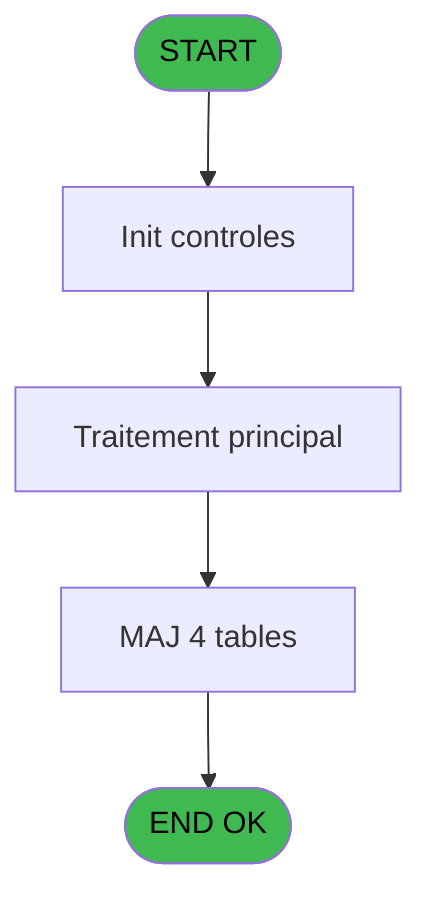

# REF IDE 719 - Validation VAD en attentes

> **Analyse**: Phases 1-4 2026-02-03 13:55 -> 13:55 (19s) | Assemblage 13:55
> **Pipeline**: V7.2 Enrichi
> **Structure**: 4 onglets (Resume | Ecrans | Donnees | Connexions)

<!-- TAB:Resume -->

## 1. FICHE D'IDENTITE

| Attribut | Valeur |
|----------|--------|
| Projet | REF |
| IDE Position | 719 |
| Nom Programme | Validation VAD en attentes |
| Fichier source | `Prg_719.xml` |
| Dossier IDE | General |
| Taches | 5 (0 ecrans visibles) |
| Tables modifiees | 4 |
| Programmes appeles | 1 |
| :warning: Statut | **ORPHELIN_POTENTIEL** |

## 2. DESCRIPTION FONCTIONNELLE

**Validation VAD en attentes** assure la gestion complete de ce processus.

Le flux de traitement s'organise en **3 blocs fonctionnels** :

- **Traitement** (3 taches) : traitements metier divers
- **Saisie** (1 tache) : ecrans de saisie utilisateur (formulaires, champs, donnees)
- **Validation** (1 tache) : controles et verifications de coherence

**Donnees modifiees** : 4 tables en ecriture (comptable________cte, vente, email_reprise, vente_vrl_vsl).

**Logique metier** : 1 regles identifiees couvrant conditions metier.

Detail : phases du traitement

#### Phase 1 : Traitement (3 taches)

- **719** - (sans nom)
- **719.1.1** - Boucle Lignes
- **719.1.2** - Boucle Lignes

#### Phase 2 : Validation (1 tache)

- **719.1** - Validation VAD en attentes

#### Phase 3 : Saisie (1 tache)

- **719.1.2.1** - Update Vente VRL VSL

#### Tables impactees

| Table | Operations | Role metier |
|-------|-----------|-------------|
| email_reprise | **W** (1 usages) |  |
| vente | **W** (1 usages) | Donnees de ventes |
| comptable________cte | **W** (1 usages) |  |
| vente_vrl_vsl | **W** (1 usages) | Donnees de ventes |

## 3. BLOCS FONCTIONNELS

### 3.1 Traitement (3 taches)

Traitements internes.

---

#### 719 - (sans nom)

**Role** : Traitement interne.

---

#### 719.1.1 - Boucle Lignes

**Role** : Traitement : Boucle Lignes.

---

#### 719.1.2 - Boucle Lignes

**Role** : Traitement : Boucle Lignes.

### 3.2 Validation (1 tache)

Controles de coherence : 1 tache verifie les donnees et conditions.

---

#### 719.1 - Validation VAD en attentes

**Role** : Verification : Validation VAD en attentes.
**Variables liees** : C (P.i. Flag Validation), D (P.o.Validation confirmée?), F (v.continuer validation)

### 3.3 Saisie (1 tache)

Ce bloc traite la saisie des donnees de la transaction.

---

#### 719.1.2.1 - Update Vente VRL VSL

**Role** : Saisie des donnees : Update Vente VRL VSL.

## 5. REGLES METIER

1 regles identifiees:

### Autres (1 regles)

#### [RM-001] Traitement si [O] est non nul

| Element | Detail |
|---------|--------|
| **Condition** | `[O]<>0` |
| **Si vrai** | 'N11.'&Trim(Str([O] |
| **Si faux** | '#'))&'CZ','N13CZ') |
| **Expression source** | Expression 5 : `IF([O]<>0,'N11.'&Trim(Str([O],'#'))&'CZ','N13CZ')` |
| **Exemple** | Si [O]<>0 → 'N11.'&Trim(Str([O]. Sinon → '#'))&'CZ','N13CZ') |

## 6. CONTEXTE

- **Appele par**: (aucun)
- **Appelle**: 1 programmes | **Tables**: 6 (W:4 R:1 L:1) | **Taches**: 5 | **Expressions**: 5

<!-- TAB:Ecrans -->

## 8. ECRANS

*(Programme sans ecran visible)*

## 9. NAVIGATION

### 9.3 Structure hierarchique (5 taches)

| Position | Tache | Type | Dimensions | Bloc |
|----------|-------|------|------------|------|
| **719.1** | [**(sans nom)** (719)](#t1) | - | - | Traitement |
| 719.1.1 | [Boucle Lignes (719.1.1)](#t3) | - | - | |
| 719.1.2 | [Boucle Lignes (719.1.2)](#t4) | - | - | |
| **719.2** | [**Validation VAD en attentes** (719.1)](#t2) | - | - | Validation |
| **719.3** | [**Update Vente VRL VSL** (719.1.2.1)](#t5) | - | - | Saisie |

### 9.4 Algorigramme

> **Legende**: Vert = START/END OK | Rouge = END KO | Bleu = Decisions
> *Algorigramme auto-genere. Utiliser `/algorigramme` pour une synthese metier detaillee.*

<!-- TAB:Donnees -->

## 10. TABLES

### Tables utilisees (6)

| ID | Nom | Description | Type | R | W | L | Usages |
|----|-----|-------------|------|---|---|---|--------|
| 40 | comptable________cte |  | DB |   | **W** |   | 1 |
| 69 | initialisation___ini |  | DB | R |   |   | 1 |
| 263 | vente | Donnees de ventes | DB |   | **W** |   | 1 |
| 501 | email_reprise |  | TMP |   | **W** |   | 1 |
| 770 | vente_vrl_vsl | Donnees de ventes | DB |   | **W** |   | 1 |
| 887 | reedition_ticket |  | DB |   |   | L | 2 |

### Colonnes par table (5 / 5 tables avec colonnes identifiees)

Table 40 - comptable________cte (**W**) - 1 usages

| Lettre | Variable | Acces | Type |
|--------|----------|-------|------|
| A | Date courante | W | Date |
| B | Heure courante | W | Time |

Table 69 - initialisation___ini (R) - 1 usages

| Lettre | Variable | Acces | Type |
|--------|----------|-------|------|
| A | P.i. Société | R | Alpha |
| B | P.i.Date Comptable | R | Date |
| C | P.i. Flag Validation | R | Logical |
| D | P.o.Validation confirmée? | R | Logical |
| E | P.i.Liste Tickets | R | Alpha |
| F | v.continuer validation | R | Logical |

Table 263 - vente (**W**) - 1 usages

| Lettre | Variable | Acces | Type |
|--------|----------|-------|------|
| A | Lien Vente | W | Logical |
| B | v.Date courante | W | Date |
| C | v.Heure courante | W | Time |

Table 501 - email_reprise (**W**) - 1 usages

*Table utilisee uniquement en Link ou aucune colonne Real identifiee dans le DataView.*

Table 770 - vente_vrl_vsl (**W**) - 1 usages

| Lettre | Variable | Acces | Type |
|--------|----------|-------|------|
| A | Lien Vente | W | Logical |

## 11. VARIABLES

### 11.1 Parametres entrants (5)

Variables recues en parametre.

| Lettre | Nom | Type | Usage dans |
|--------|-----|------|-----------|
| A | P.i. Société | Alpha | 1x parametre entrant |
| B | P.i.Date Comptable | Date | - |
| C | P.i. Flag Validation | Logical | - |
| D | P.o.Validation confirmée? | Logical | - |
| E | P.i.Liste Tickets | Alpha | 1x parametre entrant |

### 11.2 Variables de session (1)

Variables persistantes pendant toute la session.

| Lettre | Nom | Type | Usage dans |
|--------|-----|------|-----------|
| F | v.continuer validation | Logical | - |

## 12. EXPRESSIONS

**5 / 5 expressions decodees (100%)**

### 12.1 Repartition par type

| Type | Expressions | Regles |
|------|-------------|--------|
| CONDITION | 1 | 5 |
| OTHER | 3 | 0 |
| CAST_LOGIQUE | 1 | 0 |

### 12.2 Expressions cles par type

#### CONDITION (1 expressions)

| Type | IDE | Expression | Regle |
|------|-----|------------|-------|
| CONDITION | 5 | `IF([O]<>0,'N11.'&Trim(Str([O],'#'))&'CZ','N13CZ')` | [RM-001](#rm-RM-001) |

#### OTHER (3 expressions)

| Type | IDE | Expression | Regle |
|------|-----|------------|-------|
| OTHER | 3 | `[G]` | - |
| OTHER | 2 | `P.i.Liste Tickets [E]` | - |
| OTHER | 1 | `P.i. Société [A]` | - |

#### CAST_LOGIQUE (1 expressions)

| Type | IDE | Expression | Regle |
|------|-----|------------|-------|
| CAST_LOGIQUE | 4 | `'TRUE'LOG` | - |

<!-- TAB:Connexions -->

## 13. GRAPHE D'APPELS

### 13.1 Chaine depuis Main (Callers)

**Chemin**: (pas de callers directs)

### 13.2 Callers

| IDE | Nom Programme | Nb Appels |
|-----|---------------|-----------|
| - | (aucun) | - |

### 13.3 Callees (programmes appeles)

### 13.4 Detail Callees avec contexte

| IDE | Nom Programme | Appels | Contexte |
|-----|---------------|--------|----------|
| [721](REF-IDE-721.md) | Confirmation Mode Paiement | 1 | Sous-programme |

## 14. RECOMMANDATIONS MIGRATION

### 14.1 Profil du programme

| Metrique | Valeur | Impact migration |
|----------|--------|-----------------|
| Lignes de logique | 117 | Programme compact |
| Expressions | 5 | Peu de logique |
| Tables WRITE | 4 | Impact modere |
| Sous-programmes | 1 | Peu de dependances |
| Ecrans visibles | 0 | Ecran unique ou traitement batch |
| Code desactive | 0% (0 / 117) | Code sain |
| Regles metier | 1 | Quelques regles a preserver |

### 14.2 Plan de migration par bloc

#### Traitement (3 taches: 0 ecran, 3 traitements)

- **Strategie** : 3 service(s) backend injectable(s) (Domain Services).
- 1 sous-programme(s) a migrer ou a reutiliser depuis les services existants.
- Decomposer les taches en services unitaires testables.

#### Validation (1 tache: 0 ecran, 1 traitement)

- **Strategie** : FluentValidation avec validators specifiques.
- Chaque tache de validation -> un validator injectable

#### Saisie (1 tache: 0 ecran, 1 traitement)

- **Strategie** : Formulaire React/Blazor avec validation Zod/FluentValidation.
- Validation temps reel cote client + serveur

### 14.3 Dependances critiques

| Dependance | Type | Appels | Impact |
|------------|------|--------|--------|
| comptable________cte | Table WRITE (Database) | 1x | Schema + repository |
| vente | Table WRITE (Database) | 1x | Schema + repository |
| email_reprise | Table WRITE (Temp) | 1x | Schema + repository |
| vente_vrl_vsl | Table WRITE (Database) | 1x | Schema + repository |
| [Confirmation Mode Paiement (IDE 721)](REF-IDE-721.md) | Sous-programme | 1x | Normale - Sous-programme |

---
*Spec DETAILED generee par Pipeline V7.2 - 2026-02-03 13:55*
