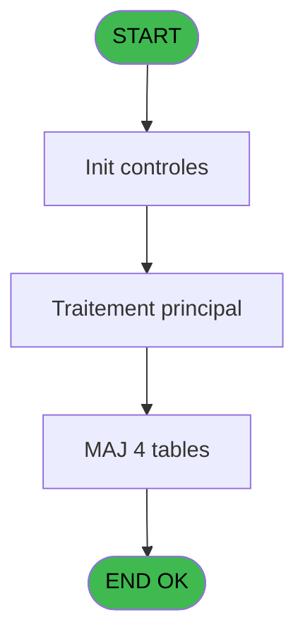

# REF IDE 720 - Suppression VAD

> **Analyse**: Phases 1-4 2026-02-03 13:56 -> 13:56 (19s) | Assemblage 13:56
> **Pipeline**: V7.2 Enrichi
> **Structure**: 4 onglets (Resume | Ecrans | Donnees | Connexions)

<!-- TAB:Resume -->

## 1. FICHE D'IDENTITE

| Attribut | Valeur |
|----------|--------|
| Projet | REF |
| IDE Position | 720 |
| Nom Programme | Suppression VAD |
| Fichier source | `Prg_720.xml` |
| Dossier IDE | General |
| Taches | 4 (0 ecrans visibles) |
| Tables modifiees | 4 |
| Programmes appeles | 0 |
| :warning: Statut | **ORPHELIN_POTENTIEL** |

## 2. DESCRIPTION FONCTIONNELLE

**Suppression VAD** assure la gestion complete de ce processus.

Le flux de traitement s'organise en **2 blocs fonctionnels** :

- **Traitement** (3 taches) : traitements metier divers
- **Saisie** (1 tache) : ecrans de saisie utilisateur (formulaires, champs, donnees)

**Donnees modifiees** : 4 tables en ecriture (comptable________cte, vente, vente_vrl_vsl, reedition_ticket).

**Logique metier** : 1 regles identifiees couvrant conditions metier.

Detail : phases du traitement

#### Phase 1 : Traitement (3 taches)

- **720** - Suppression VAD **[[ECRAN]](#ecran-t1)**
- **720.2** - Supprimer VAD **[[ECRAN]](#ecran-t3)**
- **720.3** - Créer Lignes VRSL Annul et Upd

#### Phase 2 : Saisie (1 tache)

- **720.1** - Vente **[[ECRAN]](#ecran-t2)**

#### Tables impactees

| Table | Operations | Role metier |
|-------|-----------|-------------|
| reedition_ticket | **W** (1 usages) |  |
| comptable________cte | **W** (1 usages) |  |
| vente | **W** (1 usages) | Donnees de ventes |
| vente_vrl_vsl | **W** (1 usages) | Donnees de ventes |

## 3. BLOCS FONCTIONNELS

### 3.1 Traitement (3 taches)

Traitements internes.

---

#### 720 - Suppression VAD [[ECRAN]](#ecran-t1)

**Role** : Traitement : Suppression VAD.
**Ecran** : 864 x 273 DLU | [Voir mockup](#ecran-t1)

---

#### 720.2 - Supprimer VAD [[ECRAN]](#ecran-t3)

**Role** : Traitement : Supprimer VAD.
**Ecran** : 864 x 273 DLU | [Voir mockup](#ecran-t3)

---

#### 720.3 - Créer Lignes VRSL Annul et Upd

**Role** : Traitement : Créer Lignes VRSL Annul et Upd.

### 3.2 Saisie (1 tache)

L'operateur saisit les donnees de la transaction via 1 ecran (Vente).

---

#### 720.1 - Vente [[ECRAN]](#ecran-t2)

**Role** : Saisie des donnees : Vente.
**Ecran** : 864 x 273 DLU | [Voir mockup](#ecran-t2)

## 5. REGLES METIER

1 regles identifiees:

### Autres (1 regles)

#### [RM-001] Si P.i.Type table [B] vaut 'V' alors 'VAD', sinon 'VER'

| Element | Detail |
|---------|--------|
| **Condition** | `P.i.Type table [B]='V'` |
| **Si vrai** | 'VAD' |
| **Si faux** | 'VER') |
| **Variables** | B (P.i.Type table) |
| **Expression source** | Expression 4 : `IF(P.i.Type table [B]='V','VAD','VER')` |
| **Exemple** | Si P.i.Type table [B]='V' → 'VAD'. Sinon → 'VER') |

## 6. CONTEXTE

- **Appele par**: (aucun)
- **Appelle**: 0 programmes | **Tables**: 4 (W:4 R:0 L:0) | **Taches**: 4 | **Expressions**: 6

<!-- TAB:Ecrans -->

## 8. ECRANS

*(Programme sans ecran visible)*

## 9. NAVIGATION

### 9.3 Structure hierarchique (4 taches)

| Position | Tache | Type | Dimensions | Bloc |
|----------|-------|------|------------|------|
| **720.1** | [**Suppression VAD** (720)](#t1) [mockup](#ecran-t1) | - | 864x273 | Traitement |
| 720.1.1 | [Supprimer VAD (720.2)](#t3) [mockup](#ecran-t3) | - | 864x273 | |
| 720.1.2 | [Créer Lignes VRSL Annul et Upd (720.3)](#t4) | - | - | |
| **720.2** | [**Vente** (720.1)](#t2) [mockup](#ecran-t2) | - | 864x273 | Saisie |

### 9.4 Algorigramme

> **Legende**: Vert = START/END OK | Rouge = END KO | Bleu = Decisions
> *Algorigramme auto-genere. Utiliser `/algorigramme` pour une synthese metier detaillee.*

<!-- TAB:Donnees -->

## 10. TABLES

### Tables utilisees (4)

| ID | Nom | Description | Type | R | W | L | Usages |
|----|-----|-------------|------|---|---|---|--------|
| 40 | comptable________cte |  | DB |   | **W** |   | 1 |
| 263 | vente | Donnees de ventes | DB |   | **W** |   | 1 |
| 770 | vente_vrl_vsl | Donnees de ventes | DB |   | **W** |   | 1 |
| 887 | reedition_ticket |  | DB |   | **W** |   | 1 |

### Colonnes par table (1 / 4 tables avec colonnes identifiees)

Table 40 - comptable________cte (**W**) - 1 usages

*Table utilisee uniquement en Link ou aucune colonne Real identifiee dans le DataView.*

Table 263 - vente (**W**) - 1 usages

*Table utilisee uniquement en Link ou aucune colonne Real identifiee dans le DataView.*

Table 770 - vente_vrl_vsl (**W**) - 1 usages

*Table utilisee uniquement en Link ou aucune colonne Real identifiee dans le DataView.*

Table 887 - reedition_ticket (**W**) - 1 usages

| Lettre | Variable | Acces | Type |
|--------|----------|-------|------|
| A | P.i.societe | W | Unicode |
| B | P.i.Type table | W | Unicode |
| C | P.i.compte gm | W | Numeric |
| D | P.i.filiation | W | Numeric |
| E | P.i.montant | W | Numeric |
| F | P.I Num ticket | W | Numeric |
| G | P.I Mode Paiement | W | Alpha |

## 11. VARIABLES

### 11.1 Parametres entrants (7)

Variables recues en parametre.

| Lettre | Nom | Type | Usage dans |
|--------|-----|------|-----------|
| A | P.i.societe | Unicode | 1x parametre entrant |
| B | P.i.Type table | Unicode | 3x parametre entrant |
| C | P.i.compte gm | Numeric | - |
| D | P.i.filiation | Numeric | - |
| E | P.i.montant | Numeric | - |
| F | P.I Num ticket | Numeric | 1x parametre entrant |
| G | P.I Mode Paiement | Alpha | - |

## 12. EXPRESSIONS

**6 / 6 expressions decodees (100%)**

### 12.1 Repartition par type

| Type | Expressions | Regles |
|------|-------------|--------|
| CONDITION | 3 | 5 |
| CONSTANTE | 1 | 0 |
| OTHER | 2 | 0 |

### 12.2 Expressions cles par type

#### CONDITION (3 expressions)

| Type | IDE | Expression | Regle |
|------|-----|------------|-------|
| CONDITION | 4 | `IF(P.i.Type table [B]='V','VAD','VER')` | [RM-001](#rm-RM-001) |
| CONDITION | 6 | `P.i.Type table [B]<>'V'` | - |
| CONDITION | 5 | `P.i.Type table [B]='V'` | - |

#### CONSTANTE (1 expressions)

| Type | IDE | Expression | Regle |
|------|-----|------------|-------|
| CONSTANTE | 3 | `'VAD'` | - |

#### OTHER (2 expressions)

| Type | IDE | Expression | Regle |
|------|-----|------------|-------|
| OTHER | 2 | `P.I Num ticket [F]` | - |
| OTHER | 1 | `P.i.societe [A]` | - |

<!-- TAB:Connexions -->

## 13. GRAPHE D'APPELS

### 13.1 Chaine depuis Main (Callers)

**Chemin**: (pas de callers directs)

### 13.2 Callers

| IDE | Nom Programme | Nb Appels |
|-----|---------------|-----------|
| - | (aucun) | - |

### 13.3 Callees (programmes appeles)

### 13.4 Detail Callees avec contexte

| IDE | Nom Programme | Appels | Contexte |
|-----|---------------|--------|----------|
| - | (aucun) | - | - |

## 14. RECOMMANDATIONS MIGRATION

### 14.1 Profil du programme

| Metrique | Valeur | Impact migration |
|----------|--------|-----------------|
| Lignes de logique | 84 | Programme compact |
| Expressions | 6 | Peu de logique |
| Tables WRITE | 4 | Impact modere |
| Sous-programmes | 0 | Peu de dependances |
| Ecrans visibles | 0 | Ecran unique ou traitement batch |
| Code desactive | 0% (0 / 84) | Code sain |
| Regles metier | 1 | Quelques regles a preserver |

### 14.2 Plan de migration par bloc

#### Traitement (3 taches: 2 ecrans, 1 traitement)

- **Strategie** : Orchestrateur avec 2 ecrans (Razor/React) et 1 traitements backend (services).
- Les ecrans deviennent des composants UI, les traitements invisibles deviennent des services injectables.
- Decomposer les taches en services unitaires testables.

#### Saisie (1 tache: 1 ecran, 0 traitement)

- **Strategie** : Formulaire React/Blazor avec validation Zod/FluentValidation.
- Reproduire 1 ecran : Vente
- Validation temps reel cote client + serveur

### 14.3 Dependances critiques

| Dependance | Type | Appels | Impact |
|------------|------|--------|--------|
| comptable________cte | Table WRITE (Database) | 1x | Schema + repository |
| vente | Table WRITE (Database) | 1x | Schema + repository |
| vente_vrl_vsl | Table WRITE (Database) | 1x | Schema + repository |
| reedition_ticket | Table WRITE (Database) | 1x | Schema + repository |

---
*Spec DETAILED generee par Pipeline V7.2 - 2026-02-03 13:56*
