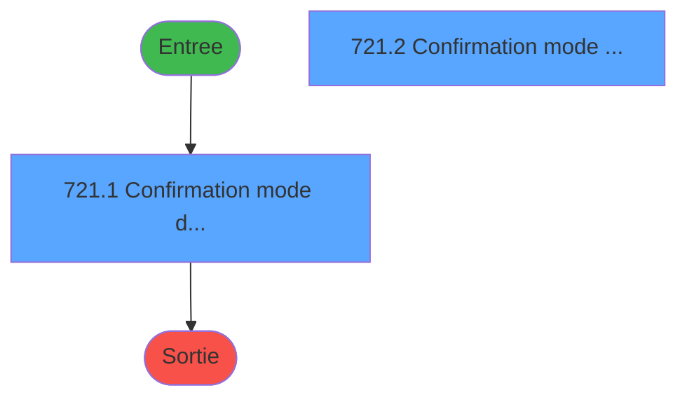
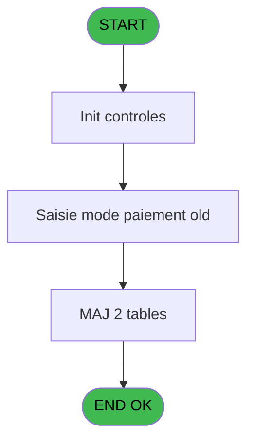
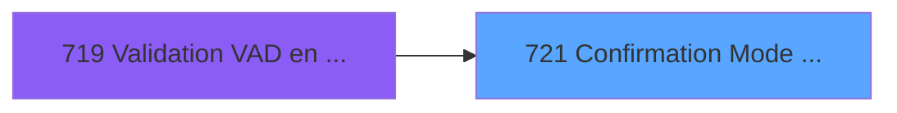
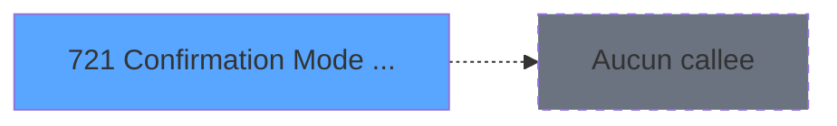

# REF IDE 721 - Confirmation Mode Paiement

> **Analyse**: Phases 1-4 2026-02-03 13:56 -> 13:56 (18s) | Assemblage 13:56
> **Pipeline**: V7.2 Enrichi
> **Structure**: 4 onglets (Resume | Ecrans | Donnees | Connexions)

<!-- TAB:Resume -->

## 1. FICHE D'IDENTITE

| Attribut | Valeur |
|----------|--------|
| Projet | REF |
| IDE Position | 721 |
| Nom Programme | Confirmation Mode Paiement |
| Fichier source | `Prg_721.xml` |
| Dossier IDE | General |
| Taches | 6 (2 ecrans visibles) |
| Tables modifiees | 2 |
| Programmes appeles | 0 |

## 2. DESCRIPTION FONCTIONNELLE

**Confirmation Mode Paiement** assure la gestion complete de ce processus, accessible depuis [Validation VAD en attentes (IDE 719)](REF-IDE-719.md).

Le flux de traitement s'organise en **2 blocs fonctionnels** :

- **Reglement** (4 taches) : gestion des moyens de paiement et reglements
- **Calcul** (2 taches) : calculs de montants, stocks ou compteurs

**Donnees modifiees** : 2 tables en ecriture (vente, email_reprise).

Detail : phases du traitement

#### Phase 1 : Reglement (4 taches)

- **721.1** - Confirmation mode de paiement **[[ECRAN]](#ecran-t1)**
- **721** - Confirmation Mode Paiement
- **721.2** - Confirmation mode de paiement **[[ECRAN]](#ecran-t10)**
- **721.3** - Verif Moyens Paiement

#### Phase 2 : Calcul (2 taches)

- **721.1.1** - Calcul **[[ECRAN]](#ecran-t2)**
- **721.1.2** - Calcul **[[ECRAN]](#ecran-t5)**

#### Tables impactees

| Table | Operations | Role metier |
|-------|-----------|-------------|
| email_reprise | **W**/L (3 usages) |  |
| vente | **W**/L (2 usages) | Donnees de ventes |

## 3. BLOCS FONCTIONNELS

### 3.1 Reglement (4 taches)

Gestion des moyens de paiement : 4 taches de reglement.

---

#### 721.1 - Confirmation mode de paiement [[ECRAN]](#ecran-t1)

**Role** : Gestion du reglement : Confirmation mode de paiement.
**Ecran** : 484 x 240 DLU | [Voir mockup](#ecran-t1)

3 sous-taches directes

| Tache | Nom | Bloc |
|-------|-----|------|
| [721](#t6) | Confirmation Mode Paiement | Reglement |
| [721.2](#t10) | Confirmation mode de paiement **[[ECRAN]](#ecran-t10)** | Reglement |
| [721.3](#t14) | Verif Moyens Paiement | Reglement |

**Variables liees** : E (v.mode de paiement), G (v.liste mode paiement Libelle)

---

#### 721 - Confirmation Mode Paiement

**Role** : Gestion du reglement : Confirmation Mode Paiement.
**Variables liees** : E (v.mode de paiement), G (v.liste mode paiement Libelle)

---

#### 721.2 - Confirmation mode de paiement [[ECRAN]](#ecran-t10)

**Role** : Gestion du reglement : Confirmation mode de paiement.
**Ecran** : 394 x 240 DLU | [Voir mockup](#ecran-t10)
**Variables liees** : E (v.mode de paiement), G (v.liste mode paiement Libelle)

---

#### 721.3 - Verif Moyens Paiement

**Role** : Gestion du reglement : Verif Moyens Paiement.
**Variables liees** : E (v.mode de paiement), G (v.liste mode paiement Libelle)

### 3.2 Calcul (2 taches)

Calculs metier : montants, stocks, compteurs.

---

#### 721.1.1 - Calcul [[ECRAN]](#ecran-t2)

**Role** : Calcul : Calcul.
**Ecran** : 400 x 240 DLU | [Voir mockup](#ecran-t2)

---

#### 721.1.2 - Calcul [[ECRAN]](#ecran-t5)

**Role** : Calcul : Calcul.
**Ecran** : 400 x 240 DLU | [Voir mockup](#ecran-t5)

## 5. REGLES METIER

*(Aucune regle metier identifiee)*

## 6. CONTEXTE

- **Appele par**: [Validation VAD en attentes (IDE 719)](REF-IDE-719.md)
- **Appelle**: 0 programmes | **Tables**: 5 (W:2 R:1 L:4) | **Taches**: 6 | **Expressions**: 1

<!-- TAB:Ecrans -->

## 8. ECRANS

### 8.1 Forms visibles (2 / 6)

| # | Position | Tache | Nom | Type | Largeur | Hauteur | Bloc |
|---|----------|-------|-----|------|---------|---------|------|
| 1 | 721 | 721.1 | Confirmation mode de paiement | Type0 | 484 | 240 | Reglement |
| 2 | 721.1 | 721.2 | Confirmation mode de paiement | Type0 | 394 | 240 | Reglement |

### 8.2 Mockups Ecrans

---

#### 721 - Confirmation mode de paiement
**Tache** : [721.1](#t1) | **Type** : Type0 | **Dimensions** : 484 x 240 DLU
**Bloc** : Reglement | **Titre IDE** : Confirmation mode de paiement

<!-- FORM-DATA:
{
    "width":  484,
    "vFactor":  8,
    "type":  "Type0",
    "hFactor":  4,
    "controls":  [
                     {
                         "x":  10,
                         "type":  "label",
                         "var":  "",
                         "y":  8,
                         "w":  381,
                         "fmt":  "",
                         "name":  "",
                         "h":  21,
                         "color":  "6",
                         "text":  "Veuillez-vérifier pour les tickets ci-dessous si le mode de validation réellement utilisé convient avec le mode de paiement dans le paiement en a-tente.\r\n",
                         "parent":  null
                     },
                     {
                         "x":  10,
                         "type":  "label",
                         "var":  "",
                         "y":  36,
                         "w":  381,
                         "fmt":  "",
                         "name":  "",
                         "h":  28,
                         "color":  "143",
                         "text":  "Si nécessaire, veuillez modifier le ticket en y mettant le bon moyen de paiement.",
                         "parent":  null
                     },
                     {
                         "x":  314,
                         "type":  "label",
                         "var":  "",
                         "y":  76,
                         "w":  68,
                         "fmt":  "",
                         "name":  "",
                         "h":  9,
                         "color":  "",
                         "text":  "Montant total:",
                         "parent":  null
                     },
                     {
                         "x":  10,
                         "type":  "label",
                         "var":  "",
                         "y":  210,
                         "w":  381,
                         "fmt":  "",
                         "name":  "",
                         "h":  24,
                         "color":  "",
                         "text":  "",
                         "parent":  null
                     },
                     {
                         "x":  10,
                         "type":  "table",
                         "var":  "",
                         "name":  "",
                         "titleH":  12,
                         "color":  "",
                         "w":  289,
                         "y":  69,
                         "fmt":  "",
                         "parent":  null,
                         "text":  "",
                         "rowH":  16,
                         "h":  134,
                         "cols":  [
                                      {
                                          "title":  "Ticket",
                                          "layer":  1,
                                          "w":  38
                                      },
                                      {
                                          "title":  "Nom",
                                          "layer":  2,
                                          "w":  128
                                      },
                                      {
                                          "title":  "Mode de paiement",
                                          "layer":  3,
                                          "w":  104
                                      }
                                  ],
                         "rows":  3
                     },
                     {
                         "x":  14,
                         "type":  "edit",
                         "var":  "",
                         "y":  85,
                         "w":  26,
                         "fmt":  "",
                         "name":  "ere_chrono_0001",
                         "h":  10,
                         "color":  "6",
                         "text":  "",
                         "parent":  6
                     },
                     {
                         "x":  52,
                         "type":  "edit",
                         "var":  "",
                         "y":  85,
                         "w":  121,
                         "fmt":  "50",
                         "name":  "v.libelle",
                         "h":  10,
                         "color":  "6",
                         "text":  "",
                         "parent":  6
                     },
                     {
                         "x":  196,
                         "type":  "combobox",
                         "var":  "",
                         "y":  85,
                         "w":  75,
                         "fmt":  "",
                         "name":  "v.mode de paiement",
                         "h":  12,
                         "color":  "",
                         "text":  "a,b",
                         "parent":  6
                     },
                     {
                         "x":  311,
                         "type":  "edit",
                         "var":  "",
                         "y":  89,
                         "w":  68,
                         "fmt":  "N12.3",
                         "name":  "v.montant",
                         "h":  19,
                         "color":  "",
                         "text":  "",
                         "parent":  null
                     },
                     {
                         "x":  19,
                         "type":  "button",
                         "var":  "",
                         "y":  213,
                         "w":  106,
                         "fmt":  "\u0026Annuler la validation",
                         "name":  "Annuler",
                         "h":  18,
                         "color":  "",
                         "text":  "",
                         "parent":  5
                     },
                     {
                         "x":  268,
                         "type":  "button",
                         "var":  "",
                         "y":  213,
                         "w":  114,
                         "fmt":  "\u0026Continuer la validation",
                         "name":  "Continuer",
                         "h":  18,
                         "color":  "",
                         "text":  "",
                         "parent":  5
                     }
                 ],
    "taskId":  "721",
    "height":  240
}
-->

<strong>Champs : 4 champs</strong>

| Pos (x,y) | Nom | Variable | Type |
|-----------|-----|----------|------|
| 14,85 | ere_chrono_0001 | - | edit |
| 52,85 | v.libelle | - | edit |
| 196,85 | v.mode de paiement | - | combobox |
| 311,89 | v.montant | - | edit |

<strong>Boutons : 2 boutons</strong>

| Bouton | Pos (x,y) | Action |
|--------|-----------|--------|
| Annuler la validation | 19,213 | Valide la saisie et enregistre Annule et retour au menu |
| Continuer la validation | 268,213 | Valide la saisie et enregistre |

---

#### 721.1 - Confirmation mode de paiement
**Tache** : [721.2](#t10) | **Type** : Type0 | **Dimensions** : 394 x 240 DLU
**Bloc** : Reglement | **Titre IDE** : Confirmation mode de paiement

<!-- FORM-DATA:
{
    "width":  394,
    "vFactor":  8,
    "type":  "Type0",
    "hFactor":  4,
    "controls":  [
                     {
                         "x":  10,
                         "type":  "label",
                         "var":  "",
                         "y":  8,
                         "w":  381,
                         "fmt":  "",
                         "name":  "",
                         "h":  21,
                         "color":  "6",
                         "text":  "Veuillez-vérifier pour les tickets ci-dessous si le mode de validation réellement utilisé convient avec le mode de paiement dans le paiement en a-tente.\r\n",
                         "parent":  null
                     },
                     {
                         "x":  10,
                         "type":  "label",
                         "var":  "",
                         "y":  36,
                         "w":  381,
                         "fmt":  "",
                         "name":  "",
                         "h":  28,
                         "color":  "143",
                         "text":  "Si nécessaire, veuillez modifier le ticket en y mettant le bon moyen de paiement.",
                         "parent":  null
                     },
                     {
                         "x":  7,
                         "type":  "label",
                         "var":  "",
                         "y":  210,
                         "w":  381,
                         "fmt":  "",
                         "name":  "",
                         "h":  24,
                         "color":  "",
                         "text":  "",
                         "parent":  null
                     },
                     {
                         "x":  21,
                         "type":  "table",
                         "var":  "",
                         "name":  "",
                         "titleH":  12,
                         "color":  "",
                         "w":  351,
                         "y":  69,
                         "fmt":  "",
                         "parent":  null,
                         "text":  "",
                         "rowH":  16,
                         "h":  134,
                         "cols":  [
                                      {
                                          "title":  "Ticket",
                                          "layer":  1,
                                          "w":  38
                                      },
                                      {
                                          "title":  "Nom",
                                          "layer":  2,
                                          "w":  128
                                      },
                                      {
                                          "title":  "Mode de paiement",
                                          "layer":  3,
                                          "w":  104
                                      },
                                      {
                                          "title":  "Montant",
                                          "layer":  4,
                                          "w":  63
                                      }
                                  ],
                         "rows":  4
                     },
                     {
                         "x":  25,
                         "type":  "edit",
                         "var":  "",
                         "y":  85,
                         "w":  26,
                         "fmt":  "",
                         "name":  "ere_chrono_0001",
                         "h":  10,
                         "color":  "6",
                         "text":  "",
                         "parent":  6
                     },
                     {
                         "x":  62,
                         "type":  "edit",
                         "var":  "",
                         "y":  85,
                         "w":  121,
                         "fmt":  "50",
                         "name":  "v.libelle",
                         "h":  10,
                         "color":  "6",
                         "text":  "",
                         "parent":  6
                     },
                     {
                         "x":  206,
                         "type":  "combobox",
                         "var":  "",
                         "y":  85,
                         "w":  75,
                         "fmt":  "",
                         "name":  "v.mode de paiement",
                         "h":  12,
                         "color":  "",
                         "text":  "a,b",
                         "parent":  6
                     },
                     {
                         "x":  294,
                         "type":  "edit",
                         "var":  "",
                         "y":  84,
                         "w":  56,
                         "fmt":  "",
                         "name":  "Montant",
                         "h":  10,
                         "color":  "6",
                         "text":  "",
                         "parent":  6
                     },
                     {
                         "x":  16,
                         "type":  "button",
                         "var":  "",
                         "y":  213,
                         "w":  106,
                         "fmt":  "\u0026Annuler la validation",
                         "name":  "Annuler",
                         "h":  18,
                         "color":  "",
                         "text":  "",
                         "parent":  5
                     },
                     {
                         "x":  265,
                         "type":  "button",
                         "var":  "",
                         "y":  213,
                         "w":  114,
                         "fmt":  "\u0026Continuer la validation",
                         "name":  "Continuer",
                         "h":  18,
                         "color":  "",
                         "text":  "",
                         "parent":  5
                     }
                 ],
    "taskId":  "721.1",
    "height":  240
}
-->

<strong>Champs : 4 champs</strong>

| Pos (x,y) | Nom | Variable | Type |
|-----------|-----|----------|------|
| 25,85 | ere_chrono_0001 | - | edit |
| 62,85 | v.libelle | - | edit |
| 206,85 | v.mode de paiement | - | combobox |
| 294,84 | Montant | - | edit |

<strong>Boutons : 2 boutons</strong>

| Bouton | Pos (x,y) | Action |
|--------|-----------|--------|
| Annuler la validation | 16,213 | Valide la saisie et enregistre Annule et retour au menu |
| Continuer la validation | 265,213 | Valide la saisie et enregistre |

## 9. NAVIGATION

### 9.1 Enchainement des ecrans

**Detail par enchainement :**

| Depuis | Action | Vers | Retour |
|--------|--------|------|--------|

### 9.3 Structure hierarchique (6 taches)

| Position | Tache | Type | Dimensions | Bloc |
|----------|-------|------|------------|------|
| **721.1** | [**Confirmation mode de paiement** (721.1)](#t1) [mockup](#ecran-t1) | - | 484x240 | Reglement |
| 721.1.1 | [Confirmation Mode Paiement (721)](#t6) | - | - | |
| 721.1.2 | [Confirmation mode de paiement (721.2)](#t10) [mockup](#ecran-t10) | - | 394x240 | |
| 721.1.3 | [Verif Moyens Paiement (721.3)](#t14) | - | - | |
| **721.2** | [**Calcul** (721.1.1)](#t2) [mockup](#ecran-t2) | - | 400x240 | Calcul |
| 721.2.1 | [Calcul (721.1.2)](#t5) [mockup](#ecran-t5) | - | 400x240 | |

### 9.4 Algorigramme

> **Legende**: Vert = START/END OK | Rouge = END KO | Bleu = Decisions
> *Algorigramme auto-genere. Utiliser `/algorigramme` pour une synthese metier detaillee.*

<!-- TAB:Donnees -->

## 10. TABLES

### Tables utilisees (5)

| ID | Nom | Description | Type | R | W | L | Usages |
|----|-----|-------------|------|---|---|---|--------|
| 31 | gm-complet_______gmc |  | DB | R |   |   | 2 |
| 40 | comptable________cte |  | DB |   |   | L | 1 |
| 263 | vente | Donnees de ventes | DB |   | **W** | L | 2 |
| 501 | email_reprise |  | TMP |   | **W** | L | 3 |
| 887 | reedition_ticket |  | DB |   |   | L | 3 |

### Colonnes par table (3 / 3 tables avec colonnes identifiees)

Table 31 - gm-complet_______gmc (R) - 2 usages

| Lettre | Variable | Acces | Type |
|--------|----------|-------|------|
| A | P.i.societe | R | Unicode |
| B | P.i.Masque Montant | R | Alpha |
| C | P.o.Continuer validation | R | Logical |
| D | v.montant | R | Numeric |
| E | v.mode de paiement | R | Unicode |
| F | v.nom | R | Unicode |
| G | v.liste mode paiement Libelle | R | Alpha |

Table 263 - vente (**W**/L) - 2 usages

*Table utilisee uniquement en Link ou aucune colonne Real identifiee dans le DataView.*

Table 501 - email_reprise (**W**/L) - 3 usages

| Lettre | Variable | Acces | Type |
|--------|----------|-------|------|
| A | Nom | W | Unicode |
| B | Prenom | W | Unicode |
| C | Ticket | W | Numeric |
| D | Type Table | W | Unicode |
| E | Montant | W | Numeric |
| F | v.liste mode paiement Libelle | W | Alpha |

## 11. VARIABLES

### 11.1 Parametres entrants (3)

Variables recues du programme appelant ([Validation VAD en attentes (IDE 719)](REF-IDE-719.md)).

| Lettre | Nom | Type | Usage dans |
|--------|-----|------|-----------|
| A | P.i.societe | Unicode | - |
| B | P.i.Masque Montant | Alpha | - |
| C | P.o.Continuer validation | Logical | 1x parametre entrant |

### 11.2 Variables de session (4)

Variables persistantes pendant toute la session.

| Lettre | Nom | Type | Usage dans |
|--------|-----|------|-----------|
| D | v.montant | Numeric | - |
| E | v.mode de paiement | Unicode | - |
| F | v.nom | Unicode | 1x session |
| G | v.liste mode paiement Libelle | Alpha | - |

## 12. EXPRESSIONS

**1 / 1 expressions decodees (100%)**

### 12.1 Repartition par type

| Type | Expressions | Regles |
|------|-------------|--------|
| OTHER | 1 | 0 |

### 12.2 Expressions cles par type

#### OTHER (1 expressions)

| Type | IDE | Expression | Regle |
|------|-----|------------|-------|
| OTHER | 1 | `P.o.Continuer validation [C] OR v.nom [F]` | - |

<!-- TAB:Connexions -->

## 13. GRAPHE D'APPELS

### 13.1 Chaine depuis Main (Callers)

Main -> ... -> [Validation VAD en attentes (IDE 719)](REF-IDE-719.md) -> **Confirmation Mode Paiement (IDE 721)**

### 13.2 Callers

| IDE | Nom Programme | Nb Appels |
|-----|---------------|-----------|
| [719](REF-IDE-719.md) | Validation VAD en attentes | 1 |

### 13.3 Callees (programmes appeles)

### 13.4 Detail Callees avec contexte

| IDE | Nom Programme | Appels | Contexte |
|-----|---------------|--------|----------|
| - | (aucun) | - | - |

## 14. RECOMMANDATIONS MIGRATION

### 14.1 Profil du programme

| Metrique | Valeur | Impact migration |
|----------|--------|-----------------|
| Lignes de logique | 125 | Programme compact |
| Expressions | 1 | Peu de logique |
| Tables WRITE | 2 | Impact faible |
| Sous-programmes | 0 | Peu de dependances |
| Ecrans visibles | 2 | Quelques ecrans |
| Code desactive | 0% (0 / 125) | Code sain |
| Regles metier | 0 | Pas de regle identifiee |

### 14.2 Plan de migration par bloc

#### Reglement (4 taches: 2 ecrans, 2 traitements)

- **Strategie** : Service `IReglementService` avec pattern Strategy par mode de paiement.
- Integration TPE si applicable

#### Calcul (2 taches: 2 ecrans, 0 traitement)

- **Strategie** : Services de calcul purs (Domain Services).
- Migrer la logique de calcul (stock, compteurs, montants)

### 14.3 Dependances critiques

| Dependance | Type | Appels | Impact |
|------------|------|--------|--------|
| vente | Table WRITE (Database) | 1x | Schema + repository |
| email_reprise | Table WRITE (Temp) | 2x | Schema + repository |

---
*Spec DETAILED generee par Pipeline V7.2 - 2026-02-03 13:56*
