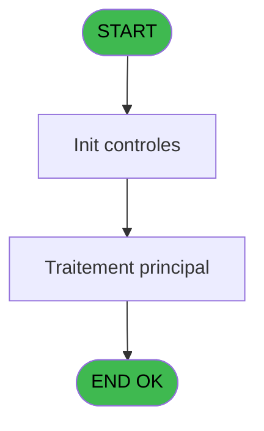
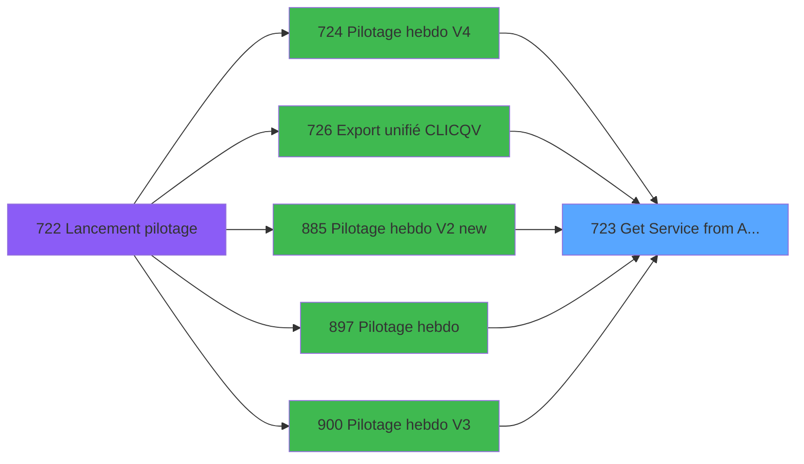

# REF IDE 723 - Get Service from Activity

> **Analyse**: Phases 1-4 2026-02-03 13:57 -> 13:57 (19s) | Assemblage 13:57
> **Pipeline**: V7.2 Enrichi
> **Structure**: 4 onglets (Resume | Ecrans | Donnees | Connexions)

<!-- TAB:Resume -->

## 1. FICHE D'IDENTITE

| Attribut | Valeur |
|----------|--------|
| Projet | REF |
| IDE Position | 723 |
| Nom Programme | Get Service from Activity |
| Fichier source | `Prg_723.xml` |
| Dossier IDE | General |
| Taches | 1 (0 ecrans visibles) |
| Tables modifiees | 0 |
| Programmes appeles | 0 |

## 2. DESCRIPTION FONCTIONNELLE

**Get Service from Activity** assure la gestion complete de ce processus, accessible depuis [Pilotage hebdo V4 (IDE 724)](REF-IDE-724.md), [Export unifié CLIC/QV (IDE 726)](REF-IDE-726.md), [Pilotage hebdo V2 new (IDE 885)](REF-IDE-885.md), [Pilotage hebdo (IDE 897)](REF-IDE-897.md), [Pilotage hebdo V3 (IDE 900)](REF-IDE-900.md).

Le flux de traitement s'organise en **1 blocs fonctionnels** :

- **Traitement** (1 tache) : traitements metier divers

**Logique metier** : 1 regles identifiees couvrant conditions metier.

## 3. BLOCS FONCTIONNELS

### 3.1 Traitement (1 tache)

Traitements internes.

---

#### 723 - Get Service from Activity

**Role** : Consultation/chargement : Get Service from Activity.
**Variables liees** : A (p.Service Initial), C (p.Service Calcule)

## 5. REGLES METIER

1 regles identifiees:

### Autres (1 regles)

#### [RM-001] Traitement si Trim([F]) est renseigne

| Element | Detail |
|---------|--------|
| **Condition** | `Trim([F])<>''` |
| **Si vrai** | [F] |
| **Si faux** | p.Service Initial [A]) |
| **Variables** | A (p.Service Initial) |
| **Expression source** | Expression 2 : `IF(Trim([F])<>'',[F],p.Service Initial [A])` |
| **Exemple** | Si Trim([F])<>'' → [F]. Sinon → p.Service Initial [A]) |

## 6. CONTEXTE

- **Appele par**: [Pilotage hebdo V4 (IDE 724)](REF-IDE-724.md), [Export unifié CLIC/QV (IDE 726)](REF-IDE-726.md), [Pilotage hebdo V2 new (IDE 885)](REF-IDE-885.md), [Pilotage hebdo (IDE 897)](REF-IDE-897.md), [Pilotage hebdo V3 (IDE 900)](REF-IDE-900.md)
- **Appelle**: 0 programmes | **Tables**: 1 (W:0 R:1 L:0) | **Taches**: 1 | **Expressions**: 3

<!-- TAB:Ecrans -->

## 8. ECRANS

*(Programme sans ecran visible)*

## 9. NAVIGATION

### 9.3 Structure hierarchique (1 tache)

| Position | Tache | Type | Dimensions | Bloc |
|----------|-------|------|------------|------|
| **723.1** | [**Get Service from Activity** (723)](#t1) | - | - | Traitement |

### 9.4 Algorigramme

> **Legende**: Vert = START/END OK | Rouge = END KO | Bleu = Decisions
> *Algorigramme auto-genere. Utiliser `/algorigramme` pour une synthese metier detaillee.*

<!-- TAB:Donnees -->

## 10. TABLES

### Tables utilisees (1)

| ID | Nom | Description | Type | R | W | L | Usages |
|----|-----|-------------|------|---|---|---|--------|
| 871 | Activite |  | DB | R |   |   | 1 |

### Colonnes par table (1 / 1 tables avec colonnes identifiees)

Table 871 - Activite (R) - 1 usages

| Lettre | Variable | Acces | Type |
|--------|----------|-------|------|
| A | p.Service Initial | R | Unicode |
| B | p.Activite | R | Numeric |
| C | p.Service Calcule | R | Unicode |
| D | p.Categorie | R | Unicode |

## 11. VARIABLES

### 11.1 Parametres entrants (4)

Variables recues du programme appelant ([Pilotage hebdo V4 (IDE 724)](REF-IDE-724.md)).

| Lettre | Nom | Type | Usage dans |
|--------|-----|------|-----------|
| A | p.Service Initial | Unicode | 1x parametre entrant |
| B | p.Activite | Numeric | 1x parametre entrant |
| C | p.Service Calcule | Unicode | - |
| D | p.Categorie | Unicode | - |

## 12. EXPRESSIONS

**3 / 3 expressions decodees (100%)**

### 12.1 Repartition par type

| Type | Expressions | Regles |
|------|-------------|--------|
| CONDITION | 1 | 5 |
| OTHER | 2 | 0 |

### 12.2 Expressions cles par type

#### CONDITION (1 expressions)

| Type | IDE | Expression | Regle |
|------|-----|------------|-------|
| CONDITION | 2 | `IF(Trim([F])<>'',[F],p.Service Initial [A])` | [RM-001](#rm-RM-001) |

#### OTHER (2 expressions)

| Type | IDE | Expression | Regle |
|------|-----|------------|-------|
| OTHER | 3 | `[G]` | - |
| OTHER | 1 | `p.Activite [B]` | - |

<!-- TAB:Connexions -->

## 13. GRAPHE D'APPELS

### 13.1 Chaine depuis Main (Callers)

Main -> ... -> [Pilotage hebdo V4 (IDE 724)](REF-IDE-724.md) -> **Get Service from Activity (IDE 723)**

Main -> ... -> [Export unifié CLIC/QV (IDE 726)](REF-IDE-726.md) -> **Get Service from Activity (IDE 723)**

Main -> ... -> [Pilotage hebdo V2 new (IDE 885)](REF-IDE-885.md) -> **Get Service from Activity (IDE 723)**

Main -> ... -> [Pilotage hebdo (IDE 897)](REF-IDE-897.md) -> **Get Service from Activity (IDE 723)**

Main -> ... -> [Pilotage hebdo V3 (IDE 900)](REF-IDE-900.md) -> **Get Service from Activity (IDE 723)**

### 13.2 Callers

| IDE | Nom Programme | Nb Appels |
|-----|---------------|-----------|
| [724](REF-IDE-724.md) | Pilotage hebdo V4 | 4 |
| [726](REF-IDE-726.md) | Export unifié CLIC/QV | 4 |
| [885](REF-IDE-885.md) | Pilotage hebdo V2 new | 4 |
| [897](REF-IDE-897.md) | Pilotage hebdo | 4 |
| [900](REF-IDE-900.md) | Pilotage hebdo V3 | 4 |

### 13.3 Callees (programmes appeles)

### 13.4 Detail Callees avec contexte

| IDE | Nom Programme | Appels | Contexte |
|-----|---------------|--------|----------|
| - | (aucun) | - | - |

## 14. RECOMMANDATIONS MIGRATION

### 14.1 Profil du programme

| Metrique | Valeur | Impact migration |
|----------|--------|-----------------|
| Lignes de logique | 13 | Programme compact |
| Expressions | 3 | Peu de logique |
| Tables WRITE | 0 | Impact faible |
| Sous-programmes | 0 | Peu de dependances |
| Ecrans visibles | 0 | Ecran unique ou traitement batch |
| Code desactive | 0% (0 / 13) | Code sain |
| Regles metier | 1 | Quelques regles a preserver |

### 14.2 Plan de migration par bloc

#### Traitement (1 tache: 0 ecran, 1 traitement)

- **Strategie** : 1 service(s) backend injectable(s) (Domain Services).
- Decomposer les taches en services unitaires testables.

### 14.3 Dependances critiques

| Dependance | Type | Appels | Impact |
|------------|------|--------|--------|

---
*Spec DETAILED generee par Pipeline V7.2 - 2026-02-03 13:57*
