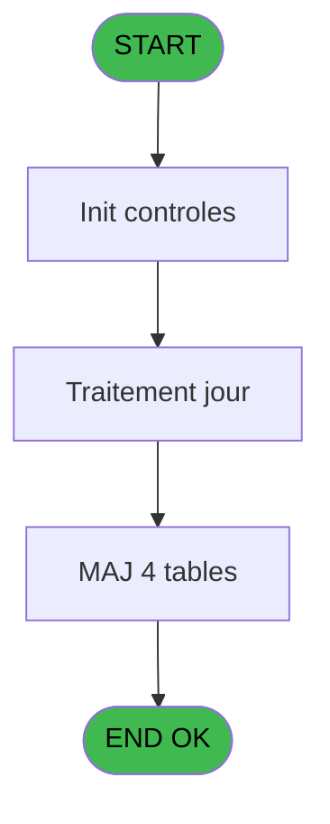
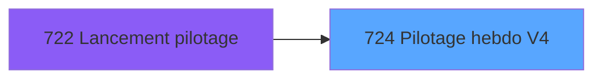
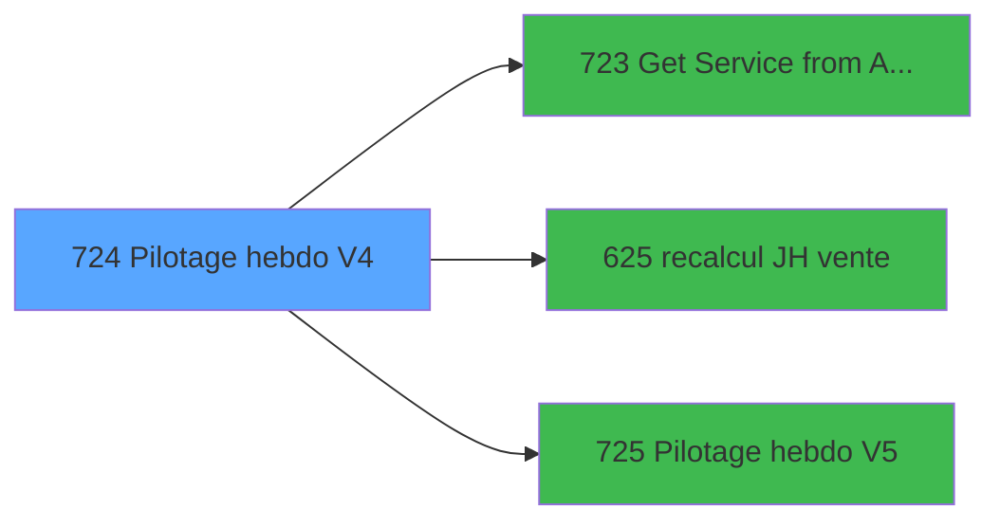

# REF IDE 724 - Pilotage hebdo V4

> **Analyse**: Phases 1-4 2026-02-03 13:57 -> 13:58 (22s) | Assemblage 13:58
> **Pipeline**: V7.2 Enrichi
> **Structure**: 4 onglets (Resume | Ecrans | Donnees | Connexions)

<!-- TAB:Resume -->

## 1. FICHE D'IDENTITE

| Attribut | Valeur |
|----------|--------|
| Projet | REF |
| IDE Position | 724 |
| Nom Programme | Pilotage hebdo V4 |
| Fichier source | `Prg_724.xml` |
| Dossier IDE | General |
| Taches | 54 (0 ecrans visibles) |
| Tables modifiees | 4 |
| Programmes appeles | 3 |

## 2. DESCRIPTION FONCTIONNELLE

**Pilotage hebdo V4** assure la gestion complete de ce processus, accessible depuis [Lancement pilotage (IDE 722)](REF-IDE-722.md).

Le flux de traitement s'organise en **3 blocs fonctionnels** :

- **Traitement** (38 taches) : traitements metier divers
- **Saisie** (9 taches) : ecrans de saisie utilisateur (formulaires, champs, donnees)
- **Calcul** (7 taches) : calculs de montants, stocks ou compteurs

**Donnees modifiees** : 4 tables en ecriture (comptable________cte, tables_imports, pv_package_composants, log_pilotage_hebdo).

Detail : phases du traitement

#### Phase 1 : Traitement (38 taches)

- **724** - Pilotage hebdo V4
- **724.1** - suppression log bar
- **724.2** - Pilotage hebdo
- **724.2.1** - Export
- **724.2.1.1.1** - Parcourt imputation SQL **[[ECRAN]](#ecran-t6)**
- **724.2.1.1.1.1** - Export OD
- **724.2.1.1.4** - Parcourt imputation SQL **[[ECRAN]](#ecran-t14)**
- **724.2.1.1.4.1** - Export OD
- **724.2.1.2** - Export coin boutique
- **724.2.1.2.1** - Export OD
- **724.2.1.2.4** - Export OD
- **724.2.1.3** - CBAR **[[ECRAN]](#ecran-t22)**
- **724.2.1.3.1** - Trace
- **724.2.1.4** - CSM **[[ECRAN]](#ecran-t24)**
- **724.2.1.5** - CSM **[[ECRAN]](#ecran-t25)**
- **724.2.1.6** - CECO **[[ECRAN]](#ecran-t26)**
- **724.2.1.7** - VSTKM **[[ECRAN]](#ecran-t27)**
- **724.2.1.7.1** - Trace
- **724.2.1.8** - CECO **[[ECRAN]](#ecran-t29)**
- **724.2.1.9** - Export JH
- **724.2.1.10** - Export VRL / VSL
- **724.2.1.11** - Export VRL / VSL & PYR
- **724.2.1.11.1** - VRL / VSL
- **724.2.1.11.4** - Export
- **724.2.1.12** - Export Boutique
- **724.2.1.12.1** - OD Open Bravo
- **724.2.1.14** - Export Telephone
- **724.2.1.14.1** - Export Boutique
- **724.2.1.14.2** - Export Boutique
- **724.2.1.14.3** - Export Boutique
- **724.2.1.14.4** - Export Boutique
- **724.2.1.16.1** - View
- **724.2.1.17** - Export Chambres
- **724.2.1.17.2** - Chambres Occupées
- **724.2.1.17.3** - Chambres Occupées Archive
- **724.2.1.18** - Export DOF
- **724.2.2** - Recupère date FME **[[ECRAN]](#ecran-t53)**
- **724.3** - nb lieu sejour

Delegue a : [Get Service from Activity (IDE 723)](REF-IDE-723.md), [Pilotage hebdo V5 (IDE 725)](REF-IDE-725.md)

#### Phase 2 : Saisie (9 taches)

- **724.2.1.1** - Select service point de vente **[[ECRAN]](#ecran-t5)**
- **724.2.1.1.1.2** - Export Ventes
- **724.2.1.1.2** - Export Point de Vente **[[ECRAN]](#ecran-t9)**
- **724.2.1.1.3** - Export Point de Vente **[[ECRAN]](#ecran-t11)**
- **724.2.1.1.4.2** - Export Ventes
- **724.2.1.2.2** - Export Ventes
- **724.2.1.2.3** - Export Ventes
- **724.2.1.11.3** - PYR from Ventes v2
- **724.2.1.13** - Export Ventes Boutique

Delegue a : [recalcul JH vente (IDE 625)](REF-IDE-625.md)

#### Phase 3 : Calcul (7 taches)

- **724.2.1.1.2.1** - Calcul Montant
- **724.2.1.1.3.1** - Calcul Montant
- **724.2.1.1.3.2** - Calcul Materiel
- **724.2.1.11.2** - PYR from Compta v2
- **724.2.1.15** - Calcul Somme Bar Cost **[[ECRAN]](#ecran-t45)**
- **724.2.1.16** - Calcul conso mensuelle food **[[ECRAN]](#ecran-t46)**
- **724.2.1.17.1** - Comptage Chambres

Delegue a : [recalcul JH vente (IDE 625)](REF-IDE-625.md)

#### Tables impactees

| Table | Operations | Role metier |
|-------|-----------|-------------|
| tables_imports | R/**W**/L (18 usages) |  |
| log_pilotage_hebdo | R/**W** (5 usages) | Hebergement (chambres) |
| comptable________cte | **W**/L (5 usages) |  |
| pv_package_composants | **W** (1 usages) |  |

## 3. BLOCS FONCTIONNELS

### 3.1 Traitement (38 taches)

Traitements internes.

---

#### 724 - Pilotage hebdo V4

**Role** : Tache d'orchestration : point d'entree du programme (38 sous-taches). Coordonne l'enchainement des traitements.

37 sous-taches directes

| Tache | Nom | Bloc |
|-------|-----|------|
| [724.1](#t2) | suppression log bar | Traitement |
| [724.2](#t3) | Pilotage hebdo | Traitement |
| [724.2.1](#t4) | Export | Traitement |
| [724.2.1.1.1](#t6) | Parcourt imputation SQL **[[ECRAN]](#ecran-t6)** | Traitement |
| [724.2.1.1.1.1](#t7) | Export OD | Traitement |
| [724.2.1.1.4](#t14) | Parcourt imputation SQL **[[ECRAN]](#ecran-t14)** | Traitement |
| [724.2.1.1.4.1](#t15) | Export OD | Traitement |
| [724.2.1.2](#t17) | Export coin boutique | Traitement |
| [724.2.1.2.1](#t18) | Export OD | Traitement |
| [724.2.1.2.4](#t21) | Export OD | Traitement |
| [724.2.1.3](#t22) | CBAR **[[ECRAN]](#ecran-t22)** | Traitement |
| [724.2.1.3.1](#t23) | Trace | Traitement |
| [724.2.1.4](#t24) | CSM **[[ECRAN]](#ecran-t24)** | Traitement |
| [724.2.1.5](#t25) | CSM **[[ECRAN]](#ecran-t25)** | Traitement |
| [724.2.1.6](#t26) | CECO **[[ECRAN]](#ecran-t26)** | Traitement |
| [724.2.1.7](#t27) | VSTKM **[[ECRAN]](#ecran-t27)** | Traitement |
| [724.2.1.7.1](#t28) | Trace | Traitement |
| [724.2.1.8](#t29) | CECO **[[ECRAN]](#ecran-t29)** | Traitement |
| [724.2.1.9](#t30) | Export JH | Traitement |
| [724.2.1.10](#t31) | Export VRL / VSL | Traitement |
| [724.2.1.11](#t32) | Export VRL / VSL & PYR | Traitement |
| [724.2.1.11.1](#t33) | VRL / VSL | Traitement |
| [724.2.1.11.4](#t36) | Export | Traitement |
| [724.2.1.12](#t37) | Export Boutique | Traitement |
| [724.2.1.12.1](#t38) | OD Open Bravo | Traitement |
| [724.2.1.14](#t40) | Export Telephone | Traitement |
| [724.2.1.14.1](#t41) | Export Boutique | Traitement |
| [724.2.1.14.2](#t42) | Export Boutique | Traitement |
| [724.2.1.14.3](#t43) | Export Boutique | Traitement |
| [724.2.1.14.4](#t44) | Export Boutique | Traitement |
| [724.2.1.16.1](#t47) | View | Traitement |
| [724.2.1.17](#t48) | Export Chambres | Traitement |
| [724.2.1.17.2](#t50) | Chambres Occupées | Traitement |
| [724.2.1.17.3](#t51) | Chambres Occupées Archive | Traitement |
| [724.2.1.18](#t52) | Export DOF | Traitement |
| [724.2.2](#t53) | Recupère date FME **[[ECRAN]](#ecran-t53)** | Traitement |
| [724.3](#t54) | nb lieu sejour | Traitement |

---

#### 724.1 - suppression log bar

**Role** : Traitement : suppression log bar.

---

#### 724.2 - Pilotage hebdo

**Role** : Traitement : Pilotage hebdo.

---

#### 724.2.1 - Export

**Role** : Traitement : Export.

---

#### 724.2.1.1.1 - Parcourt imputation SQL [[ECRAN]](#ecran-t6)

**Role** : Traitement : Parcourt imputation SQL.
**Ecran** : 358 x 195 DLU | [Voir mockup](#ecran-t6)
**Variables liees** : K (V.Date debut parcourt quotidien)

---

#### 724.2.1.1.1.1 - Export OD

**Role** : Traitement : Export OD.

---

#### 724.2.1.1.4 - Parcourt imputation SQL [[ECRAN]](#ecran-t14)

**Role** : Traitement : Parcourt imputation SQL.
**Ecran** : 358 x 195 DLU | [Voir mockup](#ecran-t14)
**Variables liees** : K (V.Date debut parcourt quotidien)

---

#### 724.2.1.1.4.1 - Export OD

**Role** : Traitement : Export OD.

---

#### 724.2.1.2 - Export coin boutique

**Role** : Traitement : Export coin boutique.
**Variables liees** : L (v.Cloture Boutique Interne)

---

#### 724.2.1.2.1 - Export OD

**Role** : Traitement : Export OD.

---

#### 724.2.1.2.4 - Export OD

**Role** : Traitement : Export OD.

---

#### 724.2.1.3 - CBAR [[ECRAN]](#ecran-t22)

**Role** : Traitement : CBAR.
**Ecran** : 171 x 195 DLU | [Voir mockup](#ecran-t22)

---

#### 724.2.1.3.1 - Trace

**Role** : Traitement : Trace.

---

#### 724.2.1.4 - CSM [[ECRAN]](#ecran-t24)

**Role** : Traitement interne.
**Ecran** : 171 x 195 DLU | [Voir mockup](#ecran-t24)

---

#### 724.2.1.5 - CSM [[ECRAN]](#ecran-t25)

**Role** : Traitement interne.
**Ecran** : 171 x 195 DLU | [Voir mockup](#ecran-t25)

---

#### 724.2.1.6 - CECO [[ECRAN]](#ecran-t26)

**Role** : Traitement : CECO.
**Ecran** : 171 x 195 DLU | [Voir mockup](#ecran-t26)

---

#### 724.2.1.7 - VSTKM [[ECRAN]](#ecran-t27)

**Role** : Traitement : VSTKM.
**Ecran** : 171 x 195 DLU | [Voir mockup](#ecran-t27)

---

#### 724.2.1.7.1 - Trace

**Role** : Traitement : Trace.

---

#### 724.2.1.8 - CECO [[ECRAN]](#ecran-t29)

**Role** : Traitement : CECO.
**Ecran** : 171 x 195 DLU | [Voir mockup](#ecran-t29)

---

#### 724.2.1.9 - Export JH

**Role** : Traitement : Export JH.

---

#### 724.2.1.10 - Export VRL / VSL

**Role** : Traitement : Export VRL / VSL.

---

#### 724.2.1.11 - Export VRL / VSL & PYR

**Role** : Traitement : Export VRL / VSL & PYR.

---

#### 724.2.1.11.1 - VRL / VSL

**Role** : Traitement : VRL / VSL.

---

#### 724.2.1.11.4 - Export

**Role** : Traitement : Export.

---

#### 724.2.1.12 - Export Boutique

**Role** : Traitement : Export Boutique.
**Variables liees** : L (v.Cloture Boutique Interne)

---

#### 724.2.1.12.1 - OD Open Bravo

**Role** : Traitement : OD Open Bravo.

---

#### 724.2.1.14 - Export Telephone

**Role** : Traitement : Export Telephone.

---

#### 724.2.1.14.1 - Export Boutique

**Role** : Traitement : Export Boutique.
**Variables liees** : L (v.Cloture Boutique Interne)

---

#### 724.2.1.14.2 - Export Boutique

**Role** : Traitement : Export Boutique.
**Variables liees** : L (v.Cloture Boutique Interne)

---

#### 724.2.1.14.3 - Export Boutique

**Role** : Traitement : Export Boutique.
**Variables liees** : L (v.Cloture Boutique Interne)

---

#### 724.2.1.14.4 - Export Boutique

**Role** : Traitement : Export Boutique.
**Variables liees** : L (v.Cloture Boutique Interne)

---

#### 724.2.1.16.1 - View

**Role** : Traitement : View.

---

#### 724.2.1.17 - Export Chambres

**Role** : Traitement : Export Chambres.

---

#### 724.2.1.17.2 - Chambres Occupées

**Role** : Traitement : Chambres Occupées.

---

#### 724.2.1.17.3 - Chambres Occupées Archive

**Role** : Traitement : Chambres Occupées Archive.

---

#### 724.2.1.18 - Export DOF

**Role** : Traitement : Export DOF.

---

#### 724.2.2 - Recupère date FME [[ECRAN]](#ecran-t53)

**Role** : Consultation/chargement : Recupère date FME.
**Ecran** : 179 x 195 DLU | [Voir mockup](#ecran-t53)
**Variables liees** : A (P.Date debut), B (P.Date fin), K (V.Date debut parcourt quotidien)

---

#### 724.3 - nb lieu sejour

**Role** : Traitement : nb lieu sejour.
**Variables liees** : F (V.Nb lieu de sejour)

### 3.2 Saisie (9 taches)

L'operateur saisit les donnees de la transaction via 3 ecrans (Select service point de vente, Export Point de Vente, Export Point de Vente).

---

#### 724.2.1.1 - Select service point de vente [[ECRAN]](#ecran-t5)

**Role** : Saisie des donnees : Select service point de vente.
**Ecran** : 120 x 195 DLU | [Voir mockup](#ecran-t5)
**Delegue a** : [recalcul JH vente (IDE 625)](REF-IDE-625.md)

---

#### 724.2.1.1.1.2 - Export Ventes

**Role** : Saisie des donnees : Export Ventes.
**Delegue a** : [recalcul JH vente (IDE 625)](REF-IDE-625.md)

---

#### 724.2.1.1.2 - Export Point de Vente [[ECRAN]](#ecran-t9)

**Role** : Saisie des donnees : Export Point de Vente.
**Ecran** : 841 x 238 DLU | [Voir mockup](#ecran-t9)
**Delegue a** : [recalcul JH vente (IDE 625)](REF-IDE-625.md)

---

#### 724.2.1.1.3 - Export Point de Vente [[ECRAN]](#ecran-t11)

**Role** : Saisie des donnees : Export Point de Vente.
**Ecran** : 841 x 238 DLU | [Voir mockup](#ecran-t11)
**Delegue a** : [recalcul JH vente (IDE 625)](REF-IDE-625.md)

---

#### 724.2.1.1.4.2 - Export Ventes

**Role** : Saisie des donnees : Export Ventes.
**Delegue a** : [recalcul JH vente (IDE 625)](REF-IDE-625.md)

---

#### 724.2.1.2.2 - Export Ventes

**Role** : Saisie des donnees : Export Ventes.
**Delegue a** : [recalcul JH vente (IDE 625)](REF-IDE-625.md)

---

#### 724.2.1.2.3 - Export Ventes

**Role** : Saisie des donnees : Export Ventes.
**Delegue a** : [recalcul JH vente (IDE 625)](REF-IDE-625.md)

---

#### 724.2.1.11.3 - PYR from Ventes v2

**Role** : Saisie des donnees : PYR from Ventes v2.
**Delegue a** : [recalcul JH vente (IDE 625)](REF-IDE-625.md)

---

#### 724.2.1.13 - Export Ventes Boutique

**Role** : Saisie des donnees : Export Ventes Boutique.
**Variables liees** : L (v.Cloture Boutique Interne)
**Delegue a** : [recalcul JH vente (IDE 625)](REF-IDE-625.md)

### 3.3 Calcul (7 taches)

Calculs metier : montants, stocks, compteurs.

---

#### 724.2.1.1.2.1 - Calcul Montant

**Role** : Calcul : Calcul Montant.

---

#### 724.2.1.1.3.1 - Calcul Montant

**Role** : Calcul : Calcul Montant.

---

#### 724.2.1.1.3.2 - Calcul Materiel

**Role** : Calcul : Calcul Materiel.

---

#### 724.2.1.11.2 - PYR from Compta v2

**Role** : Traitement : PYR from Compta v2.

---

#### 724.2.1.15 - Calcul Somme Bar Cost [[ECRAN]](#ecran-t45)

**Role** : Calcul : Calcul Somme Bar Cost.
**Ecran** : 270 x 195 DLU | [Voir mockup](#ecran-t45)
**Variables liees** : G (V.Somme facturation mois BR), H (V.Somme BCO Soft), I (V.Somme BCO BSI), J (V.Somme BCO HBSI)

---

#### 724.2.1.16 - Calcul conso mensuelle food [[ECRAN]](#ecran-t46)

**Role** : Calcul : Calcul conso mensuelle food.
**Ecran** : 694 x 334 DLU | [Voir mockup](#ecran-t46)

---

#### 724.2.1.17.1 - Comptage Chambres

**Role** : Traitement : Comptage Chambres.

## 5. REGLES METIER

*(Aucune regle metier identifiee)*

## 6. CONTEXTE

- **Appele par**: [Lancement pilotage (IDE 722)](REF-IDE-722.md)
- **Appelle**: 3 programmes | **Tables**: 42 (W:4 R:15 L:32) | **Taches**: 54 | **Expressions**: 5

<!-- TAB:Ecrans -->

## 8. ECRANS

*(Programme sans ecran visible)*

## 9. NAVIGATION

### 9.3 Structure hierarchique (54 taches)

| Position | Tache | Type | Dimensions | Bloc |
|----------|-------|------|------------|------|
| **724.1** | [**Pilotage hebdo V4** (724)](#t1) | - | - | Traitement |
| 724.1.1 | [suppression log bar (724.1)](#t2) | - | - | |
| 724.1.2 | [Pilotage hebdo (724.2)](#t3) | - | - | |
| 724.1.3 | [Export (724.2.1)](#t4) | - | - | |
| 724.1.4 | [Parcourt imputation SQL (724.2.1.1.1)](#t6) [mockup](#ecran-t6) | - | 358x195 | |
| 724.1.5 | [Export OD (724.2.1.1.1.1)](#t7) | - | - | |
| 724.1.6 | [Parcourt imputation SQL (724.2.1.1.4)](#t14) [mockup](#ecran-t14) | - | 358x195 | |
| 724.1.7 | [Export OD (724.2.1.1.4.1)](#t15) | - | - | |
| 724.1.8 | [Export coin boutique (724.2.1.2)](#t17) | - | - | |
| 724.1.9 | [Export OD (724.2.1.2.1)](#t18) | - | - | |
| 724.1.10 | [Export OD (724.2.1.2.4)](#t21) | - | - | |
| 724.1.11 | [CBAR (724.2.1.3)](#t22) [mockup](#ecran-t22) | - | 171x195 | |
| 724.1.12 | [Trace (724.2.1.3.1)](#t23) | - | - | |
| 724.1.13 | [CSM (724.2.1.4)](#t24) [mockup](#ecran-t24) | - | 171x195 | |
| 724.1.14 | [CSM (724.2.1.5)](#t25) [mockup](#ecran-t25) | - | 171x195 | |
| 724.1.15 | [CECO (724.2.1.6)](#t26) [mockup](#ecran-t26) | - | 171x195 | |
| 724.1.16 | [VSTKM (724.2.1.7)](#t27) [mockup](#ecran-t27) | - | 171x195 | |
| 724.1.17 | [Trace (724.2.1.7.1)](#t28) | - | - | |
| 724.1.18 | [CECO (724.2.1.8)](#t29) [mockup](#ecran-t29) | - | 171x195 | |
| 724.1.19 | [Export JH (724.2.1.9)](#t30) | - | - | |
| 724.1.20 | [Export VRL / VSL (724.2.1.10)](#t31) | - | - | |
| 724.1.21 | [Export VRL / VSL & PYR (724.2.1.11)](#t32) | - | - | |
| 724.1.22 | [VRL / VSL (724.2.1.11.1)](#t33) | - | - | |
| 724.1.23 | [Export (724.2.1.11.4)](#t36) | - | - | |
| 724.1.24 | [Export Boutique (724.2.1.12)](#t37) | - | - | |
| 724.1.25 | [OD Open Bravo (724.2.1.12.1)](#t38) | - | - | |
| 724.1.26 | [Export Telephone (724.2.1.14)](#t40) | - | - | |
| 724.1.27 | [Export Boutique (724.2.1.14.1)](#t41) | - | - | |
| 724.1.28 | [Export Boutique (724.2.1.14.2)](#t42) | - | - | |
| 724.1.29 | [Export Boutique (724.2.1.14.3)](#t43) | - | - | |
| 724.1.30 | [Export Boutique (724.2.1.14.4)](#t44) | - | - | |
| 724.1.31 | [View (724.2.1.16.1)](#t47) | - | - | |
| 724.1.32 | [Export Chambres (724.2.1.17)](#t48) | - | - | |
| 724.1.33 | [Chambres Occupées (724.2.1.17.2)](#t50) | - | - | |
| 724.1.34 | [Chambres Occupées Archive (724.2.1.17.3)](#t51) | - | - | |
| 724.1.35 | [Export DOF (724.2.1.18)](#t52) | - | - | |
| 724.1.36 | [Recupère date FME (724.2.2)](#t53) [mockup](#ecran-t53) | - | 179x195 | |
| 724.1.37 | [nb lieu sejour (724.3)](#t54) | - | - | |
| **724.2** | [**Select service point de vente** (724.2.1.1)](#t5) [mockup](#ecran-t5) | - | 120x195 | Saisie |
| 724.2.1 | [Export Ventes (724.2.1.1.1.2)](#t8) | - | - | |
| 724.2.2 | [Export Point de Vente (724.2.1.1.2)](#t9) [mockup](#ecran-t9) | - | 841x238 | |
| 724.2.3 | [Export Point de Vente (724.2.1.1.3)](#t11) [mockup](#ecran-t11) | - | 841x238 | |
| 724.2.4 | [Export Ventes (724.2.1.1.4.2)](#t16) | - | - | |
| 724.2.5 | [Export Ventes (724.2.1.2.2)](#t19) | - | - | |
| 724.2.6 | [Export Ventes (724.2.1.2.3)](#t20) | - | - | |
| 724.2.7 | [PYR from Ventes v2 (724.2.1.11.3)](#t35) | - | - | |
| 724.2.8 | [Export Ventes Boutique (724.2.1.13)](#t39) | - | - | |
| **724.3** | [**Calcul Montant** (724.2.1.1.2.1)](#t10) | - | - | Calcul |
| 724.3.1 | [Calcul Montant (724.2.1.1.3.1)](#t12) | - | - | |
| 724.3.2 | [Calcul Materiel (724.2.1.1.3.2)](#t13) | - | - | |
| 724.3.3 | [PYR from Compta v2 (724.2.1.11.2)](#t34) | - | - | |
| 724.3.4 | [Calcul Somme Bar Cost (724.2.1.15)](#t45) [mockup](#ecran-t45) | - | 270x195 | |
| 724.3.5 | [Calcul conso mensuelle food (724.2.1.16)](#t46) [mockup](#ecran-t46) | - | 694x334 | |
| 724.3.6 | [Comptage Chambres (724.2.1.17.1)](#t49) | - | - | |

### 9.4 Algorigramme

> **Legende**: Vert = START/END OK | Rouge = END KO | Bleu = Decisions
> *Algorigramme auto-genere. Utiliser `/algorigramme` pour une synthese metier detaillee.*

<!-- TAB:Donnees -->

## 10. TABLES

### Tables utilisees (42)

| ID | Nom | Description | Type | R | W | L | Usages |
|----|-----|-------------|------|---|---|---|--------|
| 30 | gm-recherche_____gmr | Index de recherche | DB | R |   |   | 12 |
| 31 | gm-complet_______gmc |  | DB |   |   | L | 2 |
| 34 | hebergement______heb | Hebergement (chambres) | DB |   |   | L | 9 |
| 38 | comptable_gratuite |  | DB | R |   | L | 2 |
| 40 | comptable________cte |  | DB |   | **W** | L | 5 |
| 65 | comptes_recette__cre | Comptes GM (generaux) | DB | R |   | L | 4 |
| 67 | tables___________tab |  | DB | R |   |   | 1 |
| 77 | articles_________art | Articles et stock | DB | R |   | L | 13 |
| 81 | societe__________soc |  | DB | R |   |   | 1 |
| 118 | tables_imports |  | DB | R | **W** | L | 18 |
| 120 | tables_qualites__qua |  | DB | R |   |   | 1 |
| 210 | plan_comptable_central_histo | Historique / journal | DB | R |   |   | 1 |
| 240 | saisie_pdc_boutique |  | DB |   |   | L | 1 |
| 245 | saisie_od_par_service | Services / filieres | DB |   |   | L | 1 |
| 263 | vente | Donnees de ventes | DB |   |   | L | 4 |
| 368 | pms_village |  | DB | R |   | L | 2 |
| 373 | pv_comptable |  | DB | R |   |   | 1 |
| 374 | pv_credit_card |  | DB |   |   | L | 2 |
| 375 | pv_cat |  | DB |   |   | L | 2 |
| 378 | pv_customer |  | DB |   |   | L | 1 |
| 392 | pv_invoicehistoline | Historique / journal | DB |   |   | L | 2 |
| 396 | pv_cust_packages |  | DB |   |   | L | 1 |
| 397 | pv_package_composants |  | DB |   | **W** |   | 1 |
| 399 | pv_package_price |  | DB |   |   | L | 2 |
| 409 | pv_sub_cat |  | DB |   |   | L | 2 |
| 415 | pv_type_matos |  | DB |   |   | L | 1 |
| 708 | param_retail |  | DB |   |   | L | 1 |
| 710 | pv_parametre_generaux |  | DB |   |   | L | 1 |
| 722 | arc_gm-recherche_____gmr | Index de recherche | DB | R |   | L | 8 |
| 724 | arc_comptable________cte |  | DB |   |   | L | 3 |
| 732 | arc_pv_comptable |  | DB | R |   |   | 1 |
| 733 | arc_pv_customer |  | DB |   |   | L | 1 |
| 734 | arc_pv_cust_packages |  | DB |   |   | L | 1 |
| 742 | BarCreditConso |  | DB |   |   | L | 2 |
| 744 | pv_lieux_vente | Donnees de ventes | DB |   |   | L | 2 |
| 770 | vente_vrl_vsl | Donnees de ventes | DB |   |   | L | 2 |
| 785 | effectif_quotidien |  | DB |   |   | L | 1 |
| 787 | comptestva | Comptes GM (generaux) | DB | R |   |   | 1 |
| 791 | log_pilotage_hebdo | Hebergement (chambres) | DB | R | **W** |   | 5 |
| 828 | arc_vente | Donnees de ventes | DB |   |   | L | 3 |
| 853 | arc_hebergement______heb | Hebergement (chambres) | DB |   |   | L | 9 |
| 912 | Table_912 |  | MEM |   |   | L | 4 |

### Colonnes par table (21 / 17 tables avec colonnes identifiees)

Table 30 - gm-recherche_____gmr (R) - 12 usages

| Lettre | Variable | Acces | Type |
|--------|----------|-------|------|
| A | Retour Gratuite | R | Logical |
| B | v.Montant | R | Numeric |
| C | v.Service | R | Unicode |
| D | v.Categorie | R | Unicode |
| E | v.Montant brut HT | R | Numeric |
| F | v.Montant brut TTC | R | Numeric |
| G | v.Materiel | R | Unicode |
| H | V.Date | R | Date |
| I | V.Montant Net Total TTC | R | Numeric |
| J | V.Montant brut Total TTC | R | Numeric |
| K | V.NB JH Total | R | Numeric |
| L | V.Date | R | Date |

Table 38 - comptable_gratuite (R/L) - 2 usages

| Lettre | Variable | Acces | Type |
|--------|----------|-------|------|
| A | Retour Gratuite | R | Logical |
| B | v.Montant | R | Numeric |
| C | v.Service | R | Unicode |
| D | v.Categorie | R | Unicode |
| E | v.montant brut HT | R | Numeric |
| F | v.montant brut TTC | R | Numeric |
| G | V.date | R | Date |

Table 40 - comptable________cte (**W**/L) - 5 usages

| Lettre | Variable | Acces | Type |
|--------|----------|-------|------|
| C | Date Comptable Alpha | W | Alpha |
| E | art_activite_comptable | W | Numeric |

Table 65 - comptes_recette__cre (R/L) - 4 usages

| Lettre | Variable | Acces | Type |
|--------|----------|-------|------|
| A | id_aricle__imputation_ | R | Numeric |
| B | art_imputation | R | Numeric |
| C | art_sous_imputation | R | Numeric |
| D | art_tva | R | Numeric |
| E | article_activite | R | Numeric |
| F | art_service_village | R | Unicode |
| G | v.Service | R | Unicode |
| H | v.Categorie | R | Unicode |

Table 67 - tables___________tab (R) - 1 usages

| Lettre | Variable | Acces | Type |
|--------|----------|-------|------|
| A | pv_service | R | Unicode |
| B | V.Montant export net HT | R | Numeric |
| C | V.Montant export net TTC | R | Numeric |
| D | i.Pourcentage sur compte | R | Numeric |

Table 77 - articles_________art (R/L) - 13 usages

| Lettre | Variable | Acces | Type |
|--------|----------|-------|------|
| A | V.jour en cours | R | Date |
| B | V.Date fin de mois | R | Date |
| C | V.Date FME effectué ? | R | Date |
| D | V.montant brut TTC | R | Numeric |

Table 81 - societe__________soc (R) - 1 usages

| Lettre | Variable | Acces | Type |
|--------|----------|-------|------|
| A | P.Date debut | R | Date |
| B | P.Date fin | R | Date |
| C | P.Code village | R | Alpha |
| D | P.Type fichier (Global/Jour) | R | Alpha |
| E | P.Appel de PBP ? | R | Logical |
| F | V.Nb lieu de sejour | R | Numeric |

Table 118 - tables_imports (R/**W**/L) - 18 usages

| Lettre | Variable | Acces | Type |
|--------|----------|-------|------|
| A | V.Montant brut HT | W | Numeric |
| B | V.Montant brut TTC | W | Numeric |

Table 120 - tables_qualites__qua (R) - 1 usages

| Lettre | Variable | Acces | Type |
|--------|----------|-------|------|
| A | Retour Qualités | R | Logical |
| B | Nb JHP | R | Numeric |
| C | Nb JHD | R | Numeric |
| D | V.Repas VRL midi | R | Numeric |
| E | V.Repas VRL soir | R | Numeric |
| F | V.Repas IGR midi | R | Numeric |
| G | V.Repas IGR soir | R | Numeric |

Table 210 - plan_comptable_central_histo (R) - 1 usages

| Lettre | Variable | Acces | Type |
|--------|----------|-------|------|
| C | Date Comptable Alpha | R | Alpha |
| E | art_activite_comptable | R | Numeric |

Table 368 - pms_village (R/L) - 2 usages

| Lettre | Variable | Acces | Type |
|--------|----------|-------|------|
| C | P.Code village | R | Alpha |
| F | art_service_village | R | Unicode |

Table 373 - pv_comptable (R) - 1 usages

| Lettre | Variable | Acces | Type |
|--------|----------|-------|------|
| C | Date Comptable Alpha | R | Alpha |
| E | art_activite_comptable | R | Numeric |

Table 397 - pv_package_composants (**W**) - 1 usages

*Table utilisee uniquement en Link ou aucune colonne Real identifiee dans le DataView.*

Table 722 - arc_gm-recherche_____gmr (R/L) - 8 usages

| Lettre | Variable | Acces | Type |
|--------|----------|-------|------|
| A | v.montant net HT | R | Numeric |
| B | v.montant brut HT | R | Numeric |
| C | v.montant net TTC | R | Numeric |
| D | v.montant brut TTC | R | Numeric |

Table 732 - arc_pv_comptable (R) - 1 usages

| Lettre | Variable | Acces | Type |
|--------|----------|-------|------|
| C | Date Comptable Alpha | R | Alpha |
| E | art_activite_comptable | R | Numeric |

Table 787 - comptestva (R) - 1 usages

*Table utilisee uniquement en Link ou aucune colonne Real identifiee dans le DataView.*

Table 791 - log_pilotage_hebdo (R/**W**) - 5 usages

| Lettre | Variable | Acces | Type |
|--------|----------|-------|------|
| A | V.Existe envoi mensuel ? | W | Logical |
| B | V.Somme des sorties mensuelles | W | Numeric |
| C | V.Somme des conso mensuelles | W | Numeric |
| D | V.Somme inventaire mois | W | Numeric |
| E | V.Somme inventaire mois prec | W | Numeric |
| F | V.Somme facturation mois BA | W | Numeric |
| G | V.Somme facturation mois BR | W | Numeric |
| H | V.Somme BCO Soft | W | Numeric |
| I | V.Somme BCO BSI | W | Numeric |
| J | V.Somme BCO HBSI | W | Numeric |
| K | V.Date debut parcourt quotidien | W | Date |
| L | v.Cloture Boutique Interne | W | Logical |

## 11. VARIABLES

### 11.1 Parametres entrants (5)

Variables recues du programme appelant ([Lancement pilotage (IDE 722)](REF-IDE-722.md)).

| Lettre | Nom | Type | Usage dans |
|--------|-----|------|-----------|
| A | P.Date debut | Date | - |
| B | P.Date fin | Date | - |
| C | P.Code village | Alpha | - |
| D | P.Type fichier (Global/Jour) | Alpha | - |
| E | P.Appel de PBP ? | Logical | - |

### 11.2 Variables de session (7)

Variables persistantes pendant toute la session.

| Lettre | Nom | Type | Usage dans |
|--------|-----|------|-----------|
| F | V.Nb lieu de sejour | Numeric | - |
| G | V.Somme facturation mois BR | Numeric | - |
| H | V.Somme BCO Soft | Numeric | - |
| I | V.Somme BCO BSI | Numeric | - |
| J | V.Somme BCO HBSI | Numeric | - |
| K | V.Date debut parcourt quotidien | Date | - |
| L | v.Cloture Boutique Interne | Logical | - |

## 12. EXPRESSIONS

**5 / 5 expressions decodees (100%)**

### 12.1 Repartition par type

| Type | Expressions | Regles |
|------|-------------|--------|
| CONCATENATION | 1 | 0 |
| CONSTANTE | 1 | 0 |
| OTHER | 1 | 0 |
| CAST_LOGIQUE | 2 | 0 |

### 12.2 Expressions cles par type

#### CONCATENATION (1 expressions)

| Type | IDE | Expression | Regle |
|------|-----|------------|-------|
| CONCATENATION | 1 | `'cmd /c mkdir '&Translate('%club_exportdata%')&'Pilotage'` | - |

#### CONSTANTE (1 expressions)

| Type | IDE | Expression | Regle |
|------|-----|------------|-------|
| CONSTANTE | 5 | `'C'` | - |

#### OTHER (1 expressions)

| Type | IDE | Expression | Regle |
|------|-----|------------|-------|
| OTHER | 2 | `NOT(FileExist(Translate('%club_exportdata%')&'Pilotage'))` | - |

#### CAST_LOGIQUE (2 expressions)

| Type | IDE | Expression | Regle |
|------|-----|------------|-------|
| CAST_LOGIQUE | 4 | `INIPut('IOTiming=I','FALSE'LOG)` | - |
| CAST_LOGIQUE | 3 | `INIPut('IOTiming=O','FALSE'LOG)` | - |

<!-- TAB:Connexions -->

## 13. GRAPHE D'APPELS

### 13.1 Chaine depuis Main (Callers)

Main -> ... -> [Lancement pilotage (IDE 722)](REF-IDE-722.md) -> **Pilotage hebdo V4 (IDE 724)**

### 13.2 Callers

| IDE | Nom Programme | Nb Appels |
|-----|---------------|-----------|
| [722](REF-IDE-722.md) | Lancement pilotage | 1 |

### 13.3 Callees (programmes appeles)

### 13.4 Detail Callees avec contexte

| IDE | Nom Programme | Appels | Contexte |
|-----|---------------|--------|----------|
| [723](REF-IDE-723.md) | Get Service from Activity | 4 | Recuperation donnees |
| [625](REF-IDE-625.md) | recalcul JH vente | 1 | Calcul de donnees |
| [725](REF-IDE-725.md) | Pilotage hebdo V5 | 1 | Sous-programme |

## 14. RECOMMANDATIONS MIGRATION

### 14.1 Profil du programme

| Metrique | Valeur | Impact migration |
|----------|--------|-----------------|
| Lignes de logique | 2228 | Programme volumineux |
| Expressions | 5 | Peu de logique |
| Tables WRITE | 4 | Impact modere |
| Sous-programmes | 3 | Peu de dependances |
| Ecrans visibles | 0 | Ecran unique ou traitement batch |
| Code desactive | 1.3% (28 / 2228) | Code sain |
| Regles metier | 0 | Pas de regle identifiee |

### 14.2 Plan de migration par bloc

#### Traitement (38 taches: 9 ecrans, 29 traitements)

- **Strategie** : Orchestrateur avec 9 ecrans (Razor/React) et 29 traitements backend (services).
- Les ecrans deviennent des composants UI, les traitements invisibles deviennent des services injectables.
- 3 sous-programme(s) a migrer ou a reutiliser depuis les services existants.
- Decomposer les taches en services unitaires testables.

#### Saisie (9 taches: 3 ecrans, 6 traitements)

- **Strategie** : Formulaire React/Blazor avec validation Zod/FluentValidation.
- Reproduire 3 ecrans : Select service point de vente, Export Point de Vente, Export Point de Vente
- Validation temps reel cote client + serveur

#### Calcul (7 taches: 2 ecrans, 5 traitements)

- **Strategie** : Services de calcul purs (Domain Services).
- Migrer la logique de calcul (stock, compteurs, montants)

### 14.3 Dependances critiques

| Dependance | Type | Appels | Impact |
|------------|------|--------|--------|
| comptable________cte | Table WRITE (Database) | 1x | Schema + repository |
| tables_imports | Table WRITE (Database) | 1x | Schema + repository |
| pv_package_composants | Table WRITE (Database) | 1x | Schema + repository |
| log_pilotage_hebdo | Table WRITE (Database) | 3x | Schema + repository |
| [Get Service from Activity (IDE 723)](REF-IDE-723.md) | Sous-programme | 4x | **CRITIQUE** - Recuperation donnees |
| [Pilotage hebdo V5 (IDE 725)](REF-IDE-725.md) | Sous-programme | 1x | Normale - Sous-programme |
| [recalcul JH vente (IDE 625)](REF-IDE-625.md) | Sous-programme | 1x | Normale - Calcul de donnees |

---
*Spec DETAILED generee par Pipeline V7.2 - 2026-02-03 13:58*
