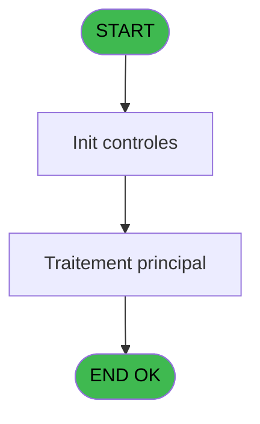
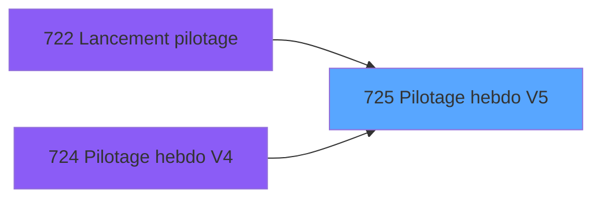

# REF IDE 725 - Pilotage hebdo V5

> **Analyse**: Phases 1-4 2026-02-03 13:58 -> 13:58 (22s) | Assemblage 13:58
> **Pipeline**: V7.2 Enrichi
> **Structure**: 4 onglets (Resume | Ecrans | Donnees | Connexions)

<!-- TAB:Resume -->

## 1. FICHE D'IDENTITE

| Attribut | Valeur |
|----------|--------|
| Projet | REF |
| IDE Position | 725 |
| Nom Programme | Pilotage hebdo V5 |
| Fichier source | `Prg_725.xml` |
| Dossier IDE | General |
| Taches | 3 (0 ecrans visibles) |
| Tables modifiees | 0 |
| Programmes appeles | 0 |

## 2. DESCRIPTION FONCTIONNELLE

**Pilotage hebdo V5** assure la gestion complete de ce processus, accessible depuis [Lancement pilotage (IDE 722)](REF-IDE-722.md), [Pilotage hebdo V4 (IDE 724)](REF-IDE-724.md).

Le flux de traitement s'organise en **1 blocs fonctionnels** :

- **Traitement** (3 taches) : traitements metier divers

## 3. BLOCS FONCTIONNELS

### 3.1 Traitement (3 taches)

Traitements internes.

---

#### 725.1.1 - Export

**Role** : Traitement : Export.
**Variables liees** : CF (v.ligne export)

---

#### 725 - Pilotage hebdo V5

**Role** : Traitement : Pilotage hebdo V5.

---

#### 725.1 - Traitement Jour

**Role** : Traitement : Traitement Jour.
**Variables liees** : BN (Début séjour), BO (Fin séjour)

## 5. REGLES METIER

*(Aucune regle metier identifiee)*

## 6. CONTEXTE

- **Appele par**: [Lancement pilotage (IDE 722)](REF-IDE-722.md), [Pilotage hebdo V4 (IDE 724)](REF-IDE-724.md)
- **Appelle**: 0 programmes | **Tables**: 0 (W:0 R:0 L:0) | **Taches**: 3 | **Expressions**: 6

<!-- TAB:Ecrans -->

## 8. ECRANS

*(Programme sans ecran visible)*

## 9. NAVIGATION

### 9.3 Structure hierarchique (3 taches)

| Position | Tache | Type | Dimensions | Bloc |
|----------|-------|------|------------|------|
| **725.1** | [**Export** (725.1.1)](#t1) | - | - | Traitement |
| 725.1.1 | [Pilotage hebdo V5 (725)](#t2) | - | - | |
| 725.1.2 | [Traitement Jour (725.1)](#t4) | - | - | |

### 9.4 Algorigramme

> **Legende**: Vert = START/END OK | Rouge = END KO | Bleu = Decisions
> *Algorigramme auto-genere. Utiliser `/algorigramme` pour une synthese metier detaillee.*

<!-- TAB:Donnees -->

## 10. TABLES

### Tables utilisees (0)

| ID | Nom | Description | Type | R | W | L | Usages |
|----|-----|-------------|------|---|---|---|--------|

### Colonnes par table (0 / 0 tables avec colonnes identifiees)

## 11. VARIABLES

### 11.1 Variables de session (1)

Variables persistantes pendant toute la session.

| Lettre | Nom | Type | Usage dans |
|--------|-----|------|-----------|
| CF | v.ligne export | Unicode | - |

### 11.2 Autres (57)

Variables diverses.

| Lettre | Nom | Type | Usage dans |
|--------|-----|------|-----------|
| A | Village | Unicode | 2x refs |
| B | TypeLigne | Alpha | - |
| C | Qualité | Unicode | - |
| D | Nom | Unicode | - |
| E | Prenom | Unicode | - |
| F | Num Adherent | Numeric | - |
| G | Filiation Adherent | Numeric | - |
| H | Neol Id | Unicode | - |
| I | Num Dossier | Numeric | - |
| J | Num Ordre | Numeric | - |
| K | Date de consommation | Alpha | - |
| L | Date d'encaissement | Alpha | - |
| M | Heure de l'achat | Alpha | - |
| N | Code Comptable | Unicode | - |
| O | Code Categorie | Unicode | - |
| P | Libellé Categorie | Unicode | - |
| Q | Code Sous Categorie | Unicode | - |
| R | Libellé Sous Categorie | Unicode | - |
| S | Code Service NA | Unicode | - |
| T | Libellé Article | Unicode | - |
| U | Id Ligne Vente | Unicode | - |
| V | Id Ligne Annulée | Unicode | - |
| W | Code Service | Unicode | - |
| X | Nom Service | Unicode | - |
| Y | Vendeur | Unicode | - |
| Z | Montant Net TTC | Numeric | - |
| BA | Montant Net HT | Numeric | - |
| BB | Taux TVA | Numeric | - |
| BC | Montant Brut TTC | Numeric | - |
| BD | Montant Brut HT | Numeric | - |
| BE | Quantité | Numeric | - |
| BF | Commission Service | Numeric | - |
| BG | Moyen de Paiement | Unicode | - |
| BH | Type Achat | Alpha | - |
| BI | % Remise | Numeric | - |
| BJ | Montant Remise | Numeric | - |
| BK | Type Service | Alpha | - |
| BL | Commentaire Remise | Unicode | - |
| BM | Code Logement | Unicode | - |
| BN | Début séjour | Alpha | - |
| BO | Fin séjour | Alpha | - |
| BP | Action | Unicode | - |
| BQ | Imputation Comptable | Numeric | - |
| BR | Libelle Imputation | Unicode | - |
| BS | ActiviteComptable | Numeric | - |
| BT | LibelleActiviteComptable | Unicode | - |
| BU | Num Ticket | Unicode | - |
| BV | Nom Seminaire | Unicode | - |
| BW | Code Devise | Unicode | - |
| BX | Lieu Vente | Alpha | - |
| BY | Montant Credit | Numeric | - |
| BZ | Type Credit | Unicode | - |
| CA | Type Repas VRL | Unicode | - |
| CB | NB_JH_VRL_VSL | Unicode | - |
| CC | Code Vendeur | Unicode | - |
| CD | ExchangedFrom | Unicode | - |
| CE | DiscountReason | Unicode | - |

Toutes les 58 variables (liste complete)

| Cat | Lettre | Nom Variable | Type |
|-----|--------|--------------|------|
| V. | **CF** | v.ligne export | Unicode |
| Autre | **A** | Village | Unicode |
| Autre | **B** | TypeLigne | Alpha |
| Autre | **C** | Qualité | Unicode |
| Autre | **D** | Nom | Unicode |
| Autre | **E** | Prenom | Unicode |
| Autre | **F** | Num Adherent | Numeric |
| Autre | **G** | Filiation Adherent | Numeric |
| Autre | **H** | Neol Id | Unicode |
| Autre | **I** | Num Dossier | Numeric |
| Autre | **J** | Num Ordre | Numeric |
| Autre | **K** | Date de consommation | Alpha |
| Autre | **L** | Date d'encaissement | Alpha |
| Autre | **M** | Heure de l'achat | Alpha |
| Autre | **N** | Code Comptable | Unicode |
| Autre | **O** | Code Categorie | Unicode |
| Autre | **P** | Libellé Categorie | Unicode |
| Autre | **Q** | Code Sous Categorie | Unicode |
| Autre | **R** | Libellé Sous Categorie | Unicode |
| Autre | **S** | Code Service NA | Unicode |
| Autre | **T** | Libellé Article | Unicode |
| Autre | **U** | Id Ligne Vente | Unicode |
| Autre | **V** | Id Ligne Annulée | Unicode |
| Autre | **W** | Code Service | Unicode |
| Autre | **X** | Nom Service | Unicode |
| Autre | **Y** | Vendeur | Unicode |
| Autre | **Z** | Montant Net TTC | Numeric |
| Autre | **BA** | Montant Net HT | Numeric |
| Autre | **BB** | Taux TVA | Numeric |
| Autre | **BC** | Montant Brut TTC | Numeric |
| Autre | **BD** | Montant Brut HT | Numeric |
| Autre | **BE** | Quantité | Numeric |
| Autre | **BF** | Commission Service | Numeric |
| Autre | **BG** | Moyen de Paiement | Unicode |
| Autre | **BH** | Type Achat | Alpha |
| Autre | **BI** | % Remise | Numeric |
| Autre | **BJ** | Montant Remise | Numeric |
| Autre | **BK** | Type Service | Alpha |
| Autre | **BL** | Commentaire Remise | Unicode |
| Autre | **BM** | Code Logement | Unicode |
| Autre | **BN** | Début séjour | Alpha |
| Autre | **BO** | Fin séjour | Alpha |
| Autre | **BP** | Action | Unicode |
| Autre | **BQ** | Imputation Comptable | Numeric |
| Autre | **BR** | Libelle Imputation | Unicode |
| Autre | **BS** | ActiviteComptable | Numeric |
| Autre | **BT** | LibelleActiviteComptable | Unicode |
| Autre | **BU** | Num Ticket | Unicode |
| Autre | **BV** | Nom Seminaire | Unicode |
| Autre | **BW** | Code Devise | Unicode |
| Autre | **BX** | Lieu Vente | Alpha |
| Autre | **BY** | Montant Credit | Numeric |
| Autre | **BZ** | Type Credit | Unicode |
| Autre | **CA** | Type Repas VRL | Unicode |
| Autre | **CB** | NB_JH_VRL_VSL | Unicode |
| Autre | **CC** | Code Vendeur | Unicode |
| Autre | **CD** | ExchangedFrom | Unicode |
| Autre | **CE** | DiscountReason | Unicode |

## 12. EXPRESSIONS

**6 / 6 expressions decodees (100%)**

### 12.1 Repartition par type

| Type | Expressions | Regles |
|------|-------------|--------|
| CALCULATION | 1 | 0 |
| CONCATENATION | 1 | 0 |
| FORMAT | 1 | 0 |
| OTHER | 2 | 0 |
| CONDITION | 1 | 0 |

### 12.2 Expressions cles par type

#### CALCULATION (1 expressions)

| Type | IDE | Expression | Regle |
|------|-----|------------|-------|
| CALCULATION | 2 | `Village [A]+1` | - |

#### CONCATENATION (1 expressions)

| Type | IDE | Expression | Regle |
|------|-----|------------|-------|
| CONCATENATION | 4 | `'cmd /c mkdir '&Translate('%club_exportdata%')&'Pilotage'` | - |

#### FORMAT (1 expressions)

| Type | IDE | Expression | Regle |
|------|-----|------------|-------|
| FORMAT | 6 | `Translate('%club_exportdata%')&'Pilotage\PH_'&Trim({1,4})&'_'&DStr({1,1},'YYYYMMDD')&IF({1,1}<>{1,2},'_'&DStr({1,2},'YYYYMMDD'),'')&'_V5.csv'` | - |

#### OTHER (2 expressions)

| Type | IDE | Expression | Regle |
|------|-----|------------|-------|
| OTHER | 5 | `NOT(FileExist(Translate('%club_exportdata%')&'Pilotage'))` | - |
| OTHER | 1 | `{1,1}` | - |

#### CONDITION (1 expressions)

| Type | IDE | Expression | Regle |
|------|-----|------------|-------|
| CONDITION | 3 | `Village [A]>{1,2}` | - |

<!-- TAB:Connexions -->

## 13. GRAPHE D'APPELS

### 13.1 Chaine depuis Main (Callers)

Main -> ... -> [Lancement pilotage (IDE 722)](REF-IDE-722.md) -> **Pilotage hebdo V5 (IDE 725)**

Main -> ... -> [Pilotage hebdo V4 (IDE 724)](REF-IDE-724.md) -> **Pilotage hebdo V5 (IDE 725)**

### 13.2 Callers

| IDE | Nom Programme | Nb Appels |
|-----|---------------|-----------|
| [722](REF-IDE-722.md) | Lancement pilotage | 1 |
| [724](REF-IDE-724.md) | Pilotage hebdo V4 | 1 |

### 13.3 Callees (programmes appeles)

### 13.4 Detail Callees avec contexte

| IDE | Nom Programme | Appels | Contexte |
|-----|---------------|--------|----------|
| - | (aucun) | - | - |

## 14. RECOMMANDATIONS MIGRATION

### 14.1 Profil du programme

| Metrique | Valeur | Impact migration |
|----------|--------|-----------------|
| Lignes de logique | 84 | Programme compact |
| Expressions | 6 | Peu de logique |
| Tables WRITE | 0 | Impact faible |
| Sous-programmes | 0 | Peu de dependances |
| Ecrans visibles | 0 | Ecran unique ou traitement batch |
| Code desactive | 0% (0 / 84) | Code sain |
| Regles metier | 0 | Pas de regle identifiee |

### 14.2 Plan de migration par bloc

#### Traitement (3 taches: 0 ecran, 3 traitements)

- **Strategie** : 3 service(s) backend injectable(s) (Domain Services).
- Decomposer les taches en services unitaires testables.

### 14.3 Dependances critiques

| Dependance | Type | Appels | Impact |
|------------|------|--------|--------|

---
*Spec DETAILED generee par Pipeline V7.2 - 2026-02-03 13:58*
