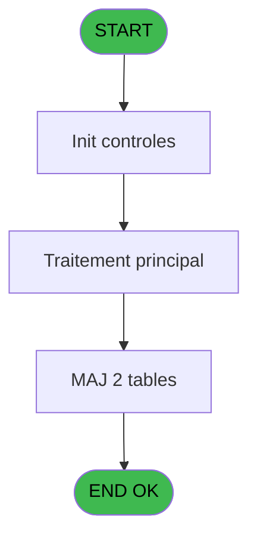
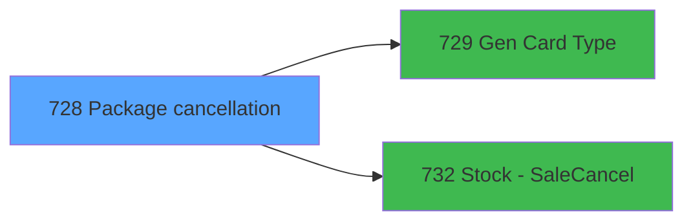

# REF IDE 728 - Package cancellation

> **Analyse**: Phases 1-4 2026-02-03 13:59 -> 14:00 (18s) | Assemblage 14:00
> **Pipeline**: V7.2 Enrichi
> **Structure**: 4 onglets (Resume | Ecrans | Donnees | Connexions)

<!-- TAB:Resume -->

## 1. FICHE D'IDENTITE

| Attribut | Valeur |
|----------|--------|
| Projet | REF |
| IDE Position | 728 |
| Nom Programme | Package cancellation |
| Fichier source | `Prg_728.xml` |
| Dossier IDE | General |
| Taches | 4 (0 ecrans visibles) |
| Tables modifiees | 2 |
| Programmes appeles | 2 |
| :warning: Statut | **ORPHELIN_POTENTIEL** |

## 2. DESCRIPTION FONCTIONNELLE

**Package cancellation** assure la gestion complete de ce processus.

Le flux de traitement s'organise en **2 blocs fonctionnels** :

- **Creation** (2 taches) : insertion d'enregistrements en base (mouvements, prestations)
- **Traitement** (2 taches) : traitements metier divers

**Donnees modifiees** : 2 tables en ecriture (pv_comptable, pv_cust_packages).

**Logique metier** : 1 regles identifiees couvrant conditions metier.

Detail : phases du traitement

#### Phase 1 : Traitement (2 taches)

- **728** - Package=> cust account **[[ECRAN]](#ecran-t1)**
- **728.1** - Get last package id

Delegue a : [Gen Card Type (IDE 729)](REF-IDE-729.md)

#### Phase 2 : Creation (2 taches)

- **728.2** - create cust package **[[ECRAN]](#ecran-t3)**
- **728.3** - Create PV Accounting

#### Tables impactees

| Table | Operations | Role metier |
|-------|-----------|-------------|
| pv_cust_packages | R/**W**/L (3 usages) |  |
| pv_comptable | R/**W** (2 usages) |  |

## 3. BLOCS FONCTIONNELS

### 3.1 Traitement (2 taches)

Traitements internes.

---

#### 728 - Package=> cust account [[ECRAN]](#ecran-t1)

**Role** : Traitement : Package=> cust account.
**Ecran** : 310 x 227 DLU (MDI) | [Voir mockup](#ecran-t1)
**Variables liees** : A (P. Customer Id), M (P.i.Accounting Date)
**Delegue a** : [Gen Card Type (IDE 729)](REF-IDE-729.md)

---

#### 728.1 - Get last package id

**Role** : Consultation/chargement : Get last package id.
**Variables liees** : B (P. Package Id OUT), O (P.o new package_id_out), Q (V new package Id)
**Delegue a** : [Gen Card Type (IDE 729)](REF-IDE-729.md)

### 3.2 Creation (2 taches)

Insertion de nouveaux enregistrements en base.

---

#### 728.2 - create cust package [[ECRAN]](#ecran-t3)

**Role** : Traitement : create cust package.
**Ecran** : 123 x 85 DLU (MDI) | [Voir mockup](#ecran-t3)
**Variables liees** : A (P. Customer Id), B (P. Package Id OUT), O (P.o new package_id_out), Q (V new package Id)

---

#### 728.3 - Create PV Accounting

**Role** : Traitement : Create PV Accounting.
**Variables liees** : M (P.i.Accounting Date)

## 5. REGLES METIER

1 regles identifiees:

### Autres (1 regles)

#### [RM-001] Si [AP]<0 alors 6 sinon 1)

| Element | Detail |
|---------|--------|
| **Condition** | `[AP]<0` |
| **Si vrai** | 6 |
| **Si faux** | 1) |
| **Expression source** | Expression 6 : `IF([AP]<0,6,1)` |
| **Exemple** | Si [AP]<0 → 6. Sinon → 1) |

## 6. CONTEXTE

- **Appele par**: (aucun)
- **Appelle**: 2 programmes | **Tables**: 4 (W:2 R:2 L:3) | **Taches**: 4 | **Expressions**: 19

<!-- TAB:Ecrans -->

## 8. ECRANS

*(Programme sans ecran visible)*

## 9. NAVIGATION

### 9.3 Structure hierarchique (4 taches)

| Position | Tache | Type | Dimensions | Bloc |
|----------|-------|------|------------|------|
| **728.1** | [**Package=> cust account** (728)](#t1) [mockup](#ecran-t1) | MDI | 310x227 | Traitement |
| 728.1.1 | [Get last package id (728.1)](#t2) | MDI | - | |
| **728.2** | [**create cust package** (728.2)](#t3) [mockup](#ecran-t3) | MDI | 123x85 | Creation |
| 728.2.1 | [Create PV Accounting (728.3)](#t4) | - | - | |

### 9.4 Algorigramme

> **Legende**: Vert = START/END OK | Rouge = END KO | Bleu = Decisions
> *Algorigramme auto-genere. Utiliser `/algorigramme` pour une synthese metier detaillee.*

<!-- TAB:Donnees -->

## 10. TABLES

### Tables utilisees (4)

| ID | Nom | Description | Type | R | W | L | Usages |
|----|-----|-------------|------|---|---|---|--------|
| 373 | pv_comptable |  | DB | R | **W** |   | 2 |
| 396 | pv_cust_packages |  | DB | R | **W** | L | 3 |
| 414 | pv_type_actions |  | DB |   |   | L | 1 |
| 942 | vente_assurance | Donnees de ventes | DB |   |   | L | 2 |

### Colonnes par table (4 / 2 tables avec colonnes identifiees)

Table 373 - pv_comptable (R/**W**) - 2 usages

| Lettre | Variable | Acces | Type |
|--------|----------|-------|------|
| A | P. Customer Id | W | Numeric |
| B | P. Package Id OUT | W | Numeric |
| C | P. Action type | W | Alpha |
| D | P. Date start | W | Date |
| E | P. Date end | W | Date |
| F | P.Commentaire annulation | W | Alpha |
| G | P.Refusal to Sell ? | W | Logical |
| H | P Gift Pass ? | W | Logical |
| I | P.ResortCredit ? | W | Logical |
| J | P.i.Service | W | Unicode |
| K | P.i.Login | W | Unicode |
| L | P.i.Cashier | W | Unicode |
| M | P.i.Accounting Date | W | Date |
| N | P.i.Annulation Reception ? | W | Logical |
| O | P.o new package_id_out | W | Numeric |
| P | v. Retour vente_assurance | W | Logical |
| Q | V new package Id | W | Numeric |

Table 396 - pv_cust_packages (R/**W**/L) - 3 usages

| Lettre | Variable | Acces | Type |
|--------|----------|-------|------|
| A | P. Customer Id | W | Numeric |

## 11. VARIABLES

### 11.1 Parametres entrants (15)

Variables recues en parametre.

| Lettre | Nom | Type | Usage dans |
|--------|-----|------|-----------|
| A | P. Customer Id | Numeric | 1x parametre entrant |
| B | P. Package Id OUT | Numeric | [728](#t1), [728.1](#t2), [728.2](#t3) |
| C | P. Action type | Alpha | 1x parametre entrant |
| D | P. Date start | Date | - |
| E | P. Date end | Date | - |
| F | P.Commentaire annulation | Alpha | - |
| G | P.Refusal to Sell ? | Logical | - |
| H | P Gift Pass ? | Logical | - |
| I | P.ResortCredit ? | Logical | - |
| J | P.i.Service | Unicode | 2x parametre entrant |
| K | P.i.Login | Unicode | - |
| L | P.i.Cashier | Unicode | - |
| M | P.i.Accounting Date | Date | - |
| N | P.i.Annulation Reception ? | Logical | - |
| O | P.o new package_id_out | Numeric | - |

### 11.2 Variables de session (2)

Variables persistantes pendant toute la session.

| Lettre | Nom | Type | Usage dans |
|--------|-----|------|-----------|
| P | v. Retour vente_assurance | Logical | - |
| Q | V new package Id | Numeric | [728](#t1), [728.1](#t2), [728.2](#t3) |

Toutes les 17 variables (liste complete)

| Cat | Lettre | Nom Variable | Type |
|-----|--------|--------------|------|
| P0 | **A** | P. Customer Id | Numeric |
| P0 | **B** | P. Package Id OUT | Numeric |
| P0 | **C** | P. Action type | Alpha |
| P0 | **D** | P. Date start | Date |
| P0 | **E** | P. Date end | Date |
| P0 | **F** | P.Commentaire annulation | Alpha |
| P0 | **G** | P.Refusal to Sell ? | Logical |
| P0 | **H** | P Gift Pass ? | Logical |
| P0 | **I** | P.ResortCredit ? | Logical |
| P0 | **J** | P.i.Service | Unicode |
| P0 | **K** | P.i.Login | Unicode |
| P0 | **L** | P.i.Cashier | Unicode |
| P0 | **M** | P.i.Accounting Date | Date |
| P0 | **N** | P.i.Annulation Reception ? | Logical |
| P0 | **O** | P.o new package_id_out | Numeric |
| V. | **P** | v. Retour vente_assurance | Logical |
| V. | **Q** | V new package Id | Numeric |

## 12. EXPRESSIONS

**19 / 19 expressions decodees (100%)**

### 12.1 Repartition par type

| Type | Expressions | Regles |
|------|-------------|--------|
| CALCULATION | 2 | 0 |
| CONDITION | 1 | 5 |
| CONSTANTE | 3 | 0 |
| OTHER | 11 | 0 |
| REFERENCE_VG | 2 | 0 |

### 12.2 Expressions cles par type

#### CALCULATION (2 expressions)

| Type | IDE | Expression | Regle |
|------|-----|------------|-------|
| CALCULATION | 13 | `-[AP]` | - |
| CALCULATION | 10 | `[U]*10^4+[V]*100+[W]` | - |

#### CONDITION (1 expressions)

| Type | IDE | Expression | Regle |
|------|-----|------------|-------|
| CONDITION | 6 | `IF([AP]<0,6,1)` | [RM-001](#rm-RM-001) |

#### CONSTANTE (3 expressions)

| Type | IDE | Expression | Regle |
|------|-----|------------|-------|
| CONSTANTE | 15 | `'P'` | - |
| CONSTANTE | 12 | `'In'` | - |
| CONSTANTE | 2 | `''` | - |

#### OTHER (11 expressions)

| Type | IDE | Expression | Regle |
|------|-----|------------|-------|
| OTHER | 14 | `[AR]` | - |
| OTHER | 11 | `[AB]` | - |
| OTHER | 16 | `V new package Id [Q]` | - |
| OTHER | 19 | `[BY]` | - |
| OTHER | 17 | `P.i.Service [J]` | - |
| ... | | *+6 autres* | |

#### REFERENCE_VG (2 expressions)

| Type | IDE | Expression | Regle |
|------|-----|------------|-------|
| REFERENCE_VG | 18 | `VG87` | - |
| REFERENCE_VG | 9 | `VG6` | - |

<!-- TAB:Connexions -->

## 13. GRAPHE D'APPELS

### 13.1 Chaine depuis Main (Callers)

**Chemin**: (pas de callers directs)

### 13.2 Callers

| IDE | Nom Programme | Nb Appels |
|-----|---------------|-----------|
| - | (aucun) | - |

### 13.3 Callees (programmes appeles)

### 13.4 Detail Callees avec contexte

| IDE | Nom Programme | Appels | Contexte |
|-----|---------------|--------|----------|
| [729](REF-IDE-729.md) | Gen Card Type | 1 | Sous-programme |
| [732](REF-IDE-732.md) | Stock - Sale/Cancel | 1 | Calcul de donnees |

## 14. RECOMMANDATIONS MIGRATION

### 14.1 Profil du programme

| Metrique | Valeur | Impact migration |
|----------|--------|-----------------|
| Lignes de logique | 192 | Programme compact |
| Expressions | 19 | Peu de logique |
| Tables WRITE | 2 | Impact faible |
| Sous-programmes | 2 | Peu de dependances |
| Ecrans visibles | 0 | Ecran unique ou traitement batch |
| Code desactive | 0% (0 / 192) | Code sain |
| Regles metier | 1 | Quelques regles a preserver |

### 14.2 Plan de migration par bloc

#### Traitement (2 taches: 1 ecran, 1 traitement)

- **Strategie** : Orchestrateur avec 1 ecrans (Razor/React) et 1 traitements backend (services).
- Les ecrans deviennent des composants UI, les traitements invisibles deviennent des services injectables.
- 2 sous-programme(s) a migrer ou a reutiliser depuis les services existants.
- Decomposer les taches en services unitaires testables.

#### Creation (2 taches: 1 ecran, 1 traitement)

- **Strategie** : Repository pattern avec Entity Framework Core.
- Insertion via `IRepository<T>.CreateAsync()`

### 14.3 Dependances critiques

| Dependance | Type | Appels | Impact |
|------------|------|--------|--------|
| pv_comptable | Table WRITE (Database) | 1x | Schema + repository |
| pv_cust_packages | Table WRITE (Database) | 1x | Schema + repository |
| [Stock - Sale/Cancel (IDE 732)](REF-IDE-732.md) | Sous-programme | 1x | Normale - Calcul de donnees |
| [Gen Card Type (IDE 729)](REF-IDE-729.md) | Sous-programme | 1x | Normale - Sous-programme |

---
*Spec DETAILED generee par Pipeline V7.2 - 2026-02-03 14:00*
