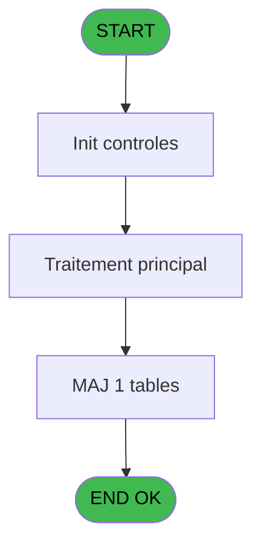

# REF IDE 730 - Saisie Signature

> **Analyse**: Phases 1-4 2026-02-03 14:00 -> 14:00 (17s) | Assemblage 14:00
> **Pipeline**: V7.2 Enrichi
> **Structure**: 4 onglets (Resume | Ecrans | Donnees | Connexions)

<!-- TAB:Resume -->

## 1. FICHE D'IDENTITE

| Attribut | Valeur |
|----------|--------|
| Projet | REF |
| IDE Position | 730 |
| Nom Programme | Saisie Signature |
| Fichier source | `Prg_730.xml` |
| Dossier IDE | General |
| Taches | 4 (1 ecrans visibles) |
| Tables modifiees | 1 |
| Programmes appeles | 1 |
| :warning: Statut | **ORPHELIN_POTENTIEL** |

## 2. DESCRIPTION FONCTIONNELLE

**Saisie Signature** assure la gestion complete de ce processus.

Le flux de traitement s'organise en **3 blocs fonctionnels** :

- **Traitement** (2 taches) : traitements metier divers
- **Consultation** (1 tache) : ecrans de recherche, selection et consultation
- **Saisie** (1 tache) : ecrans de saisie utilisateur (formulaires, champs, donnees)

**Donnees modifiees** : 1 tables en ecriture (email).

**Logique metier** : 3 regles identifiees couvrant conditions metier.

Detail : phases du traitement

#### Phase 1 : Saisie (1 tache)

- **730** - Saisie Signature **[[ECRAN]](#ecran-t1)**

#### Phase 2 : Traitement (2 taches)

- **730.1** - Recup email GM
- **730.3** - Recup Default Email

#### Phase 3 : Consultation (1 tache)

- **730.2** - Recup. choix offre Cial

Delegue a : [Recherche Adresse Mail (IDE 731)](REF-IDE-731.md)

#### Tables impactees

| Table | Operations | Role metier |
|-------|-----------|-------------|
| email | R/**W** (3 usages) |  |

## 3. BLOCS FONCTIONNELS

### 3.1 Saisie (1 tache)

L'operateur saisit les donnees de la transaction via 1 ecran (Saisie Signature).

---

#### 730 - Saisie Signature [[ECRAN]](#ecran-t1)

**Role** : Saisie des donnees : Saisie Signature.
**Ecran** : 1960 x 216 DLU (Modal) | [Voir mockup](#ecran-t1)
**Variables liees** : I (P.I. Signature,Email,VAD)

### 3.2 Traitement (2 taches)

Traitements internes.

---

#### 730.1 - Recup email GM

**Role** : Consultation/chargement : Recup email GM.
**Variables liees** : E (P.I.Email address), I (P.I. Signature,Email,VAD), K (P.I.Message email)

---

#### 730.3 - Recup Default Email

**Role** : Consultation/chargement : Recup Default Email.
**Variables liees** : E (P.I.Email address), I (P.I. Signature,Email,VAD), K (P.I.Message email)

### 3.3 Consultation (1 tache)

Ecrans de recherche et consultation.

---

#### 730.2 - Recup. choix offre Cial

**Role** : Selection par l'operateur : Recup. choix offre Cial.
**Delegue a** : [Recherche Adresse Mail (IDE 731)](REF-IDE-731.md)

## 5. REGLES METIER

3 regles identifiees:

### Autres (3 regles)

#### [RM-001] Si P.I.Receive-Recept ? [F] alors 'X' sinon '')

| Element | Detail |
|---------|--------|
| **Condition** | `P.I.Receive-Recept ? [F]` |
| **Si vrai** | 'X' |
| **Si faux** | '') |
| **Variables** | F (P.I.Receive-Recept ?) |
| **Expression source** | Expression 7 : `IF(P.I.Receive-Recept ? [F],'X','')` |
| **Exemple** | Si P.I.Receive-Recept ? [F] → 'X'. Sinon → '') |

#### [RM-002] Si P.i Insurance Selling [M] alors 'X' sinon '')

| Element | Detail |
|---------|--------|
| **Condition** | `P.i Insurance Selling [M]` |
| **Si vrai** | 'X' |
| **Si faux** | '') |
| **Variables** | M (P.i Insurance Selling) |
| **Expression source** | Expression 8 : `IF(P.i Insurance Selling [M],'X','')` |
| **Exemple** | Si P.i Insurance Selling [M] → 'X'. Sinon → '') |

#### [RM-003] Si v.Flag sortie ok [R] alors 'Paper Insurance Card' sinon 'Decline E-Receipt')

| Element | Detail |
|---------|--------|
| **Condition** | `v.Flag sortie ok [R]` |
| **Si vrai** | 'Paper Insurance Card' |
| **Si faux** | 'Decline E-Receipt') |
| **Variables** | R (v.Flag sortie ok) |
| **Expression source** | Expression 32 : `IF(v.Flag sortie ok [R],'Paper Insurance Card','Decline E-Re` |
| **Exemple** | Si v.Flag sortie ok [R] → 'Paper Insurance Card'. Sinon → 'Decline E-Receipt') |

## 6. CONTEXTE

- **Appele par**: (aucun)
- **Appelle**: 1 programmes | **Tables**: 1 (W:1 R:1 L:0) | **Taches**: 4 | **Expressions**: 39

<!-- TAB:Ecrans -->

## 8. ECRANS

### 8.1 Forms visibles (1 / 4)

| # | Position | Tache | Nom | Type | Largeur | Hauteur | Bloc |
|---|----------|-------|-----|------|---------|---------|------|
| 1 | 730 | 730 | Saisie Signature | Modal | 1960 | 216 | Saisie |

### 8.2 Mockups Ecrans

---

#### 730 - Saisie Signature
**Tache** : [730](#t1) | **Type** : Modal | **Dimensions** : 1960 x 216 DLU
**Bloc** : Saisie | **Titre IDE** : Saisie Signature

<!-- FORM-DATA:
{
    "width":  1960,
    "vFactor":  8,
    "type":  "Modal",
    "hFactor":  8,
    "controls":  [
                     {
                         "x":  1,
                         "type":  "label",
                         "var":  "",
                         "y":  1,
                         "w":  782,
                         "fmt":  "",
                         "name":  "",
                         "h":  24,
                         "color":  "186",
                         "text":  "Receipt Signature",
                         "parent":  null
                     },
                     {
                         "x":  209,
                         "type":  "label",
                         "var":  "",
                         "y":  5,
                         "w":  476,
                         "fmt":  "",
                         "name":  "",
                         "h":  17,
                         "color":  "189",
                         "text":  "Decline E-Receipt",
                         "parent":  null
                     },
                     {
                         "x":  0,
                         "type":  "label",
                         "var":  "",
                         "y":  26,
                         "w":  1959,
                         "fmt":  "",
                         "name":  "",
                         "h":  19,
                         "color":  "6",
                         "text":  "Signature  required  to validate purchase  /  Signature requise pour valider l\u0027achat",
                         "parent":  null
                     },
                     {
                         "x":  786,
                         "type":  "combobox",
                         "var":  "",
                         "y":  1,
                         "w":  1079,
                         "fmt":  "",
                         "name":  "p.Email address",
                         "h":  18,
                         "color":  "",
                         "text":  "",
                         "parent":  null
                     },
                     {
                         "x":  1882,
                         "type":  "button",
                         "var":  "",
                         "y":  1,
                         "w":  74,
                         "fmt":  "+",
                         "name":  "B Change",
                         "h":  24,
                         "color":  "",
                         "text":  "",
                         "parent":  null
                     },
                     {
                         "x":  694,
                         "type":  "checkbox",
                         "var":  "",
                         "y":  5,
                         "w":  48,
                         "fmt":  "",
                         "name":  "v.Receive-Recept ?",
                         "h":  17,
                         "color":  "",
                         "text":  "",
                         "parent":  null
                     },
                     {
                         "x":  0,
                         "type":  "edit",
                         "var":  "",
                         "y":  46,
                         "w":  1959,
                         "fmt":  "",
                         "name":  "Signature",
                         "h":  169,
                         "color":  "",
                         "text":  "",
                         "parent":  null
                     },
                     {
                         "x":  1657,
                         "type":  "button",
                         "var":  "",
                         "y":  189,
                         "w":  296,
                         "fmt":  "\u0026Erase Signature",
                         "name":  "B Erase",
                         "h":  24,
                         "color":  "",
                         "text":  "",
                         "parent":  null
                     }
                 ],
    "taskId":  "730",
    "height":  216
}
-->

<strong>Champs : 3 champs</strong>

| Pos (x,y) | Nom | Variable | Type |
|-----------|-----|----------|------|
| 786,1 | p.Email address | - | combobox |
| 694,5 | v.Receive-Recept ? | - | checkbox |
| 0,46 | Signature | - | edit |

<strong>Boutons : 2 boutons</strong>

| Bouton | Pos (x,y) | Action |
|--------|-----------|--------|
| + | 1882,1 | Bouton fonctionnel |
| Erase Signature | 1657,189 | Bouton fonctionnel |

## 9. NAVIGATION

Ecran unique: **Saisie Signature**

### 9.3 Structure hierarchique (4 taches)

| Position | Tache | Type | Dimensions | Bloc |
|----------|-------|------|------------|------|
| **730.1** | [**Saisie Signature** (730)](#t1) [mockup](#ecran-t1) | Modal | 1960x216 | Saisie |
| **730.2** | [**Recup email GM** (730.1)](#t2) | - | - | Traitement |
| 730.2.1 | [Recup Default Email (730.3)](#t4) | - | - | |
| **730.3** | [**Recup. choix offre Cial** (730.2)](#t3) | - | - | Consultation |

### 9.4 Algorigramme

> **Legende**: Vert = START/END OK | Rouge = END KO | Bleu = Decisions
> *Algorigramme auto-genere. Utiliser `/algorigramme` pour une synthese metier detaillee.*

<!-- TAB:Donnees -->

## 10. TABLES

### Tables utilisees (1)

| ID | Nom | Description | Type | R | W | L | Usages |
|----|-----|-------------|------|---|---|---|--------|
| 285 | email |  | DB | R | **W** |   | 3 |

### Colonnes par table (1 / 1 tables avec colonnes identifiees)

Table 285 - email (R/**W**) - 3 usages

| Lettre | Variable | Acces | Type |
|--------|----------|-------|------|
| A | 1er Email | W | Unicode |
| B | P.I.email adress | W | Alpha |

## 11. VARIABLES

### 11.1 Parametres entrants (14)

Variables recues en parametre.

| Lettre | Nom | Type | Usage dans |
|--------|-----|------|-----------|
| A | P.I.Ste | Alpha | 1x parametre entrant |
| B | P.I.Compte | Numeric | 3x parametre entrant |
| C | P.I.Filiation | Numeric | 1x parametre entrant |
| D | P.I.Filename | Alpha | 1x parametre entrant |
| E | P.I.Email address | Alpha | 6x parametre entrant |
| F | P.I.Receive-Recept ? | Logical | 2x parametre entrant |
| G | P.I.Continue | Logical | 1x parametre entrant |
| H | P.I.nb strokes | Alpha | - |
| I | P.I. Signature,Email,VAD | Alpha | 9x parametre entrant |
| J | P.Io. Refus Envoi mail | Logical | - |
| K | P.I.Message email | Alpha | [730.1](#t2), [730.3](#t4) |
| L | P.I.o Refus envoi mail inactif | Logical | - |
| M | P.i Insurance Selling | Logical | 8x parametre entrant |
| N | P.o.Paper Reason | Unicode | 3x parametre entrant |

### 11.2 Variables de session (6)

Variables persistantes pendant toute la session.

| Lettre | Nom | Type | Usage dans |
|--------|-----|------|-----------|
| O | v.Refus_Mail | Logical | - |
| P | v.InkPicture1 | Blob | 3x session |
| Q | v.Envoi | Logical | 1x session |
| R | v.Flag sortie ok | Logical | 7x session |
| S | v.Retour message | Numeric | - |
| T | v.paper card reason | Unicode | 2x session |

Toutes les 20 variables (liste complete)

| Cat | Lettre | Nom Variable | Type |
|-----|--------|--------------|------|
| P0 | **A** | P.I.Ste | Alpha |
| P0 | **B** | P.I.Compte | Numeric |
| P0 | **C** | P.I.Filiation | Numeric |
| P0 | **D** | P.I.Filename | Alpha |
| P0 | **E** | P.I.Email address | Alpha |
| P0 | **F** | P.I.Receive-Recept ? | Logical |
| P0 | **G** | P.I.Continue | Logical |
| P0 | **H** | P.I.nb strokes | Alpha |
| P0 | **I** | P.I. Signature,Email,VAD | Alpha |
| P0 | **J** | P.Io. Refus Envoi mail | Logical |
| P0 | **K** | P.I.Message email | Alpha |
| P0 | **L** | P.I.o Refus envoi mail inactif | Logical |
| P0 | **M** | P.i Insurance Selling | Logical |
| P0 | **N** | P.o.Paper Reason | Unicode |
| V. | **O** | v.Refus_Mail | Logical |
| V. | **P** | v.InkPicture1 | Blob |
| V. | **Q** | v.Envoi | Logical |
| V. | **R** | v.Flag sortie ok | Logical |
| V. | **S** | v.Retour message | Numeric |
| V. | **T** | v.paper card reason | Unicode |

## 12. EXPRESSIONS

**39 / 39 expressions decodees (100%)**

### 12.1 Repartition par type

| Type | Expressions | Regles |
|------|-------------|--------|
| CONCATENATION | 1 | 0 |
| CONDITION | 14 | 3 |
| FORMAT | 3 | 0 |
| CONSTANTE | 4 | 0 |
| OTHER | 11 | 0 |
| CAST_LOGIQUE | 2 | 0 |
| NEGATION | 3 | 0 |
| STRING | 1 | 0 |

### 12.2 Expressions cles par type

#### CONCATENATION (1 expressions)

| Type | IDE | Expression | Regle |
|------|-----|------------|-------|
| CONCATENATION | 3 | `'cmd /c mkdir '&Translate ('%club_exportdata%')&'Ticket\images\'` | - |

#### CONDITION (14 expressions)

| Type | IDE | Expression | Regle |
|------|-----|------------|-------|
| CONDITION | 32 | `IF(v.Flag sortie ok [R],'Paper Insurance Card','Decline E-Receipt')` | [RM-003](#rm-RM-003) |
| CONDITION | 8 | `IF(P.i Insurance Selling [M],'X','')` | [RM-002](#rm-RM-002) |
| CONDITION | 7 | `IF(P.I.Receive-Recept ? [F],'X','')` | [RM-001](#rm-RM-001) |
| CONDITION | 30 | `P.I. Signature,Email,VAD [I]='V' AND P.I.Email address [E]<>''` | - |
| CONDITION | 29 | `P.I. Signature,Email,VAD [I]='V'` | - |
| ... | | *+9 autres* | |

#### FORMAT (3 expressions)

| Type | IDE | Expression | Regle |
|------|-----|------------|-------|
| FORMAT | 18 | `InStr('EV',P.I. Signature,Email,VAD [I])<>0 OR Val(P.o.Paper Reason [N].Ink.Strokes.Count.ToString(),'##')>0` | - |
| FORMAT | 4 | `InStr('EV',P.I. Signature,Email,VAD [I])=0 AND NOT(FileExist(Translate ('%club_exportdata%')&'Ticket\images\'))` | - |
| FORMAT | 13 | `CASE(P.I. Signature,Email,VAD [I],'S','P.I.Filiation [C]'FORM,'E','P.I.Filename [D]'FORM,'V','P.I.Email address [E]'FORM,'P.I.Compte [B]'FORM)` | - |

#### CONSTANTE (4 expressions)

| Type | IDE | Expression | Regle |
|------|-----|------------|-------|
| CONSTANTE | 33 | `'TAGIC'` | - |
| CONSTANTE | 34 | `'G'` | - |
| CONSTANTE | 16 | `''` | - |
| CONSTANTE | 31 | `'M'` | - |

#### OTHER (11 expressions)

| Type | IDE | Expression | Regle |
|------|-----|------------|-------|
| OTHER | 26 | `v.InkPicture1 [P]` | - |
| OTHER | 21 | `P.i Insurance Selling [M]` | - |
| OTHER | 35 | `v.Flag sortie ok [R] AND P.i Insurance Selling [M]` | - |
| OTHER | 37 | `v.Flag sortie ok [R]` | - |
| OTHER | 36 | `v.paper card reason [T]` | - |
| ... | | *+6 autres* | |

#### CAST_LOGIQUE (2 expressions)

| Type | IDE | Expression | Regle |
|------|-----|------------|-------|
| CAST_LOGIQUE | 15 | `'TRUE'LOG` | - |
| CAST_LOGIQUE | 5 | `'FALSE'LOG` | - |

#### NEGATION (3 expressions)

| Type | IDE | Expression | Regle |
|------|-----|------------|-------|
| NEGATION | 27 | `NOT P.I.o Refus envoi mail... [L]` | - |
| NEGATION | 19 | `NOT P.i Insurance Selling [M]` | - |
| NEGATION | 9 | `NOT P.I.Receive-Recept ? [F]` | - |

#### STRING (1 expressions)

| Type | IDE | Expression | Regle |
|------|-----|------------|-------|
| STRING | 23 | `Trim(P.I.Message email [K])` | - |

### 12.3 Toutes les expressions (39)

Voir les 39 expressions

#### CONCATENATION (1)

| IDE | Expression Decodee |
|-----|-------------------|
| 3 | `'cmd /c mkdir '&Translate ('%club_exportdata%')&'Ticket\images\'` |

#### CONDITION (14)

| IDE | Expression Decodee |
|-----|-------------------|
| 7 | `IF(P.I.Receive-Recept ? [F],'X','')` |
| 8 | `IF(P.i Insurance Selling [M],'X','')` |
| 32 | `IF(v.Flag sortie ok [R],'Paper Insurance Card','Decline E-Receipt')` |
| 12 | `P.I.Ste [A]<>'' AND P.I.Compte [B]<>0 AND P.I.Email address [E]='' AND P.I. Signature,Email,VAD [I]<>'' AND NOT(v.Flag sortie ok [R])` |
| 14 | `P.I. Signature,Email,VAD [I]<>'' AND NOT v.InkPicture1 [P]` |
| 22 | `P.i Insurance Selling [M] AND P.I. Signature,Email,VAD [I]<>'V'` |
| 24 | `P.I.Message email [K]<>'' AND NOT P.i Insurance Selling [M] AND P.I.Email address [E]='' AND NOT(v.Flag sortie ok [R])` |
| 25 | `v.Envoi [Q]=6` |
| 28 | `P.I.Email address [E]<>''` |
| 29 | `P.I. Signature,Email,VAD [I]='V'` |
| 30 | `P.I. Signature,Email,VAD [I]='V' AND P.I.Email address [E]<>''` |
| 17 | `P.I. Signature,Email,VAD [I]='S' AND Val(P.o.Paper Reason [N].Ink.Strokes.Count.ToString(),'##')<=0` |
| 38 | `v.Flag sortie ok [R]  AND NOT(P.i Insurance Selling [M]) AND Trim(P.I.Email address [E])=''` |
| 39 | `v.Flag sortie ok [R] AND P.i Insurance Selling [M] AND Trim(v.paper card reason [T])=''` |

#### FORMAT (3)

| IDE | Expression Decodee |
|-----|-------------------|
| 13 | `CASE(P.I. Signature,Email,VAD [I],'S','P.I.Filiation [C]'FORM,'E','P.I.Filename [D]'FORM,'V','P.I.Email address [E]'FORM,'P.I.Compte [B]'FORM)` |
| 4 | `InStr('EV',P.I. Signature,Email,VAD [I])=0 AND NOT(FileExist(Translate ('%club_exportdata%')&'Ticket\images\'))` |
| 18 | `InStr('EV',P.I. Signature,Email,VAD [I])<>0 OR Val(P.o.Paper Reason [N].Ink.Strokes.Count.ToString(),'##')>0` |

#### CONSTANTE (4)

| IDE | Expression Decodee |
|-----|-------------------|
| 16 | `''` |
| 31 | `'M'` |
| 33 | `'TAGIC'` |
| 34 | `'G'` |

#### OTHER (11)

| IDE | Expression Decodee |
|-----|-------------------|
| 1 | `P.I.Continue [G]` |
| 2 | `SetCrsr(1)` |
| 6 | `SetCrsr(2)` |
| 10 | `P.o.Paper Reason [N].Ink.Strokes.Count.ToString()` |
| 11 | `P.I.Compte [B]` |
| 20 | `v.InkPicture1 [P]` |
| 21 | `P.i Insurance Selling [M]` |
| 26 | `v.InkPicture1 [P]` |
| 35 | `v.Flag sortie ok [R] AND P.i Insurance Selling [M]` |
| 36 | `v.paper card reason [T]` |
| 37 | `v.Flag sortie ok [R]` |

#### CAST_LOGIQUE (2)

| IDE | Expression Decodee |
|-----|-------------------|
| 5 | `'FALSE'LOG` |
| 15 | `'TRUE'LOG` |

#### NEGATION (3)

| IDE | Expression Decodee |
|-----|-------------------|
| 9 | `NOT P.I.Receive-Recept ? [F]` |
| 19 | `NOT P.i Insurance Selling [M]` |
| 27 | `NOT P.I.o Refus envoi mail... [L]` |

#### STRING (1)

| IDE | Expression Decodee |
|-----|-------------------|
| 23 | `Trim(P.I.Message email [K])` |

<!-- TAB:Connexions -->

## 13. GRAPHE D'APPELS

### 13.1 Chaine depuis Main (Callers)

**Chemin**: (pas de callers directs)

### 13.2 Callers

| IDE | Nom Programme | Nb Appels |
|-----|---------------|-----------|
| - | (aucun) | - |

### 13.3 Callees (programmes appeles)

### 13.4 Detail Callees avec contexte

| IDE | Nom Programme | Appels | Contexte |
|-----|---------------|--------|----------|
| [731](REF-IDE-731.md) | Recherche Adresse Mail | 1 | Sous-programme |

## 14. RECOMMANDATIONS MIGRATION

### 14.1 Profil du programme

| Metrique | Valeur | Impact migration |
|----------|--------|-----------------|
| Lignes de logique | 100 | Programme compact |
| Expressions | 39 | Peu de logique |
| Tables WRITE | 1 | Impact faible |
| Sous-programmes | 1 | Peu de dependances |
| Ecrans visibles | 1 | Ecran unique ou traitement batch |
| Code desactive | 0% (0 / 100) | Code sain |
| Regles metier | 3 | Quelques regles a preserver |

### 14.2 Plan de migration par bloc

#### Saisie (1 tache: 1 ecran, 0 traitement)

- **Strategie** : Formulaire React/Blazor avec validation Zod/FluentValidation.
- Reproduire 1 ecran : Saisie Signature
- Validation temps reel cote client + serveur

#### Traitement (2 taches: 0 ecran, 2 traitements)

- **Strategie** : 2 service(s) backend injectable(s) (Domain Services).
- 1 sous-programme(s) a migrer ou a reutiliser depuis les services existants.
- Decomposer les taches en services unitaires testables.

#### Consultation (1 tache: 0 ecran, 1 traitement)

- **Strategie** : Composants de recherche/selection en modales.

### 14.3 Dependances critiques

| Dependance | Type | Appels | Impact |
|------------|------|--------|--------|
| email | Table WRITE (Database) | 1x | Schema + repository |
| [Recherche Adresse Mail (IDE 731)](REF-IDE-731.md) | Sous-programme | 1x | Normale - Sous-programme |

---
*Spec DETAILED generee par Pipeline V7.2 - 2026-02-03 14:00*
