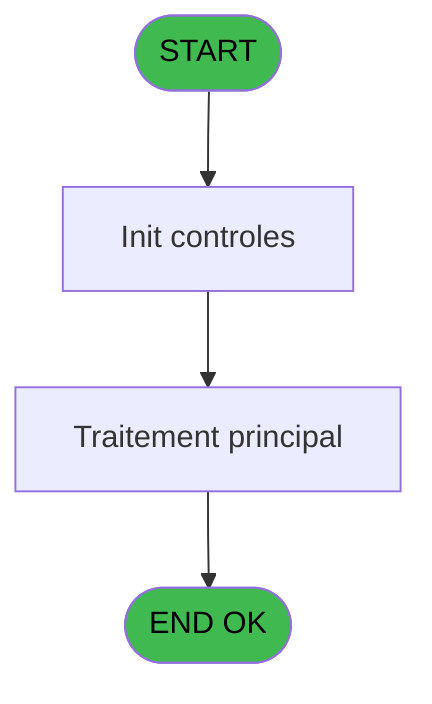

# REF IDE 734 - Trace Modification package

> **Analyse**: Phases 1-4 2026-02-03 14:02 -> 14:02 (16s) | Assemblage 14:02
> **Pipeline**: V7.2 Enrichi
> **Structure**: 4 onglets (Resume | Ecrans | Donnees | Connexions)

<!-- TAB:Resume -->

## 1. FICHE D'IDENTITE

| Attribut | Valeur |
|----------|--------|
| Projet | REF |
| IDE Position | 734 |
| Nom Programme | Trace Modification package |
| Fichier source | `Prg_734.xml` |
| Dossier IDE | General |
| Taches | 1 (0 ecrans visibles) |
| Tables modifiees | 0 |
| Programmes appeles | 0 |

## 2. DESCRIPTION FONCTIONNELLE

**Trace Modification package** assure la gestion complete de ce processus, accessible depuis [Stock - Sale/Cancel (IDE 732)](REF-IDE-732.md).

Le flux de traitement s'organise en **1 blocs fonctionnels** :

- **Traitement** (1 tache) : traitements metier divers

## 3. BLOCS FONCTIONNELS

### 3.1 Traitement (1 tache)

Traitements internes.

---

#### 734 - Trace Modification package

**Role** : Traitement : Trace Modification package.

## 5. REGLES METIER

*(Aucune regle metier identifiee)*

## 6. CONTEXTE

- **Appele par**: [Stock - Sale/Cancel (IDE 732)](REF-IDE-732.md)
- **Appelle**: 0 programmes | **Tables**: 2 (W:0 R:1 L:1) | **Taches**: 1 | **Expressions**: 10

<!-- TAB:Ecrans -->

## 8. ECRANS

*(Programme sans ecran visible)*

## 9. NAVIGATION

### 9.3 Structure hierarchique (1 tache)

| Position | Tache | Type | Dimensions | Bloc |
|----------|-------|------|------------|------|
| **734.1** | [**Trace Modification package** (734)](#t1) | - | - | Traitement |

### 9.4 Algorigramme

> **Legende**: Vert = START/END OK | Rouge = END KO | Bleu = Decisions
> *Algorigramme auto-genere. Utiliser `/algorigramme` pour une synthese metier detaillee.*

<!-- TAB:Donnees -->

## 10. TABLES

### Tables utilisees (2)

| ID | Nom | Description | Type | R | W | L | Usages |
|----|-----|-------------|------|---|---|---|--------|
| 399 | pv_package_price |  | DB | R |   |   | 1 |
| 764 | trace_modif_package |  | DB |   |   | L | 1 |

### Colonnes par table (2 / 1 tables avec colonnes identifiees)

Table 399 - pv_package_price (R) - 1 usages

| Lettre | Variable | Acces | Type |
|--------|----------|-------|------|
| A | P.Type modif | R | Alpha |
| B | P.Cat new | R | Numeric |
| C | P.Subcat new | R | Numeric |
| D | P.Prod_id new | R | Numeric |
| E | P.Ordre new | R | Numeric |
| F | P.Label new | R | Alpha |
| G | P.Number_days new | R | Numeric |
| H | P.Prix de vente new | R | Numeric |
| I | P.block free new | R | Logical |
| J | P.block discount new | R | Logical |
| K | P.Tampon new | R | Alpha |
| L | P.Service new | R | Alpha |
| M | P.Code article new | R | Alpha |
| N | P.Prix achat new | R | Numeric |
| O | P.Art non gere en stock new | R | Logical |
| P | P.Art_qte_en_stock new | R | Numeric |
| Q | P.Art unit vente new | R | Alpha |
| R | P.Art TVA new | R | Numeric |
| S | P.Art volume vendu new | R | Numeric |
| T | P.Art decimales new | R | Numeric |
| U | P.Art volume achat new | R | Numeric |
| V | P.Art prix achat bottle new | R | Numeric |
| W | P.Art logique 1 new | R | Logical |
| X | P.Art logique 2 new | R | Logical |
| Y | P.Art actif | R | Unicode |

## 11. VARIABLES

### 11.1 Parametres entrants (25)

Variables recues du programme appelant ([Stock - Sale/Cancel (IDE 732)](REF-IDE-732.md)).

| Lettre | Nom | Type | Usage dans |
|--------|-----|------|-----------|
| A | P.Type modif | Alpha | [734](#t1) |
| B | P.Cat new | Numeric | 1x parametre entrant |
| C | P.Subcat new | Numeric | 1x parametre entrant |
| D | P.Prod_id new | Numeric | 1x parametre entrant |
| E | P.Ordre new | Numeric | 1x parametre entrant |
| F | P.Label new | Alpha | 1x parametre entrant |
| G | P.Number_days new | Numeric | 1x parametre entrant |
| H | P.Prix de vente new | Numeric | 1x parametre entrant |
| I | P.block free new | Logical | 1x parametre entrant |
| J | P.block discount new | Logical | 1x parametre entrant |
| K | P.Tampon new | Alpha | 1x parametre entrant |
| L | P.Service new | Alpha | 1x parametre entrant |
| M | P.Code article new | Alpha | 1x parametre entrant |
| N | P.Prix achat new | Numeric | 1x parametre entrant |
| O | P.Art non gere en stock new | Logical | - |
| P | P.Art_qte_en_stock new | Numeric | 1x parametre entrant |
| Q | P.Art unit vente new | Alpha | 1x parametre entrant |
| R | P.Art TVA new | Numeric | 1x parametre entrant |
| S | P.Art volume vendu new | Numeric | 1x parametre entrant |
| T | P.Art decimales new | Numeric | 1x parametre entrant |
| U | P.Art volume achat new | Numeric | 1x parametre entrant |
| V | P.Art prix achat bottle new | Numeric | - |
| W | P.Art logique 1 new | Logical | 1x parametre entrant |
| X | P.Art logique 2 new | Logical | 1x parametre entrant |
| Y | P.Art actif | Unicode | 1x parametre entrant |

Toutes les 25 variables (liste complete)

| Cat | Lettre | Nom Variable | Type |
|-----|--------|--------------|------|
| P0 | **A** | P.Type modif | Alpha |
| P0 | **B** | P.Cat new | Numeric |
| P0 | **C** | P.Subcat new | Numeric |
| P0 | **D** | P.Prod_id new | Numeric |
| P0 | **E** | P.Ordre new | Numeric |
| P0 | **F** | P.Label new | Alpha |
| P0 | **G** | P.Number_days new | Numeric |
| P0 | **H** | P.Prix de vente new | Numeric |
| P0 | **I** | P.block free new | Logical |
| P0 | **J** | P.block discount new | Logical |
| P0 | **K** | P.Tampon new | Alpha |
| P0 | **L** | P.Service new | Alpha |
| P0 | **M** | P.Code article new | Alpha |
| P0 | **N** | P.Prix achat new | Numeric |
| P0 | **O** | P.Art non gere en stock new | Logical |
| P0 | **P** | P.Art_qte_en_stock new | Numeric |
| P0 | **Q** | P.Art unit vente new | Alpha |
| P0 | **R** | P.Art TVA new | Numeric |
| P0 | **S** | P.Art volume vendu new | Numeric |
| P0 | **T** | P.Art decimales new | Numeric |
| P0 | **U** | P.Art volume achat new | Numeric |
| P0 | **V** | P.Art prix achat bottle new | Numeric |
| P0 | **W** | P.Art logique 1 new | Logical |
| P0 | **X** | P.Art logique 2 new | Logical |
| P0 | **Y** | P.Art actif | Unicode |

## 12. EXPRESSIONS

**10 / 10 expressions decodees (100%)**

### 12.1 Repartition par type

| Type | Expressions | Regles |
|------|-------------|--------|
| DATE | 1 | 0 |
| OTHER | 6 | 0 |
| REFERENCE_VG | 1 | 0 |
| FORMAT | 2 | 0 |

### 12.2 Expressions cles par type

#### DATE (1 expressions)

| Type | IDE | Expression | Regle |
|------|-----|------------|-------|
| DATE | 6 | `Date()` | - |

#### OTHER (6 expressions)

| Type | IDE | Expression | Regle |
|------|-----|------------|-------|
| OTHER | 4 | `P.Subcat new [C]` | - |
| OTHER | 5 | `P.Prod_id new [D]` | - |
| OTHER | 7 | `Time()` | - |
| OTHER | 1 | `GetParam('SERVICE')` | - |
| OTHER | 2 | `P.Type modif [A]` | - |
| ... | | *+1 autres* | |

#### REFERENCE_VG (1 expressions)

| Type | IDE | Expression | Regle |
|------|-----|------------|-------|
| REFERENCE_VG | 8 | `VG1` | - |

#### FORMAT (2 expressions)

| Type | IDE | Expression | Regle |
|------|-----|------------|-------|
| FORMAT | 10 | `Trim(Str([AD],'2P0'))&';'&Trim([AE])&';'&Trim(Str([AF],'3.1'))&';'&Trim(Str([AG],'N12.3C'))&';'&Trim(IF([AH],'O','N'))&';'&Trim(IF([AI],'O','N'))&';'&Trim([AJ])&';'&Trim([Z])&';'&Trim([AK])&';'&Trim(Str([AL],'N12.3C'))&';'&Trim(IF([AM],'O','N'))&';'&Trim(Str([AN],'N9.3'))&';'&Trim([AO])&';'&Trim(Str([AP],'#2.#'))&';'&Trim(Str([AQ],'6.6'))&';'&Trim(Str([AR],'#'))&';'&Trim(Str([AS],'6.6'))&';'&Trim(Str([AT],'N12.3C'))&';'&Trim(IF([AU],'O','N'))&';'&Trim(IF([AV],'O','N'))&';'&IF([AW]='O','O','N')` | - |
| FORMAT | 9 | `Trim(Str(P.Ordre new [E],'2P0'))&';'&Trim(P.Label new [F])&';'&Trim(Str(P.Number_days new [G],'3.1'))&';'&Trim(Str(P.Prix de vente new [H],'N12.3C'))&';'&Trim(IF(P.block free new [I],'O','N'))&';'&Trim(IF(P.block discount new [J],'O','N'))&';'&Trim(P.Tampon new [K])&';'&Trim(P.Service new [L])&';'&Trim(P.Code article new [M])&';'&Trim(Str(P.Prix achat new [N],'N12.3C'))&';'&Trim(IF(P.Art non gere en stoc... [O],'O','N'))&';'&Trim(Str(P.Art_qte_en_stock new [P],'N9.3'))&';'&Trim(P.Art unit vente new [Q])&';'&Trim(Str(P.Art TVA new [R],'#2.#'))&';'&Trim(Str(P.Art volume vendu new [S],'6.6'))&';'&Trim(Str(P.Art decimales new [T],'#'))&';'&Trim(Str(P.Art volume achat new [U],'6.6'))&';'&Trim(Str(P.Art prix achat bottl... [V],'N12.3C'))&';'&Trim(IF(P.Art logique 1 new [W],'O','N'))&';'&Trim(IF(P.Art logique 2 new [X],'O','N'))&';'&IF(P.Art actif [Y]='O','O','N')` | - |

<!-- TAB:Connexions -->

## 13. GRAPHE D'APPELS

### 13.1 Chaine depuis Main (Callers)

Main -> ... -> [Stock - Sale/Cancel (IDE 732)](REF-IDE-732.md) -> **Trace Modification package (IDE 734)**

### 13.2 Callers

| IDE | Nom Programme | Nb Appels |
|-----|---------------|-----------|
| [732](REF-IDE-732.md) | Stock - Sale/Cancel | 2 |

### 13.3 Callees (programmes appeles)

### 13.4 Detail Callees avec contexte

| IDE | Nom Programme | Appels | Contexte |
|-----|---------------|--------|----------|
| - | (aucun) | - | - |

## 14. RECOMMANDATIONS MIGRATION

### 14.1 Profil du programme

| Metrique | Valeur | Impact migration |
|----------|--------|-----------------|
| Lignes de logique | 65 | Programme compact |
| Expressions | 10 | Peu de logique |
| Tables WRITE | 0 | Impact faible |
| Sous-programmes | 0 | Peu de dependances |
| Ecrans visibles | 0 | Ecran unique ou traitement batch |
| Code desactive | 0% (0 / 65) | Code sain |
| Regles metier | 0 | Pas de regle identifiee |

### 14.2 Plan de migration par bloc

#### Traitement (1 tache: 0 ecran, 1 traitement)

- **Strategie** : 1 service(s) backend injectable(s) (Domain Services).
- Decomposer les taches en services unitaires testables.

### 14.3 Dependances critiques

| Dependance | Type | Appels | Impact |
|------------|------|--------|--------|

---
*Spec DETAILED generee par Pipeline V7.2 - 2026-02-03 14:02*
