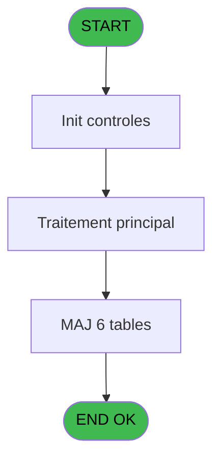
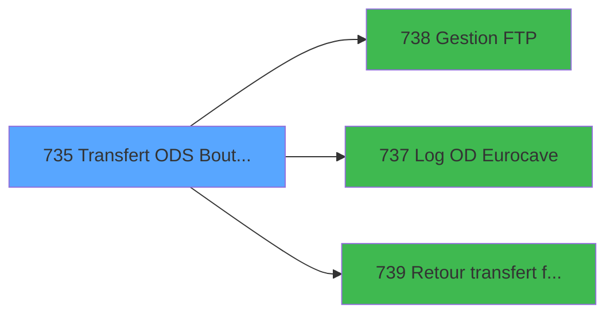

# REF IDE 735 - Transfert ODS Boutique

> **Analyse**: Phases 1-4 2026-02-03 14:02 -> 14:02 (18s) | Assemblage 14:02
> **Pipeline**: V7.2 Enrichi
> **Structure**: 4 onglets (Resume | Ecrans | Donnees | Connexions)

<!-- TAB:Resume -->

## 1. FICHE D'IDENTITE

| Attribut | Valeur |
|----------|--------|
| Projet | REF |
| IDE Position | 735 |
| Nom Programme | Transfert ODS Boutique |
| Fichier source | `Prg_735.xml` |
| Dossier IDE | General |
| Taches | 20 (1 ecrans visibles) |
| Tables modifiees | 6 |
| Programmes appeles | 3 |
| :warning: Statut | **ORPHELIN_POTENTIEL** |

## 2. DESCRIPTION FONCTIONNELLE

**Transfert ODS Boutique** assure la gestion complete de ce processus.

Le flux de traitement s'organise en **4 blocs fonctionnels** :

- **Traitement** (10 taches) : traitements metier divers
- **Creation** (6 taches) : insertion d'enregistrements en base (mouvements, prestations)
- **Transfert** (3 taches) : transferts de donnees entre modules ou deversements
- **Calcul** (1 tache) : calculs de montants, stocks ou compteurs

**Donnees modifiees** : 6 tables en ecriture (reseau_cloture___rec, comptable_gratuite, comptable________cte, intermed__gratuititg, log_eurocave, erreurs_retail).

Detail : phases du traitement

#### Phase 1 : Transfert (3 taches)

- **735** - Transfert ODS Boutique ok
- **735.1.1** - CB Transfert ODS boutique **[[ECRAN]](#ecran-t3)**
- **735.7** - Transfert FTP

Delegue a : [ Retour transfert fichier (IDE 739)](REF-IDE-739.md)

#### Phase 2 : Traitement (10 taches)

- **735.1** - Please wait ... **[[ECRAN]](#ecran-t2)**
- **735.1.1.1** - Veuillez patienter... **[[ECRAN]](#ecran-t4)**
- **735.1.1.1.5** - View **[[ECRAN]](#ecran-t9)**
- **735.2** - prepare boutique file **[[ECRAN]](#ecran-t12)**
- **735.2.1** - view
- **735.3** - Test si cloture en cours
- **735.3.1** - Blocage cloture v1
- **735.3.2** - Blocage cloture v1
- **735.4** - Deblocage cloture v1
- **735.5** - Deblocage cloture v1

Delegue a : [Gestion FTP (IDE 738)](REF-IDE-738.md), [Log OD Eurocave (IDE 737)](REF-IDE-737.md)

#### Phase 3 : Creation (6 taches)

- **735.1.1.1.1** - Creation OD boutique
- **735.1.1.1.2** - Creation OD boutique
- **735.1.1.1.3** - Creation d'un O.D
- **735.1.1.1.4** - Creation d'un O.D
- **735.1.1.2** - Create Err
- **735.1.1.3** - Create Err

#### Phase 4 : Calcul (1 tache)

- **735.6** - Lecture date comptable

#### Tables impactees

| Table | Operations | Role metier |
|-------|-----------|-------------|
| reseau_cloture___rec | R/**W** (5 usages) | Donnees reseau/cloture |
| intermed__gratuititg | **W** (1 usages) |  |
| log_eurocave | **W** (1 usages) |  |
| comptable_gratuite | **W** (1 usages) |  |
| erreurs_retail | **W** (1 usages) |  |
| comptable________cte | **W** (1 usages) |  |

## 3. BLOCS FONCTIONNELS

### 3.1 Transfert (3 taches)

Transfert de donnees entre modules.

---

#### 735 - Transfert ODS Boutique ok

**Role** : Transfert de donnees : Transfert ODS Boutique ok.
**Delegue a** : [ Retour transfert fichier (IDE 739)](REF-IDE-739.md)

---

#### 735.1.1 - CB Transfert ODS boutique [[ECRAN]](#ecran-t3)

**Role** : Transfert de donnees : CB Transfert ODS boutique.
**Ecran** : 200 x 108 DLU (MDI) | [Voir mockup](#ecran-t3)
**Delegue a** : [ Retour transfert fichier (IDE 739)](REF-IDE-739.md)

---

#### 735.7 - Transfert FTP

**Role** : Transfert de donnees : Transfert FTP.
**Delegue a** : [ Retour transfert fichier (IDE 739)](REF-IDE-739.md)

### 3.2 Traitement (10 taches)

Traitements internes.

---

#### 735.1 - Please wait ... [[ECRAN]](#ecran-t2)

**Role** : Traitement : Please wait ....
**Ecran** : 426 x 56 DLU (MDI) | [Voir mockup](#ecran-t2)
**Delegue a** : [Gestion FTP (IDE 738)](REF-IDE-738.md), [Log OD Eurocave (IDE 737)](REF-IDE-737.md)

---

#### 735.1.1.1 - Veuillez patienter... [[ECRAN]](#ecran-t4)

**Role** : Traitement : Veuillez patienter....
**Ecran** : 768 x 172 DLU (MDI) | [Voir mockup](#ecran-t4)
**Delegue a** : [Gestion FTP (IDE 738)](REF-IDE-738.md), [Log OD Eurocave (IDE 737)](REF-IDE-737.md)

---

#### 735.1.1.1.5 - View [[ECRAN]](#ecran-t9)

**Role** : Traitement : View.
**Ecran** : 710 x 204 DLU (MDI) | [Voir mockup](#ecran-t9)
**Delegue a** : [Gestion FTP (IDE 738)](REF-IDE-738.md), [Log OD Eurocave (IDE 737)](REF-IDE-737.md)

---

#### 735.2 - prepare boutique file [[ECRAN]](#ecran-t12)

**Role** : Traitement : prepare boutique file.
**Ecran** : 273 x 58 DLU (MDI) | [Voir mockup](#ecran-t12)
**Delegue a** : [Gestion FTP (IDE 738)](REF-IDE-738.md), [Log OD Eurocave (IDE 737)](REF-IDE-737.md)

---

#### 735.2.1 - view

**Role** : Traitement : view.
**Delegue a** : [Gestion FTP (IDE 738)](REF-IDE-738.md), [Log OD Eurocave (IDE 737)](REF-IDE-737.md)

---

#### 735.3 - Test si cloture en cours

**Role** : Verification : Test si cloture en cours.
**Variables liees** : E (v. retour cloture), F (v. operation durant cloture)
**Delegue a** : [Gestion FTP (IDE 738)](REF-IDE-738.md), [Log OD Eurocave (IDE 737)](REF-IDE-737.md)

---

#### 735.3.1 - Blocage cloture v1

**Role** : Traitement : Blocage cloture v1.
**Variables liees** : E (v. retour cloture), F (v. operation durant cloture)
**Delegue a** : [Gestion FTP (IDE 738)](REF-IDE-738.md), [Log OD Eurocave (IDE 737)](REF-IDE-737.md)

---

#### 735.3.2 - Blocage cloture v1

**Role** : Traitement : Blocage cloture v1.
**Variables liees** : E (v. retour cloture), F (v. operation durant cloture)
**Delegue a** : [Gestion FTP (IDE 738)](REF-IDE-738.md), [Log OD Eurocave (IDE 737)](REF-IDE-737.md)

---

#### 735.4 - Deblocage cloture v1

**Role** : Traitement : Deblocage cloture v1.
**Variables liees** : E (v. retour cloture), F (v. operation durant cloture)
**Delegue a** : [Gestion FTP (IDE 738)](REF-IDE-738.md), [Log OD Eurocave (IDE 737)](REF-IDE-737.md)

---

#### 735.5 - Deblocage cloture v1

**Role** : Traitement : Deblocage cloture v1.
**Variables liees** : E (v. retour cloture), F (v. operation durant cloture)
**Delegue a** : [Gestion FTP (IDE 738)](REF-IDE-738.md), [Log OD Eurocave (IDE 737)](REF-IDE-737.md)

### 3.3 Creation (6 taches)

Insertion de nouveaux enregistrements en base.

---

#### 735.1.1.1.1 - Creation OD boutique

**Role** : Creation d'enregistrement : Creation OD boutique.

---

#### 735.1.1.1.2 - Creation OD boutique

**Role** : Creation d'enregistrement : Creation OD boutique.

---

#### 735.1.1.1.3 - Creation d'un O.D

**Role** : Creation d'enregistrement : Creation d'un O.D.

---

#### 735.1.1.1.4 - Creation d'un O.D

**Role** : Creation d'enregistrement : Creation d'un O.D.

---

#### 735.1.1.2 - Create Err

**Role** : Traitement : Create Err.

---

#### 735.1.1.3 - Create Err

**Role** : Traitement : Create Err.

### 3.4 Calcul (1 tache)

Calculs metier : montants, stocks, compteurs.

---

#### 735.6 - Lecture date comptable

**Role** : Traitement : Lecture date comptable.
**Variables liees** : A (> P date comptable), K (W1 date depart)

## 5. REGLES METIER

*(Aucune regle metier identifiee)*

## 6. CONTEXTE

- **Appele par**: (aucun)
- **Appelle**: 3 programmes | **Tables**: 16 (W:6 R:5 L:7) | **Taches**: 20 | **Expressions**: 16

<!-- TAB:Ecrans -->

## 8. ECRANS

### 8.1 Forms visibles (1 / 20)

| # | Position | Tache | Nom | Type | Largeur | Hauteur | Bloc |
|---|----------|-------|-----|------|---------|---------|------|
| 1 | 735.1.1.1.5 | 735.1.1.1.5 | View | MDI | 710 | 204 | Traitement |

### 8.2 Mockups Ecrans

---

#### 735.1.1.1.5 - View
**Tache** : [735.1.1.1.5](#t9) | **Type** : MDI | **Dimensions** : 710 x 204 DLU
**Bloc** : Traitement | **Titre IDE** : View

<!-- FORM-DATA:
{
    "width":  710,
    "vFactor":  8,
    "type":  "MDI",
    "hFactor":  4,
    "controls":  [
                     {
                         "x":  8,
                         "type":  "label",
                         "var":  "",
                         "y":  16,
                         "w":  36,
                         "fmt":  "",
                         "name":  "",
                         "h":  8,
                         "color":  "",
                         "text":  "W1 nom",
                         "parent":  null
                     },
                     {
                         "x":  256,
                         "type":  "label",
                         "var":  "",
                         "y":  16,
                         "w":  74,
                         "fmt":  "",
                         "name":  "",
                         "h":  8,
                         "color":  "",
                         "text":  "GMC nom complet",
                         "parent":  null
                     },
                     {
                         "x":  12,
                         "type":  "label",
                         "var":  "",
                         "y":  32,
                         "w":  48,
                         "fmt":  "",
                         "name":  "",
                         "h":  8,
                         "color":  "",
                         "text":  "W1 prenom",
                         "parent":  null
                     },
                     {
                         "x":  256,
                         "type":  "label",
                         "var":  "",
                         "y":  32,
                         "w":  86,
                         "fmt":  "",
                         "name":  "",
                         "h":  8,
                         "color":  "",
                         "text":  "GMC prenom complet",
                         "parent":  null
                     },
                     {
                         "x":  16,
                         "type":  "label",
                         "var":  "",
                         "y":  48,
                         "w":  50,
                         "fmt":  "",
                         "name":  "",
                         "h":  8,
                         "color":  "",
                         "text":  "W1 montant",
                         "parent":  null
                     },
                     {
                         "x":  264,
                         "type":  "label",
                         "var":  "",
                         "y":  48,
                         "w":  78,
                         "fmt":  "",
                         "name":  "",
                         "h":  8,
                         "color":  "",
                         "text":  "W2 retour lien GMC",
                         "parent":  null
                     },
                     {
                         "x":  16,
                         "type":  "label",
                         "var":  "",
                         "y":  64,
                         "w":  53,
                         "fmt":  "",
                         "name":  "",
                         "h":  8,
                         "color":  "",
                         "text":  "W1 date jour",
                         "parent":  null
                     },
                     {
                         "x":  268,
                         "type":  "label",
                         "var":  "",
                         "y":  64,
                         "w":  75,
                         "fmt":  "",
                         "name":  "",
                         "h":  8,
                         "color":  "",
                         "text":  "W2 ret.lien gratuite",
                         "parent":  null
                     },
                     {
                         "x":  16,
                         "type":  "label",
                         "var":  "",
                         "y":  80,
                         "w":  58,
                         "fmt":  "",
                         "name":  "",
                         "h":  8,
                         "color":  "",
                         "text":  "W1 heure jour",
                         "parent":  null
                     },
                     {
                         "x":  16,
                         "type":  "label",
                         "var":  "",
                         "y":  96,
                         "w":  66,
                         "fmt":  "",
                         "name":  "",
                         "h":  8,
                         "color":  "",
                         "text":  "W1 numero club",
                         "parent":  null
                     },
                     {
                         "x":  16,
                         "type":  "label",
                         "var":  "",
                         "y":  112,
                         "w":  105,
                         "fmt":  "",
                         "name":  "",
                         "h":  8,
                         "color":  "",
                         "text":  "W1 lettre controle modifiee",
                         "parent":  null
                     },
                     {
                         "x":  20,
                         "type":  "label",
                         "var":  "",
                         "y":  128,
                         "w":  46,
                         "fmt":  "",
                         "name":  "",
                         "h":  8,
                         "color":  "",
                         "text":  "W1 filiation",
                         "parent":  null
                     },
                     {
                         "x":  20,
                         "type":  "label",
                         "var":  "",
                         "y":  144,
                         "w":  63,
                         "fmt":  "",
                         "name":  "",
                         "h":  8,
                         "color":  "",
                         "text":  "W1 date depart",
                         "parent":  null
                     },
                     {
                         "x":  4,
                         "type":  "edit",
                         "var":  "",
                         "y":  0,
                         "w":  13,
                         "fmt":  "",
                         "name":  "",
                         "h":  10,
                         "color":  "6",
                         "text":  "",
                         "parent":  null
                     },
                     {
                         "x":  48,
                         "type":  "edit",
                         "var":  "",
                         "y":  16,
                         "w":  86,
                         "fmt":  "",
                         "name":  "",
                         "h":  10,
                         "color":  "6",
                         "text":  "",
                         "parent":  null
                     },
                     {
                         "x":  334,
                         "type":  "edit",
                         "var":  "",
                         "y":  16,
                         "w":  175,
                         "fmt":  "",
                         "name":  "",
                         "h":  10,
                         "color":  "6",
                         "text":  "",
                         "parent":  null
                     },
                     {
                         "x":  64,
                         "type":  "edit",
                         "var":  "",
                         "y":  32,
                         "w":  58,
                         "fmt":  "",
                         "name":  "",
                         "h":  10,
                         "color":  "6",
                         "text":  "",
                         "parent":  null
                     },
                     {
                         "x":  346,
                         "type":  "edit",
                         "var":  "",
                         "y":  32,
                         "w":  119,
                         "fmt":  "",
                         "name":  "",
                         "h":  10,
                         "color":  "6",
                         "text":  "",
                         "parent":  null
                     },
                     {
                         "x":  70,
                         "type":  "edit",
                         "var":  "",
                         "y":  48,
                         "w":  74,
                         "fmt":  "",
                         "name":  "",
                         "h":  10,
                         "color":  "6",
                         "text":  "",
                         "parent":  null
                     },
                     {
                         "x":  346,
                         "type":  "edit",
                         "var":  "",
                         "y":  48,
                         "w":  13,
                         "fmt":  "",
                         "name":  "",
                         "h":  10,
                         "color":  "6",
                         "text":  "",
                         "parent":  null
                     },
                     {
                         "x":  73,
                         "type":  "edit",
                         "var":  "",
                         "y":  64,
                         "w":  52,
                         "fmt":  "",
                         "name":  "",
                         "h":  10,
                         "color":  "6",
                         "text":  "",
                         "parent":  null
                     },
                     {
                         "x":  347,
                         "type":  "edit",
                         "var":  "",
                         "y":  64,
                         "w":  13,
                         "fmt":  "",
                         "name":  "",
                         "h":  10,
                         "color":  "6",
                         "text":  "",
                         "parent":  null
                     },
                     {
                         "x":  78,
                         "type":  "edit",
                         "var":  "",
                         "y":  80,
                         "w":  35,
                         "fmt":  "",
                         "name":  "",
                         "h":  10,
                         "color":  "6",
                         "text":  "",
                         "parent":  null
                     },
                     {
                         "x":  86,
                         "type":  "edit",
                         "var":  "",
                         "y":  96,
                         "w":  63,
                         "fmt":  "",
                         "name":  "",
                         "h":  10,
                         "color":  "6",
                         "text":  "",
                         "parent":  null
                     },
                     {
                         "x":  125,
                         "type":  "edit",
                         "var":  "",
                         "y":  112,
                         "w":  13,
                         "fmt":  "",
                         "name":  "",
                         "h":  10,
                         "color":  "6",
                         "text":  "",
                         "parent":  null
                     },
                     {
                         "x":  70,
                         "type":  "edit",
                         "var":  "",
                         "y":  128,
                         "w":  24,
                         "fmt":  "",
                         "name":  "",
                         "h":  10,
                         "color":  "6",
                         "text":  "",
                         "parent":  null
                     },
                     {
                         "x":  87,
                         "type":  "edit",
                         "var":  "",
                         "y":  144,
                         "w":  52,
                         "fmt":  "",
                         "name":  "",
                         "h":  10,
                         "color":  "6",
                         "text":  "",
                         "parent":  null
                     }
                 ],
    "taskId":  "735.1.1.1.5",
    "height":  204
}
-->

<strong>Champs : 14 champs</strong>

| Pos (x,y) | Nom | Variable | Type |
|-----------|-----|----------|------|
| 4,0 | (sans nom) | - | edit |
| 48,16 | (sans nom) | - | edit |
| 334,16 | (sans nom) | - | edit |
| 64,32 | (sans nom) | - | edit |
| 346,32 | (sans nom) | - | edit |
| 70,48 | (sans nom) | - | edit |
| 346,48 | (sans nom) | - | edit |
| 73,64 | (sans nom) | - | edit |
| 347,64 | (sans nom) | - | edit |
| 78,80 | (sans nom) | - | edit |
| 86,96 | (sans nom) | - | edit |
| 125,112 | (sans nom) | - | edit |
| 70,128 | (sans nom) | - | edit |
| 87,144 | (sans nom) | - | edit |

## 9. NAVIGATION

Ecran unique: **View**

### 9.3 Structure hierarchique (20 taches)

| Position | Tache | Type | Dimensions | Bloc |
|----------|-------|------|------------|------|
| **735.1** | [**Transfert ODS Boutique ok** (735)](#t1) | MDI | - | Transfert |
| 735.1.1 | [CB Transfert ODS boutique (735.1.1)](#t3) [mockup](#ecran-t3) | MDI | 200x108 | |
| 735.1.2 | [Transfert FTP (735.7)](#t20) | MDI | - | |
| **735.2** | [**Please wait ...** (735.1)](#t2) [mockup](#ecran-t2) | MDI | 426x56 | Traitement |
| 735.2.1 | [Veuillez patienter... (735.1.1.1)](#t4) [mockup](#ecran-t4) | MDI | 768x172 | |
| 735.2.2 | [View (735.1.1.1.5)](#t9) [mockup](#ecran-t9) | MDI | 710x204 | |
| 735.2.3 | [prepare boutique file (735.2)](#t12) [mockup](#ecran-t12) | MDI | 273x58 | |
| 735.2.4 | [view (735.2.1)](#t13) | MDI | - | |
| 735.2.5 | [Test si cloture en cours (735.3)](#t14) | MDI | - | |
| 735.2.6 | [Blocage cloture v1 (735.3.1)](#t15) | MDI | - | |
| 735.2.7 | [Blocage cloture v1 (735.3.2)](#t16) | MDI | - | |
| 735.2.8 | [Deblocage cloture v1 (735.4)](#t17) | MDI | - | |
| 735.2.9 | [Deblocage cloture v1 (735.5)](#t18) | MDI | - | |
| **735.3** | [**Creation OD boutique** (735.1.1.1.1)](#t5) | MDI | - | Creation |
| 735.3.1 | [Creation OD boutique (735.1.1.1.2)](#t6) | MDI | - | |
| 735.3.2 | [Creation d'un O.D (735.1.1.1.3)](#t7) | MDI | - | |
| 735.3.3 | [Creation d'un O.D (735.1.1.1.4)](#t8) | MDI | - | |
| 735.3.4 | [Create Err (735.1.1.2)](#t10) | MDI | - | |
| 735.3.5 | [Create Err (735.1.1.3)](#t11) | MDI | - | |
| **735.4** | [**Lecture date comptable** (735.6)](#t19) | MDI | - | Calcul |

### 9.4 Algorigramme

> **Legende**: Vert = START/END OK | Rouge = END KO | Bleu = Decisions
> *Algorigramme auto-genere. Utiliser `/algorigramme` pour une synthese metier detaillee.*

<!-- TAB:Donnees -->

## 10. TABLES

### Tables utilisees (16)

| ID | Nom | Description | Type | R | W | L | Usages |
|----|-----|-------------|------|---|---|---|--------|
| 23 | reseau_cloture___rec | Donnees reseau/cloture | DB | R | **W** |   | 5 |
| 31 | gm-complet_______gmc |  | DB | R |   |   | 1 |
| 38 | comptable_gratuite |  | DB |   | **W** |   | 1 |
| 40 | comptable________cte |  | DB |   | **W** |   | 1 |
| 47 | compte_gm________cgm | Comptes GM (generaux) | DB |   |   | L | 2 |
| 67 | tables___________tab |  | DB | R |   | L | 2 |
| 69 | initialisation___ini |  | DB |   |   | L | 1 |
| 70 | date_comptable___dat |  | DB | R |   |   | 1 |
| 77 | articles_________art | Articles et stock | DB | R |   |   | 1 |
| 79 | gratuites________gra |  | DB |   |   | L | 1 |
| 172 | intermed__gratuititg |  | DB |   | **W** |   | 1 |
| 173 | intermed_compta__ite |  | DB |   |   | L | 1 |
| 313 | ezcard_imputation | Carte EZ | DB |   |   | L | 1 |
| 354 | log_eurocave |  | DB |   | **W** |   | 1 |
| 444 | erreurs_retail |  | DB |   | **W** |   | 1 |
| 708 | param_retail |  | DB |   |   | L | 1 |

### Colonnes par table (8 / 10 tables avec colonnes identifiees)

Table 23 - reseau_cloture___rec (R/**W**) - 5 usages

| Lettre | Variable | Acces | Type |
|--------|----------|-------|------|
| E | v. retour cloture | W | Logical |
| F | v. operation durant cloture | W | Logical |

Table 31 - gm-complet_______gmc (R) - 1 usages

| Lettre | Variable | Acces | Type |
|--------|----------|-------|------|
| A | W2 retour lien GMC | R | Numeric |
| B | W2 ret.lien gratuite | R | Numeric |

Table 38 - comptable_gratuite (**W**) - 1 usages

| Lettre | Variable | Acces | Type |
|--------|----------|-------|------|
| A | > P date comptable | W | Date |
| B | W2 ret.lien gratuite | W | Numeric |

Table 40 - comptable________cte (**W**) - 1 usages

| Lettre | Variable | Acces | Type |
|--------|----------|-------|------|
| A | V.RETOUR 18 | W | Logical |
| B | V.RETOUR 25 | W | Logical |

Table 67 - tables___________tab (R/L) - 2 usages

*Table utilisee uniquement en Link ou aucune colonne Real identifiee dans le DataView.*

Table 70 - date_comptable___dat (R) - 1 usages

| Lettre | Variable | Acces | Type |
|--------|----------|-------|------|
| A | > P date comptable | R | Date |
| E | W1 date jour | R | Date |
| K | W1 date depart | R | Date |

Table 77 - articles_________art (R) - 1 usages

| Lettre | Variable | Acces | Type |
|--------|----------|-------|------|
| A | > P date comptable | R | Date |
| B | > P Nb Transaction | R | Numeric |
| C | > P Enomatic | R | Logical |
| D | V.sauvedata exist | R | Logical |
| E | v. retour cloture | R | Logical |
| F | v. operation durant cloture | R | Logical |
| G | v.retour rename bout | R | Logical |
| H | v.retour rename golf | R | Logical |

Table 172 - intermed__gratuititg (**W**) - 1 usages

*Table utilisee uniquement en Link ou aucune colonne Real identifiee dans le DataView.*

Table 354 - log_eurocave (**W**) - 1 usages

*Table utilisee uniquement en Link ou aucune colonne Real identifiee dans le DataView.*

Table 444 - erreurs_retail (**W**) - 1 usages

*Table utilisee uniquement en Link ou aucune colonne Real identifiee dans le DataView.*

## 11. VARIABLES

### 11.1 Variables de session (5)

Variables persistantes pendant toute la session.

| Lettre | Nom | Type | Usage dans |
|--------|-----|------|-----------|
| D | V.sauvedata exist | Logical | 2x session |
| E | v. retour cloture | Logical | [735.3](#t14), [735.3.1](#t15), [735.3.2](#t16) |
| F | v. operation durant cloture | Logical | - |
| G | v.retour rename bout | Logical | [735](#t1), [735.1.1](#t3), [735.1.1.1.1](#t5) |
| H | v.retour rename golf | Logical | 1x session |

### 11.2 Autres (13)

Variables diverses.

| Lettre | Nom | Type | Usage dans |
|--------|-----|------|-----------|
| A | > P date comptable | Date | - |
| B | > P Nb Transaction | Numeric | - |
| C | > P Enomatic | Logical | 2x refs |
| I | W1 lettre controle modifiee | Alpha | - |
| J | W1 filiation | Numeric | - |
| K | W1 date depart | Date | - |
| L | W1 paiement | Alpha | - |
| M | W1 annulation | Alpha | - |
| N | W1 lieu | Numeric | - |
| O | W1 retour lien GMC | Numeric | - |
| P | W1 etat compte | Alpha | - |
| Q | W1 Ligne Complete | Alpha | - |
| R | W1 Payant | Logical | - |

Toutes les 18 variables (liste complete)

| Cat | Lettre | Nom Variable | Type |
|-----|--------|--------------|------|
| V. | **D** | V.sauvedata exist | Logical |
| V. | **E** | v. retour cloture | Logical |
| V. | **F** | v. operation durant cloture | Logical |
| V. | **G** | v.retour rename bout | Logical |
| V. | **H** | v.retour rename golf | Logical |
| Autre | **A** | > P date comptable | Date |
| Autre | **B** | > P Nb Transaction | Numeric |
| Autre | **C** | > P Enomatic | Logical |
| Autre | **I** | W1 lettre controle modifiee | Alpha |
| Autre | **J** | W1 filiation | Numeric |
| Autre | **K** | W1 date depart | Date |
| Autre | **L** | W1 paiement | Alpha |
| Autre | **M** | W1 annulation | Alpha |
| Autre | **N** | W1 lieu | Numeric |
| Autre | **O** | W1 retour lien GMC | Numeric |
| Autre | **P** | W1 etat compte | Alpha |
| Autre | **Q** | W1 Ligne Complete | Alpha |
| Autre | **R** | W1 Payant | Logical |

## 12. EXPRESSIONS

**16 / 16 expressions decodees (100%)**

### 12.1 Repartition par type

| Type | Expressions | Regles |
|------|-------------|--------|
| CONSTANTE | 4 | 0 |
| NEGATION | 3 | 0 |
| OTHER | 4 | 0 |
| CAST_LOGIQUE | 2 | 0 |
| CONDITION | 2 | 0 |
| REFERENCE_VG | 1 | 0 |

### 12.2 Expressions cles par type

#### CONSTANTE (4 expressions)

| Type | IDE | Expression | Regle |
|------|-----|------------|-------|
| CONSTANTE | 10 | `'C'` | - |
| CONSTANTE | 11 | `'VIN'` | - |
| CONSTANTE | 6 | `'B'` | - |
| CONSTANTE | 7 | `'G'` | - |

#### NEGATION (3 expressions)

| Type | IDE | Expression | Regle |
|------|-----|------------|-------|
| NEGATION | 15 | `NOT VG29` | - |
| NEGATION | 13 | `NOT (> P Enomatic [C])` | - |
| NEGATION | 1 | `NOT (V.sauvedata exist [D])` | - |

#### OTHER (4 expressions)

| Type | IDE | Expression | Regle |
|------|-----|------------|-------|
| OTHER | 4 | `v.retour rename golf [H]` | - |
| OTHER | 12 | `[W]` | - |
| OTHER | 2 | `FileExist ('%club_ip_trav%sauve.DAT')` | - |
| OTHER | 3 | `v.retour rename bout [G]` | - |

#### CAST_LOGIQUE (2 expressions)

| Type | IDE | Expression | Regle |
|------|-----|------------|-------|
| CAST_LOGIQUE | 9 | `'FALSE'LOG` | - |
| CAST_LOGIQUE | 5 | `NOT (V.sauvedata exist [D]) AND IF (v. retour cloture [E],v. operation durant cl... [F],'TRUE'LOG)` | - |

#### CONDITION (2 expressions)

| Type | IDE | Expression | Regle |
|------|-----|------------|-------|
| CONDITION | 14 | `> P Enomatic [C]` | - |
| CONDITION | 8 | `[AE] AND W1 lettre controle mod... [I]<>0` | - |

#### REFERENCE_VG (1 expressions)

| Type | IDE | Expression | Regle |
|------|-----|------------|-------|
| REFERENCE_VG | 16 | `VG29` | - |

<!-- TAB:Connexions -->

## 13. GRAPHE D'APPELS

### 13.1 Chaine depuis Main (Callers)

**Chemin**: (pas de callers directs)

### 13.2 Callers

| IDE | Nom Programme | Nb Appels |
|-----|---------------|-----------|
| - | (aucun) | - |

### 13.3 Callees (programmes appeles)

### 13.4 Detail Callees avec contexte

| IDE | Nom Programme | Appels | Contexte |
|-----|---------------|--------|----------|
| [738](REF-IDE-738.md) | Gestion FTP | 4 | Gestion moyens paiement |
| [737](REF-IDE-737.md) | Log OD Eurocave | 1 | Sous-programme |
| [739](REF-IDE-739.md) |  Retour transfert fichier | 1 | Transfert donnees |

## 14. RECOMMANDATIONS MIGRATION

### 14.1 Profil du programme

| Metrique | Valeur | Impact migration |
|----------|--------|-----------------|
| Lignes de logique | 470 | Taille moyenne |
| Expressions | 16 | Peu de logique |
| Tables WRITE | 6 | Fort impact donnees |
| Sous-programmes | 3 | Peu de dependances |
| Ecrans visibles | 1 | Ecran unique ou traitement batch |
| Code desactive | 0% (0 / 470) | Code sain |
| Regles metier | 0 | Pas de regle identifiee |

### 14.2 Plan de migration par bloc

#### Transfert (3 taches: 1 ecran, 2 traitements)

- **Strategie** : Service `ITransfertService` avec logique de deversement.

#### Traitement (10 taches: 4 ecrans, 6 traitements)

- **Strategie** : Orchestrateur avec 4 ecrans (Razor/React) et 6 traitements backend (services).
- Les ecrans deviennent des composants UI, les traitements invisibles deviennent des services injectables.
- 3 sous-programme(s) a migrer ou a reutiliser depuis les services existants.
- Decomposer les taches en services unitaires testables.

#### Creation (6 taches: 0 ecran, 6 traitements)

- **Strategie** : Repository pattern avec Entity Framework Core.
- Insertion via `IRepository<T>.CreateAsync()`

#### Calcul (1 tache: 0 ecran, 1 traitement)

- **Strategie** : Services de calcul purs (Domain Services).
- Migrer la logique de calcul (stock, compteurs, montants)

### 14.3 Dependances critiques

| Dependance | Type | Appels | Impact |
|------------|------|--------|--------|
| reseau_cloture___rec | Table WRITE (Database) | 4x | Schema + repository |
| comptable_gratuite | Table WRITE (Database) | 1x | Schema + repository |
| comptable________cte | Table WRITE (Database) | 1x | Schema + repository |
| intermed__gratuititg | Table WRITE (Database) | 1x | Schema + repository |
| log_eurocave | Table WRITE (Database) | 1x | Schema + repository |
| erreurs_retail | Table WRITE (Database) | 1x | Schema + repository |
| [Gestion FTP (IDE 738)](REF-IDE-738.md) | Sous-programme | 4x | **CRITIQUE** - Gestion moyens paiement |
| [ Retour transfert fichier (IDE 739)](REF-IDE-739.md) | Sous-programme | 1x | Normale - Transfert donnees |
| [Log OD Eurocave (IDE 737)](REF-IDE-737.md) | Sous-programme | 1x | Normale - Sous-programme |

---
*Spec DETAILED generee par Pipeline V7.2 - 2026-02-03 14:03*
