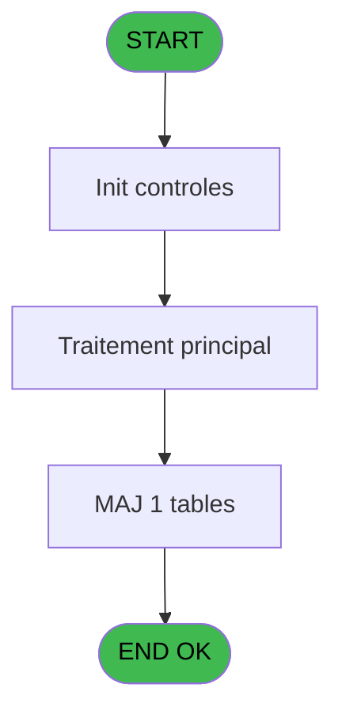
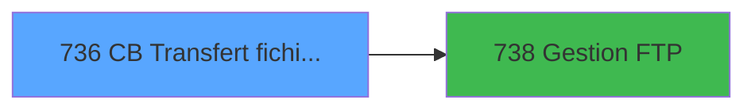

# REF IDE 736 - CB Transfert fichiers GM

> **Analyse**: Phases 1-4 2026-02-03 14:03 -> 14:03 (17s) | Assemblage 14:03
> **Pipeline**: V7.2 Enrichi
> **Structure**: 4 onglets (Resume | Ecrans | Donnees | Connexions)

<!-- TAB:Resume -->

## 1. FICHE D'IDENTITE

| Attribut | Valeur |
|----------|--------|
| Projet | REF |
| IDE Position | 736 |
| Nom Programme | CB Transfert fichiers GM |
| Fichier source | `Prg_736.xml` |
| Dossier IDE | General |
| Taches | 4 (0 ecrans visibles) |
| Tables modifiees | 1 |
| Programmes appeles | 1 |
| :warning: Statut | **ORPHELIN_POTENTIEL** |

## 2. DESCRIPTION FONCTIONNELLE

**CB Transfert fichiers GM** assure la gestion complete de ce processus.

Le flux de traitement s'organise en **3 blocs fonctionnels** :

- **Traitement** (2 taches) : traitements metier divers
- **Creation** (1 tache) : insertion d'enregistrements en base (mouvements, prestations)
- **Transfert** (1 tache) : transferts de donnees entre modules ou deversements

**Donnees modifiees** : 1 tables en ecriture (parametres___par).

**Logique metier** : 1 regles identifiees couvrant conditions metier.

Detail : phases du traitement

#### Phase 1 : Traitement (2 taches)

- **736** - Veuillez patienter ... **[[ECRAN]](#ecran-t1)**
- **736.1.1** - View

Delegue a : [Gestion FTP (IDE 738)](REF-IDE-738.md)

#### Phase 2 : Transfert (1 tache)

- **736.1** - Transfert fichiers GM **[[ECRAN]](#ecran-t2)**

#### Phase 3 : Creation (1 tache)

- **736.2** - Create Ok

#### Tables impactees

| Table | Operations | Role metier |
|-------|-----------|-------------|
| parametres___par | **W** (1 usages) |  |

## 3. BLOCS FONCTIONNELS

### 3.1 Traitement (2 taches)

Traitements internes.

---

#### 736 - Veuillez patienter ... [[ECRAN]](#ecran-t1)

**Role** : Traitement : Veuillez patienter ....
**Ecran** : 426 x 56 DLU (MDI) | [Voir mockup](#ecran-t1)
**Delegue a** : [Gestion FTP (IDE 738)](REF-IDE-738.md)

---

#### 736.1.1 - View

**Role** : Traitement : View.
**Delegue a** : [Gestion FTP (IDE 738)](REF-IDE-738.md)

### 3.2 Transfert (1 tache)

Transfert de donnees entre modules.

---

#### 736.1 - Transfert fichiers GM [[ECRAN]](#ecran-t2)

**Role** : Transfert de donnees : Transfert fichiers GM.
**Ecran** : 798 x 363 DLU (MDI) | [Voir mockup](#ecran-t2)

### 3.3 Creation (1 tache)

Insertion de nouveaux enregistrements en base.

---

#### 736.2 - Create Ok

**Role** : Traitement : Create Ok.

## 5. REGLES METIER

1 regles identifiees:

### Autres (1 regles)

#### [RM-001] Traitement si Trim (retour type millesia [I]) est renseigne

| Element | Detail |
|---------|--------|
| **Condition** | `Trim (retour type millesia [I])<>''` |
| **Si vrai** | Val (retour type millesia [I] |
| **Si faux** | '2'),21) |
| **Variables** | I (retour type millesia) |
| **Expression source** | Expression 8 : `IF (Trim (retour type millesia [I])<>'',Val (retour type mil` |
| **Exemple** | Si Trim (retour type millesia [I])<>'' → Val (retour type millesia [I]. Sinon → '2'),21) |

## 6. CONTEXTE

- **Appele par**: (aucun)
- **Appelle**: 1 programmes | **Tables**: 9 (W:1 R:1 L:7) | **Taches**: 4 | **Expressions**: 12

<!-- TAB:Ecrans -->

## 8. ECRANS

*(Programme sans ecran visible)*

## 9. NAVIGATION

### 9.3 Structure hierarchique (4 taches)

| Position | Tache | Type | Dimensions | Bloc |
|----------|-------|------|------------|------|
| **736.1** | [**Veuillez patienter ...** (736)](#t1) [mockup](#ecran-t1) | MDI | 426x56 | Traitement |
| 736.1.1 | [View (736.1.1)](#t3) | MDI | - | |
| **736.2** | [**Transfert fichiers GM** (736.1)](#t2) [mockup](#ecran-t2) | MDI | 798x363 | Transfert |
| **736.3** | [**Create Ok** (736.2)](#t4) | MDI | - | Creation |

### 9.4 Algorigramme

> **Legende**: Vert = START/END OK | Rouge = END KO | Bleu = Decisions
> *Algorigramme auto-genere. Utiliser `/algorigramme` pour une synthese metier detaillee.*

<!-- TAB:Donnees -->

## 10. TABLES

### Tables utilisees (9)

| ID | Nom | Description | Type | R | W | L | Usages |
|----|-----|-------------|------|---|---|---|--------|
| 30 | gm-recherche_____gmr | Index de recherche | DB | R |   |   | 1 |
| 34 | hebergement______heb | Hebergement (chambres) | DB |   |   | L | 1 |
| 47 | compte_gm________cgm | Comptes GM (generaux) | DB |   |   | L | 1 |
| 63 | parametres___par |  | DB |   | **W** |   | 1 |
| 312 | ez_card |  | DB |   |   | L | 1 |
| 356 | gm_millesia |  | DB |   |   | L | 1 |
| 459 | table_generale |  | DB |   |   | L | 1 |
| 707 | parametre_generaux |  | DB |   |   | L | 1 |
| 716 | gm_type_millesia |  | DB |   |   | L | 1 |

### Colonnes par table (4 / 2 tables avec colonnes identifiees)

Table 30 - gm-recherche_____gmr (R) - 1 usages

| Lettre | Variable | Acces | Type |
|--------|----------|-------|------|
| A | W2 qualite | R | Alpha |
| B | W2 prenom majuscule | R | Alpha |
| C | W2 níadherent chaine | R | Alpha |
| D | W2 filiation chaine | R | Alpha |
| E | W2 níadherent chaine Kari | R | Alpha |
| F | W2 filiation chaine Kari | R | Alpha |
| G | retour 25 avec Garantie | R | Logical |
| H | retour millesia | R | Logical |
| I | retour type millesia | R | Logical |
| J | W2 age | R | Numeric |

Table 63 - parametres___par (**W**) - 1 usages

| Lettre | Variable | Acces | Type |
|--------|----------|-------|------|
| A | p.enomatic | W | Logical |
| B | v.age alcohol | W | Numeric |

## 11. VARIABLES

### 11.1 Parametres entrants (1)

Variables recues en parametre.

| Lettre | Nom | Type | Usage dans |
|--------|-----|------|-----------|
| A | p.enomatic | Logical | 1x parametre entrant |

### 11.2 Variables de session (1)

Variables persistantes pendant toute la session.

| Lettre | Nom | Type | Usage dans |
|--------|-----|------|-----------|
| B | v.age alcohol | Numeric | - |

### 11.3 Autres (8)

Variables diverses.

| Lettre | Nom | Type | Usage dans |
|--------|-----|------|-----------|
| C | W2 níadherent chaine | Alpha | - |
| D | W2 filiation chaine | Alpha | - |
| E | W2 níadherent chaine Kari | Alpha | - |
| F | W2 filiation chaine Kari | Alpha | - |
| G | retour 25 avec Garantie | Logical | - |
| H | retour millesia | Logical | - |
| I | retour type millesia | Logical | 1x refs |
| J | W2 age | Numeric | - |

## 12. EXPRESSIONS

**12 / 12 expressions decodees (100%)**

### 12.1 Repartition par type

| Type | Expressions | Regles |
|------|-------------|--------|
| CONDITION | 1 | 5 |
| CONSTANTE | 7 | 0 |
| OTHER | 3 | 0 |
| NEGATION | 1 | 0 |

### 12.2 Expressions cles par type

#### CONDITION (1 expressions)

| Type | IDE | Expression | Regle |
|------|-----|------------|-------|
| CONDITION | 8 | `IF (Trim (retour type millesia [I])<>'',Val (retour type millesia [I],'2'),21)` | [RM-001](#rm-RM-001) |

#### CONSTANTE (7 expressions)

| Type | IDE | Expression | Regle |
|------|-----|------------|-------|
| CONSTANTE | 9 | `'P'` | - |
| CONSTANTE | 10 | `'GM.DAT'` | - |
| CONSTANTE | 11 | `'GM.OK'` | - |
| CONSTANTE | 7 | `1` | - |
| CONSTANTE | 3 | `'cmd /c mkdir c:\temp'` | - |
| ... | | *+2 autres* | |

#### OTHER (3 expressions)

| Type | IDE | Expression | Regle |
|------|-----|------------|-------|
| OTHER | 12 | `SetCrsr (1)` | - |
| OTHER | 2 | `p.enomatic [A]` | - |
| OTHER | 1 | `SetCrsr (2)` | - |

#### NEGATION (1 expressions)

| Type | IDE | Expression | Regle |
|------|-----|------------|-------|
| NEGATION | 4 | `NOT (FileExist ('c:\temp'))` | - |

<!-- TAB:Connexions -->

## 13. GRAPHE D'APPELS

### 13.1 Chaine depuis Main (Callers)

**Chemin**: (pas de callers directs)

### 13.2 Callers

| IDE | Nom Programme | Nb Appels |
|-----|---------------|-----------|
| - | (aucun) | - |

### 13.3 Callees (programmes appeles)

### 13.4 Detail Callees avec contexte

| IDE | Nom Programme | Appels | Contexte |
|-----|---------------|--------|----------|
| [738](REF-IDE-738.md) | Gestion FTP | 2 | Gestion moyens paiement |

## 14. RECOMMANDATIONS MIGRATION

### 14.1 Profil du programme

| Metrique | Valeur | Impact migration |
|----------|--------|-----------------|
| Lignes de logique | 114 | Programme compact |
| Expressions | 12 | Peu de logique |
| Tables WRITE | 1 | Impact faible |
| Sous-programmes | 1 | Peu de dependances |
| Ecrans visibles | 0 | Ecran unique ou traitement batch |
| Code desactive | 0% (0 / 114) | Code sain |
| Regles metier | 1 | Quelques regles a preserver |

### 14.2 Plan de migration par bloc

#### Traitement (2 taches: 1 ecran, 1 traitement)

- **Strategie** : Orchestrateur avec 1 ecrans (Razor/React) et 1 traitements backend (services).
- Les ecrans deviennent des composants UI, les traitements invisibles deviennent des services injectables.
- 1 sous-programme(s) a migrer ou a reutiliser depuis les services existants.
- Decomposer les taches en services unitaires testables.

#### Transfert (1 tache: 1 ecran, 0 traitement)

- **Strategie** : Service `ITransfertService` avec logique de deversement.

#### Creation (1 tache: 0 ecran, 1 traitement)

- **Strategie** : Repository pattern avec Entity Framework Core.
- Insertion via `IRepository<T>.CreateAsync()`

### 14.3 Dependances critiques

| Dependance | Type | Appels | Impact |
|------------|------|--------|--------|
| parametres___par | Table WRITE (Database) | 1x | Schema + repository |
| [Gestion FTP (IDE 738)](REF-IDE-738.md) | Sous-programme | 2x | Haute - Gestion moyens paiement |

---
*Spec DETAILED generee par Pipeline V7.2 - 2026-02-03 14:03*
