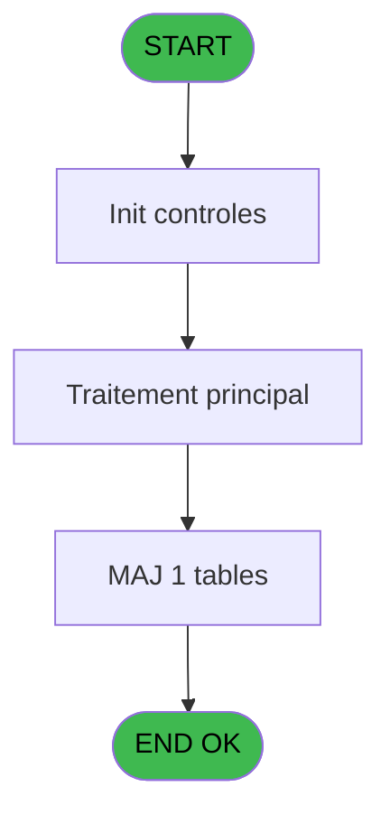

# REF IDE 741 - Fichier Tampon Retour

> **Analyse**: Phases 1-4 2026-02-03 14:05 -> 14:05 (17s) | Assemblage 14:05
> **Pipeline**: V7.2 Enrichi
> **Structure**: 4 onglets (Resume | Ecrans | Donnees | Connexions)

<!-- TAB:Resume -->

## 1. FICHE D'IDENTITE

| Attribut | Valeur |
|----------|--------|
| Projet | REF |
| IDE Position | 741 |
| Nom Programme | Fichier Tampon Retour |
| Fichier source | `Prg_741.xml` |
| Dossier IDE | General |
| Taches | 3 (0 ecrans visibles) |
| Tables modifiees | 1 |
| Programmes appeles | 1 |

## 2. DESCRIPTION FONCTIONNELLE

**Fichier Tampon Retour** assure la gestion complete de ce processus, accessible depuis [ Retour transfert fichier (IDE 739)](REF-IDE-739.md).

Le flux de traitement s'organise en **1 blocs fonctionnels** :

- **Traitement** (3 taches) : traitements metier divers

**Donnees modifiees** : 1 tables en ecriture (retour_chek_pabx).

## 3. BLOCS FONCTIONNELS

### 3.1 Traitement (3 taches)

Traitements internes.

---

#### 741 - Fichier Tampon PABX

**Role** : Traitement : Fichier Tampon PABX.
**Delegue a** : [Browse - table_supplement_ta2 (IDE 58)](REF-IDE-58.md)

---

#### 741.1 - delete enregistrement vide

**Role** : Traitement : delete enregistrement vide.
**Delegue a** : [Browse - table_supplement_ta2 (IDE 58)](REF-IDE-58.md)

---

#### 741.2 - Mise a jour file

**Role** : Traitement : Mise a jour file.
**Delegue a** : [Browse - table_supplement_ta2 (IDE 58)](REF-IDE-58.md)

## 5. REGLES METIER

*(Aucune regle metier identifiee)*

## 6. CONTEXTE

- **Appele par**: [ Retour transfert fichier (IDE 739)](REF-IDE-739.md)
- **Appelle**: 1 programmes | **Tables**: 1 (W:1 R:0 L:0) | **Taches**: 3 | **Expressions**: 15

<!-- TAB:Ecrans -->

## 8. ECRANS

*(Programme sans ecran visible)*

## 9. NAVIGATION

### 9.3 Structure hierarchique (3 taches)

| Position | Tache | Type | Dimensions | Bloc |
|----------|-------|------|------------|------|
| **741.1** | [**Fichier Tampon PABX** (741)](#t1) | MDI | - | Traitement |
| 741.1.1 | [delete enregistrement vide (741.1)](#t2) | MDI | - | |
| 741.1.2 | [Mise a jour file (741.2)](#t3) | MDI | - | |

### 9.4 Algorigramme

> **Legende**: Vert = START/END OK | Rouge = END KO | Bleu = Decisions
> *Algorigramme auto-genere. Utiliser `/algorigramme` pour une synthese metier detaillee.*

<!-- TAB:Donnees -->

## 10. TABLES

### Tables utilisees (1)

| ID | Nom | Description | Type | R | W | L | Usages |
|----|-----|-------------|------|---|---|---|--------|
| 445 | retour_chek_pabx |  | DB |   | **W** |   | 2 |

### Colonnes par table (0 / 1 tables avec colonnes identifiees)

Table 445 - retour_chek_pabx (**W**) - 2 usages

*Table utilisee uniquement en Link ou aucune colonne Real identifiee dans le DataView.*

## 11. VARIABLES

### 11.1 Variables de session (13)

Variables persistantes pendant toute la session.

| Lettre | Nom | Type | Usage dans |
|--------|-----|------|-----------|
| C | v. date sys | Date | - |
| D | v. time sys | Time | - |
| E | v. numero de poste | Numeric | 1x session |
| F | v. numero ligne | Numeric | 1x session |
| G | v. code autocom | Numeric | 1x session |
| H | v. sens | Alpha | 2x session |
| I | v. valeur | Numeric | 2x session |
| J | v. date | Date | - |
| K | v. time | Time | - |
| L | v. In ok | Numeric | 1x session |
| M | v. In no ok | Numeric | 1x session |
| N | v. Out ok | Numeric | 1x session |
| O | v. Out no ok | Numeric | 1x session |

### 11.2 Autres (2)

Variables diverses.

| Lettre | Nom | Type | Usage dans |
|--------|-----|------|-----------|
| A | < Compteur | Numeric | - |
| B | > chemin Get.log | Alpha | 1x refs |

## 12. EXPRESSIONS

**15 / 15 expressions decodees (100%)**

### 12.1 Repartition par type

| Type | Expressions | Regles |
|------|-------------|--------|
| CALCULATION | 4 | 0 |
| CONDITION | 6 | 0 |
| CONSTANTE | 2 | 0 |
| DATE | 1 | 0 |
| OTHER | 2 | 0 |

### 12.2 Expressions cles par type

#### CALCULATION (4 expressions)

| Type | IDE | Expression | Regle |
|------|-----|------------|-------|
| CALCULATION | 9 | `v. Out ok [N]+1` | - |
| CALCULATION | 10 | `v. Out no ok [O]+1` | - |
| CALCULATION | 7 | `v. In ok [L]+1` | - |
| CALCULATION | 8 | `v. In no ok [M]+1` | - |

#### CONDITION (6 expressions)

| Type | IDE | Expression | Regle |
|------|-----|------------|-------|
| CONDITION | 13 | `v. valeur [I]=1` | - |
| CONDITION | 14 | `v. valeur [I]=0` | - |
| CONDITION | 5 | `Trim (> chemin Get.log [B])` | - |
| CONDITION | 11 | `v. sens [H]='+'` | - |
| CONDITION | 12 | `v. sens [H]='-'` | - |
| ... | | *+1 autres* | |

#### CONSTANTE (2 expressions)

| Type | IDE | Expression | Regle |
|------|-----|------------|-------|
| CONSTANTE | 15 | `0` | - |
| CONSTANTE | 4 | `'%club_tf_pabx%RETOUR.TCK'` | - |

#### DATE (1 expressions)

| Type | IDE | Expression | Regle |
|------|-----|------------|-------|
| DATE | 1 | `Date ()` | - |

#### OTHER (2 expressions)

| Type | IDE | Expression | Regle |
|------|-----|------------|-------|
| OTHER | 3 | `EOF (0,1)` | - |
| OTHER | 2 | `Time ()` | - |

<!-- TAB:Connexions -->

## 13. GRAPHE D'APPELS

### 13.1 Chaine depuis Main (Callers)

Main -> ... -> [ Retour transfert fichier (IDE 739)](REF-IDE-739.md) -> **Fichier Tampon Retour (IDE 741)**

### 13.2 Callers

| IDE | Nom Programme | Nb Appels |
|-----|---------------|-----------|
| [739](REF-IDE-739.md) |  Retour transfert fichier | 1 |

### 13.3 Callees (programmes appeles)

### 13.4 Detail Callees avec contexte

| IDE | Nom Programme | Appels | Contexte |
|-----|---------------|--------|----------|
| [58](REF-IDE-58.md) | Browse - table_supplement_ta2 | 1 | Sous-programme |

## 14. RECOMMANDATIONS MIGRATION

### 14.1 Profil du programme

| Metrique | Valeur | Impact migration |
|----------|--------|-----------------|
| Lignes de logique | 57 | Programme compact |
| Expressions | 15 | Peu de logique |
| Tables WRITE | 1 | Impact faible |
| Sous-programmes | 1 | Peu de dependances |
| Ecrans visibles | 0 | Ecran unique ou traitement batch |
| Code desactive | 0% (0 / 57) | Code sain |
| Regles metier | 0 | Pas de regle identifiee |

### 14.2 Plan de migration par bloc

#### Traitement (3 taches: 0 ecran, 3 traitements)

- **Strategie** : 3 service(s) backend injectable(s) (Domain Services).
- 1 sous-programme(s) a migrer ou a reutiliser depuis les services existants.
- Decomposer les taches en services unitaires testables.

### 14.3 Dependances critiques

| Dependance | Type | Appels | Impact |
|------------|------|--------|--------|
| retour_chek_pabx | Table WRITE (Database) | 2x | Schema + repository |
| [Browse - table_supplement_ta2 (IDE 58)](REF-IDE-58.md) | Sous-programme | 1x | Normale - Sous-programme |

---
*Spec DETAILED generee par Pipeline V7.2 - 2026-02-03 14:05*
