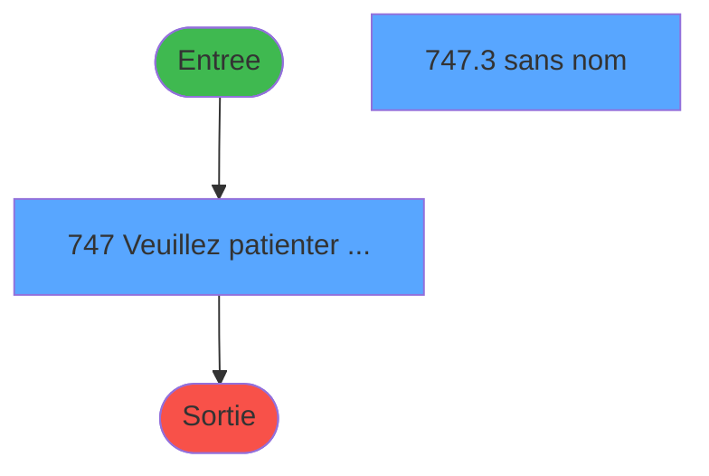
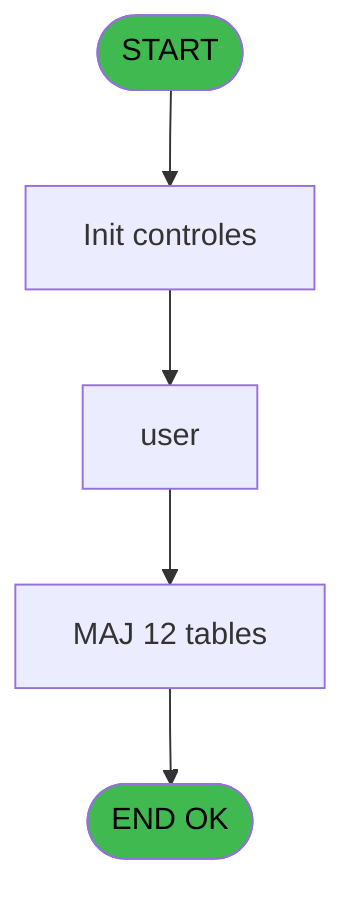
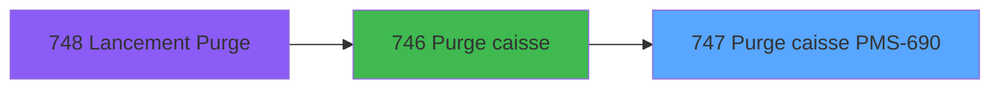

# REF IDE 747 - Purge caisse PMS-690

> **Analyse**: Phases 1-4 2026-02-03 14:07 -> 14:07 (18s) | Assemblage 14:07
> **Pipeline**: V7.2 Enrichi
> **Structure**: 4 onglets (Resume | Ecrans | Donnees | Connexions)

<!-- TAB:Resume -->

## 1. FICHE D'IDENTITE

| Attribut | Valeur |
|----------|--------|
| Projet | REF |
| IDE Position | 747 |
| Nom Programme | Purge caisse PMS-690 |
| Fichier source | `Prg_747.xml` |
| Dossier IDE | Caisse |
| Taches | 42 (2 ecrans visibles) |
| Tables modifiees | 12 |
| Programmes appeles | 0 |

## 2. DESCRIPTION FONCTIONNELLE

**Purge caisse PMS-690** assure la gestion complete de ce processus, accessible depuis [Purge caisse (IDE 746)](REF-IDE-746.md).

Le flux de traitement s'organise en **2 blocs fonctionnels** :

- **Traitement** (41 taches) : traitements metier divers
- **Calcul** (1 tache) : calculs de montants, stocks ou compteurs

**Donnees modifiees** : 12 tables en ecriture (comptage_coffre_devise_histo, comptage_coffre_histo, comptage_coffre_montant_histo, comptage_caisse_devise_histo, comptage_caisse_histo, comptage_caisse_montant_histo, histo_sessions_caisse, histo_sessions_caisse_article, histo_sessions_caisse_detail, histo_sessions_caisse_devise, histo_sessions_caisse_remise, liste_user_pour_la_purge).

Detail : phases du traitement

#### Phase 1 : Traitement (41 taches)

- **747** - Veuillez patienter ... **[[ECRAN]](#ecran-t1)**
- **747.1** - Paramètres
- **747.2** - Liste USER
- **747.2.1** - Delete User
- **747.2.2** - Table USER
- **747.2.3** - Sessions
- **747.2.3.1** - Pointe USER
- **747.2.4** - Coffre
- **747.2.4.1** - Pointe USER
- **747.3** - (sans nom) **[[ECRAN]](#ecran-t10)**
- **747.3.1** - Session maxi
- **747.3.2** - Coffre maxi
- **747.3.3.1** - Montant
- **747.3.3.2** - Devise
- **747.3.4** - session
- **747.3.4.1** - detail
- **747.3.4.2** - article
- **747.3.4.3** - devise
- **747.3.4.4** - remise
- **747.3.5** - coffre
- **747.3.5.1** - montant
- **747.3.5.2** - devise
- **747.3.6** - Rec last manual session closed
- **747.4** - session
- **747.4.1** - detail
- **747.4.2** - article
- **747.4.3** - devise
- **747.4.4** - remise
- **747.5** - session
- **747.5.1** - detail
- **747.5.2** - detail
- **747.5.3** - article
- **747.5.4** - devise
- **747.5.5** - remise
- **747.6** - session
- **747.6.1** - detail
- **747.6.2** - detail
- **747.6.3** - article
- **747.6.4** - devise
- **747.6.5** - remise
- **747.7** - Intégrité Pointage Appro Remis

#### Phase 2 : Calcul (1 tache)

- **747.3.3** - comptage caisse

#### Tables impactees

| Table | Operations | Role metier |
|-------|-----------|-------------|
| histo_sessions_caisse | R/**W**/L (9 usages) | Sessions de caisse |
| histo_sessions_caisse_detail | **W**/L (9 usages) | Sessions de caisse |
| histo_sessions_caisse_article | **W** (4 usages) | Articles et stock |
| liste_user_pour_la_purge | **W**/L (4 usages) |  |
| histo_sessions_caisse_remise | **W** (4 usages) | Sessions de caisse |
| histo_sessions_caisse_devise | **W** (4 usages) | Sessions de caisse |
| comptage_coffre_histo | **W** (3 usages) | Etat du coffre |
| comptage_caisse_histo | **W** (1 usages) | Sessions de caisse |
| comptage_coffre_devise_histo | **W** (1 usages) | Etat du coffre |
| comptage_caisse_devise_histo | **W** (1 usages) | Sessions de caisse |
| comptage_caisse_montant_histo | **W** (1 usages) | Sessions de caisse |
| comptage_coffre_montant_histo | **W** (1 usages) | Etat du coffre |

## 3. BLOCS FONCTIONNELS

### 3.1 Traitement (41 taches)

Traitements internes.

---

#### 747 - Veuillez patienter ... [[ECRAN]](#ecran-t1)

**Role** : Tache d'orchestration : point d'entree du programme (41 sous-taches). Coordonne l'enchainement des traitements.
**Ecran** : 424 x 112 DLU (MDI) | [Voir mockup](#ecran-t1)

40 sous-taches directes

| Tache | Nom | Bloc |
|-------|-----|------|
| [747.1](#t2) | Paramètres | Traitement |
| [747.2](#t3) | Liste USER | Traitement |
| [747.2.1](#t4) | Delete User | Traitement |
| [747.2.2](#t5) | Table USER | Traitement |
| [747.2.3](#t6) | Sessions | Traitement |
| [747.2.3.1](#t7) | Pointe USER | Traitement |
| [747.2.4](#t8) | Coffre | Traitement |
| [747.2.4.1](#t9) | Pointe USER | Traitement |
| [747.3](#t10) | (sans nom) **[[ECRAN]](#ecran-t10)** | Traitement |
| [747.3.1](#t11) | Session maxi | Traitement |
| [747.3.2](#t12) | Coffre maxi | Traitement |
| [747.3.3.1](#t14) | Montant | Traitement |
| [747.3.3.2](#t15) | Devise | Traitement |
| [747.3.4](#t16) | session | Traitement |
| [747.3.4.1](#t17) | detail | Traitement |
| [747.3.4.2](#t18) | article | Traitement |
| [747.3.4.3](#t19) | devise | Traitement |
| [747.3.4.4](#t20) | remise | Traitement |
| [747.3.5](#t21) | coffre | Traitement |
| [747.3.5.1](#t22) | montant | Traitement |
| [747.3.5.2](#t23) | devise | Traitement |
| [747.3.6](#t24) | Rec last manual session closed | Traitement |
| [747.4](#t25) | session | Traitement |
| [747.4.1](#t26) | detail | Traitement |
| [747.4.2](#t27) | article | Traitement |
| [747.4.3](#t28) | devise | Traitement |
| [747.4.4](#t29) | remise | Traitement |
| [747.5](#t30) | session | Traitement |
| [747.5.1](#t31) | detail | Traitement |
| [747.5.2](#t32) | detail | Traitement |
| [747.5.3](#t33) | article | Traitement |
| [747.5.4](#t34) | devise | Traitement |
| [747.5.5](#t35) | remise | Traitement |
| [747.6](#t36) | session | Traitement |
| [747.6.1](#t37) | detail | Traitement |
| [747.6.2](#t38) | detail | Traitement |
| [747.6.3](#t39) | article | Traitement |
| [747.6.4](#t40) | devise | Traitement |
| [747.6.5](#t41) | remise | Traitement |
| [747.7](#t42) | Intégrité Pointage Appro Remis | Traitement |

---

#### 747.1 - Paramètres

**Role** : Traitement : Paramètres.

---

#### 747.2 - Liste USER

**Role** : Traitement : Liste USER.
**Variables liees** : D (Session maxi à purger du user), E (Chrono coffre maxi du user)

---

#### 747.2.1 - Delete User

**Role** : Traitement : Delete User.
**Variables liees** : D (Session maxi à purger du user), E (Chrono coffre maxi du user)

---

#### 747.2.2 - Table USER

**Role** : Traitement : Table USER.
**Variables liees** : D (Session maxi à purger du user), E (Chrono coffre maxi du user)

---

#### 747.2.3 - Sessions

**Role** : Traitement : Sessions.
**Variables liees** : B (Sessions caisse à conserver)

---

#### 747.2.3.1 - Pointe USER

**Role** : Traitement : Pointe USER.
**Variables liees** : D (Session maxi à purger du user), E (Chrono coffre maxi du user)

---

#### 747.2.4 - Coffre

**Role** : Traitement : Coffre.
**Variables liees** : C (Comptages coffre à conserver), E (Chrono coffre maxi du user)

---

#### 747.2.4.1 - Pointe USER

**Role** : Traitement : Pointe USER.
**Variables liees** : D (Session maxi à purger du user), E (Chrono coffre maxi du user)

---

#### 747.3 - (sans nom) [[ECRAN]](#ecran-t10)

**Role** : Traitement interne.
**Ecran** : 326 x 63 DLU (MDI) | [Voir mockup](#ecran-t10)

---

#### 747.3.1 - Session maxi

**Role** : Traitement : Session maxi.
**Variables liees** : B (Sessions caisse à conserver), D (Session maxi à purger du user), E (Chrono coffre maxi du user)

---

#### 747.3.2 - Coffre maxi

**Role** : Traitement : Coffre maxi.
**Variables liees** : C (Comptages coffre à conserver), D (Session maxi à purger du user), E (Chrono coffre maxi du user)

---

#### 747.3.3.1 - Montant

**Role** : Traitement : Montant.

---

#### 747.3.3.2 - Devise

**Role** : Traitement : Devise.

---

#### 747.3.4 - session

**Role** : Traitement : session.
**Variables liees** : B (Sessions caisse à conserver), D (Session maxi à purger du user)

---

#### 747.3.4.1 - detail

**Role** : Traitement : detail.

---

#### 747.3.4.2 - article

**Role** : Traitement : article.

---

#### 747.3.4.3 - devise

**Role** : Traitement : devise.

---

#### 747.3.4.4 - remise

**Role** : Calcul fidelite/avantage : remise.

---

#### 747.3.5 - coffre

**Role** : Traitement : coffre.
**Variables liees** : C (Comptages coffre à conserver), E (Chrono coffre maxi du user)

---

#### 747.3.5.1 - montant

**Role** : Traitement : montant.

---

#### 747.3.5.2 - devise

**Role** : Traitement : devise.

---

#### 747.3.6 - Rec last manual session closed

**Role** : Traitement : Rec last manual session closed.
**Variables liees** : B (Sessions caisse à conserver), D (Session maxi à purger du user)

---

#### 747.4 - session

**Role** : Traitement : session.
**Variables liees** : B (Sessions caisse à conserver), D (Session maxi à purger du user)

---

#### 747.4.1 - detail

**Role** : Traitement : detail.

---

#### 747.4.2 - article

**Role** : Traitement : article.

---

#### 747.4.3 - devise

**Role** : Traitement : devise.

---

#### 747.4.4 - remise

**Role** : Calcul fidelite/avantage : remise.

---

#### 747.5 - session

**Role** : Traitement : session.
**Variables liees** : B (Sessions caisse à conserver), D (Session maxi à purger du user)

---

#### 747.5.1 - detail

**Role** : Traitement : detail.

---

#### 747.5.2 - detail

**Role** : Traitement : detail.

---

#### 747.5.3 - article

**Role** : Traitement : article.

---

#### 747.5.4 - devise

**Role** : Traitement : devise.

---

#### 747.5.5 - remise

**Role** : Calcul fidelite/avantage : remise.

---

#### 747.6 - session

**Role** : Traitement : session.
**Variables liees** : B (Sessions caisse à conserver), D (Session maxi à purger du user)

---

#### 747.6.1 - detail

**Role** : Traitement : detail.

---

#### 747.6.2 - detail

**Role** : Traitement : detail.

---

#### 747.6.3 - article

**Role** : Traitement : article.

---

#### 747.6.4 - devise

**Role** : Traitement : devise.

---

#### 747.6.5 - remise

**Role** : Calcul fidelite/avantage : remise.

---

#### 747.7 - Intégrité Pointage Appro Remis

**Role** : Traitement : Intégrité Pointage Appro Remis.

### 3.2 Calcul (1 tache)

Calculs metier : montants, stocks, compteurs.

---

#### 747.3.3 - comptage caisse

**Role** : Traitement : comptage caisse.
**Variables liees** : B (Sessions caisse à conserver), C (Comptages coffre à conserver)

## 5. REGLES METIER

*(Aucune regle metier identifiee)*

## 6. CONTEXTE

- **Appele par**: [Purge caisse (IDE 746)](REF-IDE-746.md)
- **Appelle**: 0 programmes | **Tables**: 14 (W:12 R:2 L:4) | **Taches**: 42 | **Expressions**: 2

<!-- TAB:Ecrans -->

## 8. ECRANS

### 8.1 Forms visibles (2 / 42)

| # | Position | Tache | Nom | Type | Largeur | Hauteur | Bloc |
|---|----------|-------|-----|------|---------|---------|------|
| 1 | 747 | 747 | Veuillez patienter ... | MDI | 424 | 112 | Traitement |
| 2 | 747.3 | 747.3 | (sans nom) | MDI | 326 | 63 | Traitement |

### 8.2 Mockups Ecrans

---

#### 747 - Veuillez patienter ...
**Tache** : [747](#t1) | **Type** : MDI | **Dimensions** : 424 x 112 DLU
**Bloc** : Traitement | **Titre IDE** : Veuillez patienter ...

<!-- FORM-DATA:
{
    "width":  424,
    "vFactor":  8,
    "type":  "MDI",
    "hFactor":  8,
    "controls":  [
                     {
                         "x":  91,
                         "type":  "label",
                         "var":  "",
                         "y":  9,
                         "w":  326,
                         "fmt":  "",
                         "name":  "",
                         "h":  8,
                         "color":  "7",
                         "text":  "Purge caisse en cours ...",
                         "parent":  null
                     },
                     {
                         "x":  7,
                         "type":  "image",
                         "var":  "",
                         "y":  1,
                         "w":  72,
                         "fmt":  "",
                         "name":  "",
                         "h":  25,
                         "color":  "",
                         "text":  "",
                         "parent":  null
                     }
                 ],
    "taskId":  "747",
    "height":  112
}
-->

---

#### 747.3 - (sans nom)
**Tache** : [747.3](#t10) | **Type** : MDI | **Dimensions** : 326 x 63 DLU
**Bloc** : Traitement | **Titre IDE** : (sans nom)

<!-- FORM-DATA:
{
    "width":  326,
    "vFactor":  8,
    "type":  "MDI",
    "hFactor":  8,
    "controls":  [
                     {
                         "x":  71,
                         "type":  "table",
                         "var":  "",
                         "name":  "",
                         "titleH":  12,
                         "color":  "110",
                         "w":  186,
                         "y":  0,
                         "fmt":  "",
                         "parent":  null,
                         "text":  "",
                         "rowH":  14,
                         "h":  54,
                         "cols":  [
                                      {
                                          "title":  "User",
                                          "layer":  1,
                                          "w":  177
                                      }
                                  ],
                         "rows":  1
                     },
                     {
                         "x":  75,
                         "type":  "edit",
                         "var":  "",
                         "y":  14,
                         "w":  104,
                         "fmt":  "",
                         "name":  "",
                         "h":  10,
                         "color":  "110",
                         "text":  "",
                         "parent":  1
                     }
                 ],
    "taskId":  "747.3",
    "height":  63
}
-->

<strong>Champs : 1 champs</strong>

| Pos (x,y) | Nom | Variable | Type |
|-----------|-----|----------|------|
| 75,14 | (sans nom) | - | edit |

## 9. NAVIGATION

### 9.1 Enchainement des ecrans

**Detail par enchainement :**

| Depuis | Action | Vers | Retour |
|--------|--------|------|--------|

### 9.3 Structure hierarchique (42 taches)

| Position | Tache | Type | Dimensions | Bloc |
|----------|-------|------|------------|------|
| **747.1** | [**Veuillez patienter ...** (747)](#t1) [mockup](#ecran-t1) | MDI | 424x112 | Traitement |
| 747.1.1 | [Paramètres (747.1)](#t2) | MDI | - | |
| 747.1.2 | [Liste USER (747.2)](#t3) | MDI | - | |
| 747.1.3 | [Delete User (747.2.1)](#t4) | - | - | |
| 747.1.4 | [Table USER (747.2.2)](#t5) | MDI | - | |
| 747.1.5 | [Sessions (747.2.3)](#t6) | MDI | - | |
| 747.1.6 | [Pointe USER (747.2.3.1)](#t7) | MDI | - | |
| 747.1.7 | [Coffre (747.2.4)](#t8) | MDI | - | |
| 747.1.8 | [Pointe USER (747.2.4.1)](#t9) | MDI | - | |
| 747.1.9 | [(sans nom) (747.3)](#t10) [mockup](#ecran-t10) | MDI | 326x63 | |
| 747.1.10 | [Session maxi (747.3.1)](#t11) | MDI | - | |
| 747.1.11 | [Coffre maxi (747.3.2)](#t12) | MDI | - | |
| 747.1.12 | [Montant (747.3.3.1)](#t14) | MDI | - | |
| 747.1.13 | [Devise (747.3.3.2)](#t15) | MDI | - | |
| 747.1.14 | [session (747.3.4)](#t16) | MDI | - | |
| 747.1.15 | [detail (747.3.4.1)](#t17) | MDI | - | |
| 747.1.16 | [article (747.3.4.2)](#t18) | MDI | - | |
| 747.1.17 | [devise (747.3.4.3)](#t19) | MDI | - | |
| 747.1.18 | [remise (747.3.4.4)](#t20) | MDI | - | |
| 747.1.19 | [coffre (747.3.5)](#t21) | MDI | - | |
| 747.1.20 | [montant (747.3.5.1)](#t22) | MDI | - | |
| 747.1.21 | [devise (747.3.5.2)](#t23) | MDI | - | |
| 747.1.22 | [Rec last manual session closed (747.3.6)](#t24) | - | - | |
| 747.1.23 | [session (747.4)](#t25) | MDI | - | |
| 747.1.24 | [detail (747.4.1)](#t26) | MDI | - | |
| 747.1.25 | [article (747.4.2)](#t27) | MDI | - | |
| 747.1.26 | [devise (747.4.3)](#t28) | MDI | - | |
| 747.1.27 | [remise (747.4.4)](#t29) | MDI | - | |
| 747.1.28 | [session (747.5)](#t30) | MDI | - | |
| 747.1.29 | [detail (747.5.1)](#t31) | MDI | - | |
| 747.1.30 | [detail (747.5.2)](#t32) | MDI | - | |
| 747.1.31 | [article (747.5.3)](#t33) | MDI | - | |
| 747.1.32 | [devise (747.5.4)](#t34) | MDI | - | |
| 747.1.33 | [remise (747.5.5)](#t35) | MDI | - | |
| 747.1.34 | [session (747.6)](#t36) | MDI | - | |
| 747.1.35 | [detail (747.6.1)](#t37) | MDI | - | |
| 747.1.36 | [detail (747.6.2)](#t38) | MDI | - | |
| 747.1.37 | [article (747.6.3)](#t39) | MDI | - | |
| 747.1.38 | [devise (747.6.4)](#t40) | MDI | - | |
| 747.1.39 | [remise (747.6.5)](#t41) | MDI | - | |
| 747.1.40 | [Intégrité Pointage Appro Remis (747.7)](#t42) | - | - | |
| **747.2** | [**comptage caisse** (747.3.3)](#t13) | MDI | - | Calcul |

### 9.4 Algorigramme

> **Legende**: Vert = START/END OK | Rouge = END KO | Bleu = Decisions
> *Algorigramme auto-genere. Utiliser `/algorigramme` pour une synthese metier detaillee.*

<!-- TAB:Donnees -->

## 10. TABLES

### Tables utilisees (14)

| ID | Nom | Description | Type | R | W | L | Usages |
|----|-----|-------------|------|---|---|---|--------|
| 215 | comptage_coffre_devise_histo | Etat du coffre | DB |   | **W** |   | 1 |
| 217 | comptage_coffre_histo | Etat du coffre | DB |   | **W** |   | 3 |
| 218 | comptage_coffre_montant_histo | Etat du coffre | DB |   | **W** |   | 1 |
| 220 | comptage_caisse_devise_histo | Sessions de caisse | DB |   | **W** |   | 1 |
| 222 | comptage_caisse_histo | Sessions de caisse | DB |   | **W** |   | 1 |
| 223 | comptage_caisse_montant_histo | Sessions de caisse | DB |   | **W** |   | 1 |
| 246 | histo_sessions_caisse | Sessions de caisse | DB | R | **W** | L | 9 |
| 247 | histo_sessions_caisse_article | Articles et stock | DB |   | **W** |   | 4 |
| 249 | histo_sessions_caisse_detail | Sessions de caisse | DB |   | **W** | L | 9 |
| 250 | histo_sessions_caisse_devise | Sessions de caisse | DB |   | **W** |   | 4 |
| 251 | histo_sessions_caisse_remise | Sessions de caisse | DB |   | **W** |   | 4 |
| 262 | liste_user_pour_la_purge |  | DB |   | **W** | L | 4 |
| 677 | parametres_caisse | Sessions de caisse | DB | R |   |   | 1 |
| 718 | utilisateur______uti |  | DB |   |   | L | 2 |

### Colonnes par table (14 / 13 tables avec colonnes identifiees)

Table 215 - comptage_coffre_devise_histo (**W**) - 1 usages

| Lettre | Variable | Acces | Type |
|--------|----------|-------|------|
| A | L.Clot_auto_comptage | W | Logical |
| C | Comptages coffre à conserver | W | Numeric |
| E | Chrono coffre maxi du user | W | Numeric |

Table 217 - comptage_coffre_histo (**W**) - 3 usages

| Lettre | Variable | Acces | Type |
|--------|----------|-------|------|
| A | L.Clot_auto_comptage | W | Logical |
| C | Comptages coffre à conserver | W | Numeric |
| E | Chrono coffre maxi du user | W | Numeric |

Table 218 - comptage_coffre_montant_histo (**W**) - 1 usages

| Lettre | Variable | Acces | Type |
|--------|----------|-------|------|
| A | L.Clot_auto_comptage | W | Logical |
| C | Comptages coffre à conserver | W | Numeric |
| E | Chrono coffre maxi du user | W | Numeric |

Table 220 - comptage_caisse_devise_histo (**W**) - 1 usages

| Lettre | Variable | Acces | Type |
|--------|----------|-------|------|
| A | L.Clot_auto_comptage | W | Logical |
| B | Sessions caisse à conserver | W | Numeric |
| C | Comptages coffre à conserver | W | Numeric |

Table 222 - comptage_caisse_histo (**W**) - 1 usages

| Lettre | Variable | Acces | Type |
|--------|----------|-------|------|
| A | L.Clot_auto_comptage | W | Logical |
| B | Sessions caisse à conserver | W | Numeric |
| C | Comptages coffre à conserver | W | Numeric |

Table 223 - comptage_caisse_montant_histo (**W**) - 1 usages

| Lettre | Variable | Acces | Type |
|--------|----------|-------|------|
| A | L.Clot_auto_comptage | W | Logical |
| B | Sessions caisse à conserver | W | Numeric |
| C | Comptages coffre à conserver | W | Numeric |

Table 246 - histo_sessions_caisse (R/**W**/L) - 9 usages

| Lettre | Variable | Acces | Type |
|--------|----------|-------|------|
| A | v.lien last session Auto | W | Logical |
| B | v.Chono manual session closed | W | Numeric |

Table 247 - histo_sessions_caisse_article (**W**) - 4 usages

| Lettre | Variable | Acces | Type |
|--------|----------|-------|------|
| A | L.Clot_auto_caisse | W | Logical |
| B | Sessions caisse à conserver | W | Numeric |

Table 249 - histo_sessions_caisse_detail (**W**/L) - 9 usages

| Lettre | Variable | Acces | Type |
|--------|----------|-------|------|
| A | L.Clot_auto_caisse | W | Logical |
| B | Sessions caisse à conserver | W | Numeric |

Table 250 - histo_sessions_caisse_devise (**W**) - 4 usages

| Lettre | Variable | Acces | Type |
|--------|----------|-------|------|
| A | L.Clot_auto_caisse | W | Logical |
| B | Sessions caisse à conserver | W | Numeric |

Table 251 - histo_sessions_caisse_remise (**W**) - 4 usages

| Lettre | Variable | Acces | Type |
|--------|----------|-------|------|
| A | L.Clot_auto_caisse | W | Logical |
| B | Sessions caisse à conserver | W | Numeric |

Table 262 - liste_user_pour_la_purge (**W**/L) - 4 usages

| Lettre | Variable | Acces | Type |
|--------|----------|-------|------|
| A | Trouver_user | W | Logical |
| D | Session maxi à purger du user | W | Numeric |
| E | Chrono coffre maxi du user | W | Numeric |

Table 677 - parametres_caisse (R) - 1 usages

| Lettre | Variable | Acces | Type |
|--------|----------|-------|------|
| A | L.Clot_auto_caisse | R | Logical |
| B | Sessions caisse à conserver | R | Numeric |

## 11. VARIABLES

### 11.1 Parametres entrants (1)

Variables recues du programme appelant ([Purge caisse (IDE 746)](REF-IDE-746.md)).

| Lettre | Nom | Type | Usage dans |
|--------|-----|------|-----------|
| A | P.i.Utilisateur | Unicode | 2x parametre entrant |

### 11.2 Autres (4)

Variables diverses.

| Lettre | Nom | Type | Usage dans |
|--------|-----|------|-----------|
| B | Sessions caisse à conserver | Numeric | - |
| C | Comptages coffre à conserver | Numeric | - |
| D | Session maxi à purger du user | Numeric | - |
| E | Chrono coffre maxi du user | Numeric | - |

## 12. EXPRESSIONS

**2 / 2 expressions decodees (100%)**

### 12.1 Repartition par type

| Type | Expressions | Regles |
|------|-------------|--------|
| CONDITION | 2 | 0 |

### 12.2 Expressions cles par type

#### CONDITION (2 expressions)

| Type | IDE | Expression | Regle |
|------|-----|------------|-------|
| CONDITION | 2 | `Trim(P.i.Utilisateur [A])<>''` | - |
| CONDITION | 1 | `Trim(P.i.Utilisateur [A])=''` | - |

<!-- TAB:Connexions -->

## 13. GRAPHE D'APPELS

### 13.1 Chaine depuis Main (Callers)

Main -> ... -> [Purge caisse (IDE 746)](REF-IDE-746.md) -> **Purge caisse PMS-690 (IDE 747)**

### 13.2 Callers

| IDE | Nom Programme | Nb Appels |
|-----|---------------|-----------|
| [746](REF-IDE-746.md) | Purge caisse | 1 |

### 13.3 Callees (programmes appeles)

### 13.4 Detail Callees avec contexte

| IDE | Nom Programme | Appels | Contexte |
|-----|---------------|--------|----------|
| - | (aucun) | - | - |

## 14. RECOMMANDATIONS MIGRATION

### 14.1 Profil du programme

| Metrique | Valeur | Impact migration |
|----------|--------|-----------------|
| Lignes de logique | 267 | Taille moyenne |
| Expressions | 2 | Peu de logique |
| Tables WRITE | 12 | Fort impact donnees |
| Sous-programmes | 0 | Peu de dependances |
| Ecrans visibles | 2 | Quelques ecrans |
| Code desactive | 0% (0 / 267) | Code sain |
| Regles metier | 0 | Pas de regle identifiee |

### 14.2 Plan de migration par bloc

#### Traitement (41 taches: 2 ecrans, 39 traitements)

- **Strategie** : Orchestrateur avec 2 ecrans (Razor/React) et 39 traitements backend (services).
- Les ecrans deviennent des composants UI, les traitements invisibles deviennent des services injectables.
- Decomposer les taches en services unitaires testables.

#### Calcul (1 tache: 0 ecran, 1 traitement)

- **Strategie** : Services de calcul purs (Domain Services).
- Migrer la logique de calcul (stock, compteurs, montants)

### 14.3 Dependances critiques

| Dependance | Type | Appels | Impact |
|------------|------|--------|--------|
| comptage_coffre_devise_histo | Table WRITE (Database) | 1x | Schema + repository |
| comptage_coffre_histo | Table WRITE (Database) | 3x | Schema + repository |
| comptage_coffre_montant_histo | Table WRITE (Database) | 1x | Schema + repository |
| comptage_caisse_devise_histo | Table WRITE (Database) | 1x | Schema + repository |
| comptage_caisse_histo | Table WRITE (Database) | 1x | Schema + repository |
| comptage_caisse_montant_histo | Table WRITE (Database) | 1x | Schema + repository |
| histo_sessions_caisse | Table WRITE (Database) | 6x | Schema + repository |
| histo_sessions_caisse_article | Table WRITE (Database) | 4x | Schema + repository |
| histo_sessions_caisse_detail | Table WRITE (Database) | 4x | Schema + repository |
| histo_sessions_caisse_devise | Table WRITE (Database) | 4x | Schema + repository |
| histo_sessions_caisse_remise | Table WRITE (Database) | 4x | Schema + repository |
| liste_user_pour_la_purge | Table WRITE (Database) | 3x | Schema + repository |

---
*Spec DETAILED generee par Pipeline V7.2 - 2026-02-03 14:07*
