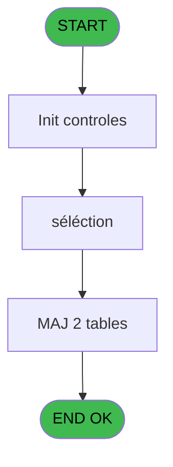
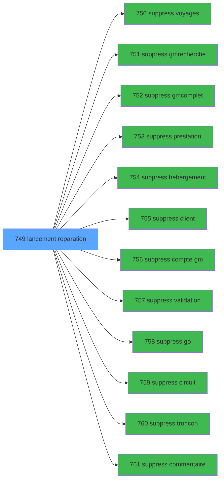

# REF IDE 749 - lancement reparation

> **Analyse**: Phases 1-4 2026-02-03 14:08 -> 14:08 (15s) | Assemblage 14:08
> **Pipeline**: V7.2 Enrichi
> **Structure**: 4 onglets (Resume | Ecrans | Donnees | Connexions)

<!-- TAB:Resume -->

## 1. FICHE D'IDENTITE

| Attribut | Valeur |
|----------|--------|
| Projet | REF |
| IDE Position | 749 |
| Nom Programme | lancement reparation |
| Fichier source | `Prg_749.xml` |
| Dossier IDE | General |
| Taches | 3 (1 ecrans visibles) |
| Tables modifiees | 2 |
| Programmes appeles | 12 |
| :warning: Statut | **ORPHELIN_POTENTIEL** |

## 2. DESCRIPTION FONCTIONNELLE

**lancement reparation** assure la gestion complete de ce processus.

Le flux de traitement s'organise en **1 blocs fonctionnels** :

- **Traitement** (3 taches) : traitements metier divers

**Donnees modifiees** : 2 tables en ecriture (gm-complet_______gmc, Selection des noms a supprimer).

## 3. BLOCS FONCTIONNELS

### 3.1 Traitement (3 taches)

Traitements internes.

---

#### 749 - Lancement de la sélection

**Role** : Traitement : Lancement de la sélection.
**Variables liees** : D (B.lancement)
**Delegue a** : [suppress voyages (IDE 750)](REF-IDE-750.md), [suppress gmcomplet (IDE 752)](REF-IDE-752.md), [suppress prestation (IDE 753)](REF-IDE-753.md)

---

#### 749.1 - séléction [[ECRAN]](#ecran-t2)

**Role** : Traitement : séléction.
**Ecran** : 141 x 287 DLU (MDI) | [Voir mockup](#ecran-t2)
**Delegue a** : [suppress voyages (IDE 750)](REF-IDE-750.md), [suppress gmcomplet (IDE 752)](REF-IDE-752.md), [suppress prestation (IDE 753)](REF-IDE-753.md)

---

#### 749.2 - supress des arrivées avant dim

**Role** : Traitement : supress des arrivées avant dim.
**Delegue a** : [suppress voyages (IDE 750)](REF-IDE-750.md), [suppress gmcomplet (IDE 752)](REF-IDE-752.md), [suppress prestation (IDE 753)](REF-IDE-753.md)

## 5. REGLES METIER

*(Aucune regle metier identifiee)*

## 6. CONTEXTE

- **Appele par**: (aucun)
- **Appelle**: 12 programmes | **Tables**: 3 (W:2 R:0 L:2) | **Taches**: 3 | **Expressions**: 1

<!-- TAB:Ecrans -->

## 8. ECRANS

### 8.1 Forms visibles (1 / 3)

| # | Position | Tache | Nom | Type | Largeur | Hauteur | Bloc |
|---|----------|-------|-----|------|---------|---------|------|
| 1 | 749.1 | 749.1 | séléction | MDI | 141 | 287 | Traitement |

### 8.2 Mockups Ecrans

---

#### 749.1 - séléction
**Tache** : [749.1](#t2) | **Type** : MDI | **Dimensions** : 141 x 287 DLU
**Bloc** : Traitement | **Titre IDE** : séléction

<!-- FORM-DATA:
{
    "width":  141,
    "vFactor":  8,
    "type":  "MDI",
    "hFactor":  4,
    "controls":  [
                     {
                         "x":  4,
                         "type":  "table",
                         "var":  "",
                         "name":  "",
                         "titleH":  12,
                         "color":  "",
                         "w":  130,
                         "y":  8,
                         "fmt":  "",
                         "parent":  null,
                         "text":  "",
                         "rowH":  14,
                         "h":  272,
                         "cols":  [
                                      {
                                          "title":  "N° Compte",
                                          "layer":  1,
                                          "w":  64
                                      },
                                      {
                                          "title":  "N° Import",
                                          "layer":  2,
                                          "w":  48
                                      }
                                  ],
                         "rows":  2
                     },
                     {
                         "x":  7,
                         "type":  "edit",
                         "var":  "",
                         "y":  22,
                         "w":  49,
                         "fmt":  "",
                         "name":  "",
                         "h":  8,
                         "color":  "110",
                         "text":  "",
                         "parent":  1
                     },
                     {
                         "x":  71,
                         "type":  "edit",
                         "var":  "",
                         "y":  22,
                         "w":  41,
                         "fmt":  "",
                         "name":  "",
                         "h":  10,
                         "color":  "110",
                         "text":  "",
                         "parent":  1
                     }
                 ],
    "taskId":  "749.1",
    "height":  287
}
-->

<strong>Champs : 2 champs</strong>

| Pos (x,y) | Nom | Variable | Type |
|-----------|-----|----------|------|
| 7,22 | (sans nom) | - | edit |
| 71,22 | (sans nom) | - | edit |

## 9. NAVIGATION

Ecran unique: **séléction**

### 9.3 Structure hierarchique (3 taches)

| Position | Tache | Type | Dimensions | Bloc |
|----------|-------|------|------------|------|
| **749.1** | [**Lancement de la sélection** (749)](#t1) | MDI | - | Traitement |
| 749.1.1 | [séléction (749.1)](#t2) [mockup](#ecran-t2) | MDI | 141x287 | |
| 749.1.2 | [supress des arrivées avant dim (749.2)](#t3) | MDI | - | |

### 9.4 Algorigramme

> **Legende**: Vert = START/END OK | Rouge = END KO | Bleu = Decisions
> *Algorigramme auto-genere. Utiliser `/algorigramme` pour une synthese metier detaillee.*

<!-- TAB:Donnees -->

## 10. TABLES

### Tables utilisees (3)

| ID | Nom | Description | Type | R | W | L | Usages |
|----|-----|-------------|------|---|---|---|--------|
| 31 | gm-complet_______gmc |  | DB |   | **W** |   | 1 |
| 34 | hebergement______heb | Hebergement (chambres) | DB |   |   | L | 1 |
| 808 | Selection des noms a supprimer |  | DB |   | **W** | L | 2 |

### Colonnes par table (0 / 2 tables avec colonnes identifiees)

Table 31 - gm-complet_______gmc (**W**) - 1 usages

*Table utilisee uniquement en Link ou aucune colonne Real identifiee dans le DataView.*

Table 808 - Selection des noms a supprimer (**W**/L) - 2 usages

*Table utilisee uniquement en Link ou aucune colonne Real identifiee dans le DataView.*

## 11. VARIABLES

### 11.1 Variables de session (2)

Variables persistantes pendant toute la session.

| Lettre | Nom | Type | Usage dans |
|--------|-----|------|-----------|
| A | V.N°d'import début | Numeric | - |
| B | V.compteur | Numeric | - |

### 11.2 Autres (2)

Variables diverses.

| Lettre | Nom | Type | Usage dans |
|--------|-----|------|-----------|
| C | date a partir d'ou on suprime | Date | - |
| D | B.lancement | Alpha | - |

## 12. EXPRESSIONS

**1 / 1 expressions decodees (100%)**

### 12.1 Repartition par type

| Type | Expressions | Regles |
|------|-------------|--------|
| CONSTANTE | 1 | 0 |

### 12.2 Expressions cles par type

#### CONSTANTE (1 expressions)

| Type | IDE | Expression | Regle |
|------|-----|------------|-------|
| CONSTANTE | 1 | `'Lancement'` | - |

<!-- TAB:Connexions -->

## 13. GRAPHE D'APPELS

### 13.1 Chaine depuis Main (Callers)

**Chemin**: (pas de callers directs)

### 13.2 Callers

| IDE | Nom Programme | Nb Appels |
|-----|---------------|-----------|
| - | (aucun) | - |

### 13.3 Callees (programmes appeles)

### 13.4 Detail Callees avec contexte

| IDE | Nom Programme | Appels | Contexte |
|-----|---------------|--------|----------|
| [750](REF-IDE-750.md) | suppress voyages | 1 | Sous-programme |
| [751](REF-IDE-751.md) | suppress gmrecherche | 1 | Sous-programme |
| [752](REF-IDE-752.md) | suppress gmcomplet | 1 | Sous-programme |
| [753](REF-IDE-753.md) | suppress prestation | 1 | Sous-programme |
| [754](REF-IDE-754.md) | suppress hebergement | 1 | Sous-programme |
| [755](REF-IDE-755.md) | suppress client | 1 | Sous-programme |
| [756](REF-IDE-756.md) | suppress compte gm | 1 | Sous-programme |
| [757](REF-IDE-757.md) | suppress validation | 1 | Sous-programme |
| [758](REF-IDE-758.md) | suppress go | 1 | Sous-programme |
| [759](REF-IDE-759.md) | suppress circuit | 1 | Sous-programme |
| [760](REF-IDE-760.md) | suppress troncon | 1 | Sous-programme |
| [761](REF-IDE-761.md) | suppress commentaire | 1 | Sous-programme |

## 14. RECOMMANDATIONS MIGRATION

### 14.1 Profil du programme

| Metrique | Valeur | Impact migration |
|----------|--------|-----------------|
| Lignes de logique | 58 | Programme compact |
| Expressions | 1 | Peu de logique |
| Tables WRITE | 2 | Impact faible |
| Sous-programmes | 12 | Forte dependance |
| Ecrans visibles | 1 | Ecran unique ou traitement batch |
| Code desactive | 0% (0 / 58) | Code sain |
| Regles metier | 0 | Pas de regle identifiee |

### 14.2 Plan de migration par bloc

#### Traitement (3 taches: 1 ecran, 2 traitements)

- **Strategie** : Orchestrateur avec 1 ecrans (Razor/React) et 2 traitements backend (services).
- Les ecrans deviennent des composants UI, les traitements invisibles deviennent des services injectables.
- 12 sous-programme(s) a migrer ou a reutiliser depuis les services existants.
- Decomposer les taches en services unitaires testables.

### 14.3 Dependances critiques

| Dependance | Type | Appels | Impact |
|------------|------|--------|--------|
| gm-complet_______gmc | Table WRITE (Database) | 1x | Schema + repository |
| Selection des noms a supprimer | Table WRITE (Database) | 1x | Schema + repository |
| [suppress go (IDE 758)](REF-IDE-758.md) | Sous-programme | 1x | Normale - Sous-programme |
| [suppress validation (IDE 757)](REF-IDE-757.md) | Sous-programme | 1x | Normale - Sous-programme |
| [suppress compte gm (IDE 756)](REF-IDE-756.md) | Sous-programme | 1x | Normale - Sous-programme |
| [suppress commentaire (IDE 761)](REF-IDE-761.md) | Sous-programme | 1x | Normale - Sous-programme |
| [suppress troncon (IDE 760)](REF-IDE-760.md) | Sous-programme | 1x | Normale - Sous-programme |
| [suppress circuit (IDE 759)](REF-IDE-759.md) | Sous-programme | 1x | Normale - Sous-programme |
| [suppress gmcomplet (IDE 752)](REF-IDE-752.md) | Sous-programme | 1x | Normale - Sous-programme |
| [suppress gmrecherche (IDE 751)](REF-IDE-751.md) | Sous-programme | 1x | Normale - Sous-programme |
| [suppress voyages (IDE 750)](REF-IDE-750.md) | Sous-programme | 1x | Normale - Sous-programme |
| [suppress client (IDE 755)](REF-IDE-755.md) | Sous-programme | 1x | Normale - Sous-programme |

---
*Spec DETAILED generee par Pipeline V7.2 - 2026-02-03 14:08*
