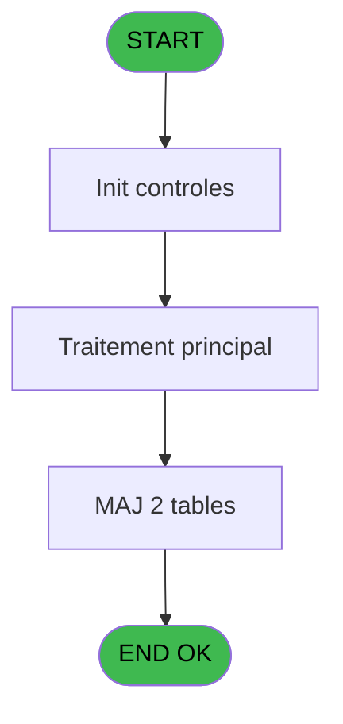

# REF IDE 751 - suppress gmrecherche

> **Analyse**: Phases 1-4 2026-02-03 14:09 -> 14:09 (15s) | Assemblage 14:09
> **Pipeline**: V7.2 Enrichi
> **Structure**: 4 onglets (Resume | Ecrans | Donnees | Connexions)

<!-- TAB:Resume -->

## 1. FICHE D'IDENTITE

| Attribut | Valeur |
|----------|--------|
| Projet | REF |
| IDE Position | 751 |
| Nom Programme | suppress gmrecherche |
| Fichier source | `Prg_751.xml` |
| Dossier IDE | Consultation |
| Taches | 3 (0 ecrans visibles) |
| Tables modifiees | 2 |
| Programmes appeles | 0 |

## 2. DESCRIPTION FONCTIONNELLE

**suppress gmrecherche** assure la gestion complete de ce processus, accessible depuis [lancement reparation (IDE 749)](REF-IDE-749.md).

Le flux de traitement s'organise en **3 blocs fonctionnels** :

- **Creation** (1 tache) : insertion d'enregistrements en base (mouvements, prestations)
- **Traitement** (1 tache) : traitements metier divers
- **Consultation** (1 tache) : ecrans de recherche, selection et consultation

**Donnees modifiees** : 2 tables en ecriture (gm-recherche_____gmr, t).

Detail : phases du traitement

#### Phase 1 : Consultation (1 tache)

- **751** - suppress gmrecherche

#### Phase 2 : Traitement (1 tache)

- **751.1** - gmr **[[ECRAN]](#ecran-t2)**

#### Phase 3 : Creation (1 tache)

- **751.1.1** - ajout dans trace

#### Tables impactees

| Table | Operations | Role metier |
|-------|-----------|-------------|
| t | **W**/L (2 usages) |  |
| gm-recherche_____gmr | **W** (1 usages) | Index de recherche |

## 3. BLOCS FONCTIONNELS

### 3.1 Consultation (1 tache)

Ecrans de recherche et consultation.

---

#### 751 - suppress gmrecherche

**Role** : Traitement : suppress gmrecherche.

### 3.2 Traitement (1 tache)

Traitements internes.

---

#### 751.1 - gmr [[ECRAN]](#ecran-t2)

**Role** : Traitement interne.
**Ecran** : 375 x 23 DLU (MDI) | [Voir mockup](#ecran-t2)

### 3.3 Creation (1 tache)

Insertion de nouveaux enregistrements en base.

---

#### 751.1.1 - ajout dans trace

**Role** : Creation d'enregistrement : ajout dans trace.

## 5. REGLES METIER

*(Aucune regle metier identifiee)*

## 6. CONTEXTE

- **Appele par**: [lancement reparation (IDE 749)](REF-IDE-749.md)
- **Appelle**: 0 programmes | **Tables**: 3 (W:2 R:1 L:1) | **Taches**: 3 | **Expressions**: 1

<!-- TAB:Ecrans -->

## 8. ECRANS

*(Programme sans ecran visible)*

## 9. NAVIGATION

### 9.3 Structure hierarchique (3 taches)

| Position | Tache | Type | Dimensions | Bloc |
|----------|-------|------|------------|------|
| **751.1** | [**suppress gmrecherche** (751)](#t1) | MDI | - | Consultation |
| **751.2** | [**gmr** (751.1)](#t2) [mockup](#ecran-t2) | MDI | 375x23 | Traitement |
| **751.3** | [**ajout dans trace** (751.1.1)](#t3) | MDI | - | Creation |

### 9.4 Algorigramme

> **Legende**: Vert = START/END OK | Rouge = END KO | Bleu = Decisions
> *Algorigramme auto-genere. Utiliser `/algorigramme` pour une synthese metier detaillee.*

<!-- TAB:Donnees -->

## 10. TABLES

### Tables utilisees (3)

| ID | Nom | Description | Type | R | W | L | Usages |
|----|-----|-------------|------|---|---|---|--------|
| 30 | gm-recherche_____gmr | Index de recherche | DB |   | **W** |   | 1 |
| 808 | Selection des noms a supprimer |  | DB | R |   |   | 1 |
| 810 | t |  | DB |   | **W** | L | 2 |

### Colonnes par table (1 / 3 tables avec colonnes identifiees)

Table 30 - gm-recherche_____gmr (**W**) - 1 usages

*Table utilisee uniquement en Link ou aucune colonne Real identifiee dans le DataView.*

Table 808 - Selection des noms a supprimer (R) - 1 usages

| Lettre | Variable | Acces | Type |
|--------|----------|-------|------|
| A | V. Nombre de gm's supprimes | R | Numeric |
| B | V. code adherent | R | Numeric |

Table 810 - t (**W**/L) - 2 usages

*Table utilisee uniquement en Link ou aucune colonne Real identifiee dans le DataView.*

## 11. VARIABLES

### 11.1 Variables de session (2)

Variables persistantes pendant toute la session.

| Lettre | Nom | Type | Usage dans |
|--------|-----|------|-----------|
| A | V. Nombre de gm's supprimes | Numeric | - |
| B | V. code adherent | Numeric | - |

## 12. EXPRESSIONS

**1 / 1 expressions decodees (100%)**

### 12.1 Repartition par type

| Type | Expressions | Regles |
|------|-------------|--------|
| OTHER | 1 | 0 |

### 12.2 Expressions cles par type

#### OTHER (1 expressions)

| Type | IDE | Expression | Regle |
|------|-----|------------|-------|
| OTHER | 1 | `Counter (0)` | - |

<!-- TAB:Connexions -->

## 13. GRAPHE D'APPELS

### 13.1 Chaine depuis Main (Callers)

Main -> ... -> [lancement reparation (IDE 749)](REF-IDE-749.md) -> **suppress gmrecherche (IDE 751)**

### 13.2 Callers

| IDE | Nom Programme | Nb Appels |
|-----|---------------|-----------|
| [749](REF-IDE-749.md) | lancement reparation | 1 |

### 13.3 Callees (programmes appeles)

### 13.4 Detail Callees avec contexte

| IDE | Nom Programme | Appels | Contexte |
|-----|---------------|--------|----------|
| - | (aucun) | - | - |

## 14. RECOMMANDATIONS MIGRATION

### 14.1 Profil du programme

| Metrique | Valeur | Impact migration |
|----------|--------|-----------------|
| Lignes de logique | 16 | Programme compact |
| Expressions | 1 | Peu de logique |
| Tables WRITE | 2 | Impact faible |
| Sous-programmes | 0 | Peu de dependances |
| Ecrans visibles | 0 | Ecran unique ou traitement batch |
| Code desactive | 0% (0 / 16) | Code sain |
| Regles metier | 0 | Pas de regle identifiee |

### 14.2 Plan de migration par bloc

#### Consultation (1 tache: 0 ecran, 1 traitement)

- **Strategie** : Composants de recherche/selection en modales.

#### Traitement (1 tache: 1 ecran, 0 traitement)

- **Strategie** : 1 composant(s) UI (Razor/React) avec formulaires et validation.
- Decomposer les taches en services unitaires testables.

#### Creation (1 tache: 0 ecran, 1 traitement)

- **Strategie** : Repository pattern avec Entity Framework Core.
- Insertion via `IRepository<T>.CreateAsync()`

### 14.3 Dependances critiques

| Dependance | Type | Appels | Impact |
|------------|------|--------|--------|
| gm-recherche_____gmr | Table WRITE (Database) | 1x | Schema + repository |
| t | Table WRITE (Database) | 1x | Schema + repository |

---
*Spec DETAILED generee par Pipeline V7.2 - 2026-02-03 14:09*
