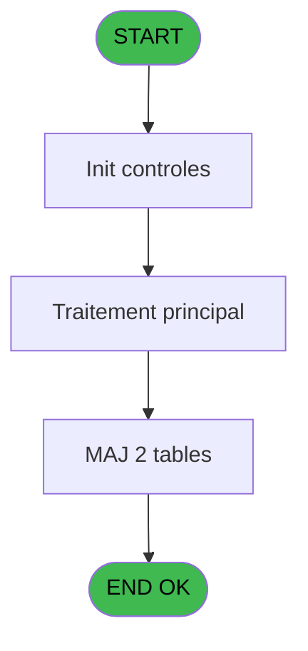

# REF IDE 752 - suppress gmcomplet

> **Analyse**: Phases 1-4 2026-02-03 14:09 -> 14:09 (15s) | Assemblage 14:09
> **Pipeline**: V7.2 Enrichi
> **Structure**: 4 onglets (Resume | Ecrans | Donnees | Connexions)

<!-- TAB:Resume -->

## 1. FICHE D'IDENTITE

| Attribut | Valeur |
|----------|--------|
| Projet | REF |
| IDE Position | 752 |
| Nom Programme | suppress gmcomplet |
| Fichier source | `Prg_752.xml` |
| Dossier IDE | General |
| Taches | 3 (0 ecrans visibles) |
| Tables modifiees | 2 |
| Programmes appeles | 0 |

## 2. DESCRIPTION FONCTIONNELLE

**suppress gmcomplet** assure la gestion complete de ce processus, accessible depuis [lancement reparation (IDE 749)](REF-IDE-749.md).

Le flux de traitement s'organise en **2 blocs fonctionnels** :

- **Traitement** (2 taches) : traitements metier divers
- **Creation** (1 tache) : insertion d'enregistrements en base (mouvements, prestations)

**Donnees modifiees** : 2 tables en ecriture (gm-complet_______gmc, GM-complet       supprime).

Detail : phases du traitement

#### Phase 1 : Traitement (2 taches)

- **752** - suppress gmcomplet
- **752.1** - gmc **[[ECRAN]](#ecran-t2)**

#### Phase 2 : Creation (1 tache)

- **752.1.1** - ajout dans trace

#### Tables impactees

| Table | Operations | Role metier |
|-------|-----------|-------------|
| GM-complet       supprime | **W**/L (2 usages) |  |
| gm-complet_______gmc | **W** (1 usages) |  |

## 3. BLOCS FONCTIONNELS

### 3.1 Traitement (2 taches)

Traitements internes.

---

#### 752 - suppress gmcomplet

**Role** : Traitement : suppress gmcomplet.

---

#### 752.1 - gmc [[ECRAN]](#ecran-t2)

**Role** : Traitement interne.
**Ecran** : 375 x 23 DLU (MDI) | [Voir mockup](#ecran-t2)

### 3.2 Creation (1 tache)

Insertion de nouveaux enregistrements en base.

---

#### 752.1.1 - ajout dans trace

**Role** : Creation d'enregistrement : ajout dans trace.

## 5. REGLES METIER

*(Aucune regle metier identifiee)*

## 6. CONTEXTE

- **Appele par**: [lancement reparation (IDE 749)](REF-IDE-749.md)
- **Appelle**: 0 programmes | **Tables**: 3 (W:2 R:1 L:1) | **Taches**: 3 | **Expressions**: 1

<!-- TAB:Ecrans -->

## 8. ECRANS

*(Programme sans ecran visible)*

## 9. NAVIGATION

### 9.3 Structure hierarchique (3 taches)

| Position | Tache | Type | Dimensions | Bloc |
|----------|-------|------|------------|------|
| **752.1** | [**suppress gmcomplet** (752)](#t1) | MDI | - | Traitement |
| 752.1.1 | [gmc (752.1)](#t2) [mockup](#ecran-t2) | MDI | 375x23 | |
| **752.2** | [**ajout dans trace** (752.1.1)](#t3) | MDI | - | Creation |

### 9.4 Algorigramme

> **Legende**: Vert = START/END OK | Rouge = END KO | Bleu = Decisions
> *Algorigramme auto-genere. Utiliser `/algorigramme` pour une synthese metier detaillee.*

<!-- TAB:Donnees -->

## 10. TABLES

### Tables utilisees (3)

| ID | Nom | Description | Type | R | W | L | Usages |
|----|-----|-------------|------|---|---|---|--------|
| 31 | gm-complet_______gmc |  | DB |   | **W** |   | 1 |
| 808 | Selection des noms a supprimer |  | DB | R |   |   | 1 |
| 811 | GM-complet       supprime |  | DB |   | **W** | L | 2 |

### Colonnes par table (1 / 3 tables avec colonnes identifiees)

Table 31 - gm-complet_______gmc (**W**) - 1 usages

*Table utilisee uniquement en Link ou aucune colonne Real identifiee dans le DataView.*

Table 808 - Selection des noms a supprimer (R) - 1 usages

*Table utilisee uniquement en Link ou aucune colonne Real identifiee dans le DataView.*

Table 811 - GM-complet       supprime (**W**/L) - 2 usages

| Lettre | Variable | Acces | Type |
|--------|----------|-------|------|
| A | V. Nombre de gm's supprimes | W | Numeric |

## 11. VARIABLES

*(Programme sans variables locales mappees)*

## 12. EXPRESSIONS

**1 / 1 expressions decodees (100%)**

### 12.1 Repartition par type

| Type | Expressions | Regles |
|------|-------------|--------|
| OTHER | 1 | 0 |

### 12.2 Expressions cles par type

#### OTHER (1 expressions)

| Type | IDE | Expression | Regle |
|------|-----|------------|-------|
| OTHER | 1 | `Counter (0)` | - |

<!-- TAB:Connexions -->

## 13. GRAPHE D'APPELS

### 13.1 Chaine depuis Main (Callers)

Main -> ... -> [lancement reparation (IDE 749)](REF-IDE-749.md) -> **suppress gmcomplet (IDE 752)**

### 13.2 Callers

| IDE | Nom Programme | Nb Appels |
|-----|---------------|-----------|
| [749](REF-IDE-749.md) | lancement reparation | 1 |

### 13.3 Callees (programmes appeles)

### 13.4 Detail Callees avec contexte

| IDE | Nom Programme | Appels | Contexte |
|-----|---------------|--------|----------|
| - | (aucun) | - | - |

## 14. RECOMMANDATIONS MIGRATION

### 14.1 Profil du programme

| Metrique | Valeur | Impact migration |
|----------|--------|-----------------|
| Lignes de logique | 15 | Programme compact |
| Expressions | 1 | Peu de logique |
| Tables WRITE | 2 | Impact faible |
| Sous-programmes | 0 | Peu de dependances |
| Ecrans visibles | 0 | Ecran unique ou traitement batch |
| Code desactive | 0% (0 / 15) | Code sain |
| Regles metier | 0 | Pas de regle identifiee |

### 14.2 Plan de migration par bloc

#### Traitement (2 taches: 1 ecran, 1 traitement)

- **Strategie** : Orchestrateur avec 1 ecrans (Razor/React) et 1 traitements backend (services).
- Les ecrans deviennent des composants UI, les traitements invisibles deviennent des services injectables.
- Decomposer les taches en services unitaires testables.

#### Creation (1 tache: 0 ecran, 1 traitement)

- **Strategie** : Repository pattern avec Entity Framework Core.
- Insertion via `IRepository<T>.CreateAsync()`

### 14.3 Dependances critiques

| Dependance | Type | Appels | Impact |
|------------|------|--------|--------|
| gm-complet_______gmc | Table WRITE (Database) | 1x | Schema + repository |
| GM-complet       supprime | Table WRITE (Database) | 1x | Schema + repository |

---
*Spec DETAILED generee par Pipeline V7.2 - 2026-02-03 14:09*
