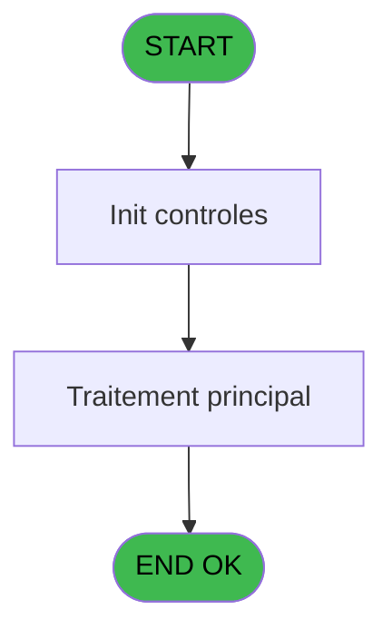

# REF IDE 763 - Lect_user_logue/Set terminal

> **Analyse**: Phases 1-4 2026-02-03 14:13 -> 14:13 (14s) | Assemblage 14:13
> **Pipeline**: V7.2 Enrichi
> **Structure**: 4 onglets (Resume | Ecrans | Donnees | Connexions)

<!-- TAB:Resume -->

## 1. FICHE D'IDENTITE

| Attribut | Valeur |
|----------|--------|
| Projet | REF |
| IDE Position | 763 |
| Nom Programme | Lect_user_logue/Set terminal |
| Fichier source | `Prg_763.xml` |
| Dossier IDE | General |
| Taches | 2 (0 ecrans visibles) |
| Tables modifiees | 0 |
| Programmes appeles | 1 |

## 2. DESCRIPTION FONCTIONNELLE

**Lect_user_logue/Set terminal** assure la gestion complete de ce processus, accessible depuis [Main Program (IDE 1)](REF-IDE-1.md).

Le flux de traitement s'organise en **1 blocs fonctionnels** :

- **Traitement** (2 taches) : traitements metier divers

## 3. BLOCS FONCTIONNELS

### 3.1 Traitement (2 taches)

Traitements internes.

---

#### 763 - Lect_user_logue/St terrrminal

**Role** : Traitement : Lect_user_logue/St terrrminal.

---

#### 763.1 - Get term /t TPE

**Role** : Consultation/chargement : Get term /t TPE.
**Variables liees** : D (v.Terminal boutique ?), G (v.Terminal lié au service ?)

## 5. REGLES METIER

*(Aucune regle metier identifiee)*

## 6. CONTEXTE

- **Appele par**: [Main Program (IDE 1)](REF-IDE-1.md)
- **Appelle**: 1 programmes | **Tables**: 6 (W:0 R:2 L:4) | **Taches**: 2 | **Expressions**: 8

<!-- TAB:Ecrans -->

## 8. ECRANS

*(Programme sans ecran visible)*

## 9. NAVIGATION

### 9.3 Structure hierarchique (2 taches)

| Position | Tache | Type | Dimensions | Bloc |
|----------|-------|------|------------|------|
| **763.1** | [**Lect_user_logue/St terrrminal** (763)](#t1) | - | - | Traitement |
| 763.1.1 | [Get term /t TPE (763.1)](#t2) | - | - | |

### 9.4 Algorigramme

> **Legende**: Vert = START/END OK | Rouge = END KO | Bleu = Decisions
> *Algorigramme auto-genere. Utiliser `/algorigramme` pour une synthese metier detaillee.*

<!-- TAB:Donnees -->

## 10. TABLES

### Tables utilisees (6)

| ID | Nom | Description | Type | R | W | L | Usages |
|----|-----|-------------|------|---|---|---|--------|
| 256 | terminaux_boutique |  | DB | R |   |   | 1 |
| 257 | numero_des_terminaux_ims |  | DB |   |   | L | 1 |
| 703 | groupe___________grp |  | DB | R |   |   | 1 |
| 712 | services_ims_par_pc | Services / filieres | DB |   |   | L | 1 |
| 718 | utilisateur______uti |  | DB |   |   | L | 1 |
| 834 | tpe_par_terminal |  | DB |   |   | L | 1 |

### Colonnes par table (3 / 2 tables avec colonnes identifiees)

Table 256 - terminaux_boutique (R) - 1 usages

| Lettre | Variable | Acces | Type |
|--------|----------|-------|------|
| A | v.TPE actif ? | R | Logical |
| B | v.Terminal OK ? | R | Logical |
| C | v.Service terminal OK ? | R | Logical |
| D | v.Terminal boutique ? | R | Logical |
| E | v.Coffre 2 ? | R | Logical |
| F | v.Responsable financier ? | R | Logical |
| G | v.Terminal lié au service ? | R | Logical |

Table 703 - groupe___________grp (R) - 1 usages

| Lettre | Variable | Acces | Type |
|--------|----------|-------|------|
| A | p.o.Login | R | Unicode |
| B | p.o.User | R | Unicode |
| C | p.o.Groupe | R | Unicode |

## 11. VARIABLES

### 11.1 Parametres entrants (3)

Variables recues du programme appelant ([Main Program (IDE 1)](REF-IDE-1.md)).

| Lettre | Nom | Type | Usage dans |
|--------|-----|------|-----------|
| A | p.o.Login | Unicode | - |
| B | p.o.User | Unicode | - |
| C | p.o.Groupe | Unicode | - |

### 11.2 Variables de session (4)

Variables persistantes pendant toute la session.

| Lettre | Nom | Type | Usage dans |
|--------|-----|------|-----------|
| D | v.Terminal boutique ? | Logical | 1x session |
| E | v.Coffre 2 ? | Logical | - |
| F | v.Responsable financier ? | Logical | 1x session |
| G | v.Terminal lié au service ? | Logical | - |

## 12. EXPRESSIONS

**8 / 8 expressions decodees (100%)**

### 12.1 Repartition par type

| Type | Expressions | Regles |
|------|-------------|--------|
| OTHER | 4 | 0 |
| NEGATION | 1 | 0 |
| REFERENCE_VG | 1 | 0 |
| CAST_LOGIQUE | 2 | 0 |

### 12.2 Expressions cles par type

#### OTHER (4 expressions)

| Type | IDE | Expression | Regle |
|------|-----|------------|-------|
| OTHER | 3 | `v.Terminal boutique ? [D]` | - |
| OTHER | 6 | `Term ()` | - |
| OTHER | 1 | `v.Responsable financier ? [F]` | - |
| OTHER | 2 | `Translate('%club_user%')` | - |

#### NEGATION (1 expressions)

| Type | IDE | Expression | Regle |
|------|-----|------------|-------|
| NEGATION | 4 | `NOT VG29` | - |

#### REFERENCE_VG (1 expressions)

| Type | IDE | Expression | Regle |
|------|-----|------------|-------|
| REFERENCE_VG | 5 | `VG29` | - |

#### CAST_LOGIQUE (2 expressions)

| Type | IDE | Expression | Regle |
|------|-----|------------|-------|
| CAST_LOGIQUE | 7 | `INIPut('[MAGIC_LOGICAL_NAMES]term='&Trim(Str(VG31,'3')),'FALSE'LOG)` | - |
| CAST_LOGIQUE | 8 | `INIPut('[MAGIC_LOGICAL_NAMES]term='&GetShortHostname (),'FALSE'LOG)` | - |

<!-- TAB:Connexions -->

## 13. GRAPHE D'APPELS

### 13.1 Chaine depuis Main (Callers)

Main -> ... -> [Main Program (IDE 1)](REF-IDE-1.md) -> **Lect_user_logue/Set terminal (IDE 763)**

### 13.2 Callers

| IDE | Nom Programme | Nb Appels |
|-----|---------------|-----------|
| [1](REF-IDE-1.md) | Main Program | 2 |

### 13.3 Callees (programmes appeles)

### 13.4 Detail Callees avec contexte

| IDE | Nom Programme | Appels | Contexte |
|-----|---------------|--------|----------|
| [744](REF-IDE-744.md) | Verif activation version | 1 | Controle/validation |

## 14. RECOMMANDATIONS MIGRATION

### 14.1 Profil du programme

| Metrique | Valeur | Impact migration |
|----------|--------|-----------------|
| Lignes de logique | 82 | Programme compact |
| Expressions | 8 | Peu de logique |
| Tables WRITE | 0 | Impact faible |
| Sous-programmes | 1 | Peu de dependances |
| Ecrans visibles | 0 | Ecran unique ou traitement batch |
| Code desactive | 0% (0 / 82) | Code sain |
| Regles metier | 0 | Pas de regle identifiee |

### 14.2 Plan de migration par bloc

#### Traitement (2 taches: 0 ecran, 2 traitements)

- **Strategie** : 2 service(s) backend injectable(s) (Domain Services).
- 1 sous-programme(s) a migrer ou a reutiliser depuis les services existants.
- Decomposer les taches en services unitaires testables.

### 14.3 Dependances critiques

| Dependance | Type | Appels | Impact |
|------------|------|--------|--------|
| [Verif activation version (IDE 744)](REF-IDE-744.md) | Sous-programme | 1x | Normale - Controle/validation |

---
*Spec DETAILED generee par Pipeline V7.2 - 2026-02-03 14:13*
