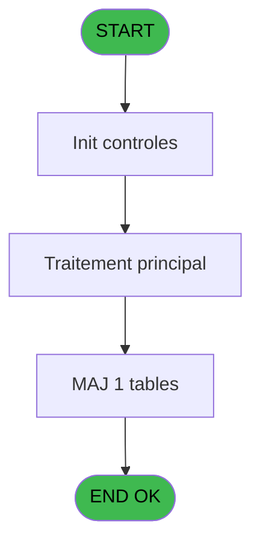
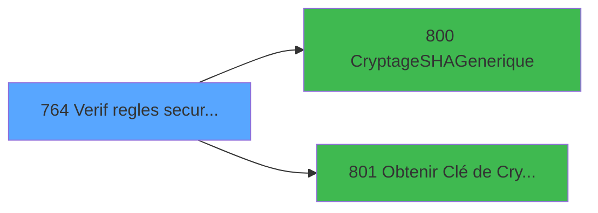

# REF IDE 764 - Verif regles securite crypté

> **Analyse**: Phases 1-4 2026-02-03 14:13 -> 14:14 (14s) | Assemblage 14:14
> **Pipeline**: V7.2 Enrichi
> **Structure**: 4 onglets (Resume | Ecrans | Donnees | Connexions)

<!-- TAB:Resume -->

## 1. FICHE D'IDENTITE

| Attribut | Valeur |
|----------|--------|
| Projet | REF |
| IDE Position | 764 |
| Nom Programme | Verif regles securite crypté |
| Fichier source | `Prg_764.xml` |
| Dossier IDE | General |
| Taches | 7 (0 ecrans visibles) |
| Tables modifiees | 1 |
| Programmes appeles | 2 |
| :warning: Statut | **ORPHELIN_POTENTIEL** |

## 2. DESCRIPTION FONCTIONNELLE

**Verif regles securite crypté** assure la gestion complete de ce processus.

Le flux de traitement s'organise en **4 blocs fonctionnels** :

- **Validation** (3 taches) : controles et verifications de coherence
- **Traitement** (2 taches) : traitements metier divers
- **Creation** (1 tache) : insertion d'enregistrements en base (mouvements, prestations)
- **Reglement** (1 tache) : gestion des moyens de paiement et reglements

**Donnees modifiees** : 1 tables en ecriture (password_historique).

Detail : phases du traitement

#### Phase 1 : Reglement (1 tache)

- **764** - Verif regles securite crypté

#### Phase 2 : Validation (3 taches)

- **764.1** - Verif pwd interdit
- **764.3** - Verifie histo
- **764.6** - Verif existence liste **[[ECRAN]](#ecran-t7)**

#### Phase 3 : Traitement (2 taches)

- **764.2** - Lect histo
- **764.4** - traite chaine

Delegue a : [CryptageSHAGenerique (IDE 800)](REF-IDE-800.md), [Obtenir Clé de Cryptage (IDE 801)](REF-IDE-801.md)

#### Phase 4 : Creation (1 tache)

- **764.5** - Creation histo

#### Tables impactees

| Table | Operations | Role metier |
|-------|-----------|-------------|
| password_historique | R/**W**/L (4 usages) | Historique / journal |

## 3. BLOCS FONCTIONNELS

### 3.1 Reglement (1 tache)

Gestion des moyens de paiement : 1 tache de reglement.

---

#### 764 - Verif regles securite crypté

**Role** : Verification : Verif regles securite crypté.
**Variables liees** : A (P.Regles ok ?), J (V.MDP Crypté)

### 3.2 Validation (3 taches)

Controles de coherence : 3 taches verifient les donnees et conditions.

---

#### 764.1 - Verif pwd interdit

**Role** : Verification : Verif pwd interdit.

---

#### 764.3 - Verifie histo

**Role** : Verification : Verifie histo.
**Variables liees** : D (P.Controle histo ?), F (V.Existe histo ?)

---

#### 764.6 - Verif existence liste [[ECRAN]](#ecran-t7)

**Role** : Verification : Verif existence liste.
**Ecran** : 120 x 195 DLU | [Voir mockup](#ecran-t7)
**Variables liees** : H (V.User existe dans liste ?)

### 3.3 Traitement (2 taches)

Traitements internes.

---

#### 764.2 - Lect histo

**Role** : Traitement : Lect histo.
**Variables liees** : D (P.Controle histo ?), F (V.Existe histo ?)
**Delegue a** : [CryptageSHAGenerique (IDE 800)](REF-IDE-800.md), [Obtenir Clé de Cryptage (IDE 801)](REF-IDE-801.md)

---

#### 764.4 - traite chaine

**Role** : Traitement : traite chaine.
**Delegue a** : [CryptageSHAGenerique (IDE 800)](REF-IDE-800.md), [Obtenir Clé de Cryptage (IDE 801)](REF-IDE-801.md)

### 3.4 Creation (1 tache)

Insertion de nouveaux enregistrements en base.

---

#### 764.5 - Creation histo

**Role** : Creation d'enregistrement : Creation histo.
**Variables liees** : D (P.Controle histo ?), F (V.Existe histo ?)

## 5. REGLES METIER

*(Aucune regle metier identifiee)*

## 6. CONTEXTE

- **Appele par**: (aucun)
- **Appelle**: 2 programmes | **Tables**: 3 (W:1 R:3 L:1) | **Taches**: 7 | **Expressions**: 18

<!-- TAB:Ecrans -->

## 8. ECRANS

*(Programme sans ecran visible)*

## 9. NAVIGATION

### 9.3 Structure hierarchique (7 taches)

| Position | Tache | Type | Dimensions | Bloc |
|----------|-------|------|------------|------|
| **764.1** | [**Verif regles securite crypté** (764)](#t1) | - | - | Reglement |
| **764.2** | [**Verif pwd interdit** (764.1)](#t2) | - | - | Validation |
| 764.2.1 | [Verifie histo (764.3)](#t4) | - | - | |
| 764.2.2 | [Verif existence liste (764.6)](#t7) [mockup](#ecran-t7) | - | 120x195 | |
| **764.3** | [**Lect histo** (764.2)](#t3) | - | - | Traitement |
| 764.3.1 | [traite chaine (764.4)](#t5) | - | - | |
| **764.4** | [**Creation histo** (764.5)](#t6) | - | - | Creation |

### 9.4 Algorigramme

> **Legende**: Vert = START/END OK | Rouge = END KO | Bleu = Decisions
> *Algorigramme auto-genere. Utiliser `/algorigramme` pour une synthese metier detaillee.*

<!-- TAB:Donnees -->

## 10. TABLES

### Tables utilisees (3)

| ID | Nom | Description | Type | R | W | L | Usages |
|----|-----|-------------|------|---|---|---|--------|
| 747 | regles_securite |  | DB | R |   |   | 1 |
| 748 | password_interdit |  | DB | R |   |   | 1 |
| 749 | password_historique | Historique / journal | DB | R | **W** | L | 4 |

### Colonnes par table (3 / 3 tables avec colonnes identifiees)

Table 747 - regles_securite (R) - 1 usages

| Lettre | Variable | Acces | Type |
|--------|----------|-------|------|
| A | P.Regles ok ? | R | Logical |

Table 748 - password_interdit (R) - 1 usages

| Lettre | Variable | Acces | Type |
|--------|----------|-------|------|
| C | P.Password | R | Unicode |

Table 749 - password_historique (R/**W**/L) - 4 usages

| Lettre | Variable | Acces | Type |
|--------|----------|-------|------|
| C | P.Password | W | Unicode |

## 11. VARIABLES

### 11.1 Parametres entrants (4)

Variables recues en parametre.

| Lettre | Nom | Type | Usage dans |
|--------|-----|------|-----------|
| A | P.Regles ok ? | Logical | 2x parametre entrant |
| B | P.User | Unicode | 2x parametre entrant |
| C | P.Password | Unicode | 2x parametre entrant |
| D | P.Controle histo ? | Logical | [764.2](#t3), [764.3](#t4), [764.5](#t6) |

### 11.2 Variables de session (6)

Variables persistantes pendant toute la session.

| Lettre | Nom | Type | Usage dans |
|--------|-----|------|-----------|
| E | V.Message erreur | Alpha | 1x session |
| F | V.Existe histo ? | Logical | [764.2](#t3), [764.3](#t4), [764.5](#t6) |
| G | V.Existe provisoire ? | Logical | 5x session |
| H | V.User existe dans liste ? | Logical | - |
| I | V.Clé de Cryptrage | Blob | 2x session |
| J | V.MDP Crypté | Alpha | - |

## 12. EXPRESSIONS

**18 / 18 expressions decodees (100%)**

### 12.1 Repartition par type

| Type | Expressions | Regles |
|------|-------------|--------|
| CONSTANTE | 2 | 0 |
| NEGATION | 1 | 0 |
| CONDITION | 8 | 0 |
| CAST_LOGIQUE | 2 | 0 |
| OTHER | 4 | 0 |
| FORMAT | 1 | 0 |

### 12.2 Expressions cles par type

#### CONSTANTE (2 expressions)

| Type | IDE | Expression | Regle |
|------|-----|------------|-------|
| CONSTANTE | 18 | `'PASSWORD'` | - |
| CONSTANTE | 15 | `0` | - |

#### NEGATION (1 expressions)

| Type | IDE | Expression | Regle |
|------|-----|------------|-------|
| NEGATION | 1 | `NOT P.Regles ok ? [A]` | - |

#### CONDITION (8 expressions)

| Type | IDE | Expression | Regle |
|------|-----|------------|-------|
| CONDITION | 7 | `(V.Existe histo ? [F]='MAJ' OR V.Existe histo ? [F]='NUMERIC' OR V.Existe histo ? [F]='SPEC' OR V.Existe histo ? [F]='ALPHA') AND V.Existe provisoire ? [G]<>0` | - |
| CONDITION | 6 | `V.Existe histo ? [F]='NBRHISTO' AND P.Controle histo ? [D]` | - |
| CONDITION | 11 | `Len(Trim(P.Password [C]))<V.Existe provisoire ? [G]` | - |
| CONDITION | 9 | `Trim(P.User [B])=Trim(P.Password [C])` | - |
| CONDITION | 3 | `V.Existe histo ? [F]='LOGIN' AND V.Existe provisoire ? [G]<>0` | - |
| ... | | *+3 autres* | |

#### CAST_LOGIQUE (2 expressions)

| Type | IDE | Expression | Regle |
|------|-----|------------|-------|
| CAST_LOGIQUE | 13 | `'TRUE'LOG` | - |
| CAST_LOGIQUE | 8 | `'FALSE'LOG` | - |

#### OTHER (4 expressions)

| Type | IDE | Expression | Regle |
|------|-----|------------|-------|
| OTHER | 16 | `V.Clé de Cryptrage [I] AND NOT [N]` | - |
| OTHER | 17 | `P.Regles ok ? [A] AND NOT V.Clé de Cryptrage [I]` | - |
| OTHER | 12 | `V.Message erreur [E]` | - |
| OTHER | 14 | `P.User [B]` | - |

#### FORMAT (1 expressions)

| Type | IDE | Expression | Regle |
|------|-----|------------|-------|
| FORMAT | 10 | `RepStr(MlsTrans(V.User existe dans lis... [H]),'%1',Trim(Str(V.Existe provisoire ? [G],'4')))` | - |

<!-- TAB:Connexions -->

## 13. GRAPHE D'APPELS

### 13.1 Chaine depuis Main (Callers)

**Chemin**: (pas de callers directs)

### 13.2 Callers

| IDE | Nom Programme | Nb Appels |
|-----|---------------|-----------|
| - | (aucun) | - |

### 13.3 Callees (programmes appeles)

### 13.4 Detail Callees avec contexte

| IDE | Nom Programme | Appels | Contexte |
|-----|---------------|--------|----------|
| [800](REF-IDE-800.md) | CryptageSHAGenerique | 1 | Sous-programme |
| [801](REF-IDE-801.md) | Obtenir Clé de Cryptage | 1 | Sous-programme |

## 14. RECOMMANDATIONS MIGRATION

### 14.1 Profil du programme

| Metrique | Valeur | Impact migration |
|----------|--------|-----------------|
| Lignes de logique | 123 | Programme compact |
| Expressions | 18 | Peu de logique |
| Tables WRITE | 1 | Impact faible |
| Sous-programmes | 2 | Peu de dependances |
| Ecrans visibles | 0 | Ecran unique ou traitement batch |
| Code desactive | 0% (0 / 123) | Code sain |
| Regles metier | 0 | Pas de regle identifiee |

### 14.2 Plan de migration par bloc

#### Reglement (1 tache: 0 ecran, 1 traitement)

- **Strategie** : Service `IReglementService` avec pattern Strategy par mode de paiement.
- Integration TPE si applicable

#### Validation (3 taches: 1 ecran, 2 traitements)

- **Strategie** : FluentValidation avec validators specifiques.
- Chaque tache de validation -> un validator injectable

#### Traitement (2 taches: 0 ecran, 2 traitements)

- **Strategie** : 2 service(s) backend injectable(s) (Domain Services).
- 2 sous-programme(s) a migrer ou a reutiliser depuis les services existants.
- Decomposer les taches en services unitaires testables.

#### Creation (1 tache: 0 ecran, 1 traitement)

- **Strategie** : Repository pattern avec Entity Framework Core.
- Insertion via `IRepository<T>.CreateAsync()`

### 14.3 Dependances critiques

| Dependance | Type | Appels | Impact |
|------------|------|--------|--------|
| password_historique | Table WRITE (Database) | 1x | Schema + repository |
| [Obtenir Clé de Cryptage (IDE 801)](REF-IDE-801.md) | Sous-programme | 1x | Normale - Sous-programme |
| [CryptageSHAGenerique (IDE 800)](REF-IDE-800.md) | Sous-programme | 1x | Normale - Sous-programme |

---
*Spec DETAILED generee par Pipeline V7.2 - 2026-02-03 14:14*
