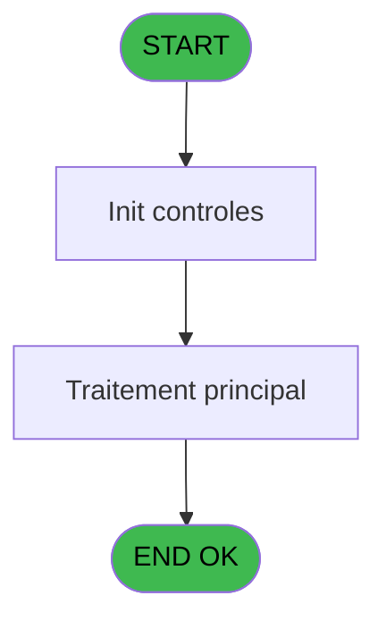
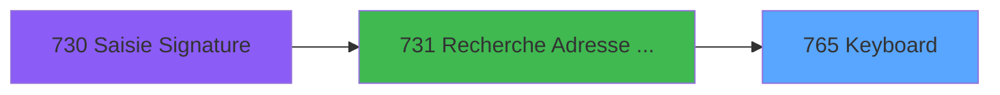
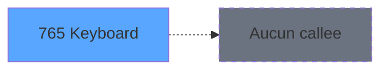

# REF IDE 765 - Keyboard

> **Analyse**: Phases 1-4 2026-02-03 14:14 -> 14:14 (15s) | Assemblage 14:14
> **Pipeline**: V7.2 Enrichi
> **Structure**: 4 onglets (Resume | Ecrans | Donnees | Connexions)

<!-- TAB:Resume -->

## 1. FICHE D'IDENTITE

| Attribut | Valeur |
|----------|--------|
| Projet | REF |
| IDE Position | 765 |
| Nom Programme | Keyboard |
| Fichier source | `Prg_765.xml` |
| Dossier IDE | General |
| Taches | 2 (1 ecrans visibles) |
| Tables modifiees | 0 |
| Programmes appeles | 0 |

## 2. DESCRIPTION FONCTIONNELLE

**Keyboard** assure la gestion complete de ce processus, accessible depuis [Recherche Adresse Mail (IDE 731)](REF-IDE-731.md).

Le flux de traitement s'organise en **2 blocs fonctionnels** :

- **Calcul** (1 tache) : calculs de montants, stocks ou compteurs
- **Traitement** (1 tache) : traitements metier divers

**Logique metier** : 2 regles identifiees couvrant conditions metier.

Detail : phases du traitement

#### Phase 1 : Traitement (1 tache)

- **765** - Keyboard **[[ECRAN]](#ecran-t1)**

#### Phase 2 : Calcul (1 tache)

- **765.1** - Calcul

## 3. BLOCS FONCTIONNELS

### 3.1 Traitement (1 tache)

Traitements internes.

---

#### 765 - Keyboard [[ECRAN]](#ecran-t1)

**Role** : Traitement : Keyboard.
**Ecran** : 613 x 231 DLU (MDI) | [Voir mockup](#ecran-t1)
**Variables liees** : A (P. Saisie keyboard), D (V Keyboard Input), E (V.Keyboard pwd)

### 3.2 Calcul (1 tache)

Calculs metier : montants, stocks, compteurs.

---

#### 765.1 - Calcul

**Role** : Calcul : Calcul.

## 5. REGLES METIER

2 regles identifiees:

### Autres (2 regles)

#### [RM-001] Si P. vient de M(ain) [B]='M' alors 20 sinon 30)

| Element | Detail |
|---------|--------|
| **Condition** | `P. vient de M(ain) [B]='M'` |
| **Si vrai** | 20 |
| **Si faux** | 30) |
| **Variables** | B (P. vient de M(ain)) |
| **Expression source** | Expression 4 : `IF (P. vient de M(ain) [B]='M',20,30)` |
| **Exemple** | Si P. vient de M(ain) [B]='M' → 20. Sinon → 30) |

#### [RM-002] Si L Touche MAJ/Min [F] alors 'MAJ' sinon 'Min')

| Element | Detail |
|---------|--------|
| **Condition** | `L Touche MAJ/Min [F]` |
| **Si vrai** | 'MAJ' |
| **Si faux** | 'Min') |
| **Variables** | F (L Touche MAJ/Min) |
| **Expression source** | Expression 5 : `IF (L Touche MAJ/Min [F],'MAJ','Min')` |
| **Exemple** | Si L Touche MAJ/Min [F] → 'MAJ'. Sinon → 'Min') |

## 6. CONTEXTE

- **Appele par**: [Recherche Adresse Mail (IDE 731)](REF-IDE-731.md)
- **Appelle**: 0 programmes | **Tables**: 0 (W:0 R:0 L:0) | **Taches**: 2 | **Expressions**: 37

<!-- TAB:Ecrans -->

## 8. ECRANS

### 8.1 Forms visibles (1 / 2)

| # | Position | Tache | Nom | Type | Largeur | Hauteur | Bloc |
|---|----------|-------|-----|------|---------|---------|------|
| 1 | 765 | 765 | Keyboard | MDI | 613 | 231 | Traitement |

### 8.2 Mockups Ecrans

---

#### 765 - Keyboard
**Tache** : [765](#t1) | **Type** : MDI | **Dimensions** : 613 x 231 DLU
**Bloc** : Traitement | **Titre IDE** : Keyboard

<!-- FORM-DATA:
{
    "width":  613,
    "vFactor":  8,
    "type":  "MDI",
    "hFactor":  4,
    "controls":  [
                     {
                         "x":  511,
                         "type":  "label",
                         "var":  "",
                         "y":  121,
                         "w":  98,
                         "fmt":  "",
                         "name":  "",
                         "h":  95,
                         "color":  "182",
                         "text":  "",
                         "parent":  null
                     },
                     {
                         "x":  518,
                         "type":  "edit",
                         "var":  "",
                         "y":  130,
                         "w":  84,
                         "fmt":  "",
                         "name":  "",
                         "h":  12,
                         "color":  "144",
                         "text":  "",
                         "parent":  50
                     },
                     {
                         "x":  520,
                         "type":  "button",
                         "var":  "",
                         "y":  147,
                         "w":  82,
                         "fmt":  "\u0026Validate",
                         "name":  "VALID",
                         "h":  24,
                         "color":  "",
                         "text":  "",
                         "parent":  null
                     },
                     {
                         "x":  52,
                         "type":  "button",
                         "var":  "",
                         "y":  130,
                         "w":  44,
                         "fmt":  "A",
                         "name":  "*A",
                         "h":  32,
                         "color":  "",
                         "text":  "",
                         "parent":  null
                     },
                     {
                         "x":  96,
                         "type":  "button",
                         "var":  "",
                         "y":  130,
                         "w":  44,
                         "fmt":  "Z",
                         "name":  "*Z",
                         "h":  32,
                         "color":  "",
                         "text":  "",
                         "parent":  null
                     },
                     {
                         "x":  140,
                         "type":  "button",
                         "var":  "",
                         "y":  130,
                         "w":  44,
                         "fmt":  "E",
                         "name":  "*E",
                         "h":  32,
                         "color":  "",
                         "text":  "",
                         "parent":  null
                     },
                     {
                         "x":  184,
                         "type":  "button",
                         "var":  "",
                         "y":  130,
                         "w":  44,
                         "fmt":  "R",
                         "name":  "*R",
                         "h":  32,
                         "color":  "",
                         "text":  "",
                         "parent":  null
                     },
                     {
                         "x":  228,
                         "type":  "button",
                         "var":  "",
                         "y":  130,
                         "w":  44,
                         "fmt":  "T",
                         "name":  "*T",
                         "h":  32,
                         "color":  "",
                         "text":  "",
                         "parent":  null
                     },
                     {
                         "x":  272,
                         "type":  "button",
                         "var":  "",
                         "y":  130,
                         "w":  44,
                         "fmt":  "Y",
                         "name":  "*Y",
                         "h":  32,
                         "color":  "",
                         "text":  "",
                         "parent":  null
                     },
                     {
                         "x":  316,
                         "type":  "button",
                         "var":  "",
                         "y":  130,
                         "w":  44,
                         "fmt":  "U",
                         "name":  "*U",
                         "h":  32,
                         "color":  "",
                         "text":  "",
                         "parent":  null
                     },
                     {
                         "x":  360,
                         "type":  "button",
                         "var":  "",
                         "y":  130,
                         "w":  44,
                         "fmt":  "I",
                         "name":  "*I",
                         "h":  32,
                         "color":  "",
                         "text":  "",
                         "parent":  null
                     },
                     {
                         "x":  404,
                         "type":  "button",
                         "var":  "",
                         "y":  130,
                         "w":  44,
                         "fmt":  "O",
                         "name":  "*O",
                         "h":  32,
                         "color":  "",
                         "text":  "",
                         "parent":  null
                     },
                     {
                         "x":  448,
                         "type":  "button",
                         "var":  "",
                         "y":  130,
                         "w":  44,
                         "fmt":  "P",
                         "name":  "*P",
                         "h":  32,
                         "color":  "",
                         "text":  "",
                         "parent":  null
                     },
                     {
                         "x":  15,
                         "type":  "button",
                         "var":  "",
                         "y":  162,
                         "w":  52,
                         "fmt":  "MAJ",
                         "name":  "MAJ",
                         "h":  32,
                         "color":  "",
                         "text":  "",
                         "parent":  null
                     },
                     {
                         "x":  67,
                         "type":  "button",
                         "var":  "",
                         "y":  162,
                         "w":  44,
                         "fmt":  "Q",
                         "name":  "*Q",
                         "h":  32,
                         "color":  "",
                         "text":  "",
                         "parent":  null
                     },
                     {
                         "x":  111,
                         "type":  "button",
                         "var":  "",
                         "y":  162,
                         "w":  44,
                         "fmt":  "S",
                         "name":  "*S",
                         "h":  32,
                         "color":  "",
                         "text":  "",
                         "parent":  null
                     },
                     {
                         "x":  155,
                         "type":  "button",
                         "var":  "",
                         "y":  162,
                         "w":  44,
                         "fmt":  "D",
                         "name":  "*D",
                         "h":  32,
                         "color":  "",
                         "text":  "",
                         "parent":  null
                     },
                     {
                         "x":  199,
                         "type":  "button",
                         "var":  "",
                         "y":  162,
                         "w":  44,
                         "fmt":  "F",
                         "name":  "*F",
                         "h":  32,
                         "color":  "",
                         "text":  "",
                         "parent":  null
                     },
                     {
                         "x":  243,
                         "type":  "button",
                         "var":  "",
                         "y":  162,
                         "w":  44,
                         "fmt":  "G",
                         "name":  "*G",
                         "h":  32,
                         "color":  "",
                         "text":  "",
                         "parent":  null
                     },
                     {
                         "x":  287,
                         "type":  "button",
                         "var":  "",
                         "y":  162,
                         "w":  44,
                         "fmt":  "H",
                         "name":  "*H",
                         "h":  32,
                         "color":  "",
                         "text":  "",
                         "parent":  null
                     },
                     {
                         "x":  331,
                         "type":  "button",
                         "var":  "",
                         "y":  162,
                         "w":  44,
                         "fmt":  "J",
                         "name":  "*J",
                         "h":  32,
                         "color":  "",
                         "text":  "",
                         "parent":  null
                     },
                     {
                         "x":  375,
                         "type":  "button",
                         "var":  "",
                         "y":  162,
                         "w":  44,
                         "fmt":  "K",
                         "name":  "*K",
                         "h":  32,
                         "color":  "",
                         "text":  "",
                         "parent":  null
                     },
                     {
                         "x":  419,
                         "type":  "button",
                         "var":  "",
                         "y":  162,
                         "w":  44,
                         "fmt":  "L",
                         "name":  "*L",
                         "h":  32,
                         "color":  "",
                         "text":  "",
                         "parent":  null
                     },
                     {
                         "x":  463,
                         "type":  "button",
                         "var":  "",
                         "y":  162,
                         "w":  44,
                         "fmt":  "M",
                         "name":  "*M",
                         "h":  32,
                         "color":  "",
                         "text":  "",
                         "parent":  null
                     },
                     {
                         "x":  15,
                         "type":  "button",
                         "var":  "",
                         "y":  194,
                         "w":  71,
                         "fmt":  "Clear",
                         "name":  "CLEAR",
                         "h":  32,
                         "color":  "",
                         "text":  "",
                         "parent":  null
                     },
                     {
                         "x":  86,
                         "type":  "button",
                         "var":  "",
                         "y":  194,
                         "w":  44,
                         "fmt":  "W",
                         "name":  "*W",
                         "h":  32,
                         "color":  "",
                         "text":  "",
                         "parent":  null
                     },
                     {
                         "x":  130,
                         "type":  "button",
                         "var":  "",
                         "y":  194,
                         "w":  44,
                         "fmt":  "X",
                         "name":  "*X",
                         "h":  32,
                         "color":  "",
                         "text":  "",
                         "parent":  null
                     },
                     {
                         "x":  174,
                         "type":  "button",
                         "var":  "",
                         "y":  194,
                         "w":  44,
                         "fmt":  "C",
                         "name":  "*C",
                         "h":  32,
                         "color":  "",
                         "text":  "",
                         "parent":  null
                     },
                     {
                         "x":  218,
                         "type":  "button",
                         "var":  "",
                         "y":  194,
                         "w":  44,
                         "fmt":  "V",
                         "name":  "*V",
                         "h":  32,
                         "color":  "",
                         "text":  "",
                         "parent":  null
                     },
                     {
                         "x":  262,
                         "type":  "button",
                         "var":  "",
                         "y":  194,
                         "w":  44,
                         "fmt":  "B",
                         "name":  "*B",
                         "h":  32,
                         "color":  "",
                         "text":  "",
                         "parent":  null
                     },
                     {
                         "x":  306,
                         "type":  "button",
                         "var":  "",
                         "y":  194,
                         "w":  44,
                         "fmt":  "N",
                         "name":  "*N",
                         "h":  32,
                         "color":  "",
                         "text":  "",
                         "parent":  null
                     },
                     {
                         "x":  350,
                         "type":  "button",
                         "var":  "",
                         "y":  194,
                         "w":  40,
                         "fmt":  "-",
                         "name":  "*-",
                         "h":  32,
                         "color":  "",
                         "text":  "",
                         "parent":  null
                     },
                     {
                         "x":  390,
                         "type":  "button",
                         "var":  "",
                         "y":  194,
                         "w":  40,
                         "fmt":  "\u0027",
                         "name":  "*\u0027",
                         "h":  32,
                         "color":  "",
                         "text":  "",
                         "parent":  null
                     },
                     {
                         "x":  430,
                         "type":  "button",
                         "var":  "",
                         "y":  194,
                         "w":  43,
                         "fmt":  "Backspace",
                         "name":  "BACKSPACE",
                         "h":  32,
                         "color":  "",
                         "text":  "",
                         "parent":  null
                     },
                     {
                         "x":  473,
                         "type":  "button",
                         "var":  "",
                         "y":  194,
                         "w":  34,
                         "fmt":  "Space",
                         "name":  "SPACE",
                         "h":  32,
                         "color":  "",
                         "text":  "",
                         "parent":  null
                     },
                     {
                         "x":  520,
                         "type":  "button",
                         "var":  "",
                         "y":  186,
                         "w":  82,
                         "fmt":  "\u0026Exit",
                         "name":  "",
                         "h":  24,
                         "color":  "",
                         "text":  "",
                         "parent":  null
                     },
                     {
                         "x":  34,
                         "type":  "button",
                         "var":  "",
                         "y":  98,
                         "w":  44,
                         "fmt":  "1",
                         "name":  "*1",
                         "h":  32,
                         "color":  "",
                         "text":  "",
                         "parent":  null
                     },
                     {
                         "x":  78,
                         "type":  "button",
                         "var":  "",
                         "y":  98,
                         "w":  44,
                         "fmt":  "2",
                         "name":  "*2",
                         "h":  32,
                         "color":  "",
                         "text":  "",
                         "parent":  null
                     },
                     {
                         "x":  122,
                         "type":  "button",
                         "var":  "",
                         "y":  98,
                         "w":  44,
                         "fmt":  "3",
                         "name":  "*3",
                         "h":  32,
                         "color":  "",
                         "text":  "",
                         "parent":  null
                     },
                     {
                         "x":  166,
                         "type":  "button",
                         "var":  "",
                         "y":  98,
                         "w":  44,
                         "fmt":  "4",
                         "name":  "*4",
                         "h":  32,
                         "color":  "",
                         "text":  "",
                         "parent":  null
                     },
                     {
                         "x":  210,
                         "type":  "button",
                         "var":  "",
                         "y":  98,
                         "w":  44,
                         "fmt":  "5",
                         "name":  "*5",
                         "h":  32,
                         "color":  "",
                         "text":  "",
                         "parent":  null
                     },
                     {
                         "x":  254,
                         "type":  "button",
                         "var":  "",
                         "y":  98,
                         "w":  44,
                         "fmt":  "6",
                         "name":  "*6",
                         "h":  32,
                         "color":  "",
                         "text":  "",
                         "parent":  null
                     },
                     {
                         "x":  298,
                         "type":  "button",
                         "var":  "",
                         "y":  98,
                         "w":  44,
                         "fmt":  "7",
                         "name":  "*7",
                         "h":  32,
                         "color":  "",
                         "text":  "",
                         "parent":  null
                     },
                     {
                         "x":  342,
                         "type":  "button",
                         "var":  "",
                         "y":  98,
                         "w":  44,
                         "fmt":  "8",
                         "name":  "*8",
                         "h":  32,
                         "color":  "",
                         "text":  "",
                         "parent":  null
                     },
                     {
                         "x":  386,
                         "type":  "button",
                         "var":  "",
                         "y":  98,
                         "w":  44,
                         "fmt":  "9",
                         "name":  "*9",
                         "h":  32,
                         "color":  "",
                         "text":  "",
                         "parent":  null
                     },
                     {
                         "x":  430,
                         "type":  "button",
                         "var":  "",
                         "y":  98,
                         "w":  44,
                         "fmt":  "0",
                         "name":  "*0",
                         "h":  32,
                         "color":  "",
                         "text":  "",
                         "parent":  null
                     },
                     {
                         "x":  5,
                         "type":  "button",
                         "var":  "",
                         "y":  34,
                         "w":  44,
                         "fmt":  "~",
                         "name":  "*~",
                         "h":  32,
                         "color":  "",
                         "text":  "",
                         "parent":  null
                     },
                     {
                         "x":  49,
                         "type":  "button",
                         "var":  "",
                         "y":  34,
                         "w":  44,
                         "fmt":  "\"",
                         "name":  "*\"",
                         "h":  32,
                         "color":  "",
                         "text":  "",
                         "parent":  null
                     },
                     {
                         "x":  93,
                         "type":  "button",
                         "var":  "",
                         "y":  34,
                         "w":  44,
                         "fmt":  "{",
                         "name":  "*{",
                         "h":  32,
                         "color":  "",
                         "text":  "",
                         "parent":  null
                     },
                     {
                         "x":  137,
                         "type":  "button",
                         "var":  "",
                         "y":  34,
                         "w":  44,
                         "fmt":  "\\",
                         "name":  "*\\",
                         "h":  32,
                         "color":  "",
                         "text":  "",
                         "parent":  null
                     },
                     {
                         "x":  181,
                         "type":  "button",
                         "var":  "",
                         "y":  34,
                         "w":  44,
                         "fmt":  "@",
                         "name":  "*@",
                         "h":  32,
                         "color":  "",
                         "text":  "",
                         "parent":  null
                     },
                     {
                         "x":  225,
                         "type":  "button",
                         "var":  "",
                         "y":  34,
                         "w":  44,
                         "fmt":  "£",
                         "name":  "*£",
                         "h":  32,
                         "color":  "",
                         "text":  "",
                         "parent":  null
                     },
                     {
                         "x":  269,
                         "type":  "button",
                         "var":  "",
                         "y":  34,
                         "w":  44,
                         "fmt":  "ù",
                         "name":  "*ù",
                         "h":  32,
                         "color":  "",
                         "text":  "",
                         "parent":  null
                     },
                     {
                         "x":  313,
                         "type":  "button",
                         "var":  "",
                         "y":  34,
                         "w":  44,
                         "fmt":  "%",
                         "name":  "*%",
                         "h":  32,
                         "color":  "",
                         "text":  "",
                         "parent":  null
                     },
                     {
                         "x":  357,
                         "type":  "button",
                         "var":  "",
                         "y":  34,
                         "w":  44,
                         "fmt":  "*",
                         "name":  "**",
                         "h":  32,
                         "color":  "",
                         "text":  "",
                         "parent":  null
                     },
                     {
                         "x":  401,
                         "type":  "button",
                         "var":  "",
                         "y":  34,
                         "w":  44,
                         "fmt":  "µ",
                         "name":  "*µ",
                         "h":  32,
                         "color":  "",
                         "text":  "",
                         "parent":  null
                     },
                     {
                         "x":  445,
                         "type":  "button",
                         "var":  "",
                         "y":  34,
                         "w":  44,
                         "fmt":  "?",
                         "name":  "*?",
                         "h":  32,
                         "color":  "",
                         "text":  "",
                         "parent":  null
                     },
                     {
                         "x":  489,
                         "type":  "button",
                         "var":  "",
                         "y":  34,
                         "w":  44,
                         "fmt":  ",",
                         "name":  "*,",
                         "h":  32,
                         "color":  "",
                         "text":  "",
                         "parent":  null
                     },
                     {
                         "x":  533,
                         "type":  "button",
                         "var":  "",
                         "y":  34,
                         "w":  44,
                         "fmt":  "}",
                         "name":  "*}",
                         "h":  32,
                         "color":  "",
                         "text":  "",
                         "parent":  null
                     },
                     {
                         "x":  401,
                         "type":  "button",
                         "var":  "",
                         "y":  2,
                         "w":  44,
                         "fmt":  ".",
                         "name":  "*.",
                         "h":  32,
                         "color":  "",
                         "text":  "",
                         "parent":  null
                     },
                     {
                         "x":  313,
                         "type":  "button",
                         "var":  "",
                         "y":  2,
                         "w":  44,
                         "fmt":  "/",
                         "name":  "*/",
                         "h":  32,
                         "color":  "",
                         "text":  "",
                         "parent":  null
                     },
                     {
                         "x":  5,
                         "type":  "button",
                         "var":  "",
                         "y":  66,
                         "w":  44,
                         "fmt":  "²",
                         "name":  "*²",
                         "h":  32,
                         "color":  "",
                         "text":  "",
                         "parent":  null
                     },
                     {
                         "x":  49,
                         "type":  "button",
                         "var":  "",
                         "y":  66,
                         "w":  44,
                         "fmt":  "é",
                         "name":  "*é",
                         "h":  32,
                         "color":  "",
                         "text":  "",
                         "parent":  null
                     },
                     {
                         "x":  93,
                         "type":  "button",
                         "var":  "",
                         "y":  66,
                         "w":  44,
                         "fmt":  "(",
                         "name":  "*(",
                         "h":  32,
                         "color":  "",
                         "text":  "",
                         "parent":  null
                     },
                     {
                         "x":  137,
                         "type":  "button",
                         "var":  "",
                         "y":  66,
                         "w":  44,
                         "fmt":  "è",
                         "name":  "*è",
                         "h":  32,
                         "color":  "",
                         "text":  "",
                         "parent":  null
                     },
                     {
                         "x":  181,
                         "type":  "button",
                         "var":  "",
                         "y":  66,
                         "w":  44,
                         "fmt":  "_",
                         "name":  "*_",
                         "h":  32,
                         "color":  "",
                         "text":  "",
                         "parent":  null
                     },
                     {
                         "x":  225,
                         "type":  "button",
                         "var":  "",
                         "y":  66,
                         "w":  44,
                         "fmt":  "ç",
                         "name":  "*ç",
                         "h":  32,
                         "color":  "",
                         "text":  "",
                         "parent":  null
                     },
                     {
                         "x":  269,
                         "type":  "button",
                         "var":  "",
                         "y":  66,
                         "w":  44,
                         "fmt":  "à",
                         "name":  "*à",
                         "h":  32,
                         "color":  "",
                         "text":  "",
                         "parent":  null
                     },
                     {
                         "x":  313,
                         "type":  "button",
                         "var":  "",
                         "y":  66,
                         "w":  44,
                         "fmt":  ")",
                         "name":  "*)",
                         "h":  32,
                         "color":  "",
                         "text":  "",
                         "parent":  null
                     },
                     {
                         "x":  357,
                         "type":  "button",
                         "var":  "",
                         "y":  66,
                         "w":  44,
                         "fmt":  "+",
                         "name":  "*+",
                         "h":  32,
                         "color":  "",
                         "text":  "",
                         "parent":  null
                     },
                     {
                         "x":  401,
                         "type":  "button",
                         "var":  "",
                         "y":  66,
                         "w":  44,
                         "fmt":  "=",
                         "name":  "*=",
                         "h":  32,
                         "color":  "",
                         "text":  "",
                         "parent":  null
                     },
                     {
                         "x":  445,
                         "type":  "button",
                         "var":  "",
                         "y":  66,
                         "w":  44,
                         "fmt":  "$",
                         "name":  "*$",
                         "h":  32,
                         "color":  "",
                         "text":  "",
                         "parent":  null
                     },
                     {
                         "x":  489,
                         "type":  "button",
                         "var":  "",
                         "y":  66,
                         "w":  44,
                         "fmt":  "[",
                         "name":  "*[",
                         "h":  32,
                         "color":  "",
                         "text":  "",
                         "parent":  null
                     },
                     {
                         "x":  533,
                         "type":  "button",
                         "var":  "",
                         "y":  66,
                         "w":  44,
                         "fmt":  "]",
                         "name":  "*]",
                         "h":  32,
                         "color":  "",
                         "text":  "",
                         "parent":  null
                     },
                     {
                         "x":  445,
                         "type":  "button",
                         "var":  "",
                         "y":  2,
                         "w":  44,
                         "fmt":  ";",
                         "name":  "*;",
                         "h":  32,
                         "color":  "",
                         "text":  "",
                         "parent":  null
                     },
                     {
                         "x":  357,
                         "type":  "button",
                         "var":  "",
                         "y":  2,
                         "w":  44,
                         "fmt":  ":",
                         "name":  "*:",
                         "h":  32,
                         "color":  "",
                         "text":  "",
                         "parent":  null
                     },
                     {
                         "x":  5,
                         "type":  "button",
                         "var":  "",
                         "y":  2,
                         "w":  44,
                         "fmt":  "ë",
                         "name":  "*ë",
                         "h":  32,
                         "color":  "",
                         "text":  "",
                         "parent":  null
                     },
                     {
                         "x":  49,
                         "type":  "button",
                         "var":  "",
                         "y":  2,
                         "w":  44,
                         "fmt":  "ü",
                         "name":  "*ü",
                         "h":  32,
                         "color":  "",
                         "text":  "",
                         "parent":  null
                     },
                     {
                         "x":  93,
                         "type":  "button",
                         "var":  "",
                         "y":  2,
                         "w":  44,
                         "fmt":  "ï",
                         "name":  "*ï",
                         "h":  32,
                         "color":  "",
                         "text":  "",
                         "parent":  null
                     },
                     {
                         "x":  137,
                         "type":  "button",
                         "var":  "",
                         "y":  2,
                         "w":  44,
                         "fmt":  "ê",
                         "name":  "*ê",
                         "h":  32,
                         "color":  "",
                         "text":  "",
                         "parent":  null
                     },
                     {
                         "x":  181,
                         "type":  "button",
                         "var":  "",
                         "y":  2,
                         "w":  44,
                         "fmt":  "û",
                         "name":  "*û",
                         "h":  32,
                         "color":  "",
                         "text":  "",
                         "parent":  null
                     },
                     {
                         "x":  225,
                         "type":  "button",
                         "var":  "",
                         "y":  2,
                         "w":  44,
                         "fmt":  "î",
                         "name":  "*î",
                         "h":  32,
                         "color":  "",
                         "text":  "",
                         "parent":  null
                     },
                     {
                         "x":  269,
                         "type":  "button",
                         "var":  "",
                         "y":  2,
                         "w":  44,
                         "fmt":  "\u0026\u0026",
                         "name":  "*\u0026\u0026",
                         "h":  32,
                         "color":  "",
                         "text":  "",
                         "parent":  null
                     },
                     {
                         "x":  489,
                         "type":  "button",
                         "var":  "",
                         "y":  2,
                         "w":  44,
                         "fmt":  "°",
                         "name":  "*°",
                         "h":  32,
                         "color":  "",
                         "text":  "",
                         "parent":  null
                     },
                     {
                         "x":  533,
                         "type":  "button",
                         "var":  "",
                         "y":  2,
                         "w":  44,
                         "fmt":  "§",
                         "name":  "*§",
                         "h":  32,
                         "color":  "",
                         "text":  "",
                         "parent":  null
                     },
                     {
                         "x":  518,
                         "type":  "edit",
                         "var":  "",
                         "y":  130,
                         "w":  84,
                         "fmt":  "",
                         "name":  "V Keyboard Input",
                         "h":  12,
                         "color":  "144",
                         "text":  "",
                         "parent":  50
                     }
                 ],
    "taskId":  "765",
    "height":  231
}
-->

<strong>Champs : 2 champs</strong>

| Pos (x,y) | Nom | Variable | Type |
|-----------|-----|----------|------|
| 518,130 | (sans nom) | - | edit |
| 518,130 | V Keyboard Input | - | edit |

<strong>Boutons : 83 boutons</strong>

| Bouton | Pos (x,y) | Action |
|--------|-----------|--------|
| Validate | 520,147 | Valide la saisie et enregistre |
| A | 52,130 | Bouton fonctionnel |
| Z | 96,130 | Bouton fonctionnel |
| E | 140,130 | Bouton fonctionnel |
| R | 184,130 | Bouton fonctionnel |
| T | 228,130 | Bouton fonctionnel |
| Y | 272,130 | Bouton fonctionnel |
| U | 316,130 | Bouton fonctionnel |
| I | 360,130 | Bouton fonctionnel |
| O | 404,130 | Bouton fonctionnel |
| P | 448,130 | Bouton fonctionnel |
| MAJ | 15,162 | Bouton fonctionnel |
| Q | 67,162 | Bouton fonctionnel |
| S | 111,162 | Bouton fonctionnel |
| D | 155,162 | Bouton fonctionnel |
| F | 199,162 | Bouton fonctionnel |
| G | 243,162 | Bouton fonctionnel |
| H | 287,162 | Bouton fonctionnel |
| J | 331,162 | Bouton fonctionnel |
| K | 375,162 | Bouton fonctionnel |
| L | 419,162 | Bouton fonctionnel |
| M | 463,162 | Bouton fonctionnel |
| Clear | 15,194 | Bouton fonctionnel |
| W | 86,194 | Bouton fonctionnel |
| X | 130,194 | Bouton fonctionnel |
| C | 174,194 | Bouton fonctionnel |
| V | 218,194 | Bouton fonctionnel |
| B | 262,194 | Bouton fonctionnel |
| N | 306,194 | Bouton fonctionnel |
| - | 350,194 | Bouton fonctionnel |
| ' | 390,194 | Bouton fonctionnel |
| Backspace | 430,194 | Bouton fonctionnel |
| Space | 473,194 | Bouton fonctionnel |
| Exit | 520,186 | Quitte le programme |
| 1 | 34,98 | Bouton fonctionnel |
| 2 | 78,98 | Bouton fonctionnel |
| 3 | 122,98 | Bouton fonctionnel |
| 4 | 166,98 | Bouton fonctionnel |
| 5 | 210,98 | Bouton fonctionnel |
| 6 | 254,98 | Bouton fonctionnel |
| 7 | 298,98 | Bouton fonctionnel |
| 8 | 342,98 | Bouton fonctionnel |
| 9 | 386,98 | Bouton fonctionnel |
| 0 | 430,98 | Bouton fonctionnel |
| ~ | 5,34 | Bouton fonctionnel |
| " | 49,34 | Bouton fonctionnel |
| { | 93,34 | Bouton fonctionnel |
| \ | 137,34 | Bouton fonctionnel |
| @ | 181,34 | Bouton fonctionnel |
| £ | 225,34 | Bouton fonctionnel |
| ù | 269,34 | Bouton fonctionnel |
| % | 313,34 | Bouton fonctionnel |
| * | 357,34 | Bouton fonctionnel |
| µ | 401,34 | Bouton fonctionnel |
| ? | 445,34 | Bouton fonctionnel |
| , | 489,34 | Bouton fonctionnel |
| } | 533,34 | Bouton fonctionnel |
| . | 401,2 | Bouton fonctionnel |
| / | 313,2 | Bouton fonctionnel |
| ² | 5,66 | Bouton fonctionnel |
| é | 49,66 | Bouton fonctionnel |
| ( | 93,66 | Bouton fonctionnel |
| è | 137,66 | Bouton fonctionnel |
| _ | 181,66 | Bouton fonctionnel |
| ç | 225,66 | Bouton fonctionnel |
| à | 269,66 | Bouton fonctionnel |
| ) | 313,66 | Bouton fonctionnel |
| + | 357,66 | Bouton fonctionnel |
| = | 401,66 | Bouton fonctionnel |
| $ | 445,66 | Bouton fonctionnel |
| [ | 489,66 | Bouton fonctionnel |
| ] | 533,66 | Bouton fonctionnel |
| ; | 445,2 | Bouton fonctionnel |
| : | 357,2 | Bouton fonctionnel |
| ë | 5,2 | Bouton fonctionnel |
| ü | 49,2 | Bouton fonctionnel |
| ï | 93,2 | Bouton fonctionnel |
| ê | 137,2 | Bouton fonctionnel |
| û | 181,2 | Bouton fonctionnel |
| î | 225,2 | Bouton fonctionnel |
| (sans nom) | 269,2 | Action declenchee |
| ° | 489,2 | Bouton fonctionnel |
| § | 533,2 | Bouton fonctionnel |

## 9. NAVIGATION

Ecran unique: **Keyboard**

### 9.3 Structure hierarchique (2 taches)

| Position | Tache | Type | Dimensions | Bloc |
|----------|-------|------|------------|------|
| **765.1** | [**Keyboard** (765)](#t1) [mockup](#ecran-t1) | MDI | 613x231 | Traitement |
| **765.2** | [**Calcul** (765.1)](#t2) | MDI | - | Calcul |

### 9.4 Algorigramme

> **Legende**: Vert = START/END OK | Rouge = END KO | Bleu = Decisions
> *Algorigramme auto-genere. Utiliser `/algorigramme` pour une synthese metier detaillee.*

<!-- TAB:Donnees -->

## 10. TABLES

### Tables utilisees (0)

| ID | Nom | Description | Type | R | W | L | Usages |
|----|-----|-------------|------|---|---|---|--------|

### Colonnes par table (0 / 0 tables avec colonnes identifiees)

## 11. VARIABLES

### 11.1 Parametres entrants (3)

Variables recues du programme appelant ([Recherche Adresse Mail (IDE 731)](REF-IDE-731.md)).

| Lettre | Nom | Type | Usage dans |
|--------|-----|------|-----------|
| A | P. Saisie keyboard | Alpha | [765](#t1) |
| B | P. vient de M(ain) | Alpha | 1x parametre entrant |
| C | P.Password | Logical | 2x parametre entrant |

### 11.2 Variables de session (2)

Variables persistantes pendant toute la session.

| Lettre | Nom | Type | Usage dans |
|--------|-----|------|-----------|
| D | V Keyboard Input | Alpha | [765](#t1) |
| E | V.Keyboard pwd | Alpha | 1x session |

### 11.3 Autres (2)

Variables diverses.

| Lettre | Nom | Type | Usage dans |
|--------|-----|------|-----------|
| F | L Touche MAJ/Min | Logical | 27x refs |
| G | BP. Validate | Alpha | - |

## 12. EXPRESSIONS

**37 / 37 expressions decodees (100%)**

### 12.1 Repartition par type

| Type | Expressions | Regles |
|------|-------------|--------|
| CONDITION | 28 | 2 |
| CONSTANTE | 2 | 0 |
| CAST_LOGIQUE | 1 | 0 |
| OTHER | 2 | 0 |
| NEGATION | 1 | 0 |
| STRING | 2 | 0 |
| FORMAT | 1 | 0 |

### 12.2 Expressions cles par type

#### CONDITION (28 expressions)

| Type | IDE | Expression | Regle |
|------|-----|------------|-------|
| CONDITION | 5 | `IF (L Touche MAJ/Min [F],'MAJ','Min')` | [RM-002](#rm-RM-002) |
| CONDITION | 4 | `IF (P. vient de M(ain) [B]='M',20,30)` | [RM-001](#rm-RM-001) |
| CONDITION | 22 | `IF (L Touche MAJ/Min [F],'J','j')` | - |
| CONDITION | 23 | `IF (L Touche MAJ/Min [F],'K','k')` | - |
| CONDITION | 24 | `IF (L Touche MAJ/Min [F],'L','l')` | - |
| ... | | *+23 autres* | |

#### CONSTANTE (2 expressions)

| Type | IDE | Expression | Regle |
|------|-----|------------|-------|
| CONSTANTE | 3 | `'&Validate'` | - |
| CONSTANTE | 1 | `''` | - |

#### CAST_LOGIQUE (1 expressions)

| Type | IDE | Expression | Regle |
|------|-----|------------|-------|
| CAST_LOGIQUE | 2 | `'TRUE'LOG` | - |

#### OTHER (2 expressions)

| Type | IDE | Expression | Regle |
|------|-----|------------|-------|
| OTHER | 35 | `P.Password [C]` | - |
| OTHER | 34 | `ASCIIChr(38)` | - |

#### NEGATION (1 expressions)

| Type | IDE | Expression | Regle |
|------|-----|------------|-------|
| NEGATION | 36 | `NOT P.Password [C]` | - |

#### STRING (2 expressions)

| Type | IDE | Expression | Regle |
|------|-----|------------|-------|
| STRING | 33 | `Trim(V.Keyboard pwd [E])` | - |
| STRING | 32 | `Trim(V Keyboard Input [D])` | - |

#### FORMAT (1 expressions)

| Type | IDE | Expression | Regle |
|------|-----|------------|-------|
| FORMAT | 37 | `RepStr(P. Saisie keyboard [A],'\|',' ')` | - |

### 12.3 Toutes les expressions (37)

Voir les 37 expressions

#### CONDITION (28)

| IDE | Expression Decodee |
|-----|-------------------|
| 4 | `IF (P. vient de M(ain) [B]='M',20,30)` |
| 5 | `IF (L Touche MAJ/Min [F],'MAJ','Min')` |
| 6 | `IF (L Touche MAJ/Min [F],'A','a')` |
| 7 | `IF (L Touche MAJ/Min [F],'Z','z')` |
| 8 | `IF (L Touche MAJ/Min [F],'E','e')` |
| 9 | `IF (L Touche MAJ/Min [F],'R','r')` |
| 10 | `IF (L Touche MAJ/Min [F],'T','t')` |
| 11 | `IF (L Touche MAJ/Min [F],'Y','y')` |
| 12 | `IF (L Touche MAJ/Min [F],'U','u')` |
| 13 | `IF (L Touche MAJ/Min [F],'I','i')` |
| 14 | `IF (L Touche MAJ/Min [F],'O','o')` |
| 15 | `IF (L Touche MAJ/Min [F],'P','p')` |
| 16 | `IF (L Touche MAJ/Min [F],'Q','q')` |
| 17 | `IF (L Touche MAJ/Min [F],'S','s')` |
| 18 | `IF (L Touche MAJ/Min [F],'D','d')` |
| 19 | `IF (L Touche MAJ/Min [F],'F','f')` |
| 20 | `IF (L Touche MAJ/Min [F],'G','g')` |
| 21 | `IF (L Touche MAJ/Min [F],'H','h')` |
| 22 | `IF (L Touche MAJ/Min [F],'J','j')` |
| 23 | `IF (L Touche MAJ/Min [F],'K','k')` |
| 24 | `IF (L Touche MAJ/Min [F],'L','l')` |
| 25 | `IF (L Touche MAJ/Min [F],'M','m')` |
| 26 | `IF (L Touche MAJ/Min [F],'W','w')` |
| 27 | `IF (L Touche MAJ/Min [F],'X','x')` |
| 28 | `IF (L Touche MAJ/Min [F],'C','c')` |
| 29 | `IF (L Touche MAJ/Min [F],'V','v')` |
| 30 | `IF (L Touche MAJ/Min [F],'B','b')` |
| 31 | `IF (L Touche MAJ/Min [F],'N','n')` |

#### CONSTANTE (2)

| IDE | Expression Decodee |
|-----|-------------------|
| 1 | `''` |
| 3 | `'&Validate'` |

#### CAST_LOGIQUE (1)

| IDE | Expression Decodee |
|-----|-------------------|
| 2 | `'TRUE'LOG` |

#### OTHER (2)

| IDE | Expression Decodee |
|-----|-------------------|
| 34 | `ASCIIChr(38)` |
| 35 | `P.Password [C]` |

#### NEGATION (1)

| IDE | Expression Decodee |
|-----|-------------------|
| 36 | `NOT P.Password [C]` |

#### STRING (2)

| IDE | Expression Decodee |
|-----|-------------------|
| 32 | `Trim(V Keyboard Input [D])` |
| 33 | `Trim(V.Keyboard pwd [E])` |

#### FORMAT (1)

| IDE | Expression Decodee |
|-----|-------------------|
| 37 | `RepStr(P. Saisie keyboard [A],'\|',' ')` |

<!-- TAB:Connexions -->

## 13. GRAPHE D'APPELS

### 13.1 Chaine depuis Main (Callers)

Main -> ... -> [Recherche Adresse Mail (IDE 731)](REF-IDE-731.md) -> **Keyboard (IDE 765)**

### 13.2 Callers

| IDE | Nom Programme | Nb Appels |
|-----|---------------|-----------|
| [731](REF-IDE-731.md) | Recherche Adresse Mail | 1 |

### 13.3 Callees (programmes appeles)

### 13.4 Detail Callees avec contexte

| IDE | Nom Programme | Appels | Contexte |
|-----|---------------|--------|----------|
| - | (aucun) | - | - |

## 14. RECOMMANDATIONS MIGRATION

### 14.1 Profil du programme

| Metrique | Valeur | Impact migration |
|----------|--------|-----------------|
| Lignes de logique | 39 | Programme compact |
| Expressions | 37 | Peu de logique |
| Tables WRITE | 0 | Impact faible |
| Sous-programmes | 0 | Peu de dependances |
| Ecrans visibles | 1 | Ecran unique ou traitement batch |
| Code desactive | 0% (0 / 39) | Code sain |
| Regles metier | 2 | Quelques regles a preserver |

### 14.2 Plan de migration par bloc

#### Traitement (1 tache: 1 ecran, 0 traitement)

- **Strategie** : 1 composant(s) UI (Razor/React) avec formulaires et validation.
- Decomposer les taches en services unitaires testables.

#### Calcul (1 tache: 0 ecran, 1 traitement)

- **Strategie** : Services de calcul purs (Domain Services).
- Migrer la logique de calcul (stock, compteurs, montants)

### 14.3 Dependances critiques

| Dependance | Type | Appels | Impact |
|------------|------|--------|--------|

---
*Spec DETAILED generee par Pipeline V7.2 - 2026-02-03 14:14*
