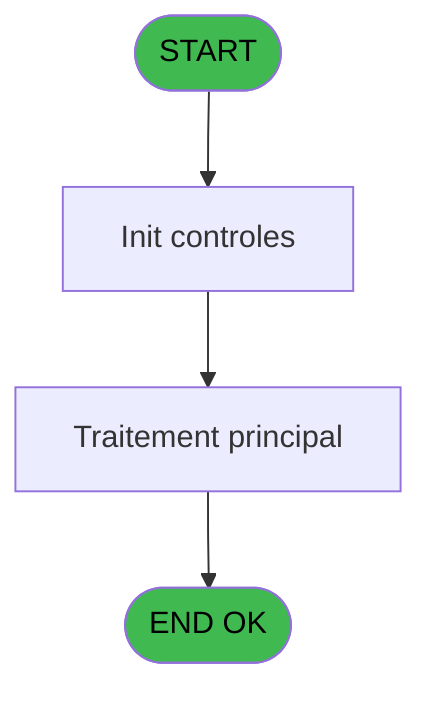
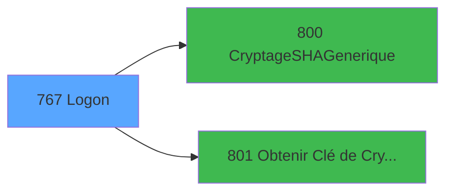

# REF IDE 767 - Logon

> **Analyse**: Phases 1-4 2026-02-03 14:15 -> 14:15 (14s) | Assemblage 14:15
> **Pipeline**: V7.2 Enrichi
> **Structure**: 4 onglets (Resume | Ecrans | Donnees | Connexions)

<!-- TAB:Resume -->

## 1. FICHE D'IDENTITE

| Attribut | Valeur |
|----------|--------|
| Projet | REF |
| IDE Position | 767 |
| Nom Programme | Logon |
| Fichier source | `Prg_767.xml` |
| Dossier IDE | General |
| Taches | 1 (1 ecrans visibles) |
| Tables modifiees | 0 |
| Programmes appeles | 2 |

## 2. DESCRIPTION FONCTIONNELLE

**Logon** assure la gestion complete de ce processus, accessible depuis [Main Program (IDE 1)](REF-IDE-1.md).

Le flux de traitement s'organise en **1 blocs fonctionnels** :

- **Traitement** (1 tache) : traitements metier divers

## 3. BLOCS FONCTIONNELS

### 3.1 Traitement (1 tache)

Traitements internes.

---

#### 767 - Logon [[ECRAN]](#ecran-t1)

**Role** : Traitement : Logon.
**Ecran** : 320 x 109 DLU (Type6) | [Voir mockup](#ecran-t1)
**Delegue a** : [CryptageSHAGenerique (IDE 800)](REF-IDE-800.md), [Obtenir Clé de Cryptage (IDE 801)](REF-IDE-801.md)

## 5. REGLES METIER

*(Aucune regle metier identifiee)*

## 6. CONTEXTE

- **Appele par**: [Main Program (IDE 1)](REF-IDE-1.md)
- **Appelle**: 2 programmes | **Tables**: 1 (W:0 R:1 L:0) | **Taches**: 1 | **Expressions**: 13

<!-- TAB:Ecrans -->

## 8. ECRANS

### 8.1 Forms visibles (1 / 1)

| # | Position | Tache | Nom | Type | Largeur | Hauteur | Bloc |
|---|----------|-------|-----|------|---------|---------|------|
| 1 | 767 | 767 | Logon | Type6 | 320 | 109 | Traitement |

### 8.2 Mockups Ecrans

---

#### 767 - Logon
**Tache** : [767](#t1) | **Type** : Type6 | **Dimensions** : 320 x 109 DLU
**Bloc** : Traitement | **Titre IDE** : Logon

<!-- FORM-DATA:
{
    "width":  320,
    "vFactor":  8,
    "type":  "Type6",
    "hFactor":  4,
    "controls":  [
                     {
                         "x":  3,
                         "type":  "label",
                         "var":  "",
                         "y":  4,
                         "w":  314,
                         "fmt":  "",
                         "name":  "",
                         "h":  68,
                         "color":  "",
                         "text":  "",
                         "parent":  null
                     },
                     {
                         "x":  40,
                         "type":  "label",
                         "var":  "",
                         "y":  26,
                         "w":  44,
                         "fmt":  "",
                         "name":  "",
                         "h":  9,
                         "color":  "",
                         "text":  "Login :",
                         "parent":  null
                     },
                     {
                         "x":  40,
                         "type":  "label",
                         "var":  "",
                         "y":  54,
                         "w":  58,
                         "fmt":  "",
                         "name":  "",
                         "h":  9,
                         "color":  "",
                         "text":  "Mot de passe :",
                         "parent":  null
                     },
                     {
                         "x":  3,
                         "type":  "label",
                         "var":  "",
                         "y":  79,
                         "w":  314,
                         "fmt":  "",
                         "name":  "",
                         "h":  26,
                         "color":  "",
                         "text":  "",
                         "parent":  null
                     },
                     {
                         "x":  100,
                         "type":  "edit",
                         "var":  "",
                         "y":  25,
                         "w":  80,
                         "fmt":  "",
                         "name":  "User",
                         "h":  10,
                         "color":  "6",
                         "text":  "",
                         "parent":  null
                     },
                     {
                         "x":  100,
                         "type":  "edit",
                         "var":  "",
                         "y":  53,
                         "w":  80,
                         "fmt":  "",
                         "name":  "Password",
                         "h":  10,
                         "color":  "6",
                         "text":  "",
                         "parent":  null
                     },
                     {
                         "x":  7,
                         "type":  "button",
                         "var":  "",
                         "y":  83,
                         "w":  64,
                         "fmt":  "\u0026Ok",
                         "name":  "Bouton ok",
                         "h":  18,
                         "color":  "",
                         "text":  "",
                         "parent":  6
                     },
                     {
                         "x":  246,
                         "type":  "button",
                         "var":  "",
                         "y":  83,
                         "w":  64,
                         "fmt":  "A\u0026bandonner",
                         "name":  "Bt.Cancel",
                         "h":  18,
                         "color":  "",
                         "text":  "",
                         "parent":  null
                     }
                 ],
    "taskId":  "767",
    "height":  109
}
-->

<strong>Champs : 2 champs</strong>

| Pos (x,y) | Nom | Variable | Type |
|-----------|-----|----------|------|
| 100,25 | User | - | edit |
| 100,53 | Password | - | edit |

<strong>Boutons : 2 boutons</strong>

| Bouton | Pos (x,y) | Action |
|--------|-----------|--------|
| Ok | 7,83 | Valide la saisie et enregistre |
| Abandonner | 246,83 | Annule et retour au menu |

## 9. NAVIGATION

Ecran unique: **Logon**

### 9.3 Structure hierarchique (1 tache)

| Position | Tache | Type | Dimensions | Bloc |
|----------|-------|------|------------|------|
| **767.1** | [**Logon** (767)](#t1) [mockup](#ecran-t1) | Type6 | 320x109 | Traitement |

### 9.4 Algorigramme

> **Legende**: Vert = START/END OK | Rouge = END KO | Bleu = Decisions
> *Algorigramme auto-genere. Utiliser `/algorigramme` pour une synthese metier detaillee.*

<!-- TAB:Donnees -->

## 10. TABLES

### Tables utilisees (1)

| ID | Nom | Description | Type | R | W | L | Usages |
|----|-----|-------------|------|---|---|---|--------|
| 718 | utilisateur______uti |  | DB | R |   |   | 1 |

### Colonnes par table (0 / 1 tables avec colonnes identifiees)

Table 718 - utilisateur______uti (R) - 1 usages

*Table utilisee uniquement en Link ou aucune colonne Real identifiee dans le DataView.*

## 11. VARIABLES

### 11.1 Parametres entrants (1)

Variables recues du programme appelant ([Main Program (IDE 1)](REF-IDE-1.md)).

| Lettre | Nom | Type | Usage dans |
|--------|-----|------|-----------|
| A | P.Login ok ? | Logical | - |

### 11.2 Variables de session (5)

Variables persistantes pendant toute la session.

| Lettre | Nom | Type | Usage dans |
|--------|-----|------|-----------|
| B | V.Login | Unicode | 1x session |
| C | V.Password | Unicode | 1x session |
| I | V.Demande change MP ? | Logical | 1x session |
| J | V.Password Crypté | Unicode | - |
| K | V.Cle Cryptage | Blob | - |

### 11.3 Autres (5)

Variables diverses.

| Lettre | Nom | Type | Usage dans |
|--------|-----|------|-----------|
| D | L.Existe user ? | Logical | 1x refs |
| E | L.Regles OK ? | Logical | - |
| F | Bt.Ok | Alpha | - |
| G | Bt.Changer MP | Alpha | 2x refs |
| H | Bt.Cancel | Alpha | 2x refs |

## 12. EXPRESSIONS

**13 / 13 expressions decodees (100%)**

### 12.1 Repartition par type

| Type | Expressions | Regles |
|------|-------------|--------|
| CONSTANTE | 2 | 0 |
| OTHER | 4 | 0 |
| NEGATION | 1 | 0 |
| CAST_LOGIQUE | 1 | 0 |
| CONDITION | 4 | 0 |
| REFERENCE_VG | 1 | 0 |

### 12.2 Expressions cles par type

#### CONSTANTE (2 expressions)

| Type | IDE | Expression | Regle |
|------|-----|------------|-------|
| CONSTANTE | 10 | `'PASSWORD'` | - |
| CONSTANTE | 5 | `''` | - |

#### OTHER (4 expressions)

| Type | IDE | Expression | Regle |
|------|-----|------------|-------|
| OTHER | 12 | `V.Password [C]` | - |
| OTHER | 13 | `NOT(VG22)` | - |
| OTHER | 1 | `V.Login [B]` | - |
| OTHER | 6 | `V.Demande change MP ? [I]` | - |

#### NEGATION (1 expressions)

| Type | IDE | Expression | Regle |
|------|-----|------------|-------|
| NEGATION | 2 | `NOT L.Existe user ? [D]` | - |

#### CAST_LOGIQUE (1 expressions)

| Type | IDE | Expression | Regle |
|------|-----|------------|-------|
| CAST_LOGIQUE | 4 | `'TRUE'LOG` | - |

#### CONDITION (4 expressions)

| Type | IDE | Expression | Regle |
|------|-----|------------|-------|
| CONDITION | 9 | `LastClicked()<>'Bt.Cancel'` | - |
| CONDITION | 3 | `Trim([O])<>Trim(Bt.Cancel [H])` | - |
| CONDITION | 7 | `Bt.Changer MP [G]<>'INFORMATICIEN'` | - |
| CONDITION | 8 | `Bt.Changer MP [G]='INFORMATICIEN'` | - |

#### REFERENCE_VG (1 expressions)

| Type | IDE | Expression | Regle |
|------|-----|------------|-------|
| REFERENCE_VG | 11 | `VG22` | - |

<!-- TAB:Connexions -->

## 13. GRAPHE D'APPELS

### 13.1 Chaine depuis Main (Callers)

Main -> ... -> [Main Program (IDE 1)](REF-IDE-1.md) -> **Logon (IDE 767)**

### 13.2 Callers

| IDE | Nom Programme | Nb Appels |
|-----|---------------|-----------|
| [1](REF-IDE-1.md) | Main Program | 1 |

### 13.3 Callees (programmes appeles)

### 13.4 Detail Callees avec contexte

| IDE | Nom Programme | Appels | Contexte |
|-----|---------------|--------|----------|
| [800](REF-IDE-800.md) | CryptageSHAGenerique | 1 | Sous-programme |
| [801](REF-IDE-801.md) | Obtenir Clé de Cryptage | 1 | Sous-programme |

## 14. RECOMMANDATIONS MIGRATION

### 14.1 Profil du programme

| Metrique | Valeur | Impact migration |
|----------|--------|-----------------|
| Lignes de logique | 42 | Programme compact |
| Expressions | 13 | Peu de logique |
| Tables WRITE | 0 | Impact faible |
| Sous-programmes | 2 | Peu de dependances |
| Ecrans visibles | 1 | Ecran unique ou traitement batch |
| Code desactive | 0% (0 / 42) | Code sain |
| Regles metier | 0 | Pas de regle identifiee |

### 14.2 Plan de migration par bloc

#### Traitement (1 tache: 1 ecran, 0 traitement)

- **Strategie** : 1 composant(s) UI (Razor/React) avec formulaires et validation.
- 2 sous-programme(s) a migrer ou a reutiliser depuis les services existants.
- Decomposer les taches en services unitaires testables.

### 14.3 Dependances critiques

| Dependance | Type | Appels | Impact |
|------------|------|--------|--------|
| [Obtenir Clé de Cryptage (IDE 801)](REF-IDE-801.md) | Sous-programme | 1x | Normale - Sous-programme |
| [CryptageSHAGenerique (IDE 800)](REF-IDE-800.md) | Sous-programme | 1x | Normale - Sous-programme |

---
*Spec DETAILED generee par Pipeline V7.2 - 2026-02-03 14:15*
