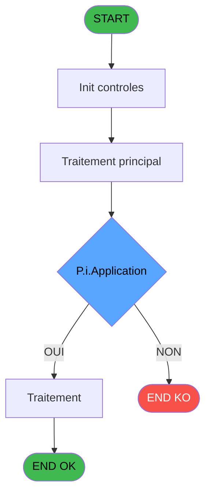

# REF IDE 769 - Param Taxe

> **Analyse**: Phases 1-4 2026-02-03 14:15 -> 14:15 (15s) | Assemblage 14:15
> **Pipeline**: V7.2 Enrichi
> **Structure**: 4 onglets (Resume | Ecrans | Donnees | Connexions)

<!-- TAB:Resume -->

## 1. FICHE D'IDENTITE

| Attribut | Valeur |
|----------|--------|
| Projet | REF |
| IDE Position | 769 |
| Nom Programme | Param Taxe |
| Fichier source | `Prg_769.xml` |
| Dossier IDE | General |
| Taches | 1 (1 ecrans visibles) |
| Tables modifiees | 0 |
| Programmes appeles | 0 |
| :warning: Statut | **ORPHELIN_POTENTIEL** |

## 2. DESCRIPTION FONCTIONNELLE

**Param Taxe** assure la gestion complete de ce processus.

Le flux de traitement s'organise en **1 blocs fonctionnels** :

- **Traitement** (1 tache) : traitements metier divers

**Logique metier** : 1 regles identifiees couvrant conditions metier.

## 3. BLOCS FONCTIONNELS

### 3.1 Traitement (1 tache)

Traitements internes.

---

#### 769 - Param Taxe [[ECRAN]](#ecran-t1)

**Role** : Traitement : Param Taxe.
**Ecran** : 941 x 225 DLU | [Voir mockup](#ecran-t1)
**Variables liees** : G (v.Montant de la taxe pour l'art)

## 5. REGLES METIER

1 regles identifiees:

### Autres (1 regles)

#### [RM-001] Si P.i.Application [A]='P' alors P.i.Cat [D] sinon 0)

| Element | Detail |
|---------|--------|
| **Condition** | `P.i.Application [A]='P'` |
| **Si vrai** | P.i.Cat [D] |
| **Si faux** | 0) |
| **Variables** | A (P.i.Application), D (P.i.Cat) |
| **Expression source** | Expression 3 : `IF(P.i.Application [A]='P',P.i.Cat [D],0)` |
| **Exemple** | Si P.i.Application [A]='P' → P.i.Cat [D]. Sinon → 0) |

## 6. CONTEXTE

- **Appele par**: (aucun)
- **Appelle**: 0 programmes | **Tables**: 2 (W:0 R:1 L:1) | **Taches**: 1 | **Expressions**: 13

<!-- TAB:Ecrans -->

## 8. ECRANS

### 8.1 Forms visibles (1 / 1)

| # | Position | Tache | Nom | Type | Largeur | Hauteur | Bloc |
|---|----------|-------|-----|------|---------|---------|------|
| 1 | 769 | 769 | Param Taxe | Type0 | 941 | 225 | Traitement |

### 8.2 Mockups Ecrans

---

#### 769 - Param Taxe
**Tache** : [769](#t1) | **Type** : Type0 | **Dimensions** : 941 x 225 DLU
**Bloc** : Traitement | **Titre IDE** : Param Taxe

<!-- FORM-DATA:
{
    "width":  941,
    "vFactor":  8,
    "type":  "Type0",
    "hFactor":  8,
    "controls":  [
                     {
                         "x":  11,
                         "type":  "table",
                         "var":  "",
                         "name":  "",
                         "titleH":  16,
                         "color":  "111",
                         "w":  923,
                         "y":  5,
                         "fmt":  "",
                         "parent":  null,
                         "text":  "",
                         "rowH":  16,
                         "h":  145,
                         "cols":  [
                                      {
                                          "title":  "Taux",
                                          "layer":  1,
                                          "w":  93
                                      },
                                      {
                                          "title":  "Libellé",
                                          "layer":  2,
                                          "w":  507
                                      },
                                      {
                                          "title":  "Appliqué sur",
                                          "layer":  3,
                                          "w":  286
                                      }
                                  ],
                         "rows":  3
                     },
                     {
                         "x":  13,
                         "type":  "label",
                         "var":  "",
                         "y":  159,
                         "w":  744,
                         "fmt":  "",
                         "name":  "",
                         "h":  60,
                         "color":  "",
                         "text":  "Text",
                         "parent":  null
                     },
                     {
                         "x":  22,
                         "type":  "edit",
                         "var":  "",
                         "y":  28,
                         "w":  75,
                         "fmt":  "3.3",
                         "name":  "tva_code",
                         "h":  8,
                         "color":  "110",
                         "text":  "",
                         "parent":  1
                     },
                     {
                         "x":  114,
                         "type":  "edit",
                         "var":  "",
                         "y":  28,
                         "w":  475,
                         "fmt":  "",
                         "name":  "tva_description",
                         "h":  8,
                         "color":  "110",
                         "text":  "",
                         "parent":  1
                     },
                     {
                         "x":  618,
                         "type":  "combobox",
                         "var":  "",
                         "y":  24,
                         "w":  272,
                         "fmt":  "",
                         "name":  "pv_service",
                         "h":  12,
                         "color":  "6",
                         "text":  "HT,TTC,TVA,NA",
                         "parent":  1
                     },
                     {
                         "x":  769,
                         "type":  "button",
                         "var":  "",
                         "y":  160,
                         "w":  121,
                         "fmt":  "\u0026Valider",
                         "name":  "",
                         "h":  18,
                         "color":  "",
                         "text":  "",
                         "parent":  null
                     }
                 ],
    "taskId":  "769",
    "height":  225
}
-->

<strong>Champs : 3 champs</strong>

| Pos (x,y) | Nom | Variable | Type |
|-----------|-----|----------|------|
| 22,28 | tva_code | - | edit |
| 114,28 | tva_description | - | edit |
| 618,24 | pv_service | - | combobox |

<strong>Boutons : 1 boutons</strong>

| Bouton | Pos (x,y) | Action |
|--------|-----------|--------|
| Valider | 769,160 | Valide la saisie et enregistre |

## 9. NAVIGATION

Ecran unique: **Param Taxe**

### 9.3 Structure hierarchique (1 tache)

| Position | Tache | Type | Dimensions | Bloc |
|----------|-------|------|------------|------|
| **769.1** | [**Param Taxe** (769)](#t1) [mockup](#ecran-t1) | - | 941x225 | Traitement |

### 9.4 Algorigramme

> **Legende**: Vert = START/END OK | Rouge = END KO | Bleu = Decisions
> *Algorigramme auto-genere. Utiliser `/algorigramme` pour une synthese metier detaillee.*

<!-- TAB:Donnees -->

## 10. TABLES

### Tables utilisees (2)

| ID | Nom | Description | Type | R | W | L | Usages |
|----|-----|-------------|------|---|---|---|--------|
| 413 | pv_tva |  | DB | R |   |   | 1 |
| 932 | taxe_add_param |  | DB |   |   | L | 1 |

### Colonnes par table (2 / 1 tables avec colonnes identifiees)

Table 413 - pv_tva (R) - 1 usages

| Lettre | Variable | Acces | Type |
|--------|----------|-------|------|
| A | P.i.Application | R | Alpha |
| B | P.i.TVA Principale | R | Numeric |
| C | P.i.Article | R | Numeric |
| D | P.i.Cat | R | Numeric |
| E | P.i.Sub Cat | R | Numeric |
| F | P.i.Service | R | Unicode |
| G | v.Montant de la taxe pour l'art | R | Numeric |
| H | v.Texte TTC | R | Unicode |
| I | v.Texte HT | R | Unicode |
| J | v.Texte TVA | R | Unicode |

## 11. VARIABLES

### 11.1 Parametres entrants (6)

Variables recues en parametre.

| Lettre | Nom | Type | Usage dans |
|--------|-----|------|-----------|
| A | P.i.Application | Alpha | 7x parametre entrant |
| B | P.i.TVA Principale | Numeric | 1x parametre entrant |
| C | P.i.Article | Numeric | 2x parametre entrant |
| D | P.i.Cat | Numeric | 2x parametre entrant |
| E | P.i.Sub Cat | Numeric | 2x parametre entrant |
| F | P.i.Service | Unicode | 1x parametre entrant |

### 11.2 Variables de session (4)

Variables persistantes pendant toute la session.

| Lettre | Nom | Type | Usage dans |
|--------|-----|------|-----------|
| G | v.Montant de la taxe pour l'art | Numeric | - |
| H | v.Texte TTC | Unicode | - |
| I | v.Texte HT | Unicode | - |
| J | v.Texte TVA | Unicode | - |

## 12. EXPRESSIONS

**13 / 13 expressions decodees (100%)**

### 12.1 Repartition par type

| Type | Expressions | Regles |
|------|-------------|--------|
| UI_POSITION | 3 | 0 |
| CONDITION | 7 | 5 |
| OTHER | 3 | 0 |

### 12.2 Expressions cles par type

#### UI_POSITION (3 expressions)

| Type | IDE | Expression | Regle |
|------|-----|------------|-------|
| UI_POSITION | 12 | `MlsTrans('TVA-Subject to VAT : indique que la taxe s''applique sur le montant HT. Une fois ce montant ajouté au montant HT, on lui appliquera la TVA.')&
'Ex : Prix du produit TTC= 200 \| Taxe Article = 16% \| Taxe TTC 10%  \| Taxe TVA 20% \| Taxe HT 12% 
200 - 200/(1+0.1) = 18.18 Taxe TTC
(200 - 18.18) - (200 - 18.18) / ( 1+ 0.2) = 30.3 Taxe TVA
(200 - 18.18 - 30.3) / 1.28 ) *  0.12 = 14.20 Taxe HT
(200 - 18.18 - 30.3) / 1.28 ) *  0.16 = 18.94 Taxe Article'` | - |
| UI_POSITION | 11 | `MlsTrans('HT-Without VAT : indique que le calcul de taxe s''applique sur le montant HT, comme le calcul de la TVA.')&
'Ex : Prix du produit TTC= 200 \| Taxe Article = 16% \| Taxe TTC 10%  \| Taxe TVA 20% \| Taxe HT 12% 
200 - 200/(1+0.1) = 18.18 Taxe TTC
(200 - 18.18) - (200 - 18.18) / ( 1+ 0.2) = 30.3 Taxe TVA
(200 - 18.18 - 30.3) / 1.28 ) *  0.12 = 14.20 Taxe HT
(200 - 18.18 - 30.3) / 1.28 ) *  0.16 = 18.94 Taxe Article'` | - |
| UI_POSITION | 10 | `MlsTrans('TTC-Tax Included : indique que la taxe est calculée après application de la TVA sur le produit HT.')&
'Ex : Prix du produit TTC= 200 \| Taxe Article = 16% \| Taxe TTC 10%  \| Taxe TVA 20% \| Taxe HT 12% 
200 - 200/(1+0.1) = 18.18 Taxe TTC
(200 - 18.18) - (200 - 18.18) / ( 1+ 0.2) = 30.3 Taxe TVA
(200 - 18.18 - 30.3) / 1.28 ) *  0.12 = 14.20 Taxe HT
(200 - 18.18 - 30.3) / 1.28 ) *  0.16 = 18.94 Taxe Article'` | - |

#### CONDITION (7 expressions)

| Type | IDE | Expression | Regle |
|------|-----|------------|-------|
| CONDITION | 3 | `IF(P.i.Application [A]='P',P.i.Cat [D],0)` | [RM-001](#rm-RM-001) |
| CONDITION | 13 | `CASE([P],'TTC', Trim([T]),'HT',Trim([U]),'TVA',[V],'')` | - |
| CONDITION | 2 | `CndRange(P.i.Application [A]='P',P.i.Cat [D])` | - |
| CONDITION | 4 | `CndRange(P.i.Application [A]='P',P.i.Sub Cat [E])` | - |
| CONDITION | 5 | `IF(P.i.Application [A]='P',P.i.Sub Cat [E],0)` | - |
| ... | | *+2 autres* | |

#### OTHER (3 expressions)

| Type | IDE | Expression | Regle |
|------|-----|------------|-------|
| OTHER | 7 | `v.Montant de la taxe p... [G]` | - |
| OTHER | 6 | `P.i.Article [C]` | - |
| OTHER | 1 | `P.i.Application [A]` | - |

<!-- TAB:Connexions -->

## 13. GRAPHE D'APPELS

### 13.1 Chaine depuis Main (Callers)

**Chemin**: (pas de callers directs)

### 13.2 Callers

| IDE | Nom Programme | Nb Appels |
|-----|---------------|-----------|
| - | (aucun) | - |

### 13.3 Callees (programmes appeles)

### 13.4 Detail Callees avec contexte

| IDE | Nom Programme | Appels | Contexte |
|-----|---------------|--------|----------|
| - | (aucun) | - | - |

## 14. RECOMMANDATIONS MIGRATION

### 14.1 Profil du programme

| Metrique | Valeur | Impact migration |
|----------|--------|-----------------|
| Lignes de logique | 27 | Programme compact |
| Expressions | 13 | Peu de logique |
| Tables WRITE | 0 | Impact faible |
| Sous-programmes | 0 | Peu de dependances |
| Ecrans visibles | 1 | Ecran unique ou traitement batch |
| Code desactive | 0% (0 / 27) | Code sain |
| Regles metier | 1 | Quelques regles a preserver |

### 14.2 Plan de migration par bloc

#### Traitement (1 tache: 1 ecran, 0 traitement)

- **Strategie** : 1 composant(s) UI (Razor/React) avec formulaires et validation.
- Decomposer les taches en services unitaires testables.

### 14.3 Dependances critiques

| Dependance | Type | Appels | Impact |
|------------|------|--------|--------|

---
*Spec DETAILED generee par Pipeline V7.2 - 2026-02-03 14:15*
