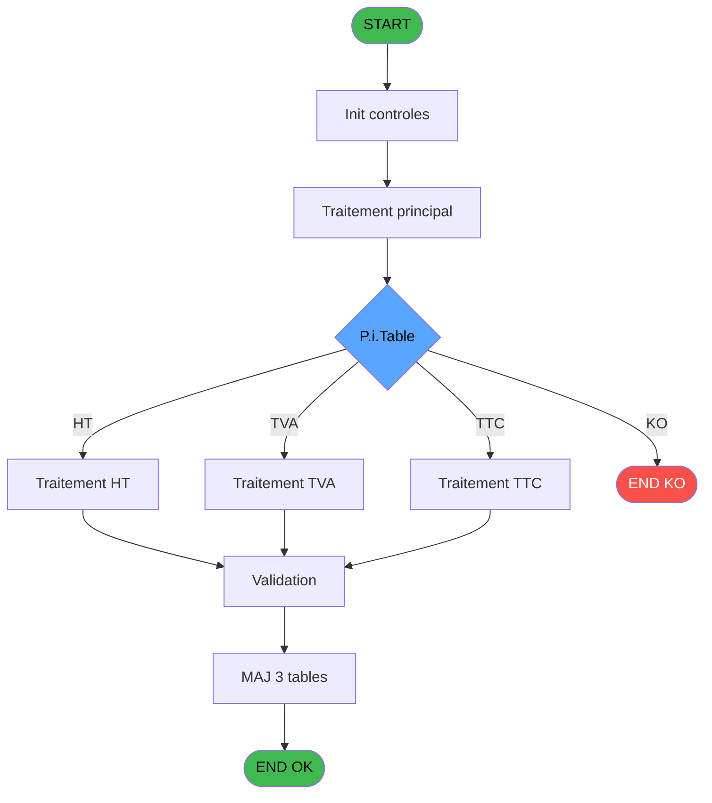
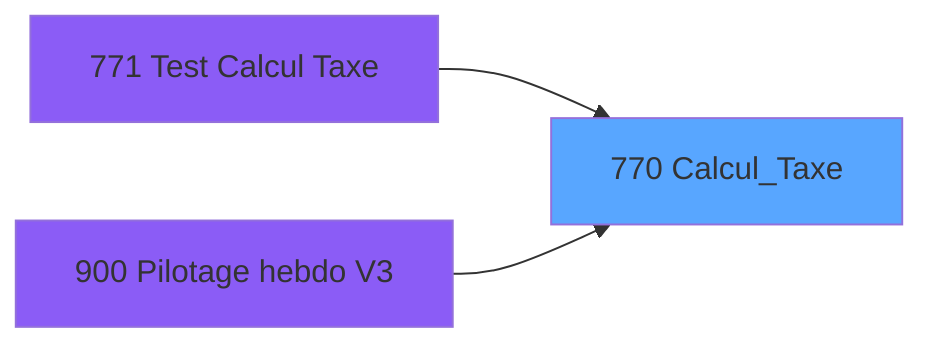

# REF IDE 770 - Calcul_Taxe

> **Analyse**: Phases 1-4 2026-02-03 14:16 -> 14:16 (14s) | Assemblage 14:16
> **Pipeline**: V7.2 Enrichi
> **Structure**: 4 onglets (Resume | Ecrans | Donnees | Connexions)

<!-- TAB:Resume -->

## 1. FICHE D'IDENTITE

| Attribut | Valeur |
|----------|--------|
| Projet | REF |
| IDE Position | 770 |
| Nom Programme | Calcul_Taxe |
| Fichier source | `Prg_770.xml` |
| Dossier IDE | General |
| Taches | 6 (0 ecrans visibles) |
| Tables modifiees | 3 |
| Programmes appeles | 0 |

## 2. DESCRIPTION FONCTIONNELLE

**Calcul_Taxe** assure la gestion complete de ce processus, accessible depuis [Test Calcul Taxe (IDE 771)](REF-IDE-771.md), [Pilotage hebdo V3 (IDE 900)](REF-IDE-900.md).

Le flux de traitement s'organise en **3 blocs fonctionnels** :

- **Traitement** (3 taches) : traitements metier divers
- **Calcul** (2 taches) : calculs de montants, stocks ou compteurs
- **Reglement** (1 tache) : gestion des moyens de paiement et reglements

**Donnees modifiees** : 3 tables en ecriture (pv_comptable, taxe_add_param, taxe_add_vente).

Detail : phases du traitement

#### Phase 1 : Calcul (2 taches)

- **770** - Calcul_Taxe
- **770.2** - Calcul Somme Taxes

#### Phase 2 : Reglement (1 tache)

- **770.1** - Calcul paiement POS

#### Phase 3 : Traitement (3 taches)

- **770.3** - Enregistrement TVA Principale
- **770.4** - Enreg taxes additionnelles
- **770.5** - Remplissage table temporaire

#### Tables impactees

| Table | Operations | Role metier |
|-------|-----------|-------------|
| taxe_add_vente | **W**/L (3 usages) | Donnees de ventes |
| taxe_add_param | **W**/L (2 usages) |  |
| pv_comptable | **W** (1 usages) |  |

## 3. BLOCS FONCTIONNELS

### 3.1 Calcul (2 taches)

Calculs metier : montants, stocks, compteurs.

---

#### 770 - Calcul_Taxe

**Role** : Calcul : Calcul_Taxe.

---

#### 770.2 - Calcul Somme Taxes

**Role** : Calcul : Calcul Somme Taxes.
**Variables liees** : D (P.i.Enregistrement Taxes), E (P.o.Plusieurs Taxes), F (P.i.Somme Taxes Demandée), G (P.o.Somme Montant Taxes), H (P.o.Somme Taux Taxes)

### 3.2 Reglement (1 tache)

Gestion des moyens de paiement : 1 tache de reglement.

---

#### 770.1 - Calcul paiement POS

**Role** : Gestion du reglement : Calcul paiement POS.

### 3.3 Traitement (3 taches)

Traitements internes.

---

#### 770.3 - Enregistrement TVA Principale

**Role** : Traitement : Enregistrement TVA Principale.
**Variables liees** : D (P.i.Enregistrement Taxes), R (v.tva principale)

---

#### 770.4 - Enreg taxes additionnelles

**Role** : Traitement : Enreg taxes additionnelles.
**Variables liees** : D (P.i.Enregistrement Taxes), E (P.o.Plusieurs Taxes), F (P.i.Somme Taxes Demandée), G (P.o.Somme Montant Taxes), H (P.o.Somme Taux Taxes)

---

#### 770.5 - Remplissage table temporaire

**Role** : Traitement : Remplissage table temporaire.
**Variables liees** : A (P.i.Table), B (P.i.Id table)

## 5. REGLES METIER

*(Aucune regle metier identifiee)*

## 6. CONTEXTE

- **Appele par**: [Test Calcul Taxe (IDE 771)](REF-IDE-771.md), [Pilotage hebdo V3 (IDE 900)](REF-IDE-900.md)
- **Appelle**: 0 programmes | **Tables**: 11 (W:3 R:2 L:8) | **Taches**: 6 | **Expressions**: 30

<!-- TAB:Ecrans -->

## 8. ECRANS

*(Programme sans ecran visible)*

## 9. NAVIGATION

### 9.3 Structure hierarchique (6 taches)

| Position | Tache | Type | Dimensions | Bloc |
|----------|-------|------|------------|------|
| **770.1** | [**Calcul_Taxe** (770)](#t1) | - | - | Calcul |
| 770.1.1 | [Calcul Somme Taxes (770.2)](#t3) | - | - | |
| **770.2** | [**Calcul paiement POS** (770.1)](#t2) | - | - | Reglement |
| **770.3** | [**Enregistrement TVA Principale** (770.3)](#t4) | - | - | Traitement |
| 770.3.1 | [Enreg taxes additionnelles (770.4)](#t5) | - | - | |
| 770.3.2 | [Remplissage table temporaire (770.5)](#t6) | - | - | |

### 9.4 Algorigramme

> **Legende**: Vert = START/END OK | Rouge = END KO | Bleu = Decisions
> *Algorigramme auto-genere. Utiliser `/algorigramme` pour une synthese metier detaillee.*

<!-- TAB:Donnees -->

## 10. TABLES

### Tables utilisees (11)

| ID | Nom | Description | Type | R | W | L | Usages |
|----|-----|-------------|------|---|---|---|--------|
| 40 | comptable________cte |  | DB | R |   |   | 1 |
| 69 | initialisation___ini |  | DB |   |   | L | 1 |
| 263 | vente | Donnees de ventes | DB |   |   | L | 1 |
| 373 | pv_comptable |  | DB |   | **W** |   | 1 |
| 378 | pv_customer |  | DB |   |   | L | 1 |
| 396 | pv_cust_packages |  | DB |   |   | L | 1 |
| 413 | pv_tva |  | DB | R |   |   | 1 |
| 824 | fac_pied_tva_pro |  | DB |   |   | L | 1 |
| 932 | taxe_add_param |  | DB |   | **W** | L | 2 |
| 933 | taxe_add_vente | Donnees de ventes | DB |   | **W** | L | 3 |
| 965 | tempo_taxes_additionnelles | Table temporaire ecran | DB |   |   | L | 1 |

### Colonnes par table (4 / 5 tables avec colonnes identifiees)

Table 40 - comptable________cte (R) - 1 usages

| Lettre | Variable | Acces | Type |
|--------|----------|-------|------|
| A | P.i.Table | R | Alpha |
| B | P.i.Id table | R | Numeric |
| C | P.i.Service | R | Unicode |
| D | P.i.Enregistrement Taxes | R | Logical |
| E | P.o.Plusieurs Taxes | R | Logical |
| F | P.i.Somme Taxes Demandée | R | Logical |
| G | P.o.Somme Montant Taxes | R | Numeric |
| H | P.o.Somme Taux Taxes | R | Numeric |
| I | P.o. Nombre Taxes (sans la TVA) | R | Numeric |
| J | v.Requête complémentaire Taxes | R | Unicode |
| K | v.Somme totale des taxes | R | Numeric |
| L | v.Somme Taxes sur PORTEE HT | R | Numeric |
| M | v.Taux HT | R | Numeric |
| N | v.Somme Taxes sur PORTEE TVA | R | Numeric |
| O | v.Taux TVA | R | Numeric |
| P | v.Somme Taxes sur PORTEE TTC | R | Numeric |
| Q | v.Taux TTC | R | Numeric |
| R | v.tva principale | R | Numeric |
| S | v.montant tva | R | Numeric |
| T | v.montant des taxes additionnel | R | Numeric |
| U | v.code article | R | Numeric |
| V | v.compte | R | Numeric |
| W | v.filiation | R | Numeric |
| X | v.montant payé par le client | R | Numeric |
| Y | v.mtt - tx TTC | R | Numeric |
| Z | v. mtt - tx TTC - tx TVA | R | Numeric |
| BA | v.mtt - tx TTC - tx TVA - tx HT | R | Numeric |
| BB | v.Montant des taxes restantes | R | Numeric |

Table 373 - pv_comptable (**W**) - 1 usages

*Table utilisee uniquement en Link ou aucune colonne Real identifiee dans le DataView.*

Table 413 - pv_tva (R) - 1 usages

*Table utilisee uniquement en Link ou aucune colonne Real identifiee dans le DataView.*

Table 932 - taxe_add_param (**W**/L) - 2 usages

| Lettre | Variable | Acces | Type |
|--------|----------|-------|------|
| BB | v.Montant des taxes restantes | W | Numeric |
| C | Somme Taxe | W | Numeric |
| D | P.i.Enregistrement Taxes | W | Logical |
| E | P.o.Plusieurs Taxes | W | Logical |
| F | P.i.Somme Taxes Demandée | W | Logical |
| G | P.o.Somme Montant Taxes | W | Numeric |
| H | P.o.Somme Taux Taxes | W | Numeric |
| I | P.o. Nombre Taxes (sans la TVA) | W | Numeric |
| J | v.Requête complémentaire Taxes | W | Unicode |
| K | v.Somme totale des taxes | W | Numeric |
| L | v.Somme Taxes sur PORTEE HT | W | Numeric |
| N | v.Somme Taxes sur PORTEE TVA | W | Numeric |
| P | v.Somme Taxes sur PORTEE TTC | W | Numeric |
| T | v.montant des taxes additionnel | W | Numeric |

Table 933 - taxe_add_vente (**W**/L) - 3 usages

| Lettre | Variable | Acces | Type |
|--------|----------|-------|------|
| BB | v.Montant des taxes restantes | W | Numeric |
| C | Somme Taxe | W | Numeric |
| D | P.i.Enregistrement Taxes | W | Logical |
| E | P.o.Plusieurs Taxes | W | Logical |
| F | P.i.Somme Taxes Demandée | W | Logical |
| G | P.o.Somme Montant Taxes | W | Numeric |
| H | P.o.Somme Taux Taxes | W | Numeric |
| I | P.o. Nombre Taxes (sans la TVA) | W | Numeric |
| J | v.Requête complémentaire Taxes | W | Unicode |
| K | v.Somme totale des taxes | W | Numeric |
| L | v.Somme Taxes sur PORTEE HT | W | Numeric |
| N | v.Somme Taxes sur PORTEE TVA | W | Numeric |
| P | v.Somme Taxes sur PORTEE TTC | W | Numeric |
| T | v.montant des taxes additionnel | W | Numeric |

## 11. VARIABLES

### 11.1 Parametres entrants (9)

Variables recues du programme appelant ([Test Calcul Taxe (IDE 771)](REF-IDE-771.md)).

| Lettre | Nom | Type | Usage dans |
|--------|-----|------|-----------|
| A | P.i.Table | Alpha | 13x parametre entrant |
| B | P.i.Id table | Numeric | [770.5](#t6) |
| C | P.i.Service | Unicode | 4x parametre entrant |
| D | P.i.Enregistrement Taxes | Logical | [770.2](#t3), [770.4](#t5) |
| E | P.o.Plusieurs Taxes | Logical | [770.2](#t3), [770.4](#t5) |
| F | P.i.Somme Taxes Demandée | Logical | - |
| G | P.o.Somme Montant Taxes | Numeric | - |
| H | P.o.Somme Taux Taxes | Numeric | - |
| I | P.o. Nombre Taxes (sans la TVA) | Numeric | - |

### 11.2 Variables de session (19)

Variables persistantes pendant toute la session.

| Lettre | Nom | Type | Usage dans |
|--------|-----|------|-----------|
| J | v.Requête complémentaire Taxes | Unicode | - |
| K | v.Somme totale des taxes | Numeric | [770.2](#t3), [770.4](#t5) |
| L | v.Somme Taxes sur PORTEE HT | Numeric | - |
| M | v.Taux HT | Numeric | 1x session |
| N | v.Somme Taxes sur PORTEE TVA | Numeric | - |
| O | v.Taux TVA | Numeric | 1x session |
| P | v.Somme Taxes sur PORTEE TTC | Numeric | - |
| Q | v.Taux TTC | Numeric | - |
| R | v.tva principale | Numeric | [770.3](#t4) |
| S | v.montant tva | Numeric | 1x session |
| T | v.montant des taxes additionnel | Numeric | - |
| U | v.code article | Numeric | 1x session |
| V | v.compte | Numeric | - |
| W | v.filiation | Numeric | - |
| X | v.montant payé par le client | Numeric | - |
| Y | v.mtt - tx TTC | Numeric | 3x session |
| Z | v. mtt - tx TTC - tx TVA | Numeric | 3x session |
| BA | v.mtt - tx TTC - tx TVA - tx HT | Numeric | - |
| BB | v.Montant des taxes restantes | Numeric | - |

Toutes les 28 variables (liste complete)

| Cat | Lettre | Nom Variable | Type |
|-----|--------|--------------|------|
| P0 | **A** | P.i.Table | Alpha |
| P0 | **B** | P.i.Id table | Numeric |
| P0 | **C** | P.i.Service | Unicode |
| P0 | **D** | P.i.Enregistrement Taxes | Logical |
| P0 | **E** | P.o.Plusieurs Taxes | Logical |
| P0 | **F** | P.i.Somme Taxes Demandée | Logical |
| P0 | **G** | P.o.Somme Montant Taxes | Numeric |
| P0 | **H** | P.o.Somme Taux Taxes | Numeric |
| P0 | **I** | P.o. Nombre Taxes (sans la TVA) | Numeric |
| V. | **J** | v.Requête complémentaire Taxes | Unicode |
| V. | **K** | v.Somme totale des taxes | Numeric |
| V. | **L** | v.Somme Taxes sur PORTEE HT | Numeric |
| V. | **M** | v.Taux HT | Numeric |
| V. | **N** | v.Somme Taxes sur PORTEE TVA | Numeric |
| V. | **O** | v.Taux TVA | Numeric |
| V. | **P** | v.Somme Taxes sur PORTEE TTC | Numeric |
| V. | **Q** | v.Taux TTC | Numeric |
| V. | **R** | v.tva principale | Numeric |
| V. | **S** | v.montant tva | Numeric |
| V. | **T** | v.montant des taxes additionnel | Numeric |
| V. | **U** | v.code article | Numeric |
| V. | **V** | v.compte | Numeric |
| V. | **W** | v.filiation | Numeric |
| V. | **X** | v.montant payé par le client | Numeric |
| V. | **Y** | v.mtt - tx TTC | Numeric |
| V. | **Z** | v. mtt - tx TTC - tx TVA | Numeric |
| V. | **BA** | v.mtt - tx TTC - tx TVA - tx HT | Numeric |
| V. | **BB** | v.Montant des taxes restantes | Numeric |

## 12. EXPRESSIONS

**30 / 30 expressions decodees (100%)**

### 12.1 Repartition par type

| Type | Expressions | Regles |
|------|-------------|--------|
| CALCUL | 4 | 0 |
| CALCULATION | 5 | 0 |
| CONDITION | 13 | 0 |
| CONSTANTE | 1 | 0 |
| OTHER | 7 | 0 |

### 12.2 Expressions cles par type

#### CALCUL (4 expressions)

| Type | IDE | Expression | Regle |
|------|-----|------------|-------|
| CALCUL | 21 | `Round([AY]/(1+[AK]/100),12,v.Somme totale des taxes [K])` | - |
| CALCUL | 27 | `((1+[AK]/100)+(1+[AM]/100))*(1+[AO]/100)` | - |
| CALCUL | 19 | `Round([AW]/(1+[AO]/100),12,v.Somme totale des taxes [K])` | - |
| CALCUL | 20 | `Round([AX]/(1+[AM]/100),12,v.Somme totale des taxes [K])` | - |

#### CALCULATION (5 expressions)

| Type | IDE | Expression | Regle |
|------|-----|------------|-------|
| CALCULATION | 29 | `[AM]/100` | - |
| CALCULATION | 30 | `[AO]/100` | - |
| CALCULATION | 28 | `[AK]/100` | - |
| CALCULATION | 22 | `[AK]+[AQ]` | - |
| CALCULATION | 26 | `[AW]-[AR]-[AS]-[AZ]` | - |

#### CONDITION (13 expressions)

| Type | IDE | Expression | Regle |
|------|-----|------------|-------|
| CONDITION | 3 | `P.i.Table [A]='V'` | - |
| CONDITION | 1 | `P.i.Table [A]='C'` | - |
| CONDITION | 18 | `IF(P.i.Table [A]='P',
'WHERE tap_appli=''P'' AND tap_article='&Trim(Str([AT],'10'))&' AND tap_portee=''TTC'' AND tap_cat='&Trim(Str(v.mtt - tx TTC [Y],'10'))&' AND tap_subcat='&Trim(Str(v. mtt - tx TTC - tx TVA [Z],'10'))&' AND tap_service='''&Trim(P.i.Service [C])&'''',
'where tap_appli=''A'' AND tap_article='&Trim(Str([AT],'10'))&' AND tap_portee=''TTC''')` | - |
| CONDITION | 24 | `[AQ]<>[AK] OR [AO]<>0 OR [AM]<>0` | - |
| CONDITION | 15 | `P.i.Table [A]='P'` | - |
| ... | | *+8 autres* | |

#### CONSTANTE (1 expressions)

| Type | IDE | Expression | Regle |
|------|-----|------------|-------|
| CONSTANTE | 8 | `0` | - |

#### OTHER (7 expressions)

| Type | IDE | Expression | Regle |
|------|-----|------------|-------|
| OTHER | 14 | `IN(P.i.Table [A],'C','V')` | - |
| OTHER | 23 | `P.i.Enregistrement Taxes [D]` | - |
| OTHER | 25 | `NOT(P.i.Enregistrement Taxes [D]) AND P.o.Plusieurs Taxes [E]` | - |
| OTHER | 7 | `v.montant payé par le ... [X]` | - |
| OTHER | 2 | `P.i.Id table [B]` | - |
| ... | | *+2 autres* | |

### 12.3 Toutes les expressions (30)

Voir les 30 expressions

#### CALCUL (4)

| IDE | Expression Decodee |
|-----|-------------------|
| 19 | `Round([AW]/(1+[AO]/100),12,v.Somme totale des taxes [K])` |
| 20 | `Round([AX]/(1+[AM]/100),12,v.Somme totale des taxes [K])` |
| 21 | `Round([AY]/(1+[AK]/100),12,v.Somme totale des taxes [K])` |
| 27 | `((1+[AK]/100)+(1+[AM]/100))*(1+[AO]/100)` |

#### CALCULATION (5)

| IDE | Expression Decodee |
|-----|-------------------|
| 22 | `[AK]+[AQ]` |
| 26 | `[AW]-[AR]-[AS]-[AZ]` |
| 28 | `[AK]/100` |
| 29 | `[AM]/100` |
| 30 | `[AO]/100` |

#### CONDITION (13)

| IDE | Expression Decodee |
|-----|-------------------|
| 9 | `CASE(P.i.Table [A],'C',v.Somme Taxes sur PORT... [P],'V',v.code article [U],'P',[AD],0)` |
| 10 | `CASE(P.i.Table [A],'C',v.Taux TVA [O],'V',v.montant des taxes ad... [T],'P',[AA],0)` |
| 11 | `CASE(P.i.Table [A],'C',v.Taux HT [M],'V',v.tva principale [R],'P',[AG],0)` |
| 12 | `CASE(P.i.Table [A],'C',0,'V',0,'P',[AH],0)` |
| 13 | `CASE(P.i.Table [A],'C',ABS(v.Somme Taxes sur PORT... [N]),'V',ABS(v.montant tva [S]),0)` |
| 16 | `IF(P.i.Table [A]='P',
'WHERE tap_appli=''P'' AND tap_article='&Trim(Str([AT],'10'))&' AND tap_portee=''HT'' AND tap_cat='&Trim(Str(v.mtt - tx TTC [Y],'10'))&' AND tap_subcat='&Trim(Str(v. mtt - tx TTC - tx TVA [Z],'10'))&' AND tap_service='''&Trim(P.i.Service [C])&'''',
'where tap_appli=''A'' AND tap_article='&Trim(Str([AT],'10'))&' AND tap_portee=''HT''')` |
| 17 | `IF(P.i.Table [A]='P',
'WHERE tap_appli=''P'' AND tap_article='&Trim(Str([AT],'10'))&' AND tap_portee=''TVA'' AND tap_cat='&Trim(Str(v.mtt - tx TTC [Y],'10'))&' AND tap_subcat='&Trim(Str(v. mtt - tx TTC - tx TVA [Z],'10'))&' AND tap_service='''&Trim(P.i.Service [C])&'''',
'where tap_appli=''A'' AND tap_article='&Trim(Str([AT],'10'))&' AND tap_portee=''TVA''')` |
| 18 | `IF(P.i.Table [A]='P',
'WHERE tap_appli=''P'' AND tap_article='&Trim(Str([AT],'10'))&' AND tap_portee=''TTC'' AND tap_cat='&Trim(Str(v.mtt - tx TTC [Y],'10'))&' AND tap_subcat='&Trim(Str(v. mtt - tx TTC - tx TVA [Z],'10'))&' AND tap_service='''&Trim(P.i.Service [C])&'''',
'where tap_appli=''A'' AND tap_article='&Trim(Str([AT],'10'))&' AND tap_portee=''TTC''')` |
| 1 | `P.i.Table [A]='C'` |
| 3 | `P.i.Table [A]='V'` |
| 4 | `P.i.Table [A]='P'` |
| 15 | `P.i.Table [A]='P'` |
| 24 | `[AQ]<>[AK] OR [AO]<>0 OR [AM]<>0` |

#### CONSTANTE (1)

| IDE | Expression Decodee |
|-----|-------------------|
| 8 | `0` |

#### OTHER (7)

| IDE | Expression Decodee |
|-----|-------------------|
| 2 | `P.i.Id table [B]` |
| 5 | `P.i.Service [C]` |
| 6 | `P.i.Id table [B]` |
| 7 | `v.montant payé par le ... [X]` |
| 14 | `IN(P.i.Table [A],'C','V')` |
| 23 | `P.i.Enregistrement Taxes [D]` |
| 25 | `NOT(P.i.Enregistrement Taxes [D]) AND P.o.Plusieurs Taxes [E]` |

<!-- TAB:Connexions -->

## 13. GRAPHE D'APPELS

### 13.1 Chaine depuis Main (Callers)

Main -> ... -> [Test Calcul Taxe (IDE 771)](REF-IDE-771.md) -> **Calcul_Taxe (IDE 770)**

Main -> ... -> [Pilotage hebdo V3 (IDE 900)](REF-IDE-900.md) -> **Calcul_Taxe (IDE 770)**

### 13.2 Callers

| IDE | Nom Programme | Nb Appels |
|-----|---------------|-----------|
| [771](REF-IDE-771.md) | Test Calcul Taxe | 1 |
| [900](REF-IDE-900.md) | Pilotage hebdo V3 | 1 |

### 13.3 Callees (programmes appeles)

### 13.4 Detail Callees avec contexte

| IDE | Nom Programme | Appels | Contexte |
|-----|---------------|--------|----------|
| - | (aucun) | - | - |

## 14. RECOMMANDATIONS MIGRATION

### 14.1 Profil du programme

| Metrique | Valeur | Impact migration |
|----------|--------|-----------------|
| Lignes de logique | 233 | Taille moyenne |
| Expressions | 30 | Peu de logique |
| Tables WRITE | 3 | Impact modere |
| Sous-programmes | 0 | Peu de dependances |
| Ecrans visibles | 0 | Ecran unique ou traitement batch |
| Code desactive | 0.4% (1 / 233) | Code sain |
| Regles metier | 0 | Pas de regle identifiee |

### 14.2 Plan de migration par bloc

#### Calcul (2 taches: 0 ecran, 2 traitements)

- **Strategie** : Services de calcul purs (Domain Services).
- Migrer la logique de calcul (stock, compteurs, montants)

#### Reglement (1 tache: 0 ecran, 1 traitement)

- **Strategie** : Service `IReglementService` avec pattern Strategy par mode de paiement.
- Integration TPE si applicable

#### Traitement (3 taches: 0 ecran, 3 traitements)

- **Strategie** : 3 service(s) backend injectable(s) (Domain Services).
- Decomposer les taches en services unitaires testables.

### 14.3 Dependances critiques

| Dependance | Type | Appels | Impact |
|------------|------|--------|--------|
| pv_comptable | Table WRITE (Database) | 1x | Schema + repository |
| taxe_add_param | Table WRITE (Database) | 1x | Schema + repository |
| taxe_add_vente | Table WRITE (Database) | 1x | Schema + repository |

---
*Spec DETAILED generee par Pipeline V7.2 - 2026-02-03 14:16*
