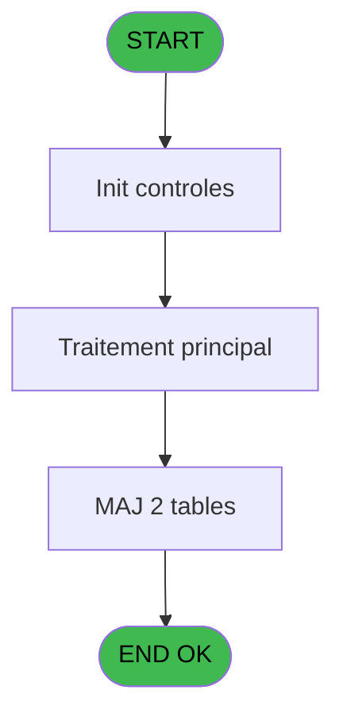
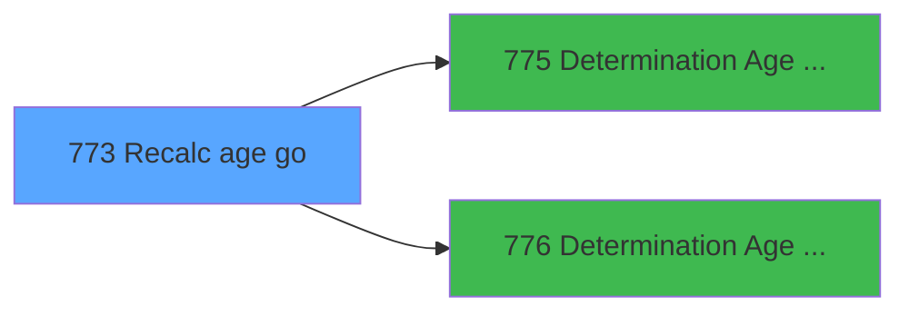

# REF IDE 773 - Recalc age go

> **Analyse**: Phases 1-4 2026-02-03 14:17 -> 14:17 (15s) | Assemblage 14:17
> **Pipeline**: V7.2 Enrichi
> **Structure**: 4 onglets (Resume | Ecrans | Donnees | Connexions)

<!-- TAB:Resume -->

## 1. FICHE D'IDENTITE

| Attribut | Valeur |
|----------|--------|
| Projet | REF |
| IDE Position | 773 |
| Nom Programme | Recalc age go |
| Fichier source | `Prg_773.xml` |
| Dossier IDE | General |
| Taches | 2 (0 ecrans visibles) |
| Tables modifiees | 2 |
| Programmes appeles | 2 |
| :warning: Statut | **ORPHELIN_POTENTIEL** |

## 2. DESCRIPTION FONCTIONNELLE

**Recalc age go** assure la gestion complete de ce processus.

Le flux de traitement s'organise en **2 blocs fonctionnels** :

- **Traitement** (1 tache) : traitements metier divers
- **Calcul** (1 tache) : calculs de montants, stocks ou compteurs

**Donnees modifiees** : 2 tables en ecriture (gm-recherche_____gmr, hebergement______heb).

**Logique metier** : 1 regles identifiees couvrant conditions metier.

Detail : phases du traitement

#### Phase 1 : Calcul (1 tache)

- **773** - Recalcul age GO

#### Phase 2 : Traitement (1 tache)

- **773.1** - hebergement

Delegue a : [Determination Age Debut Sejour (IDE 775)](REF-IDE-775.md), [Determination Age Bebe (IDE 776)](REF-IDE-776.md)

#### Tables impactees

| Table | Operations | Role metier |
|-------|-----------|-------------|
| gm-recherche_____gmr | **W** (1 usages) | Index de recherche |
| hebergement______heb | **W** (1 usages) | Hebergement (chambres) |

## 3. BLOCS FONCTIONNELS

### 3.1 Calcul (1 tache)

Calculs metier : montants, stocks, compteurs.

---

#### 773 - Recalcul age GO

**Role** : Calcul : Recalcul age GO.

### 3.2 Traitement (1 tache)

Traitements internes.

---

#### 773.1 - hebergement

**Role** : Traitement : hebergement.
**Delegue a** : [Determination Age Debut Sejour (IDE 775)](REF-IDE-775.md), [Determination Age Bebe (IDE 776)](REF-IDE-776.md)

## 5. REGLES METIER

1 regles identifiees:

### Autres (1 regles)

#### [RM-001] Si [F]>0 AND [W]<=[Y] alors 'O' sinon 'N')

| Element | Detail |
|---------|--------|
| **Condition** | `[F]>0 AND [W]<=[Y]` |
| **Si vrai** | 'O' |
| **Si faux** | 'N') |
| **Expression source** | Expression 7 : `IF ([F]>0 AND [W]<=[Y],'O','N')` |
| **Exemple** | Si [F]>0 AND [W]<=[Y] → 'O'. Sinon → 'N') |

## 6. CONTEXTE

- **Appele par**: (aucun)
- **Appelle**: 2 programmes | **Tables**: 5 (W:2 R:0 L:3) | **Taches**: 2 | **Expressions**: 8

<!-- TAB:Ecrans -->

## 8. ECRANS

*(Programme sans ecran visible)*

## 9. NAVIGATION

### 9.3 Structure hierarchique (2 taches)

| Position | Tache | Type | Dimensions | Bloc |
|----------|-------|------|------------|------|
| **773.1** | [**Recalcul age GO** (773)](#t1) | - | - | Calcul |
| **773.2** | [**hebergement** (773.1)](#t2) | - | - | Traitement |

### 9.4 Algorigramme

> **Legende**: Vert = START/END OK | Rouge = END KO | Bleu = Decisions
> *Algorigramme auto-genere. Utiliser `/algorigramme` pour une synthese metier detaillee.*

<!-- TAB:Donnees -->

## 10. TABLES

### Tables utilisees (5)

| ID | Nom | Description | Type | R | W | L | Usages |
|----|-----|-------------|------|---|---|---|--------|
| 30 | gm-recherche_____gmr | Index de recherche | DB |   | **W** |   | 1 |
| 31 | gm-complet_______gmc |  | DB |   |   | L | 1 |
| 34 | hebergement______heb | Hebergement (chambres) | DB |   | **W** |   | 1 |
| 35 | personnel_go______go |  | DB |   |   | L | 1 |
| 131 | fichier_validation |  | DB |   |   | L | 1 |

### Colonnes par table (1 / 2 tables avec colonnes identifiees)

Table 30 - gm-recherche_____gmr (**W**) - 1 usages

| Lettre | Variable | Acces | Type |
|--------|----------|-------|------|
| A | V.Age | W | Numeric |
| B | V.Nb mois | W | Numeric |
| C | V.Age bebe | W | Numeric |

Table 34 - hebergement______heb (**W**) - 1 usages

*Table utilisee uniquement en Link ou aucune colonne Real identifiee dans le DataView.*

## 11. VARIABLES

### 11.1 Variables de session (3)

Variables persistantes pendant toute la session.

| Lettre | Nom | Type | Usage dans |
|--------|-----|------|-----------|
| A | V.Age | Numeric | 2x session |
| B | V.Nb mois | Numeric | 1x session |
| C | V.Age bebe | Numeric | 1x session |

## 12. EXPRESSIONS

**8 / 8 expressions decodees (100%)**

### 12.1 Repartition par type

| Type | Expressions | Regles |
|------|-------------|--------|
| CONDITION | 2 | 5 |
| CONSTANTE | 1 | 0 |
| OTHER | 5 | 0 |

### 12.2 Expressions cles par type

#### CONDITION (2 expressions)

| Type | IDE | Expression | Regle |
|------|-----|------------|-------|
| CONDITION | 7 | `IF ([F]>0 AND [W]<=[Y],'O','N')` | [RM-001](#rm-RM-001) |
| CONDITION | 8 | `Counter(0)=1` | - |

#### CONSTANTE (1 expressions)

| Type | IDE | Expression | Regle |
|------|-----|------------|-------|
| CONSTANTE | 6 | `1` | - |

#### OTHER (5 expressions)

| Type | IDE | Expression | Regle |
|------|-----|------------|-------|
| OTHER | 4 | `V.Nb mois [B]` | - |
| OTHER | 5 | `V.Age bebe [C]` | - |
| OTHER | 3 | `V.Age [A]` | - |
| OTHER | 1 | `[W]` | - |
| OTHER | 2 | `[X]` | - |

<!-- TAB:Connexions -->

## 13. GRAPHE D'APPELS

### 13.1 Chaine depuis Main (Callers)

**Chemin**: (pas de callers directs)

### 13.2 Callers

| IDE | Nom Programme | Nb Appels |
|-----|---------------|-----------|
| - | (aucun) | - |

### 13.3 Callees (programmes appeles)

### 13.4 Detail Callees avec contexte

| IDE | Nom Programme | Appels | Contexte |
|-----|---------------|--------|----------|
| [775](REF-IDE-775.md) | Determination Age Debut Sejour | 1 | Sous-programme |
| [776](REF-IDE-776.md) | Determination Age Bebe | 1 | Sous-programme |

## 14. RECOMMANDATIONS MIGRATION

### 14.1 Profil du programme

| Metrique | Valeur | Impact migration |
|----------|--------|-----------------|
| Lignes de logique | 48 | Programme compact |
| Expressions | 8 | Peu de logique |
| Tables WRITE | 2 | Impact faible |
| Sous-programmes | 2 | Peu de dependances |
| Ecrans visibles | 0 | Ecran unique ou traitement batch |
| Code desactive | 0% (0 / 48) | Code sain |
| Regles metier | 1 | Quelques regles a preserver |

### 14.2 Plan de migration par bloc

#### Calcul (1 tache: 0 ecran, 1 traitement)

- **Strategie** : Services de calcul purs (Domain Services).
- Migrer la logique de calcul (stock, compteurs, montants)

#### Traitement (1 tache: 0 ecran, 1 traitement)

- **Strategie** : 1 service(s) backend injectable(s) (Domain Services).
- 2 sous-programme(s) a migrer ou a reutiliser depuis les services existants.
- Decomposer les taches en services unitaires testables.

### 14.3 Dependances critiques

| Dependance | Type | Appels | Impact |
|------------|------|--------|--------|
| gm-recherche_____gmr | Table WRITE (Database) | 1x | Schema + repository |
| hebergement______heb | Table WRITE (Database) | 1x | Schema + repository |
| [Determination Age Bebe (IDE 776)](REF-IDE-776.md) | Sous-programme | 1x | Normale - Sous-programme |
| [Determination Age Debut Sejour (IDE 775)](REF-IDE-775.md) | Sous-programme | 1x | Normale - Sous-programme |

---
*Spec DETAILED generee par Pipeline V7.2 - 2026-02-03 14:17*
