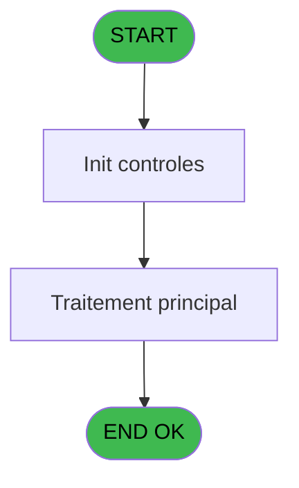
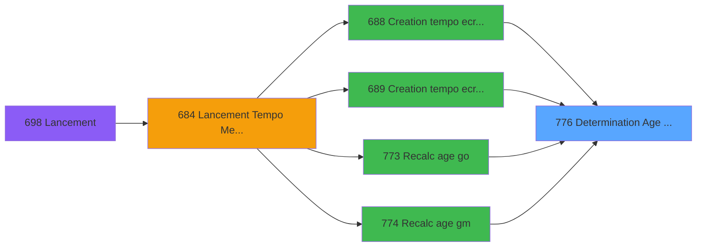

# REF IDE 776 - Determination Age Bebe

> **Analyse**: Phases 1-4 2026-02-03 14:18 -> 14:18 (14s) | Assemblage 14:18
> **Pipeline**: V7.2 Enrichi
> **Structure**: 4 onglets (Resume | Ecrans | Donnees | Connexions)

<!-- TAB:Resume -->

## 1. FICHE D'IDENTITE

| Attribut | Valeur |
|----------|--------|
| Projet | REF |
| IDE Position | 776 |
| Nom Programme | Determination Age Bebe |
| Fichier source | `Prg_776.xml` |
| Dossier IDE | General |
| Taches | 1 (0 ecrans visibles) |
| Tables modifiees | 0 |
| Programmes appeles | 0 |

## 2. DESCRIPTION FONCTIONNELLE

**Determination Age Bebe** assure la gestion complete de ce processus, accessible depuis [Creation tempo ecran generique (IDE 688)](REF-IDE-688.md), [Creation tempo ecran par doss (IDE 689)](REF-IDE-689.md), [Recalc age go (IDE 773)](REF-IDE-773.md), [Recalc age gm (IDE 774)](REF-IDE-774.md).

Le flux de traitement s'organise en **1 blocs fonctionnels** :

- **Traitement** (1 tache) : traitements metier divers

**Logique metier** : 1 regles identifiees couvrant conditions metier.

## 3. BLOCS FONCTIONNELS

### 3.1 Traitement (1 tache)

Traitements internes.

---

#### 776 - Determination Age Bebe

**Role** : Traitement : Determination Age Bebe.
**Variables liees** : A (P.Age bebe)

## 5. REGLES METIER

1 regles identifiees:

### Autres (1 regles)

#### [RM-001] Traitement si Trim(P.Nom Table [B]) est renseigne

| Element | Detail |
|---------|--------|
| **Condition** | `Trim(P.Nom Table [B])<>''` |
| **Si vrai** | P.Nom Table [B] |
| **Si faux** | 'VBEBE') |
| **Variables** | B (P.Nom Table) |
| **Expression source** | Expression 2 : `IF(Trim(P.Nom Table [B])<>'',P.Nom Table [B],'VBEBE')` |
| **Exemple** | Si Trim(P.Nom Table [B])<>'' → P.Nom Table [B]. Sinon → 'VBEBE') |

## 6. CONTEXTE

- **Appele par**: [Creation tempo ecran generique (IDE 688)](REF-IDE-688.md), [Creation tempo ecran par doss (IDE 689)](REF-IDE-689.md), [Recalc age go (IDE 773)](REF-IDE-773.md), [Recalc age gm (IDE 774)](REF-IDE-774.md)
- **Appelle**: 0 programmes | **Tables**: 1 (W:0 R:1 L:0) | **Taches**: 1 | **Expressions**: 5

<!-- TAB:Ecrans -->

## 8. ECRANS

*(Programme sans ecran visible)*

## 9. NAVIGATION

### 9.3 Structure hierarchique (1 tache)

| Position | Tache | Type | Dimensions | Bloc |
|----------|-------|------|------------|------|
| **776.1** | [**Determination Age Bebe** (776)](#t1) | MDI | - | Traitement |

### 9.4 Algorigramme

> **Legende**: Vert = START/END OK | Rouge = END KO | Bleu = Decisions
> *Algorigramme auto-genere. Utiliser `/algorigramme` pour une synthese metier detaillee.*

<!-- TAB:Donnees -->

## 10. TABLES

### Tables utilisees (1)

| ID | Nom | Description | Type | R | W | L | Usages |
|----|-----|-------------|------|---|---|---|--------|
| 113 | tables_village |  | DB | R |   |   | 1 |

### Colonnes par table (1 / 1 tables avec colonnes identifiees)

Table 113 - tables_village (R) - 1 usages

| Lettre | Variable | Acces | Type |
|--------|----------|-------|------|
| A | P.Age bebe | R | Numeric |
| B | P.Nom Table | R | Unicode |

## 11. VARIABLES

### 11.1 Parametres entrants (2)

Variables recues du programme appelant ([Creation tempo ecran generique (IDE 688)](REF-IDE-688.md)).

| Lettre | Nom | Type | Usage dans |
|--------|-----|------|-----------|
| A | P.Age bebe | Numeric | - |
| B | P.Nom Table | Unicode | 1x parametre entrant |

## 12. EXPRESSIONS

**5 / 5 expressions decodees (100%)**

### 12.1 Repartition par type

| Type | Expressions | Regles |
|------|-------------|--------|
| CONDITION | 1 | 5 |
| CONSTANTE | 3 | 0 |
| OTHER | 1 | 0 |

### 12.2 Expressions cles par type

#### CONDITION (1 expressions)

| Type | IDE | Expression | Regle |
|------|-----|------------|-------|
| CONDITION | 2 | `IF(Trim(P.Nom Table [B])<>'',P.Nom Table [B],'VBEBE')` | [RM-001](#rm-RM-001) |

#### CONSTANTE (3 expressions)

| Type | IDE | Expression | Regle |
|------|-----|------------|-------|
| CONSTANTE | 4 | `'PL'` | - |
| CONSTANTE | 3 | `'F'` | - |
| CONSTANTE | 1 | `'C'` | - |

#### OTHER (1 expressions)

| Type | IDE | Expression | Regle |
|------|-----|------------|-------|
| OTHER | 5 | `[G]` | - |

<!-- TAB:Connexions -->

## 13. GRAPHE D'APPELS

### 13.1 Chaine depuis Main (Callers)

Main -> ... -> [Creation tempo ecran generique (IDE 688)](REF-IDE-688.md) -> **Determination Age Bebe (IDE 776)**

Main -> ... -> [Creation tempo ecran par doss (IDE 689)](REF-IDE-689.md) -> **Determination Age Bebe (IDE 776)**

Main -> ... -> [Recalc age go (IDE 773)](REF-IDE-773.md) -> **Determination Age Bebe (IDE 776)**

Main -> ... -> [Recalc age gm (IDE 774)](REF-IDE-774.md) -> **Determination Age Bebe (IDE 776)**

### 13.2 Callers

| IDE | Nom Programme | Nb Appels |
|-----|---------------|-----------|
| [688](REF-IDE-688.md) | Creation tempo ecran generique | 2 |
| [689](REF-IDE-689.md) | Creation tempo ecran par doss | 2 |
| [773](REF-IDE-773.md) | Recalc age go | 1 |
| [774](REF-IDE-774.md) | Recalc age gm | 1 |

### 13.3 Callees (programmes appeles)

### 13.4 Detail Callees avec contexte

| IDE | Nom Programme | Appels | Contexte |
|-----|---------------|--------|----------|
| - | (aucun) | - | - |

## 14. RECOMMANDATIONS MIGRATION

### 14.1 Profil du programme

| Metrique | Valeur | Impact migration |
|----------|--------|-----------------|
| Lignes de logique | 15 | Programme compact |
| Expressions | 5 | Peu de logique |
| Tables WRITE | 0 | Impact faible |
| Sous-programmes | 0 | Peu de dependances |
| Ecrans visibles | 0 | Ecran unique ou traitement batch |
| Code desactive | 0% (0 / 15) | Code sain |
| Regles metier | 1 | Quelques regles a preserver |

### 14.2 Plan de migration par bloc

#### Traitement (1 tache: 0 ecran, 1 traitement)

- **Strategie** : 1 service(s) backend injectable(s) (Domain Services).
- Decomposer les taches en services unitaires testables.

### 14.3 Dependances critiques

| Dependance | Type | Appels | Impact |
|------------|------|--------|--------|

---
*Spec DETAILED generee par Pipeline V7.2 - 2026-02-03 14:18*
