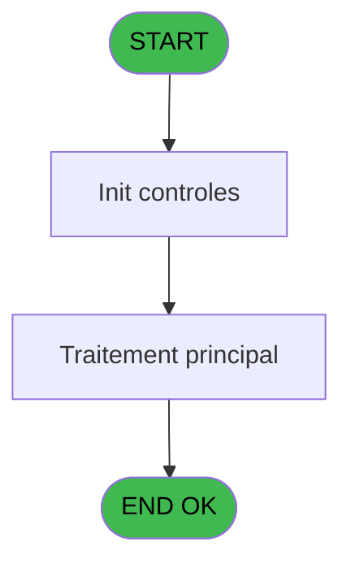

# REF IDE 784 - Mail Connection

> **Analyse**: Phases 1-4 2026-02-03 14:20 -> 14:21 (15s) | Assemblage 14:21
> **Pipeline**: V7.2 Enrichi
> **Structure**: 4 onglets (Resume | Ecrans | Donnees | Connexions)

<!-- TAB:Resume -->

## 1. FICHE D'IDENTITE

| Attribut | Valeur |
|----------|--------|
| Projet | REF |
| IDE Position | 784 |
| Nom Programme | Mail Connection |
| Fichier source | `Prg_784.xml` |
| Dossier IDE | General |
| Taches | 1 (0 ecrans visibles) |
| Tables modifiees | 0 |
| Programmes appeles | 1 |
| :warning: Statut | **ORPHELIN_POTENTIEL** |

## 2. DESCRIPTION FONCTIONNELLE

**Mail Connection** assure la gestion complete de ce processus.

Le flux de traitement s'organise en **1 blocs fonctionnels** :

- **Traitement** (1 tache) : traitements metier divers

**Logique metier** : 1 regles identifiees couvrant conditions metier.

## 3. BLOCS FONCTIONNELS

### 3.1 Traitement (1 tache)

Traitements internes.

---

#### 784 - Mail Connection s [[ECRAN]](#ecran-t1)

**Role** : Traitement : Mail Connection s.
**Ecran** : 579 x 324 DLU | [Voir mockup](#ecran-t1)
**Variables liees** : A (p.o.Connection OK ?), H (V.Code Retour connection)
**Delegue a** : [Log batch (IDE 829)](REF-IDE-829.md)

## 5. REGLES METIER

1 regles identifiees:

### Autres (1 regles)

#### [RM-001] Traitement si [P] est non nul

| Element | Detail |
|---------|--------|
| **Condition** | `[P]<>0` |
| **Si vrai** | 'ERR' |
| **Si faux** | 'OK') |
| **Expression source** | Expression 23 : `IF([P]<>0, 'ERR', 'OK')` |
| **Exemple** | Si [P]<>0 → 'ERR'. Sinon → 'OK') |

## 6. CONTEXTE

- **Appele par**: (aucun)
- **Appelle**: 1 programmes | **Tables**: 1 (W:0 R:1 L:0) | **Taches**: 1 | **Expressions**: 23

<!-- TAB:Ecrans -->

## 8. ECRANS

*(Programme sans ecran visible)*

## 9. NAVIGATION

### 9.3 Structure hierarchique (1 tache)

| Position | Tache | Type | Dimensions | Bloc |
|----------|-------|------|------------|------|
| **784.1** | [**Mail Connection s** (784)](#t1) [mockup](#ecran-t1) | - | 579x324 | Traitement |

### 9.4 Algorigramme

> **Legende**: Vert = START/END OK | Rouge = END KO | Bleu = Decisions
> *Algorigramme auto-genere. Utiliser `/algorigramme` pour une synthese metier detaillee.*

<!-- TAB:Donnees -->

## 10. TABLES

### Tables utilisees (1)

| ID | Nom | Description | Type | R | W | L | Usages |
|----|-----|-------------|------|---|---|---|--------|
| 861 | param_gen_mail |  | DB | R |   |   | 1 |

### Colonnes par table (1 / 1 tables avec colonnes identifiees)

Table 861 - param_gen_mail (R) - 1 usages

| Lettre | Variable | Acces | Type |
|--------|----------|-------|------|
| A | p.o.Connection OK ? | R | Logical |
| B | p.o.Code Erreur | R | Numeric |
| C | p.o.Message Erreur | R | Unicode |
| D | p.i.Viens de : | R | Unicode |
| E | v Serveur | R | Unicode |
| F | v.User | R | Unicode |
| G | v.Mdp | R | Unicode |
| H | V.Code Retour connection | R | Numeric |

## 11. VARIABLES

### 11.1 Parametres entrants (4)

Variables recues en parametre.

| Lettre | Nom | Type | Usage dans |
|--------|-----|------|-----------|
| A | p.o.Connection OK ? | Logical | - |
| B | p.o.Code Erreur | Numeric | - |
| C | p.o.Message Erreur | Unicode | 1x parametre entrant |
| D | p.i.Viens de : | Unicode | 1x parametre entrant |

### 11.2 Variables de session (4)

Variables persistantes pendant toute la session.

| Lettre | Nom | Type | Usage dans |
|--------|-----|------|-----------|
| E | v Serveur | Unicode | - |
| F | v.User | Unicode | 1x session |
| G | v.Mdp | Unicode | 1x session |
| H | V.Code Retour connection | Numeric | [784](#t1) |

## 12. EXPRESSIONS

**23 / 23 expressions decodees (100%)**

### 12.1 Repartition par type

| Type | Expressions | Regles |
|------|-------------|--------|
| CONDITION | 5 | 5 |
| CONSTANTE | 3 | 0 |
| FORMAT | 2 | 0 |
| DATE | 1 | 0 |
| OTHER | 5 | 0 |
| STRING | 7 | 0 |

### 12.2 Expressions cles par type

#### CONDITION (5 expressions)

| Type | IDE | Expression | Regle |
|------|-----|------------|-------|
| CONDITION | 23 | `IF([P]<>0, 'ERR', 'OK')` | [RM-001](#rm-RM-001) |
| CONDITION | 13 | `[P]<>0 OR Translate('%club_tracemail%')='O'` | - |
| CONDITION | 17 | `[L]='P'` | - |
| CONDITION | 10 | `[P]=0` | - |
| CONDITION | 12 | `[P]<>0` | - |

#### CONSTANTE (3 expressions)

| Type | IDE | Expression | Regle |
|------|-----|------------|-------|
| CONSTANTE | 19 | `'CONNECTION'` | - |
| CONSTANTE | 18 | `'EMAIL'` | - |
| CONSTANTE | 8 | `'admin'` | - |

#### FORMAT (2 expressions)

| Type | IDE | Expression | Regle |
|------|-----|------------|-------|
| FORMAT | 11 | `MailError(MailLastRC()) & ' Code Erreur : ' & Trim(Str(MailLastRC(),'N6'))` | - |
| FORMAT | 1 | `'%club_exportdata%'&'trace_mail_'&DStr(Date(),'YYYYMM')&'.txt'` | - |

#### DATE (1 expressions)

| Type | IDE | Expression | Regle |
|------|-----|------------|-------|
| DATE | 15 | `Date()` | - |

#### OTHER (5 expressions)

| Type | IDE | Expression | Regle |
|------|-----|------------|-------|
| OTHER | 21 | `p.i.Viens de : [D]` | - |
| OTHER | 22 | `StrBuild('Connexion to @1@ for user @2@', [M], [N])` | - |
| OTHER | 20 | `p.o.Message Erreur [C]` | - |
| OTHER | 14 | `[P]` | - |
| OTHER | 16 | `Time()` | - |

#### STRING (7 expressions)

| Type | IDE | Expression | Regle |
|------|-----|------------|-------|
| STRING | 6 | `Trim([J])` | - |
| STRING | 7 | `Trim([K])` | - |
| STRING | 9 | `MailConnect(1,Trim([M]),Trim([N]),Trim([O]))` | - |
| STRING | 5 | `Trim([I])` | - |
| STRING | 2 | `Trim(v.User [F])` | - |
| ... | | *+2 autres* | |

### 12.3 Toutes les expressions (23)

Voir les 23 expressions

#### CONDITION (5)

| IDE | Expression Decodee |
|-----|-------------------|
| 23 | `IF([P]<>0, 'ERR', 'OK')` |
| 10 | `[P]=0` |
| 12 | `[P]<>0` |
| 13 | `[P]<>0 OR Translate('%club_tracemail%')='O'` |
| 17 | `[L]='P'` |

#### CONSTANTE (3)

| IDE | Expression Decodee |
|-----|-------------------|
| 8 | `'admin'` |
| 18 | `'EMAIL'` |
| 19 | `'CONNECTION'` |

#### FORMAT (2)

| IDE | Expression Decodee |
|-----|-------------------|
| 1 | `'%club_exportdata%'&'trace_mail_'&DStr(Date(),'YYYYMM')&'.txt'` |
| 11 | `MailError(MailLastRC()) & ' Code Erreur : ' & Trim(Str(MailLastRC(),'N6'))` |

#### DATE (1)

| IDE | Expression Decodee |
|-----|-------------------|
| 15 | `Date()` |

#### OTHER (5)

| IDE | Expression Decodee |
|-----|-------------------|
| 14 | `[P]` |
| 16 | `Time()` |
| 20 | `p.o.Message Erreur [C]` |
| 21 | `p.i.Viens de : [D]` |
| 22 | `StrBuild('Connexion to @1@ for user @2@', [M], [N])` |

#### STRING (7)

| IDE | Expression Decodee |
|-----|-------------------|
| 2 | `Trim(v.User [F])` |
| 3 | `Trim(v.Mdp [G])` |
| 4 | `Trim(V.Code Retour connection [H])` |
| 5 | `Trim([I])` |
| 6 | `Trim([J])` |
| 7 | `Trim([K])` |
| 9 | `MailConnect(1,Trim([M]),Trim([N]),Trim([O]))` |

<!-- TAB:Connexions -->

## 13. GRAPHE D'APPELS

### 13.1 Chaine depuis Main (Callers)

**Chemin**: (pas de callers directs)

### 13.2 Callers

| IDE | Nom Programme | Nb Appels |
|-----|---------------|-----------|
| - | (aucun) | - |

### 13.3 Callees (programmes appeles)

### 13.4 Detail Callees avec contexte

| IDE | Nom Programme | Appels | Contexte |
|-----|---------------|--------|----------|
| [829](REF-IDE-829.md) | Log batch | 1 | Sous-programme |

## 14. RECOMMANDATIONS MIGRATION

### 14.1 Profil du programme

| Metrique | Valeur | Impact migration |
|----------|--------|-----------------|
| Lignes de logique | 39 | Programme compact |
| Expressions | 23 | Peu de logique |
| Tables WRITE | 0 | Impact faible |
| Sous-programmes | 1 | Peu de dependances |
| Ecrans visibles | 0 | Ecran unique ou traitement batch |
| Code desactive | 0% (0 / 39) | Code sain |
| Regles metier | 1 | Quelques regles a preserver |

### 14.2 Plan de migration par bloc

#### Traitement (1 tache: 1 ecran, 0 traitement)

- **Strategie** : 1 composant(s) UI (Razor/React) avec formulaires et validation.
- 1 sous-programme(s) a migrer ou a reutiliser depuis les services existants.
- Decomposer les taches en services unitaires testables.

### 14.3 Dependances critiques

| Dependance | Type | Appels | Impact |
|------------|------|--------|--------|
| [Log batch (IDE 829)](REF-IDE-829.md) | Sous-programme | 1x | Normale - Sous-programme |

---
*Spec DETAILED generee par Pipeline V7.2 - 2026-02-03 14:21*
