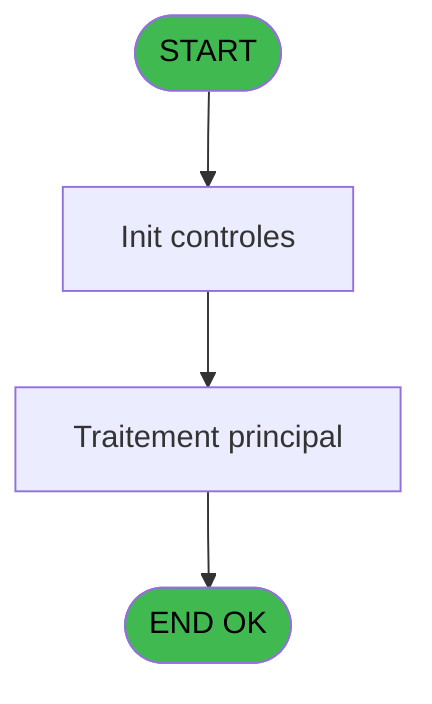
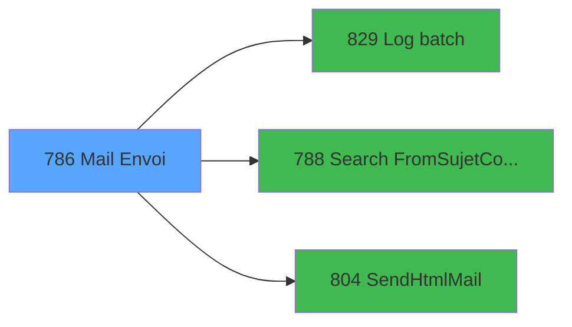

# REF IDE 786 - Mail Envoi

> **Analyse**: Phases 1-4 2026-02-03 14:21 -> 14:21 (14s) | Assemblage 14:21
> **Pipeline**: V7.2 Enrichi
> **Structure**: 4 onglets (Resume | Ecrans | Donnees | Connexions)

<!-- TAB:Resume -->

## 1. FICHE D'IDENTITE

| Attribut | Valeur |
|----------|--------|
| Projet | REF |
| IDE Position | 786 |
| Nom Programme | Mail Envoi |
| Fichier source | `Prg_786.xml` |
| Dossier IDE | General |
| Taches | 1 (0 ecrans visibles) |
| Tables modifiees | 0 |
| Programmes appeles | 3 |
| :warning: Statut | **ORPHELIN_POTENTIEL** |

## 2. DESCRIPTION FONCTIONNELLE

**Mail Envoi** assure la gestion complete de ce processus.

Le flux de traitement s'organise en **1 blocs fonctionnels** :

- **Traitement** (1 tache) : traitements metier divers

**Logique metier** : 1 regles identifiees couvrant conditions metier.

## 3. BLOCS FONCTIONNELS

### 3.1 Traitement (1 tache)

Traitements internes.

---

#### 786 - Mail Envoi [[ECRAN]](#ecran-t1)

**Role** : Traitement : Mail Envoi.
**Ecran** : 1499 x 470 DLU | [Voir mockup](#ecran-t1)
**Variables liees** : C (p.o Code Retour Envoi OK), O (v.Retour Envoi Mail), P (v.Mail from), U (v.Code erreur mail), V (v.Message erreur mail)
**Delegue a** : [Log batch (IDE 829)](REF-IDE-829.md), [Search From&Sujet&Corps Mail (IDE 788)](REF-IDE-788.md), [SendHtmlMail (IDE 804)](REF-IDE-804.md)

## 5. REGLES METIER

1 regles identifiees:

### Autres (1 regles)

#### [RM-001] Si p.o Code Retour Envoi OK [C] alors 'OK' sinon 'ERR')

| Element | Detail |
|---------|--------|
| **Condition** | `p.o Code Retour Envoi OK [C]` |
| **Si vrai** | 'OK' |
| **Si faux** | 'ERR') |
| **Variables** | C (p.o Code Retour Envoi OK) |
| **Expression source** | Expression 24 : `IF(p.o Code Retour Envoi OK [C], 'OK', 'ERR')` |
| **Exemple** | Si p.o Code Retour Envoi OK [C] → 'OK'. Sinon → 'ERR') |

## 6. CONTEXTE

- **Appele par**: (aucun)
- **Appelle**: 3 programmes | **Tables**: 4 (W:0 R:1 L:3) | **Taches**: 1 | **Expressions**: 32

<!-- TAB:Ecrans -->

## 8. ECRANS

*(Programme sans ecran visible)*

## 9. NAVIGATION

### 9.3 Structure hierarchique (1 tache)

| Position | Tache | Type | Dimensions | Bloc |
|----------|-------|------|------------|------|
| **786.1** | [**Mail Envoi** (786)](#t1) [mockup](#ecran-t1) | - | 1499x470 | Traitement |

### 9.4 Algorigramme

> **Legende**: Vert = START/END OK | Rouge = END KO | Bleu = Decisions
> *Algorigramme auto-genere. Utiliser `/algorigramme` pour une synthese metier detaillee.*

<!-- TAB:Donnees -->

## 10. TABLES

### Tables utilisees (4)

| ID | Nom | Description | Type | R | W | L | Usages |
|----|-----|-------------|------|---|---|---|--------|
| 67 | tables___________tab |  | DB | R |   |   | 1 |
| 69 | initialisation___ini |  | DB |   |   | L | 1 |
| 368 | pms_village |  | DB |   |   | L | 1 |
| 856 | adresse_service_village | Services / filieres | DB |   |   | L | 1 |

### Colonnes par table (3 / 1 tables avec colonnes identifiees)

Table 67 - tables___________tab (R) - 1 usages

| Lettre | Variable | Acces | Type |
|--------|----------|-------|------|
| A | p.i à: (To) | R | Alpha |
| B | p.i Fichier Joint | R | Alpha |
| C | p.o Code Retour Envoi OK | R | Logical |
| D | p.i viens de : | R | Alpha |
| E | p.i Langue | R | Alpha |
| F | p.i copie (CC) | R | Alpha |
| G | p.i TypeTraitement | R | Alpha |
| H | p.i Prenom | R | Alpha |
| I | p.i Nom | R | Alpha |
| J | p.i.Date Demande | R | Alpha |
| K | p.i.Heure Demande | R | Alpha |
| L | p.i.Url | R | Alpha |
| M | p.i.Date application | R | Date |
| N | p.i.Complément | R | Unicode |
| O | v.Retour Envoi Mail | R | Numeric |
| P | v.Mail from | R | Alpha |
| Q | v.Fichier Joint | R | Alpha |
| R | v.Sujet | R | Unicode |
| S | v.Corps | R | Unicode |
| T | v.Date | R | Date |
| U | v.Code erreur mail | R | Numeric |
| V | v.Message erreur mail | R | Alpha |
| W | v.CodeService | R | Unicode |
| X | v.Destinataire village ? | R | Logical |
| Y | v.Destinaire service ? | R | Logical |
| Z | v.Destinataire interne ? | R | Logical |

## 11. VARIABLES

### 11.1 Parametres entrants (14)

Variables recues en parametre.

| Lettre | Nom | Type | Usage dans |
|--------|-----|------|-----------|
| A | p.i à: (To) | Alpha | 5x parametre entrant |
| B | p.i Fichier Joint | Alpha | 2x parametre entrant |
| C | p.o Code Retour Envoi OK | Logical | [786](#t1) |
| D | p.i viens de : | Alpha | 1x parametre entrant |
| E | p.i Langue | Alpha | - |
| F | p.i copie (CC) | Alpha | 1x parametre entrant |
| G | p.i TypeTraitement | Alpha | 1x parametre entrant |
| H | p.i Prenom | Alpha | 1x parametre entrant |
| I | p.i Nom | Alpha | 1x parametre entrant |
| J | p.i.Date Demande | Alpha | - |
| K | p.i.Heure Demande | Alpha | - |
| L | p.i.Url | Alpha | - |
| M | p.i.Date application | Date | - |
| N | p.i.Complément | Unicode | - |

### 11.2 Variables de session (12)

Variables persistantes pendant toute la session.

| Lettre | Nom | Type | Usage dans |
|--------|-----|------|-----------|
| O | v.Retour Envoi Mail | Numeric | [786](#t1) |
| P | v.Mail from | Alpha | 1x session |
| Q | v.Fichier Joint | Alpha | 3x session |
| R | v.Sujet | Unicode | 3x session |
| S | v.Corps | Unicode | 2x session |
| T | v.Date | Date | - |
| U | v.Code erreur mail | Numeric | [786](#t1) |
| V | v.Message erreur mail | Alpha | [786](#t1) |
| W | v.CodeService | Unicode | - |
| X | v.Destinataire village ? | Logical | - |
| Y | v.Destinaire service ? | Logical | 1x session |
| Z | v.Destinataire interne ? | Logical | - |

Toutes les 26 variables (liste complete)

| Cat | Lettre | Nom Variable | Type |
|-----|--------|--------------|------|
| P0 | **A** | p.i à: (To) | Alpha |
| P0 | **B** | p.i Fichier Joint | Alpha |
| P0 | **C** | p.o Code Retour Envoi OK | Logical |
| P0 | **D** | p.i viens de : | Alpha |
| P0 | **E** | p.i Langue | Alpha |
| P0 | **F** | p.i copie (CC) | Alpha |
| P0 | **G** | p.i TypeTraitement | Alpha |
| P0 | **H** | p.i Prenom | Alpha |
| P0 | **I** | p.i Nom | Alpha |
| P0 | **J** | p.i.Date Demande | Alpha |
| P0 | **K** | p.i.Heure Demande | Alpha |
| P0 | **L** | p.i.Url | Alpha |
| P0 | **M** | p.i.Date application | Date |
| P0 | **N** | p.i.Complément | Unicode |
| V. | **O** | v.Retour Envoi Mail | Numeric |
| V. | **P** | v.Mail from | Alpha |
| V. | **Q** | v.Fichier Joint | Alpha |
| V. | **R** | v.Sujet | Unicode |
| V. | **S** | v.Corps | Unicode |
| V. | **T** | v.Date | Date |
| V. | **U** | v.Code erreur mail | Numeric |
| V. | **V** | v.Message erreur mail | Alpha |
| V. | **W** | v.CodeService | Unicode |
| V. | **X** | v.Destinataire village ? | Logical |
| V. | **Y** | v.Destinaire service ? | Logical |
| V. | **Z** | v.Destinataire interne ? | Logical |

## 12. EXPRESSIONS

**32 / 32 expressions decodees (100%)**

### 12.1 Repartition par type

| Type | Expressions | Regles |
|------|-------------|--------|
| CONDITION | 5 | 5 |
| CONSTANTE | 6 | 0 |
| DATE | 1 | 0 |
| FORMAT | 2 | 0 |
| OTHER | 14 | 0 |
| STRING | 4 | 0 |

### 12.2 Expressions cles par type

#### CONDITION (5 expressions)

| Type | IDE | Expression | Regle |
|------|-----|------------|-------|
| CONDITION | 24 | `IF(p.o Code Retour Envoi OK [C], 'OK', 'ERR')` | [RM-001](#rm-RM-001) |
| CONDITION | 17 | `p.i à: (To) [A]<>'' AND ([AD] OR [AF])` | - |
| CONDITION | 26 | `Translate('%club_tracemail%')='O'` | - |
| CONDITION | 6 | `v.Retour Envoi Mail [O]=0 OR v.Code erreur mail [U]=0` | - |
| CONDITION | 14 | `NOT(p.o Code Retour Envoi OK [C]) OR Translate('%club_tracemail%')='O'` | - |

#### CONSTANTE (6 expressions)

| Type | IDE | Expression | Regle |
|------|-----|------------|-------|
| CONSTANTE | 23 | `'ERR'` | - |
| CONSTANTE | 27 | `'Send mail'` | - |
| CONSTANTE | 29 | `'txt'` | - |
| CONSTANTE | 10 | `'VSERV'` | - |
| CONSTANTE | 19 | `'EMAIL'` | - |
| ... | | *+1 autres* | |

#### DATE (1 expressions)

| Type | IDE | Expression | Regle |
|------|-----|------------|-------|
| DATE | 3 | `Date()` | - |

#### FORMAT (2 expressions)

| Type | IDE | Expression | Regle |
|------|-----|------------|-------|
| FORMAT | 8 | `MailError(v.Code erreur mail [U]) & ' Code Erreur : ' & Trim(Str(v.Code erreur mail [U],'N6'))` | - |
| FORMAT | 4 | `'%club_exportdata%'&'trace_mail_'&DStr(Date(),'YYYYMM')&'.txt'` | - |

#### OTHER (14 expressions)

| Type | IDE | Expression | Regle |
|------|-----|------------|-------|
| OTHER | 22 | `StrBuild('Origin @1@', p.i viens de : [D])` | - |
| OTHER | 21 | `StrBuild('Email to @1@ for @2@', p.i à: (To) [A], p.i TypeTraitement [G])` | - |
| OTHER | 18 | `[AG]` | - |
| OTHER | 25 | `v.Message erreur mail [V]` | - |
| OTHER | 31 | `File2Blb (v.Fichier Joint [Q])` | - |
| ... | | *+9 autres* | |

#### STRING (4 expressions)

| Type | IDE | Expression | Regle |
|------|-----|------------|-------|
| STRING | 12 | `StrToken(Trim(p.i Fichier Joint [B]),2,'_')` | - |
| STRING | 32 | `Flip(StrToken(Flip(Trim(v.Fichier Joint [Q])), 1, '.'))` | - |
| STRING | 5 | `MailSend(Trim(v.Mail from [P]),Trim(p.i à: (To) [A]),Trim(p.i copie (CC) [F]),'',Trim(v.Sujet [R]),Trim(v.Corps [S]),Trim(v.Fichier Joint [Q]))` | - |
| STRING | 9 | `Trim(p.i Fichier Joint [B])` | - |

### 12.3 Toutes les expressions (32)

Voir les 32 expressions

#### CONDITION (5)

| IDE | Expression Decodee |
|-----|-------------------|
| 24 | `IF(p.o Code Retour Envoi OK [C], 'OK', 'ERR')` |
| 6 | `v.Retour Envoi Mail [O]=0 OR v.Code erreur mail [U]=0` |
| 14 | `NOT(p.o Code Retour Envoi OK [C]) OR Translate('%club_tracemail%')='O'` |
| 17 | `p.i à: (To) [A]<>'' AND ([AD] OR [AF])` |
| 26 | `Translate('%club_tracemail%')='O'` |

#### CONSTANTE (6)

| IDE | Expression Decodee |
|-----|-------------------|
| 10 | `'VSERV'` |
| 19 | `'EMAIL'` |
| 20 | `'Error sending email'` |
| 23 | `'ERR'` |
| 27 | `'Send mail'` |
| 29 | `'txt'` |

#### DATE (1)

| IDE | Expression Decodee |
|-----|-------------------|
| 3 | `Date()` |

#### FORMAT (2)

| IDE | Expression Decodee |
|-----|-------------------|
| 4 | `'%club_exportdata%'&'trace_mail_'&DStr(Date(),'YYYYMM')&'.txt'` |
| 8 | `MailError(v.Code erreur mail [U]) & ' Code Erreur : ' & Trim(Str(v.Code erreur mail [U],'N6'))` |

#### OTHER (14)

| IDE | Expression Decodee |
|-----|-------------------|
| 1 | `p.i à: (To) [A]` |
| 2 | `Time()` |
| 7 | `MailLastRC()` |
| 11 | `v.Destinaire service ? [Y]` |
| 13 | `NOT(VG28)` |
| 15 | `p.i à: (To) [A]` |
| 16 | `StrBuild('[@1@ @2@] @3@', p.i Prenom [H], p.i Nom [I], v.Sujet [R])` |
| 18 | `[AG]` |
| 21 | `StrBuild('Email to @1@ for @2@', p.i à: (To) [A], p.i TypeTraitement [G])` |
| 22 | `StrBuild('Origin @1@', p.i viens de : [D])` |
| 25 | `v.Message erreur mail [V]` |
| 28 | `v.Corps [S]` |
| 30 | `v.Sujet [R]` |
| 31 | `File2Blb (v.Fichier Joint [Q])` |

#### STRING (4)

| IDE | Expression Decodee |
|-----|-------------------|
| 5 | `MailSend(Trim(v.Mail from [P]),Trim(p.i à: (To) [A]),Trim(p.i copie (CC) [F]),'',Trim(v.Sujet [R]),Trim(v.Corps [S]),Trim(v.Fichier Joint [Q]))` |
| 9 | `Trim(p.i Fichier Joint [B])` |
| 12 | `StrToken(Trim(p.i Fichier Joint [B]),2,'_')` |
| 32 | `Flip(StrToken(Flip(Trim(v.Fichier Joint [Q])), 1, '.'))` |

<!-- TAB:Connexions -->

## 13. GRAPHE D'APPELS

### 13.1 Chaine depuis Main (Callers)

**Chemin**: (pas de callers directs)

### 13.2 Callers

| IDE | Nom Programme | Nb Appels |
|-----|---------------|-----------|
| - | (aucun) | - |

### 13.3 Callees (programmes appeles)

### 13.4 Detail Callees avec contexte

| IDE | Nom Programme | Appels | Contexte |
|-----|---------------|--------|----------|
| [829](REF-IDE-829.md) | Log batch | 2 | Sous-programme |
| [788](REF-IDE-788.md) | Search From&Sujet&Corps Mail | 1 | Sous-programme |
| [804](REF-IDE-804.md) | SendHtmlMail | 1 | Sous-programme |

## 14. RECOMMANDATIONS MIGRATION

### 14.1 Profil du programme

| Metrique | Valeur | Impact migration |
|----------|--------|-----------------|
| Lignes de logique | 78 | Programme compact |
| Expressions | 32 | Peu de logique |
| Tables WRITE | 0 | Impact faible |
| Sous-programmes | 3 | Peu de dependances |
| Ecrans visibles | 0 | Ecran unique ou traitement batch |
| Code desactive | 0% (0 / 78) | Code sain |
| Regles metier | 1 | Quelques regles a preserver |

### 14.2 Plan de migration par bloc

#### Traitement (1 tache: 1 ecran, 0 traitement)

- **Strategie** : 1 composant(s) UI (Razor/React) avec formulaires et validation.
- 3 sous-programme(s) a migrer ou a reutiliser depuis les services existants.
- Decomposer les taches en services unitaires testables.

### 14.3 Dependances critiques

| Dependance | Type | Appels | Impact |
|------------|------|--------|--------|
| [Log batch (IDE 829)](REF-IDE-829.md) | Sous-programme | 2x | Haute - Sous-programme |
| [SendHtmlMail (IDE 804)](REF-IDE-804.md) | Sous-programme | 1x | Normale - Sous-programme |
| [Search From&Sujet&Corps Mail (IDE 788)](REF-IDE-788.md) | Sous-programme | 1x | Normale - Sous-programme |

---
*Spec DETAILED generee par Pipeline V7.2 - 2026-02-03 14:21*
