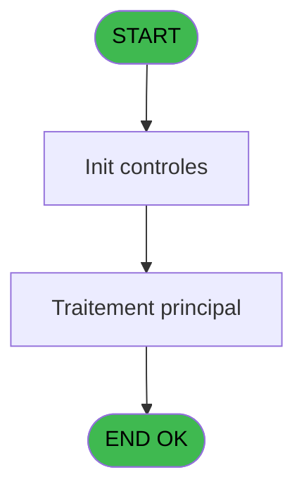

# REF IDE 788 - Search From&Sujet&Corps Mail

> **Analyse**: Phases 1-4 2026-02-03 14:22 -> 14:22 (14s) | Assemblage 14:22
> **Pipeline**: V7.2 Enrichi
> **Structure**: 4 onglets (Resume | Ecrans | Donnees | Connexions)

<!-- TAB:Resume -->

## 1. FICHE D'IDENTITE

| Attribut | Valeur |
|----------|--------|
| Projet | REF |
| IDE Position | 788 |
| Nom Programme | Search From&Sujet&Corps Mail |
| Fichier source | `Prg_788.xml` |
| Dossier IDE | General |
| Taches | 1 (0 ecrans visibles) |
| Tables modifiees | 0 |
| Programmes appeles | 1 |

## 2. DESCRIPTION FONCTIONNELLE

**Search From&Sujet&Corps Mail** assure la gestion complete de ce processus, accessible depuis [Mail Envoi (IDE 786)](REF-IDE-786.md), [Test Envoi Mail (IDE 880)](REF-IDE-880.md).

Le flux de traitement s'organise en **1 blocs fonctionnels** :

- **Traitement** (1 tache) : traitements metier divers

## 3. BLOCS FONCTIONNELS

### 3.1 Traitement (1 tache)

Traitements internes.

---

#### 788 - Reach From & Sujet & Corps Mai [[ECRAN]](#ecran-t1)

**Role** : Traitement : Reach From & Sujet & Corps Mai.
**Ecran** : 622 x 247 DLU | [Voir mockup](#ecran-t1)
**Variables liees** : B (P.i.o.Sujet), C (P.i.o.Corps), I (P.i.o.Mail From)
**Delegue a** : [Search From&Sujet&Corps Mul_PJ (IDE 789)](REF-IDE-789.md)

## 5. REGLES METIER

*(Aucune regle metier identifiee)*

## 6. CONTEXTE

- **Appele par**: [Mail Envoi (IDE 786)](REF-IDE-786.md), [Test Envoi Mail (IDE 880)](REF-IDE-880.md)
- **Appelle**: 1 programmes | **Tables**: 0 (W:0 R:0 L:0) | **Taches**: 1 | **Expressions**: 0

<!-- TAB:Ecrans -->

## 8. ECRANS

*(Programme sans ecran visible)*

## 9. NAVIGATION

### 9.3 Structure hierarchique (1 tache)

| Position | Tache | Type | Dimensions | Bloc |
|----------|-------|------|------------|------|
| **788.1** | [**Reach From & Sujet & Corps Mai** (788)](#t1) [mockup](#ecran-t1) | - | 622x247 | Traitement |

### 9.4 Algorigramme

> **Legende**: Vert = START/END OK | Rouge = END KO | Bleu = Decisions
> *Algorigramme auto-genere. Utiliser `/algorigramme` pour une synthese metier detaillee.*

<!-- TAB:Donnees -->

## 10. TABLES

### Tables utilisees (0)

| ID | Nom | Description | Type | R | W | L | Usages |
|----|-----|-------------|------|---|---|---|--------|

### Colonnes par table (0 / 0 tables avec colonnes identifiees)

## 11. VARIABLES

### 11.1 Parametres entrants (17)

Variables recues du programme appelant ([Mail Envoi (IDE 786)](REF-IDE-786.md)).

| Lettre | Nom | Type | Usage dans |
|--------|-----|------|-----------|
| A | P.i.Type de Traitement | Alpha | - |
| B | P.i.o.Sujet | Alpha | - |
| C | P.i.o.Corps | Alpha | - |
| D | P.i.Nom Village | Alpha | - |
| E | P.i.Date Demande | Alpha | - |
| F | P.i.Nom Fic1 | Alpha | - |
| G | P.i.Nom Fic2 | Alpha | - |
| H | P.i.Zone | Alpha | - |
| I | P.i.o.Mail From | Alpha | - |
| J | P.i.Langue | Alpha | - |
| K | P.i.Prenom | Alpha | - |
| L | P.i.Nom | Alpha | - |
| M | P.i.LibelleService | Alpha | - |
| N | P.i.Heure Demande | Alpha | - |
| O | P.i.Url | Alpha | - |
| P | P.i.Date application | Date | - |
| Q | P.i.Complément | Unicode | - |

Toutes les 17 variables (liste complete)

| Cat | Lettre | Nom Variable | Type |
|-----|--------|--------------|------|
| P0 | **A** | P.i.Type de Traitement | Alpha |
| P0 | **B** | P.i.o.Sujet | Alpha |
| P0 | **C** | P.i.o.Corps | Alpha |
| P0 | **D** | P.i.Nom Village | Alpha |
| P0 | **E** | P.i.Date Demande | Alpha |
| P0 | **F** | P.i.Nom Fic1 | Alpha |
| P0 | **G** | P.i.Nom Fic2 | Alpha |
| P0 | **H** | P.i.Zone | Alpha |
| P0 | **I** | P.i.o.Mail From | Alpha |
| P0 | **J** | P.i.Langue | Alpha |
| P0 | **K** | P.i.Prenom | Alpha |
| P0 | **L** | P.i.Nom | Alpha |
| P0 | **M** | P.i.LibelleService | Alpha |
| P0 | **N** | P.i.Heure Demande | Alpha |
| P0 | **O** | P.i.Url | Alpha |
| P0 | **P** | P.i.Date application | Date |
| P0 | **Q** | P.i.Complément | Unicode |

## 12. EXPRESSIONS

**0 / 0 expressions decodees (0%)**

### 12.1 Repartition par type

| Type | Expressions | Regles |
|------|-------------|--------|

### 12.2 Expressions cles par type

<!-- TAB:Connexions -->

## 13. GRAPHE D'APPELS

### 13.1 Chaine depuis Main (Callers)

Main -> ... -> [Mail Envoi (IDE 786)](REF-IDE-786.md) -> **Search From&Sujet&Corps Mail (IDE 788)**

Main -> ... -> [Test Envoi Mail (IDE 880)](REF-IDE-880.md) -> **Search From&Sujet&Corps Mail (IDE 788)**

### 13.2 Callers

| IDE | Nom Programme | Nb Appels |
|-----|---------------|-----------|
| [786](REF-IDE-786.md) | Mail Envoi | 1 |
| [880](REF-IDE-880.md) | Test Envoi Mail | 1 |

### 13.3 Callees (programmes appeles)

### 13.4 Detail Callees avec contexte

| IDE | Nom Programme | Appels | Contexte |
|-----|---------------|--------|----------|
| [789](REF-IDE-789.md) | Search From&Sujet&Corps Mul_PJ | 1 | Sous-programme |

## 14. RECOMMANDATIONS MIGRATION

### 14.1 Profil du programme

| Metrique | Valeur | Impact migration |
|----------|--------|-----------------|
| Lignes de logique | 19 | Programme compact |
| Expressions | 0 | Peu de logique |
| Tables WRITE | 0 | Impact faible |
| Sous-programmes | 1 | Peu de dependances |
| Ecrans visibles | 0 | Ecran unique ou traitement batch |
| Code desactive | 0% (0 / 19) | Code sain |
| Regles metier | 0 | Pas de regle identifiee |

### 14.2 Plan de migration par bloc

#### Traitement (1 tache: 1 ecran, 0 traitement)

- **Strategie** : 1 composant(s) UI (Razor/React) avec formulaires et validation.
- 1 sous-programme(s) a migrer ou a reutiliser depuis les services existants.
- Decomposer les taches en services unitaires testables.

### 14.3 Dependances critiques

| Dependance | Type | Appels | Impact |
|------------|------|--------|--------|
| [Search From&Sujet&Corps Mul_PJ (IDE 789)](REF-IDE-789.md) | Sous-programme | 1x | Normale - Sous-programme |

---
*Spec DETAILED generee par Pipeline V7.2 - 2026-02-03 14:22*
