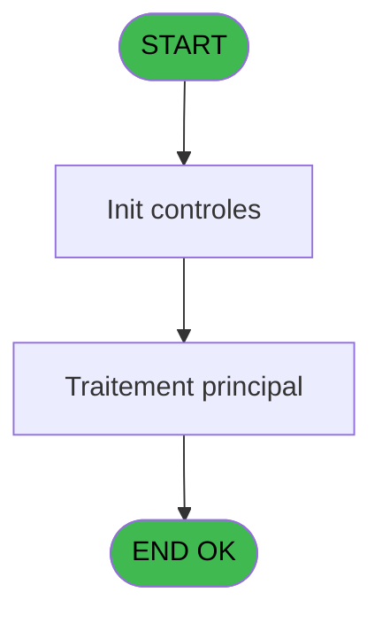
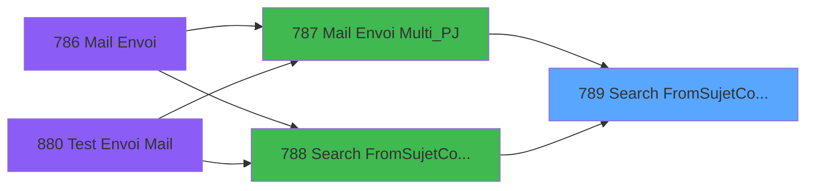
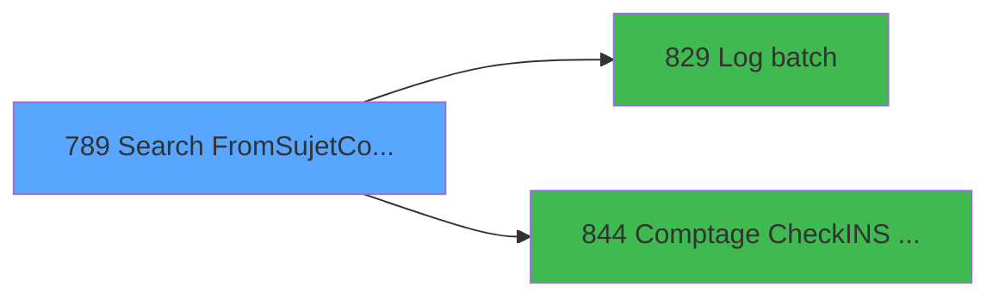

# REF IDE 789 - Search From&Sujet&Corps Mul_PJ

> **Analyse**: Phases 1-4 2026-02-03 14:22 -> 14:22 (15s) | Assemblage 14:23
> **Pipeline**: V7.2 Enrichi
> **Structure**: 4 onglets (Resume | Ecrans | Donnees | Connexions)

<!-- TAB:Resume -->

## 1. FICHE D'IDENTITE

| Attribut | Valeur |
|----------|--------|
| Projet | REF |
| IDE Position | 789 |
| Nom Programme | Search From&Sujet&Corps Mul_PJ |
| Fichier source | `Prg_789.xml` |
| Dossier IDE | General |
| Taches | 2 (0 ecrans visibles) |
| Tables modifiees | 0 |
| Programmes appeles | 2 |

## 2. DESCRIPTION FONCTIONNELLE

**Search From&Sujet&Corps Mul_PJ** assure la gestion complete de ce processus, accessible depuis [Mail Envoi Multi_PJ (IDE 787)](REF-IDE-787.md), [Search From&Sujet&Corps Mail (IDE 788)](REF-IDE-788.md).

Le flux de traitement s'organise en **1 blocs fonctionnels** :

- **Traitement** (2 taches) : traitements metier divers

**Logique metier** : 3 regles identifiees couvrant conditions metier.

## 3. BLOCS FONCTIONNELS

### 3.1 Traitement (2 taches)

Traitements internes.

---

#### 789 - Reach From & Sujet & Corps Mai [[ECRAN]](#ecran-t1)

**Role** : Traitement : Reach From & Sujet & Corps Mai.
**Ecran** : 622 x 326 DLU | [Voir mockup](#ecran-t1)
**Variables liees** : B (P.i.o.Sujet), C (P.i.o.Corps), J (P.i.o.Mail From), S (v.Sujet working), T (v.Corps)
**Delegue a** : [Log batch (IDE 829)](REF-IDE-829.md)

---

#### 789.1 - Count Test et Erreur

**Role** : Verification : Count Test et Erreur.
**Variables liees** : W (v.Nb Erreurs), Y (v.Message erreur Checkins)
**Delegue a** : [Log batch (IDE 829)](REF-IDE-829.md)

## 5. REGLES METIER

3 regles identifiees:

### Autres (3 regles)

#### [RM-001] Si P.i.o.Mail From [J]<>'FRA' alors 'ENG' sinon 'FRA')

| Element | Detail |
|---------|--------|
| **Condition** | `P.i.o.Mail From [J]<>'FRA'` |
| **Si vrai** | 'ENG' |
| **Si faux** | 'FRA') |
| **Variables** | J (P.i.o.Mail From) |
| **Expression source** | Expression 31 : `IF(P.i.o.Mail From [J]<>'FRA','ENG','FRA')` |
| **Exemple** | Si P.i.o.Mail From [J]<>'FRA' → 'ENG'. Sinon → 'FRA') |

#### [RM-002] Traitement si Trim(P.i.Date Demande [E]) est renseigne

| Element | Detail |
|---------|--------|
| **Condition** | `Trim(P.i.Date Demande [E])<>''` |
| **Si vrai** | Trim(P.i.Date Demande [E]) |
| **Si faux** | DStr(Date(),'DD/MM/YYYY')) |
| **Variables** | E (P.i.Date Demande) |
| **Expression source** | Expression 32 : `IF(Trim(P.i.Date Demande [E])<>'',Trim(P.i.Date Demande [E])` |
| **Exemple** | Si Trim(P.i.Date Demande [E])<>'' → Trim(P.i.Date Demande [E]). Sinon → DStr(Date(),'DD/MM/YYYY')) |

#### [RM-003] Traitement si Trim(P.i.LibelleService [N]) est renseigne

| Element | Detail |
|---------|--------|
| **Condition** | `Trim(P.i.LibelleService [N])<>''` |
| **Si vrai** | Trim(P.i.LibelleService [N]) |
| **Si faux** | TStr(Time(),'HH:MM')) |
| **Variables** | N (P.i.LibelleService) |
| **Expression source** | Expression 39 : `IF(Trim(P.i.LibelleService [N])<>'',Trim(P.i.LibelleService ` |
| **Exemple** | Si Trim(P.i.LibelleService [N])<>'' → Trim(P.i.LibelleService [N]). Sinon → TStr(Time(),'HH:MM')) |

## 6. CONTEXTE

- **Appele par**: [Mail Envoi Multi_PJ (IDE 787)](REF-IDE-787.md), [Search From&Sujet&Corps Mail (IDE 788)](REF-IDE-788.md)
- **Appelle**: 2 programmes | **Tables**: 3 (W:0 R:1 L:2) | **Taches**: 2 | **Expressions**: 55

<!-- TAB:Ecrans -->

## 8. ECRANS

*(Programme sans ecran visible)*

## 9. NAVIGATION

### 9.3 Structure hierarchique (2 taches)

| Position | Tache | Type | Dimensions | Bloc |
|----------|-------|------|------------|------|
| **789.1** | [**Reach From & Sujet & Corps Mai** (789)](#t1) [mockup](#ecran-t1) | - | 622x326 | Traitement |
| 789.1.1 | [Count Test et Erreur (789.1)](#t2) | - | - | |

### 9.4 Algorigramme

> **Legende**: Vert = START/END OK | Rouge = END KO | Bleu = Decisions
> *Algorigramme auto-genere. Utiliser `/algorigramme` pour une synthese metier detaillee.*

<!-- TAB:Donnees -->

## 10. TABLES

### Tables utilisees (3)

| ID | Nom | Description | Type | R | W | L | Usages |
|----|-----|-------------|------|---|---|---|--------|
| 69 | initialisation___ini |  | DB | R |   |   | 1 |
| 368 | pms_village |  | DB |   |   | L | 1 |
| 862 | param_traitement_mail |  | DB |   |   | L | 1 |

### Colonnes par table (3 / 1 tables avec colonnes identifiees)

Table 69 - initialisation___ini (R) - 1 usages

| Lettre | Variable | Acces | Type |
|--------|----------|-------|------|
| A | P.i.Type de Traitement | R | Alpha |
| B | P.i.o.Sujet | R | Alpha |
| C | P.i.o.Corps | R | Alpha |
| D | P.i.Nom Village | R | Alpha |
| E | P.i.Date Demande | R | Alpha |
| F | P.i.Nom Fic1 | R | Alpha |
| G | P.i.Nom Fic2 | R | Alpha |
| H | P.i.Nom Fic3 | R | Alpha |
| I | P.i.Zone | R | Alpha |
| J | P.i.o.Mail From | R | Alpha |
| K | P.i.Langue | R | Alpha |
| L | P.i.Prenom | R | Alpha |
| M | P.i.Nom | R | Alpha |
| N | P.i.LibelleService | R | Alpha |
| O | P.i.Heure Demande | R | Alpha |
| P | P.i.Url | R | Alpha |
| Q | P.i.Date application | R | Date |
| R | P.i.Complément | R | Unicode |
| S | v.Sujet working | R | Alpha |
| T | v.Corps | R | Alpha |
| U | v.Date | R | Alpha |
| V | v.Time | R | Alpha |
| W | v.Nb Erreurs | R | Numeric |
| X | v.Nb Total | R | Numeric |
| Y | v.Message erreur Checkins | R | Unicode |
| Z | v.Server | R | Alpha |

## 11. VARIABLES

### 11.1 Parametres entrants (18)

Variables recues du programme appelant ([Mail Envoi Multi_PJ (IDE 787)](REF-IDE-787.md)).

| Lettre | Nom | Type | Usage dans |
|--------|-----|------|-----------|
| A | P.i.Type de Traitement | Alpha | 4x parametre entrant |
| B | P.i.o.Sujet | Alpha | - |
| C | P.i.o.Corps | Alpha | - |
| D | P.i.Nom Village | Alpha | 3x parametre entrant |
| E | P.i.Date Demande | Alpha | 2x parametre entrant |
| F | P.i.Nom Fic1 | Alpha | 2x parametre entrant |
| G | P.i.Nom Fic2 | Alpha | 3x parametre entrant |
| H | P.i.Nom Fic3 | Alpha | 2x parametre entrant |
| I | P.i.Zone | Alpha | - |
| J | P.i.o.Mail From | Alpha | [789](#t1) |
| K | P.i.Langue | Alpha | 1x parametre entrant |
| L | P.i.Prenom | Alpha | 1x parametre entrant |
| M | P.i.Nom | Alpha | 12x parametre entrant |
| N | P.i.LibelleService | Alpha | 1x parametre entrant |
| O | P.i.Heure Demande | Alpha | 1x parametre entrant |
| P | P.i.Url | Alpha | 3x parametre entrant |
| Q | P.i.Date application | Date | 2x parametre entrant |
| R | P.i.Complément | Unicode | - |

### 11.2 Variables de session (8)

Variables persistantes pendant toute la session.

| Lettre | Nom | Type | Usage dans |
|--------|-----|------|-----------|
| S | v.Sujet working | Alpha | - |
| T | v.Corps | Alpha | 1x session |
| U | v.Date | Alpha | 1x session |
| V | v.Time | Alpha | 1x session |
| W | v.Nb Erreurs | Numeric | 1x session |
| X | v.Nb Total | Numeric | 1x session |
| Y | v.Message erreur Checkins | Unicode | [789.1](#t2) |
| Z | v.Server | Alpha | - |

Toutes les 26 variables (liste complete)

| Cat | Lettre | Nom Variable | Type |
|-----|--------|--------------|------|
| P0 | **A** | P.i.Type de Traitement | Alpha |
| P0 | **B** | P.i.o.Sujet | Alpha |
| P0 | **C** | P.i.o.Corps | Alpha |
| P0 | **D** | P.i.Nom Village | Alpha |
| P0 | **E** | P.i.Date Demande | Alpha |
| P0 | **F** | P.i.Nom Fic1 | Alpha |
| P0 | **G** | P.i.Nom Fic2 | Alpha |
| P0 | **H** | P.i.Nom Fic3 | Alpha |
| P0 | **I** | P.i.Zone | Alpha |
| P0 | **J** | P.i.o.Mail From | Alpha |
| P0 | **K** | P.i.Langue | Alpha |
| P0 | **L** | P.i.Prenom | Alpha |
| P0 | **M** | P.i.Nom | Alpha |
| P0 | **N** | P.i.LibelleService | Alpha |
| P0 | **O** | P.i.Heure Demande | Alpha |
| P0 | **P** | P.i.Url | Alpha |
| P0 | **Q** | P.i.Date application | Date |
| P0 | **R** | P.i.Complément | Unicode |
| V. | **S** | v.Sujet working | Alpha |
| V. | **T** | v.Corps | Alpha |
| V. | **U** | v.Date | Alpha |
| V. | **V** | v.Time | Alpha |
| V. | **W** | v.Nb Erreurs | Numeric |
| V. | **X** | v.Nb Total | Numeric |
| V. | **Y** | v.Message erreur Checkins | Unicode |
| V. | **Z** | v.Server | Alpha |

## 12. EXPRESSIONS

**55 / 55 expressions decodees (100%)**

### 12.1 Repartition par type

| Type | Expressions | Regles |
|------|-------------|--------|
| FORMAT | 29 | 0 |
| CONDITION | 11 | 3 |
| CONSTANTE | 5 | 0 |
| OTHER | 5 | 0 |
| NEGATION | 1 | 0 |
| STRING | 4 | 0 |

### 12.2 Expressions cles par type

#### FORMAT (29 expressions)

| Type | IDE | Expression | Regle |
|------|-----|------------|-------|
| FORMAT | 18 | `RepStr([AD],'<TAG_HEURE>',Trim([AF]))` | - |
| FORMAT | 19 | `RepStr([AD],'<TAG_TELEPHONE>',Trim([AA]))` | - |
| FORMAT | 20 | `RepStr([AD],'<TAG_SERVICE>',Trim(P.i.Nom [M]))` | - |
| FORMAT | 17 | `RepStr([AD],'<TAG_DATE>',[AE])` | - |
| FORMAT | 13 | `RepStr([AD],'<TAG_PRENOM>',Trim(P.i.Langue [K]))` | - |
| ... | | *+24 autres* | |

#### CONDITION (11 expressions)

| Type | IDE | Expression | Regle |
|------|-----|------------|-------|
| CONDITION | 39 | `IF(Trim(P.i.LibelleService [N])<>'',Trim(P.i.LibelleService [N]),TStr(Time(),'HH:MM'))` | [RM-003](#rm-RM-003) |
| CONDITION | 32 | `IF(Trim(P.i.Date Demande [E])<>'',Trim(P.i.Date Demande [E]),DStr(Date(),'DD/MM/YYYY'))` | [RM-002](#rm-RM-002) |
| CONDITION | 31 | `IF(P.i.o.Mail From [J]<>'FRA','ENG','FRA')` | [RM-001](#rm-RM-001) |
| CONDITION | 41 | `Counter(0)=0` | - |
| CONDITION | 27 | `P.i.Nom Fic3 [H]<>''` | - |
| ... | | *+6 autres* | |

#### CONSTANTE (5 expressions)

| Type | IDE | Expression | Regle |
|------|-----|------------|-------|
| CONSTANTE | 51 | `'E'` | - |
| CONSTANTE | 52 | `'T'` | - |
| CONSTANTE | 45 | `'ERR'` | - |
| CONSTANTE | 42 | `'EMAIL'` | - |
| CONSTANTE | 43 | `'Error parameters'` | - |

#### OTHER (5 expressions)

| Type | IDE | Expression | Regle |
|------|-----|------------|-------|
| OTHER | 44 | `StrBuild('No parameters for @1@, table: @2@', P.i.Type de Traitement [A], 'param_traitement_mail')` | - |
| OTHER | 48 | `StrToken(INIGet('[MAGIC_DATABASES]Pms'),5,',')` | - |
| OTHER | 30 | `[AD]` | - |
| OTHER | 1 | `v.Message erreur Checkins [Y]` | - |
| OTHER | 29 | `[AC]` | - |

#### NEGATION (1 expressions)

| Type | IDE | Expression | Regle |
|------|-----|------------|-------|
| NEGATION | 40 | `NOT ISNULL(P.i.Url [P])` | - |

#### STRING (4 expressions)

| Type | IDE | Expression | Regle |
|------|-----|------------|-------|
| STRING | 22 | `Trim(v.Time [V])` | - |
| STRING | 28 | `Trim(v.Corps [T])` | - |
| STRING | 12 | `Trim(v.Date [U])` | - |
| STRING | 21 | `Trim(P.i.Type de Traitement [A])` | - |

### 12.3 Toutes les expressions (55)

Voir les 55 expressions

#### FORMAT (29)

| IDE | Expression Decodee |
|-----|-------------------|
| 16 | `RepStr([AD],'<TAG_MAIL_VILLAGE>',IF(VG28,'<A HREF="mailto:'&Trim([AB])&'">','')&Trim([AB])&IF(VG28,'</A>',''))` |
| 49 | `Left([AI],InStr(Trim([AI]),'\')-1)` |
| 9 | `RepStr([AC],'<TAG_DATE_APPLICATION>',DStr(P.i.Url [P], 'DD/MM/YYYY'))` |
| 33 | `RepStr([AD],'<TAG_HIVER>',IF(VG26 AND IN(Month(Date()),1,2,3,4,5,11,12),Trim(v.Nb Erreurs [W]),''))` |
| 34 | `RepStr([AD],'<TAG_WINTER>',IF(VG26 AND IN(Month(Date()),1,2,3,4,5,11,12),Trim(v.Nb Total [X]),''))` |
| 36 | `RepStr([AD],'<TAG_DATE_APPLICATION>',DStr(P.i.Url [P], 'DD/MM/YYYY'))` |
| 2 | `RepStr([AC],'<TAG_DATE>',Trim(P.i.Date Demande [E]))` |
| 3 | `RepStr([AC],'<TAG_VILLAGE>',Trim(P.i.Nom Village [D]))` |
| 4 | `RepStr([AC],'<TAG_FIC1>',Trim(P.i.Nom Fic1 [F]))` |
| 5 | `RepStr([AC],'<TAG_FIC2>',Trim(P.i.Nom Fic2 [G]))` |
| 6 | `RepStr([AC],'<TAG_FIC3>',Trim(P.i.Nom Fic2 [G]))` |
| 7 | `RepStr([AC],'<TAG_ZONE>',Trim(P.i.Nom Fic3 [H]))` |
| 8 | `RepStr([AC],'<TAG_SERVICE>',Trim(P.i.Nom [M]))` |
| 10 | `RepStr([AC],'<TAG_COMPLEMENT>',Trim(P.i.Date application [Q]))` |
| 11 | `RepStr([AC],'<TAG_SERVEUR>',Trim([AI]))` |
| 13 | `RepStr([AD],'<TAG_PRENOM>',Trim(P.i.Langue [K]))` |
| 14 | `RepStr([AD],'<TAG_VILLAGE>',Trim(P.i.Nom Village [D]))` |
| 15 | `RepStr([AD],'<TAG_NOM>',Trim(P.i.Prenom [L]))` |
| 17 | `RepStr([AD],'<TAG_DATE>',[AE])` |
| 18 | `RepStr([AD],'<TAG_HEURE>',Trim([AF]))` |
| 19 | `RepStr([AD],'<TAG_TELEPHONE>',Trim([AA]))` |
| 20 | `RepStr([AD],'<TAG_SERVICE>',Trim(P.i.Nom [M]))` |
| 35 | `RepStr([AD],'<TAG_URL>',Trim(P.i.Heure Demande [O]))` |
| 37 | `RepStr([AD],'<TAG_COMPLEMENT>',Trim(P.i.Date application [Q]))` |
| 38 | `RepStr([AD],'<TAG_SERVEUR>',Trim([AI]))` |
| 50 | `InStr(Trim([AI]),'\')>0` |
| 53 | `RepStr([AD],'<TAG_NB_ERREURS>',Trim(Str([AG],'10')))` |
| 54 | `RepStr([AD],'<TAG_NB_TOTAL>',Trim(Str([AH],'10')))` |
| 55 | `RepStr([AD],'<TAG_ERREUR_CHECKINS>',Trim([AK]))` |

#### CONDITION (11)

| IDE | Expression Decodee |
|-----|-------------------|
| 31 | `IF(P.i.o.Mail From [J]<>'FRA','ENG','FRA')` |
| 32 | `IF(Trim(P.i.Date Demande [E])<>'',Trim(P.i.Date Demande [E]),DStr(Date(),'DD/MM/YYYY'))` |
| 39 | `IF(Trim(P.i.LibelleService [N])<>'',Trim(P.i.LibelleService [N]),TStr(Time(),'HH:MM'))` |
| 23 | `P.i.Nom Village [D]<>''` |
| 24 | `P.i.Nom Fic1 [F]<>''` |
| 25 | `P.i.Nom Fic2 [G]<>''` |
| 26 | `[AJ]<>''` |
| 27 | `P.i.Nom Fic3 [H]<>''` |
| 41 | `Counter(0)=0` |
| 46 | `Trim(P.i.Type de Traitement [A])='TESTECO'` |
| 47 | `Trim(P.i.Type de Traitement [A])='CHECKINS'` |

#### CONSTANTE (5)

| IDE | Expression Decodee |
|-----|-------------------|
| 42 | `'EMAIL'` |
| 43 | `'Error parameters'` |
| 45 | `'ERR'` |
| 51 | `'E'` |
| 52 | `'T'` |

#### OTHER (5)

| IDE | Expression Decodee |
|-----|-------------------|
| 1 | `v.Message erreur Checkins [Y]` |
| 29 | `[AC]` |
| 30 | `[AD]` |
| 44 | `StrBuild('No parameters for @1@, table: @2@', P.i.Type de Traitement [A], 'param_traitement_mail')` |
| 48 | `StrToken(INIGet('[MAGIC_DATABASES]Pms'),5,',')` |

#### NEGATION (1)

| IDE | Expression Decodee |
|-----|-------------------|
| 40 | `NOT ISNULL(P.i.Url [P])` |

#### STRING (4)

| IDE | Expression Decodee |
|-----|-------------------|
| 12 | `Trim(v.Date [U])` |
| 21 | `Trim(P.i.Type de Traitement [A])` |
| 22 | `Trim(v.Time [V])` |
| 28 | `Trim(v.Corps [T])` |

<!-- TAB:Connexions -->

## 13. GRAPHE D'APPELS

### 13.1 Chaine depuis Main (Callers)

Main -> ... -> [Mail Envoi Multi_PJ (IDE 787)](REF-IDE-787.md) -> **Search From&Sujet&Corps Mul_PJ (IDE 789)**

Main -> ... -> [Search From&Sujet&Corps Mail (IDE 788)](REF-IDE-788.md) -> **Search From&Sujet&Corps Mul_PJ (IDE 789)**

### 13.2 Callers

| IDE | Nom Programme | Nb Appels |
|-----|---------------|-----------|
| [787](REF-IDE-787.md) | Mail Envoi Multi_PJ | 1 |
| [788](REF-IDE-788.md) | Search From&Sujet&Corps Mail | 1 |

### 13.3 Callees (programmes appeles)

### 13.4 Detail Callees avec contexte

| IDE | Nom Programme | Appels | Contexte |
|-----|---------------|--------|----------|
| [829](REF-IDE-829.md) | Log batch | 1 | Sous-programme |
| [844](REF-IDE-844.md) | Comptage CheckINS Non transmis | 1 | Sous-programme |

## 14. RECOMMANDATIONS MIGRATION

### 14.1 Profil du programme

| Metrique | Valeur | Impact migration |
|----------|--------|-----------------|
| Lignes de logique | 109 | Programme compact |
| Expressions | 55 | Logique moderee |
| Tables WRITE | 0 | Impact faible |
| Sous-programmes | 2 | Peu de dependances |
| Ecrans visibles | 0 | Ecran unique ou traitement batch |
| Code desactive | 0% (0 / 109) | Code sain |
| Regles metier | 3 | Quelques regles a preserver |

### 14.2 Plan de migration par bloc

#### Traitement (2 taches: 1 ecran, 1 traitement)

- **Strategie** : Orchestrateur avec 1 ecrans (Razor/React) et 1 traitements backend (services).
- Les ecrans deviennent des composants UI, les traitements invisibles deviennent des services injectables.
- 2 sous-programme(s) a migrer ou a reutiliser depuis les services existants.
- Decomposer les taches en services unitaires testables.

### 14.3 Dependances critiques

| Dependance | Type | Appels | Impact |
|------------|------|--------|--------|
| [Comptage CheckINS Non transmis (IDE 844)](REF-IDE-844.md) | Sous-programme | 1x | Normale - Sous-programme |
| [Log batch (IDE 829)](REF-IDE-829.md) | Sous-programme | 1x | Normale - Sous-programme |

---
*Spec DETAILED generee par Pipeline V7.2 - 2026-02-03 14:23*
