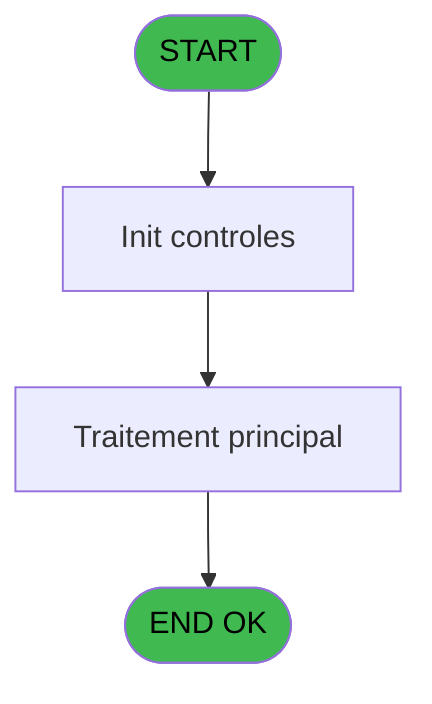
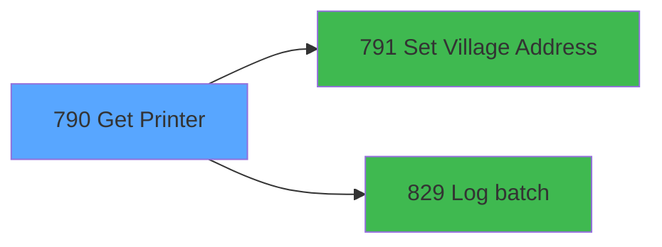

# REF IDE 790 - Get Printer

> **Analyse**: Phases 1-4 2026-02-03 14:23 -> 14:23 (15s) | Assemblage 14:23
> **Pipeline**: V7.2 Enrichi
> **Structure**: 4 onglets (Resume | Ecrans | Donnees | Connexions)

<!-- TAB:Resume -->

## 1. FICHE D'IDENTITE

| Attribut | Valeur |
|----------|--------|
| Projet | REF |
| IDE Position | 790 |
| Nom Programme | Get Printer |
| Fichier source | `Prg_790.xml` |
| Dossier IDE | Impression |
| Taches | 3 (0 ecrans visibles) |
| Tables modifiees | 0 |
| Programmes appeles | 2 |

## 2. DESCRIPTION FONCTIONNELLE

**Get Printer** assure la gestion complete de ce processus, accessible depuis [Consultation Gift Pass (IDE 678)](REF-IDE-678.md).

Le flux de traitement s'organise en **1 blocs fonctionnels** :

- **Impression** (3 taches) : generation de tickets et documents

**Logique metier** : 1 regles identifiees couvrant conditions metier.

## 3. BLOCS FONCTIONNELS

### 3.1 Impression (3 taches)

Generation des documents et tickets.

---

#### 790 - Get Printer

**Role** : Generation du document : Get Printer.

---

#### 790.1 - Get Printer

**Role** : Generation du document : Get Printer.

---

#### 790.2 - Get Printer

**Role** : Generation du document : Get Printer.

## 5. REGLES METIER

1 regles identifiees:

### Impression (1 regles)

#### [RM-001] Si VG29 alors StrBuild('Printer not found for host @1@ and listing @2@' sinon GetHostName(), Str(GetParam ('CURRENTLISTINGNUM'), 'N3')), StrBuild('Printer not found for terminal @1@ and listing @2@', Str(VG31, 'N10'), Str(GetParam ('CURRENTLISTINGNUM'), 'N3')))

| Element | Detail |
|---------|--------|
| **Condition** | `VG29` |
| **Si vrai** | StrBuild('Printer not found for host @1@ and listing @2@' |
| **Si faux** | GetHostName(), Str(GetParam ('CURRENTLISTINGNUM'), 'N3')), StrBuild('Printer not found for terminal @1@ and listing @2@', Str(VG31, 'N10'), Str(GetParam ('CURRENTLISTINGNUM'), 'N3'))) |
| **Expression source** | Expression 17 : `IF(VG29, StrBuild('Printer not found for host @1@ and listin` |
| **Exemple** | Si VG29 → StrBuild('Printer not found for host @1@ and listing @2@' |
| **Impact** | Bloc Impression |

## 6. CONTEXTE

- **Appele par**: [Consultation Gift Pass (IDE 678)](REF-IDE-678.md)
- **Appelle**: 2 programmes | **Tables**: 3 (W:0 R:2 L:1) | **Taches**: 3 | **Expressions**: 20

<!-- TAB:Ecrans -->

## 8. ECRANS

*(Programme sans ecran visible)*

## 9. NAVIGATION

### 9.3 Structure hierarchique (3 taches)

| Position | Tache | Type | Dimensions | Bloc |
|----------|-------|------|------------|------|
| **790.1** | [**Get Printer** (790)](#t1) | MDI | - | Impression |
| 790.1.1 | [Get Printer (790.1)](#t2) | MDI | - | |
| 790.1.2 | [Get Printer (790.2)](#t3) | MDI | - | |

### 9.4 Algorigramme

> **Legende**: Vert = START/END OK | Rouge = END KO | Bleu = Decisions
> *Algorigramme auto-genere. Utiliser `/algorigramme` pour une synthese metier detaillee.*

<!-- TAB:Donnees -->

## 10. TABLES

### Tables utilisees (3)

| ID | Nom | Description | Type | R | W | L | Usages |
|----|-----|-------------|------|---|---|---|--------|
| 363 | pms_listing |  | DB | R |   |   | 1 |
| 365 | pms_printer |  | DB |   |   | L | 1 |
| 366 | pms_print_param |  | DB | R |   |   | 2 |

### Colonnes par table (1 / 2 tables avec colonnes identifiees)

Table 363 - pms_listing (R) - 1 usages

| Lettre | Variable | Acces | Type |
|--------|----------|-------|------|
| A | P Service | R | Alpha |
| B | v.Imprimante | R | Numeric |
| C | v.Copies | R | Numeric |

Table 366 - pms_print_param (R) - 2 usages

*Table utilisee uniquement en Link ou aucune colonne Real identifiee dans le DataView.*

## 11. VARIABLES

### 11.1 Parametres entrants (1)

Variables recues du programme appelant ([Consultation Gift Pass (IDE 678)](REF-IDE-678.md)).

| Lettre | Nom | Type | Usage dans |
|--------|-----|------|-----------|
| A | P Service | Alpha | - |

### 11.2 Variables de session (2)

Variables persistantes pendant toute la session.

| Lettre | Nom | Type | Usage dans |
|--------|-----|------|-----------|
| B | v.Imprimante | Numeric | 5x session |
| C | v.Copies | Numeric | 3x session |

## 12. EXPRESSIONS

**20 / 20 expressions decodees (100%)**

### 12.1 Repartition par type

| Type | Expressions | Regles |
|------|-------------|--------|
| CONDITION | 6 | 5 |
| CONSTANTE | 3 | 0 |
| OTHER | 8 | 0 |
| NEGATION | 1 | 0 |
| REFERENCE_VG | 1 | 0 |
| FORMAT | 1 | 0 |

### 12.2 Expressions cles par type

#### CONDITION (6 expressions)

| Type | IDE | Expression | Regle |
|------|-----|------------|-------|
| CONDITION | 17 | `IF(VG29, StrBuild('Printer not found for host @1@ and listing @2@', GetHostName(), Str(GetParam ('CURRENTLISTINGNUM'), 'N3')), StrBuild('Printer not found for terminal @1@ and listing @2@', Str(VG31, 'N10'), Str(GetParam ('CURRENTLISTINGNUM'), 'N3')))` | [RM-001](#rm-RM-001) |
| CONDITION | 11 | `GetParam ('NUMBERCOPIES')=0` | - |
| CONDITION | 19 | `v.Imprimante [B]=0 OR v.Copies [C]=0` | - |
| CONDITION | 9 | `GetParam ('CURRENTPRINTERNAME')='VOID'` | - |
| CONDITION | 3 | `SetParam ('CURRENTLISTINGNAME',IF (GetParam ('CODELANGUE')='FRA',[E],IF ([F]='',[E],[F])))` | - |
| ... | | *+1 autres* | |

#### CONSTANTE (3 expressions)

| Type | IDE | Expression | Regle |
|------|-----|------------|-------|
| CONSTANTE | 18 | `'ERR'` | - |
| CONSTANTE | 16 | `'Printer not found'` | - |
| CONSTANTE | 15 | `'PRINTER'` | - |

#### OTHER (8 expressions)

| Type | IDE | Expression | Regle |
|------|-----|------------|-------|
| OTHER | 7 | `SetParam ('CURRENTPRINTERNAME',[H])` | - |
| OTHER | 6 | `SetParam ('CURRENTPRINTERNUM',v.Imprimante [B])` | - |
| OTHER | 12 | `SetParam ('NUMBERCOPIES',1)` | - |
| OTHER | 10 | `SetParam ('NUMBERCOPIES',v.Copies [C])` | - |
| OTHER | 2 | `v.Imprimante [B]` | - |
| ... | | *+3 autres* | |

#### NEGATION (1 expressions)

| Type | IDE | Expression | Regle |
|------|-----|------------|-------|
| NEGATION | 13 | `NOT VG29` | - |

#### REFERENCE_VG (1 expressions)

| Type | IDE | Expression | Regle |
|------|-----|------------|-------|
| REFERENCE_VG | 14 | `VG29` | - |

#### FORMAT (1 expressions)

| Type | IDE | Expression | Regle |
|------|-----|------------|-------|
| FORMAT | 20 | `StrBuild('Printer @1@, Copies @2@', Str(v.Imprimante [B], 'N3'), Str(v.Copies [C], 'N3'))` | - |

<!-- TAB:Connexions -->

## 13. GRAPHE D'APPELS

### 13.1 Chaine depuis Main (Callers)

Main -> ... -> [Consultation Gift Pass (IDE 678)](REF-IDE-678.md) -> **Get Printer (IDE 790)**

### 13.2 Callers

| IDE | Nom Programme | Nb Appels |
|-----|---------------|-----------|
| [678](REF-IDE-678.md) | Consultation Gift Pass | 1 |

### 13.3 Callees (programmes appeles)

### 13.4 Detail Callees avec contexte

| IDE | Nom Programme | Appels | Contexte |
|-----|---------------|--------|----------|
| [791](REF-IDE-791.md) | Set Village Address | 1 | Sous-programme |
| [829](REF-IDE-829.md) | Log batch | 1 | Sous-programme |

## 14. RECOMMANDATIONS MIGRATION

### 14.1 Profil du programme

| Metrique | Valeur | Impact migration |
|----------|--------|-----------------|
| Lignes de logique | 52 | Programme compact |
| Expressions | 20 | Peu de logique |
| Tables WRITE | 0 | Impact faible |
| Sous-programmes | 2 | Peu de dependances |
| Ecrans visibles | 0 | Ecran unique ou traitement batch |
| Code desactive | 0% (0 / 52) | Code sain |
| Regles metier | 1 | Quelques regles a preserver |

### 14.2 Plan de migration par bloc

#### Impression (3 taches: 0 ecran, 3 traitements)

- **Strategie** : Templates HTML -> PDF via wkhtmltopdf ou Puppeteer.
- `PrintService` injectable avec choix imprimante

### 14.3 Dependances critiques

| Dependance | Type | Appels | Impact |
|------------|------|--------|--------|
| [Log batch (IDE 829)](REF-IDE-829.md) | Sous-programme | 1x | Normale - Sous-programme |
| [Set Village Address (IDE 791)](REF-IDE-791.md) | Sous-programme | 1x | Normale - Sous-programme |

---
*Spec DETAILED generee par Pipeline V7.2 - 2026-02-03 14:23*
