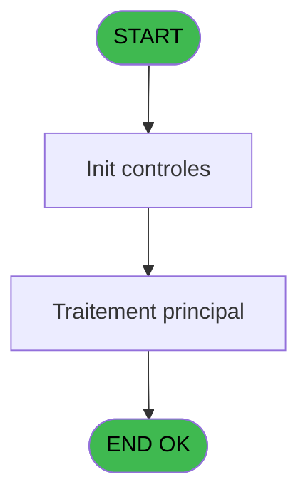

# REF IDE 791 - Set Village Address

> **Analyse**: Phases 1-4 2026-02-03 14:23 -> 14:23 (15s) | Assemblage 14:23
> **Pipeline**: V7.2 Enrichi
> **Structure**: 4 onglets (Resume | Ecrans | Donnees | Connexions)

<!-- TAB:Resume -->

## 1. FICHE D'IDENTITE

| Attribut | Valeur |
|----------|--------|
| Projet | REF |
| IDE Position | 791 |
| Nom Programme | Set Village Address |
| Fichier source | `Prg_791.xml` |
| Dossier IDE | General |
| Taches | 2 (0 ecrans visibles) |
| Tables modifiees | 0 |
| Programmes appeles | 0 |

## 2. DESCRIPTION FONCTIONNELLE

**Set Village Address** assure la gestion complete de ce processus, accessible depuis [Consultation Gift Pass (IDE 678)](REF-IDE-678.md), [Get Printer (IDE 790)](REF-IDE-790.md).

Le flux de traitement s'organise en **1 blocs fonctionnels** :

- **Traitement** (2 taches) : traitements metier divers

## 3. BLOCS FONCTIONNELS

### 3.1 Traitement (2 taches)

Traitements internes.

---

#### 791 - Set Village Address

**Role** : Traitement : Set Village Address.

---

#### 791.1 - Load Buffer

**Role** : Traitement : Load Buffer.
**Variables liees** : B (Buffer)

## 5. REGLES METIER

*(Aucune regle metier identifiee)*

## 6. CONTEXTE

- **Appele par**: [Consultation Gift Pass (IDE 678)](REF-IDE-678.md), [Get Printer (IDE 790)](REF-IDE-790.md)
- **Appelle**: 0 programmes | **Tables**: 3 (W:0 R:1 L:2) | **Taches**: 2 | **Expressions**: 21

<!-- TAB:Ecrans -->

## 8. ECRANS

*(Programme sans ecran visible)*

## 9. NAVIGATION

### 9.3 Structure hierarchique (2 taches)

| Position | Tache | Type | Dimensions | Bloc |
|----------|-------|------|------------|------|
| **791.1** | [**Set Village Address** (791)](#t1) | MDI | - | Traitement |
| 791.1.1 | [Load Buffer (791.1)](#t2) | MDI | - | |

### 9.4 Algorigramme

> **Legende**: Vert = START/END OK | Rouge = END KO | Bleu = Decisions
> *Algorigramme auto-genere. Utiliser `/algorigramme` pour une synthese metier detaillee.*

<!-- TAB:Donnees -->

## 10. TABLES

### Tables utilisees (3)

| ID | Nom | Description | Type | R | W | L | Usages |
|----|-----|-------------|------|---|---|---|--------|
| 69 | initialisation___ini |  | DB | R |   |   | 1 |
| 368 | pms_village |  | DB |   |   | L | 1 |
| 856 | adresse_service_village | Services / filieres | DB |   |   | L | 1 |

### Colonnes par table (2 / 1 tables avec colonnes identifiees)

Table 69 - initialisation___ini (R) - 1 usages

| Lettre | Variable | Acces | Type |
|--------|----------|-------|------|
| A | P.Service | R | Alpha |
| B | Buffer | R | Alpha |
| C | CounterTel | R | Numeric |
| D | CounterFax | R | Numeric |

## 11. VARIABLES

### 11.1 Parametres entrants (1)

Variables recues du programme appelant ([Consultation Gift Pass (IDE 678)](REF-IDE-678.md)).

| Lettre | Nom | Type | Usage dans |
|--------|-----|------|-----------|
| A | P.Service | Alpha | - |

### 11.2 Autres (3)

Variables diverses.

| Lettre | Nom | Type | Usage dans |
|--------|-----|------|-----------|
| B | Buffer | Alpha | - |
| C | CounterTel | Numeric | - |
| D | CounterFax | Numeric | - |

## 12. EXPRESSIONS

**21 / 21 expressions decodees (100%)**

### 12.1 Repartition par type

| Type | Expressions | Regles |
|------|-------------|--------|
| OTHER | 11 | 0 |
| STRING | 10 | 0 |

### 12.2 Expressions cles par type

#### OTHER (11 expressions)

| Type | IDE | Expression | Regle |
|------|-----|------------|-------|
| OTHER | 15 | `SetParam ('VI_MAIL',MID ([AF],904,128))` | - |
| OTHER | 13 | `SetParam ('VI_FAXN',MID ([AF],775,128))` | - |
| OTHER | 17 | `SetParam ('VI_SIRE',MID ([AF],1033,128))` | - |
| OTHER | 21 | `GetParam('SERVICE')` | - |
| OTHER | 19 | `SetParam ('VI_VATN',MID ([AF],1162,128))` | - |
| ... | | *+6 autres* | |

#### STRING (10 expressions)

| Type | IDE | Expression | Regle |
|------|-----|------------|-------|
| STRING | 14 | `SetParam ('VI_FAXN','Fax : ' &Trim([Y]))` | - |
| STRING | 12 | `SetParam ('VI_PHON','Tel : '&Trim([X]))` | - |
| STRING | 16 | `SetParam ('VI_MAIL',Trim([AB]))` | - |
| STRING | 20 | `SetParam ('VI_VATN',Trim([AA]))` | - |
| STRING | 18 | `SetParam ('VI_SIRE',Trim([Z]))` | - |
| ... | | *+5 autres* | |

### 12.3 Toutes les expressions (21)

Voir les 21 expressions

#### OTHER (11)

| IDE | Expression Decodee |
|-----|-------------------|
| 1 | `SetParam ('VI_CLUB',MID ([AF],1,128))` |
| 3 | `SetParam ('VI_NAME',MID ([AF],130,128))` |
| 5 | `SetParam ('VI_ADR1',MID ([AF],259,128))` |
| 7 | `SetParam ('VI_ADR2',MID ([AF],388,128))` |
| 9 | `SetParam ('VI_ZIPC',MID ([AF],517,128))` |
| 11 | `SetParam ('VI_PHON',MID ([AF],646,128))` |
| 13 | `SetParam ('VI_FAXN',MID ([AF],775,128))` |
| 15 | `SetParam ('VI_MAIL',MID ([AF],904,128))` |
| 17 | `SetParam ('VI_SIRE',MID ([AF],1033,128))` |
| 19 | `SetParam ('VI_VATN',MID ([AF],1162,128))` |
| 21 | `GetParam('SERVICE')` |

#### STRING (10)

| IDE | Expression Decodee |
|-----|-------------------|
| 2 | `SetParam ('VI_CLUB',Trim([R]))` |
| 4 | `SetParam ('VI_NAME',Trim([S]))` |
| 6 | `SetParam ('VI_ADR1',Trim([T]))` |
| 8 | `SetParam ('VI_ADR2',Trim([U]))` |
| 10 | `SetParam ('VI_ZIPC',Trim([W]))` |
| 12 | `SetParam ('VI_PHON','Tel : '&Trim([X]))` |
| 14 | `SetParam ('VI_FAXN','Fax : ' &Trim([Y]))` |
| 16 | `SetParam ('VI_MAIL',Trim([AB]))` |
| 18 | `SetParam ('VI_SIRE',Trim([Z]))` |
| 20 | `SetParam ('VI_VATN',Trim([AA]))` |

<!-- TAB:Connexions -->

## 13. GRAPHE D'APPELS

### 13.1 Chaine depuis Main (Callers)

Main -> ... -> [Consultation Gift Pass (IDE 678)](REF-IDE-678.md) -> **Set Village Address (IDE 791)**

Main -> ... -> [Get Printer (IDE 790)](REF-IDE-790.md) -> **Set Village Address (IDE 791)**

### 13.2 Callers

| IDE | Nom Programme | Nb Appels |
|-----|---------------|-----------|
| [678](REF-IDE-678.md) | Consultation Gift Pass | 1 |
| [790](REF-IDE-790.md) | Get Printer | 1 |

### 13.3 Callees (programmes appeles)

### 13.4 Detail Callees avec contexte

| IDE | Nom Programme | Appels | Contexte |
|-----|---------------|--------|----------|
| - | (aucun) | - | - |

## 14. RECOMMANDATIONS MIGRATION

### 14.1 Profil du programme

| Metrique | Valeur | Impact migration |
|----------|--------|-----------------|
| Lignes de logique | 77 | Programme compact |
| Expressions | 21 | Peu de logique |
| Tables WRITE | 0 | Impact faible |
| Sous-programmes | 0 | Peu de dependances |
| Ecrans visibles | 0 | Ecran unique ou traitement batch |
| Code desactive | 13% (10 / 77) | A verifier |
| Regles metier | 0 | Pas de regle identifiee |

### 14.2 Plan de migration par bloc

#### Traitement (2 taches: 0 ecran, 2 traitements)

- **Strategie** : 2 service(s) backend injectable(s) (Domain Services).
- Decomposer les taches en services unitaires testables.

### 14.3 Dependances critiques

| Dependance | Type | Appels | Impact |
|------------|------|--------|--------|

---
*Spec DETAILED generee par Pipeline V7.2 - 2026-02-03 14:23*
