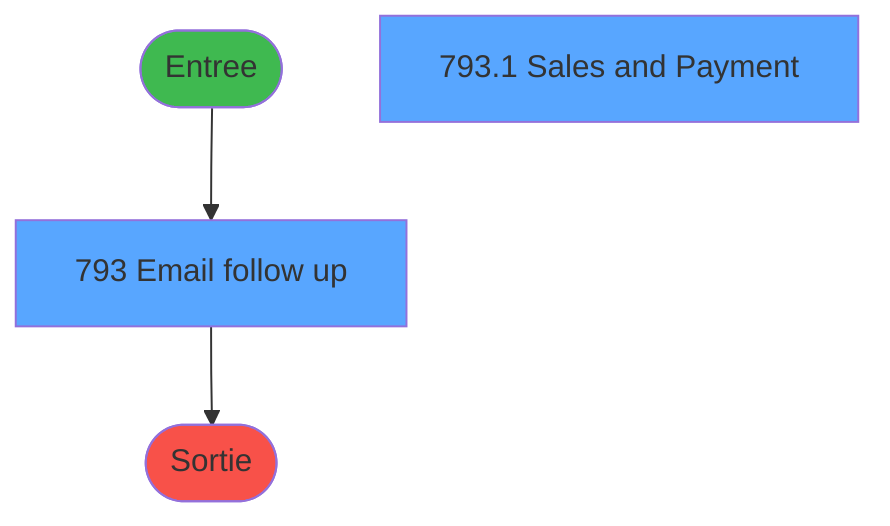
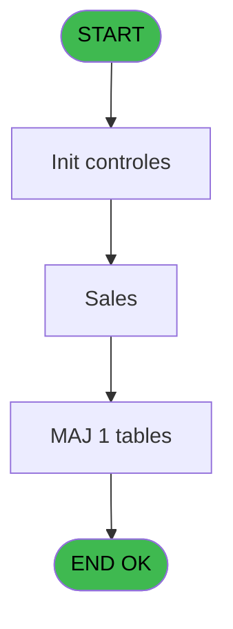

# REF IDE 793 - Suivi des Envois de Mails

> **Analyse**: Phases 1-4 2026-02-03 14:24 -> 14:24 (15s) | Assemblage 14:24
> **Pipeline**: V7.2 Enrichi
> **Structure**: 4 onglets (Resume | Ecrans | Donnees | Connexions)

<!-- TAB:Resume -->

## 1. FICHE D'IDENTITE

| Attribut | Valeur |
|----------|--------|
| Projet | REF |
| IDE Position | 793 |
| Nom Programme | Suivi des Envois de Mails |
| Fichier source | `Prg_793.xml` |
| Dossier IDE | General |
| Taches | 2 (2 ecrans visibles) |
| Tables modifiees | 1 |
| Programmes appeles | 0 |
| :warning: Statut | **ORPHELIN_POTENTIEL** |

## 2. DESCRIPTION FONCTIONNELLE

**Suivi des Envois de Mails** assure la gestion complete de ce processus.

Le flux de traitement s'organise en **1 blocs fonctionnels** :

- **Traitement** (2 taches) : traitements metier divers

**Donnees modifiees** : 1 tables en ecriture (file_traitement_mail).

## 3. BLOCS FONCTIONNELS

### 3.1 Traitement (2 taches)

Traitements internes.

---

#### 793 - Email follow up [[ECRAN]](#ecran-t1)

**Role** : Traitement : Email follow up.
**Ecran** : 1990 x 392 DLU (Type6) | [Voir mockup](#ecran-t1)

---

#### 793.1 - Sales and Payment [[ECRAN]](#ecran-t2)

**Role** : Traitement : Sales and Payment.
**Ecran** : 986 x 280 DLU (Modal) | [Voir mockup](#ecran-t2)

## 5. REGLES METIER

*(Aucune regle metier identifiee)*

## 6. CONTEXTE

- **Appele par**: (aucun)
- **Appelle**: 0 programmes | **Tables**: 1 (W:1 R:0 L:0) | **Taches**: 2 | **Expressions**: 4

<!-- TAB:Ecrans -->

## 8. ECRANS

### 8.1 Forms visibles (2 / 2)

| # | Position | Tache | Nom | Type | Largeur | Hauteur | Bloc |
|---|----------|-------|-----|------|---------|---------|------|
| 1 | 793 | 793 | Email follow up | Type6 | 1990 | 392 | Traitement |
| 2 | 793.1 | 793.1 | Sales and Payment | Modal | 986 | 280 | Traitement |

### 8.2 Mockups Ecrans

---

#### 793 - Email follow up
**Tache** : [793](#t1) | **Type** : Type6 | **Dimensions** : 1990 x 392 DLU
**Bloc** : Traitement | **Titre IDE** : Email follow up

<!-- FORM-DATA:
{
    "width":  1990,
    "vFactor":  8,
    "type":  "Type6",
    "hFactor":  8,
    "controls":  [
                     {
                         "x":  208,
                         "type":  "label",
                         "var":  "",
                         "y":  16,
                         "w":  116,
                         "fmt":  "",
                         "name":  "",
                         "h":  12,
                         "color":  "181",
                         "text":  "Start date",
                         "parent":  null
                     },
                     {
                         "x":  658,
                         "type":  "label",
                         "var":  "",
                         "y":  16,
                         "w":  89,
                         "fmt":  "",
                         "name":  "",
                         "h":  12,
                         "color":  "181",
                         "text":  "End date",
                         "parent":  null
                     },
                     {
                         "x":  208,
                         "type":  "label",
                         "var":  "",
                         "y":  36,
                         "w":  125,
                         "fmt":  "",
                         "name":  "",
                         "h":  12,
                         "color":  "181",
                         "text":  "Email Type",
                         "parent":  null
                     },
                     {
                         "x":  208,
                         "type":  "label",
                         "var":  "",
                         "y":  55,
                         "w":  94,
                         "fmt":  "",
                         "name":  "",
                         "h":  12,
                         "color":  "181",
                         "text":  "Status",
                         "parent":  null
                     },
                     {
                         "x":  208,
                         "type":  "label",
                         "var":  "",
                         "y":  73,
                         "w":  138,
                         "fmt":  "",
                         "name":  "",
                         "h":  12,
                         "color":  "181",
                         "text":  "Email address",
                         "parent":  null
                     },
                     {
                         "x":  208,
                         "type":  "label",
                         "var":  "",
                         "y":  91,
                         "w":  147,
                         "fmt":  "",
                         "name":  "",
                         "h":  12,
                         "color":  "181",
                         "text":  "Copy status",
                         "parent":  null
                     },
                     {
                         "x":  361,
                         "type":  "edit",
                         "var":  "",
                         "y":  16,
                         "w":  122,
                         "fmt":  "",
                         "name":  "v.Date_Debut",
                         "h":  12,
                         "color":  "",
                         "text":  "",
                         "parent":  null
                     },
                     {
                         "x":  773,
                         "type":  "edit",
                         "var":  "",
                         "y":  16,
                         "w":  122,
                         "fmt":  "",
                         "name":  "v.Date_Fin",
                         "h":  12,
                         "color":  "",
                         "text":  "",
                         "parent":  null
                     },
                     {
                         "x":  361,
                         "type":  "combobox",
                         "var":  "",
                         "y":  36,
                         "w":  534,
                         "fmt":  "",
                         "name":  "v.Type_Envoi_0001",
                         "h":  12,
                         "color":  "",
                         "text":  "ALL",
                         "parent":  null
                     },
                     {
                         "x":  361,
                         "type":  "combobox",
                         "var":  "",
                         "y":  55,
                         "w":  534,
                         "fmt":  "",
                         "name":  "v.Statut_0001",
                         "h":  12,
                         "color":  "",
                         "text":  "ALL, Sent, Not Sent",
                         "parent":  null
                     },
                     {
                         "x":  1717,
                         "type":  "button",
                         "var":  "",
                         "y":  71,
                         "w":  256,
                         "fmt":  "Search",
                         "name":  "RECHERCHER",
                         "h":  29,
                         "color":  "",
                         "text":  "",
                         "parent":  null
                     },
                     {
                         "x":  361,
                         "type":  "edit",
                         "var":  "",
                         "y":  73,
                         "w":  1126,
                         "fmt":  "",
                         "name":  "v.Mail",
                         "h":  12,
                         "color":  "",
                         "text":  "",
                         "parent":  null
                     },
                     {
                         "x":  361,
                         "type":  "combobox",
                         "var":  "",
                         "y":  91,
                         "w":  534,
                         "fmt":  "",
                         "name":  "v.Statut cc_0001",
                         "h":  12,
                         "color":  "",
                         "text":  "ALL, Sent, Not Sent",
                         "parent":  null
                     },
                     {
                         "x":  2,
                         "type":  "subform",
                         "var":  "",
                         "y":  108,
                         "w":  1980,
                         "fmt":  "",
                         "name":  "SB_List_Envoi",
                         "h":  283,
                         "color":  "",
                         "text":  "",
                         "parent":  null
                     }
                 ],
    "taskId":  "793",
    "height":  392
}
-->

<strong>Champs : 6 champs</strong>

| Pos (x,y) | Nom | Variable | Type |
|-----------|-----|----------|------|
| 361,16 | v.Date_Debut | - | edit |
| 773,16 | v.Date_Fin | - | edit |
| 361,36 | v.Type_Envoi_0001 | - | combobox |
| 361,55 | v.Statut_0001 | - | combobox |
| 361,73 | v.Mail | - | edit |
| 361,91 | v.Statut cc_0001 | - | combobox |

<strong>Boutons : 1 boutons</strong>

| Bouton | Pos (x,y) | Action |
|--------|-----------|--------|
| Search | 1717,71 | Ouvre la selection |

---

#### 793.1 - Sales and Payment
**Tache** : [793.1](#t2) | **Type** : Modal | **Dimensions** : 986 x 280 DLU
**Bloc** : Traitement | **Titre IDE** : Sales and Payment

<!-- FORM-DATA:
{
    "width":  986,
    "vFactor":  8,
    "type":  "Modal",
    "hFactor":  4,
    "controls":  [
                     {
                         "x":  3,
                         "type":  "table",
                         "var":  "",
                         "name":  "",
                         "titleH":  15,
                         "color":  "6",
                         "w":  935,
                         "y":  0,
                         "fmt":  "",
                         "parent":  null,
                         "text":  "",
                         "rowH":  22,
                         "h":  245,
                         "cols":  [
                                      {
                                          "title":  "Email Type",
                                          "layer":  1,
                                          "w":  80
                                      },
                                      {
                                          "title":  "Creation date",
                                          "layer":  2,
                                          "w":  80
                                      },
                                      {
                                          "title":  "Sending date",
                                          "layer":  3,
                                          "w":  80
                                      },
                                      {
                                          "title":  "Sent",
                                          "layer":  4,
                                          "w":  60
                                      },
                                      {
                                          "title":  "Nb of tries",
                                          "layer":  5,
                                          "w":  53
                                      },
                                      {
                                          "title":  "Language",
                                          "layer":  6,
                                          "w":  50
                                      },
                                      {
                                          "title":  "E-mail adress",
                                          "layer":  7,
                                          "w":  456
                                      },
                                      {
                                          "title":  "Copy status",
                                          "layer":  8,
                                          "w":  72
                                      }
                                  ],
                         "rows":  8
                     },
                     {
                         "x":  7,
                         "type":  "edit",
                         "var":  "",
                         "y":  17,
                         "w":  59,
                         "fmt":  "",
                         "name":  "ftm_code_traitement",
                         "h":  10,
                         "color":  "6",
                         "text":  "",
                         "parent":  1
                     },
                     {
                         "x":  87,
                         "type":  "edit",
                         "var":  "",
                         "y":  17,
                         "w":  67,
                         "fmt":  "DD/MM/YYYYZ",
                         "name":  "ftm_date_creation",
                         "h":  10,
                         "color":  "6",
                         "text":  "",
                         "parent":  1
                     },
                     {
                         "x":  87,
                         "type":  "edit",
                         "var":  "",
                         "y":  27,
                         "w":  55,
                         "fmt":  "HH:MM:SSZ",
                         "name":  "ftm_heure_creation",
                         "h":  10,
                         "color":  "6",
                         "text":  "",
                         "parent":  1
                     },
                     {
                         "x":  169,
                         "type":  "edit",
                         "var":  "",
                         "y":  17,
                         "w":  66,
                         "fmt":  "DD/MM/YYYYZ",
                         "name":  "ftm_date_envoi",
                         "h":  10,
                         "color":  "6",
                         "text":  "",
                         "parent":  1
                     },
                     {
                         "x":  169,
                         "type":  "edit",
                         "var":  "",
                         "y":  27,
                         "w":  54,
                         "fmt":  "HH:MM:SSZ",
                         "name":  "ftm_heure_envoi",
                         "h":  10,
                         "color":  "6",
                         "text":  "",
                         "parent":  1
                     },
                     {
                         "x":  259,
                         "type":  "edit",
                         "var":  "",
                         "y":  17,
                         "w":  31,
                         "fmt":  "3",
                         "name":  "ftm_statut_traitement",
                         "h":  10,
                         "color":  "6",
                         "text":  "",
                         "parent":  1
                     },
                     {
                         "x":  319,
                         "type":  "edit",
                         "var":  "",
                         "y":  18,
                         "w":  13,
                         "fmt":  "2Z",
                         "name":  "ftm_nb_essai",
                         "h":  10,
                         "color":  "6",
                         "text":  "",
                         "parent":  1
                     },
                     {
                         "x":  368,
                         "type":  "edit",
                         "var":  "",
                         "y":  18,
                         "w":  20,
                         "fmt":  "",
                         "name":  "ftm_langue",
                         "h":  10,
                         "color":  "6",
                         "text":  "",
                         "parent":  1
                     },
                     {
                         "x":  411,
                         "type":  "edit",
                         "var":  "",
                         "y":  18,
                         "w":  452,
                         "fmt":  "",
                         "name":  "ftm_adresse_mail_cc",
                         "h":  10,
                         "color":  "6",
                         "text":  "",
                         "parent":  1
                     },
                     {
                         "x":  885,
                         "type":  "edit",
                         "var":  "",
                         "y":  18,
                         "w":  31,
                         "fmt":  "3",
                         "name":  "ftm_statut_cc",
                         "h":  10,
                         "color":  "6",
                         "text":  "",
                         "parent":  1
                     },
                     {
                         "x":  939,
                         "type":  "button",
                         "var":  "",
                         "y":  0,
                         "w":  47,
                         "fmt":  "ñ",
                         "name":  "UP",
                         "h":  128,
                         "color":  "",
                         "text":  "",
                         "parent":  null
                     },
                     {
                         "x":  939,
                         "type":  "button",
                         "var":  "",
                         "y":  130,
                         "w":  47,
                         "fmt":  "ò",
                         "name":  "DOWN",
                         "h":  115,
                         "color":  "",
                         "text":  "",
                         "parent":  null
                     },
                     {
                         "x":  3,
                         "type":  "button",
                         "var":  "",
                         "y":  248,
                         "w":  494,
                         "fmt":  "",
                         "name":  "ACTION_MAIL",
                         "h":  29,
                         "color":  "",
                         "text":  "",
                         "parent":  null
                     },
                     {
                         "x":  498,
                         "type":  "button",
                         "var":  "",
                         "y":  248,
                         "w":  488,
                         "fmt":  "search",
                         "name":  "PDF_FILE",
                         "h":  29,
                         "color":  "",
                         "text":  "",
                         "parent":  null
                     }
                 ],
    "taskId":  "793.1",
    "height":  280
}
-->

<strong>Champs : 10 champs</strong>

| Pos (x,y) | Nom | Variable | Type |
|-----------|-----|----------|------|
| 7,17 | ftm_code_traitement | - | edit |
| 87,17 | ftm_date_creation | - | edit |
| 87,27 | ftm_heure_creation | - | edit |
| 169,17 | ftm_date_envoi | - | edit |
| 169,27 | ftm_heure_envoi | - | edit |
| 259,17 | ftm_statut_traitement | - | edit |
| 319,18 | ftm_nb_essai | - | edit |
| 368,18 | ftm_langue | - | edit |
| 411,18 | ftm_adresse_mail_cc | - | edit |
| 885,18 | ftm_statut_cc | - | edit |

<strong>Boutons : 4 boutons</strong>

| Bouton | Pos (x,y) | Action |
|--------|-----------|--------|
| ñ | 939,0 | Bouton fonctionnel |
| ò | 939,130 | Bouton fonctionnel |
| ACTION_MAIL | 3,248 | Bouton fonctionnel |
| search | 498,248 | Ouvre la selection |

## 9. NAVIGATION

### 9.1 Enchainement des ecrans

**Detail par enchainement :**

| Depuis | Action | Vers | Retour |
|--------|--------|------|--------|

### 9.3 Structure hierarchique (2 taches)

| Position | Tache | Type | Dimensions | Bloc |
|----------|-------|------|------------|------|
| **793.1** | [**Email follow up** (793)](#t1) [mockup](#ecran-t1) | Type6 | 1990x392 | Traitement |
| 793.1.1 | [Sales and Payment (793.1)](#t2) [mockup](#ecran-t2) | Modal | 986x280 | |

### 9.4 Algorigramme

> **Legende**: Vert = START/END OK | Rouge = END KO | Bleu = Decisions
> *Algorigramme auto-genere. Utiliser `/algorigramme` pour une synthese metier detaillee.*

<!-- TAB:Donnees -->

## 10. TABLES

### Tables utilisees (1)

| ID | Nom | Description | Type | R | W | L | Usages |
|----|-----|-------------|------|---|---|---|--------|
| 863 | file_traitement_mail | Services / filieres | DB |   | **W** |   | 1 |

### Colonnes par table (1 / 1 tables avec colonnes identifiees)

Table 863 - file_traitement_mail (**W**) - 1 usages

| Lettre | Variable | Acces | Type |
|--------|----------|-------|------|
| A | p.DateDebut | W | Date |
| B | p.DateFin | W | Date |
| C | p.Type | W | Unicode |
| D | p.Statut | W | Unicode |
| E | p.AdresseMail | W | Alpha |
| F | p.Statut_cc | W | Unicode |
| G | v.RetourMessage | W | Numeric |

## 11. VARIABLES

### 11.1 Variables de session (7)

Variables persistantes pendant toute la session.

| Lettre | Nom | Type | Usage dans |
|--------|-----|------|-----------|
| A | v.Date_Debut | Date | 1x session |
| B | v.Date_Fin | Date | 1x session |
| C | v.Type_Envoi | Unicode | - |
| D | v.Statut | Unicode | - |
| E | v.Mail | Alpha | - |
| F | v.Chemin | Alpha | - |
| G | v.Statut cc | Unicode | - |

## 12. EXPRESSIONS

**4 / 4 expressions decodees (100%)**

### 12.1 Repartition par type

| Type | Expressions | Regles |
|------|-------------|--------|
| CONSTANTE | 1 | 0 |
| DATE | 1 | 0 |
| CONDITION | 1 | 0 |
| OTHER | 1 | 0 |

### 12.2 Expressions cles par type

#### CONSTANTE (1 expressions)

| Type | IDE | Expression | Regle |
|------|-----|------------|-------|
| CONSTANTE | 1 | `'ALL'` | - |

#### DATE (1 expressions)

| Type | IDE | Expression | Regle |
|------|-----|------------|-------|
| DATE | 4 | `Date()` | - |

#### CONDITION (1 expressions)

| Type | IDE | Expression | Regle |
|------|-----|------------|-------|
| CONDITION | 2 | `v.Date_Debut [A]>v.Date_Fin [B]` | - |

#### OTHER (1 expressions)

| Type | IDE | Expression | Regle |
|------|-----|------------|-------|
| OTHER | 3 | `CtrlGoto ('SB_List_Envoi',0,0)` | - |

<!-- TAB:Connexions -->

## 13. GRAPHE D'APPELS

### 13.1 Chaine depuis Main (Callers)

**Chemin**: (pas de callers directs)

### 13.2 Callers

| IDE | Nom Programme | Nb Appels |
|-----|---------------|-----------|
| - | (aucun) | - |

### 13.3 Callees (programmes appeles)

### 13.4 Detail Callees avec contexte

| IDE | Nom Programme | Appels | Contexte |
|-----|---------------|--------|----------|
| - | (aucun) | - | - |

## 14. RECOMMANDATIONS MIGRATION

### 14.1 Profil du programme

| Metrique | Valeur | Impact migration |
|----------|--------|-----------------|
| Lignes de logique | 42 | Programme compact |
| Expressions | 4 | Peu de logique |
| Tables WRITE | 1 | Impact faible |
| Sous-programmes | 0 | Peu de dependances |
| Ecrans visibles | 2 | Quelques ecrans |
| Code desactive | 0% (0 / 42) | Code sain |
| Regles metier | 0 | Pas de regle identifiee |

### 14.2 Plan de migration par bloc

#### Traitement (2 taches: 2 ecrans, 0 traitement)

- **Strategie** : 2 composant(s) UI (Razor/React) avec formulaires et validation.
- Decomposer les taches en services unitaires testables.

### 14.3 Dependances critiques

| Dependance | Type | Appels | Impact |
|------------|------|--------|--------|
| file_traitement_mail | Table WRITE (Database) | 1x | Schema + repository |

---
*Spec DETAILED generee par Pipeline V7.2 - 2026-02-03 14:24*
