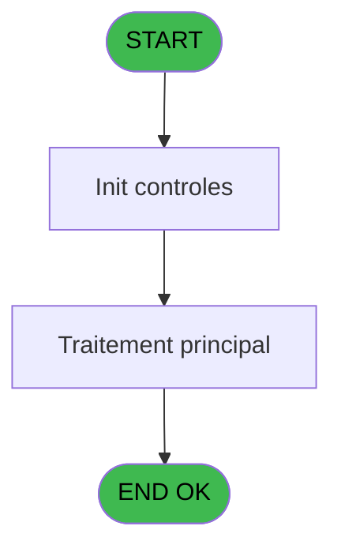
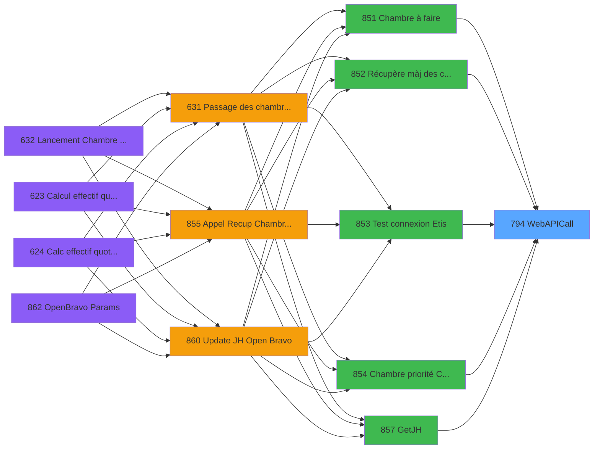

# REF IDE 794 - WebAPICall

> **Analyse**: Phases 1-4 2026-02-03 14:24 -> 14:24 (15s) | Assemblage 14:24
> **Pipeline**: V7.2 Enrichi
> **Structure**: 4 onglets (Resume | Ecrans | Donnees | Connexions)

<!-- TAB:Resume -->

## 1. FICHE D'IDENTITE

| Attribut | Valeur |
|----------|--------|
| Projet | REF |
| IDE Position | 794 |
| Nom Programme | WebAPICall |
| Fichier source | `Prg_794.xml` |
| Dossier IDE | General |
| Taches | 1 (0 ecrans visibles) |
| Tables modifiees | 0 |
| Programmes appeles | 0 |

## 2. DESCRIPTION FONCTIONNELLE

**WebAPICall** assure la gestion complete de ce processus, accessible depuis [Chambre à faire (IDE 851)](REF-IDE-851.md), [Chambre priorité CLIENT (IDE 854)](REF-IDE-854.md), [Récupère màj des chambres (IDE 852)](REF-IDE-852.md), [Test connexion Etis (IDE 853)](REF-IDE-853.md), [GetJH (IDE 857)](REF-IDE-857.md), [PutJH (IDE 859)](REF-IDE-859.md), [Login OpenBravo (IDE 863)](REF-IDE-863.md), [Get CashUp (IDE 864)](REF-IDE-864.md).

Le flux de traitement s'organise en **1 blocs fonctionnels** :

- **Traitement** (1 tache) : traitements metier divers

## 3. BLOCS FONCTIONNELS

### 3.1 Traitement (1 tache)

Traitements internes.

---

#### 794 - WebAPICall

**Role** : Traitement : WebAPICall.

## 5. REGLES METIER

*(Aucune regle metier identifiee)*

## 6. CONTEXTE

- **Appele par**: [Chambre à faire (IDE 851)](REF-IDE-851.md), [Chambre priorité CLIENT (IDE 854)](REF-IDE-854.md), [Récupère màj des chambres (IDE 852)](REF-IDE-852.md), [Test connexion Etis (IDE 853)](REF-IDE-853.md), [GetJH (IDE 857)](REF-IDE-857.md), [PutJH (IDE 859)](REF-IDE-859.md), [Login OpenBravo (IDE 863)](REF-IDE-863.md), [Get CashUp (IDE 864)](REF-IDE-864.md)
- **Appelle**: 0 programmes | **Tables**: 0 (W:0 R:0 L:0) | **Taches**: 1 | **Expressions**: 13

<!-- TAB:Ecrans -->

## 8. ECRANS

*(Programme sans ecran visible)*

## 9. NAVIGATION

### 9.3 Structure hierarchique (1 tache)

| Position | Tache | Type | Dimensions | Bloc |
|----------|-------|------|------------|------|
| **794.1** | [**WebAPICall** (794)](#t1) | - | - | Traitement |

### 9.4 Algorigramme

> **Legende**: Vert = START/END OK | Rouge = END KO | Bleu = Decisions
> *Algorigramme auto-genere. Utiliser `/algorigramme` pour une synthese metier detaillee.*

<!-- TAB:Donnees -->

## 10. TABLES

### Tables utilisees (0)

| ID | Nom | Description | Type | R | W | L | Usages |
|----|-----|-------------|------|---|---|---|--------|

### Colonnes par table (0 / 0 tables avec colonnes identifiees)

## 11. VARIABLES

### 11.1 Parametres entrants (13)

Variables recues du programme appelant ([Chambre à faire (IDE 851)](REF-IDE-851.md)).

| Lettre | Nom | Type | Usage dans |
|--------|-----|------|-----------|
| A | p.i.UrlApi | Alpha | 2x parametre entrant |
| B | p.i.RequestType | Alpha | 2x parametre entrant |
| C | p.i.JsonIN | Blob | 2x parametre entrant |
| D | p.i.ProxyAddress | Alpha | - |
| E | p.o.IsSuccess | Logical | 1x parametre entrant |
| F | p.o.ErrorMessage | Alpha | - |
| G | p.o.JsonResponse | Blob | - |
| H | p.i..UserName | Unicode | - |
| I | p.i.Password | Unicode | - |
| J | p.i.Api Key | Unicode | - |
| K | p.i.BasicAuth user | Unicode | 2x parametre entrant |
| L | p.i.BasicAuth pwd | Unicode | 1x parametre entrant |
| M | p.i.Ocp-Apim-Subscription-Key | Unicode | - |

### 11.2 Variables de session (6)

Variables persistantes pendant toute la session.

| Lettre | Nom | Type | Usage dans |
|--------|-----|------|-----------|
| N | v.Login:Password base64 | Unicode | 1x session |
| O | v.Authentification | Unicode | 2x session |
| P | v.Http header | Unicode | 3x session |
| Q | v.Http version | Unicode | - |
| R | v.Http status code | Unicode | 2x session |
| S | v.Http reason phrase | Unicode | 1x session |

Toutes les 19 variables (liste complete)

| Cat | Lettre | Nom Variable | Type |
|-----|--------|--------------|------|
| P0 | **A** | p.i.UrlApi | Alpha |
| P0 | **B** | p.i.RequestType | Alpha |
| P0 | **C** | p.i.JsonIN | Blob |
| P0 | **D** | p.i.ProxyAddress | Alpha |
| P0 | **E** | p.o.IsSuccess | Logical |
| P0 | **F** | p.o.ErrorMessage | Alpha |
| P0 | **G** | p.o.JsonResponse | Blob |
| P0 | **H** | p.i..UserName | Unicode |
| P0 | **I** | p.i.Password | Unicode |
| P0 | **J** | p.i.Api Key | Unicode |
| P0 | **K** | p.i.BasicAuth user | Unicode |
| P0 | **L** | p.i.BasicAuth pwd | Unicode |
| P0 | **M** | p.i.Ocp-Apim-Subscription-Key | Unicode |
| V. | **N** | v.Login:Password base64 | Unicode |
| V. | **O** | v.Authentification | Unicode |
| V. | **P** | v.Http header | Unicode |
| V. | **Q** | v.Http version | Unicode |
| V. | **R** | v.Http status code | Unicode |
| V. | **S** | v.Http reason phrase | Unicode |

## 12. EXPRESSIONS

**13 / 13 expressions decodees (100%)**

### 12.1 Repartition par type

| Type | Expressions | Regles |
|------|-------------|--------|
| CONDITION | 3 | 0 |
| OTHER | 6 | 0 |
| NEGATION | 1 | 0 |
| CONCATENATION | 1 | 0 |
| STRING | 1 | 0 |
| FORMAT | 1 | 0 |

### 12.2 Expressions cles par type

#### CONDITION (3 expressions)

| Type | IDE | Expression | Regle |
|------|-----|------------|-------|
| CONDITION | 2 | `ISNULL(p.i.JsonIN [C]) OR p.i.JsonIN [C]=''` | - |
| CONDITION | 1 | `p.i.BasicAuth user [K]=''` | - |
| CONDITION | 6 | `HTTPCall(p.i.RequestType [B], Trim(p.i.UrlApi [A]), p.i.JsonIN [C], Trim(v.Authentification [O]), 'Content-Type: application/json; charset=utf-8')` | - |

#### OTHER (6 expressions)

| Type | IDE | Expression | Regle |
|------|-----|------------|-------|
| OTHER | 10 | `StrToken (v.Http header [P], 3, '\|')` | - |
| OTHER | 11 | `Range(v.Http status code [R], '200', '209')` | - |
| OTHER | 12 | `StrBuild('@1@ : @2@', v.Http status code [R], v.Http reason phrase [S])` | - |
| OTHER | 4 | `'Authorization: Basic ' & v.Login:Password base64 [N]` | - |
| OTHER | 8 | `StrToken (v.Http header [P], 1, '\|')` | - |
| ... | | *+1 autres* | |

#### NEGATION (1 expressions)

| Type | IDE | Expression | Regle |
|------|-----|------------|-------|
| NEGATION | 13 | `NOT p.o.IsSuccess [E]` | - |

#### CONCATENATION (1 expressions)

| Type | IDE | Expression | Regle |
|------|-----|------------|-------|
| CONCATENATION | 3 | `Trim(p.i.BasicAuth user [K]) &':'& Trim(p.i.BasicAuth pwd [L])` | - |

#### STRING (1 expressions)

| Type | IDE | Expression | Regle |
|------|-----|------------|-------|
| STRING | 5 | `HTTPCall(p.i.RequestType [B], Trim(p.i.UrlApi [A]), '', Trim(v.Authentification [O]))` | - |

#### FORMAT (1 expressions)

| Type | IDE | Expression | Regle |
|------|-----|------------|-------|
| FORMAT | 7 | `RepStr(RepStr(RTrim(HTTPLastHeader ('')), ' ', '\|'), ASCIIChr (10), '\|')` | - |

<!-- TAB:Connexions -->

## 13. GRAPHE D'APPELS

### 13.1 Chaine depuis Main (Callers)

Main -> ... -> [Chambre à faire (IDE 851)](REF-IDE-851.md) -> **WebAPICall (IDE 794)**

Main -> ... -> [Chambre priorité CLIENT (IDE 854)](REF-IDE-854.md) -> **WebAPICall (IDE 794)**

Main -> ... -> [Récupère màj des chambres (IDE 852)](REF-IDE-852.md) -> **WebAPICall (IDE 794)**

Main -> ... -> [Test connexion Etis (IDE 853)](REF-IDE-853.md) -> **WebAPICall (IDE 794)**

Main -> ... -> [GetJH (IDE 857)](REF-IDE-857.md) -> **WebAPICall (IDE 794)**

Main -> ... -> [PutJH (IDE 859)](REF-IDE-859.md) -> **WebAPICall (IDE 794)**

Main -> ... -> [Login OpenBravo (IDE 863)](REF-IDE-863.md) -> **WebAPICall (IDE 794)**

Main -> ... -> [Get CashUp (IDE 864)](REF-IDE-864.md) -> **WebAPICall (IDE 794)**

### 13.2 Callers

| IDE | Nom Programme | Nb Appels |
|-----|---------------|-----------|
| [851](REF-IDE-851.md) | Chambre à faire | 2 |
| [854](REF-IDE-854.md) | Chambre priorité CLIENT | 2 |
| [852](REF-IDE-852.md) | Récupère màj des chambres | 1 |
| [853](REF-IDE-853.md) | Test connexion Etis | 1 |
| [857](REF-IDE-857.md) | GetJH | 1 |
| [859](REF-IDE-859.md) | PutJH | 1 |
| [863](REF-IDE-863.md) | Login OpenBravo | 1 |
| [864](REF-IDE-864.md) | Get CashUp | 1 |

### 13.3 Callees (programmes appeles)

### 13.4 Detail Callees avec contexte

| IDE | Nom Programme | Appels | Contexte |
|-----|---------------|--------|----------|
| - | (aucun) | - | - |

## 14. RECOMMANDATIONS MIGRATION

### 14.1 Profil du programme

| Metrique | Valeur | Impact migration |
|----------|--------|-----------------|
| Lignes de logique | 62 | Programme compact |
| Expressions | 13 | Peu de logique |
| Tables WRITE | 0 | Impact faible |
| Sous-programmes | 0 | Peu de dependances |
| Ecrans visibles | 0 | Ecran unique ou traitement batch |
| Code desactive | 0% (0 / 62) | Code sain |
| Regles metier | 0 | Pas de regle identifiee |

### 14.2 Plan de migration par bloc

#### Traitement (1 tache: 0 ecran, 1 traitement)

- **Strategie** : 1 service(s) backend injectable(s) (Domain Services).
- Decomposer les taches en services unitaires testables.

### 14.3 Dependances critiques

| Dependance | Type | Appels | Impact |
|------------|------|--------|--------|

---
*Spec DETAILED generee par Pipeline V7.2 - 2026-02-03 14:24*
