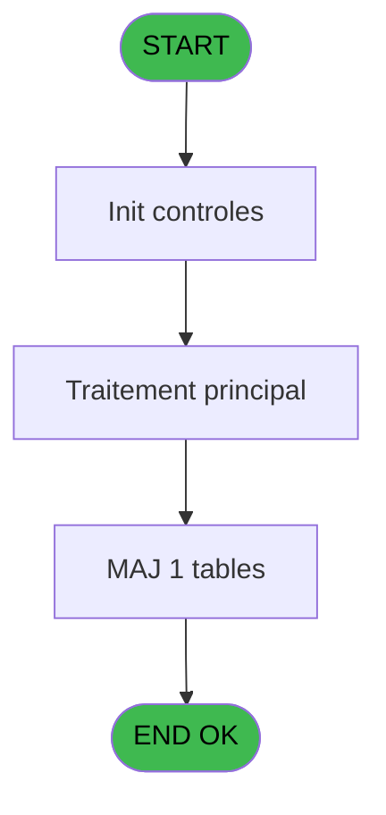
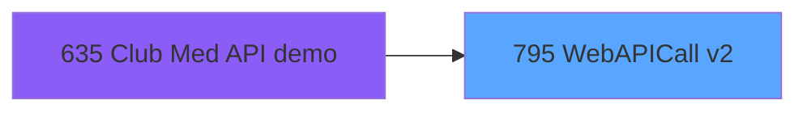

# REF IDE 795 - WebAPICall v2

> **Analyse**: Phases 1-4 2026-02-03 14:24 -> 14:25 (15s) | Assemblage 14:25
> **Pipeline**: V7.2 Enrichi
> **Structure**: 4 onglets (Resume | Ecrans | Donnees | Connexions)

<!-- TAB:Resume -->

## 1. FICHE D'IDENTITE

| Attribut | Valeur |
|----------|--------|
| Projet | REF |
| IDE Position | 795 |
| Nom Programme | WebAPICall v2 |
| Fichier source | `Prg_795.xml` |
| Dossier IDE | General |
| Taches | 2 (0 ecrans visibles) |
| Tables modifiees | 1 |
| Programmes appeles | 0 |

## 2. DESCRIPTION FONCTIONNELLE

**WebAPICall v2** assure la gestion complete de ce processus, accessible depuis [Club Med API demo (IDE 635)](REF-IDE-635.md).

Le flux de traitement s'organise en **1 blocs fonctionnels** :

- **Traitement** (2 taches) : traitements metier divers

**Donnees modifiees** : 1 tables en ecriture (initialisation___ini).

## 3. BLOCS FONCTIONNELS

### 3.1 Traitement (2 taches)

Traitements internes.

---

#### 795 - ClubMedAPICall

**Role** : Traitement : ClubMedAPICall.

---

#### 795.1 - Lecture paramètres API

**Role** : Traitement : Lecture paramètres API.

## 5. REGLES METIER

*(Aucune regle metier identifiee)*

## 6. CONTEXTE

- **Appele par**: [Club Med API demo (IDE 635)](REF-IDE-635.md)
- **Appelle**: 0 programmes | **Tables**: 2 (W:1 R:0 L:1) | **Taches**: 2 | **Expressions**: 21

<!-- TAB:Ecrans -->

## 8. ECRANS

*(Programme sans ecran visible)*

## 9. NAVIGATION

### 9.3 Structure hierarchique (2 taches)

| Position | Tache | Type | Dimensions | Bloc |
|----------|-------|------|------------|------|
| **795.1** | [**ClubMedAPICall** (795)](#t1) | - | - | Traitement |
| 795.1.1 | [Lecture paramètres API (795.1)](#t2) | - | - | |

### 9.4 Algorigramme

> **Legende**: Vert = START/END OK | Rouge = END KO | Bleu = Decisions
> *Algorigramme auto-genere. Utiliser `/algorigramme` pour une synthese metier detaillee.*

<!-- TAB:Donnees -->

## 10. TABLES

### Tables utilisees (2)

| ID | Nom | Description | Type | R | W | L | Usages |
|----|-----|-------------|------|---|---|---|--------|
| 69 | initialisation___ini |  | DB |   | **W** |   | 1 |
| 368 | pms_village |  | DB |   |   | L | 1 |

### Colonnes par table (0 / 1 tables avec colonnes identifiees)

Table 69 - initialisation___ini (**W**) - 1 usages

*Table utilisee uniquement en Link ou aucune colonne Real identifiee dans le DataView.*

## 11. VARIABLES

### 11.1 Parametres entrants (15)

Variables recues du programme appelant ([Club Med API demo (IDE 635)](REF-IDE-635.md)).

| Lettre | Nom | Type | Usage dans |
|--------|-----|------|-----------|
| A | p.i.UrlApi | Alpha | 1x parametre entrant |
| B | p.i.RequestType | Alpha | 2x parametre entrant |
| C | p.i.JsonIN | Blob | 2x parametre entrant |
| D | p.i.ProxyAddress | Alpha | - |
| E | p.o.IsSuccess | Logical | 1x parametre entrant |
| F | p.o.ErrorMessage | Alpha | - |
| G | p.o.JsonResponse | Blob | - |
| H | p.i..UserName | Unicode | - |
| I | p.i.Password | Unicode | - |
| J | p.i.Api Key header | Unicode | - |
| K | p.i.BasicAuth user | Unicode | 3x parametre entrant |
| L | p.i.BasicAuth pwd | Unicode | 1x parametre entrant |
| M | p.i.Ocp-Apim-Subscription-Key | Unicode | - |
| N | p.i.Bearer token | Unicode | 3x parametre entrant |
| O | p.i.Api Key param | Unicode | [795.1](#t2) |

### 11.2 Variables de session (8)

Variables persistantes pendant toute la session.

| Lettre | Nom | Type | Usage dans |
|--------|-----|------|-----------|
| P | v.Api Key param | Unicode | [795.1](#t2) |
| Q | v.Login:Password base64 | Unicode | 1x session |
| R | v.Authentification | Unicode | 2x session |
| S | v.Http header | Unicode | 3x session |
| T | v.Http version | Unicode | - |
| U | v.Http status code | Unicode | 2x session |
| V | v.Http reason phrase | Unicode | 1x session |
| W | v.Url complétée | Unicode | 3x session |

Toutes les 23 variables (liste complete)

| Cat | Lettre | Nom Variable | Type |
|-----|--------|--------------|------|
| P0 | **A** | p.i.UrlApi | Alpha |
| P0 | **B** | p.i.RequestType | Alpha |
| P0 | **C** | p.i.JsonIN | Blob |
| P0 | **D** | p.i.ProxyAddress | Alpha |
| P0 | **E** | p.o.IsSuccess | Logical |
| P0 | **F** | p.o.ErrorMessage | Alpha |
| P0 | **G** | p.o.JsonResponse | Blob |
| P0 | **H** | p.i..UserName | Unicode |
| P0 | **I** | p.i.Password | Unicode |
| P0 | **J** | p.i.Api Key header | Unicode |
| P0 | **K** | p.i.BasicAuth user | Unicode |
| P0 | **L** | p.i.BasicAuth pwd | Unicode |
| P0 | **M** | p.i.Ocp-Apim-Subscription-Key | Unicode |
| P0 | **N** | p.i.Bearer token | Unicode |
| P0 | **O** | p.i.Api Key param | Unicode |
| V. | **P** | v.Api Key param | Unicode |
| V. | **Q** | v.Login:Password base64 | Unicode |
| V. | **R** | v.Authentification | Unicode |
| V. | **S** | v.Http header | Unicode |
| V. | **T** | v.Http version | Unicode |
| V. | **U** | v.Http status code | Unicode |
| V. | **V** | v.Http reason phrase | Unicode |
| V. | **W** | v.Url complétée | Unicode |

## 12. EXPRESSIONS

**21 / 21 expressions decodees (100%)**

### 12.1 Repartition par type

| Type | Expressions | Regles |
|------|-------------|--------|
| CALCULATION | 1 | 0 |
| CONDITION | 7 | 0 |
| OTHER | 9 | 0 |
| NEGATION | 1 | 0 |
| CONCATENATION | 2 | 0 |
| FORMAT | 1 | 0 |

### 12.2 Expressions cles par type

#### CALCULATION (1 expressions)

| Type | IDE | Expression | Regle |
|------|-----|------------|-------|
| CALCULATION | 6 | `HTTPCall(p.i.RequestType [B], Trim(v.Url complétée [W]), '', Trim(v.Authentification [R]), 'accept-language: fr-FR')` | - |

#### CONDITION (7 expressions)

| Type | IDE | Expression | Regle |
|------|-----|------------|-------|
| CONDITION | 16 | `p.i.Bearer token [N]<>''` | - |
| CONDITION | 19 | `v.Api Key param [P]<>''` | - |
| CONDITION | 20 | `p.i.Api Key param [O]=''` | - |
| CONDITION | 15 | `p.i.BasicAuth user [K]<>''` | - |
| CONDITION | 7 | `HTTPCall(p.i.RequestType [B], Trim(v.Url complétée [W]), p.i.JsonIN [C], Trim(v.Authentification [R]), 'Content-Type: application/json; charset=utf-8', 'accept-language: fr-FR')` | - |
| ... | | *+2 autres* | |

#### OTHER (9 expressions)

| Type | IDE | Expression | Regle |
|------|-----|------------|-------|
| OTHER | 13 | `StrBuild('@1@ : @2@', v.Http status code [U], v.Http reason phrase [V])` | - |
| OTHER | 12 | `Range(v.Http status code [U], '200', '209')` | - |
| OTHER | 21 | `p.i.Api Key param [O]` | - |
| OTHER | 17 | `p.i.UrlApi [A]` | - |
| OTHER | 11 | `StrToken (v.Http header [S], 3, '\|')` | - |
| ... | | *+4 autres* | |

#### NEGATION (1 expressions)

| Type | IDE | Expression | Regle |
|------|-----|------------|-------|
| NEGATION | 14 | `NOT p.o.IsSuccess [E]` | - |

#### CONCATENATION (2 expressions)

| Type | IDE | Expression | Regle |
|------|-----|------------|-------|
| CONCATENATION | 18 | `RTrim(v.Url complétée [W]) & '?api_key=' & v.Api Key param [P]` | - |
| CONCATENATION | 3 | `Trim(p.i.BasicAuth user [K]) &':'& Trim(p.i.BasicAuth pwd [L])` | - |

#### FORMAT (1 expressions)

| Type | IDE | Expression | Regle |
|------|-----|------------|-------|
| FORMAT | 8 | `RepStr(RepStr(RTrim(HTTPLastHeader ('')), ' ', '\|'), ASCIIChr (10), '\|')` | - |

### 12.3 Toutes les expressions (21)

Voir les 21 expressions

#### CALCULATION (1)

| IDE | Expression Decodee |
|-----|-------------------|
| 6 | `HTTPCall(p.i.RequestType [B], Trim(v.Url complétée [W]), '', Trim(v.Authentification [R]), 'accept-language: fr-FR')` |

#### CONDITION (7)

| IDE | Expression Decodee |
|-----|-------------------|
| 7 | `HTTPCall(p.i.RequestType [B], Trim(v.Url complétée [W]), p.i.JsonIN [C], Trim(v.Authentification [R]), 'Content-Type: application/json; charset=utf-8', 'accept-language: fr-FR')` |
| 1 | `p.i.BasicAuth user [K]='' AND p.i.Bearer token [N]=''` |
| 2 | `ISNULL(p.i.JsonIN [C]) OR p.i.JsonIN [C]=''` |
| 15 | `p.i.BasicAuth user [K]<>''` |
| 16 | `p.i.Bearer token [N]<>''` |
| 19 | `v.Api Key param [P]<>''` |
| 20 | `p.i.Api Key param [O]=''` |

#### OTHER (9)

| IDE | Expression Decodee |
|-----|-------------------|
| 4 | `'Authorization: Basic ' & v.Login:Password base64 [Q]` |
| 5 | `'Authorization: Bearer ' & p.i.Bearer token [N]` |
| 9 | `StrToken (v.Http header [S], 1, '\|')` |
| 10 | `StrToken (v.Http header [S], 2, '\|')` |
| 11 | `StrToken (v.Http header [S], 3, '\|')` |
| 12 | `Range(v.Http status code [U], '200', '209')` |
| 13 | `StrBuild('@1@ : @2@', v.Http status code [U], v.Http reason phrase [V])` |
| 17 | `p.i.UrlApi [A]` |
| 21 | `p.i.Api Key param [O]` |

#### NEGATION (1)

| IDE | Expression Decodee |
|-----|-------------------|
| 14 | `NOT p.o.IsSuccess [E]` |

#### CONCATENATION (2)

| IDE | Expression Decodee |
|-----|-------------------|
| 3 | `Trim(p.i.BasicAuth user [K]) &':'& Trim(p.i.BasicAuth pwd [L])` |
| 18 | `RTrim(v.Url complétée [W]) & '?api_key=' & v.Api Key param [P]` |

#### FORMAT (1)

| IDE | Expression Decodee |
|-----|-------------------|
| 8 | `RepStr(RepStr(RTrim(HTTPLastHeader ('')), ' ', '\|'), ASCIIChr (10), '\|')` |

<!-- TAB:Connexions -->

## 13. GRAPHE D'APPELS

### 13.1 Chaine depuis Main (Callers)

Main -> ... -> [Club Med API demo (IDE 635)](REF-IDE-635.md) -> **WebAPICall v2 (IDE 795)**

### 13.2 Callers

| IDE | Nom Programme | Nb Appels |
|-----|---------------|-----------|
| [635](REF-IDE-635.md) | Club Med API demo | 1 |

### 13.3 Callees (programmes appeles)

### 13.4 Detail Callees avec contexte

| IDE | Nom Programme | Appels | Contexte |
|-----|---------------|--------|----------|
| - | (aucun) | - | - |

## 14. RECOMMANDATIONS MIGRATION

### 14.1 Profil du programme

| Metrique | Valeur | Impact migration |
|----------|--------|-----------------|
| Lignes de logique | 99 | Programme compact |
| Expressions | 21 | Peu de logique |
| Tables WRITE | 1 | Impact faible |
| Sous-programmes | 0 | Peu de dependances |
| Ecrans visibles | 0 | Ecran unique ou traitement batch |
| Code desactive | 0% (0 / 99) | Code sain |
| Regles metier | 0 | Pas de regle identifiee |

### 14.2 Plan de migration par bloc

#### Traitement (2 taches: 0 ecran, 2 traitements)

- **Strategie** : 2 service(s) backend injectable(s) (Domain Services).
- Decomposer les taches en services unitaires testables.

### 14.3 Dependances critiques

| Dependance | Type | Appels | Impact |
|------------|------|--------|--------|
| initialisation___ini | Table WRITE (Database) | 1x | Schema + repository |

---
*Spec DETAILED generee par Pipeline V7.2 - 2026-02-03 14:25*
