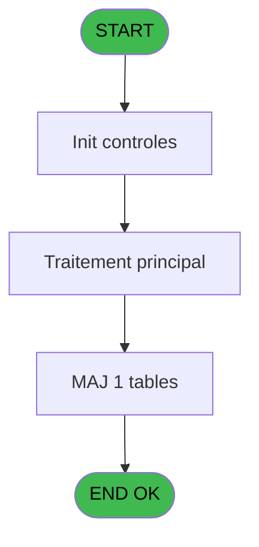

# REF IDE 796 - WebAPICall v3

> **Analyse**: Phases 1-4 2026-02-03 14:25 -> 14:25 (15s) | Assemblage 14:25
> **Pipeline**: V7.2 Enrichi
> **Structure**: 4 onglets (Resume | Ecrans | Donnees | Connexions)

<!-- TAB:Resume -->

## 1. FICHE D'IDENTITE

| Attribut | Valeur |
|----------|--------|
| Projet | REF |
| IDE Position | 796 |
| Nom Programme | WebAPICall v3 |
| Fichier source | `Prg_796.xml` |
| Dossier IDE | General |
| Taches | 4 (0 ecrans visibles) |
| Tables modifiees | 1 |
| Programmes appeles | 0 |
| :warning: Statut | **ORPHELIN_POTENTIEL** |

## 2. DESCRIPTION FONCTIONNELLE

**WebAPICall v3** assure la gestion complete de ce processus.

Le flux de traitement s'organise en **1 blocs fonctionnels** :

- **Traitement** (4 taches) : traitements metier divers

**Donnees modifiees** : 1 tables en ecriture (initialisation___ini).

Detail : phases du traitement

#### Phase 1 : Traitement (4 taches)

- **796** - ClubMedAPICall
- **796.1** - Lecture paramètres API
- **796.2** - Write curl
- **796.3** - XML refresh/access token

#### Tables impactees

| Table | Operations | Role metier |
|-------|-----------|-------------|
| initialisation___ini | **W** (1 usages) |  |

## 3. BLOCS FONCTIONNELS

### 3.1 Traitement (4 taches)

Traitements internes.

---

#### 796 - ClubMedAPICall

**Role** : Traitement : ClubMedAPICall.

3 sous-taches directes

| Tache | Nom | Bloc |
|-------|-----|------|
| [796.1](#t2) | Lecture paramètres API | Traitement |
| [796.2](#t3) | Write curl | Traitement |
| [796.3](#t4) | XML refresh/access token | Traitement |

---

#### 796.1 - Lecture paramètres API

**Role** : Traitement : Lecture paramètres API.

---

#### 796.2 - Write curl

**Role** : Traitement : Write curl.
**Variables liees** : G (p.i.répertoire fichiers curl), O (v.commande CURL), P (v.nom fichier curl bat), Q (v.nom fichier curl reponse)

---

#### 796.3 - XML refresh/access token

**Role** : Traitement : XML refresh/access token.
**Variables liees** : C (p.i.Bearer token)

## 5. REGLES METIER

*(Aucune regle metier identifiee)*

## 6. CONTEXTE

- **Appele par**: (aucun)
- **Appelle**: 0 programmes | **Tables**: 2 (W:1 R:0 L:1) | **Taches**: 4 | **Expressions**: 23

<!-- TAB:Ecrans -->

## 8. ECRANS

*(Programme sans ecran visible)*

## 9. NAVIGATION

### 9.3 Structure hierarchique (4 taches)

| Position | Tache | Type | Dimensions | Bloc |
|----------|-------|------|------------|------|
| **796.1** | [**ClubMedAPICall** (796)](#t1) | - | - | Traitement |
| 796.1.1 | [Lecture paramètres API (796.1)](#t2) | - | - | |
| 796.1.2 | [Write curl (796.2)](#t3) | - | - | |
| 796.1.3 | [XML refresh/access token (796.3)](#t4) | - | - | |

### 9.4 Algorigramme

> **Legende**: Vert = START/END OK | Rouge = END KO | Bleu = Decisions
> *Algorigramme auto-genere. Utiliser `/algorigramme` pour une synthese metier detaillee.*

<!-- TAB:Donnees -->

## 10. TABLES

### Tables utilisees (2)

| ID | Nom | Description | Type | R | W | L | Usages |
|----|-----|-------------|------|---|---|---|--------|
| 69 | initialisation___ini |  | DB |   | **W** |   | 1 |
| 368 | pms_village |  | DB |   |   | L | 1 |

### Colonnes par table (0 / 1 tables avec colonnes identifiees)

Table 69 - initialisation___ini (**W**) - 1 usages

*Table utilisee uniquement en Link ou aucune colonne Real identifiee dans le DataView.*

## 11. VARIABLES

### 11.1 Parametres entrants (11)

Variables recues en parametre.

| Lettre | Nom | Type | Usage dans |
|--------|-----|------|-----------|
| A | p.i.UrlApi | Alpha | 1x parametre entrant |
| B | p.i.JsonIN | Blob | 2x parametre entrant |
| C | p.i.Bearer token | Unicode | [796.3](#t4) |
| D | p.i.Api Key param | Unicode | [796.1](#t2) |
| E | p.i.Proxy adress http | Unicode | 1x parametre entrant |
| F | p.i.nom logement | Alpha | 2x parametre entrant |
| G | p.i.répertoire fichiers curl | Unicode | - |
| H | p.i.répertoire fichiers réponse | Unicode | - |
| I | p.o.IsSuccess | Logical | - |
| J | p.o.ErrorMessage | Alpha | 1x parametre entrant |
| K | p.o.JsonResponse | Blob | 5x parametre entrant |

### 11.2 Variables de session (9)

Variables persistantes pendant toute la session.

| Lettre | Nom | Type | Usage dans |
|--------|-----|------|-----------|
| L | v.Api Key param | Unicode | [796.1](#t2) |
| M | v.Authentification | Unicode | - |
| N | v.Url complétée | Unicode | 2x session |
| O | v.commande CURL | Alpha | - |
| P | v.nom fichier curl bat | Alpha | [796.2](#t3) |
| Q | v.nom fichier curl reponse | Alpha | - |
| R | v.XMLResponse | Blob | - |
| S | v.status | Alpha | - |
| T | v.error code | Alpha | 1x session |

Toutes les 20 variables (liste complete)

| Cat | Lettre | Nom Variable | Type |
|-----|--------|--------------|------|
| P0 | **A** | p.i.UrlApi | Alpha |
| P0 | **B** | p.i.JsonIN | Blob |
| P0 | **C** | p.i.Bearer token | Unicode |
| P0 | **D** | p.i.Api Key param | Unicode |
| P0 | **E** | p.i.Proxy adress http | Unicode |
| P0 | **F** | p.i.nom logement | Alpha |
| P0 | **G** | p.i.répertoire fichiers curl | Unicode |
| P0 | **H** | p.i.répertoire fichiers réponse | Unicode |
| P0 | **I** | p.o.IsSuccess | Logical |
| P0 | **J** | p.o.ErrorMessage | Alpha |
| P0 | **K** | p.o.JsonResponse | Blob |
| V. | **L** | v.Api Key param | Unicode |
| V. | **M** | v.Authentification | Unicode |
| V. | **N** | v.Url complétée | Unicode |
| V. | **O** | v.commande CURL | Alpha |
| V. | **P** | v.nom fichier curl bat | Alpha |
| V. | **Q** | v.nom fichier curl reponse | Alpha |
| V. | **R** | v.XMLResponse | Blob |
| V. | **S** | v.status | Alpha |
| V. | **T** | v.error code | Alpha |

## 12. EXPRESSIONS

**23 / 23 expressions decodees (100%)**

### 12.1 Repartition par type

| Type | Expressions | Regles |
|------|-------------|--------|
| CONCATENATION | 5 | 0 |
| FORMAT | 5 | 0 |
| CONSTANTE | 2 | 0 |
| OTHER | 8 | 0 |
| CONDITION | 2 | 0 |
| CAST_LOGIQUE | 1 | 0 |

### 12.2 Expressions cles par type

#### CONCATENATION (5 expressions)

| Type | IDE | Expression | Regle |
|------|-----|------------|-------|
| CONCATENATION | 4 | `RTrim(v.Url complétée [N]) & '?api_key=' & v.Api Key param [L]` | - |
| CONCATENATION | 8 | `Trim(p.i.répertoire fichier... [H])&Trim(p.i.nom logement [F])&'.txt'` | - |
| CONCATENATION | 23 | `'<?xml version="1.0" encoding="UTF-8"?>' &ASCIIChr(13)& ASCIIChr(10)&DotNet.System.Xml.Linq.XElement.Load(  DotNet.System.Runtime.Serialization.Json.JsonReaderWriterFactory.CreateJsonReader(      p.o.JsonResponse [K],     DotNet.System.Xml.XmlDictionaryReaderQuotas()   )).ToString()` | - |
| CONCATENATION | 9 | `Translate('%club_exe%')&'curl\bin\curl -x '&Trim(p.i.Proxy adress http [E])&' -X POST "'&Trim(v.Url complétée [N])&'"'&' -H "accept: application/json"'&' -H  "authorization: Bearer '&Trim(p.i.Bearer token [C])&'"'&' -H "Content-Type: application/json; charset=utf-8"'&' -d "'&Trim(p.i.JsonIN [B])&'"'& ' >'&Trim(v.nom fichier curl rep... [Q])` | - |
| CONCATENATION | 14 | `Trim(p.i.répertoire fichier... [G])&'Curl-'&Trim(p.i.nom logement [F])&'.bat'` | - |

#### FORMAT (5 expressions)

| Type | IDE | Expression | Regle |
|------|-----|------------|-------|
| FORMAT | 20 | `Trim(RepStr(Trim(Left(p.o.ErrorMessage [J],InStr(p.o.ErrorMessage [J],',')-1)),'"',' '))&' ('&v.error code [T]&')'` | - |
| FORMAT | 17 | `InStr(p.o.JsonResponse [K],'"OK"')>0` | - |
| FORMAT | 19 | `RepStr(Del(p.o.JsonResponse [K],1,InStr(p.o.JsonResponse [K],'"error"')+7),'_',' ')` | - |
| FORMAT | 10 | `'c:\temp\log_ApiCall-'&Trim(Str(Counter(1),'3'))&'.pdf'` | - |
| FORMAT | 18 | `Del(p.o.JsonResponse [K],1,InStr(p.o.JsonResponse [K],'"status_code":')+13)` | - |

#### CONSTANTE (2 expressions)

| Type | IDE | Expression | Regle |
|------|-----|------------|-------|
| CONSTANTE | 22 | `''` | - |
| CONSTANTE | 12 | `'Content-Type: application/json; charset=utf-8'` | - |

#### OTHER (8 expressions)

| Type | IDE | Expression | Regle |
|------|-----|------------|-------|
| OTHER | 13 | `Left(p.o.JsonResponse [K],2000)` | - |
| OTHER | 11 | `Left(p.i.JsonIN [B],2000)` | - |
| OTHER | 16 | `File2Blb(v.nom fichier curl rep... [Q])` | - |
| OTHER | 15 | `v.nom fichier curl bat [P]` | - |
| OTHER | 2 | `'Authorization: Bearer ' & p.i.Bearer token [C]` | - |
| ... | | *+3 autres* | |

#### CONDITION (2 expressions)

| Type | IDE | Expression | Regle |
|------|-----|------------|-------|
| CONDITION | 6 | `v.Api Key param [L]=''` | - |
| CONDITION | 5 | `v.Api Key param [L]<>''` | - |

#### CAST_LOGIQUE (1 expressions)

| Type | IDE | Expression | Regle |
|------|-----|------------|-------|
| CAST_LOGIQUE | 21 | `'FALSE'LOG` | - |

### 12.3 Toutes les expressions (23)

Voir les 23 expressions

#### CONCATENATION (5)

| IDE | Expression Decodee |
|-----|-------------------|
| 9 | `Translate('%club_exe%')&'curl\bin\curl -x '&Trim(p.i.Proxy adress http [E])&' -X POST "'&Trim(v.Url complétée [N])&'"'&' -H "accept: application/json"'&' -H  "authorization: Bearer '&Trim(p.i.Bearer token [C])&'"'&' -H "Content-Type: application/json; charset=utf-8"'&' -d "'&Trim(p.i.JsonIN [B])&'"'& ' >'&Trim(v.nom fichier curl rep... [Q])` |
| 14 | `Trim(p.i.répertoire fichier... [G])&'Curl-'&Trim(p.i.nom logement [F])&'.bat'` |
| 23 | `'<?xml version="1.0" encoding="UTF-8"?>' &ASCIIChr(13)& ASCIIChr(10)&DotNet.System.Xml.Linq.XElement.Load(  DotNet.System.Runtime.Serialization.Json.JsonReaderWriterFactory.CreateJsonReader(      p.o.JsonResponse [K],     DotNet.System.Xml.XmlDictionaryReaderQuotas()   )).ToString()` |
| 4 | `RTrim(v.Url complétée [N]) & '?api_key=' & v.Api Key param [L]` |
| 8 | `Trim(p.i.répertoire fichier... [H])&Trim(p.i.nom logement [F])&'.txt'` |

#### FORMAT (5)

| IDE | Expression Decodee |
|-----|-------------------|
| 10 | `'c:\temp\log_ApiCall-'&Trim(Str(Counter(1),'3'))&'.pdf'` |
| 18 | `Del(p.o.JsonResponse [K],1,InStr(p.o.JsonResponse [K],'"status_code":')+13)` |
| 19 | `RepStr(Del(p.o.JsonResponse [K],1,InStr(p.o.JsonResponse [K],'"error"')+7),'_',' ')` |
| 20 | `Trim(RepStr(Trim(Left(p.o.ErrorMessage [J],InStr(p.o.ErrorMessage [J],',')-1)),'"',' '))&' ('&v.error code [T]&')'` |
| 17 | `InStr(p.o.JsonResponse [K],'"OK"')>0` |

#### CONSTANTE (2)

| IDE | Expression Decodee |
|-----|-------------------|
| 12 | `'Content-Type: application/json; charset=utf-8'` |
| 22 | `''` |

#### OTHER (8)

| IDE | Expression Decodee |
|-----|-------------------|
| 1 | `Counter(1)` |
| 2 | `'Authorization: Bearer ' & p.i.Bearer token [C]` |
| 3 | `p.i.UrlApi [A]` |
| 7 | `p.i.Api Key param [D]` |
| 11 | `Left(p.i.JsonIN [B],2000)` |
| 13 | `Left(p.o.JsonResponse [K],2000)` |
| 15 | `v.nom fichier curl bat [P]` |
| 16 | `File2Blb(v.nom fichier curl rep... [Q])` |

#### CONDITION (2)

| IDE | Expression Decodee |
|-----|-------------------|
| 5 | `v.Api Key param [L]<>''` |
| 6 | `v.Api Key param [L]=''` |

#### CAST_LOGIQUE (1)

| IDE | Expression Decodee |
|-----|-------------------|
| 21 | `'FALSE'LOG` |

<!-- TAB:Connexions -->

## 13. GRAPHE D'APPELS

### 13.1 Chaine depuis Main (Callers)

**Chemin**: (pas de callers directs)

### 13.2 Callers

| IDE | Nom Programme | Nb Appels |
|-----|---------------|-----------|
| - | (aucun) | - |

### 13.3 Callees (programmes appeles)

### 13.4 Detail Callees avec contexte

| IDE | Nom Programme | Appels | Contexte |
|-----|---------------|--------|----------|
| - | (aucun) | - | - |

## 14. RECOMMANDATIONS MIGRATION

### 14.1 Profil du programme

| Metrique | Valeur | Impact migration |
|----------|--------|-----------------|
| Lignes de logique | 91 | Programme compact |
| Expressions | 23 | Peu de logique |
| Tables WRITE | 1 | Impact faible |
| Sous-programmes | 0 | Peu de dependances |
| Ecrans visibles | 0 | Ecran unique ou traitement batch |
| Code desactive | 0% (0 / 91) | Code sain |
| Regles metier | 0 | Pas de regle identifiee |

### 14.2 Plan de migration par bloc

#### Traitement (4 taches: 0 ecran, 4 traitements)

- **Strategie** : 4 service(s) backend injectable(s) (Domain Services).
- Decomposer les taches en services unitaires testables.

### 14.3 Dependances critiques

| Dependance | Type | Appels | Impact |
|------------|------|--------|--------|
| initialisation___ini | Table WRITE (Database) | 1x | Schema + repository |

---
*Spec DETAILED generee par Pipeline V7.2 - 2026-02-03 14:25*
