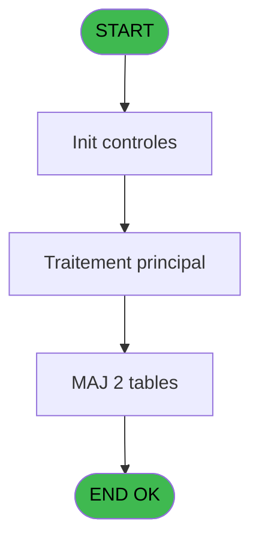

# REF IDE 797 - Booker v5 token

> **Analyse**: Phases 1-4 2026-02-03 14:25 -> 14:25 (16s) | Assemblage 14:25
> **Pipeline**: V7.2 Enrichi
> **Structure**: 4 onglets (Resume | Ecrans | Donnees | Connexions)

<!-- TAB:Resume -->

## 1. FICHE D'IDENTITE

| Attribut | Valeur |
|----------|--------|
| Projet | REF |
| IDE Position | 797 |
| Nom Programme | Booker v5 token |
| Fichier source | `Prg_797.xml` |
| Dossier IDE | General |
| Taches | 4 (0 ecrans visibles) |
| Tables modifiees | 2 |
| Programmes appeles | 0 |
| :warning: Statut | **ORPHELIN_POTENTIEL** |

## 2. DESCRIPTION FONCTIONNELLE

**Booker v5 token** assure la gestion complete de ce processus.

Le flux de traitement s'organise en **1 blocs fonctionnels** :

- **Traitement** (4 taches) : traitements metier divers

**Donnees modifiees** : 2 tables en ecriture (pv_parametre_generaux, log_booker).

Detail : phases du traitement

#### Phase 1 : Traitement (4 taches)

- **797** - Booker v5 token
- **797.1** - XML refresh/access token
- **797.2** - Maj token
- **797.3** - Màj log

#### Tables impactees

| Table | Operations | Role metier |
|-------|-----------|-------------|
| pv_parametre_generaux | R/**W** (2 usages) |  |
| log_booker | **W** (1 usages) |  |

## 3. BLOCS FONCTIONNELS

### 3.1 Traitement (4 taches)

Traitements internes.

---

#### 797 - Booker v5 token

**Role** : Traitement : Booker v5 token.

3 sous-taches directes

| Tache | Nom | Bloc |
|-------|-----|------|
| [797.1](#t2) | XML refresh/access token | Traitement |
| [797.2](#t3) | Maj token | Traitement |
| [797.3](#t4) | Màj log | Traitement |

**Variables liees** : B (p.o.Access Token), I (v.Access Token), J (v.Refresh Token), K (v.Token type), M (v.Token mis à jour ?)

---

#### 797.1 - XML refresh/access token

**Role** : Traitement : XML refresh/access token.
**Variables liees** : B (p.o.Access Token), I (v.Access Token), J (v.Refresh Token), K (v.Token type), M (v.Token mis à jour ?)

---

#### 797.2 - Maj token

**Role** : Traitement : Maj token.
**Variables liees** : B (p.o.Access Token), I (v.Access Token), J (v.Refresh Token), K (v.Token type), M (v.Token mis à jour ?)

---

#### 797.3 - Màj log

**Role** : Traitement : Màj log.

## 5. REGLES METIER

*(Aucune regle metier identifiee)*

## 6. CONTEXTE

- **Appele par**: (aucun)
- **Appelle**: 0 programmes | **Tables**: 2 (W:2 R:1 L:0) | **Taches**: 4 | **Expressions**: 15

<!-- TAB:Ecrans -->

## 8. ECRANS

*(Programme sans ecran visible)*

## 9. NAVIGATION

### 9.3 Structure hierarchique (4 taches)

| Position | Tache | Type | Dimensions | Bloc |
|----------|-------|------|------------|------|
| **797.1** | [**Booker v5 token** (797)](#t1) | - | - | Traitement |
| 797.1.1 | [XML refresh/access token (797.1)](#t2) | - | - | |
| 797.1.2 | [Maj token (797.2)](#t3) | - | - | |
| 797.1.3 | [Màj log (797.3)](#t4) | - | - | |

### 9.4 Algorigramme

> **Legende**: Vert = START/END OK | Rouge = END KO | Bleu = Decisions
> *Algorigramme auto-genere. Utiliser `/algorigramme` pour une synthese metier detaillee.*

<!-- TAB:Donnees -->

## 10. TABLES

### Tables utilisees (2)

| ID | Nom | Description | Type | R | W | L | Usages |
|----|-----|-------------|------|---|---|---|--------|
| 710 | pv_parametre_generaux |  | DB | R | **W** |   | 2 |
| 911 | log_booker |  | DB |   | **W** |   | 1 |

### Colonnes par table (1 / 2 tables avec colonnes identifiees)

Table 710 - pv_parametre_generaux (R/**W**) - 2 usages

| Lettre | Variable | Acces | Type |
|--------|----------|-------|------|
| E | v.JSonResponse | W | Blob |
| F | v.XML response | W | Blob |

Table 911 - log_booker (**W**) - 1 usages

*Table utilisee uniquement en Link ou aucune colonne Real identifiee dans le DataView.*

## 11. VARIABLES

### 11.1 Parametres entrants (2)

Variables recues en parametre.

| Lettre | Nom | Type | Usage dans |
|--------|-----|------|-----------|
| A | p.i.Service | Unicode | 2x parametre entrant |
| B | p.o.Access Token | Unicode | - |

### 11.2 Variables de session (12)

Variables persistantes pendant toute la session.

| Lettre | Nom | Type | Usage dans |
|--------|-----|------|-----------|
| C | v.Service | Unicode | - |
| D | v.UrlApi | Unicode | 1x session |
| E | v.JSonResponse | Blob | 2x session |
| F | v.XML response | Blob | - |
| G | v.IsSuccess | Logical | - |
| H | v.ErrorMessage | Alpha | 2x session |
| I | v.Access Token | Unicode | - |
| J | v.Refresh Token | Unicode | - |
| K | v.Token type | Unicode | - |
| L | v.Expiration | Unicode | - |
| M | v.Token mis à jour ? | Logical | - |
| N | v.Infos mises à jour | Unicode | 2x session |

## 12. EXPRESSIONS

**15 / 15 expressions decodees (100%)**

### 12.1 Repartition par type

| Type | Expressions | Regles |
|------|-------------|--------|
| CONCATENATION | 3 | 0 |
| CONSTANTE | 3 | 0 |
| FORMAT | 1 | 0 |
| OTHER | 4 | 0 |
| CONDITION | 4 | 0 |

### 12.2 Expressions cles par type

#### CONCATENATION (3 expressions)

| Type | IDE | Expression | Regle |
|------|-----|------------|-------|
| CONCATENATION | 14 | `RTrim([V]) & ASCIIChr(13) & ASCIIChr(10) & 'Retour json en erreur'` | - |
| CONCATENATION | 5 | `'<?xml version="1.0" encoding="UTF-8"?>' &
ASCIIChr(13)& ASCIIChr(10)&
DotNet.System.Xml.Linq.XElement.Load(
  DotNet.System.Runtime.Serialization.Json.JsonReaderWriterFactory.CreateJsonReader( 
     [S],
     DotNet.System.Xml.XmlDictionaryReaderQuotas()
   )
).ToString()` | - |
| CONCATENATION | 2 | `Trim(v.ErrorMessage [H])&'/v5/auth/connect/token'` | - |

#### CONSTANTE (3 expressions)

| Type | IDE | Expression | Regle |
|------|-----|------------|-------|
| CONSTANTE | 10 | `'!'` | - |
| CONSTANTE | 3 | `''` | - |
| CONSTANTE | 1 | `'https://api.booker.com/v5/auth/connect/token'` | - |

#### FORMAT (1 expressions)

| Type | IDE | Expression | Regle |
|------|-----|------------|-------|
| FORMAT | 15 | `StrBuild('Entrée : Date @3@ @4@, Refresh Token @1@, Access token @2@', v.Infos mises à jour [N], [Q], DStr([O], 'YYYY-MM-DD'), TStr([P],'HH:MM:SS'))` | - |

#### OTHER (4 expressions)

| Type | IDE | Expression | Regle |
|------|-----|------------|-------|
| OTHER | 9 | `p.i.Service [A]` | - |
| OTHER | 13 | `StrBuild('Refresh token non renseigné pour @1@', v.JSonResponse [E])` | - |
| OTHER | 4 | `v.JSonResponse [E]` | - |
| OTHER | 8 | `v.UrlApi [D]` | - |

#### CONDITION (4 expressions)

| Type | IDE | Expression | Regle |
|------|-----|------------|-------|
| CONDITION | 12 | `v.Infos mises à jour [N]<>''` | - |
| CONDITION | 11 | `InStr (v.ErrorMessage [H],'webservice4')>0` | - |
| CONDITION | 6 | `[Y]='Bearer' AND [W]<>'' AND [X]<>''` | - |
| CONDITION | 7 | `p.i.Service [A]=''` | - |

<!-- TAB:Connexions -->

## 13. GRAPHE D'APPELS

### 13.1 Chaine depuis Main (Callers)

**Chemin**: (pas de callers directs)

### 13.2 Callers

| IDE | Nom Programme | Nb Appels |
|-----|---------------|-----------|
| - | (aucun) | - |

### 13.3 Callees (programmes appeles)

### 13.4 Detail Callees avec contexte

| IDE | Nom Programme | Appels | Contexte |
|-----|---------------|--------|----------|
| - | (aucun) | - | - |

## 14. RECOMMANDATIONS MIGRATION

### 14.1 Profil du programme

| Metrique | Valeur | Impact migration |
|----------|--------|-----------------|
| Lignes de logique | 150 | Programme compact |
| Expressions | 15 | Peu de logique |
| Tables WRITE | 2 | Impact faible |
| Sous-programmes | 0 | Peu de dependances |
| Ecrans visibles | 0 | Ecran unique ou traitement batch |
| Code desactive | 0% (0 / 150) | Code sain |
| Regles metier | 0 | Pas de regle identifiee |

### 14.2 Plan de migration par bloc

#### Traitement (4 taches: 0 ecran, 4 traitements)

- **Strategie** : 4 service(s) backend injectable(s) (Domain Services).
- Decomposer les taches en services unitaires testables.

### 14.3 Dependances critiques

| Dependance | Type | Appels | Impact |
|------------|------|--------|--------|
| pv_parametre_generaux | Table WRITE (Database) | 1x | Schema + repository |
| log_booker | Table WRITE (Database) | 1x | Schema + repository |

---
*Spec DETAILED generee par Pipeline V7.2 - 2026-02-03 14:25*
