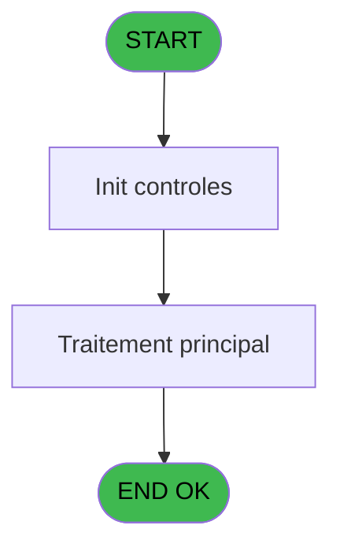
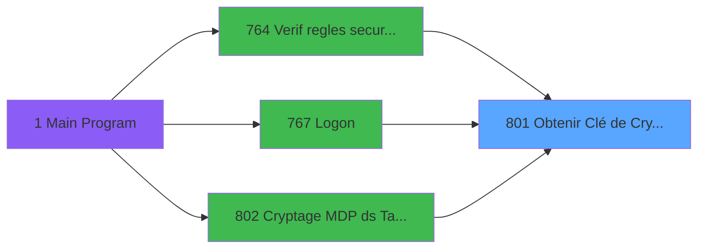

# REF IDE 801 - Obtenir Clé de Cryptage

> **Analyse**: Phases 1-4 2026-02-03 14:27 -> 14:27 (14s) | Assemblage 14:27
> **Pipeline**: V7.2 Enrichi
> **Structure**: 4 onglets (Resume | Ecrans | Donnees | Connexions)

<!-- TAB:Resume -->

## 1. FICHE D'IDENTITE

| Attribut | Valeur |
|----------|--------|
| Projet | REF |
| IDE Position | 801 |
| Nom Programme | Obtenir Clé de Cryptage |
| Fichier source | `Prg_801.xml` |
| Dossier IDE | General |
| Taches | 1 (0 ecrans visibles) |
| Tables modifiees | 0 |
| Programmes appeles | 0 |

## 2. DESCRIPTION FONCTIONNELLE

**Obtenir Clé de Cryptage** assure la gestion complete de ce processus, accessible depuis [Verif regles securite crypté (IDE 764)](REF-IDE-764.md), [Logon (IDE 767)](REF-IDE-767.md), [Cryptage MDP ds Tables - Once (IDE 802)](REF-IDE-802.md).

Le flux de traitement s'organise en **1 blocs fonctionnels** :

- **Traitement** (1 tache) : traitements metier divers

## 3. BLOCS FONCTIONNELS

### 3.1 Traitement (1 tache)

Traitements internes.

---

#### 801 - Obtenir Clé de Cryptage

**Role** : Traitement : Obtenir Clé de Cryptage.

## 5. REGLES METIER

*(Aucune regle metier identifiee)*

## 6. CONTEXTE

- **Appele par**: [Verif regles securite crypté (IDE 764)](REF-IDE-764.md), [Logon (IDE 767)](REF-IDE-767.md), [Cryptage MDP ds Tables - Once (IDE 802)](REF-IDE-802.md)
- **Appelle**: 0 programmes | **Tables**: 0 (W:0 R:0 L:0) | **Taches**: 1 | **Expressions**: 2

<!-- TAB:Ecrans -->

## 8. ECRANS

*(Programme sans ecran visible)*

## 9. NAVIGATION

### 9.3 Structure hierarchique (1 tache)

| Position | Tache | Type | Dimensions | Bloc |
|----------|-------|------|------------|------|
| **801.1** | [**Obtenir Clé de Cryptage** (801)](#t1) | - | - | Traitement |

### 9.4 Algorigramme

> **Legende**: Vert = START/END OK | Rouge = END KO | Bleu = Decisions
> *Algorigramme auto-genere. Utiliser `/algorigramme` pour une synthese metier detaillee.*

<!-- TAB:Donnees -->

## 10. TABLES

### Tables utilisees (0)

| ID | Nom | Description | Type | R | W | L | Usages |
|----|-----|-------------|------|---|---|---|--------|

### Colonnes par table (0 / 0 tables avec colonnes identifiees)

## 11. VARIABLES

### 11.1 Parametres entrants (2)

Variables recues du programme appelant ([Verif regles securite crypté (IDE 764)](REF-IDE-764.md)).

| Lettre | Nom | Type | Usage dans |
|--------|-----|------|-----------|
| A | Pi.Nom Clé | Alpha | 1x parametre entrant |
| B | PO.Valeur Clé | Blob | - |

### 11.2 Variables de session (2)

Variables persistantes pendant toute la session.

| Lettre | Nom | Type | Usage dans |
|--------|-----|------|-----------|
| C | V.Noms | Blob | - |
| D | V.Valeurs | Blob | - |

## 12. EXPRESSIONS

**2 / 2 expressions decodees (100%)**

### 12.1 Repartition par type

| Type | Expressions | Regles |
|------|-------------|--------|
| CONSTANTE | 1 | 0 |
| CONDITION | 1 | 0 |

### 12.2 Expressions cles par type

#### CONSTANTE (1 expressions)

| Type | IDE | Expression | Regle |
|------|-----|------------|-------|
| CONSTANTE | 2 | `'GoWMem1Tai2Maria3Dom'` | - |

#### CONDITION (1 expressions)

| Type | IDE | Expression | Regle |
|------|-----|------------|-------|
| CONDITION | 1 | `Pi.Nom Clé [A]='PASSWORD'` | - |

<!-- TAB:Connexions -->

## 13. GRAPHE D'APPELS

### 13.1 Chaine depuis Main (Callers)

Main -> ... -> [Verif regles securite crypté (IDE 764)](REF-IDE-764.md) -> **Obtenir Clé de Cryptage (IDE 801)**

Main -> ... -> [Logon (IDE 767)](REF-IDE-767.md) -> **Obtenir Clé de Cryptage (IDE 801)**

Main -> ... -> [Cryptage MDP ds Tables - Once (IDE 802)](REF-IDE-802.md) -> **Obtenir Clé de Cryptage (IDE 801)**

### 13.2 Callers

| IDE | Nom Programme | Nb Appels |
|-----|---------------|-----------|
| [764](REF-IDE-764.md) | Verif regles securite crypté | 1 |
| [767](REF-IDE-767.md) | Logon | 1 |
| [802](REF-IDE-802.md) | Cryptage MDP ds Tables - Once | 1 |

### 13.3 Callees (programmes appeles)

### 13.4 Detail Callees avec contexte

| IDE | Nom Programme | Appels | Contexte |
|-----|---------------|--------|----------|
| - | (aucun) | - | - |

## 14. RECOMMANDATIONS MIGRATION

### 14.1 Profil du programme

| Metrique | Valeur | Impact migration |
|----------|--------|-----------------|
| Lignes de logique | 9 | Programme compact |
| Expressions | 2 | Peu de logique |
| Tables WRITE | 0 | Impact faible |
| Sous-programmes | 0 | Peu de dependances |
| Ecrans visibles | 0 | Ecran unique ou traitement batch |
| Code desactive | 0% (0 / 9) | Code sain |
| Regles metier | 0 | Pas de regle identifiee |

### 14.2 Plan de migration par bloc

#### Traitement (1 tache: 0 ecran, 1 traitement)

- **Strategie** : 1 service(s) backend injectable(s) (Domain Services).
- Decomposer les taches en services unitaires testables.

### 14.3 Dependances critiques

| Dependance | Type | Appels | Impact |
|------------|------|--------|--------|

---
*Spec DETAILED generee par Pipeline V7.2 - 2026-02-03 14:27*
