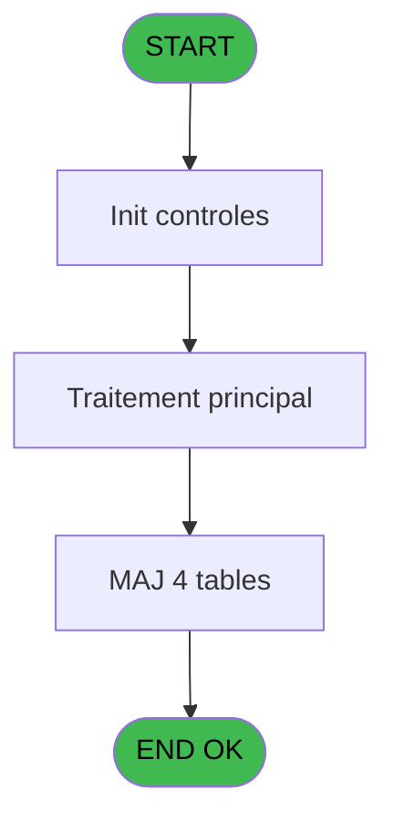
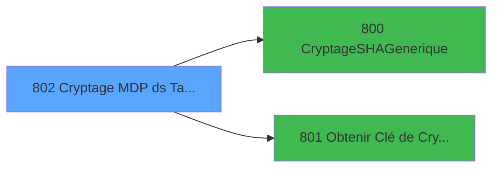

# REF IDE 802 - Cryptage MDP ds Tables - Once

> **Analyse**: Phases 1-4 2026-02-03 14:27 -> 14:27 (15s) | Assemblage 14:27
> **Pipeline**: V7.2 Enrichi
> **Structure**: 4 onglets (Resume | Ecrans | Donnees | Connexions)

<!-- TAB:Resume -->

## 1. FICHE D'IDENTITE

| Attribut | Valeur |
|----------|--------|
| Projet | REF |
| IDE Position | 802 |
| Nom Programme | Cryptage MDP ds Tables - Once |
| Fichier source | `Prg_802.xml` |
| Dossier IDE | General |
| Taches | 5 (0 ecrans visibles) |
| Tables modifiees | 4 |
| Programmes appeles | 2 |

## 2. DESCRIPTION FONCTIONNELLE

**Cryptage MDP ds Tables - Once** assure la gestion complete de ce processus, accessible depuis [Main Program (IDE 1)](REF-IDE-1.md).

Le flux de traitement s'organise en **1 blocs fonctionnels** :

- **Traitement** (5 taches) : traitements metier divers

**Donnees modifiees** : 4 tables en ecriture (utilisateur______uti, projet, password_interdit, password_historique).

Detail : phases du traitement

#### Phase 1 : Traitement (5 taches)

- **802** - Cryptage MDP ds Tables - Once **[[ECRAN]](#ecran-t1)**
- **802.1** - Passeword_Historique
- **802.2** - User_dat
- **802.3** - Passeword_interdit
- **802.4** - Update Version

Delegue a : [CryptageSHAGenerique (IDE 800)](REF-IDE-800.md), [Obtenir Clé de Cryptage (IDE 801)](REF-IDE-801.md)

#### Tables impactees

| Table | Operations | Role metier |
|-------|-----------|-------------|
| projet | **W** (1 usages) |  |
| password_interdit | **W** (1 usages) |  |
| password_historique | **W** (1 usages) | Historique / journal |
| utilisateur______uti | **W** (1 usages) |  |

## 3. BLOCS FONCTIONNELS

### 3.1 Traitement (5 taches)

Traitements internes.

---

#### 802 - Cryptage MDP ds Tables - Once [[ECRAN]](#ecran-t1)

**Role** : Traitement : Cryptage MDP ds Tables - Once.
**Ecran** : 337 x 17 DLU | [Voir mockup](#ecran-t1)

4 sous-taches directes

| Tache | Nom | Bloc |
|-------|-----|------|
| [802.1](#t2) | Passeword_Historique | Traitement |
| [802.2](#t3) | User_dat | Traitement |
| [802.3](#t4) | Passeword_interdit | Traitement |
| [802.4](#t5) | Update Version | Traitement |

**Delegue a** : [CryptageSHAGenerique (IDE 800)](REF-IDE-800.md), [Obtenir Clé de Cryptage (IDE 801)](REF-IDE-801.md)

---

#### 802.1 - Passeword_Historique

**Role** : Consultation/chargement : Passeword_Historique.
**Delegue a** : [CryptageSHAGenerique (IDE 800)](REF-IDE-800.md), [Obtenir Clé de Cryptage (IDE 801)](REF-IDE-801.md)

---

#### 802.2 - User_dat

**Role** : Traitement : User_dat.
**Delegue a** : [CryptageSHAGenerique (IDE 800)](REF-IDE-800.md), [Obtenir Clé de Cryptage (IDE 801)](REF-IDE-801.md)

---

#### 802.3 - Passeword_interdit

**Role** : Traitement : Passeword_interdit.
**Delegue a** : [CryptageSHAGenerique (IDE 800)](REF-IDE-800.md), [Obtenir Clé de Cryptage (IDE 801)](REF-IDE-801.md)

---

#### 802.4 - Update Version

**Role** : Traitement : Update Version.
**Delegue a** : [CryptageSHAGenerique (IDE 800)](REF-IDE-800.md), [Obtenir Clé de Cryptage (IDE 801)](REF-IDE-801.md)

## 5. REGLES METIER

*(Aucune regle metier identifiee)*

## 6. CONTEXTE

- **Appele par**: [Main Program (IDE 1)](REF-IDE-1.md)
- **Appelle**: 2 programmes | **Tables**: 4 (W:4 R:0 L:0) | **Taches**: 5 | **Expressions**: 1

<!-- TAB:Ecrans -->

## 8. ECRANS

*(Programme sans ecran visible)*

## 9. NAVIGATION

### 9.3 Structure hierarchique (5 taches)

| Position | Tache | Type | Dimensions | Bloc |
|----------|-------|------|------------|------|
| **802.1** | [**Cryptage MDP ds Tables - Once** (802)](#t1) [mockup](#ecran-t1) | - | 337x17 | Traitement |
| 802.1.1 | [Passeword_Historique (802.1)](#t2) | - | - | |
| 802.1.2 | [User_dat (802.2)](#t3) | - | - | |
| 802.1.3 | [Passeword_interdit (802.3)](#t4) | - | - | |
| 802.1.4 | [Update Version (802.4)](#t5) | - | - | |

### 9.4 Algorigramme

> **Legende**: Vert = START/END OK | Rouge = END KO | Bleu = Decisions
> *Algorigramme auto-genere. Utiliser `/algorigramme` pour une synthese metier detaillee.*

<!-- TAB:Donnees -->

## 10. TABLES

### Tables utilisees (4)

| ID | Nom | Description | Type | R | W | L | Usages |
|----|-----|-------------|------|---|---|---|--------|
| 718 | utilisateur______uti |  | DB |   | **W** |   | 1 |
| 746 | projet |  | DB |   | **W** |   | 1 |
| 748 | password_interdit |  | DB |   | **W** |   | 1 |
| 749 | password_historique | Historique / journal | DB |   | **W** |   | 1 |

### Colonnes par table (0 / 4 tables avec colonnes identifiees)

Table 718 - utilisateur______uti (**W**) - 1 usages

*Table utilisee uniquement en Link ou aucune colonne Real identifiee dans le DataView.*

Table 746 - projet (**W**) - 1 usages

*Table utilisee uniquement en Link ou aucune colonne Real identifiee dans le DataView.*

Table 748 - password_interdit (**W**) - 1 usages

*Table utilisee uniquement en Link ou aucune colonne Real identifiee dans le DataView.*

Table 749 - password_historique (**W**) - 1 usages

*Table utilisee uniquement en Link ou aucune colonne Real identifiee dans le DataView.*

## 11. VARIABLES

*(Programme sans variables locales mappees)*

## 12. EXPRESSIONS

**1 / 1 expressions decodees (100%)**

### 12.1 Repartition par type

| Type | Expressions | Regles |
|------|-------------|--------|
| CONSTANTE | 1 | 0 |

### 12.2 Expressions cles par type

#### CONSTANTE (1 expressions)

| Type | IDE | Expression | Regle |
|------|-----|------------|-------|
| CONSTANTE | 1 | `'PASSWORD'` | - |

<!-- TAB:Connexions -->

## 13. GRAPHE D'APPELS

### 13.1 Chaine depuis Main (Callers)

Main -> ... -> [Main Program (IDE 1)](REF-IDE-1.md) -> **Cryptage MDP ds Tables - Once (IDE 802)**

### 13.2 Callers

| IDE | Nom Programme | Nb Appels |
|-----|---------------|-----------|
| [1](REF-IDE-1.md) | Main Program | 1 |

### 13.3 Callees (programmes appeles)

### 13.4 Detail Callees avec contexte

| IDE | Nom Programme | Appels | Contexte |
|-----|---------------|--------|----------|
| [800](REF-IDE-800.md) | CryptageSHAGenerique | 3 | Sous-programme |
| [801](REF-IDE-801.md) | Obtenir Clé de Cryptage | 1 | Sous-programme |

## 14. RECOMMANDATIONS MIGRATION

### 14.1 Profil du programme

| Metrique | Valeur | Impact migration |
|----------|--------|-----------------|
| Lignes de logique | 36 | Programme compact |
| Expressions | 1 | Peu de logique |
| Tables WRITE | 4 | Impact modere |
| Sous-programmes | 2 | Peu de dependances |
| Ecrans visibles | 0 | Ecran unique ou traitement batch |
| Code desactive | 0% (0 / 36) | Code sain |
| Regles metier | 0 | Pas de regle identifiee |

### 14.2 Plan de migration par bloc

#### Traitement (5 taches: 1 ecran, 4 traitements)

- **Strategie** : Orchestrateur avec 1 ecrans (Razor/React) et 4 traitements backend (services).
- Les ecrans deviennent des composants UI, les traitements invisibles deviennent des services injectables.
- 2 sous-programme(s) a migrer ou a reutiliser depuis les services existants.
- Decomposer les taches en services unitaires testables.

### 14.3 Dependances critiques

| Dependance | Type | Appels | Impact |
|------------|------|--------|--------|
| utilisateur______uti | Table WRITE (Database) | 1x | Schema + repository |
| projet | Table WRITE (Database) | 1x | Schema + repository |
| password_interdit | Table WRITE (Database) | 1x | Schema + repository |
| password_historique | Table WRITE (Database) | 1x | Schema + repository |
| [CryptageSHAGenerique (IDE 800)](REF-IDE-800.md) | Sous-programme | 3x | **CRITIQUE** - Sous-programme |
| [Obtenir Clé de Cryptage (IDE 801)](REF-IDE-801.md) | Sous-programme | 1x | Normale - Sous-programme |

---
*Spec DETAILED generee par Pipeline V7.2 - 2026-02-03 14:27*
